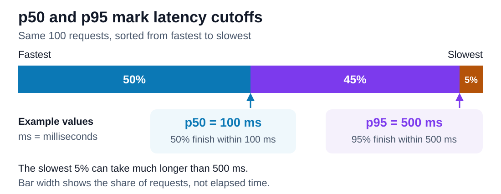

# p50 vs p95

<sub>[Back to Computer Science](../Readme.md#content)</sub>

# Front

What do p50 and p95 request latencies tell you, and how can you measure them automatically?

# Back

**Latency** is how long a request takes. A **percentile** is a cutoff in measurements sorted from smallest to largest. **p50** is the 50th percentile, or **median**: it describes a typical request. **p95** is the 95th percentile: about 95% of requests take no longer than this value; about 5% take longer.

## Read an example

Suppose one measurement window gives **p50 = 100 milliseconds (ms)** and **p95 = 500 ms**. Roughly half the requests finish within 100 ms, and 95% finish within 500 ms. These are percentages of **requests**, not users.

Read left to right: the same requests are sorted fastest to slowest. Bar width represents their share, not elapsed time.



The **slow tail** contains unusually slow requests. A low p50 can hide a slow tail; p95 helps expose it. **p95 is neither the maximum nor the average of the slowest 5%**: those requests can take much longer.

## Load-test a Java service

**k6 is a good choice for load-testing Java backend services**, including Spring Boot. It generates requests and records durations. Start your Java backend, install k6, and save `latency.js`. Replace the example address with a route in your service:

```javascript
import http from 'k6/http';

export default function () {
  http.get('http://127.0.0.1:8080/books');
}
```

Warm up the service separately, then measure five concurrent simulated users for five minutes. Adjust traffic and test data to match real use:

```bash
k6 run --vus 5 --duration 5m \
  --summary-trend-stats 'med,p(95)' latency.js
```

In the final **`http_req_duration`** result, **`med` = p50** and **`p(95)` = p95**. This client metric includes sending, waiting, and receiving; it excludes initial address lookup and connection setup. Check failures too: a fast error is not a successful request.

## Measure inside Spring Boot

For a local test, add `spring-boot-starter-actuator` and `micrometer-registry-prometheus`. Spring Boot uses Micrometer to time web requests automatically. Enable a **histogram** (counts grouped by duration) in `application.properties`:

```properties
management.endpoints.web.exposure.include=health,prometheus
management.metrics.distribution.percentiles-histogram.http.server.requests=true
```

Configure a Prometheus job named `java` to collect `/actuator/prometheus` from your service. This PromQL query estimates p95 for `/books` over the last five minutes:

```promql
histogram_quantile(0.95, sum by (le) (
  rate(http_server_requests_seconds_bucket{job="java",uri="/books"}[5m])
))
```

Use `0.50` for p50; results are in **seconds**. `le` identifies each bucket's upper limit; the sum combines bucket counts across instances. This also works with live traffic. Server and client timings cover different work; compare the same route and window.

# Sources

- [Google SRE — Latency distributions, typical requests, slow tails, and measurement definitions](https://sre.google/sre-book/service-level-objectives/#aggregation)
- [Grafana k6 — HTTP requests and automatic metrics](https://grafana.com/docs/k6/latest/using-k6/http-requests/)
- [Grafana k6 — Built-in metrics, request duration, and failed requests](https://grafana.com/docs/k6/latest/using-k6/metrics/reference/)
- [Grafana k6 — Options: duration, virtual users, and summary trend statistics](https://grafana.com/docs/k6/latest/using-k6/k6-options/reference/)
- [Grafana k6 — Warm-up, stable measurement, and realistic load profiles](https://grafana.com/docs/learning-paths/establish-k6-baseline/design-load-profile/)
- [Spring Boot — Automatic web request metrics and percentile histograms](https://docs.spring.io/spring-boot/reference/actuator/metrics.html)
- [Spring Boot — Actuator dependencies, Prometheus endpoint, and exposure](https://docs.spring.io/spring-boot/3.5/reference/actuator/endpoints.html)
- [Micrometer — Prometheus metric names and histogram buckets](https://docs.micrometer.io/micrometer/reference/implementations/prometheus.html)
- [Prometheus — Histograms, percentile estimation, and time windows](https://prometheus.io/docs/practices/histograms/#quantiles)
