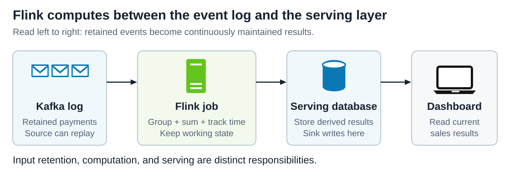
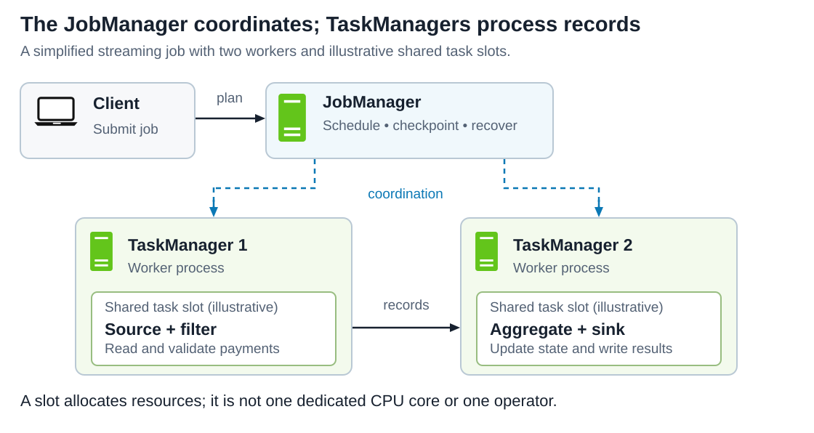
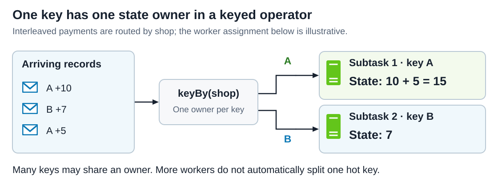
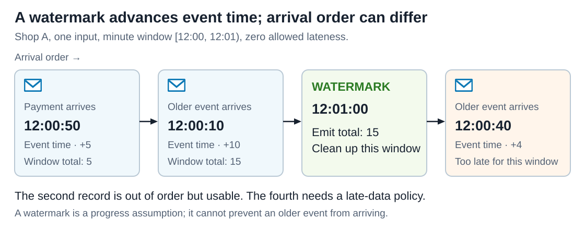
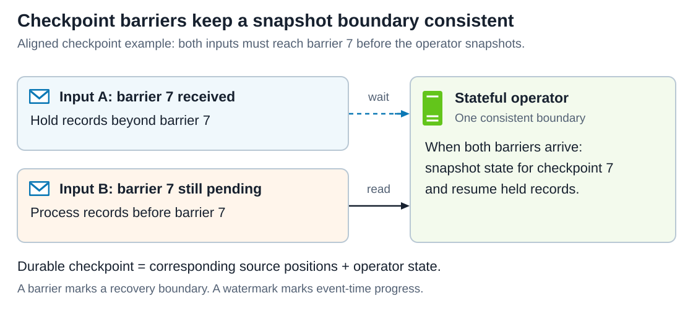
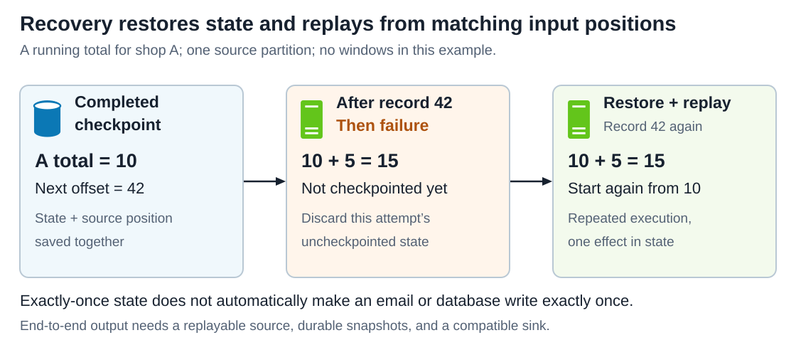

# Apache Flink

<sub>[Back to Distributed Systems](../Readme.md#content)</sub>

**Apache Flink is a distributed engine for computing over streams of events while remembering state between events.** It can continuously update results as new data arrives, and it also processes bounded datasets with a known end. This article opens with documented users, then connects its execution model to keyed state, event time, windows, and recovery, using a shop's sales totals as a running example.

The technical baseline is **Flink 2.3**. The examples are teaching scenarios; connector configuration and operational choices depend on the deployment.

## Who uses Flink, and for what?

These are dated, documented deployments. They show what organizations achieved in particular systems, not a claim that every present-day workload has the same architecture.

| Organization and source date | Documented use | Reported value |
| --- | --- | --- |
| Uber, 2025 | Replaced batch ingestion into its data lake with Flink jobs that read Kafka and write tables continuously, across thousands of datasets and hundreds of petabytes. | Reported **minutes-level freshness in place of hours, using 25% less compute** than the batch pipelines it replaced. |
| Alibaba Cloud, 2020 | Ran stream and batch workloads on one Flink-based platform during the Double 11 shopping festival, supporting uses such as search ranking, recommendation, and fraud checks. | Reported a **peak of four billion records per second**. That figure covers the whole platform rather than one job, and Alibaba Cloud sells the managed service it describes. |
| Shopify, 2021 | Rebuilt the Black Friday and Cyber Monday Live Map, which shows order arcs and per-minute sales metrics, replacing a home-grown streaming service. | Reported roughly **50,000 messages per second** across the 2021 weekend at full uptime. |

One shape recurs across all three: work that used to be recomputed or reassembled on a schedule became a job that keeps its result current as events arrive. That is the property this article develops—the job remembers state between events, so it revises a result instead of rebuilding it. Such a job need not be written in Java: **Flink SQL**, the engine's SQL interface, expresses many of them as queries, and a later section works through one.

## Where does Flink fit in a system?

Imagine a shop emitting an event whenever an order is paid. A dashboard needs sales totals for each shop every minute. Repeatedly scanning all historical orders would redo work. A streaming job can keep the partial totals and update them with each new payment.

A **source** brings records into a Flink job. **Operators** transform them, for example by filtering, grouping, or summing. A **sink** writes the results elsewhere. Read the diagram from left to right: the event log holds input, Flink computes, and a serving database makes results available to the dashboard.



Kafka and Flink have different responsibilities in this example. Kafka retains a replayable event log; Flink reads it and maintains a computation. A database used to serve results is another component. Flink's internal state does not automatically become a general-purpose database for application queries.

An **unbounded stream** has no predetermined end, such as live orders. A **bounded stream** ends, such as yesterday's files. Flink supports both. A continuously running job does not require every result to wait for a time window: simple transformations can produce output as records pass through them.

## The vocabulary behind a job

| Term | Meaning in the sales example |
| --- | --- |
| Event / record | One payment, such as shop A, amount 10, event time 12:00:10. |
| Job | The executable dataflow from payment input to computed output. |
| Operator | One kind of computation, such as summing amounts. |
| Subtask | One parallel instance of an operator. |
| Parallelism | How many parallel instances an operator has. |
| Key | The field used to group related events, here `shop_id`. |
| State | Remembered information, such as A's partial total for one minute. |
| Window | A rule that groups records into a finite scope for a computation. |

## JobManager and TaskManagers

The **JobManager** coordinates execution, scheduling, checkpoints, and recovery. **TaskManagers** are worker processes that execute tasks and exchange records. The diagram separates coordination above from the record-processing path below; records are processed by workers rather than routed through the JobManager.



Each TaskManager offers **task slots**, units used to allocate its resources. A slot is not a dedicated CPU core. Under the usual slot-sharing arrangement, subtasks from different operators in one job can share a slot. Compatible operators may also be **chained** into one task to reduce handoff and buffering costs.

Flink can run locally or on clusters, including Kubernetes, YARN, and standalone deployments. A production design must also arrange coordinator availability and durable recovery storage; adding workers alone does not provide those properties.

## How keyed state keeps related events together

The **DataStream API** is Flink's application programming interface for processing individual records with explicit state and timing controls. Flink also offers **Flink SQL**, which uses Structured Query Language to express queries over tables.

In the DataStream API, `keyBy(event -> event.shopId)` partitions records by shop. All events with the same key reach the same parallel instance of the downstream keyed operator. That instance can update the key's state without asking every other worker for its partial value.

The diagram omits windowing to isolate the grouping rule. Records arrive interleaved, but A's amounts update one total and B's amounts update another. The particular worker assignment is illustrative.



**Keyed state** is scoped to the current record's key. For example, `ValueState` holds one value per key, while `MapState` holds a map per key. State managed through Flink's APIs can participate in snapshots and redistribution. An ordinary field or local map in application code does not automatically receive those guarantees.

Flink redistributes keyed state in units called **key groups** when rescaling. Changing parallelism changes who owns groups; it does not mean copying every key to every worker.

This also explains **key skew**: if one shop produces most events, its owning subtask may become a bottleneck. Adding workers does not automatically divide one key's computation. Splitting a hot key and combining partial results is possible for suitable aggregations, but changes the design.

## Event time, processing time, and watermarks

**Event time** comes from the event's timestamp: when the payment happened. **Processing time** is the worker's clock when an operation runs. A payment that happened at 12:00:10 may arrive after one that happened at 12:00:50. A network delay should not necessarily move the payment into a different business minute.

A **watermark** is an event-time progress signal. Watermark `t` expresses the expectation that events timestamped at or before `t` have arrived. This is a policy about progress, not proof that no older event will ever appear.

In the diagram, read arrival order from left to right. Shop A's 5-unit payment at 12:00:50 arrives before its 10-unit payment at 12:00:10. Both are included because they arrive before the watermark closes their window. These are the same two payments used in the SQL example below. The additional 12:00:40 record arrives after cleanup and is too late for that window under the illustrated policy.



An operator with multiple active inputs advances according to their **minimum watermark**. One slow input can therefore hold back results. An idle partition can also stall progress because it has no new events from which to advance its watermark.

In the DataStream API, a watermark strategy can use `.withIdleness(Duration.ofMinutes(1))`, for example, to mark an input idle after a minute without records. The idle input is then excluded from the minimum, allowing the remaining active inputs to advance. The minute is an illustrative idleness timeout, not a watermark emission interval; choose it for the expected traffic pattern. Watermarks need not advance just because the wall clock advances.

Choosing a larger out-of-order allowance gives delayed events more opportunity to arrive before a window closes, at the cost of later results and longer state retention. It is not a fixed end-to-end latency guarantee.

## Windows and late data

Common time windows answer different questions:

| Window | Example question | Membership |
| --- | --- | --- |
| Tumbling | What were sales in each one-minute interval? | Fixed, non-overlapping intervals. |
| Sliding / hopping | What were sales over the last five minutes, updated every minute? | Intervals overlap; one event may enter several. |
| Session | What happened during a user's continuous activity? | Events are grouped by gaps of inactivity. |

For a tumbling interval `[12:00, 12:01)`, the start is included and the end is excluded. The default DataStream event-time trigger fires when the watermark reaches or exceeds the window's last timestamp. With millisecond precision, that timestamp is `12:00:59.999`.

**Out-of-order** and **too late to use** are different. An older event can arrive while its window is still open. For DataStream event-time windows, configured **allowed lateness** can retain window state after the first firing and permit revised results; its default is zero. Events arriving after the window's cleanup threshold can be dropped or sent to a configured side output for separate handling. A revised result must be handled as a revision by downstream consumers.

These DataStream controls should not be assumed to exist unchanged in SQL. The ordinary SQL window aggregation below emits its final window result and removes intermediate state when no longer needed.

## A small Flink SQL example

Assume a registered, append-only streaming table named `paid_orders` with `shop_id STRING`, `amount DECIMAL(10, 2)`, and `event_time TIMESTAMP(3)`. Its source declaration marks `event_time` as an event-time attribute using:

```sql
WATERMARK FOR event_time AS event_time - INTERVAL '5' SECOND
```

That line is a clause inside a source's `CREATE TABLE` statement, not a standalone command. Source connection options are omitted here. For the example, timestamps use one agreed time zone and every row represents one distinct paid order.

The query computes a result per shop and minute:

```sql
SELECT
    shop_id,
    window_start,
    window_end,
    SUM(amount) AS paid_total
FROM TUMBLE(
    TABLE paid_orders,
    DESCRIPTOR(event_time),
    INTERVAL '1' MINUTE
)
GROUP BY shop_id, window_start, window_end;
```

For these rows, assuming all arrive before their windows close:

| shop_id | event_time, same date | amount |
| --- | --- | ---: |
| A | 12:00:10 | 10.00 |
| B | 12:00:15 | 7.00 |
| A | 12:00:50 | 5.00 |
| A | 12:01:05 | 9.00 |

The `[12:00, 12:01)` results are **A = 15.00** and **B = 7.00**. A's 9.00 belongs to the next window. Merely receiving these four rows does not guarantee that every input's watermark has advanced enough to emit every result.

Alongside SQL, Flink provides the **Table API**, a programmatic interface for table operations. A streaming table is dynamic: some queries produce changes to previous rows. A sink must support the query's change pattern, such as inserts, updates, or deletes. A non-windowed running sum, for example, can keep changing instead of producing only one final row.

## Checkpoints make input progress and state agree

A **checkpoint** records a recoverable, consistent snapshot of operator state together with source progress. Saving only the totals is insufficient: after restarting, the job must also know which input records those totals already include.

**Checkpoint barriers** mark snapshot boundaries as they travel through the dataflow. In aligned checkpointing, an operator that receives a barrier on one input waits for the corresponding barriers on its other inputs before processing records beyond that boundary. This prevents combining state from different input boundaries into an inconsistent recovery point. The diagram shows the alignment rule.



Snapshot persistence can happen asynchronously. A checkpoint becomes usable after the required snapshot work has completed and the coordinator has received the necessary acknowledgements. **Checkpointing is disabled by default.** In a DataStream program, `env.enableCheckpointing(60_000)` enables it with a 60-second interval; the argument is in milliseconds and `env` is the stream execution environment. This sets the interval, not a deadline for checkpoint completion. Durable checkpoint storage must also be configured for recovery across worker or coordinator loss.

Alignment can become slow under backpressure. **Unaligned checkpoints** can include in-flight records in the snapshot, reducing dependence on waiting for alignment, with additional snapshot data to store and recover. They do not make a slow sink process records faster.

## Recovery and the meaning of exactly once

Consider a running total with a completed checkpoint: A's state is 10 and the next source offset is 42. An **offset** identifies a record's position in a source partition. Record 42 adds 5; the worker then fails before another checkpoint completes. Recovery restores 10 and replays record 42, producing 15 again.



The record was executed more than once across attempts, but it affected the recovered state once. That is the useful meaning of **exactly-once state consistency**. It does not mean every instruction physically executes only once.

**End-to-end exactly-once output requires cooperation beyond Flink's state:** replayable input retained long enough for recovery, durable snapshots, and an appropriately configured sink protocol. A transactional sink can coordinate publication with checkpoints; an idempotent write can make repeats harmless when its keys and update semantics are suitable.

For example, retrying an uncoordinated `sendEmail()` call can send two emails even if Flink's totals recover correctly. Likewise, checkpointing does not deduplicate two separate source records that happen to describe the same payment. That requires application-level event identities and deduplication logic.

## State backends, checkpoint storage, and savepoints

A **state backend** determines how working state is represented and accessed. Two options illustrate the main trade-off:

| Backend | Where working state lives | Consequence for a choice |
| --- | --- | --- |
| `HashMapStateBackend` | Java objects in the Java Virtual Machine (JVM) heap. | Fast access without serializing each state read or write, but state must fit in the available heap. |
| `EmbeddedRocksDBStateBackend` | Serialized keys and values in an embedded RocksDB store on local disk, with memory used for caching and buffering. | Can hold state larger than the JVM heap, but serialization and possible disk access add overhead. Budget both disk and memory. |

Heap state is a useful starting point when state fits comfortably in memory and access speed matters. RocksDB trades some access speed for the ability to use disk capacity. These are starting criteria; measure the actual workload.

**Checkpoint storage** determines where recovery snapshots persist, independently of that choice. RocksDB's local disk is working storage, not a replacement for a durable checkpoint. Losing a worker must not also destroy the only usable recovery copy.

| Snapshot | Main purpose | Lifecycle |
| --- | --- | --- |
| Checkpoint | Recover from execution failure. | Usually automatic and managed by Flink; retention is configurable. |
| Savepoint | Deliberately stop, migrate, rescale, or upgrade a compatible job. | Explicitly triggered and managed by the operator. |

A savepoint is not permission to change a job arbitrarily. Restoring still requires compatible state mappings and serializers. Stable operator identifiers help Flink associate saved state with the intended operators.

State also needs a lifecycle during normal operation. Windows can release data after their retention boundary. Other state may need explicit cleanup or **time to live (TTL)**. Choosing a TTL is a correctness decision: forgetting old information may change later results. Flink's DataStream state TTL uses processing time in this baseline; it is not an event-time window policy.

## Backpressure and practical limits

**Backpressure** occurs when downstream work cannot consume records as fast as upstream work can produce them. It propagates upstream. If incoming traffic remains above sustainable processing capacity, a replayable source's backlog can grow while the job falls further behind.

Inspect the Flink user interface and metrics before adding workers. Compare busy, idle, and backpressured time across subtasks; inspect source lag, watermark progress, state size, and checkpoint duration/failures. The following diagnoses are design inferences from those mechanisms:

| Observation | What to investigate |
| --- | --- |
| Sink is saturated and upstream tasks are backpressured | Destination throughput, connector batching, or expensive writes. |
| One subtask is busy while its peers are mostly idle | A hot key, uneven partitions, or unusually expensive records. |
| Input is flowing but windows do not emit | Watermarks, idle inputs, timestamp extraction, and window boundaries. |
| Recovery repeatedly falls behind | Snapshot age, restore cost, retained input, and capacity to catch up. |

Correct totals, low latency, and manageable state size depend on the application and its inputs. Checkpoints protect recoverable execution state; they cannot reconstruct source data that has expired or make arbitrary external effects atomic.

## When is Flink useful?

Flink is a strong candidate for continuously maintained analytics, joins between live event streams, fraud or anomaly signals, and pipelines that transform data as it arrives. Its value comes from expressing stateful logic, handling event-time progress, and recovering that computation across failures.

For a small periodic report, a database query or scheduled batch job may be simpler to operate. For a one-record transformation, consider whether a consumer service already meets the requirements. These are design choices, not universal performance rankings.

For the shop, success means correct minute totals available within an agreed delay, including an explicit late-data policy and a tested recovery path. “Uses Flink” is an implementation choice; freshness, correctness, recovery time, and operating cost are the outcomes to measure.

## Self-check

Try answering each question before expanding its answer. Use the shop's sales totals to make each explanation concrete.

1. Why does grouping by shop make state ownership important?

   <details>
   <summary>Answer</summary>

   Related records must update the same keyed state; many different keys can be distributed across subtasks.

   </details>

2. Can a record arrive out of order without being too late for its window?

   <details>
   <summary>Answer</summary>

   Yes. Arrival order and the window's cleanup threshold are different concepts.

   </details>

3. Why can one idle input stop a window from producing a result?

   <details>
   <summary>Answer</summary>

   Downstream event-time progress uses the minimum active-input watermark. A watermark strategy's `withIdleness(...)` marks inactive inputs idle so the remaining active inputs can advance.

   </details>

4. Why does a sink for a non-windowed running sum need to handle updates?

   <details>
   <summary>Answer</summary>

   The total for an existing key changes as payments arrive. The sink must apply revisions rather than treat every new total as an unrelated final result.

   </details>

5. If record 42 executes twice during recovery, why can the final total still be correct?

   <details>
   <summary>Answer</summary>

   The failed attempt's uncheckpointed state is discarded. Restoring the earlier total and matching source position makes replay consistent.

   </details>

6. Why can the same recovery send an email twice?

   <details>
   <summary>Answer</summary>

   An external email call is not automatically rolled back or deduplicated by a Flink checkpoint.

   </details>

7. What should you investigate when the sink is saturated and upstream tasks are backpressured?

   <details>
   <summary>Answer</summary>

   Check destination throughput, connector batching, and expensive writes; adding upstream workers does not remove a sink bottleneck.

   </details>

8. Which state backend can hold working state larger than the available JVM heap?

   <details>
   <summary>Answer</summary>

   `EmbeddedRocksDBStateBackend` can keep state on local disk with memory used for caching and buffering; the disk and memory budgets still need to be sized.

   </details>

9. Why would you take a savepoint before a planned job change?

   <details>
   <summary>Answer</summary>

   It provides an operator-managed snapshot from which a compatible changed job can restore its state.

   </details>

# Sources

Primary documentation checked on 2026-09-17 and pinned to Flink 2.3 where versioned. The company deployment sources were checked on 2026-09-21 and keep their original dates and workload scope. The shop, amounts, worker assignments, diagrams, and operational diagnoses are teaching examples or design inferences. The SQL fragment and query were checked against the documented syntax; they were not executed against a running Flink cluster.

- [Apache Flink: architecture and bounded/unbounded streams](https://flink.apache.org/what-is-flink/flink-architecture/)
- [Flink 2.3 glossary](https://nightlies.apache.org/flink/flink-docs-release-2.3/docs/concepts/glossary/) — jobs, operators, subtasks, and parallelism.
- [Flink architecture](https://nightlies.apache.org/flink/flink-docs-release-2.3/docs/concepts/flink-architecture/) — coordination, workers, slots, and operator chaining.
- [Stateful stream processing](https://nightlies.apache.org/flink/flink-docs-release-2.3/docs/concepts/stateful-stream-processing/) — key groups, barriers, snapshots, and replay.
- [Working with state](https://nightlies.apache.org/flink/flink-docs-release-2.3/docs/dev/datastream/fault-tolerance/state/) — keyed state APIs and TTL.
- [Timely stream processing](https://nightlies.apache.org/flink/flink-docs-release-2.3/docs/concepts/time/) — event time, processing time, and watermarks.
- [Generating watermarks](https://nightlies.apache.org/flink/flink-docs-release-2.3/docs/dev/datastream/event-time/generating_watermarks/) — multiple inputs and idleness.
- [DataStream windows](https://nightlies.apache.org/flink/flink-docs-release-2.3/docs/dev/datastream/operators/windows/) — window boundaries, triggers, allowed lateness, and side outputs.
- [EventTimeTrigger implementation](https://github.com/apache/flink/blob/release-2.3/flink-runtime/src/main/java/org/apache/flink/streaming/api/windowing/triggers/EventTimeTrigger.java) and [event-time timer implementation](https://github.com/apache/flink/blob/release-2.3/flink-runtime/src/main/java/org/apache/flink/streaming/api/operators/InternalTimerServiceImpl.java) — the precise watermark threshold for the default DataStream trigger.
- [SQL time attributes](https://nightlies.apache.org/flink/flink-docs-release-2.3/docs/concepts/sql-table-concepts/time_attributes/) — declaring an event-time column and watermark.
- [SQL windowing table-valued functions](https://nightlies.apache.org/flink/flink-docs-release-2.3/docs/sql/reference/queries/window-tvf/) — tumbling, hopping, and session windows.
- [SQL window aggregation](https://nightlies.apache.org/flink/flink-docs-release-2.3/docs/sql/reference/queries/window-agg/) — grouping window results and final emission.
- [Flink API overview](https://nightlies.apache.org/flink/flink-docs-release-2.3/docs/dev/overview/) and [dynamic tables](https://nightlies.apache.org/flink/flink-docs-release-2.3/docs/concepts/sql-table-concepts/dynamic_tables/) — API choices and streaming result changes.
- [Checkpointing](https://nightlies.apache.org/flink/flink-docs-release-2.3/docs/dev/datastream/fault-tolerance/checkpointing/) — defaults and recovery prerequisites.
- [Connector fault-tolerance guarantees](https://nightlies.apache.org/flink/flink-docs-release-2.3/docs/connectors/datastream/guarantees/) — output guarantees and sink participation.
- [State backends](https://nightlies.apache.org/flink/flink-docs-release-2.3/docs/dev/datastream/fault-tolerance/state_backends/) — working state and checkpoint storage.
- [State backend implementation trade-offs](https://nightlies.apache.org/flink/flink-docs-release-2.3/docs/ops/state/state_backends/) — heap objects versus serialized RocksDB state, access costs, and memory/disk capacity.
- [Checkpoints versus savepoints](https://nightlies.apache.org/flink/flink-docs-release-2.3/docs/ops/state/checkpoints_vs_savepoints/) and [savepoints](https://nightlies.apache.org/flink/flink-docs-release-2.3/docs/ops/state/savepoints/) — lifecycle and compatible restoration.
- [Monitoring backpressure](https://nightlies.apache.org/flink/flink-docs-release-2.3/docs/ops/monitoring/back_pressure/) and [checkpointing under backpressure](https://nightlies.apache.org/flink/flink-docs-release-2.3/docs/ops/state/checkpointing_under_backpressure/) — diagnosis and unaligned checkpoints.
- [Uber: from batch to streaming, accelerating data freshness in Uber's data lake](https://www.uber.com/us/en/blog/from-batch-to-streaming-accelerating-data-freshness-in-ubers-data-lake/) — 2025 migration scope, minutes-level freshness, and the 25% compute reduction.
- [Alibaba Cloud: stream-batch unification during Double 11](https://www.alibabacloud.com/blog/four-billion-records-per-second-stream-batch-integration-implementation-of-alibaba-cloud-realtime-compute-for-apache-flink-during-double-11_596962) — 2020 platform-wide peak throughput, published by the vendor of the managed service it describes.
- [Shopify: scaling the BFCM Live Map with an Apache Flink redesign](https://shopify.engineering/bfcm-live-map-2021-apache-flink-redesign) — 2021 rebuild, weekend throughput, and the home-grown service it replaced.
- [Apache Flink use cases](https://flink.apache.org/what-is-flink/use-cases/) — event-driven applications, analytics, and data pipelines.
- Local icon sources: [System Design: message queue](../../system%20design/01.%20Scaling/images/message-queue.svg) supplies the server and envelope symbols; [System Design: database](../../system%20design/01.%20Scaling/images/database.svg) supplies the laptop symbol and database geometry. They are copied as editable vector shapes into this article's diagrams, with the database label omitted so the same shape can identify checkpoint storage.
