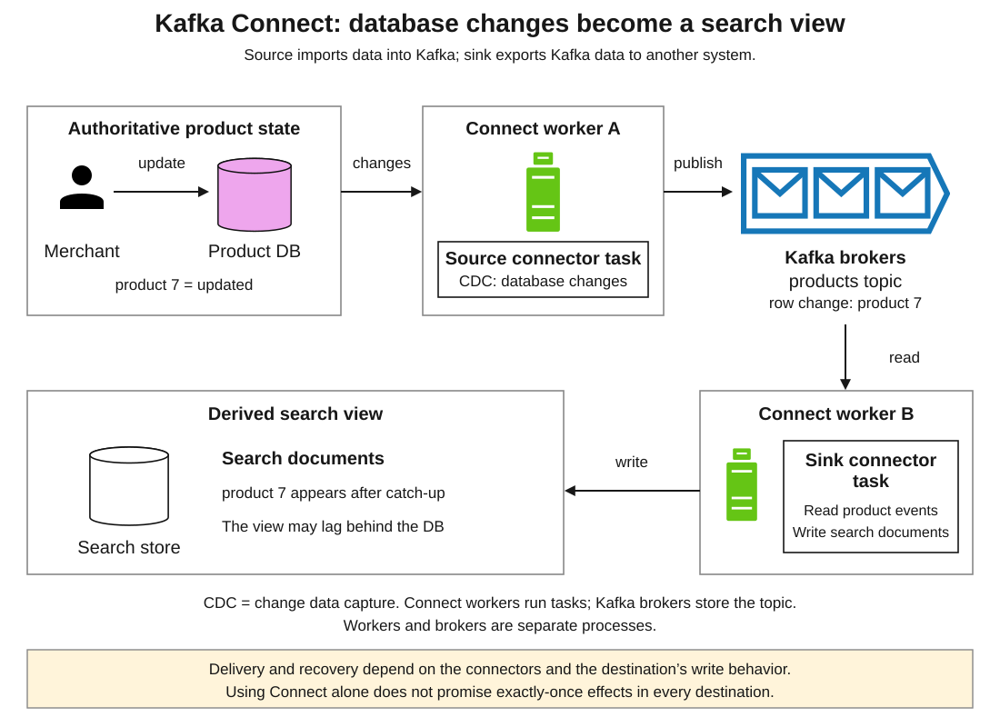
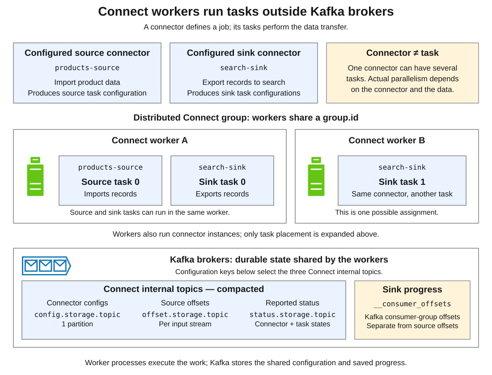
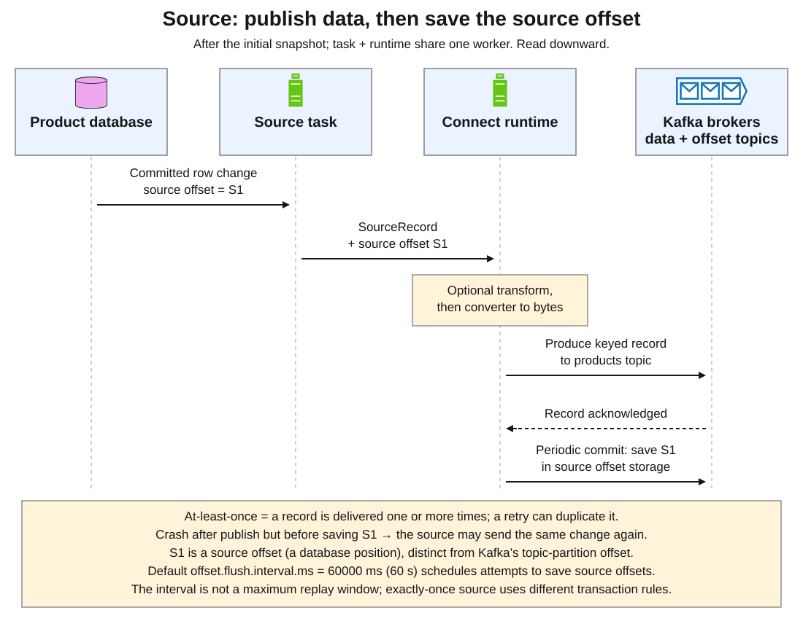
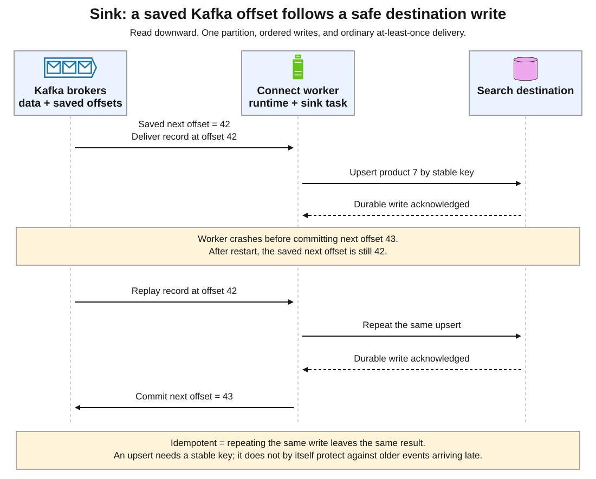
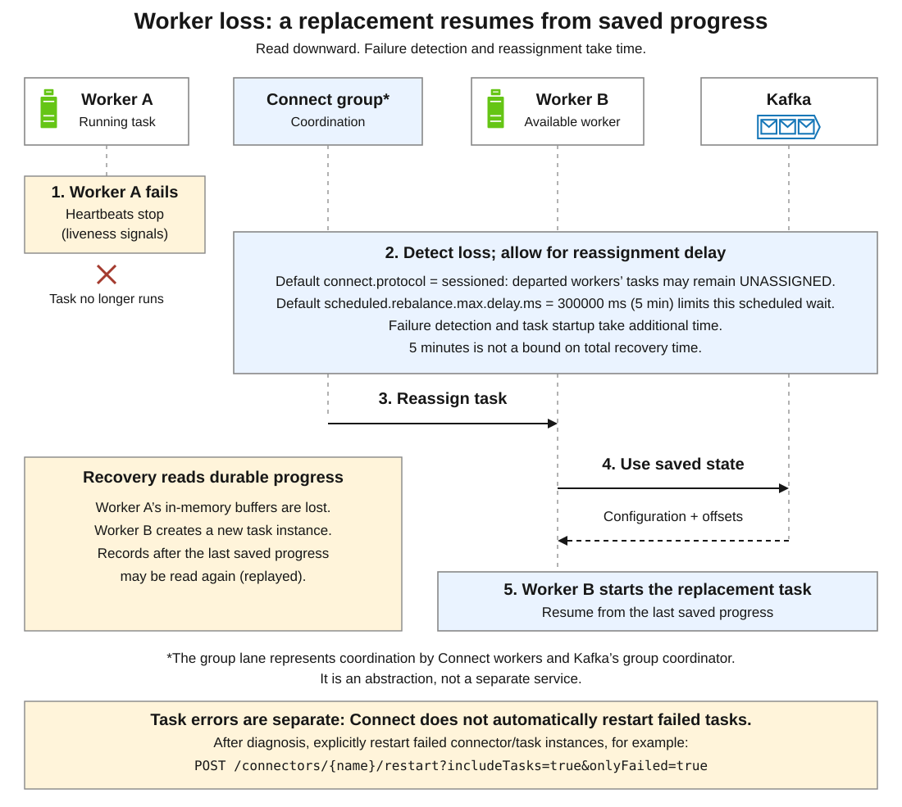
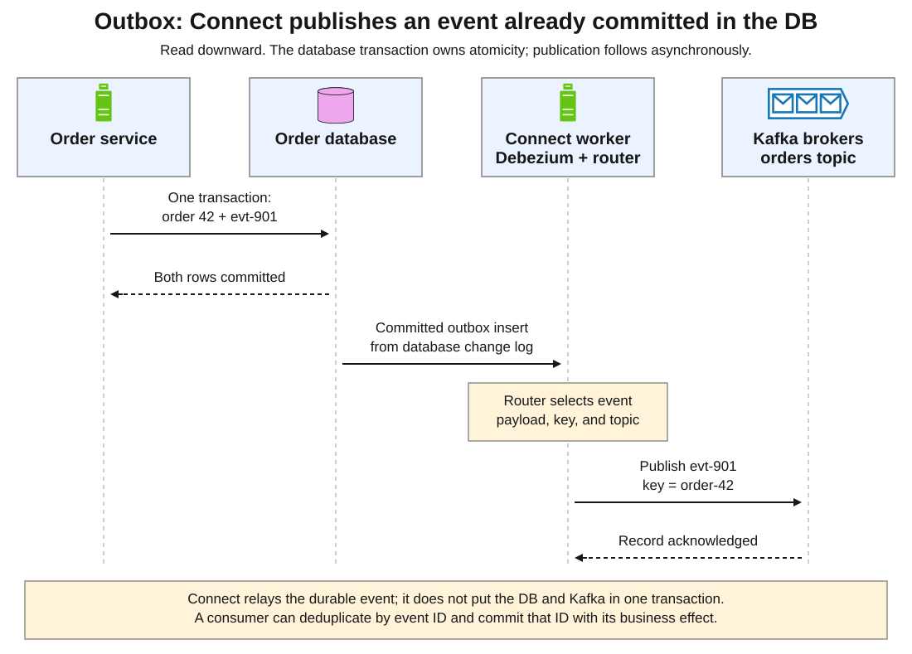

# Apache Kafka. Connect

<sub>[Back to Distributed Systems](../Readme.md#content)</sub>

**Kafka Connect is a tool for scalably and reliably streaming data between Apache Kafka and other external systems through reusable connector plugins.**

Kafka Connect can ingest entire databases or collect metrics from all your application servers into Kafka topics, making the data available for stream processing with low latency. An export job can deliver data from Kafka topics into secondary storage and query systems or into batch systems for offline analysis.

A **source** imports data into Kafka; a **sink** exports Kafka records to another system. Connect supplies the runtime, task management, and progress tracking; the plugin knows how to communicate with a particular database, storage service, or other endpoint.

This article expands the product-to-search example from [Apache Kafka, Pattern 3](../Apache%20Kafka/Readme.md#pattern-3-move-data-with-kafka-connect). Follow the components, data movement, recovery, and outbox pattern. Framework details use Kafka 4.3; Debezium examples use 3.6 documentation. Plugin capabilities vary by version.

1. [Why it exists](#1-why-it-exists)
2. [Where it fits in the architecture](#2-where-it-fits-in-the-architecture)
3. [Connector, task, worker, and record](#3-connector-task-worker-and-record)
4. [Workers, deployment, and durable state](#4-workers-deployment-and-durable-state)
5. [Source sequence: database changes enter Kafka](#5-source-sequence-database-changes-enter-kafka)
6. [Sink sequence: writes, checkpoints, and duplicate delivery](#6-sink-sequence-writes-checkpoints-and-duplicate-delivery)
7. [Worker failure and reassignment](#7-worker-failure-and-reassignment)
8. [Pattern: transactional outbox with Connect as the relay](#8-pattern-transactional-outbox-with-connect-as-the-relay)
9. [Which cases fit Connect?](#9-which-cases-fit-connect)
10. [Decisions before operating a pipeline](#10-decisions-before-operating-a-pipeline)
11. [Check your understanding](#11-check-your-understanding)

## 1. Why it exists

The product database is authoritative, but customers search a separate index. Committed changes must eventually reach search and, later, analytics.

Each integration needs reads, serialization, batching, safe checkpoints, deployment, and recovery. Reimplementing these concerns in custom producers and consumers creates repeated work.

Connect separates that shared runtime from the system-specific plugin. Configure an existing plugin or implement the connector interfaces to reuse the runtime.

It solves **data movement with recoverable progress**. Business rules, event meaning, and destination correctness still require design.

## 2. Where it fits in the architecture

Kafka brokers store records in **topics**, divided into ordered **partitions**. Producers write; consumers read. Connect workers are separate processes that use these clients to move data.

Read the diagram from the product database, across the top to Kafka, then down to the sink and back left to the search store. The database remains authoritative; search is a derived view that can lag.



Here, **change data capture (CDC)** means observing database changes and representing them as events. A CDC source plugin such as Debezium can feed Kafka; a compatible search sink plugin can maintain the index. Connect itself does not turn every source connector into CDC: a different plugin might poll an API or periodically query a table.

Source and sink connectors are independent. A source can feed application consumers; a sink can read application-produced records. Adding an analytics sink need not change the search sink.

These links are asynchronous: a database commit does not mean search has caught up. A read that must immediately reflect a write needs an authoritative read path.

## 3. Connector, task, worker, and record

| Term | Responsibility | Example |
|---|---|---|
| Connector plugin | Reusable implementation for an external system | Debezium PostgreSQL connector |
| Connector instance | A named, configured integration; creates task configurations | `products-source` |
| Task | Runs a portion of the integration's data movement | Read one database change stream |
| Worker | Connect process that hosts connector instances and tasks | Worker A or worker B |
| Converter | Translates between Connect's record representation and Kafka bytes | JSON serialization/deserialization |
| Single Message Transformation (SMT) | Changes or routes one record inside the pipeline | Rename a field or change a topic name |

A connector divides the work; its tasks move records. A worker can host several connectors' source and sink tasks, and one connector's tasks can span workers.

A converter handles the wire format; an SMT changes one record. Joins between orders and customers, five-minute aggregates, and other stateful computations belong in a stream processor or application.

The usual record paths are:

```text
Source system → source task → SMT chain → converter → Kafka
Kafka → converter → SMT chain → sink task → destination
```

The producer's format and reader's converter must agree. A **schema** describes fields and types; changing it requires checking compatibility across the pipeline.

## 4. Workers, deployment, and durable state

In **distributed mode**, workers cooperate as a Connect cluster. They distribute connector and task assignments and can move work when membership changes. In the example below, the source has one task while the sink has two; that is an illustrative assignment, not a fixed topology.



| Mode | Execution and progress storage | Suitable situation |
|---|---|---|
| Standalone | One worker process; source offsets normally stored in a local file | Development, a small deployment, or work tied to one host |
| Distributed | Cooperating workers; shared configuration, source offsets, and status in Kafka | A managed service needing worker failover and horizontal capacity |

A one-worker distributed cluster has no survivor to take over. More workers enable reassignment; source, destination, and Kafka availability remain separate concerns.

Workers in one Connect cluster share a `group.id` and internal topics; separate clusters need distinct identities and topics. The worker group coordinates runtime assignments. A sink's **consumer group** shares Kafka partition assignments and saved read progress. For group coordination, rebalances, and heartbeats, see [Delivery and transactions §1](../Apache%20Kafka.%20Delivery%20and%20transactions/Readme.md#1-essential-vocabulary).

The three Connect storage settings are:

- `config.storage.topic`: connector and task configuration; a compacted topic with **one partition**.
- `offset.storage.topic`: saved **source offsets**; a compacted topic that can have multiple partitions.
- `status.storage.topic`: connector/task status; also compacted and potentially partitioned.

**Compaction** retains the latest value per key. Replicate these recovery topics appropriately. Sink consumer offsets normally live in Kafka's `__consumer_offsets`, separate from Connect's source-offset topic.

### Scaling has two independent limits

`tasks.max` is an upper bound on the number of tasks a connector may create. It is not a request for that many workers, nor a promise that the plugin can use that much parallelism.

- **Source limit:** the plugin must be able to split the external data safely. Debezium's PostgreSQL connector uses one task per connector instance; raising `tasks.max` does not split that database stream.
- **Sink limit:** tasks normally consume through a Kafka consumer group. A partition is assigned to one consumer in that group at a time. With three input partitions, eight sink tasks cannot all read separate partitions concurrently.

More workers help only with divisible work and sufficient source, Kafka, and destination capacity.

## 5. Source sequence: database changes enter Kafka

For the product example, assume the initial database snapshot has finished. A snapshot captures existing rows; CDC then follows committed changes. PostgreSQL exposes changes through logical decoding of its **write-ahead log (WAL)**. A **log sequence number (LSN)** identifies a position in that log.

**At-least-once delivery** means each record is delivered at least once, with possible repeats during recovery, assuming eventual recovery and retained input. Read downward through this ordinary path without source exactly-once support. Task and runtime are separate roles inside one worker.



The task supplies a `SourceRecord`: key/value, Kafka destination, **source partition**, and **source offset**. A source partition identifies a connector-defined input stream, such as a file or table; it is not the output Kafka partition. The source offset identifies progress within that input. Connect transforms, serializes, and produces the record, then saves the corresponding source offset after successful delivery.

There are **two different positions**:

| Position | Answers | Example |
|---|---|---|
| Source offset | Where should the connector resume in the external system? | PostgreSQL log position plus connector recovery metadata |
| Kafka record offset | Where is this record inside a Kafka partition? | `products`, partition `0`, offset `42` |

An LSN is not Kafka offset `42`. Nor should it be treated as a universally unique business-event ID.

If the worker fails after publication but before saving its source offset, it may publish the change again at a new Kafka offset. Producer retry protection alone does not deduplicate source replay after restart.

For this ordinary source path, `offset.flush.interval.ms` schedules offset-commit attempts every **60000 ms (60 s)** by default. Failed or delayed commits can leave an older checkpoint: 60 s is **not a maximum replay window**. Exactly-once sources instead commit records and offsets according to their configured transaction boundaries.

Debezium PostgreSQL normally starts with a snapshot, then streams changes. Recovery requires the necessary database log. Replication slots can retain WAL while the connector lags, consuming database storage; check snapshot and retention policies.

## 6. Sink sequence: writes, checkpoints, and duplicate delivery

A sink's progress is a Kafka consumer position. In this example, saved offset `42` means **record 42 is the next record to process**. After safely handling it, the next offset is `43`.

Read downward through the crash and restart. The write succeeds, but the offset does not advance before the failure. The replacement task must therefore process record `42` again.



The worker deserializes a batch, applies SMTs, and passes records to the sink task by calling its `put()` method. That method may buffer writes. Before committing offsets, the runtime calls `preCommit()`; its default implementation calls `flush()` to finish buffered writes. The task must report only offsets whose destination writes are safe to checkpoint.

Committing progress before the destination write is safe risks skipping data after a crash. Writing first avoids that gap but leaves a window for duplicates.

An **upsert** inserts an absent key or updates an existing one. With a stable key such as `productId=7`, repeating the same replacement can leave the same result: an **idempotent** effect. Repeating `stock = stock - 1` changes the outcome.

Stable keys alone do not solve all ordering problems. If an older product version arrives after a newer version, an unconditional upsert can overwrite fresh state. Where that is possible, use an ordering strategy or destination-side version check. Verify how the chosen plugin handles batches, partial failures, retries, and deletes.

### What “exactly once” can mean here

Ask which boundary has the guarantee:

- **Source → Kafka:** supported source connectors in distributed mode can use Connect's exactly-once support. Kafka transactions atomically commit source records with their source offsets, and fencing prevents obsolete task generations from continuing to publish. It requires a compatible source connector and the correct worker configuration, including `exactly.once.source.support`.
- **Kafka → external destination:** the sink must provide the required semantics. A connector might coordinate destination data with saved offsets, or provide replay-safe writes using the destination's capabilities. A Kafka transaction by itself cannot commit an unrelated search index or database write.
- **Whole business operation:** publishing a record exactly once does not automatically make a payment, email, or multi-system workflow happen exactly once.

For transactional input, explicitly set worker `consumer.isolation.level=read_committed`, or connector `consumer.override.isolation.level=read_committed` if the override policy permits it. The consumer default, `read_uncommitted`, exposes aborted records. This setting does not make destination writes atomic with offset commits; see [Delivery and transactions](../Apache%20Kafka.%20Delivery%20and%20transactions/Readme.md).

## 7. Worker failure and reassignment

Workers send **heartbeats**, liveness signals. Membership changes trigger a **rebalance**, which changes work assignments. The group lane below abstracts coordination by workers and Kafka's group coordinator; it is not a separate server.



After A disappears, B can start replacement work from durable configuration and offsets; A's memory is not restored. Records after the last safe checkpoint may replay.

With the default `connect.protocol=sessioned`, `scheduled.rebalance.max.delay.ms` defaults to **300000 ms (5 min)**. During this scheduled wait for a departed worker to return, its connectors and tasks remain **unassigned**. This is not a five-minute bound on total recovery: failure detection and task startup also take time. An unassigned task during a worker-kill test does not by itself mean failover is broken.

**Connect does not automatically restart failed tasks.** A live worker can host a task in `FAILED`; this differs from worker loss. Inspect the error, fix its cause, then restart failed connector/task instances with the REST request:

```http
POST /connectors/{name}/restart?includeTasks=true&onlyFailed=true
```

`GET /connectors/products-source/status` shows connector and task states. A `RUNNING` connector can have failed tasks; check both and verify data freshness.

## 8. Pattern: transactional outbox with Connect as the relay

Suppose an order service writes its database and separately publishes `OrderCreated`. A crash between those writes can leave a committed order without an event. **A transactional outbox** solves that local gap by storing the order and an event row in the same database transaction.

Read downward. Connect acts after the database commit. “Router selects event payload, key, and topic” identifies the transformation inside the worker.



A Debezium source captures the outbox insert. Its **Outbox Event Router** SMT selects the payload, key, and topic. Here, `order-42` is the key and `evt-901` identifies the event for deduplication; topic `orders` is an illustrative routing choice.

The database transaction makes the order and outbox row atomic; Connect relays the event afterward. A consumer can atomically store the event ID with its local effect and skip a repeated ID. The database and Kafka do not share this transaction.

Raw CDC describes storage changes; an outbox event can express a business fact such as `OrderAccepted`. Choose the downstream contract deliberately; see [Patterns. Transactional Outbox](../Patterns.%20Transactional%20Outbox/Readme.md).

## 9. Which cases fit Connect?

For each use case, verify plugin support for your endpoint version, data model, and delivery requirements.

| Need | Connect's place | Main design question |
|---|---|---|
| Keep a search view or reporting database current | CDC source → Kafka → compatible sink | Can the view lag, and are updates/deletes replay-safe? |
| Land events in object storage or an analytical store | Kafka → storage sink | What batching, file layout, schema, and replay behavior does the plugin provide? |
| Feed existing database data into streaming analytics | Source connector → Kafka → stream processor | Can the source capture the needed changes without unacceptable load? |
| Publish committed outbox events | Database CDC source + event-routing SMT → Kafka | Are outbox writes atomic with business writes and consumers duplicate-safe? |
| Integrate an external API or existing messaging system | Suitable source or sink plugin | Does it support cursors, quotas, acknowledgments, and recovery correctly? |
| Move data between Kafka clusters | A replication design such as MirrorMaker 2, built on Connect | What are the offset translation, failover, and replication requirements? |

Connect can surround Kafka Streams or Apache Flink: database → Connect source → Kafka → stream processor → Kafka → Connect sink. The processor owns the computation.

### When another tool is a better fit

- **Application business logic:** use Kafka producer/consumer APIs or an application framework when the task is deciding what an order means, authorizing a payment, or orchestrating a workflow.
- **Stateful event processing:** use a stream processor for joins, windows, and aggregates across records. An SMT is intended for a per-record adjustment.
- **Synchronous request/response:** use an appropriate service call when the caller requires an immediate result. An asynchronous Connect pipeline does not supply that contract.
- **A small one-time copy:** a database export, import, or script can be simpler if continuous streaming and Kafka replay have no value.
- **No suitable plugin:** compare building and operating a custom connector with a focused application. “Connect supports databases” does not establish support for your specific database or semantics.

## 10. Decisions before operating a pipeline

**Choose the contract.** Specify keys, format, schema, deletes, lag, and duplicate handling. A CDC envelope needs a compatible sink or transformation. A null-valued record, called a tombstone, does not make every sink delete the destination row.

**Deploy plugins consistently.** Every eligible worker needs the plugins, discoverable through `plugin.path`, and endpoint access because tasks can move. Keep credentials in deployment configuration.

**Distinguish bad records from unavailable infrastructure.** A malformed value may fail conversion or a transformation. An unreachable destination is a connectivity problem. Connector-specific retry handling and framework error controls do not necessarily cover the same failures.

The default policy, `errors.tolerance=none`, fails on conversion/transformation errors. `errors.tolerance=all` can skip supported record errors: those records do not reach the normal destination. For sinks, `errors.deadletterqueue.topic.name` selects a **dead-letter queue (DLQ)** topic for failed records. Add `errors.deadletterqueue.context.headers.enable=true` to include error-context headers; it defaults to `false`. Supported stages and connector reporting determine coverage. A DLQ does not handle every infrastructure failure or repair/replay rejected data automatically.

**Monitor progress.** Check task status, source and sink lag, errors, offset-commit failures, and destination freshness. An idle source and a stuck source can look alike without source-specific checks.

**Retain recovery history.** Sources need external history; sinks need Kafka records. An outage that outlasts retention can require a new snapshot or rebuild.

## 11. Check your understanding

Try answering each scenario before expanding its answer.

1. Product changes must feed search continuously. What does Connect replace, where does it run, and would you use an SMT for a five-minute aggregate?

   <details>
   <summary>Answer</summary>

   It reuses integration and recovery machinery through source/sink plugins in workers outside the brokers. An SMT changes one record; use a stream processor for the aggregate.

   </details>

2. A change at source offset S1 reaches Kafka partition 0, offset 42. The worker crashes before saving S1. Are the positions interchangeable? Can replay reach farther back than 60 seconds?

   <details>
   <summary>Answer</summary>

   No. S1 tracks a connector-defined source partition; 42 locates a Kafka record. Replay can publish the change at another Kafka offset. The 60 s setting schedules commit attempts; failed commits can leave an older checkpoint.

   </details>

3. Search stores product 7 from Kafka offset 42, then the worker crashes before committing 43. What repeats, and why is a keyed replacement safer than decrementing stock?

   <details>
   <summary>Answer</summary>

   With saved next offset 42, the record replays. An idempotent keyed upsert can repeat the same state; a decrement repeats the effect. An older version arriving late still needs ordering or a version check.

   </details>

4. A killed worker's tasks stay unassigned for several minutes. Another live worker has a task in `FAILED`. Do both cases have the same recovery path?

   <details>
   <summary>Answer</summary>

   No. Worker loss can incur the default 5 min scheduled reassignment delay, plus detection/startup. Failed tasks are not automatically restarted: fix the error, then use the failed-instance restart request in §7.

   </details>

5. Does setting `tasks.max=8` produce eight parallel PostgreSQL CDC tasks or eight active sink consumers for a three-partition topic?

   <details>
   <summary>Answer</summary>

   Neither. Debezium PostgreSQL uses one task per connector instance; the sink group can assign those three partitions to at most three consumers. Workers alone do not remove either limit.

   </details>

6. A sink writes an aborted Kafka transaction's record to search. Which setting is missing, and would enabling it make search writes atomic with offset commits?

   <details>
   <summary>Answer</summary>

   Enable worker `consumer.isolation.level=read_committed` or a permitted connector override. It hides aborted records; destination atomicity still needs sink-specific support.

   </details>

7. With `errors.tolerance=all` and a DLQ topic configured, a malformed record bypasses search. Why might the DLQ record lack error details? Is the pipeline now guaranteed to deliver it?

   <details>
   <summary>Answer</summary>

   Error headers default off; enable `errors.deadletterqueue.context.headers.enable`. Tolerance permits skipping supported failures. A DLQ retains the rejected record for investigation, not automatic repair or delivery.

   </details>

8. An order and its outbox event commit together. Has Connect made the database and Kafka one transaction? What protects a consumer when the relay repeats an event?

   <details>
   <summary>Answer</summary>

   No. The local transaction preserves the event to publish; Connect relays it asynchronously. Atomically recording the event ID with a local consumer effect can make replay safe.

   </details>

# Sources

- [Apache Kafka 4.3 — Kafka Connect overview](https://kafka.apache.org/43/kafka-connect/overview/)
- [Apache Kafka 4.3 — Connect user guide](https://kafka.apache.org/43/kafka-connect/user-guide/)
- [Apache Kafka 4.3 — Connector development guide](https://kafka.apache.org/43/kafka-connect/connector-development-guide/)
- [Apache Kafka 4.3 — Connect configuration](https://kafka.apache.org/43/configuration/kafka-connect-configs/)
- [Apache Kafka 4.3 — Consumer configuration](https://kafka.apache.org/43/configuration/consumer-configs/)
- [Apache Kafka 4.3 — Connect administration](https://kafka.apache.org/43/kafka-connect/administration/)
- [Apache Kafka 4.3 — SourceRecord API](https://kafka.apache.org/43/javadoc/org/apache/kafka/connect/source/SourceRecord.html)
- [Apache Kafka 4.3 — SourceTask API](https://kafka.apache.org/43/javadoc/org/apache/kafka/connect/source/SourceTask.html)
- [Apache Kafka 4.3 — SinkTask API](https://kafka.apache.org/43/javadoc/org/apache/kafka/connect/sink/SinkTask.html)
- [Apache Kafka 4.3 — Design](https://kafka.apache.org/43/design/design/)
- [Apache Kafka 4.3 — Geo-replication](https://kafka.apache.org/43/operations/geo-replication-cross-cluster-data-mirroring/)
- [Debezium 3.6 — PostgreSQL connector](https://debezium.io/documentation/reference/3.6/connectors/postgresql.html)
- [Debezium 3.6 — JDBC sink connector](https://debezium.io/documentation/reference/3.6/connectors/jdbc.html)
- [Debezium 3.6 — Outbox Event Router](https://debezium.io/documentation/reference/3.6/transformations/outbox-event-router.html)
