# Apache Kafka. Delivery and transactions

<sub>[Back to Distributed Systems](../Readme.md#content)</sub>

**Kafka delivery guarantees depend on how an application coordinates record writes, consumer progress, and business effects.** Kafka transactions can commit Kafka output and consumed offsets together; database updates and service calls need their own recovery rules.

1. [Essential vocabulary](#1-essential-vocabulary)
2. [Delivery guarantees](#2-delivery-guarantees)
3. [Consumer offsets](#3-consumer-offsets)
4. [Failure scenarios](#4-failure-scenarios)
5. [Publishing without Kafka transactions](#5-publishing-without-kafka-transactions)
6. [Kafka transactions](#6-kafka-transactions)
7. [Starting and handling a transaction in Spring Boot](#7-starting-and-handling-a-transaction-in-spring-boot)
8. [Choosing the required guarantee](#8-choosing-the-required-guarantee)
9. [Check your understanding](#9-check-your-understanding)

## 1. Essential vocabulary

A service publishes the fact that order `42` was created. Shipping consumes that fact, may write a shipment row, and saves where it should resume after a failure. These are separate actions with separate failure windows.

| Term | Meaning in this article |
|---|---|
| Record / message | One stored item, such as an `OrderCreated` event |
| Producer / consumer | The application client that writes / reads records |
| Topic | A named collection of related records, such as `orders` |
| Partition | One ordered, append-only log within a topic |
| Offset | A record's position within one partition; not a global event identity |
| Broker | A Kafka server storing partition replicas and serving clients |
| Consumer group | Consumers sharing partition assignments and saved progress under a `group.id` |
| Group coordinator | The broker role handling a group's membership and offset commits |

The business event ID `evt-901`, order ID `order-42`, and Kafka offset `42` serve different purposes. Use a stable business event ID when repeated processing must recognize the same event. The examples serialize event values using **JavaScript Object Notation (JSON)**.

A consumer requests records through `poll()`. Consumers in the same standard group divide partitions; each partition has at most one assigned consumer in that group at a time. A **rebalance** changes assignments. Consumers send **heartbeats** to show reachability: missing heartbeats lead to removal after the session timeout. Kafka 4.3 defaults to `group.protocol=classic`. The classic protocol uses client `session.timeout.ms`; selecting `group.protocol=consumer` uses broker `group.consumer.session.timeout.ms`. The [poll timeout](#poll-timeout) separately checks application progress.

A partition's **leader** accepts writes, and **followers** copy its log. The replication factor specifies the number of copies. The **in-sync replica set (ISR)** contains replicas sufficiently caught up with the leader. With `acks=all`, success requires acknowledgment from the current ISR; `min.insync.replicas` sets the minimum ISR size for accepting those writes. These settings concern replicated publication, not completed consumer work. Kafka's retention policy determines how long records remain available; consuming them does not remove them.

## 2. Delivery guarantees

There are three separate questions: did Kafka accept the write, where will a consumer resume, and did the business effect happen? An answer to one does not answer the others.

Kafka documents `at-least-once` delivery as the **default**. For application processing, this depends on completing effects before committing progress past them; default client settings alone do not guarantee successful business processing. The three processing policies are:

| Processing policy | Failure window | Result |
|---|---|---|
| Complete the effect, then commit | Crash after effect, before commit | Work may repeat: `at-least-once` processing |
| Atomically coordinate effect and progress, or deduplicate effects | Recovery recognizes already completed work | `Exactly-once` effects within the chosen boundary |
| Commit progress before the effect | Crash after commit, before the effect | Work may be skipped: `at-most-once` processing |

These names describe failure semantics, not a promise that outages, expired retention, and application errors cannot lose work.

## 3. Consumer offsets

An offset commit saves a consumer group's restart progress. It is a separate operation from publishing records to an outbound topic.

**Automatic commits are time-based.** Kafka 4.3 defaults to `enable.auto.commit=true` and `auto.commit.interval.ms=5000` (5 seconds). In the Java consumer's classic implementation, `poll()` drives the periodic auto-commit check. An elapsed interval makes a commit due; finishing an outbound batch does not trigger it. Several polls can happen between commits.

**Automatic commits do not inspect whether a database operation or background task succeeded.** With auto-commit enabled, finish all work for records returned by one `poll()` before the next `poll()` or consumer close. Otherwise committed progress can move past unfinished work, which may then be skipped after recovery. A crash after completed work but before its offset commit can instead cause duplicates.

For explicit control over when completed work is committed, set `enable.auto.commit=false`. **The success sequence below and the three consume–produce sequences in [Failure scenarios](#4-failure-scenarios) all use manual commits with that setting.** The application processes the returned records, waits for every required outbound send to succeed, then calls `commitSync(nextOffsets)` for the completed input records. Calling asynchronous `send()` alone does not establish completion. These examples use ordinary, nontransactional publishing, so the output and offset commit remain separate operations.

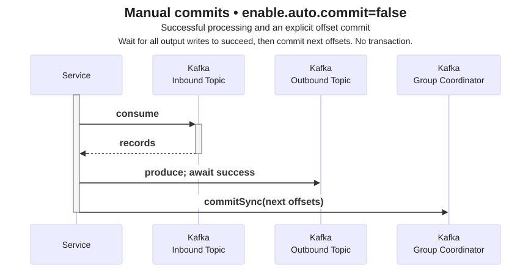

The final arrow is an explicit application-controlled commit to the group coordinator. The next poll follows in this example's chosen loop; Kafka does not require a commit after every poll or automatically commit once per application batch.

## 4. Failure scenarios

**Position is different from committed progress.**

A consumer's **position** advances as `poll()` returns records. Its **committed offset** is saved restart progress for a group and partition. With Kafka's built-in offset storage, the group coordinator records this progress in the internal, compacted `__consumer_offsets` topic, separately for each `(group, topic, partition)`. Compaction removes superseded commits; [the Kafka overview](../Apache%20Kafka/Readme.md#retention-and-compaction) explains that storage policy.

With parallel processing, **never commit past unfinished records in a partition**: one committed number cannot describe arbitrary holes in completed work. If record `42` is unfinished while record `43` has completed, committing `44` would skip `42` after recovery. Track completed progress separately for each partition.

In the example below, committing `43` means resume at offset `43`, after completing record `42`.

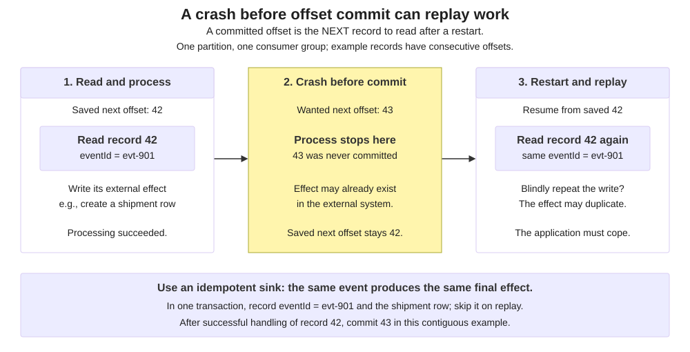

Suppose a worker reads `evt-901` at offset `42`, writes a shipment row for order `42`, and crashes before committing `43`. The replacement resumes from the older committed offset and can process `evt-901` again. The first database write remains real even though Kafka's saved progress did not advance.

`auto.offset.reset` selects the starting position when a partition has no usable committed offset, such as for a new group or after retained records have been deleted. Common choices are `earliest` (the earliest retained offset), `latest` (the end, and the Kafka 4.3 default), and `none` (report an error). It does not rewind a group that already has valid committed offsets, and it cannot recover deleted records.

### Service failure

The following diagram shows two service instances in the same consumer group, with automatic commits disabled. Instance 1 receives successful acknowledgments for its outbound records, then fails before committing the corresponding input offsets. After the partition is reassigned, instance 2 resumes at the last committed offset and can repeat that work, producing duplicate output. The replayed records need not be grouped into the same poll batches as before.

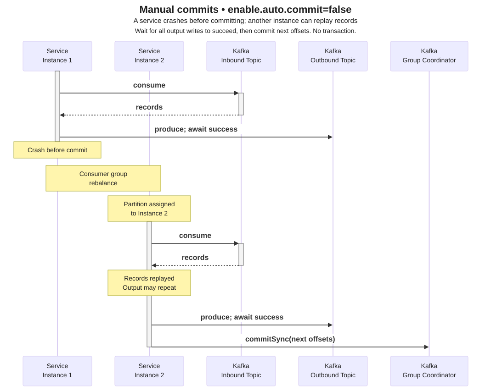

### Poll timeout

**Heartbeats can continue while application processing is stuck.** Heartbeats establish reachability; the polling-progress check prevents a consumer from holding partitions indefinitely without returning to `poll()`. Neither check proves that a database write or background task succeeded.

`max.poll.interval.ms` limits the time **between calls to `poll()`**. It does not limit the duration of one poll call. In a single-threaded poll–process–commit loop, processing, waiting for outbound acknowledgments, and committing must fit within that interval. Exceeding it can cause the consumer to lose its assignment even while its process remains alive. With static membership (`group.instance.id` set), reassignment waits for the session timeout rather than happening immediately.

In the example below, instance 1's output has been acknowledged, but the input offsets remain uncommitted when it exceeds the polling interval. The diagram shows a case where the partition is reassigned to instance 2 before instance 1 attempts its manual commit. Instance 2 resumes from the older committed progress and can produce duplicates.

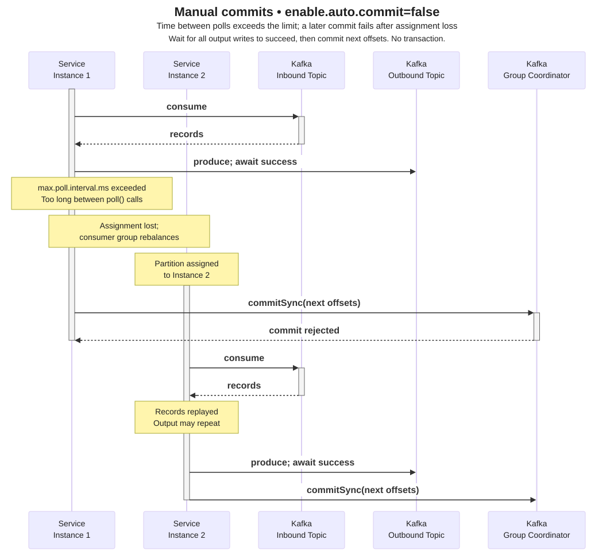

Instance 1's late `commitSync()` fails after it loses the assignment. Its earlier output remains published. A later `poll()` participates in rejoining the group; it does not finish the poll that originally returned those records. The exact rebalance and error sequence depends on the group protocol and timing.

### Single service instance failure

Duplicates do not require a second instance. Here, the sole consumer fails after its output succeeds but before its manual offset commit. On restart, it resumes from the group's last committed offset and can repeat the already completed work. Having one consumer does not make output writes and offset commits atomic.

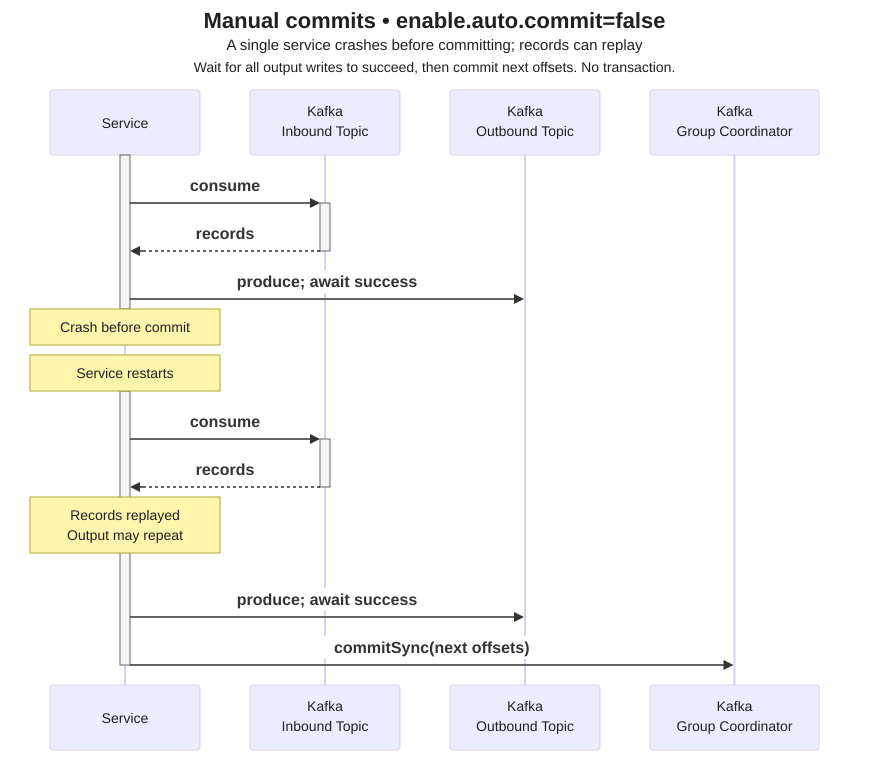

## 5. Publishing without Kafka transactions

**Kafka transactions are optional. An application can publish records with ordinary `send()` calls without calling `initTransactions()`, `beginTransaction()`, or `commitTransaction()`.** Leave `transactional.id` unset for this mode. The producer sends batches to partition leaders, and each send completes according to its acknowledgment policy. There is no transaction commit decision or [commit marker](#transaction-aware-consumers) for these records.

Nontransactional does not mean unreplicated or unreliable. You can still use `acks=all` for replication acknowledgments and **producer idempotence**, which prevents the producer's internal retries from appending duplicate copies of a send. This retry protection does not make several application sends one atomic operation. Consumers configured to hide aborted transactional output (`isolation.level=read_committed`) also receive nontransactional records. They can still wait behind an open transaction in the same partition; [Transaction-aware consumers](#transaction-aware-consumers) explains this visibility boundary.

| Aspect | Advantage of ordinary publishing | Limit to account for |
|---|---|---|
| Application code | No transaction lifecycle or transaction-ID management | Several sends have no shared commit or abort boundary |
| Latency and coordination | Avoids [transaction-coordinator](#successful-transaction) writes and [commit-marker](#transaction-aware-consumers) work | This removes one source of overhead; actual latency still depends on batching, replication, and load |
| Partial failure | Independent events can succeed independently | If publishing an order succeeds but publishing its audit event fails, the order remains published |
| Reliability | Replication acknowledgments and idempotent producer retries remain available | Application retries and consumer reprocessing can still repeat business events or effects |
| Consumer progress | Suitable when each event can be handled independently | Output records and consumed offsets cannot commit together as one Kafka transaction |

### Producer idempotence: retrying an append

An operation is **idempotent** when repeating it has the same intended effect as doing it once. Kafka's idempotent producer prevents its internal retries from appending duplicate copies of the same send. Enable it explicitly when it is part of the application's required contract:

```properties
enable.idempotence=true
acks=all
```

Idempotence requires `acks=all`, positive `retries`, and at most five in-flight requests per connection (`max.in.flight.requests.per.connection<=5`). With `enable.idempotence=true`, incompatible settings fail configuration. Compatible defaults already enable idempotence in the documented version.

This mechanism does not deduplicate two application calls that independently publish `evt-901`. A restarted application can publish the same business event again. Keep a stable event ID when downstream effects must recognize such duplicates. Also distinguish producer retry order from business event time: correct transport does not repair an application's incorrectly ordered events.

### Java example: publishing without transactions

This small Java program uses the `org.apache.kafka:kafka-clients` library and an existing `orders` topic on `localhost:9092`. The string serializer converts the key and JSON text to bytes. Save it as `PlainProducer.java`; authentication and topic creation are outside this example.

```java
import java.util.Properties;
import java.util.concurrent.TimeUnit;
import org.apache.kafka.clients.producer.KafkaProducer;
import org.apache.kafka.clients.producer.ProducerConfig;
import org.apache.kafka.clients.producer.ProducerRecord;
import org.apache.kafka.common.serialization.StringSerializer;

public class PlainProducer {
    public static void main(String[] args) throws Exception {
        var properties = new Properties();
        properties.put(ProducerConfig.BOOTSTRAP_SERVERS_CONFIG, "localhost:9092");
        properties.put(ProducerConfig.KEY_SERIALIZER_CLASS_CONFIG,
                StringSerializer.class.getName());
        properties.put(ProducerConfig.VALUE_SERIALIZER_CLASS_CONFIG,
                StringSerializer.class.getName());
        properties.put(ProducerConfig.ENABLE_IDEMPOTENCE_CONFIG, true);
        properties.put(ProducerConfig.ACKS_CONFIG, "all");
        // No transactional.id: these are ordinary, idempotent sends.

        try (var producer = new KafkaProducer<String, String>(properties)) {
            var record = new ProducerRecord<>("orders", "order-42",
                    "{\"eventId\":\"evt-901\",\"eventType\":\"OrderCreated\"}");
            var metadata = producer.send(record).get(10, TimeUnit.SECONDS);
            System.out.printf("Written to %s-%d at offset %d%n",
                    metadata.topic(), metadata.partition(), metadata.offset());
        }
    }
}
```

`send()` returns a future; `get()` waits here so the example reports an acknowledgment or propagates an error. Success means the configured write acknowledgment was received, not that a consumer completed its work. A wait timeout does not cancel the send or prove it failed; do not blindly publish another copy. Keep a stable event ID and a recovery policy. A service normally reuses its producer and observes asynchronous callbacks or futures instead of creating a producer and blocking for every request.

In Spring Boot, an ordinary, nontransactional `KafkaTemplate` provides the same publishing mode through `kafkaTemplate.send(topic, key, payload)`. Its `CompletableFuture` reports the send outcome. Leave the producer's transaction-ID configuration unset when choosing this mode; the Spring transaction example below explains how that same `send()` call behaves when transactions are enabled.

## 6. Kafka transactions

A **Kafka transaction** can atomically commit output records across Kafka partitions together with consumed input offsets. In the earlier failure scenarios, a service could publish output and crash before saving its input progress. A consume–transform–produce transaction closes that gap: either the output and input progress commit together, or neither becomes committed.

### `Exactly-once` semantics

Read the overview from left to right. The first service consumes input, applies business logic, and produces output inside a transaction. A downstream service uses `isolation.level=read_committed` to exclude aborted output. This supports `exactly-once` Kafka processing results even when the first service must replay input after failure.

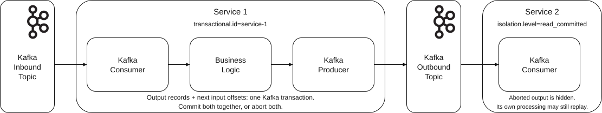

The processor's code can still run again. Aborted attempts can leave records in the log, and a downstream consumer can replay committed records after its own failure. The guarantee depends on coordinating input offsets with output and reading committed results; it does not make arbitrary business effects happen only once.

### Enabling transactions

Set the producer's `transactional.id`, keeping it stable across restarts of the same logical producer and unique among concurrently active producers. It also enables idempotent publishing. Call `initTransactions()` once before the transaction loop. Each `beginTransaction()` changes local producer state; it does not send a request to begin a transaction on the coordinator.

For a consume–transform–produce transaction, set `enable.auto.commit=false`. Produce the output, call `sendOffsetsToTransaction(nextOffsets, consumer.groupMetadata())`, and then `commitTransaction()`. The offsets are the **next input offsets to process**, one for each completed input partition; they do not correspond one-to-one to output partitions. Do not also commit them through the consumer. Kafka Streams and Spring listener transactions can manage this lifecycle, including replay after an abort.

### Transaction-aware consumers

Set `isolation.level=read_committed` on consumers that must hide aborted output; the consumer default is `read_uncommitted`. A **commit marker** is a control record written to a participating partition to record the transaction's outcome. A **last stable offset (LSO)** bounds the records available to `read_committed` consumers: an unresolved transaction holds that boundary back. These consumers filter aborted records and still receive nontransactional records below the boundary. Even unrelated later records may wait behind an open transaction in the same partition.

### Successful transaction

Read the sequence from top to bottom. The service contains both a consumer and a producer. The **transaction coordinator** is a broker role that tracks participating partitions and the transaction's outcome in `__transaction_state`. The **group coordinator** manages the consumer group's offsets in `__consumer_offsets`. The topic columns represent partition leaders and their logs; these roles can be distributed across brokers.

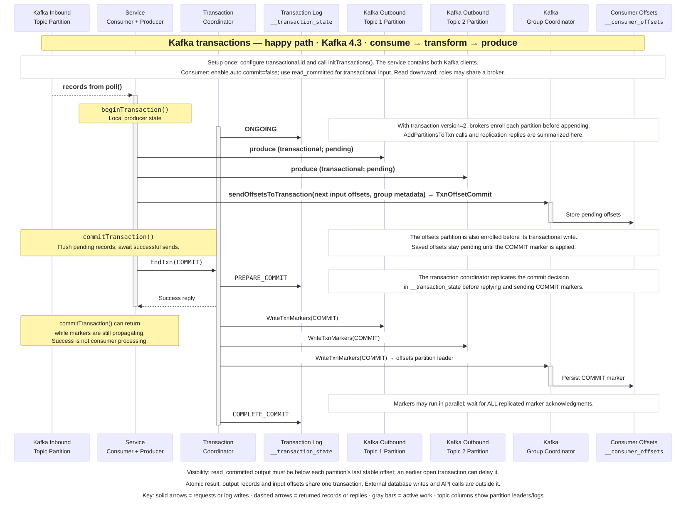

The sequence depicts Kafka 4.3 clients with `transaction.version=2`. Receiving brokers enroll output and offsets partitions through `AddPartitionsToTxn` before appending their transactional writes. The producer sends `TxnOffsetCommit` directly to the group coordinator; older transaction protocols first use `AddOffsetsToTxn`. The group coordinator stores the input offsets as pending records. The offsets partition must receive its transaction marker too.

### Coordinators and stored state

The component view separates output records, input offsets, and transaction metadata. Kafka assigns the producer an internal **producer ID** and an **epoch**, a generation number used to reject stale requests. These are different from the application's stable `transactional.id`. With protocol version 2, the epoch also advances for each transaction.

The diagram has two numbered tracks: `P1`–`P3` are producer calls, and `C1`–`C3` are transaction-coordinator steps. In the record cells, `a` means pending before commit and `c` denotes a commit marker.

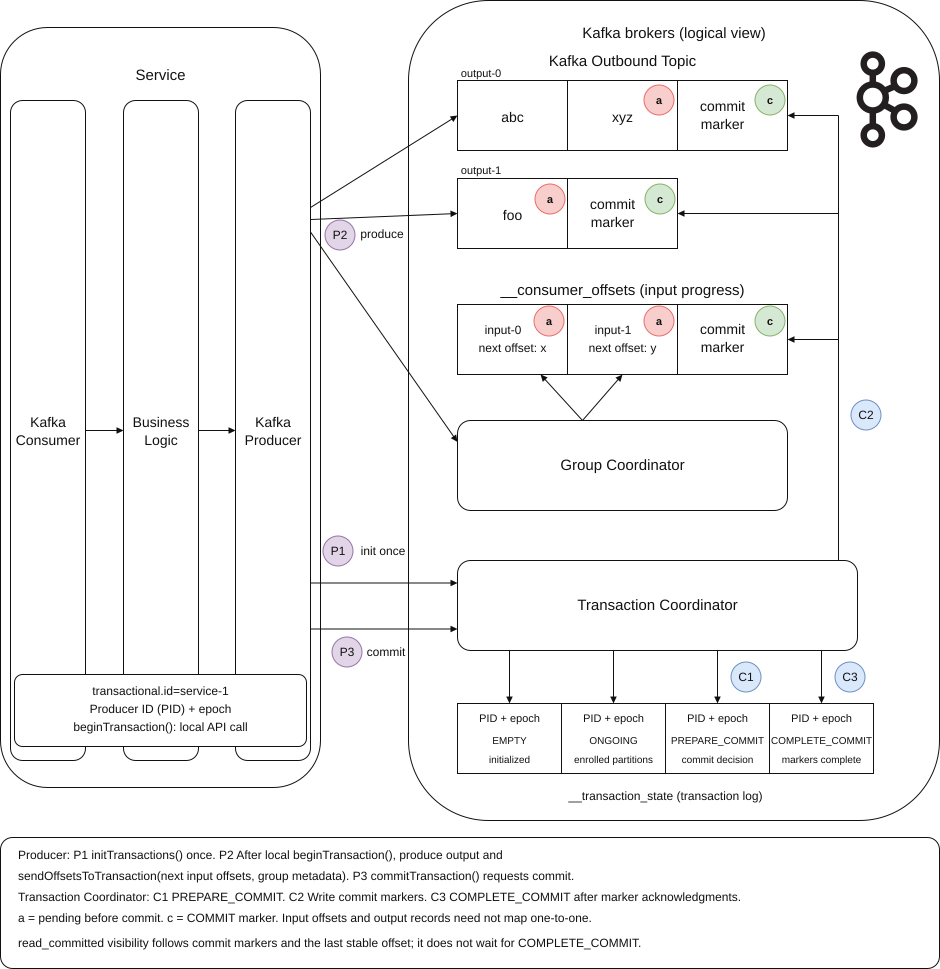

The transaction log records states such as `EMPTY`, `ONGOING`, `PREPARE_COMMIT`, and `COMPLETE_COMMIT`; it does not contain the business payload. The output partitions contain those records, and `__consumer_offsets` contains the group's input progress. The default transaction-state replication settings require three brokers; this is a configurable durability choice, not a protocol requirement for three distinct coordinator machines.

### Commit flow

The **Producer** (`P1`–`P3`) and **Transaction Coordinator** (`C1`–`C3`) groups summarize the same successful transaction. The symbol key repeats the `a` and `c` meanings introduced above.

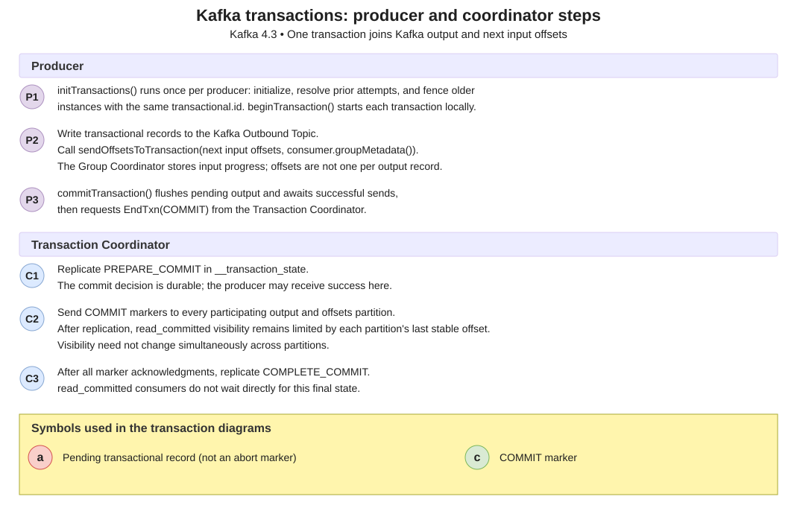

Distinguish three meanings of completion:

1. **Producer success.** `commitTransaction()` flushes pending sends and waits for successful record acknowledgments before requesting the commit. Once the coordinator has replicated `PREPARE_COMMIT`, it can send success to the producer. The call can return while commit markers are still propagating; a record acknowledgment alone was not a transaction commit.
2. **Read visibility.** Each partition's replicated commit marker allows the committed records to become eligible for `read_committed` consumers, subject to its LSO. An earlier open transaction can still hold reads back. This is not a simultaneous visibility switch across all partitions.
3. **Coordinator completion.** After all participating partitions acknowledge their markers, the coordinator replicates `COMPLETE_COMMIT`. Its commit protocol is finished. Readers do not wait directly for this final coordinator record, and none of these points means a consumer has finished the business work.

### Service retry

This failure sequence assumes the service crashes while its transaction is still open, before a commit decision. A replacement producer reuses the same `transactional.id` and calls `initTransactions()` before processing. Kafka **fences** the previous producer, preventing it from continuing with a stale identity, and resolves its unfinished transaction. In this case, that means aborting it. The service then replays input from the group's committed offsets and starts a new transaction.

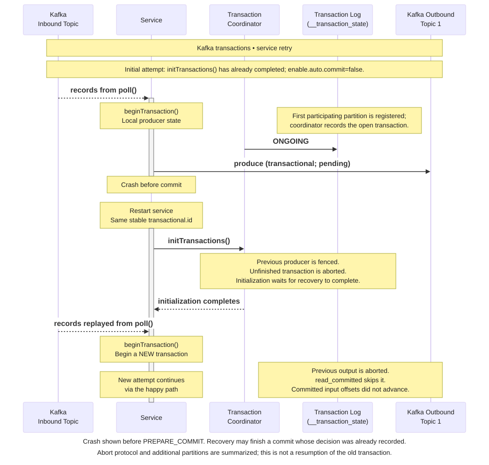

Initialization does not resume the failed application's work. If the previous transaction had already begun completing, initialization waits for that outcome instead; an already recorded commit decision can finish committing. Recovery must use the resulting committed input offsets. Within a surviving process, aborting a producer transaction also does not rewind the consumer's position automatically: the application or framework must arrange replay.

### Transaction timeout

With the default timeout behavior, the coordinator aborts an open transaction that exceeds the producer's `transaction.timeout.ms` (default `60000` ms), measured from the first partition's enrollment. The broker's `transaction.max.timeout.ms` (default `900000` ms) caps the timeout a producer may request; it is not the timeout of every transaction. The sequence below assumes the service crashes with an open transaction before the commit decision. A live but slow producer can also exceed the transaction timeout. The coordinator records `PREPARE_ABORT`, writes replicated abort markers, and records `COMPLETE_ABORT` after the marker acknowledgments. Aborted output is hidden from `read_committed` consumers, and pending input offsets do not become committed.

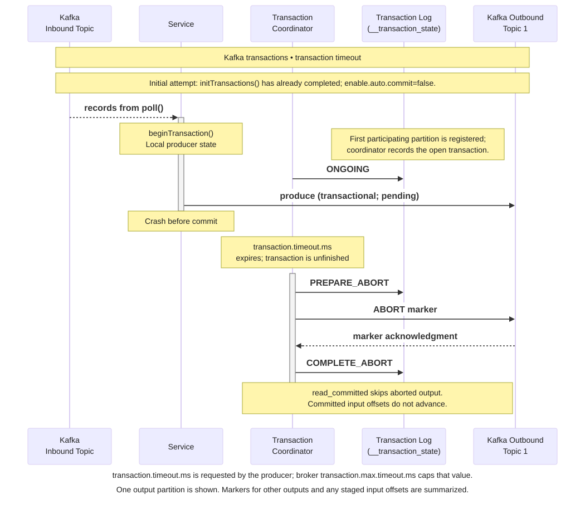

A **timeout of the client's `commitTransaction()` call** is different. It means the client did not obtain the result before `max.block.ms`; the commit may still be completing. The Java producer permits retrying that same commit call. Do not switch to an abort merely because the commit call timed out. If the application does not retry, close the producer and recover safely from the uncertain outcome.

### Database writes and service calls

An **application programming interface (API)** is the interface through which one program requests another component's services. **A Kafka transaction does not automatically include an external database, email server, or payment API.** Re-executing processor code is possible even when its committed Kafka results appear once. For a database effect, atomically record the event ID and the business change in that database, protected by a uniqueness constraint. A separate service call needs that service's own idempotency contract.

A **[transactional outbox](../Patterns.%20Transactional%20Outbox/Readme.md)** stores the business change and a pending publication record in the same database transaction. A relay later publishes that record to Kafka. This preserves the obligation to publish after a database commit, but relay retries can duplicate events, so consumers still need safe deduplication.

A **saga** coordinates a business workflow through a sequence of local transactions, with **compensating transactions** to counteract completed work when a later step fails. For example, reserve inventory, request payment, and release the reservation if payment is rejected. Kafka can carry the commands and outcome events; application logic tracks the workflow. Compensation is a new business action, not an atomic rollback across services: intermediate states can be visible, and compensation can itself fail and need retries. Sagas therefore still need idempotency and recovery rules.

## 7. Starting and handling a transaction in Spring Boot

`KafkaProducer` is a Java client running inside the application process. Spring's `KafkaTemplate` wraps that client; Spring can manage its transaction lifecycle for the application. The following producer-only example commits an order event and an audit event together. It does not consume records or update a database.

Use a Spring Boot 4.1 application with `org.springframework.boot:spring-boot-starter-kafka`, and let Boot manage dependency versions. Boot 4.1's managed Kafka client version can differ from the broker version; these APIs do not require overriding it to match the article's Kafka 4.3 broker discussion. Assume `orders` and `order-audit` already exist. In `application.properties`:

```properties
spring.kafka.bootstrap-servers=localhost:9092
spring.kafka.producer.key-serializer=org.apache.kafka.common.serialization.StringSerializer
spring.kafka.producer.value-serializer=org.apache.kafka.common.serialization.StringSerializer
spring.kafka.producer.transaction-id-prefix=orders-${INSTANCE_ID}-
spring.kafka.producer.acks=all
spring.kafka.producer.properties[enable.idempotence]=true
```

The broker cluster must also support the internal transaction-state topic. Its defaults require three brokers (`transaction.state.log.replication.factor=3`, `transaction.state.log.min.isr=2`). For a disposable single-broker learning setup, both broker settings can be `1`; that setup has no replica redundancy.

Supply `INSTANCE_ID` with a different value for every concurrently running application instance, such as `orders-1` and `orders-2`. Spring adds a suffix for each transactional producer. Setting the prefix makes the producer factory transaction-capable; Boot also auto-configures a `KafkaTransactionManager`. It does **not** wrap every standalone `send()` call in a new transaction.

Put this service in the application's component-scan package. Both payload arguments are already serialized JSON strings; the example waits for both send results to make asynchronous failures explicit.

```java
import java.util.concurrent.CompletableFuture;
import org.slf4j.Logger;
import org.slf4j.LoggerFactory;
import org.springframework.kafka.core.KafkaTemplate;
import org.springframework.stereotype.Service;

@Service
public class OrderPublisher {
    private static final Logger log = LoggerFactory.getLogger(OrderPublisher.class);
    private final KafkaTemplate<String, String> kafkaTemplate;

    public OrderPublisher(KafkaTemplate<String, String> kafkaTemplate) {
        this.kafkaTemplate = kafkaTemplate;
    }

    public void publishOrderAndAudit(String orderId, String orderJson,
                                    String auditJson) {
        try {
            kafkaTemplate.executeInTransaction(tx -> {
                var orderSend = tx.send("orders", orderId, orderJson);
                var auditSend = tx.send("order-audit", orderId, auditJson);
                CompletableFuture.allOf(orderSend, auditSend).join();
                return null;
            });
        } catch (RuntimeException failure) {
            log.error("Kafka publication did not report success for {}", orderId, failure);
            throw failure;
        }
    }
}
```

`executeInTransaction()` begins a transaction before invoking the callback. Successful callback completion leads to a commit. A callback exception, including a failed send surfaced by `join()`, causes Spring to attempt an abort and propagate the failure. The catch is outside the transaction boundary: it reports the error and leaves recovery to the caller. Catching an error inside the callback and returning normally could instead allow a commit.

The successful send futures only confirm record writes; the transaction has not committed at `join()`. Successful return from `executeInTransaction()` is the producer's transaction-success signal. A failure during commit can leave an uncertain outcome, so the catch does not claim that the transaction aborted and does not automatically start a replacement transaction. Keep durable business-event identities and make recovery safe against duplicate effects.

Every downstream consumer that must hide aborted output needs `isolation.level=read_committed`; in a Spring Boot consumer application, set:

```properties
spring.kafka.consumer.properties[isolation.level]=read_committed
```

An alternative is a public service method annotated with `@Transactional(transactionManager = "kafkaTransactionManager", rollbackFor = Exception.class)` that performs the sends directly. Call it through the Spring-managed bean from another bean so the transaction interceptor runs; a same-object method call bypasses the usual proxy. The explicit rollback rule includes checked exceptions, which do not trigger rollback by default. Choose this method boundary or `executeInTransaction()` for the operation: the latter starts its own separate transaction even if a Spring-managed transaction is already active. Nesting one `executeInTransaction()` call inside another is rejected.

| Context of `kafkaTemplate.send(...)` | Behavior |
|---|---|
| Nontransactional producer factory | Ordinary asynchronous publication |
| Transaction-capable template inside an active Kafka transaction | Sends participate; Spring commits or aborts at the surrounding boundary |
| Transaction-capable template outside a transaction | `IllegalStateException` by default; `allowNonTransactional=true` explicitly permits an ordinary send |
| Transaction-capable template inside a supported Spring database transaction | Spring can synchronize a Kafka transaction with it, but their commits remain separate |

For a Kafka listener that consumes and produces, prefer the container's transaction support when input offsets and output must commit together. A container configured with `KafkaTransactionManager` begins before the listener, includes its template sends, and adds consumed offsets before commit. Listener failure rolls back and permits redelivery. A local `executeInTransaction()` alone does not include listener offsets. Likewise, synchronizing a database transaction and a Kafka transaction leaves a failure window between their commits; use the [transactional outbox pattern](../Patterns.%20Transactional%20Outbox/Readme.md) when the database change must reliably lead to publication.

## 8. Choosing the required guarantee

**There is no single transaction setting that every Kafka application should use.** The following is a practical selection guide derived from the documented guarantees, not a claim about measured adoption. Ordinary publishing is a first-class Kafka mode. Current compatible producer defaults enable idempotence, while Kafka Streams defaults to `at_least_once` processing; transactions and `exactly_once_v2` are deliberate choices.

| Workload or requirement | Practical starting point | Why |
|---|---|---|
| Independent events, telemetry, logs, or notifications | Ordinary publishing; enable idempotence and use `acks=all` where replication acknowledgment matters | Avoid a transaction boundary when records do not need to commit together; choose suitable replication and minimum ISR as described in [the Kafka overview](../Apache%20Kafka/Readme.md#replication-acknowledgments-and-the-isr) |
| Several Kafka outputs must share one commit outcome | Kafka transaction plus downstream `read_committed` | Prevents consumers from treating an aborted partial publication as committed output |
| Kafka input → processing → Kafka output, with atomic output and input progress | Kafka Streams `processing.guarantee=exactly_once_v2` or Spring container-managed transactions | The framework coordinates output and consumed offsets; processing code can still run again after failure |
| Database update must eventually publish an event | Transactional outbox plus a relay or change data capture, and duplicate-safe consumers | The database atomically saves its change and publication obligation; a Kafka-only transaction cannot do that |
| Consumer writes to a database or calls an external service | Safe offset commits, durable deduplication, and an idempotency contract for the effect | Kafka transactions alone cannot guarantee `exactly-once` external effects |

For independent business events, a useful baseline is **idempotent publishing, replication acknowledgments, `at-least-once` processing, and duplicate-safe business effects**. Add Kafka transactions when there is a concrete need for atomic Kafka outputs or output-plus-offset commits. Their benefit is that atomic boundary; their costs include coordinator and marker work, transaction-ID management, failure recovery, and possible delays for `read_committed` readers while transactions remain unresolved. Keep transactions short and measure the tradeoff with the real workload; no fixed throughput penalty applies to every deployment.

## 9. Check your understanding

Try answering each question before expanding its answer.

1. Shipping creates a shipment for `evt-901` at offset `42`, then crashes before committing `43`. Where is its saved progress stored, where can it resume, and what prevents another shipment?

   <details>
   <summary>Answer</summary>

   Kafka's built-in storage uses `__consumer_offsets`. If the saved next offset is still `42`, the replacement can replay `evt-901`. Atomically store that event ID with the shipment row and recognize it on replay; then commit safe progress.

   </details>

2. A worker keeps sending heartbeats but never returns to `poll()`. Which timeout detects this? What detects a worker that stops sending heartbeats altogether, and which group protocol is the Kafka 4.3 default?

   <details>
   <summary>Answer</summary>

   `max.poll.interval.ms` checks polling progress. Kafka 4.3 defaults to `group.protocol=classic`, where client `session.timeout.ms` detects missing heartbeats. With `group.protocol=consumer`, the broker controls this timeout through `group.consumer.session.timeout.ms`.

   </details>

3. Does an outbox guarantee that `evt-901` is published only once, or a Kafka transaction guarantee `exactly-once` effects for an external payment call? What does a saga add if payment fails after inventory was reserved?

   <details>
   <summary>Answer</summary>

   No to both. The outbox preserves a publication obligation, but relay retries can duplicate events; Kafka transactions coordinate Kafka records and offsets. A saga can compensate for the reservation by releasing inventory after payment fails. It does not atomically roll back all services, so retries, idempotency, and compensation recovery still matter.

   </details>

4. With `enable.auto.commit=true`, does Kafka commit input offsets when all outbound writes finish? What controls the timing, what is its default interval, and does it check whether a database write or background task succeeded?

   <details>
   <summary>Answer</summary>

   No. Auto-commit is periodic, controlled by `auto.commit.interval.ms` (default `5000` ms); in the classic Java consumer, the polling path drives the timer check and coordinator work. It is not triggered by outbound-batch completion and does not inspect business success. Finish the records returned by a poll before polling again or closing, or manage commits explicitly.

   </details>

5. A nontransactional service wants explicit control over commits. Which consumer setting and sequence of processing, outbound acknowledgments, and offset commits should it use? Can a crash still cause duplicate output?

   <details>
   <summary>Answer</summary>

   Set `enable.auto.commit=false`, process the input, wait for every required outbound send to succeed, then call `commitSync(nextOffsets)` for completed input progress. An asynchronous `send()` call alone is insufficient. Yes: a crash after output succeeds but before the offset commit can replay input and duplicate output because these are separate operations.

   </details>

6. In one partition, record `42` is unfinished but `43` has completed. Is committing `44` safe? What does a single committed offset fail to represent?

   <details>
   <summary>Answer</summary>

   No. Committing `44` says everything before it is complete and would skip unfinished `42` on recovery. A partition's committed offset cannot represent holes in completed work; advance only through a contiguous completed prefix, tracked separately for each partition.

   </details>

7. A transactional processor crashes and replays an input record. Can its code run twice while still providing `exactly-once` Kafka processing results? What can remain in the output log, and can a downstream consumer replay committed records?

   <details>
   <summary>Answer</summary>

   Yes. Transactions join Kafka output and input progress, so a failed attempt can be aborted before a replay produces committed results. Aborted records can remain physically in the log but are filtered by `read_committed`. A downstream consumer can replay committed records after its own failure; arbitrary external effects still need idempotency.

   </details>

8. How should `transactional.id` behave across restarts and concurrent producers? Which of `initTransactions()` and `beginTransaction()` runs once per producer, and which starts each transaction locally?

   <details>
   <summary>Answer</summary>

   Keep `transactional.id` stable for the same logical producer across restarts and unique among concurrently active producers. Complete `initTransactions()` once per producer to obtain its identity and resolve prior transactions; the replacement fences the old producer. Call `beginTransaction()` for each transaction; it changes local client state.

   </details>

9. A service finishes processing through offset `42` in input partition P0 and produces to two output partitions. Which input offset should it pass to `sendOffsetsToTransaction()`, with what group information? Does it need an offset for each output partition or a separate `commitSync()`?

   <details>
   <summary>Answer</summary>

   Pass next input offset `43` for P0 and `consumer.groupMetadata()`. Output partitions do not each require their own consumed offset. The group coordinator stores the input progress as pending in `__consumer_offsets`, and the transaction commits it with the output. Disable auto-commit and do not also use consumer commits for those offsets.

   </details>

10. Which isolation level hides aborted output, and what is the consumer default? Can an earlier open transaction hold back later committed or nontransactional records in the same partition?

    <details>
    <summary>Answer</summary>

    `isolation.level=read_committed` hides aborted transactional records; `read_uncommitted` is the default. Yes: an unresolved earlier transaction holds back the partition's LSO. Later records, including nontransactional records, must remain below that boundary to be returned in `read_committed` mode.

    </details>

11. Which coordinator manages transaction state and which manages group offsets? Where are the state, input progress, and business payload stored? How do the internal producer ID and epoch differ from `transactional.id`?

    <details>
    <summary>Answer</summary>

    The transaction coordinator tracks participants and outcomes in `__transaction_state`; the group coordinator manages input progress in `__consumer_offsets`. Business payload stays in the application topic partitions. The application configures a stable `transactional.id`; Kafka assigns an internal producer ID and epoch to identify and reject stale producer requests. Protocol version 2 also advances the epoch per transaction.

    </details>

12. The coordinator has replicated `PREPARE_COMMIT`, but markers have not reached every partition. Can the producer receive success? What makes output readable, when is `COMPLETE_COMMIT` recorded, and does any of this prove downstream business work finished?

    <details>
    <summary>Answer</summary>

    Yes: the durable commit decision permits a producer success reply while markers propagate. Each partition's replicated commit marker enables visibility subject to its LSO; another open transaction can still delay reads. After all participant marker acknowledgments, the coordinator records `COMPLETE_COMMIT`. Visibility need not change simultaneously across partitions, and none of these milestones proves downstream business work finished.

    </details>

13. With Kafka 4.3 clients and `transaction.version=2`, who enrolls participating partitions, and when? Does sending transactional offsets still require the producer's older `AddOffsetsToTxn` request?

    <details>
    <summary>Answer</summary>

    Receiving brokers enroll output and offsets partitions through `AddPartitionsToTxn` before appending transactional writes. The version 2 producer sends `TxnOffsetCommit` directly to the group coordinator, skipping the older producer-side `AddOffsetsToTxn` step. Input offsets remain pending until the transaction commits.

    </details>

14. A service crashes before the commit decision. Does the replacement producer's `initTransactions()` resume the old transaction? What changes if the old transaction had already begun committing, and does aborting automatically rewind a surviving consumer?

    <details>
    <summary>Answer</summary>

    No. The replacement reuses the same `transactional.id`; initialization fences the old producer and aborts its still-open transaction before replay starts in a new transaction. If completion had already begun, initialization waits for that outcome, which can be a commit. Resume from the resulting committed input offsets. Aborting a producer transaction does not itself rewind a surviving consumer; the application or framework must arrange replay.

    </details>

15. Which setting governs an ordinary open transaction's lifetime, when does its timer start, and how does the broker's maximum differ? Must the producer crash for this timeout to fire? What happens to its output and pending input offsets after abort?

    <details>
    <summary>Answer</summary>

    The producer's `transaction.timeout.ms` defaults to `60000` ms and starts from first partition enrollment. Broker `transaction.max.timeout.ms` defaults to `900000` ms and caps the requested lifetime. A live but slow producer can also overrun it; the diagram uses a crash as one example. The coordinator records `PREPARE_ABORT`, writes replicated abort markers, then records `COMPLETE_ABORT` after marker acknowledgments. `read_committed` hides aborted output, and pending input offsets do not advance committed progress.

    </details>

16. `commitTransaction()` throws a timeout because `max.block.ms` elapsed. Does that prove the transaction aborted? What operation may the Java producer retry, and may it switch to `abortTransaction()`?

    <details>
    <summary>Answer</summary>

    No: the client failed to obtain the result within its wait limit, and the commit may still be completing. It may retry the same `commitTransaction()` call; it must not switch to `abortTransaction()` because of that timeout. If it does not retry, it must close the producer and recover safely from the uncertain outcome.

    </details>

17. An ordinary producer returns a future from `send()`. What does a successful future establish, and what does it leave unknown? Does timing out while waiting cancel the send or prove it failed?

    <details>
    <summary>Answer</summary>

    It establishes the configured broker write acknowledgment. It does not establish completed consumer work or, for a transactional send, the transaction commit. A caller wait timeout does not cancel the send or prove failure; publishing another copy blindly can duplicate the event.

    </details>

18. Does producer idempotence deduplicate two application calls that publish the same business event? Which retries does it protect, which three settings must be compatible, and what identity helps a consumer recognize repeated effects?

    <details>
    <summary>Answer</summary>

    No. Producer idempotence protects the producer's internal retries of a send; separate application sends can still publish the same business event again. It requires `acks=all`, `retries>0`, and `max.in.flight.requests.per.connection<=5`. Keep a stable event ID and atomically record it with the consumer's business effect when deduplicating in a database.

    </details>

19. A Spring producer has a transaction-ID prefix configured. Does a standalone `KafkaTemplate.send()` automatically start a transaction? What does `executeInTransaction()` include, and what causes its callback work to be aborted?

    <details>
    <summary>Answer</summary>

    No. A transaction-capable template normally requires an active transaction; otherwise it throws `IllegalStateException` unless nontransactional sends were explicitly allowed. `executeInTransaction()` runs its callback sends in a local Kafka transaction. Normal completion leads to commit; a callback exception causes an abort attempt. It does not automatically include consumer offsets or database writes.

    </details>

20. A Kafka listener consumes input and produces output. Why is a local `executeInTransaction()` call alone insufficient to commit its input progress with output? Does synchronizing a database transaction with Kafka make both commits atomic?

    <details>
    <summary>Answer</summary>

    Local template transactions do not automatically include listener offsets. A listener container configured with `KafkaTransactionManager` can include the listener's sends and consumed offsets in one Kafka transaction and arrange redelivery on rollback. Database/Kafka synchronization still has separate commits and a failure window; use an outbox when a database change must reliably lead to publication.

    </details>

# Sources

- [Apache Kafka introduction: events, topics, partitions, and retention independent of consumption](https://kafka.apache.org/43/getting-started/introduction/)
- [ProducerRecord API: record fields, partition selection, and timestamps](https://kafka.apache.org/43/javadoc/org/apache/kafka/clients/producer/ProducerRecord.html)
- [ConsumerRecord API: topic, partition, offset, key, and value](https://kafka.apache.org/43/javadoc/org/apache/kafka/clients/consumer/ConsumerRecord.html)
- [Kafka design: delivery guarantees, log storage, pull consumption, replication, transactions, share groups, and compaction](https://kafka.apache.org/43/design/design/)
- [KafkaProducer API: asynchronous sends, retry idempotence, and transactions](https://kafka.apache.org/43/javadoc/org/apache/kafka/clients/producer/KafkaProducer.html)
- [Spring Boot Kafka support: template and transaction-manager auto-configuration](https://docs.spring.io/spring-boot/reference/messaging/kafka.html)
- [Spring Boot managed dependencies: compatible Spring Kafka and Kafka client versions](https://docs.spring.io/spring-boot/appendix/dependency-versions/coordinates.html)
- [Spring Kafka sending: asynchronous template results and error handling](https://docs.spring.io/spring-kafka/reference/kafka/sending-messages.html)
- [Spring Kafka transactions: local transactions, transaction IDs, synchronization, and nontransactional sends](https://docs.spring.io/spring-kafka/reference/kafka/transactions.html)
- [Spring Kafka 4.1.1 implementation: callback failures, abort attempts, and commit-error propagation](https://github.com/spring-projects/spring-kafka/blob/v4.1.1/spring-kafka/src/main/java/org/springframework/kafka/core/KafkaTemplate.java#L679-L722)
- [Spring Kafka exactly-once semantics: listener transactions, output, offsets, and rollback](https://docs.spring.io/spring-kafka/reference/kafka/exactly-once.html)
- [Spring transaction annotations: transaction-manager selection and proxy boundaries](https://docs.spring.io/spring-framework/reference/data-access/transaction/declarative/annotations.html)
- [Spring rollback rules: unchecked exceptions by default and explicit checked-exception rules](https://docs.spring.io/spring-framework/reference/data-access/transaction/declarative/rolling-back.html)
- [Kafka transaction protocol: partition enrollment and protocol-version differences](https://kafka.apache.org/43/operations/transaction-protocol/)
- [Supplied Kafka transactions happy-path PNG: reference layout adapted into the local SVG](https://cdn.prod.website-files.com/687e4d3574f64b1a223d933f/68bef2534e1ffc55d99f30aa_kafka-transactions-seq-happy-path.png)
- [KIP-890: server-side partition enrollment and transaction-specific producer epochs](https://cwiki.apache.org/confluence/spaces/KAFKA/pages/235834631/KIP-890+Transactions+Server-Side+Defense)
- [Kafka 4.3.0 producer: commitTransaction waits up to max.block.ms for its result](https://github.com/apache/kafka/blob/4.3.0/clients/src/main/java/org/apache/kafka/clients/producer/KafkaProducer.java#L790-L798)
- [Kafka 4.3.0 producer transaction manager: beginTransaction changes local client state](https://github.com/apache/kafka/blob/4.3.0/clients/src/main/java/org/apache/kafka/clients/producer/internals/TransactionManager.java#L348-L353)
- [Kafka 4.3.0 producer transaction manager: version 2 sends transactional offsets without AddOffsetsToTxn](https://github.com/apache/kafka/blob/4.3.0/clients/src/main/java/org/apache/kafka/clients/producer/internals/TransactionManager.java#L422-L452)
- [Kafka 4.3.0 transaction coordinator: durable commit decision, success response, and marker propagation](https://github.com/apache/kafka/blob/4.3.0/core/src/main/scala/kafka/coordinator/transaction/TransactionCoordinator.scala#L851-L1001)
- [Kafka 4.3.0 transaction state manager: replicated state-log writes](https://github.com/apache/kafka/blob/4.3.0/core/src/main/scala/kafka/coordinator/transaction/TransactionStateManager.scala#L668-L816)
- [Kafka 4.3.0 marker manager: record completion after all partition acknowledgments](https://github.com/apache/kafka/blob/4.3.0/core/src/main/scala/kafka/coordinator/transaction/TransactionMarkerChannelManager.scala#L336-L380)
- [Kafka 4.3.0 broker request handling: commit markers for data and consumer-offset partitions](https://github.com/apache/kafka/blob/4.3.0/core/src/main/scala/kafka/server/KafkaApis.scala#L1794-L1845)
- [Kafka 4.3.0 partition transaction state: marker replication and unresolved transactions](https://github.com/apache/kafka/blob/4.3.0/storage/src/main/java/org/apache/kafka/storage/internals/log/ProducerStateManager.java#L241-L265)
- [Kafka 4.3.0 partition log: last stable offset and read-committed visibility](https://github.com/apache/kafka/blob/4.3.0/storage/src/main/java/org/apache/kafka/storage/internals/log/UnifiedLog.java#L671-L685)
- [Producer configuration: acknowledgments, idempotence, transaction identity, and timeouts](https://kafka.apache.org/43/configuration/producer-configs/)
- [KafkaConsumer API: group assignments, committed offsets, out-of-range recovery, and beginning/end offsets](https://kafka.apache.org/43/javadoc/org/apache/kafka/clients/consumer/KafkaConsumer.html)
- [Kafka 4.3.0 classic Java consumer: polling drives coordinator work](https://github.com/apache/kafka/blob/4.3.0/clients/src/main/java/org/apache/kafka/clients/consumer/internals/ClassicKafkaConsumer.java#L694-L698)
- [Kafka 4.3.0 consumer coordinator: periodic automatic commits](https://github.com/apache/kafka/blob/4.3.0/clients/src/main/java/org/apache/kafka/clients/consumer/internals/ConsumerCoordinator.java#L1198-L1206)
- [Kafka distribution: group coordinators and compacted offset storage](https://kafka.apache.org/43/implementation/distribution/)
- [Consumer configuration: group protocol, offset reset, automatic commits, polling, and isolation](https://kafka.apache.org/43/configuration/consumer-configs/)
- [Consumer rebalance protocol: incremental assignment and migration](https://kafka.apache.org/43/operations/consumer-rebalance-protocol/)
- [Topic configuration: cleanup, retention, minimum ISR, and file synchronization](https://kafka.apache.org/43/configuration/topic-configs/)
- [Broker configuration: replication controls, transaction-state durability, and maximum transaction timeout](https://kafka.apache.org/43/configuration/broker-configs/)
- [AWS transactional outbox: database changes and reliable eventual publication](https://docs.aws.amazon.com/prescriptive-guidance/latest/cloud-design-patterns/transactional-outbox.html)
- [Saga pattern: local transactions and compensation across services](https://learn.microsoft.com/en-us/azure/architecture/patterns/saga)
- [Compensating transactions: business-specific undo actions and recovery](https://learn.microsoft.com/en-us/azure/architecture/patterns/compensating-transaction)
- [Kafka Streams configuration: exactly-once processing and state durability](https://kafka.apache.org/43/streams/developer-guide/config-streams/)
- [PostgreSQL transactions: committing several changes atomically](https://www.postgresql.org/docs/current/tutorial-transactions.html)
- [PostgreSQL constraints: enforcing unique event identities](https://www.postgresql.org/docs/current/ddl-constraints.html#DDL-CONSTRAINTS-UNIQUE-CONSTRAINTS)
- [Kafka Consume & Produce: At-Least-Once Delivery](https://www.lydtechconsulting.com/blog/kafka-consume-produce-at-least-once-delivery)
- [Lydtech — Kafka Transactions: Part 1 - Exactly-Once Messaging (six source images; corrected local adaptations)](https://www.lydtechconsulting.com/blog/kafka-transactions-part-1---exactly-once-messaging)
