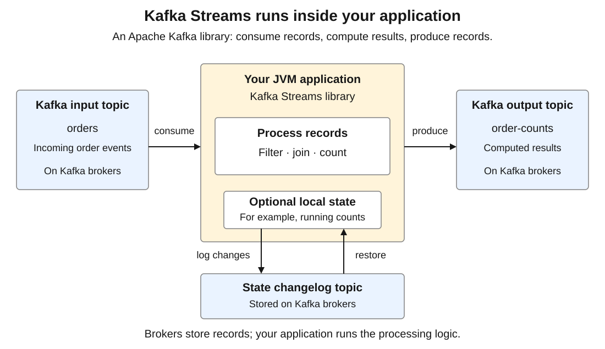
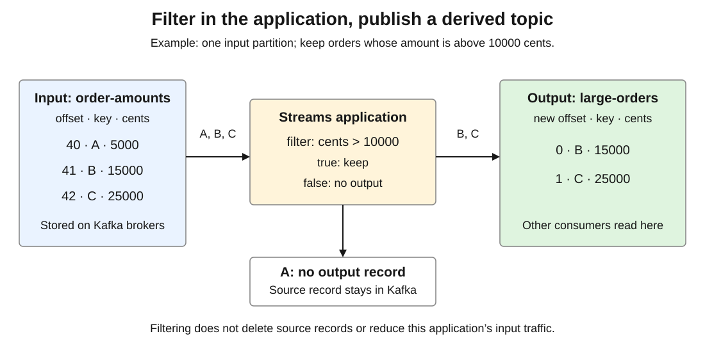
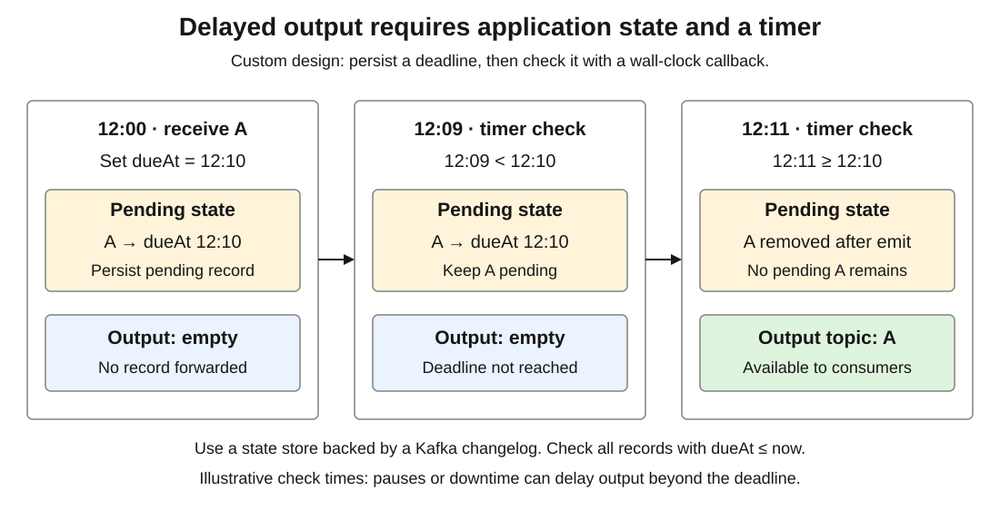

# Apache Kafka. Streams

<sub>[Back to Distributed Systems](../Readme.md#content)</sub>

**Kafka Streams is Apache Kafka's client library for continuously reading, transforming, combining, and publishing records in your own application.**

Streams belongs to Apache Kafka but runs in your application's **Java Virtual Machine (JVM)**. You deploy it separately from the brokers.

Using Kafka 4.3 documentation, this article covers purpose and placement → processing model → filtering → delayed delivery → use cases → operation → quiz. For logs and groups, see [Apache Kafka](../Apache%20Kafka/Readme.md); for transactions, see [Delivery and transactions](../Apache%20Kafka.%20Delivery%20and%20transactions/Readme.md).

## 1. Why Kafka Streams exists

An online shop needs a large-order feed and counts per merchant per minute. Kafka brokers store and replicate orders; applications compute these results.

A consumer and producer can implement a simple filter. Counts and joins also need state, partition coordination, recovery, and consistent output. Streams supplies this machinery while you define the computation.

### What runs where

Here the application computes and Kafka stores data. A **changelog topic** records state changes for restoration after failure.



| Component | Responsibility | Where it runs |
|---|---|---|
| Kafka brokers | Store partition logs, replicate records, serve reads and writes | Kafka servers |
| Producer and consumer clients | Send and fetch records; expose APIs to application code | Your application |
| Kafka Streams | Run your processing graph, distribute work, manage state and recovery | Your application, using Kafka clients |
| [Kafka Connect](../Apache%20Kafka.%20Connect/Readme.md) | Move data between Kafka and external systems | Connect workers |

### Why processing is outside the brokers

Add the official `org.apache.kafka:kafka-streams` client library to your application. It needs no separate Streams server and installs no business logic in brokers.

You deploy and scale processing with its own CPU and memory, independently of brokers. Brokers still store and replicate input, output, and internal topics; both capacities matter.

Streams does not provision machines or restart crashed processes; use your normal deployment tools.

## 2. The processing model

A **topology** is a graph of operations: for example, `read orders → filter large orders → write large-orders`. Streams divides its execution into **tasks**, units of work associated with input partitions.

| Concept | Meaning | Example |
|---|---|---|
| `KStream` | A stream of individual events; repeated keys are separate events | Two purchases by customer `7` |
| `KTable` | An evolving table: each key has a current value, updated by incoming records | Customer `7` changes address |
| Stateless operation | Needs only the current record | Keep orders above an amount threshold |
| Stateful operation | Remembers information across records | Count orders per merchant |
| Window | Groups records by a time interval or session | Count orders in each minute |
| State store | Holds a task's remembered data locally | Merchant `7`, minute `12:00`: count `12` |

A `KTable` record replaces its key's current value; a null value deletes it and is called a **tombstone**. A `KStream` treats repeated keys as separate events.

The **domain-specific language (DSL)** provides `filter`, `join`, and `count`. The **Processor API** provides custom record handling, metadata access, state stores, and scheduled callbacks. Both run in your application.

### Partitioning, scaling, and recovery

Instances with the same `application.id` cooperate; a different ID identifies a separate processing application. `bootstrap.servers` supplies addresses for discovering the Kafka cluster.

For a simple pipeline with one three-partition input topic, there are three tasks. Three instances can share them; a fourth launches without an active task and can take over after a failure. With `num.standby.replicas` above its default `0`, it can maintain **standby state**, backup copies for tasks with changelogged state stores. A stateless filter gets no standby replicas. One instance can run several tasks. This resembles the partition limit for [standard consumer groups](../Apache%20Kafka/Readme.md#sharing-work-versus-independent-subscriptions).

Grouping orders by merchant can require an internal **repartition topic** to bring records with that key together, adding network and storage costs. A filter that leaves keys unchanged does not itself require repartitioning.

Changelogging is enabled by default for built-in stores. For a source `KTable`, reusing its input topic as the recovery log is opt-in: set `topology.optimization=reuse.ktable.source.topics` (default `none`), and pass the same `props` to both `builder.build(props)` and `new KafkaStreams(topology, props)`. Plan local disk space, broker storage, and time to restore state.

## 3. Message filtering

### What plain Kafka supports

The standard consumer API selects **topics, partitions, and offsets**. It has no arbitrary broker-side content selector such as `amount > 10000`, `key = customer-7`, or `header.type = OrderCreated`. A topic subscription regular expression matches topic names.

An ordinary consumer can fetch records and skip unwanted ones. They have already crossed the network. This often suffices for a simple condition.

### Filtering with Kafka Streams

A **predicate** returns true or false. `KStream.filter()` keeps records for which it returns `true`; `filterNot()` keeps those returning `false`. Both receive key and value. For headers or other metadata, use the Processor API, for example `processValues()`.

Here the value is an order amount in cents. All three input records reach the Streams application; only amounts above `10000` are written to `large-orders`. The output topic assigns its own offsets.



This Java topology fragment omits imports, configuration, startup, and shutdown. Input keys are strings; amounts use Kafka's binary `Long` encoding, not JSON. A **Serde** pairs serialization and deserialization for a type.

```java
StreamsBuilder builder = new StreamsBuilder();

KStream<String, Long> orders = builder.stream(
    "order-amounts",
    Consumed.with(Serdes.String(), Serdes.Long())
);

orders
    .filter((orderId, cents) -> cents != null && cents > 10_000L)
    .to("large-orders", Produced.with(Serdes.String(), Serdes.Long()));
```

Create the input and output topics, configure the Kafka connection, and give instances the same application ID, such as `large-order-filter`. Keep the application running to produce filtered output.

Filtering has three consequences:

* **The source is unchanged.** A skipped record remains until the source topic's cleanup policy removes it; its offset is unchanged. Streams advances processing and, on commit, its committed position past filtered-out records too.
* **Downstream readers can save work.** They subscribe to `large-orders` and fetch only matching output. The Streams application still reads the source records.
* **Filtering does not route by content.** In a standard consumer group, ignoring a record does not hand it to another member. A **share group** lets consumers share records from a partition and acknowledge each individually. Its `RELEASE` acknowledgment permits redelivery, not selection of a consumer by content. Use separate groups or derived topics for independent rules.

If producers know the category, separate topics can avoid unrelated reads.

## 4. Delayed and scheduled messages

* **Delayed delivery** means “make this message available after ten minutes.”
* **Scheduled delivery** means “make it available at 15:00.”

These differ from periodically running a computation.

### 4.1. Plain Kafka has no native per-message delivery timer

Kafka has no `deliverAt` or per-record delay setting. A **future record timestamp** means the producer stamps a record with a time later than the broker’s current clock.

What happens depends on the topic settings. Suppose the broker's clock reads **12:00**:

| Topic timestamp mode | Producer's timestamp | What happens |
|---|---|---|
| Default `CreateTime` | **12:30 today** | Passes the timestamp check; stored with timestamp **12:30**. |
| Default `CreateTime` | **12:00 tomorrow** | The broker rejects it; the send fails with `InvalidTimestampException`. |
| `LogAppendTime` | Any future time | Replaced with the broker's append time. |

For `CreateTime`, `message.timestamp.after.max.ms` sets the allowed lead over broker time: **one hour** (`3600000` ms) by default since Kafka 4.0 (KIP-1030).

**An accepted future timestamp does not postpone delivery.** The **12:30** record can be consumed before 12:30 once normal replication and transaction visibility rules allow it.

A `dueAt` field needs application logic; `linger.ms` controls producer batching. Implement delivery deadlines in your application or a durable scheduler.

### 4.2. Kafka Streams supplies callbacks, not a ready-made delay queue

A processor has two entry points in this design:

* **Record arrives:** Streams calls `process(record)`; your code stores the message and its deadline.
* **A time check becomes due:** Streams calls a function you supplied to inspect stored messages and forward those due.

A **callback** is a function you supply for a framework to call later. Streams calls its periodic callback a **punctuator**. You write the business logic; `schedule(...)` controls when Streams invokes it.

#### **Registering the callback**

Streams calls `init(context)` to set up a processor. The `context` provides state-store access, forwarding, and scheduling. This Java fragment belongs inside `init`:

```java
context.schedule(
    Duration.ofSeconds(30),
    PunctuationType.WALL_CLOCK_TIME,
    now -> checkDueRecords(now)
);
```

Read this as “check every 30 seconds, using the system clock, by calling my method.” `now -> checkDueRecords(now)` supplies a function without calling it immediately. You implement `checkDueRecords`; it is not a Kafka API.

Registration returns without waiting. Registered at `12:00`, it requests checks around `12:00:30`, `12:01:00`, and so on. **The interval controls how often to check; each message's deadline controls when it is eligible.** A check can find zero, one, or many due messages.

Streams checks schedules in its processing loop and calls the callback on the stream thread assigned to the task, passing the current time in milliseconds as `now`. Several tasks can share this thread. Afterward it continues other work. No thread is created per message; a slow callback delays other work on the same thread.

The callback receives a time, not a record. Save needed payload and metadata in the state store during `process(record)`. Each task checks its own stored messages using its own schedule.

#### **Choosing which clock should trigger it**

As in [Pattern 4](../Apache%20Kafka/Readme.md#pattern-4-aggregate-streams-into-a-queryable-result), **event time** is when an event happened; **processing time** is when the application handles it. A **timestamp extractor** chooses a record's timestamp for Streams; the default reads the record's own Kafka timestamp.

**Stream time** is the largest extracted timestamp a task has observed so far. If it processes timestamps `12:00`, `12:07`, then `12:03`, its stream time reaches `12:07` and stays there. The older record does not move time backward. If input then stops, the task's stream time stays at `12:07` even while the machine's clock advances.

| Clock | What makes a callback eligible | What it is useful for |
|---|---|---|
| `STREAM_TIME` | Processing records advances the task's stream time | Work tied to progress through event timestamps |
| `WALL_CLOCK_TIME` | The system clock advances while the task is running | Checking real-world delivery deadlines, including while input is idle |

Replaying ten minutes of events may take seconds. Use wall-clock time for “ten minutes after receipt” or “at 15:00.” The callback's `now` uses your selected clock: wall-clock time in the code above.

Wall-clock callbacks are **best effort**. A busy thread, pause, **rebalance** (a change in task assignments), or downtime can delay them. Missed ticks are skipped, so the next callback must check for all overdue messages.

### 4.3. A custom delayed-output design

**To implement delayed delivery with Kafka Streams, write custom application logic using the features below.** Streams supplies the building blocks; your code decides which messages to keep waiting and when to release them.

| Kafka Streams feature | How your custom logic uses it |
|---|---|
| **Processor API** — `process(record)` | Receive a message, calculate its absolute `dueAt` deadline, and store it without forwarding it yet. |
| **Persistent state stores** | Keep each pending message's ID, payload, and deadline until it is due. |
| **Changelog topics and state restoration** | With changelogging enabled, recover pending messages and their saved deadlines after failure or movement to another instance. |
| **Wall-clock punctuators** — `context.schedule(...)` | Periodically run your `checkDueRecords(now)` function to find messages with `dueAt ≤ now`. |
| **Record forwarding** — `context.forward(...)` | Pass due messages through the topology toward an output topic, then remove their pending entries. |
| **Exactly-once processing** — optional `processing.guarantee=exactly_once_v2` | Coordinate Kafka output, state changes, and input offsets transactionally to prevent duplicate committed output from recovery. |

For example, a message arrives at `12:00` with `dueAt = 12:10`. Your code stores it. The `12:09` check leaves it waiting; the `12:11` check forwards it because its deadline has passed. Use `dueAt ≤ now` so a late check still finds overdue messages.



**This delays output to a separate topic.** It does not hide or delete the original input record, and best-effort callbacks do not guarantee delivery at an exact instant.

With default at-least-once processing, recovery can duplicate output. If you enable exactly-once processing, downstream consumers need `isolation.level=read_committed`. External email, payment, or database actions still need their own idempotency or transaction design.

### 4.4. Why sleeping or suppressing is different

`Thread.sleep()` blocks the stream thread and its other work. The sleeping process does not provide recoverable pending-message state.

`KTable.suppress()` controls emission of table updates. `untilTimeLimit(...)` uses stream-time progress and can replace an earlier buffered update with a later update for the same key; the later update does not restart the timer. It is not a general queue that preserves and releases every message after a wall-clock delay. `untilWindowCloses(...)` is useful for emitting final window results.

A durable scheduler may simplify long-lived jobs, cancellation, or recurring calendars. Streams fits deadlines within an existing processing application.

## 5. Where Streams is useful

These examples are application designs, not automatic behavior of a Kafka topic.

| Use case | Streams computation | Why it helps |
|---|---|---|
| Route important events | Filter or branch orders into derived topics | Several services reuse the same selection rule |
| Live operational dashboard | Group by merchant, window by minute, count or sum | Maintain results incrementally as events arrive |
| Enrich an event | Join an order stream with customer data modeled as a table | Add locally maintained reference information |
| Detect suspicious activity | Keep per-account state over a time window | Relate the current event to recent activity |
| Maintain a current-state view | Aggregate events into a table of latest values | Build a view that evolves with the event log |
| Deferred retries or reminders | Store pending records and forward those due | Integrate deadline logic with Kafka input and output |

A **grace period** allows late updates before stream time closes a window. As Pattern 4 explains, grace extends acceptance time, not window membership.

Joins need deliberate keys and compatible partitioning. A stream-table join uses locally maintained table state under its join semantics, not a live external-database lookup.

## 6. Choosing and operating it

Use an ordinary consumer for a small independent action per record, Streams for transformations, keyed state, joins, or windows, and Connect for supported external data integration.

For Kafka-to-Kafka processing, `exactly_once_v2` prevents duplicate committed results from retries and recovery after a crash. It covers Kafka outputs, input offsets, and Streams state, not external database or payment writes. It also does not deduplicate business events: two records for one purchase remain two inputs unless your logic identifies them.

Configure application ID, serialization, keys, state retention, internal-topic replication, and processing guarantee. Monitor lag, failures, state size, and restoration time. For delayed output, also track pending count and the oldest overdue deadline.

Recovery depends on retained input or changelogs. Stopping the application stops its processing and timers while input may accumulate. More instances cannot split one **hot key**, a key responsible for disproportionate traffic, across tasks without changing the computation's partitioning.

## 7. Check your understanding

Try answering before expanding each answer.

1. With default Kafka 4.3 timestamp settings, does stamping a record with tomorrow's time schedule it?

   <details>
   <summary>Answer</summary>

   No. When the topic uses `CreateTime`, the broker rejects it with `InvalidTimestampException` for exceeding the one-hour future tolerance. An accepted future timestamp still does not delay delivery.

   </details>

2. A filter drops source offset `40`. Is the record deleted, and can Streams commit past it?

   <details>
   <summary>Answer</summary>

   It remains in the source until cleanup. Filtering emits no output for it, but processing and commits advance past it.

   </details>

3. No input arrives for ten minutes. Must a stream-time callback fire? What about a wall-clock callback?

   <details>
   <summary>Answer</summary>

   No. Stream time does not advance without records. A wall-clock callback can run while input is idle, but only in a running task and on a best-effort basis.

   </details>

4. Two updates for the same key arrive during `suppress(untilTimeLimit(...))` buffering. Must both emerge separately?

   <details>
   <summary>Answer</summary>

   No. The later update can replace the earlier buffered value without restarting its stream-time timer. This is table-update coalescing, not a queue preserving every message.

   </details>

5. For a `12:10` deadline, the first check after the deadline runs at `12:11`. Why use `dueAt ≤ now`?

   <details>
   <summary>Answer</summary>

   Equality misses the overdue record; `≤` catches it. A delayed callback can therefore release messages whose deadlines passed while no check was running.

   </details>

6. A simple three-partition pipeline has four instances. What can the fourth do?

   <details>
   <summary>Answer</summary>

   It has no active task, but can take over after failure. If configured, it can maintain standby replicas for tasks with changelogged state stores; a stateless filter gets none. Adding an instance does not add input partitions.

   </details>

7. Two orders have the same customer key. How do `KStream` and `KTable` interpret them? Why might grouping by merchant require repartitioning?

   <details>
   <summary>Answer</summary>

   `KStream` treats them as two events; `KTable` updates one key's current value. Grouping by merchant may need to move records so each merchant's orders reach the same task.

   </details>

8. Does `exactly_once_v2` prevent a repeated payment after a crash, or merge duplicate purchase events?

   <details>
   <summary>Answer</summary>

   Neither. Its recovery guarantee covers Kafka outputs, offsets, and Streams state. External payments need their own idempotency; duplicate business events need application deduplication.

   </details>

# Sources

- [Streams introduction](https://kafka.apache.org/43/streams/introduction/)
- [Core concepts](https://kafka.apache.org/43/streams/core-concepts/)
- [Architecture: tasks, scaling, recovery](https://kafka.apache.org/43/streams/architecture/)
- [DSL: streams, tables, joins, windows](https://kafka.apache.org/43/streams/developer-guide/dsl-api/)
- [KStream: predicates and metadata](https://kafka.apache.org/43/javadoc/org/apache/kafka/streams/kstream/KStream.html)
- [Streams configuration](https://kafka.apache.org/43/streams/developer-guide/config-streams/)
- [Internal topics](https://kafka.apache.org/43/streams/developer-guide/manage-topics/)
- [Processor API and store defaults](https://kafka.apache.org/43/streams/developer-guide/processor-api/)
- [ProcessingContext: clocks and callbacks](https://kafka.apache.org/43/javadoc/org/apache/kafka/streams/processor/api/ProcessingContext.html)
- [Suppressed: buffering and final results](https://kafka.apache.org/43/javadoc/org/apache/kafka/streams/kstream/Suppressed.html)
- [KIP-328: suppression time semantics](https://cwiki.apache.org/confluence/display/KAFKA/KIP-328%3A%2BAbility%2Bto%2Bsuppress%2Bupdates%2Bfor%2BKTables)
- [Consumer API: offsets, groups, isolation](https://kafka.apache.org/43/javadoc/org/apache/kafka/clients/consumer/KafkaConsumer.html)
- [Share groups and acknowledgments](https://kafka.apache.org/43/javadoc/org/apache/kafka/clients/consumer/KafkaShareConsumer.html)
- [ProducerRecord: timestamps](https://kafka.apache.org/43/javadoc/org/apache/kafka/clients/producer/ProducerRecord.html)
- [Topic timestamp limits](https://kafka.apache.org/43/configuration/topic-configs/)
- [Kafka 4.0 upgrade: KIP-1030 timestamp default](https://kafka.apache.org/43/getting-started/upgrade/)
- [InvalidTimestampException](https://kafka.apache.org/43/javadoc/org/apache/kafka/common/errors/InvalidTimestampException.html)
- [Producer batching](https://kafka.apache.org/43/configuration/producer-configs/)
- [Kafka Connect overview](https://kafka.apache.org/43/kafka-connect/overview/)
