# Apache Kafka

<sub>[Back to Distributed Systems](../Readme.md#content)</sub>

**Apache Kafka is a distributed event streaming platform: applications append records to partitioned logs, and other applications read those records at their own pace.** Kafka retains the records according to a storage policy; reading a record does not remove it. This lets several services react to the same event and lets consumers replay retained history.

Start with the log and its readers, then separate processing guarantees from storage guarantees, choose a deployment, and apply the patterns to an order system.

1. [Models and internals](#1-models-and-internals)
2. [Delivery and transactions](#2-delivery-and-transactions)
3. [Storage and durability](#3-storage-and-durability)
4. [Deployment topologies](#4-deployment-topologies)
5. [Placement: Kafka, Redis, databases](#5-placement-kafka-redis-databases)
6. [Patterns](#6-patterns)
7. [Check your understanding](#7-check-your-understanding)

The article uses Apache Kafka 4.3 documentation and the standard `KafkaConsumer` subscription model. Its partition-assignment rules apply to consumer groups using either the classic or newer consumer protocol. **Share groups** use a different consumption model and are discussed separately. Topic names, event fields, and configuration examples are design choices, not universal defaults.

## 1. Models and internals

An online shop records that order `42` was created. Shipping, notifications, and analytics need that fact, but they do different work at different speeds. The shop publishes an event; each service consumes the event through its own group.

### Records, topics, partitions, and offsets

| Term | Meaning | Order-system example |
|---|---|---|
| Record / message | One stored item; an event usually describes something that happened | `OrderCreated` |
| Producer | Application that writes records | Order service |
| Consumer | Application that reads records | Shipping worker |
| Topic | Named collection of related records | `orders` |
| Partition | One ordered, append-only log within a topic | `orders`, partition `0` |
| Offset | Record position within one partition | Offset `42` in partition `0` |
| Broker | Kafka server that stores partition replicas and serves clients | Broker A |
| Consumer group | Consumers sharing partition assignments and saved progress | `shipping` |

A record can contain a **key**, a **value**, a timestamp, and headers. The key can identify the entity whose events belong together. The value carries the payload; headers carry additional metadata. Applications serialize keys and values into bytes and deserialize them when reading.

For example, publish with Kafka key `order-42` and this value in **JavaScript Object Notation (JSON)**:

```json
{
  "eventId": "evt-901",
  "eventType": "OrderCreated",
  "orderId": "order-42",
  "orderVersion": 1,
  "totalCents": 2599
}
```

`eventId` identifies this business event; `orderVersion` expresses application ordering. Neither is a Kafka offset. The broker assigns the offset when appending the record. `(topic, partition, offset)` identifies its log position; offset `42` in another partition is unrelated. Offsets can have gaps and are not timestamps or globally unique event IDs.

### The partition is the ordering boundary

Read each partition from left to right. The diagram shows logical logs; their replicas are introduced under durability.

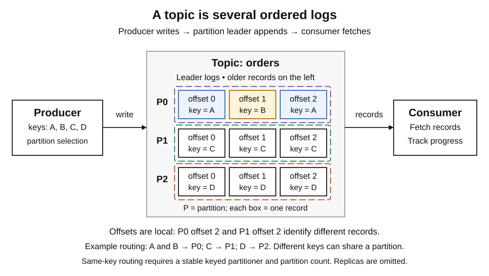

With ordinary key-based partitioning, the same serialized key maps to the same partition while the partition count and routing rule remain unchanged. Different keys can share a partition. A producer can also select a partition explicitly, and custom partitioners can change the rule.

Kafka preserves the log order **within a partition**. It provides no total order across the topic's partitions. Choosing `orderId` as the key keeps one order's history together; it does not order all orders against one another. Concurrent producers must still agree on meaningful business sequencing, and consumers must preserve any ordering their side effects require.

Adding partitions can change a key's destination for future records; existing records stay where they were. Plan such changes when per-key order matters. A **hot key**, responsible for disproportionate traffic, can overload one partition even when other partitions are quiet.

### Inside the write and read path

A client uses `bootstrap.servers` to discover brokers and partition leaders. A **leader** is the replica accepting a partition's writes; **followers** copy its log. Producers send records to the relevant leaders. Consumers normally fetch from leaders; configured follower fetching is also possible.

A topic with **one partition** supplies one total append order. This can serve as a sequencer when its latency and capacity fit the application. The tradeoff is one leader's write path and at most one assigned consumer per standard group for that topic. It orders accepted appends, not real-world event times or concurrent requests according to an application fairness rule.

The producer batches records, and the broker appends them to log segment files. A **segment** is one file-sized portion of a partition log. The operating system's **page cache** keeps recently used file data in memory. Sequential access, batching, and optional compression reduce work per record and support high throughput.

Consumption is **pull-based**: producers push records to Kafka, but consumers request batches from their current positions at their own pace. A fetch can wait for data, a form of **long polling**, instead of repeatedly returning empty responses. A slow reader accumulates a backlog while other groups can continue. The available storage and retention window bound how long it can fall behind.

High throughput does not promise a fixed latency. Batch waiting, network traffic, replication, storage, and application processing all contribute. In the Java producer, `send()` is asynchronous: returning a future is different from receiving a successful broker acknowledgment. Observe the future or callback to detect delivery errors.

### Sharing work versus independent subscriptions

Follow one partition into each group. A group divides work internally; a different group gets an independent reading of the retained log.

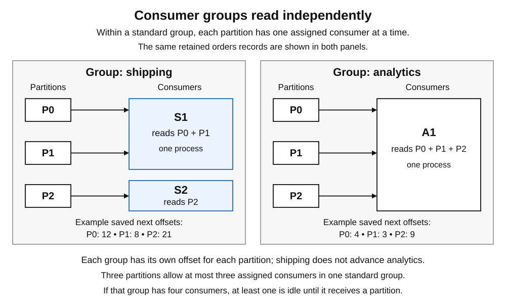

Consumers using the same `group.id` and group-managed subscription share assignments. Each partition has at most one assigned consumer in that group at a time. One consumer may own several partitions. With three subscribed partitions, a fourth consumer cannot add another active partition reader to that group.

Use different group IDs for shipping and analytics when both need every event. Giving every shipping worker its own group ID would make them independent subscribers, potentially repeating the shipping work.

A **rebalance** changes assignments when membership or subscribed partitions change. The consumer protocol can move assignments incrementally; the disruption depends on the protocol and assignment strategy. Losing an assignment does not undo a database write a worker already made.

A **group coordinator** is the broker handling a group's membership and offset commits. Consumers send it periodic **heartbeats**, messages indicating that they are still reachable. If heartbeats stop for the session timeout, the coordinator removes the member and its partitions can be reassigned. With the classic protocol, the client configures `heartbeat.interval.ms` and `session.timeout.ms`; with the consumer protocol, the broker controls `group.consumer.heartbeat.interval.ms` and `group.consumer.session.timeout.ms`. Heartbeats establish reachability, not successful business processing; §2 adds the polling-progress check.

**Share groups are a separate option.** They allow multiple consumers to share a partition's records and acknowledge records individually. Their concurrency is not capped by partition count in the same way. Do not transfer the standard group's ownership and ordering assumptions to a share consumer.

## 2. Delivery and transactions

There are three separate questions: did Kafka accept the write, where will a consumer resume, and did the business effect happen? An answer to one does not answer the others.

### Position is different from committed progress

A consumer's **position** advances as `poll()` returns records. Its **committed offset** is saved restart progress for a group and partition. With Kafka's built-in offset storage, the group coordinator records this progress in the internal, compacted `__consumer_offsets` topic, separately for each `(group, topic, partition)`. Compaction removes superseded commits; §3 explains that storage policy.

In the example below, committing `43` means resume at offset `43`, after completing record `42`.

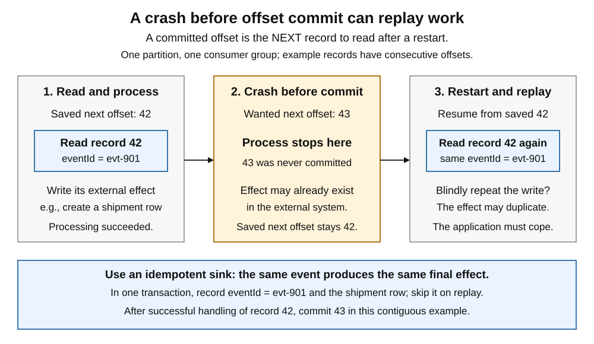

Suppose a worker reads `evt-901` at offset `42`, writes a shipment row for order `42`, and crashes before committing `43`. The replacement resumes from the older committed offset and can process `evt-901` again. The first database write remains real even though Kafka's saved progress did not advance.

| Processing policy | Failure window | Result |
|---|---|---|
| Commit progress before the effect | Crash after commit, before the effect | Work may be skipped: at-most-once processing |
| Complete the effect, then commit | Crash after effect, before commit | Work may repeat: at-least-once processing |
| Atomically coordinate effect and progress, or deduplicate effects | Recovery recognizes already completed work | Exactly-once effects within the chosen boundary |

These names describe failure semantics, not a promise that outages, expired retention, and application errors cannot lose work. With parallel processing, never commit past unfinished records in a partition: one committed number cannot describe arbitrary holes in completed work.

Automatic commits do not inspect whether a database operation or background task succeeded. For explicit processing control, use `enable.auto.commit=false` and commit only safe progress. Separately, `max.poll.interval.ms` bounds the time between `poll()` calls: a worker can keep sending heartbeats while its processing is stuck. Exceeding this polling limit can trigger reassignment even without an initial heartbeat failure. Bound batch processing time accordingly; the precise reassignment timing depends on membership settings.

`auto.offset.reset` applies when no usable offset exists. `earliest` starts at the earliest retained position; `latest` starts at the end; `none` reports the missing position as an error. It is not a command to rewind a group with valid committed offsets on every restart.

### Publishing without Kafka transactions

**Kafka transactions are optional. An application can publish records with ordinary `send()` calls without calling `initTransactions()`, `beginTransaction()`, or `commitTransaction()`.** Leave `transactional.id` unset for this mode. The producer sends batches to partition leaders, and each send completes according to its acknowledgment policy. There is no transaction commit decision or commit marker for these records.

Nontransactional does not mean unreplicated or unreliable. You can still use `acks=all` for replication acknowledgments and **producer idempotence**, which prevents the producer's internal retries from appending duplicate copies of a send. This retry protection does not make several application sends one atomic operation. Consumers using `read_committed` also receive nontransactional records, subject to the partition's visibility boundary.

| Aspect | Advantage of ordinary publishing | Limit to account for |
|---|---|---|
| Application code | No transaction lifecycle or transaction-ID management | Several sends have no shared commit or abort boundary |
| Latency and coordination | Avoids transaction-coordinator writes and commit-marker work | This removes one source of overhead; actual latency still depends on batching, replication, and load |
| Partial failure | Independent events can succeed independently | If publishing an order succeeds but publishing its audit event fails, the order remains published |
| Reliability | Replication acknowledgments and idempotent producer retries remain available | Application retries and consumer reprocessing can still repeat business events or effects |
| Consumer progress | Suitable when each event can be handled independently | Output records and consumed offsets cannot commit together as one Kafka transaction |

### Producer idempotence: retrying an append

An operation is **idempotent** when repeating it has the same intended effect as doing it once. Kafka's idempotent producer prevents its internal retries from appending duplicate copies of the same send. Enable it explicitly when it is part of the application's required contract:

```properties
enable.idempotence=true
acks=all
```

The Java producer also requires positive retries and at most five in-flight requests per connection; incompatible explicit settings fail configuration. Compatible defaults already enable idempotence in the documented version.

This mechanism does not deduplicate two application calls that independently publish `evt-901`. A restarted application can publish the same business event again. Keep a stable event ID when downstream effects must recognize such duplicates. Also distinguish producer retry order from business event time: correct transport does not repair an application's incorrectly ordered events.

### Java example: publishing without transactions

This small Java program uses the `org.apache.kafka:kafka-clients` library and an existing `orders` topic on `localhost:9092`. The string serializer converts the key and JSON text to bytes. Save it as `PlainProducer.java`; authentication and topic creation are outside this example.

```java
import java.util.Properties;
import java.util.concurrent.TimeUnit;
import org.apache.kafka.clients.producer.KafkaProducer;
import org.apache.kafka.clients.producer.ProducerConfig;
import org.apache.kafka.clients.producer.ProducerRecord;
import org.apache.kafka.common.serialization.StringSerializer;

public class PlainProducer {
    public static void main(String[] args) throws Exception {
        var properties = new Properties();
        properties.put(ProducerConfig.BOOTSTRAP_SERVERS_CONFIG, "localhost:9092");
        properties.put(ProducerConfig.KEY_SERIALIZER_CLASS_CONFIG,
                StringSerializer.class.getName());
        properties.put(ProducerConfig.VALUE_SERIALIZER_CLASS_CONFIG,
                StringSerializer.class.getName());
        properties.put(ProducerConfig.ENABLE_IDEMPOTENCE_CONFIG, true);
        properties.put(ProducerConfig.ACKS_CONFIG, "all");
        // No transactional.id: these are ordinary, idempotent sends.

        try (var producer = new KafkaProducer<String, String>(properties)) {
            var record = new ProducerRecord<>("orders", "order-42",
                    "{\"eventId\":\"evt-901\",\"eventType\":\"OrderCreated\"}");
            var metadata = producer.send(record).get(10, TimeUnit.SECONDS);
            System.out.printf("Written to %s-%d at offset %d%n",
                    metadata.topic(), metadata.partition(), metadata.offset());
        }
    }
}
```

`send()` returns a future; `get()` waits here so the example reports an acknowledgment or propagates an error. Success means the configured write acknowledgment was received, not that a consumer completed its work. A wait timeout does not cancel the send or prove it failed; do not blindly publish another copy. Keep a stable event ID and a recovery policy. A service normally reuses its producer and observes asynchronous callbacks or futures instead of creating a producer and blocking for every request.

In Spring Boot, an ordinary, nontransactional `KafkaTemplate` provides the same publishing mode through `kafkaTemplate.send(topic, key, payload)`. Its `CompletableFuture` reports the send outcome. Leave the producer's transaction-ID configuration unset when choosing this mode; the Spring transaction example below explains how that same `send()` call behaves when transactions are enabled.

### Kafka transactions: coordinating Kafka output and input progress

A **Kafka transaction** can atomically commit output records across Kafka partitions together with consumed offsets. A processor can read an order, produce an enriched order, and commit its input progress as one Kafka transaction. Aborted output is hidden from consumers using `isolation.level=read_committed`; these consumers still receive nontransactional records.

The transactional producer uses a `transactional.id`; each concurrently active logical producer needs its own identity. Applications must handle aborts and recovery correctly, including returning input consumption to the right position. Kafka Streams can manage this protocol for supported processing pipelines.

The **transaction coordinator** is a broker role that tracks the transaction in the replicated internal topic `__transaction_state`. A **commit marker** is a control record that records the committed outcome in a participating partition. A `read_committed` consumer can read only records below the partition's **last stable offset (LSO)**, a boundary held back by unresolved transactions. Read the following sequence from top to bottom; it follows a successful transaction that writes output records.

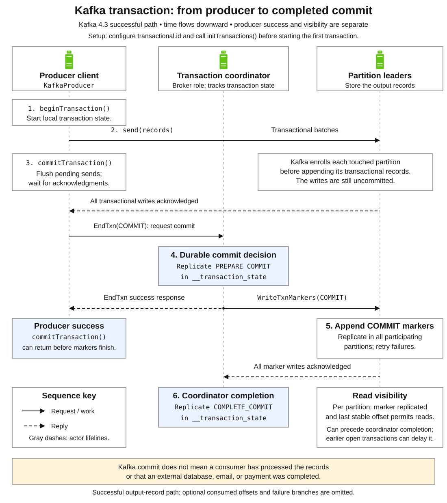

Distinguish three meanings of completion:

1. **Producer success.** `commitTransaction()` flushes pending sends and waits for successful record acknowledgments before requesting the commit. Once the coordinator has replicated `PREPARE_COMMIT`, it can send success to the producer. The call can return while commit markers are still propagating; a record acknowledgment alone was not a transaction commit.
2. **Read visibility.** Each partition's replicated commit marker allows the committed records to become eligible for `read_committed` consumers, subject to its LSO. An earlier open transaction can still hold reads back. This is not a simultaneous visibility switch across all partitions.
3. **Coordinator completion.** After all participating partitions acknowledge their markers, the coordinator replicates `COMPLETE_COMMIT`. Its commit protocol is finished. Readers do not wait directly for this final coordinator record, and none of these points means a consumer has finished the business work.

For a consume–transform–produce transaction, call `sendOffsetsToTransaction()` with the next offsets to process and the consumer's group metadata before `commitTransaction()`. Those offsets commit with the output; the relevant `__consumer_offsets` partitions also participate. Their group-coordinator interactions are omitted from the sequence.

The diagram assumes success. A timeout from `commitTransaction()` does not prove an abort: the commit may still be completing. The Java producer permits retrying the same commit call; do not switch to an abort merely because the commit call timed out.

An **application programming interface (API)** is the interface through which one program requests another component's services. **A Kafka transaction does not automatically include an external database, email server, or payment API.** Re-executing processor code is possible even when its committed Kafka results appear once. For a database effect, atomically record the event ID and the business change in that database, protected by a uniqueness constraint. A separate service call needs that service's own idempotency contract.

A **saga** coordinates a business workflow through a sequence of local transactions, with **compensating transactions** to counteract completed work when a later step fails. For example, reserve inventory, request payment, and release the reservation if payment is rejected. Kafka can carry the commands and outcome events; application logic tracks the workflow. Compensation is a new business action, not an atomic rollback across services: intermediate states can be visible, and compensation can itself fail and need retries. Sagas therefore still need idempotency and recovery rules.

### Starting and handling a transaction in Spring Boot

`KafkaProducer` is a Java client running inside the application process. Spring's `KafkaTemplate` wraps that client; Spring can manage its transaction lifecycle for the application. The following producer-only example commits an order event and an audit event together. It does not consume records or update a database.

Use a Spring Boot 4.1 application with `org.springframework.boot:spring-boot-starter-kafka`, and let Boot manage dependency versions. Boot 4.1's managed Kafka client version can differ from the broker version; these APIs do not require overriding it to match the article's Kafka 4.3 broker discussion. Assume `orders` and `order-audit` already exist. In `application.properties`:

```properties
spring.kafka.bootstrap-servers=localhost:9092
spring.kafka.producer.key-serializer=org.apache.kafka.common.serialization.StringSerializer
spring.kafka.producer.value-serializer=org.apache.kafka.common.serialization.StringSerializer
spring.kafka.producer.transaction-id-prefix=orders-${INSTANCE_ID}-
spring.kafka.producer.acks=all
spring.kafka.producer.properties[enable.idempotence]=true
```

The broker cluster must also support the internal transaction-state topic. Its defaults require three brokers (`transaction.state.log.replication.factor=3`, `transaction.state.log.min.isr=2`). For a disposable single-broker learning setup, both broker settings can be `1`; that setup has no replica redundancy.

Supply `INSTANCE_ID` with a different value for every concurrently running application instance, such as `orders-1` and `orders-2`. Spring adds a suffix for each transactional producer. Setting the prefix makes the producer factory transaction-capable; Boot also auto-configures a `KafkaTransactionManager`. It does **not** wrap every standalone `send()` call in a new transaction.

Put this service in the application's component-scan package. Both payload arguments are already serialized JSON strings; the example waits for both send results to make asynchronous failures explicit.

```java
import java.util.concurrent.CompletableFuture;
import org.slf4j.Logger;
import org.slf4j.LoggerFactory;
import org.springframework.kafka.core.KafkaTemplate;
import org.springframework.stereotype.Service;

@Service
public class OrderPublisher {
    private static final Logger log = LoggerFactory.getLogger(OrderPublisher.class);
    private final KafkaTemplate<String, String> kafkaTemplate;

    public OrderPublisher(KafkaTemplate<String, String> kafkaTemplate) {
        this.kafkaTemplate = kafkaTemplate;
    }

    public void publishOrderAndAudit(String orderId, String orderJson,
                                    String auditJson) {
        try {
            kafkaTemplate.executeInTransaction(tx -> {
                var orderSend = tx.send("orders", orderId, orderJson);
                var auditSend = tx.send("order-audit", orderId, auditJson);
                CompletableFuture.allOf(orderSend, auditSend).join();
                return null;
            });
        } catch (RuntimeException failure) {
            log.error("Kafka publication did not report success for {}", orderId, failure);
            throw failure;
        }
    }
}
```

`executeInTransaction()` begins a transaction before invoking the callback. Successful callback completion leads to a commit. A callback exception, including a failed send surfaced by `join()`, causes Spring to attempt an abort and propagate the failure. The catch is outside the transaction boundary: it reports the error and leaves recovery to the caller. Catching an error inside the callback and returning normally could instead allow a commit.

The successful send futures only confirm record writes; the transaction has not committed at `join()`. Successful return from `executeInTransaction()` is the producer's transaction-success signal. A failure during commit can leave an uncertain outcome, so the catch does not claim that the transaction aborted and does not automatically start a replacement transaction. Keep durable business-event identities and make recovery safe against duplicate effects.

Every downstream consumer that must hide aborted output needs `isolation.level=read_committed`; in a Spring Boot consumer application, set:

```properties
spring.kafka.consumer.properties[isolation.level]=read_committed
```

An alternative is a public service method annotated with `@Transactional(transactionManager = "kafkaTransactionManager", rollbackFor = Exception.class)` that performs the sends directly. Call it through the Spring-managed bean from another bean so the transaction interceptor runs; a same-object method call bypasses the usual proxy. The explicit rollback rule includes checked exceptions, which do not trigger rollback by default. Choose this method boundary or `executeInTransaction()` for the operation: the latter starts its own separate transaction even if a Spring-managed transaction is already active. Nesting one `executeInTransaction()` call inside another is rejected.

| Context of `kafkaTemplate.send(...)` | Behavior |
|---|---|
| Nontransactional producer factory | Ordinary asynchronous publication |
| Transaction-capable template inside an active Kafka transaction | Sends participate; Spring commits or aborts at the surrounding boundary |
| Transaction-capable template outside a transaction | `IllegalStateException` by default; `allowNonTransactional=true` explicitly permits an ordinary send |
| Transaction-capable template inside a supported Spring database transaction | Spring can synchronize a Kafka transaction with it, but their commits remain separate |

For a Kafka listener that consumes and produces, prefer the container's transaction support when input offsets and output must commit together. A container configured with `KafkaTransactionManager` begins before the listener, includes its template sends, and adds consumed offsets before commit. Listener failure rolls back and permits redelivery. A local `executeInTransaction()` alone does not include listener offsets. Likewise, synchronizing a database transaction and a Kafka transaction leaves a failure window between their commits; use the outbox pattern in §6 when the database change must reliably lead to publication.

### Industry practice: choose the required guarantee

**There is no single transaction setting that every Kafka application should use.** The following is a practical selection guide derived from the documented guarantees, not a claim about measured adoption. Ordinary publishing is a first-class Kafka mode. Current compatible producer defaults enable idempotence, while Kafka Streams defaults to `at_least_once` processing; transactions and `exactly_once_v2` are deliberate choices.

| Workload or requirement | Practical starting point | Why |
|---|---|---|
| Independent events, telemetry, logs, or notifications | Ordinary publishing; enable idempotence and use `acks=all` where replication acknowledgment matters | Avoid a transaction boundary when records do not need to commit together; choose suitable replication and minimum ISR as described in §3 |
| Several Kafka outputs must share one commit outcome | Kafka transaction plus downstream `read_committed` | Prevents consumers from treating an aborted partial publication as committed output |
| Kafka input → processing → Kafka output, with atomic output and input progress | Kafka Streams `processing.guarantee=exactly_once_v2` or Spring container-managed transactions | The framework coordinates output and consumed offsets; processing code can still run again after failure |
| Database update must eventually publish an event | Transactional outbox plus a relay or change data capture, and duplicate-safe consumers | The database atomically saves its change and publication obligation; a Kafka-only transaction cannot do that |
| Consumer writes to a database or calls an external service | Safe offset commits, durable deduplication, and an idempotency contract for the effect | Kafka transactions alone cannot make external work happen exactly once |

For independent business events, a useful baseline is **idempotent publishing, replication acknowledgments, at-least-once processing, and duplicate-safe business effects**. Add Kafka transactions when there is a concrete need for atomic Kafka outputs or output-plus-offset commits. Their benefit is that atomic boundary; their costs include coordinator and marker work, transaction-ID management, failure recovery, and possible delays for `read_committed` readers while transactions remain unresolved. Keep transactions short and measure the tradeoff with the real workload; no fixed throughput penalty applies to every deployment.

## 3. Storage and durability

Retention asks which records should remain. Replication asks where copies exist. Acknowledgments ask what the producer has learned about a write. Keep these policies separate.

### Retention and compaction

The top comparison removes old history; the bottom removes superseded values for the same key. Neither policy waits for every consumer to finish.

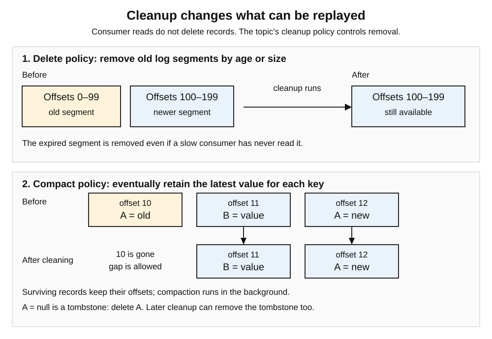

| Topic policy | What cleanup does | Useful for |
|---|---|---|
| `cleanup.policy=delete` | Removes eligible old segments using time or size limits | A bounded history of independent events |
| `cleanup.policy=compact` | Eventually removes older values for a key while retaining its latest state | Rebuilding a keyed state view |
| `cleanup.policy=compact,delete` | Compacts retained segments and also expires old segments | Keyed state with a bounded history window |

Time retention is not an exact per-record expiry timer: cleanup works on segments and runs asynchronously. A record can outlive the configured interval. Conversely, a size limit can remove history sooner than a time-only plan expects. `retention.bytes` is a per-partition limit.

Compaction preserves the offsets and order of surviving records. It does not immediately turn a topic into one row per key, and it does not add an arbitrary key-lookup API. A **tombstone**, a record with a key and a null value, marks deletion; the marker can itself be cleaned later. Recovery consumers must account for tombstone retention so deleted state is not resurrected.

Keep full event history when intermediate changes matter. A compacted latest balance cannot explain every deposit and withdrawal. With combined compaction and deletion, even a key's latest value can eventually expire.

### Replication, acknowledgments, and the ISR

A partition's **replication factor** counts all copies, including its leader. The **in-sync replica set (ISR)** contains replicas sufficiently caught up under Kafka's synchronization rules, including the leader. A configured copy can exist while being outside the ISR.

This example uses three copies and `min.insync.replicas=2`. Read the lower rows as different health states of that same partition.

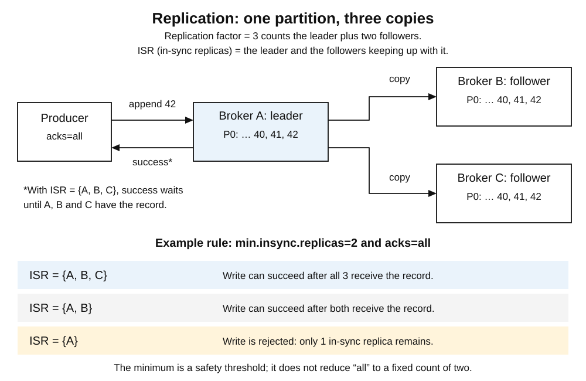

| Producer setting | Successful acknowledgment means | Main limit |
|---|---|---|
| `acks=0` | The producer did not wait for broker confirmation | Broker receipt is unconfirmed |
| `acks=1` | The leader appended the record | Failure before replication can lose it |
| `acks=all` | The current ISR acknowledged the record | Requires suitable minimum ISR and surviving copies |

`acks=all` waits for the full current ISR, not every configured replica and not merely the minimum count. With three in-sync copies, it waits for three; with two, for two. If the ISR falls below the configured minimum, these writes fail. That deliberately trades write availability for stronger replication requirements.

For a cluster with at least three available brokers, this command creates the example topic. Run it from an extracted Kafka distribution, with a broker reachable at `localhost:9092`; the topic must not already exist:

```bash
bin/kafka-topics.sh --bootstrap-server localhost:9092 \
  --create --topic orders --partitions 3 --replication-factor 3 \
  --config min.insync.replicas=2
```

This creates three distinct logs with three copies each: nine partition replicas in total. The producer's `acks=all` setting is configured separately. The command illustrates topic configuration; it does not provision the brokers or controllers.

Replication acknowledgment is not a per-record `fsync` guarantee. **`fsync`** asks the operating system to synchronize file data to persistent storage. Kafka normally uses buffered file writes and replication; correlated failures of all copies still matter. A timeout can also leave the producer uncertain whether an append succeeded.

The **high watermark** is the end boundary of the partition's replication-committed prefix: consumers can read records with offsets strictly below it. Suppose the leader has offset `42`, but a follower still in the ISR has only through `41`. With a high watermark of `42`, consumers cannot yet read record `42`, even if its producer received `acks=1`. Once replication advances the watermark to `43`, that record crosses the replication visibility boundary.

This boundary applies even to `read_uncommitted`; `read_committed` can stop earlier while transactions remain open and also filters out aborted records. The high watermark is shared partition state. A group's committed offset is its own restart progress, so these are two different meanings of “committed.”

When a leader fails, Kafka elects a suitable replacement and clients refresh their routing. Modern Kafka can track **eligible leader replicas (ELR)** outside the current ISR that are still safe election candidates. With ELR enabled, the strict minimum-ISR rule prevents the high watermark from advancing while the ISR is smaller than `min.insync.replicas`; this helps make those tracked replicas safe candidates. An unsafe, or **unclean**, election can instead lose acknowledged history. Keeping unsafe election disabled may leave a partition unavailable until a suitable copy returns.

### Capacity and operational checks

For an illustrative uncompressed input of `10 MB/s`, one day contains about `864 GB` of payload. Three full copies need about `2.6 TB` before indexes, operational headroom, and other overhead. Compression and storage policies change the estimate; measure representative data. Replication also consumes network and disk bandwidth.

**Partitions have a resource cost even when traffic is low.** Each replica brings log segments and indexes, file descriptors, memory mappings, and metadata; active readers and writers also consume memory. More partitions increase the work involved in assignments, leader elections, and recovery. Choose a partition count from measured throughput, required consumer parallelism, and tested broker and recovery capacity. For metrics, many metric-name keys can share a bounded set of partitions; automatically creating one partition for every new name makes resource use grow with the number of distinct names. Replication multiplies the number of replicas to budget for.

Monitor under-replicated partitions, partitions without leaders, minimum-ISR violations, disk space, request latency, producer errors, and controller health. Monitor **consumer lag**, the distance between a reader's progress and the log's end, alongside the age of unprocessed events. Offset distance alone is not a precise count of business events when offsets have gaps.

Retention must cover the intended outage and catch-up window. A consumer that processes more slowly than new events arrive cannot catch up without additional capacity or less work per event. Test recovery from both worker failure and lost storage; live copies alone do not preserve an independent historical backup.

### Archival and tiered storage

For an **independent archive**, export records to files in object storage such as Amazon S3, using an application consumer or an installed Kafka Connect sink connector, a component that exports Kafka data to another system (Pattern 3). Give the archive its own retention policy, preserve the event IDs, keys, schemas, and source positions needed for replay, and advance export progress only after durable storage succeeds. Rehearse restoring those files into a new topic or application state. Export retries and replay still need duplicate handling; creating files alone does not establish a recovery procedure.

**Tiered storage** moves older, closed log segments to remote storage while Kafka continues to serve retained records through its normal fetch interface. It reduces the history that must remain on broker disks: `local.retention.ms` and `local.retention.bytes` govern the local tier, while `retention.ms` and `retention.bytes` govern the overall retained history. Remote segments still participate in Kafka's retention lifecycle, so that tier is not an independent historical backup.

Kafka 4.3 requires a configured **RemoteStorageManager** implementation, the plugin that handles remote log storage; the distribution does not include one. Its documented tiered-storage limitations also exclude compacted topics. Choose between longer Kafka history and an independent archive according to the required replay interface, retention ownership, and restore process.

## 4. Deployment topologies

Kafka separates **data storage** on brokers from **cluster metadata management** on controllers. Metadata describes objects such as topics, replica placement, and leaders. **KRaft** uses the Raft consensus protocol to keep controllers in agreement about metadata; Kafka 4.x does not require ZooKeeper.

### A local development server

One process can combine broker and controller roles with `process.roles=broker,controller`. It is useful for learning. With replication factor one, its partitions have no alternate copy; stopping the machine stops that setup. Several partitions on one broker add logical logs, not independent machines.

### Separate brokers and controllers

The upper row manages metadata. The lower row stores application records. Solid arrows show application data; dashed arrows show metadata coordination.

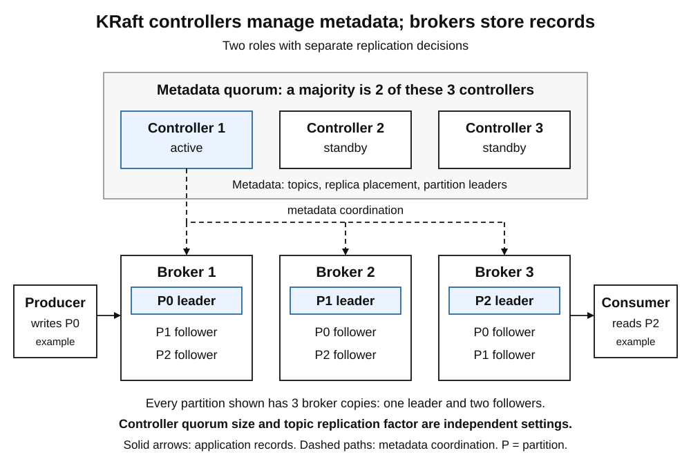

A production deployment commonly uses separate broker and controller processes. A **quorum** is the required set of participants for agreement. Three voting controllers need a majority of two to maintain the metadata quorum; five need three. Controller counts and partition replication factors are independent decisions: three controllers do not create three copies of every order event.

Distribute brokers and replicas across suitable failure locations. Different brokers lead different partitions and follow others, spreading load. More brokers provide useful capacity when partitions and their leadership are placed on them; adding a broker does not automatically split an existing partition or eliminate a hot key.

| Arrangement | What it adds | Main consideration |
|---|---|---|
| One combined node | Simple local setup | No independent failover capacity |
| Multiple brokers with a controller quorum | Partition capacity and replicated recovery | Broker health, quorum health, and replica placement all matter |
| Multiple clusters with mirroring | Regional or organizational separation | Replication lag and an application failover plan |

### Separate clusters and disaster recovery

**MirrorMaker 2** uses Kafka Connect to copy data between clusters. This is different from followers copying a leader inside one cluster. A source acknowledgment does not imply that the remote cluster already has the record.

Cross-cluster recovery needs decisions about missing recent events, client redirection, group-offset translation, and duplicate effects. Measure replication lag and rehearse the switch. Managed services can automate operations, but applications still need explicit ordering, retention, and retry contracts.

## 5. Placement: Kafka, Redis, databases

Choose what each layer owns. A **source of truth** is the authoritative state from which other views can be rebuilt. In this shop example, the order database owns accepted orders, Kafka carries their events, and downstream stores serve queries.

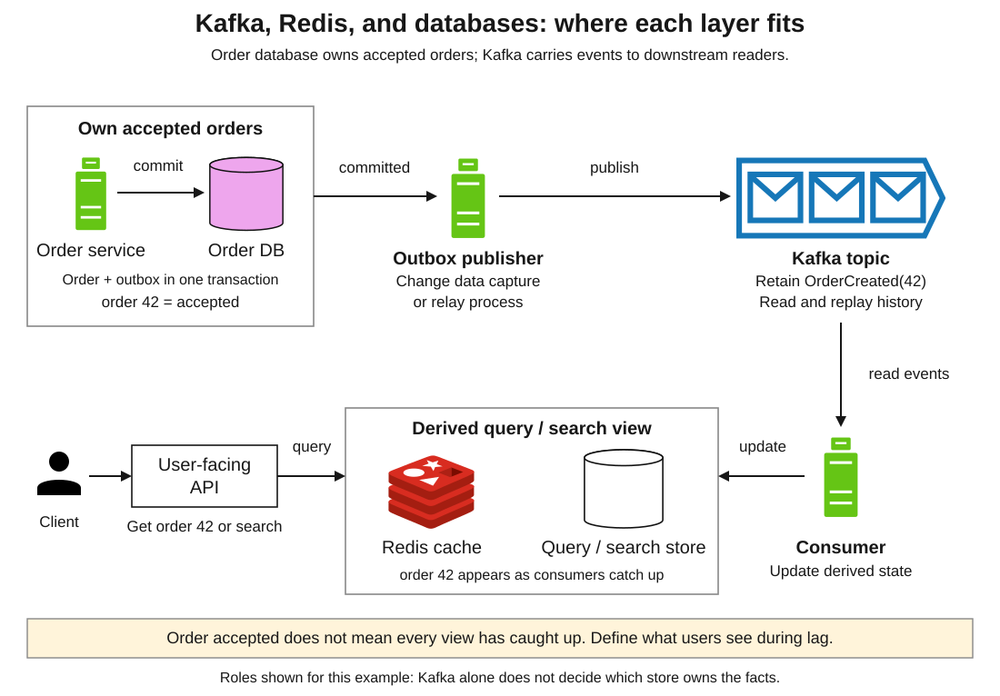

| Need | Appropriate role in this example |
|---|---|
| Accept an order and enforce business constraints | Database transaction in the order service |
| Retain changes for several independent readers | Kafka topic |
| Read an order by ID or search products | Query database or search index populated by a consumer |
| Cache a frequently read result or update a shared counter | Redis |
| Store a large report, image, or video | Object storage; send an object reference through Kafka |
| Deliver reusable web responses and files near users | Content delivery network (CDN) |

Kafka's durable log can instead be authoritative in a deliberately designed **event-sourced system**, where recorded events define state. Pattern 7 develops its history, concurrency, and recovery requirements. Enabling Kafka alone does not make a database-derived topic the owner of the database's facts.

A **materialized view** stores a derived result for convenient queries. Its consumer can lag, so accepting an order does not mean every search index and dashboard already includes it. Define what the user sees while those views catch up.

Kafka is useful when retained history, independent consumers, and streaming throughput justify operating it. A shared cache, a simple synchronous call, or a small job queue can be sufficient for narrower requirements. Choose the required behavior before the product.

## 6. Patterns

Each pattern identifies the user-visible behavior, the Kafka data, its placement, and the failure that needs an application decision.

**This is an evidence-informed teaching order, not a measured frequency ranking.** Apache Kafka's use-case page is editorial; the 2017 survey is nine years old at this article's 2026 review; question-tag counts can reflect both adoption and troubleshooting difficulty; and pattern literature is qualitative. None cleanly measures the frequency of these seven patterns. Confidence is strongest in placing independent reactions and buffering first and event sourcing last. Positions 3–6 are a judgment call: integration introduces the tooling, aggregation creates views, the outbox explains reliable publication, and replay repairs those views.

### Pattern 1. Let services react independently

The group diagram in §1 supplies this pattern: each service has its own progress through the same topic.

**User interaction.** After an order is accepted, a shipping service arranges fulfillment and an analytics service updates demand statistics. Analytics can pause without making shipping wait for it.

**Kafka data.** Both groups read `OrderCreated`; instances within `shipping` share shipping partitions. Choose topic contracts according to business meaning and access needs.

**Placement.** Each service writes its own database or derived view. A public API reads those stores to display status.

**Main trap.** Reading an event does not make several services one transaction. A later cancellation, a repeated event, and a consumer outage need explicit business handling. Partition order alone does not enforce workflow rules in an external system.

### Pattern 2. Buffer ingestion during surges and sink outages

The same separation between producer and consumer can deliberately hold work that a slower destination cannot process immediately. The diagram tracks unread records; reading them does not remove their retained Kafka copies.

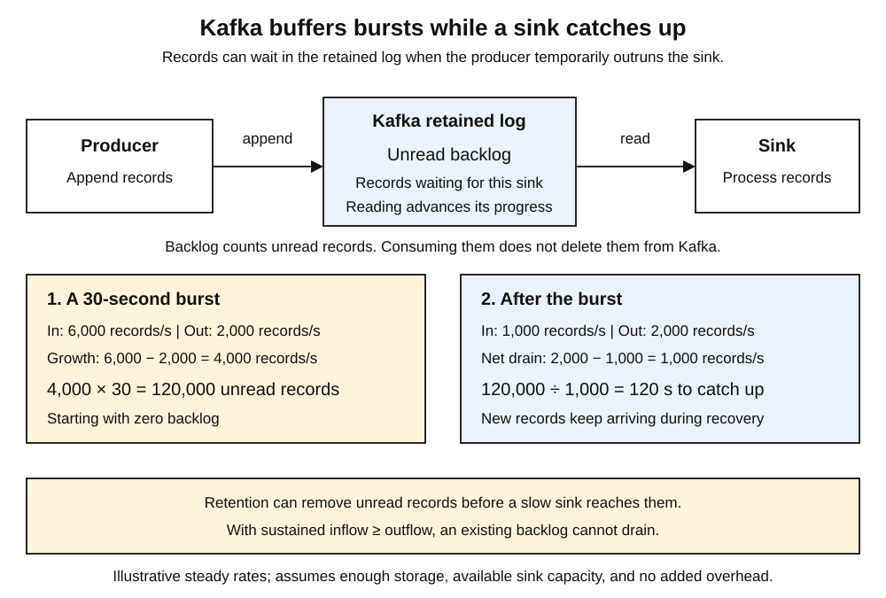

**User interaction.** A monitoring agent submits measurements during a traffic surge. Here ingestion waits for a successful `acks=all` write with a suitable minimum ISR before acknowledging acceptance. A consumer writes those measurements to a time-series database, a store optimized for timestamped observations. The ingestion acknowledgment confirms Kafka's replication requirement was met; it does not mean the database already contains the measurements.

**Kafka data.** A retained `measurements` topic absorbs the temporary difference between arrival and processing rates. In an illustrative burst of 6,000 records per second with a sink processing 2,000, a 30-second burst adds 120,000 unread records. If arrivals then fall to 1,000 per second and processing stays at 2,000, the backlog drains at 1,000 per second and takes 120 seconds to clear. These rates assume comparable records and sustained processing capacity.

**Placement.** Kafka holds pending input independently of the sink; consumers pull batches at a rate the destination can sustain. This also permits ingestion during a bounded sink outage. Apply the same separation to email work or click aggregation when eventual processing is acceptable, with duplicate-safe effects and visible processing status where needed.

**Main trap.** A buffer buys time, not unlimited throughput or storage. Retention can expire unread records while the backlog is still draining. Budget for the burst or outage plus catch-up time and a margin, including size-based retention. Watch the oldest unread event's age alongside lag. If sustained arrivals equal or exceed processing capacity, recovery cannot clear the backlog without more sink capacity, less work, or throttled intake. Adding workers helps only when partition parallelism and the destination can support them.

### Pattern 3. Move data with Kafka Connect

Follow the arrows from the product database through the source connector, Kafka topic, and sink connector to the search store. The source brings changes into Kafka; the sink takes them out. Connector tasks run in Connect workers, separate from the brokers storing the topic.

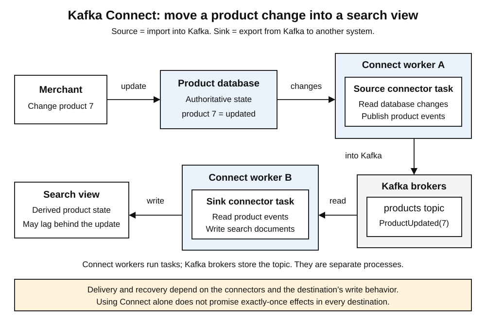

**User interaction.** A merchant updates a product; a search view later reflects the change.

**Kafka data.** A **source connector** imports external data into Kafka. A **sink connector** exports Kafka data to another system. **Change data capture (CDC)** reads database changes for publication; a source connector such as Debezium can capture those changes. Kafka Connect runs the connector tasks in worker processes; distributed mode can rebalance tasks when workers change.

**Placement.** The product database remains authoritative; a connector supplies events and another connector or application updates the search store. Connector implementations are installed components with their own supported sources, formats, and guarantees.

**Main trap.** “Uses Connect” does not imply exactly-once delivery to every destination. Verify the connector's recovery behavior and the destination's write semantics. Also check the data contract: a **schema** defines fields and types, and replay may encounter older schemas long after the producer changes.

### Pattern 4. Aggregate streams into a queryable result

The application below keeps an evolving count and publishes its result. Its processing code runs outside the Kafka brokers.

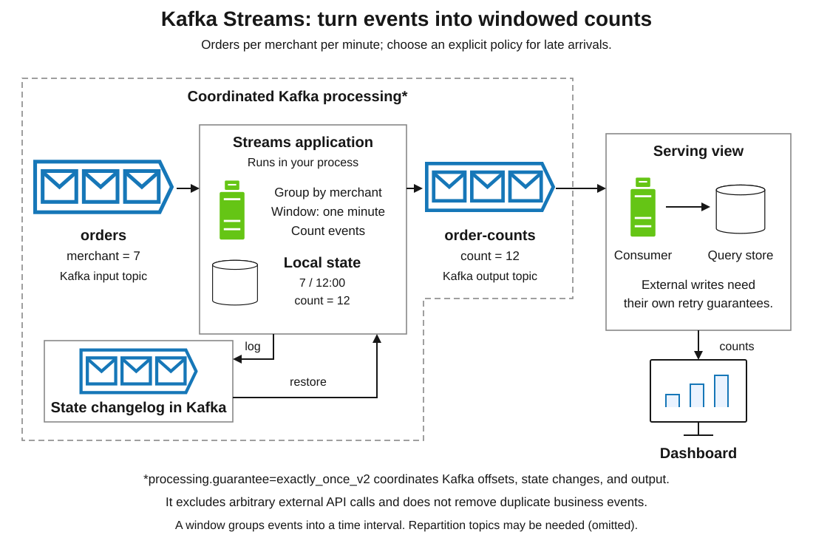

**User interaction.** A merchant dashboard shows orders per minute. **Kafka Streams** is an application library for transformations, joins, and aggregations over Kafka records.

**Kafka data.** An application reads `orders`, groups events by the desired key and time window, and publishes counts to `order-counts`. A **window** groups events into a time interval. Event time means when the event happened; processing time means when the application handles it. An event can arrive after newer events, so closing an event-time window needs a deliberate late-arrival policy.

The word **watermark** has two distinct meanings. The broker's **high watermark** from §3 is an offset boundary for replicated records. An **event-time watermark** in stream processing estimates progress through event timestamps; an event arriving behind that estimate is late, and the processing policy decides whether it can still update a result. The estimate does not prove that older events can never arrive.

Compare the units and the question each boundary answers:

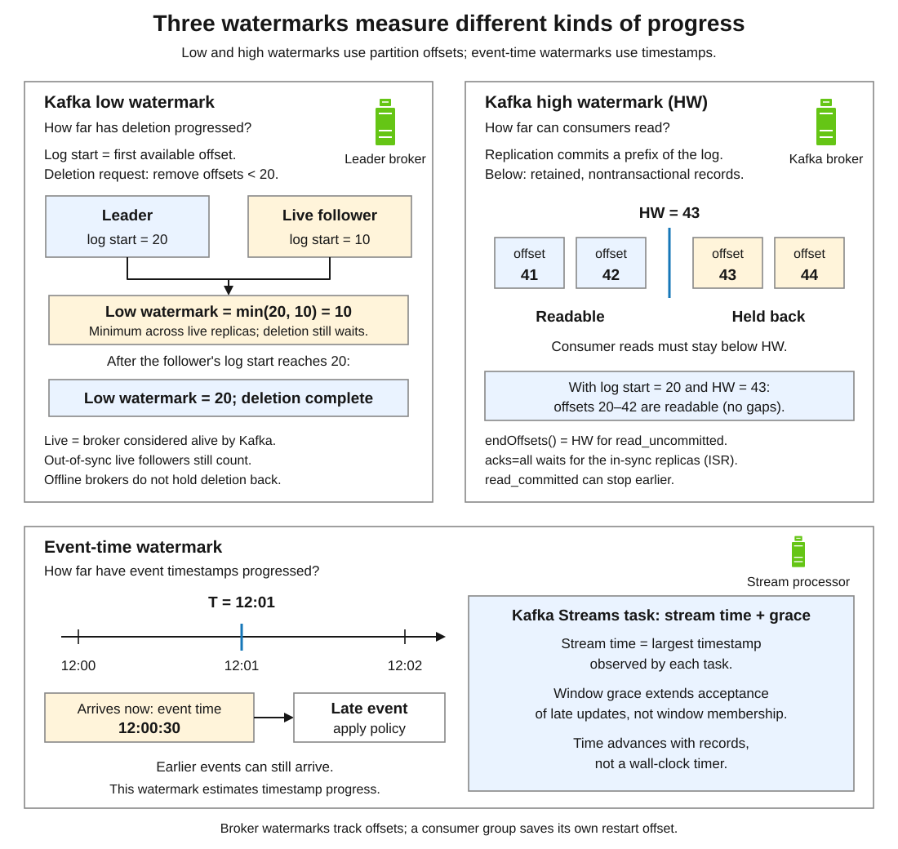

Kafka Streams uses **stream time**, the maximum record timestamp observed so far by each task, and a window's **grace period** to decide when to reject late records. For a one-minute window covering `12:00:00 ≤ event time < 12:01:00`, a 30-second grace permits late updates until stream time moves past `12:01:30`. An arriving event timestamped `12:00:50` still belongs to that original window; grace extends acceptance time, not window membership. Stream time advances with records, not merely with the wall clock. Longer grace can accept more late events, but requires retaining window state longer and postpones when the result can be considered final; intermediate results may be emitted earlier.

**Placement.** Streams tasks keep local state; Kafka changelog topics support restoration. A downstream service can maintain a queryable dashboard view. Repartition topics may move records to place the same aggregation key together.

**Main trap.** Replaying a naive increment can count twice. For supported Kafka processing, configure `processing.guarantee=exactly_once_v2` to coordinate offsets, state changes, and Kafka outputs. This still does not include an arbitrary external API call or remove duplicate business events already present in the input.

### Pattern 5. Publish database changes with a transactional outbox

Pattern 3 showed how changes reach Kafka. This pattern explains how to preserve the obligation to publish when a database commit and a Kafka send cannot happen atomically. The database boundary below contains both the business row and the pending event; publication follows that transaction's commit.

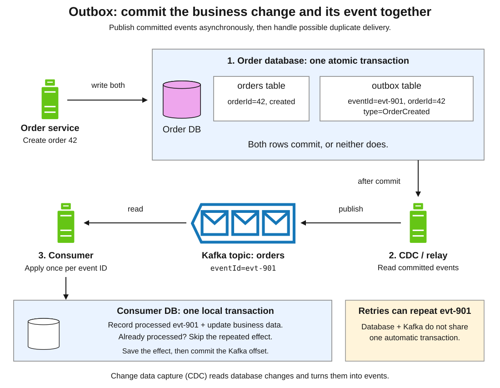

**User interaction.** A customer submits an order. The order service commits the order and an **outbox row**, a pending publication record, in the same database transaction. It can then report that the order was accepted without waiting for shipping to finish.

**Kafka data.** A relay publishes the outbox event `evt-901` to `orders`, keyed by `orderId`. The CDC tooling introduced in Pattern 3 can capture an outbox table and route its events; Debezium supports this approach. Keep that event ID stable across retries for deduplication and a per-order version when needed.

**Placement.** The database owns the order and pending publication. Kafka retains the published event; each downstream service owns its own resulting state. Monitor how long rows remain unpublished.

**Main trap.** Committing an order and directly sending to Kafka are two independent writes. A crash between them can omit the event. The outbox makes the publication obligation durable, but a relay retry can publish a duplicate. A consumer can atomically store `eventId` with its business effect in its own database so replay recognizes completed work.

### Pattern 6. Rebuild a view and handle failed records

**User interaction.** A corrected search index or dashboard should include previously published events. A new consumer group or controlled offset reset can reread the required retained data.

**Kafka data.** Use a full retained event log to reconstruct history, or a suitable compacted topic to reconstruct latest keyed state. The retention diagram in §3 shows why these are different inputs.

**Placement.** Build into a separate destination, compare its results, then switch queries when it is ready. Replaying events that originally sent emails should rebuild state without unintentionally emailing users again.

**Main trap.** A **poison record**, one that repeatedly fails processing, needs a policy. Retrying in place preserves the sequence but can block that partition. A retry topic or **dead-letter topic**, which holds failed records for investigation, permits progress but can break the original processing order. These are application or connector policies, not an automatic standard-consumer feature. Keep the original event ID, error context, and an explicit recovery owner; verify that failed-record publication succeeded before advancing past it.

### Pattern 7. Reconstruct state from an authoritative event log

Here the accepted events define state. Follow one ordered stream through ordinary updates and then through snapshot recovery.

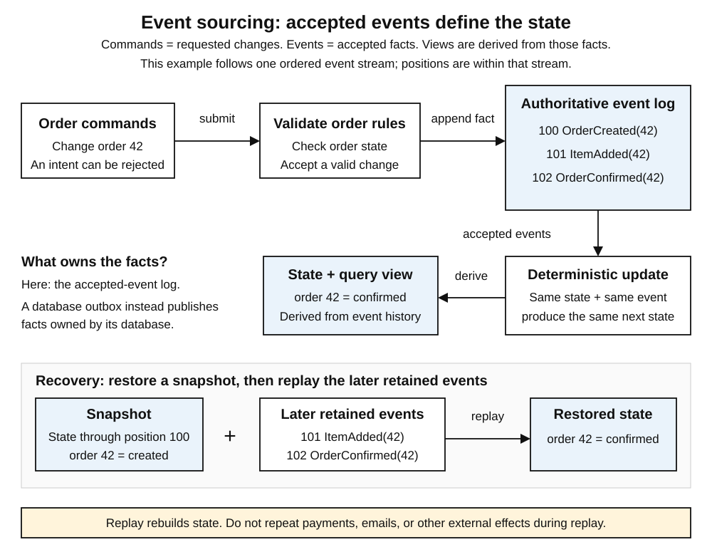

**User interaction.** An order system accepts a change and later shows the state derived from its accepted events. A **command** requests a change; an **event** records an accepted fact. Business validation turns a request such as `CreateOrder` into a fact such as `OrderCreated`. A command log alone does not record whether each request was accepted or rejected.

**Kafka data.** Preserve the accepted events needed to reconstruct state, with stable event IDs, entity keys, versions, and interpretable schemas. A **state machine** applies each event to the previous state using deterministic rules: the same starting state and ordered events produce the same result. For the running order example, the accepted creation fact remains `evt-901`.

**Placement.** A **snapshot** saves derived state together with the stream position through which it was computed. Restore a snapshot through position `100`, then apply events `101` onward from that same ordered stream. With multiple Kafka partitions, recovery must track the corresponding position in each partition; Kafka has no single topic-wide offset. **Command Query Responsibility Segregation (CQRS)** separates the model handling changes from models serving queries. It is often paired with event sourcing, but neither requires the other, and derived query views can lag.

**Main trap.** Kafka orders appends; it does not automatically enforce expected entity versions, validate business transitions, or provide an event store's per-entity query interface. The application must enforce ownership or concurrency rules around validation and append. Preserve the necessary history and schema interpretation, and verify that snapshots match their recorded positions. A snapshot accelerates recovery but cannot replace a complete event trail when an audit requires every change. Replaying state transitions must not resend emails or repeat payment calls; those effects require separate handling.

## 7. Check your understanding

Try answering without looking back at the article, then check the answer key:

1. Keys A and B both map to partition P0. Is that valid, and what ordering does it give relative to P1? What would a one-partition topic change, and at what cost?
2. The `orders` topic has three partitions and four shipping consumers. Can all four receive partition assignments? How should analytics subscribe if it also needs every event?
3. Shipping creates a shipment for `evt-901` at offset `42`, then crashes before committing `43`. Where is its saved progress stored, where can it resume, and what prevents another shipment?
4. A worker keeps sending heartbeats but never returns to `poll()`. Which timeout detects this? What detects a worker that stops sending heartbeats altogether?
5. Replication factor is three, `min.insync.replicas=2`, and `acks=all`. How many copies must acknowledge with an ISR of three? Of two? What happens with one?
6. The leader has record `42`, but the high watermark is still `42`. Can `read_uncommitted` read it, or can the group's committed offset make it visible? How does this watermark differ from an event-time watermark? What does a Streams window's grace extend?
7. Can consuming a record protect it from deletion? Does compaction preserve every event, and does it renumber surviving offsets?
8. Does a quorum of three KRaft controllers create three copies of every order record?
9. In the product-to-search example, what does each Connect connector do, and where do its tasks run?
10. Does an outbox guarantee that `evt-901` is published only once, or a Kafka transaction make an external payment call exactly once? What does a saga add if payment fails after inventory was reserved?
11. A burst leaves 120,000 unread records. Arrivals then run at 1,000 records per second and the sink handles 2,000. How long does catch-up take? Can records expire before it finishes?
12. How does an accepted-event log differ from a command log? What must accompany a snapshot, and which side effects should recovery avoid?
13. Why can one partition per metric name become expensive even when most names have low traffic?
14. Does moving old segments to Kafka's remote tier preserve an independent backup? How would you create an archive with separate retention?

### Answer key

1. Yes. Different keys can share P0 and its log order, but Kafka supplies no total order between P0 and P1. One partition supplies a total append order, with one leader's write path and at most one assigned consumer per standard group for that topic. It does not establish real-world time order.
2. At most three can hold assignments to those partitions. Analytics needs a different group ID for independent consumption and progress.
3. Kafka's built-in storage uses `__consumer_offsets`. If the saved next offset is still `42`, the replacement can replay `evt-901`. Atomically store that event ID with the shipment row and recognize it on replay; then commit safe progress.
4. `max.poll.interval.ms` checks polling progress. Missing heartbeats are detected by the session timeout: client `session.timeout.ms` for the classic protocol, broker `group.consumer.session.timeout.ms` for the consumer protocol.
5. All three, then both. With only one in-sync copy, the minimum is not met and these writes fail. The minimum does not reduce `all` to a fixed count of two.
6. No: reads must stay below the high watermark. Replication must advance it beyond `42`; a group's committed offset cannot make unreplicated data visible. This is an offset boundary, whereas an event-time watermark estimates timestamp progress. Streams grace extends acceptance of late updates to an existing window, not that window's event-time membership.
7. No. Cleanup is independent of consumption. Compaction can remove superseded events while retaining latest keyed state; surviving offsets keep their original numbers. A full-history rebuild needs the required history still retained.
8. No. Controllers replicate metadata. Application-record copies depend on each topic's replication factor and broker placement.
9. The source connector imports database changes into Kafka; the sink connector exports records to the search store. Their tasks run in Connect worker processes, outside the brokers.
10. No to both. The outbox preserves a publication obligation, but relay retries can duplicate events; Kafka transactions coordinate Kafka records and offsets. A saga can compensate for the reservation by releasing inventory after payment fails. It does not atomically roll back all services, so retries, idempotency, and compensation recovery still matter.
11. The net drain rate is 1,000 records per second, so catch-up takes 120 seconds at those sustained rates. Yes: retention cleanup does not wait for the consumer. The available history must cover both the accumulated delay and catch-up; size limits can shorten it.
12. Commands request changes; accepted events record the resulting facts. A snapshot needs the exact stream position or per-partition positions represented by its state, so replay starts immediately afterward. Recovery should rebuild state without repeating external payments, emails, or other original side effects.
13. Every replica adds logs, indexes, metadata, and operating-system resources, and more partitions add coordination and recovery work. Many metric-name keys can share a bounded partition count sized for measured capacity and parallelism.
14. No. Kafka retention still governs remote segments. Export records and replay metadata to independently retained files, checkpoint durable exports, and test restoration; the archive's own storage policy must preserve the required history.

# Sources

Primary documentation checked on 2026-09-10. The order-system designs, capacity calculation, and placement recommendations are examples derived from these mechanisms. Configuration and API behavior follow the linked Kafka 4.3 documentation.

The transaction sequence was checked on 2026-09-12 against Kafka 4.3 documentation and the versioned Kafka 4.3.0 implementation.

The ordinary-publishing guidance, Java and Spring examples, and guarantee-selection recommendations were checked on 2026-09-12 against the linked Kafka, Spring Boot 4.1, and Spring Kafka 4.1 documentation. The selection guide is an engineering recommendation based on those mechanisms, not an industry adoption survey.

- [Apache Kafka introduction: events, topics, partitions, and the platform](https://kafka.apache.org/43/getting-started/introduction/)
- [Apache Kafka use cases: editorial descriptions of messaging, buffering, processing, and event sourcing](https://kafka.apache.org/uses/)
- [Confluent's 2017 Kafka community survey: historical, overlapping pipeline, processing, and integration categories](https://www.confluent.io/blog/2017-apache-kafka-survey-streaming-data-on-the-rise/)
- [Stack Exchange tags API: tag popularity counts questions, not application deployments](https://api.stackexchange.com/docs/tags)
- [ProducerRecord API: record fields, partition selection, and timestamps](https://kafka.apache.org/43/javadoc/org/apache/kafka/clients/producer/ProducerRecord.html)
- [ConsumerRecord API: topic, partition, offset, key, and value](https://kafka.apache.org/43/javadoc/org/apache/kafka/clients/consumer/ConsumerRecord.html)
- [Kafka design: log storage, pull consumption, replication, transactions, share groups, and compaction](https://kafka.apache.org/43/design/design/)
- [KafkaProducer API: asynchronous sends, retry idempotence, and transactions](https://kafka.apache.org/43/javadoc/org/apache/kafka/clients/producer/KafkaProducer.html)
- [Spring Boot Kafka support: template and transaction-manager auto-configuration](https://docs.spring.io/spring-boot/reference/messaging/kafka.html)
- [Spring Boot managed dependencies: compatible Spring Kafka and Kafka client versions](https://docs.spring.io/spring-boot/appendix/dependency-versions/coordinates.html)
- [Spring Kafka sending: asynchronous template results and error handling](https://docs.spring.io/spring-kafka/reference/kafka/sending-messages.html)
- [Spring Kafka transactions: local transactions, transaction IDs, synchronization, and nontransactional sends](https://docs.spring.io/spring-kafka/reference/kafka/transactions.html)
- [Spring Kafka 4.1.1 implementation: callback failures, abort attempts, and commit-error propagation](https://github.com/spring-projects/spring-kafka/blob/v4.1.1/spring-kafka/src/main/java/org/springframework/kafka/core/KafkaTemplate.java#L679-L722)
- [Spring Kafka exactly-once semantics: listener transactions, output, offsets, and rollback](https://docs.spring.io/spring-kafka/reference/kafka/exactly-once.html)
- [Spring transaction annotations: transaction-manager selection and proxy boundaries](https://docs.spring.io/spring-framework/reference/data-access/transaction/declarative/annotations.html)
- [Spring rollback rules: unchecked exceptions by default and explicit checked-exception rules](https://docs.spring.io/spring-framework/reference/data-access/transaction/declarative/rolling-back.html)
- [Kafka transaction protocol: partition enrollment and protocol-version differences](https://kafka.apache.org/43/operations/transaction-protocol/)
- [Kafka 4.3.0 producer transaction manager: beginTransaction changes local client state](https://github.com/apache/kafka/blob/4.3.0/clients/src/main/java/org/apache/kafka/clients/producer/internals/TransactionManager.java#L348-L353)
- [Kafka 4.3.0 transaction coordinator: durable commit decision, success response, and marker propagation](https://github.com/apache/kafka/blob/4.3.0/core/src/main/scala/kafka/coordinator/transaction/TransactionCoordinator.scala#L851-L1001)
- [Kafka 4.3.0 transaction state manager: replicated state-log writes](https://github.com/apache/kafka/blob/4.3.0/core/src/main/scala/kafka/coordinator/transaction/TransactionStateManager.scala#L668-L816)
- [Kafka 4.3.0 marker manager: record completion after all partition acknowledgments](https://github.com/apache/kafka/blob/4.3.0/core/src/main/scala/kafka/coordinator/transaction/TransactionMarkerChannelManager.scala#L336-L380)
- [Kafka 4.3.0 broker request handling: commit markers for data and consumer-offset partitions](https://github.com/apache/kafka/blob/4.3.0/core/src/main/scala/kafka/server/KafkaApis.scala#L1794-L1845)
- [Kafka 4.3.0 partition transaction state: marker replication and unresolved transactions](https://github.com/apache/kafka/blob/4.3.0/storage/src/main/java/org/apache/kafka/storage/internals/log/ProducerStateManager.java#L241-L265)
- [Kafka 4.3.0 partition log: last stable offset and read-committed visibility](https://github.com/apache/kafka/blob/4.3.0/storage/src/main/java/org/apache/kafka/storage/internals/log/UnifiedLog.java#L671-L685)
- [Producer configuration: acknowledgments, batching, partitioning, and idempotence](https://kafka.apache.org/43/configuration/producer-configs/)
- [KafkaConsumer API: group assignments, position, committed offsets, and processing](https://kafka.apache.org/43/javadoc/org/apache/kafka/clients/consumer/KafkaConsumer.html)
- [Kafka distribution: group coordinators and compacted offset storage](https://kafka.apache.org/43/implementation/distribution/)
- [Consumer configuration: offset reset, automatic commits, polling, and isolation](https://kafka.apache.org/43/configuration/consumer-configs/)
- [KafkaShareConsumer API: shared partitions and individual record acknowledgment](https://kafka.apache.org/43/javadoc/org/apache/kafka/clients/consumer/KafkaShareConsumer.html)
- [Consumer rebalance protocol: incremental assignment and migration](https://kafka.apache.org/43/operations/consumer-rebalance-protocol/)
- [Topic configuration: cleanup, retention, minimum ISR, and file synchronization](https://kafka.apache.org/43/configuration/topic-configs/)
- [Eligible leader replicas: safe election candidates and strict minimum ISR](https://kafka.apache.org/43/operations/eligible-leader-replicas/)
- [Basic Kafka operations: partition expansion, placement, replication, and group progress](https://kafka.apache.org/43/operations/basic-kafka-operations/)
- [Hardware and operating systems: storage, cache, and partition resource costs](https://kafka.apache.org/43/operations/hardware-and-os/)
- [Monitoring: broker, controller, producer, consumer, and connector metrics](https://kafka.apache.org/43/operations/monitoring/)
- [Kafka tiered storage: remote segments, retention, required plugins, and limitations](https://kafka.apache.org/43/operations/tiered-storage/)
- [KRaft: broker/controller roles, quorum size, and deployment considerations](https://kafka.apache.org/43/operations/kraft/)
- [KRaft versus ZooKeeper: metadata management and separated process roles](https://kafka.apache.org/43/getting-started/zk2kraft/)
- [Broker configuration: replication controls and preferred read replicas](https://kafka.apache.org/43/configuration/broker-configs/)
- [Cross-cluster mirroring: MirrorMaker 2, topology, lag, and consumer migration](https://kafka.apache.org/43/operations/geo-replication-cross-cluster-data-mirroring/)
- [Kafka Connect overview: reusable integration with external systems](https://kafka.apache.org/43/kafka-connect/overview/)
- [Kafka Connect user guide: workers, connectors, data formats, errors, and delivery guarantees](https://kafka.apache.org/43/kafka-connect/user-guide/)
- [AWS transactional outbox: database changes and reliable eventual publication](https://docs.aws.amazon.com/prescriptive-guidance/latest/cloud-design-patterns/transactional-outbox.html)
- [Debezium outbox event router: event identity, entity keys, and routing](https://debezium.io/documentation/reference/stable/transformations/outbox-event-router.html)
- [Saga pattern: local transactions and compensation across services](https://learn.microsoft.com/en-us/azure/architecture/patterns/saga)
- [Compensating transactions: business-specific undo actions and recovery](https://learn.microsoft.com/en-us/azure/architecture/patterns/compensating-transaction)
- [Kafka Streams core concepts: windows, event time, and processing state](https://kafka.apache.org/43/streams/core-concepts/)
- [Apache Beam programming guide: event-time watermarks and late data](https://beam.apache.org/documentation/programming-guide/#watermarks-and-late-data)
- [Kafka Streams ProcessingContext: per-task stream time](https://kafka.apache.org/43/javadoc/org/apache/kafka/streams/processor/api/ProcessingContext.html#currentStreamTimeMs())
- [Kafka Streams TimeWindows: window boundaries and grace periods](https://kafka.apache.org/43/javadoc/org/apache/kafka/streams/kstream/TimeWindows.html)
- [Kafka Streams architecture: tasks, local state, and recovery](https://kafka.apache.org/43/streams/architecture/)
- [Kafka Streams configuration: exactly-once processing and state durability](https://kafka.apache.org/43/streams/developer-guide/config-streams/)
- [Queue-based load leveling: buffering bursts and bounding downstream load](https://learn.microsoft.com/en-us/azure/architecture/patterns/queue-based-load-leveling)
- [Event sourcing: accepted events, replay, snapshots, concurrency, and event-store requirements](https://learn.microsoft.com/en-us/azure/architecture/patterns/event-sourcing)
- [CQRS: separating models for changes and queries](https://learn.microsoft.com/en-us/azure/architecture/patterns/cqrs)
- [PostgreSQL transactions: committing several changes atomically](https://www.postgresql.org/docs/current/tutorial-transactions.html)
- [PostgreSQL constraints: enforcing unique event identities](https://www.postgresql.org/docs/current/ddl-constraints.html#DDL-CONSTRAINTS-UNIQUE-CONSTRAINTS)
- [Redis data types: shared application state and counters](https://redis.io/docs/latest/develop/data-types/)
- [Amazon S3 objects: storing bytes under object keys](https://docs.aws.amazon.com/AmazonS3/latest/userguide/UsingObjects.html)
- [Confluent S3 sink connector: exporting Kafka records to object files](https://docs.confluent.io/kafka-connectors/s3-sink/current/overview.html)
- [Amazon S3 Lifecycle: independent object retention, transitions, and expiration](https://docs.aws.amazon.com/AmazonS3/latest/userguide/object-lifecycle-mgmt.html)
- [Amazon CloudFront: delivering web content through edge locations](https://docs.aws.amazon.com/AmazonCloudFront/latest/DeveloperGuide/Introduction.html)
