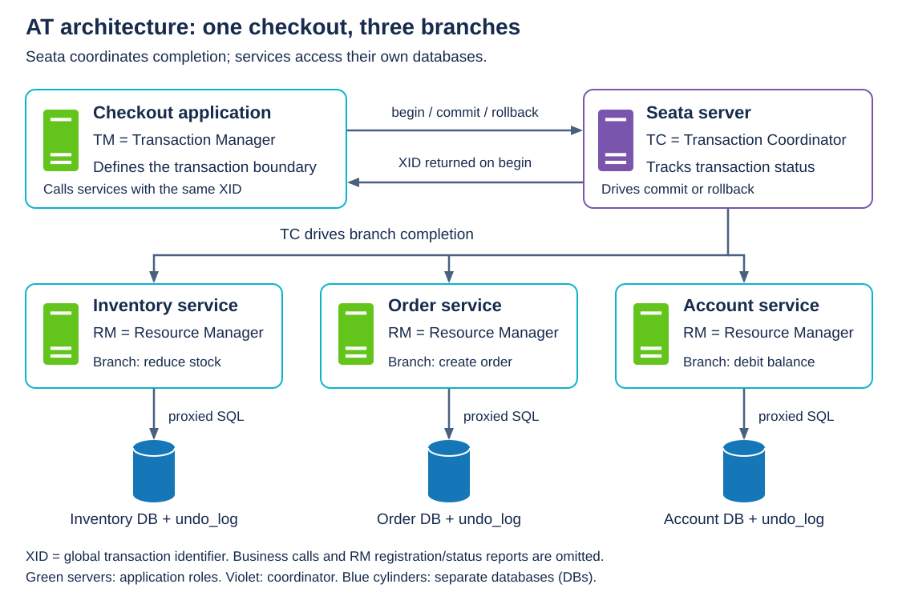
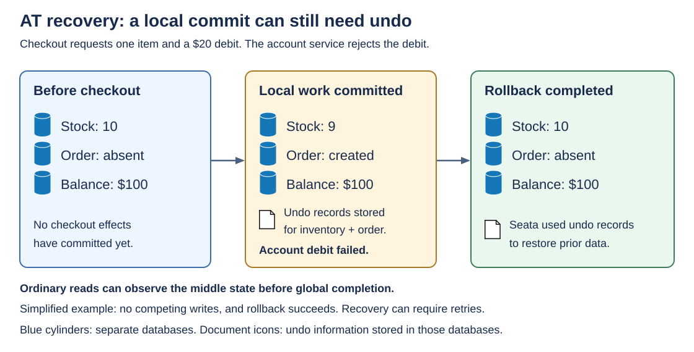

# Apache Seata

[Back to Distributed Systems](../Readme.md#content)

**Apache Seata is an open-source framework for coordinating transactions across services and databases.** It tracks a shared transaction and coordinates completion or recovery when only part of a business operation succeeds. It supports four transaction modes—**AT, TCC, Saga, and XA**—with different requirements and guarantees.

This article explains why Seata is needed, its architecture and four modes, and how AT recovers a failed checkout. It then covers the wider functionality, adoption requirements, and mode selection. The checkout example changes inventory, creates an order, and debits an internal account balance in separate databases.

## Why Seata exists

A **local transaction** groups changes within one database transaction boundary. A **commit** makes those changes durable; a **rollback** discards changes that have not committed.

When checkout spans independent databases, one local commit cannot decide the others' outcomes. Inventory might decrease and an order might be saved before the account service rejects the debit. Rolling back the account database does not undo changes already committed elsewhere.

Seata supplies reusable coordination machinery for this problem: transaction identity, participant tracking, completion requests, and recovery. Its practical value is reducing the coordination logic each application would otherwise build. The chosen mode determines whether recovery uses database rollback, automatically generated undo operations, or business-defined actions.

**A distributed transaction describes the scope of the work; Seata is a framework that implements several ways of coordinating it.** If all required changes fit in one local transaction, that database transaction may already provide the needed boundary.

## The vocabulary and architecture

A **global transaction** represents the whole coordinated operation. A **branch transaction** is one participating unit of work; a service can create more than one branch. The **XID** is the global transaction identifier that connects these branches.

Seata separates three roles:

| Role | Responsibility | Place in the checkout example |
| --- | --- | --- |
| **Transaction Manager (TM)** | Defines the global transaction boundary and requests begin, commit, or rollback. | The application entry point that starts checkout. |
| **Transaction Coordinator (TC)** | Tracks global and branch status and drives global completion. | The Seata server. |
| **Resource Manager (RM)** | Registers branches, reports their status, and performs branch commit or rollback. | Client-side integration beside each participating resource. |

The diagram shows an **AT deployment**. Its arrows show coordination and database access; business calls carrying the XID are omitted. The AT-specific label `proxied SQL` means database statements intercepted by Seata, and `undo_log` names the table storing rollback information. The [AT checkout example](#at-in-the-checkout-example) explains how these work together.

Across service calls, the transaction context must reach the receiving service. Seata's integrations can propagate the XID; custom call paths must preserve it too. An unrelated request does not join a global transaction merely because it calls the same database.

The TM and RM are roles, so one application can contain both. Saga additionally uses an execution engine to coordinate its business workflow; the AT diagram is not a diagram of every mode's internals.

## The four supported transaction modes

**Compensation** means performing a corrective action after earlier work has committed. Its meaning depends on the mode: restoring database row values in AT differs from an application-defined refund or cancellation in Saga.

| Mode | What Seata coordinates | What the application supplies | Main tradeoff |
| --- | --- | --- | --- |
| **AT — Automatic Transaction** | Database updates, automatically recorded undo logs, and global locks. | Business database operations through supported Seata data-source proxies; required undo-log tables. | Little business-code change, but database/SQL restrictions and default global **read uncommitted** isolation. |
| **TCC — Try-Confirm-Cancel** | **Try** checks and reserves resources; **Confirm** finalizes them; **Cancel** releases them. | All three business operations and correct reservation semantics. | Precise control over resources, with more application design and implementation. |
| **Saga** | Locally committed actions and compensating actions when the workflow cannot finish. | Forward actions, compensations, and workflow definitions. | Fits long workflows and legacy/external services; does not guarantee isolation. |
| **XA** | Branches use X/Open's distributed transaction standard to prepare, then commit or roll back under coordinator control. | Compatible resources, drivers, and Seata XA integration. | Database-managed preparation and rollback, but prepared branches retain resources and can block. |

### What TCC adds

For example, Try can move $20 from **available** to **reserved** funds. Confirm consumes the reservation; Cancel returns it to the available amount. This is business logic that developers implement. Seata invokes the appropriate handlers and manages their participation.

TCC can coordinate service-level resources without requiring those resources to implement XA. Handlers must behave correctly under retries, including **idempotency**: repeating an operation must not apply its business effect twice.

Seata documents a TCC transaction-control table that records branch state to recognize repeated Confirm/Cancel calls, handle **empty rollback** (Cancel arrives without Try having executed), and prevent **hanging** (a late Try reserves resources after cancellation). Recording cancellation lets a later Try detect it and refuse the reservation. Correct business handlers remain necessary. The companion TCC article walks through [Cancel arriving before Try](../Transactions.%20Try-Confirm-Cancel/Readme.md#cancel-can-arrive-before-try).

### What Saga adds

Seata's Saga state-machine engine can execute a workflow described in JSON, connecting service actions to their compensations. It supports choices, concurrent execution, sub-processes, parameter mapping, and exception handling.

A compensation is another business operation. It can repair an earlier effect, but cannot make that effect invisible retroactively. Other workflows may observe intermediate results. This makes compensation rules and acceptable intermediate states part of the application design. The [Saga and TCC comparison](../Transactions.%20Saga/Readme.md#saga-and-tcc) develops this boundary between Seata's coordination and the participant's business responsibilities.

## AT in the checkout example

AT uses a **data-source proxy**, a wrapper that intercepts database operations. For a supported change, it records a **before-image** (the row values before the change) and an **after-image** (the values afterward) in an `undo_log` table. The business update and its undo record commit together in the same local transaction, so a committed update has the information needed for undo. Database locks can then be released, while Seata's global locks coordinate conflicting participating writes.

The diagram compares three states of a failed checkout. Inventory and order changes have committed locally before the account debit fails. Successful AT rollback restores those earlier changes using their undo records. The example assumes no conflicting outside writes.

On **global commit**, those business updates are already stored; Seata can clean up undo logs asynchronously. On **global rollback**, the RM checks current row values against the recorded after-image and generates corrective SQL from the before-image. A conflicting modification can prevent straightforward restoration and require recovery handling.

**Seata documents AT's default global isolation level as read uncommitted**, even when the local database uses read committed or stronger isolation. AT local commit is earlier than global completion: ordinary `SELECT` queries can see locally committed changes that the global transaction may still undo. The word *uncommitted* here refers to the global outcome.

Seata documents global read-committed behavior through proxied `SELECT FOR UPDATE` queries that check global locks; ordinary reads do not receive that protection automatically. A global lock also cannot enforce cooperation from arbitrary writers that bypass Seata's locking rules.

XA makes a different tradeoff: its branches remain prepared pending the final decision, retaining database resources instead of committing early and relying on AT undo logs. The two-phase commit article explains [why a prepared transaction can block](../Transactions.%20Two-phase%20commit/Readme.md#why-a-prepared-transaction-can-block).

## Functionality beyond the mode names

| Capability | Why it matters |
| --- | --- |
| **Transaction boundaries and status APIs** | Applications can begin, commit, roll back, and inspect a global transaction. Java integrations include `@GlobalTransactional`; programmatic APIs are also available. |
| **Transaction-context propagation** | The XID connects participating work across service calls. |
| **Timeout detection and recovery retries** | The server can revisit unfinished commit or rollback work after transient failures. Retry limits and intervals are configurable. |
| **Transaction-state storage and deployment configuration** | Seata supports storage options including files, databases, Redis, and Raft. Availability and recovery properties depend on the chosen deployment. |
| **Operational console** | Operators can inspect transactions and participants, control transactions and AT global locks, and design Saga state machines visually. |

Recovery can take longer than the original request. A timeout or missing response does not prove that every branch has rolled back. Seata's APIs expose transaction status so recovery can resolve the outcome. Stopping completion retries can leave inconsistent data; applications need a way to handle unresolved work.

## What adopting Seata requires

For a typical Java AT application, adoption includes a reachable Seata coordinator, client integration, a global transaction boundary, context propagation, proxied data sources, and the required undo-log table in each participating database. Adding `@GlobalTransactional` alone does not configure those dependencies.

AT's relational databases must support local **ACID** transactions: atomicity, consistency, isolation, and durability. Java database access uses **JDBC**, the Java Database Connectivity API. Support is specific to the database, driver, SQL, and Seata version. For example, the documentation lists MySQL and PostgreSQL among AT-supported databases, while its SQL restrictions exclude stored procedures and triggers. Verify the exact workload against the support matrix.

Business effects also need explicit coverage. An email send or an arbitrary payment-provider call has no automatic AT undo record. External participants need a suitable transaction or compensation contract. Treating an external call as a normal method inside the transaction boundary does not invent that contract.

## Choosing a mode

The following is a practical guide derived from the documented mechanisms:

- Consider **AT** when the work is mainly supported relational database updates and automatic undo fits the application.
- Consider **TCC** when services can reserve resources explicitly and business rules need control over reservation, confirmation, and cancellation.
- Consider **Saga** when a long workflow can tolerate visible intermediate states and has meaningful compensations.
- Consider **XA** when compatible resources can participate in database-level preparation and the workload can tolerate its resource retention and blocking.

**Remember:** Seata supplies coordination and recovery infrastructure. The transaction mode, participant integration, and business rules determine the guarantees the application actually gets.

## Self-check

Try answering before revealing the explanations.

1. Why does rolling back the account database fail to undo an inventory change already committed in another database?
2. Which roles define the global boundary, coordinate completion, and perform branch completion? What connects the branches to the same global transaction?
3. Why must an AT business update and its undo record commit in the same local transaction?
4. What are the before-image and after-image used for during AT rollback? What happens to undo logs on global commit?
5. In the failed checkout, what can an ordinary read observe before AT rollback completes? What is this default global isolation level called?
6. What remains pending after AT's local commit versus XA's prepare?
7. Which mode would you consider for supported SQL updates with automatic undo, explicit business reservations, a long compensatable workflow, and compatible resources that can remain prepared?
8. How does recorded TCC branch state help with duplicate Confirm/Cancel calls, empty rollback, and a late Try?
9. Is `@GlobalTransactional` sufficient to adopt AT? Does it automatically cover an email or arbitrary payment-provider call?
10. Does a checkout timeout prove every branch rolled back? What should recovery establish?

Check your answers

1. Each database has its own local transaction boundary. Rolling back one database cannot discard a change already committed in another; that earlier effect needs coordinated recovery.
2. The TM defines the boundary, the TC coordinates completion, and each RM performs branch completion. The propagated XID identifies the shared global transaction.
3. A committed update must have a durable undo record. Committing them separately could leave business data changed without the information needed to restore it.
4. The after-image lets the RM check whether current data still matches the recorded change; the before-image supplies values for corrective SQL. A mismatch can require recovery handling. On global commit, business updates remain and undo logs can be cleaned up asynchronously.
5. Stock can be 9 and the order present while the balance remains $100, even though rollback will later restore stock and remove the order. Seata calls AT's default global isolation **read uncommitted**: local changes have committed, but the global outcome is unresolved.
6. AT has locally committed data and undo records awaiting global completion, with global locks coordinating participating writes. XA has prepared, uncommitted branches that retain database resources until commit or rollback.
7. Respectively: AT, TCC, Saga, and XA. These are candidates based on their mechanisms; compatibility, acceptable intermediate states, and resource-retention costs still need checking.
8. Completed status lets repeated Confirm/Cancel calls avoid applying the effect again. Missing Try state identifies empty rollback. Recording cancellation lets a late Try reject the request rather than leave a stranded reservation.
9. No. AT also needs a reachable coordinator, client integration, a transaction boundary, XID propagation, supported proxied data sources, and undo-log tables. External effects need their own transaction or compensation contract; AT cannot generate SQL undo for an arbitrary external call.
10. No. A response may be missing while completion is still unresolved. Recovery must establish transaction status and finish the required outcome; a timeout alone is not evidence of successful rollback.

# Sources

Official documentation consulted on September 16, 2026; the unversioned documentation pages displayed **v2.6**. Database support and configuration details should be checked against the deployed release. The diagrams illustrate the documented roles and AT behavior using SVG icons reused from the System Design material below.

- Diagram icon provenance: [Scaling — server icon](../../system%20design/01.%20Scaling/images/single-server.svg), [Notification System — database cylinder](../../system%20design/10.%20Notification%20System/images/improved-design.svg), and [Payment System — document icon](../../system%20design/26.%20Payment%20System/images/settlement-report.svg). Geometry is embedded as editable SVG symbols; the server icon is recolored for the coordinator role, and the architecture's database rim is adjusted for clear arrow endpoints.

- [Apache Seata — What is Seata? Purpose, transaction modes, and AT isolation](https://seata.apache.org/docs/overview/what-is-seata/)
- [Apache Seata — Terminology: TM, TC, and RM](https://seata.apache.org/docs/overview/terminology/)
- [Apache Seata — AT mode: proxy integration and local commits](https://seata.apache.org/docs/user/mode/at/)
- [Apache Seata — AT developer guide: global locks, before/after images, and rollback](https://seata.apache.org/docs/dev/mode/at-mode/)
- [Apache Seata — TCC mode: business handlers and resource reservations](https://seata.apache.org/docs/user/mode/tcc/)
- [Apache Seata — In-depth TCC analysis: control-table handling of empty rollback, idempotence, and suspension](https://seata.apache.org/blog/seata-tcc/). Direct support for the TCC recovery mechanisms described above.
- [Apache Seata — Saga mode: state-machine orchestration and compensation](https://seata.apache.org/docs/user/mode/saga/)
- [Apache Seata — XA mode: preparation, resource retention, and integration](https://seata.apache.org/docs/user/mode/xa/)
- [Apache Seata — Quick start: participating services and AT setup](https://seata.apache.org/docs/user/quickstart/)
- [Apache Seata — API guide: transaction boundaries and outcome recovery](https://seata.apache.org/docs/user/api/)
- [Apache Seata — Microservice framework guide: XID propagation](https://seata.apache.org/docs/user/microservice/)
- [Apache Seata — Configuration: retries, timeouts, and transaction-state storage](https://seata.apache.org/docs/user/configurations/)
- [Apache Seata — Console capabilities](https://seata.apache.org/docs/user/console/introduction/)
- [Apache Seata — Database support by mode](https://seata.apache.org/docs/user/datasource/)
- [Apache Seata — SQL restrictions](https://seata.apache.org/docs/user/sqlreference/sql-restrictions/)
- [Transactions. Two-phase commit](../Transactions.%20Two-phase%20commit/Readme.md) — companion explanation of preparation, retained resources, blocking, and outcome recovery.
- [Transactions. Try-Confirm/Cancel](../Transactions.%20Try-Confirm-Cancel/Readme.md) — companion reservation model and failure cases, including Seata's suspension/hanging terminology.
- [Transactions. Saga](../Transactions.%20Saga/Readme.md) — companion explanation of compensation, intermediate visibility, and the boundary between framework coordination and business logic.
