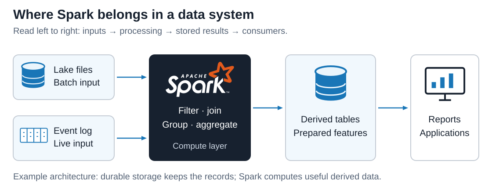
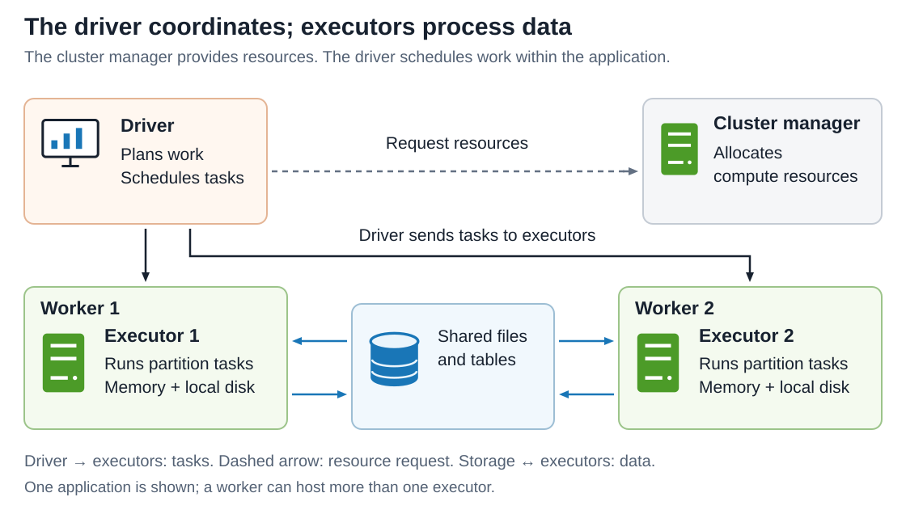
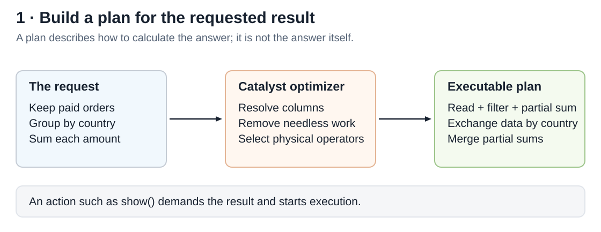
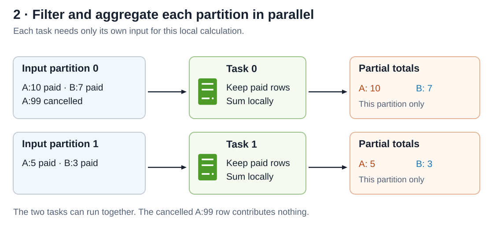
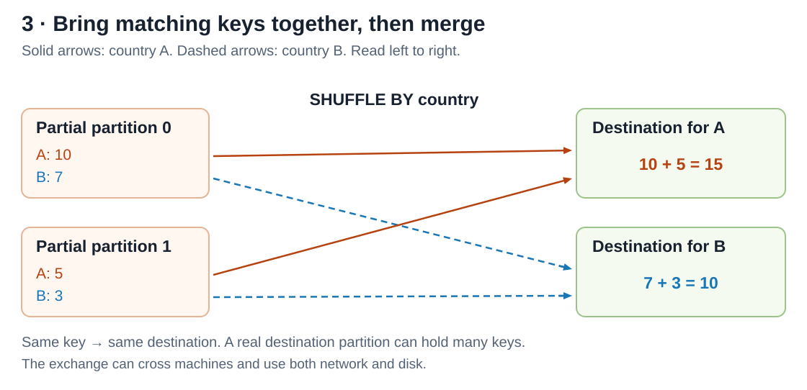
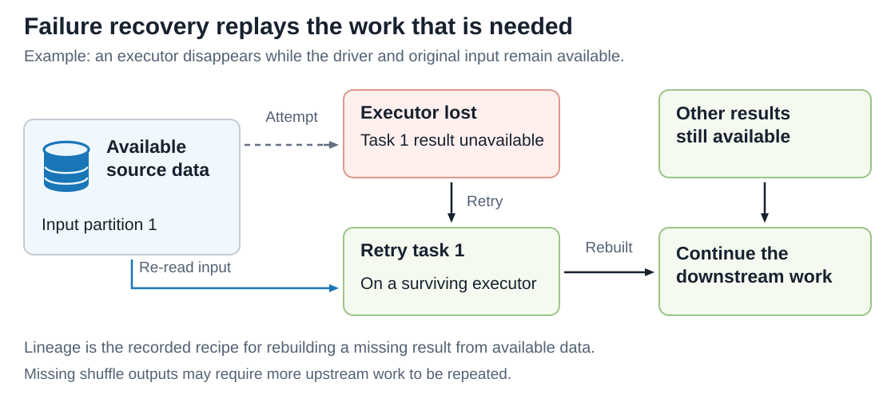
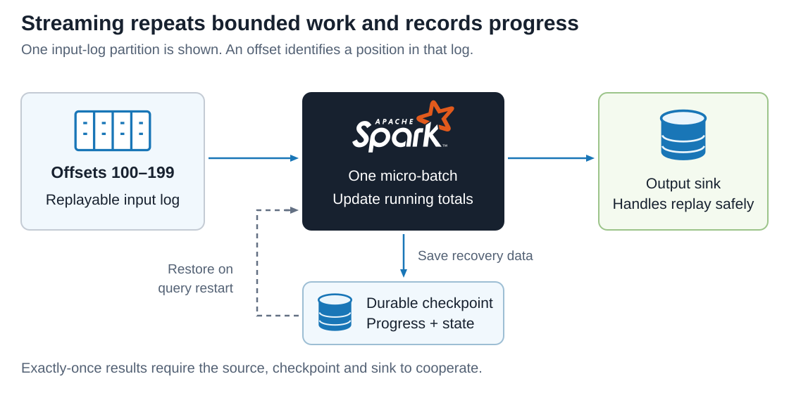

# Apache Spark

<sub>[Back to Distributed Systems](../Readme.md#content)</sub>

**Apache Spark is an open-source engine that divides data processing across multiple machines, coordinates their work, and can recompute work lost to failures.** You describe a calculation; Spark plans how to execute it over pieces of the data. Its value comes from finishing useful analysis sooner, handling larger datasets, and sometimes reducing the resources needed per result.

This article places Spark in a system, follows query planning and parallel execution through a sales example, explains shuffles, recovery, performance, and streaming, then examines real users, practical benefits, and costs.

The technical baseline is Apache Spark **4.2.0**, the current stable release checked on **2026-09-14**. Examples center on DataFrames, SQL, and default micro-batch Structured Streaming.


## What problem does Spark solve?

Imagine a shop with years of order records. It wants daily sales totals, cleaned reporting tables, and inputs for recommendation models. One computer may take too long to scan and combine all that data. Splitting the work across computers introduces new problems: distributing work, moving matching records together, and recovering when a machine disappears.

Spark provides that execution machinery. **Batch processing** handles a bounded input, such as yesterday's files. **Stream processing** continually handles arriving records. Spark supports both, alongside SQL analytics and machine-learning tools.

In the example below, read left to right: durable inputs feed Spark; Spark produces datasets that reports and applications can use. The cylinders represent storage; the striped rectangle represents an **event log**, an ordered record of events that Spark can read as they arrive. The Spark logo identifies the processing engine, and the screen represents consumers of the results.



Spark is the **processing layer**. A data lake is a collection of datasets in storage; an object store or the Hadoop Distributed File System (HDFS) can hold the files Spark reads and writes. Spark does not require HDFS: its data-source interfaces also support formats and systems such as Parquet, JSON, and relational databases through Java Database Connectivity (JDBC).

For this shop, checkout still records orders in its transactional database. Spark processes exported records or events and publishes derived data. A backend can serve prepared results without launching a large Spark computation for every customer request. This placement is an illustrative system design, not a required Spark topology.

## What are the main pieces?

A **DataFrame** is a distributed dataset organized into named columns, similar to a table. Its **schema** describes those columns and their types. A **partition** is one logical chunk of a distributed dataset—for a DataFrame, a subset of rows processed together. A partition is neither a permanent machine assignment nor necessarily one whole input file.

Two terms help explain the units of work below: a **shuffle** redistributes intermediate data among partitions, and an **action** requests a computed result, for example by displaying or writing rows. The classic cluster model separates coordination from execution:

| Term | Responsibility |
| --- | --- |
| Application | One Spark program, including its driver and executors. |
| Driver | Runs the application's coordinating code, plans computation, and schedules tasks. |
| Cluster manager | Allocates compute resources across applications; examples include Spark Standalone, Hadoop YARN, and Kubernetes. |
| Worker node | A machine on which application code can run. |
| Executor | A process on a worker that executes tasks and holds temporary or cached data. |
| Task | One scheduled unit of computation, typically processing one partition. |
| Stage | A group of tasks that can run without an intervening shuffle dependency. |
| Job | Parallel work triggered by an action requesting a result. An application can run many jobs. |

The diagram distinguishes **control** from **data movement**. The driver assigns tasks; executors access the bulk data directly. The cluster manager allocates resources, while the driver decides which application tasks run.



An executor can run several tasks concurrently when it has resources. More partitions than available task slots means tasks run in successive waves. A worker can host multiple executor processes; the diagram shows only one per worker for clarity.

`SparkSession` is the entry point used to create DataFrames and run SQL. **PySpark** is Spark's Python interface. SQL and DataFrame expressions use the same Spark SQL execution engine. The lower-level **Resilient Distributed Dataset (RDD)** interface exposes collections and transformations more directly; DataFrames give the optimizer additional information about the data and calculation.

## How does a calculation become distributed work?

Use one small question throughout: **what is the total paid amount for each country?** Countries `A` and `B` are fictional, and amounts are integer units. The diagrams choose two input partitions and two aggregation destinations to make the movement visible. Actual partition counts and physical plans can differ.

A **transformation**, such as `filter`, describes a new dataset. Transformations are generally lazy: building the expression does not immediately process every row; an action requests the result. Reading metadata or inferring a schema can still involve work before the final action.

## Step 1 — Turn the request into an execution plan



Initially, Spark has a description of the calculation. When an action demands its result, Spark prepares executable work. **Catalyst**, the Spark SQL optimizer, resolves column references, transforms the logical query, and helps select a physical execution plan. A logical plan describes what to calculate; a physical plan specifies operators that will calculate it.

For the shop's query, Spark can discard unpaid rows before aggregation and carry only necessary columns forward. With a suitable source, some filtering can also be pushed into the reader. Avoiding unnecessary reads and intermediate data can matter more than adding machines.

Dependencies form a **directed acyclic graph (DAG)**: arrows mean one calculation needs another's output, and following those dependencies does not loop back. Spark divides executable work into stages around shuffle dependencies. One action need not correspond to exactly one job or a fixed number of stages.

## Step 2 — Process partitions in parallel



Before this stage, rows are split across input partitions. The driver schedules tasks on executors. Each task reads its assigned input, keeps paid rows, and computes local partial totals. The cancelled `A:99` row contributes nothing.

These calculations can proceed independently because each task has the rows needed for its local work. For a mergeable aggregate such as a sum, partial aggregation can reduce the amount sent onward: many orders for `A` can become one local total for `A`.

Afterward, both partitions may still contain a total for the same country. Parallel local work has reduced the input, but it has not yet produced a complete answer. A filter is an example of a **narrow dependency**: it does not require redistributing records among partitions.

## Step 3 — Shuffle matching keys together and finish



The next stage needs all partial totals for each country. This shuffle uses `country` as its key: both `A` totals reach one destination, and both `B` totals reach another. Follow the solid arrows for `A` and the dashed arrows for `B`. A destination partition can contain many keys in a real job.

Spark combines `10 + 5` into `A:15` and `7 + 3` into `B:10`. This works because integer sums can be split into partial sums and merged without changing the answer, provided the numeric type does not overflow. Other calculations need different partial state: an average, for example, needs a sum and count, not an unweighted average of averages.

Shuffles often involve network transfers, serialization, and local disk activity. They create a **wide dependency**, where a downstream partition can need data from many upstream partitions. Joins, grouping, and sorting often require this redistribution, although suitable existing partitioning or a different join strategy can avoid it.

Executors can write large results to external storage. Sending everything to the driver with `collect()` removes the benefit of distributed memory and can exhaust the driver's memory.

## What does this look like in code?

This small PySpark example is intended for an environment with Spark installed. `local[2]` runs locally with two execution threads; it demonstrates the API without requiring two computers. The input partition arrangement is illustrative in the diagrams and is not enforced by this code.

```python
from pyspark.sql import SparkSession, functions as F

spark = (
    SparkSession.builder
    .appName("paid-sales-by-country")
    .master("local[2]")
    .getOrCreate()
)

orders = spark.createDataFrame(
    [
        ("A", 10, "paid"),
        ("B", 7, "paid"),
        ("A", 99, "cancelled"),
        ("A", 5, "paid"),
        ("B", 3, "paid"),
    ],
    "country STRING, amount LONG, status STRING",
)

totals = (
    orders.filter(F.col("status") == "paid")
    .groupBy("country")
    .agg(F.sum("amount").alias("paid_total"))
)

totals.explain(mode="formatted")  # Inspect the physical plan.
totals.show()                     # Action: compute and display the result.
spark.stop()
```

Expected values, with no guaranteed display order:

| country | paid_total |
| --- | ---: |
| A | 15 |
| B | 10 |

For large inputs, read distributed files or tables instead of creating a Python list on the driver. For deployment, supply the cluster configuration through the submission environment instead of hardcoding `local[2]`. In a plan, `Exchange` commonly identifies a shuffle; adaptive execution can change the final plan during execution.

## Why can Spark recover when an executor fails?

Spark records how distributed data was derived. This dependency history is called **lineage**. If an executor loses a partition, Spark can schedule the necessary computation again using available input and intermediate data.

The picture shows one failed task being replayed on a surviving executor. Other useful results remain available. If shuffle outputs have also disappeared, Spark may need to repeat their producing work.



This recovery depends on inputs remaining available and computations being reproducible. It does not recreate a source file that was permanently deleted. **Caching** keeps computed partitions for reuse; it is not a durable backup. A checkpoint instead stores recovery data in a configured storage system, with different uses for batch datasets and streaming queries.

Task retries can also repeat external effects. If a task calls an external service to send an email, replay can send it twice. Make such effects **idempotent**, meaning repeating the same logical operation has no additional effect, or use an output system with an appropriate commit and deduplication protocol.

Executor recovery also differs from driver recovery. Losing the coordinating process requires application restart behavior appropriate to the deployment; task retries alone do not restore the driver. A recoverable streaming query can resume from its durable checkpoint when restarted appropriately.

## Why can Spark be fast?

Several mechanisms help for different reasons:

| Mechanism | Why it helps | What limits the benefit |
| --- | --- | --- |
| Parallel tasks | Different partitions use multiple processors simultaneously. | Too few partitions, an overloaded source, or one slow task can leave resources idle. |
| Query optimization | Reduces unnecessary work and selects execution strategies. | Poor statistics can produce poor choices. |
| Columnar files such as Parquet | Readers can use needed columns; supported filters can skip some data. | The file layout and query determine how much can be skipped. |
| Pipelining | Compatible operations can run together within a stage. | A shuffle introduces an exchange boundary. |
| Caching reused data | Later computations can avoid repeating earlier work. | Cache creation and memory pressure can outweigh savings for one-time use. |
| Adaptive Query Execution (AQE) | Runtime statistics can guide partition sizing, join changes, and skew handling. | Adaptation cannot eliminate every expensive operation or uneven workload. |

**“In-memory processing” does not mean all data must fit in RAM or that Spark never uses disk.** Executors use memory for computation and caching. **Spilling** means writing intermediate working data to local disk when it cannot fit in the memory available to an operation; this lets some operations continue at the cost of extra disk reads and writes. Shuffle files also use local disk. Persistence behavior depends on the selected storage level. Source data and durable outputs normally live elsewhere.

**Data skew** means work is unevenly distributed. If a partition receives far more data than others, its task can dominate completion time. Adding executors does not automatically split that particular task. Diagnose the distribution and plan before increasing the cluster size.

## How does Spark handle a stream?

**Structured Streaming** treats incoming data as new rows in a growing logical table. In its default micro-batch mode, it repeatedly processes a bounded portion of newly available input and updates the result. It retains the intermediate state needed by the query rather than materializing an infinite input table.

The diagram follows one input range. An **offset** identifies a position in a source log; **state** is information carried between batches, such as running totals. A durable checkpoint records progress and state needed for recovery. The destination of output is called a **sink**.



For time-based aggregation, **event time** is when an event happened, which can differ from when Spark receives it. A **watermark** tracks event-time progress with an allowed delay so supported operations can retire old state. Records arriving beyond the supported lateness threshold may be dropped; this is a completeness tradeoff.

Exactly-once output requires the whole path to cooperate: replayable input, durable recovery information, and a sink that handles replay safely. Spark's Kafka sink provides at-least-once writes, so duplicates are possible. `foreachBatch` also provides at-least-once writes by default; application logic can use the batch identifier to deduplicate them.

Micro-batching balances latency and throughput. A short trigger interval is not a promise that every batch finishes that quickly. If processing cannot keep up with arrival, the backlog grows. The right freshness target must be measured with the actual input, state, and sink.

## Who uses Spark, and for what?

These are dated, documented deployments. They show what organizations achieved in particular systems, not a claim that every present-day workload has the same architecture.

| Organization and source date | Documented use | Reported value |
| --- | --- | --- |
| Uber, 2025 | Migrated interactive and extract-transform-load (ETL) workflows from Hive, which already ran on Spark, to Spark SQL, covering about five million monthly queries. | Reported an overall **50% reduction in runtime and resource usage** for this SQL-engine migration. |
| Facebook, now Meta, 2016 | Rebuilt an entity-ranking data pipeline that had consisted of hundreds of Hive jobs; processed over 60 TB of compressed input. | Reported roughly **5× lower latency** after pipeline and engine improvements. This was an optimized pipeline comparison, not a universal engine benchmark. |
| Airbnb, 2024 | Used Spark to generate training, validation, and inference datasets for listing embeddings—numerical representations used to find similar listings. | Prepared data for analytics and model training. The model training and online serving were separate parts of the system; the paper does not isolate a Spark-specific financial return. |

The same capabilities serve different roles: data engineers build ETL pipelines, analysts query prepared data, and machine-learning engineers create features or training datasets. Spark also includes **MLlib**, its machine-learning library, with algorithms and tools for feature processing, pipelines, and model evaluation. Using Spark to prepare training data does not imply the model itself trains inside Spark.

## What profit or practical benefit can it bring?

Spark creates value when its execution capabilities improve a business-relevant outcome. The connection should be explicit:

| Technical improvement | Potential practical benefit | What to measure |
| --- | --- | --- |
| Finish the daily data pipeline sooner | Reports or model inputs become usable earlier. | End-to-end data freshness and missed deadlines. |
| Process more history or more records | Teams can evaluate analyses previously too slow or too large. | Whether the additional data improves decisions or model quality. |
| Use fewer resources for the same output | Lower infrastructure cost or freed shared capacity. | Cost per successful run at the required completion time. |
| Reuse SQL/DataFrame concepts across jobs | Less duplicated implementation and maintenance work. | Development time, failure rate, and operational effort. |
| Recompute recoverable failed work | Less manual intervention and fewer full reruns. | Recovery time and total resources spent on retries. |

These are possible outcomes derived from the mechanisms above, not guaranteed revenue gains. Faster is not automatically cheaper: an illustrative job using 20 equal-price workers for 30 minutes consumes **10 worker-hours**; 40 workers for 20 minutes consumes about **13.3 worker-hours**. The second finishes sooner but uses more compute under those assumptions.

Evaluate total cost, including compute, storage, data transfer, platform charges, and engineering time. A useful success criterion is: “produce this correct dataset by this deadline at this cost,” rather than “use the largest Spark cluster.”

## When is Spark a good fit, and when is it excessive?

Spark is a strong candidate for substantial scans, transformations, joins, repeated analytics, and data preparation that benefit from distributed execution. It is especially useful when a team already operates a compatible data platform and can reuse its storage, connectors, and skills.

For a small dataset that one machine processes comfortably, a local dataframe tool or database query may be simpler. For checkout transactions or individual key lookups, use a serving system designed for that access pattern. For strict response-time requirements, benchmark an appropriate serving or streaming design against the real deadline rather than assuming Spark's throughput implies low latency.

Operationally, inspect the Spark user interface before tuning at random. It exposes jobs, stages, task durations, shuffle activity, executors, and storage use. Look for uneven task times, large shuffle volumes, spills, and resource bottlenecks. Reduce unnecessary data, address skew, and choose sensible partition sizes before assuming more machines will solve the problem.

## Self-check

Answer these aloud before opening the answer key. Use the sales example to make each explanation concrete.

1. How do the cluster manager, driver, and executors divide responsibility? How do a job, stage, and task fit together?
2. Does constructing `totals` immediately calculate every result? What does `totals.show()` change?
3. Why are the local `A:10` and `A:5` totals insufficient on their own? What does the shuffle achieve?
4. If an executor disappears, what can Spark recompute, and what must remain available? Why can a retried task send an email twice?
5. How does spilling differ from caching? Why might adding executors fail to fix one very slow task?
6. Is a durable streaming checkpoint enough to guarantee exactly-once output? What else must cooperate?
7. Why can a job using 40 workers for 20 minutes cost more than one using 20 workers for 30 minutes, despite finishing sooner?
8. Name one documented Spark user, its workload, and a reported benefit. What limits the conclusion you can draw from that example?

<details>
<summary>Answer key</summary>

1. The cluster manager allocates resources; the driver plans and schedules work; executors run tasks. An action triggers job work, which is divided into stages around shuffle dependencies. Each stage contains tasks that typically process individual partitions.
2. Constructing `totals` describes transformations. `show()` is an action that asks Spark to execute the necessary work and display results; metadata work may have happened earlier.
3. Each is only a partial sum. The shuffle brings both `A` totals to the same destination so they can be merged into `15`; `B` similarly becomes `10`.
4. Spark can replay the work needed to rebuild lost results using lineage, available inputs, and surviving intermediate data. Repeating computation can also repeat an external email call unless that effect handles retries safely.
5. Spilling moves working data to disk under memory pressure; caching retains computed data for later reuse. With skew, one partition can hold much more work than others, and extra executors do not automatically divide that task.
6. No. The source must support replay, recovery information must remain durable, and the sink must handle replay safely. Kafka writes and default `foreachBatch` writes can produce duplicates.
7. Assuming equal worker prices, the faster job uses about `13.3` worker-hours versus `10`. Compare cost per correct result at the required deadline, including other operating costs.
8. For example, Uber reported a 50% reduction in runtime and resource usage after migrating Hive workloads that already ran on Spark to Spark SQL. That result concerns its particular migration; it is not a promised saving for every Spark deployment.

</details>

# Sources

Primary sources checked on 2026-09-14. Technical documentation is pinned to Spark 4.2.0. The shop topology, sales data, diagrams, worker-hour calculation, and suitability guidance are teaching examples or design inferences from the documented mechanisms. Company results retain their original dates and workload scope.

- [Apache Spark overview and supported workload families](https://spark.apache.org/)
- [Apache Spark 4.2.0 release announcement](https://spark.apache.org/news/spark-4-2-0-released.html) — release date and the baseline used for this article.
- [Spark SQL, DataFrames, and Datasets](https://spark.apache.org/docs/4.2.0/sql-programming-guide.html) — schema-aware interfaces and shared execution engine.
- [Cluster mode overview](https://spark.apache.org/docs/4.2.0/cluster-overview.html) — drivers, executors, workers, resource managers, jobs, and tasks.
- [Job scheduling](https://spark.apache.org/docs/4.2.0/job-scheduling.html) — application resources, stages, dynamic allocation, and shuffle-file lifetime.
- [Spark quick start](https://spark.apache.org/docs/4.2.0/quick-start.html) — PySpark, actions, transformations, caching, and local execution.
- [RDD programming guide](https://spark.apache.org/docs/4.2.0/rdd-programming-guide.html) — partitions, lazy evaluation, shuffle costs, persistence, and driver collection limits.
- [Zaharia et al., Resilient Distributed Datasets, NSDI 2012](https://www.usenix.org/system/files/conference/nsdi12/nsdi12-final138.pdf) — lineage, narrow and wide dependencies, pipelining, and recovery foundations.
- [Spark SQL's Catalyst optimizer, by its developers](https://www.databricks.com/blog/2015/04/13/deep-dive-into-spark-sqls-catalyst-optimizer.html) — logical optimization and physical planning; historical design background.
- [DataFrame.explain](https://spark.apache.org/docs/4.2.0/api/python/reference/pyspark.sql/api/pyspark.sql.DataFrame.explain.html) — logical and physical plans and formatted output.
- [Spark SQL data sources](https://spark.apache.org/docs/4.2.0/sql-data-sources.html) — external inputs and outputs.
- [Parquet files](https://spark.apache.org/docs/4.2.0/sql-data-sources-parquet.html) — columnar storage, partition discovery, and supported filtering.
- [SQL performance tuning](https://spark.apache.org/docs/4.2.0/sql-performance-tuning.html) — caching, statistics, joins, AQE, and skew.
- [Spark tuning guide](https://spark.apache.org/docs/4.2.0/tuning.html) — parallelism, serialization, memory pressure, and data locality.
- [Structured Streaming overview](https://spark.apache.org/docs/4.2.0/streaming/index.html) — default micro-batch execution.
- [Structured Streaming programming model](https://spark.apache.org/docs/4.2.0/streaming/getting-started.html) — incremental tables, event time, and replayable sources with idempotent sinks.
- [Structured Streaming APIs and recovery](https://spark.apache.org/docs/4.2.0/streaming/apis-on-dataframes-and-datasets.html) — watermarking, checkpoint state, sink guarantees, and `foreachBatch` replay.
- [Monitoring and instrumentation](https://spark.apache.org/docs/4.2.0/monitoring.html) — application UI, task metrics, executors, and storage information.
- [MLlib guide](https://spark.apache.org/docs/4.2.0/ml-guide.html) — machine-learning algorithms, features, and pipelines.
- [Uber: migration from Hive to Spark SQL for ETL](https://www.uber.com/us/en/blog/how-uber-migrated-from-hive-to-spark-sql-for-etl-workloads/) — 2025 migration scope and measured aggregate improvement.
- [Meta: Apache Spark at scale, a 60 TB+ production use case](https://engineering.fb.com/2016/08/31/core-infra/apache-spark-scale-a-60-tb-production-use-case/) — 2016 entity-ranking pipeline and its comparison limits.
- [Airbnb: Learning and Applying Listing Embeddings in a Two-Sided Marketplace](https://airbnb.tech/wp-content/uploads/sites/19/2024/12/Learning-and-Applying-Airbnb-Listing-Embeddings-.pdf) — 2024 paper, particularly its training-data pipeline.
- [Official Apache Spark SVG logo](https://github.com/apache/spark-website/blob/asf-site/images/spark-logo-rev.svg) — downloaded from the Apache website repository. The logo artwork and colors are unchanged; local presentation adds accessibility metadata, display sizing, and a dark background. Other infrastructure symbols are original SVG geometry following this repository's System Design conventions.
- [Apache Spark trademark guidelines](https://spark.apache.org/trademarks.html) — Apache Spark and its logo are trademarks of the Apache Software Foundation. Their use here identifies the project and does not imply endorsement.
