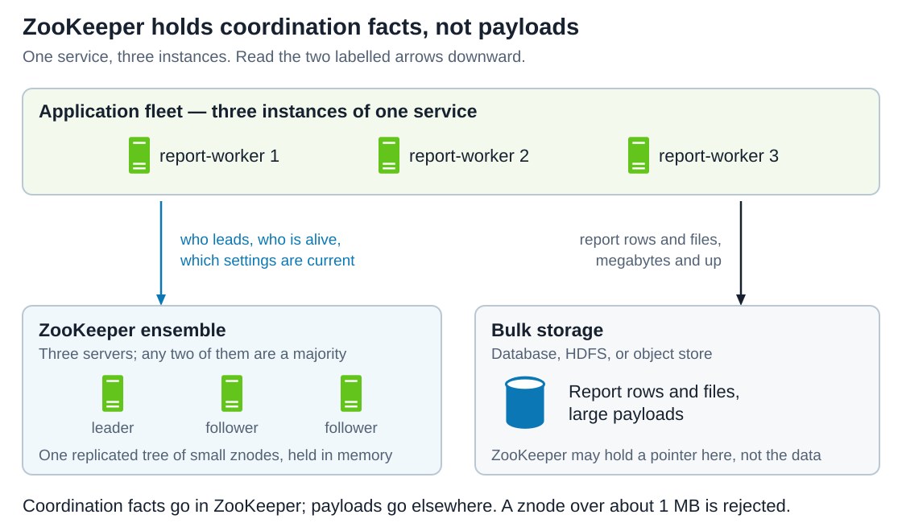
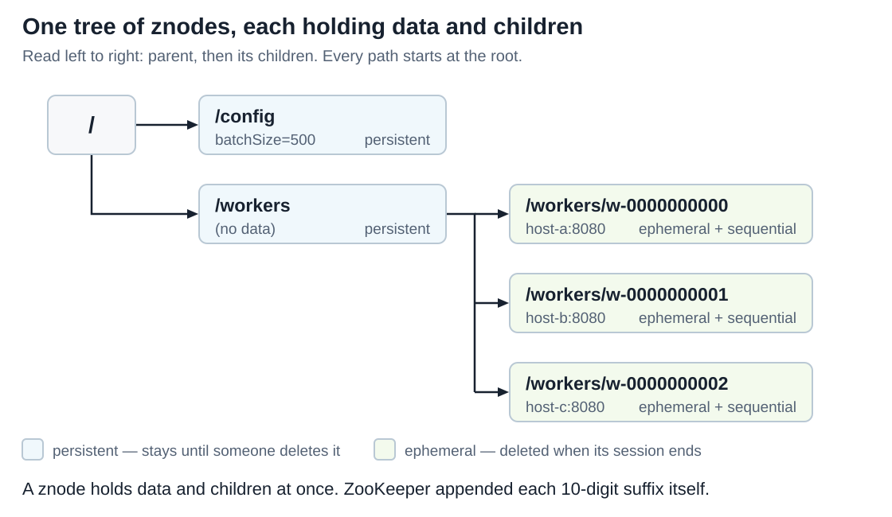
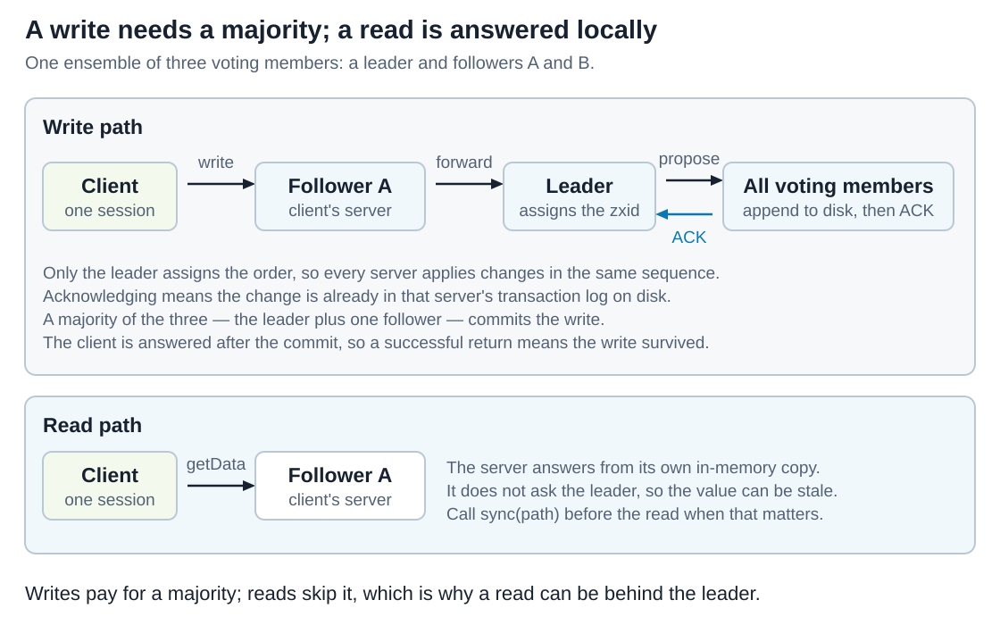
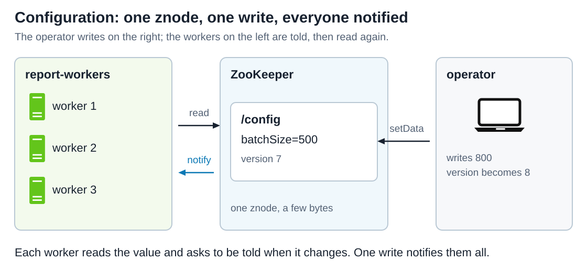
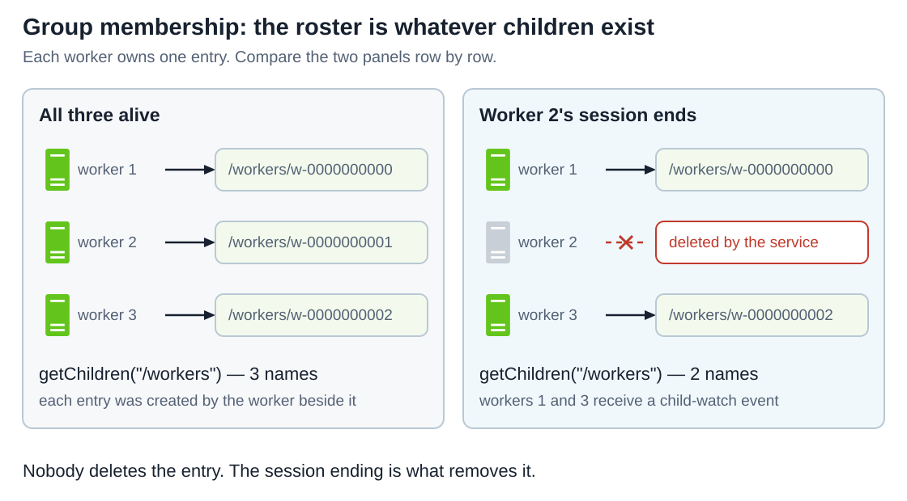
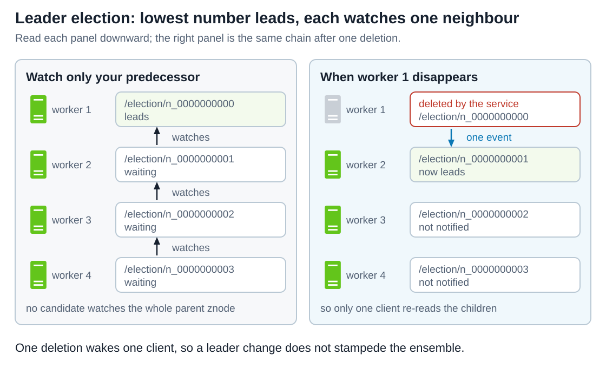
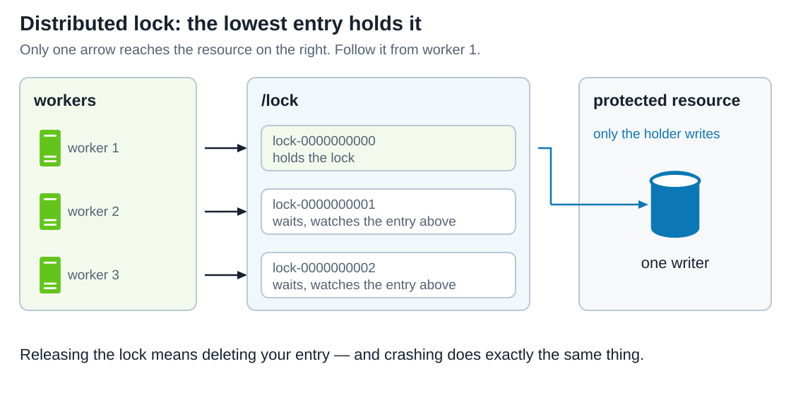
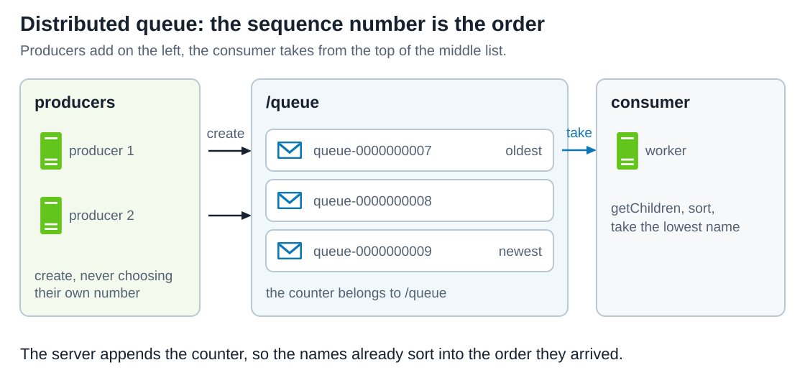

# Apache ZooKeeper

[Back to Distributed Systems](../Readme.md#content)

**Apache ZooKeeper is a replicated coordination service: a small, strictly ordered, highly available store that distributed applications use to agree on facts such as which instance is the leader, which instances are alive, and what the current configuration is.** It is not a database. Its own documentation describes the data it holds as "coordination data" measured in kilobytes, kept in memory on every server.

This article starts with the systems that depend on it, then builds the model in the order you need it: the tree of data nodes, the sessions that make some of those nodes expire, the notifications a client can ask for, the small API, the guarantees, and the ensemble behind them. The second half turns that model into **five patterns of usage**, numbered most-used first with one diagram each, and closes with the limits. The running example is a fleet of three `report-worker` instances that must pick one leader, share one setting, and notice when one of them dies.

The technical baseline is **ZooKeeper 3.9.6**, the current release line; 3.8.7 is the parallel stable line. Behaviour that arrived in a specific release is marked where it matters.

## Which systems depend on ZooKeeper?

Each row below comes from that project's own documentation. They show what a system uses ZooKeeper for, not a claim that every deployment is configured this way.

Four terms appear here before their own sections explain them. A **quorum** is a majority of the ZooKeeper servers. A **session** is a client's server-tracked lifetime, kept alive by heartbeats. An **ephemeral node** is an entry that the service deletes by itself when the session that created it ends. **Leader election** is choosing one instance out of several to do work the others must not do.

| System | What its documentation says it uses ZooKeeper for |
| --- | --- |
| **Apache HBase** | A ZooKeeper quorum is **required**. HBase keeps operational metadata there — the active master's address, the location of the `hbase:meta` region, the cluster ID — and a region server's presence is an ephemeral node that expires on shutdown. Since HBase 2.3.0 clients may fetch that metadata from the masters instead, explicitly to **reduce load on ZooKeeper**. |
| **Apache Solr** | In SolrCloud mode ZooKeeper tracks each node and the state of each core, holds the configuration files centrally "and not on the file system of each node", and handles load balancing, failover, and the routing of incoming requests to an appropriate replica. |
| **Apache Hadoop (HDFS)** | Automatic NameNode failover. Each NameNode's `ZKFailoverController` keeps a session open; the active one also holds a lock znode. A crash expires the session, another controller wins the lock, and it runs the failover. Hadoop's guide expects **three or five** ZooKeeper nodes. |
| **Apache Flink** | The ZooKeeper high-availability services elect the JobManager leader and store **a pointer to** the JobManager state; the metadata itself lives in the configured `high-availability.storageDir`. The neighbouring [Apache Flink](../Apache%20Flink/Readme.md) article covers what that state contains. |
| **Apache Kafka** | Kafka used ZooKeeper for more than ten years. **Kafka 4.0 is the first major release that runs entirely without it**; ZooKeeper mode was removed and KRaft is the only mode. The [Apache Kafka](../Apache%20Kafka/Readme.md) article describes the cluster that replaced it. |
| **ClickHouse Keeper** | Not a user but a re-implementation: it "replaces ZooKeeper", keeps a **compatible client-server protocol** so ordinary ZooKeeper clients work against it, and uses Raft instead. Its interserver protocol differs, so a mixed cluster is impossible. |

One shape recurs. In every row, a small amount of state that every instance must agree on has been moved **out of** the instances and into a service whose only job is to keep that state consistent and available. Kafka's exit is the same shape read backwards: it replaced an external coordination service with an internal one, not with nothing.

## The problem it solves

Three `report-worker` instances run the same code. Exactly one of them must run the nightly settlement job, all three must read the same `batchSize` setting, and the other two must notice within seconds when the one running the job dies.

None of that can be solved by the instances alone. Asking each other "are you the leader?" fails the moment two instances cannot reach each other but both are alive. Writing a `leader.lock` file to shared storage fails when the holder freezes without releasing it. What the fleet needs is one outside party that can order events, keep its answer available while machines fail, and forget a client that stops responding.

The diagram below separates the two kinds of traffic the fleet produces. Read the two labelled arrows downward: coordination facts go left into ZooKeeper, and the actual report data goes right into ordinary storage. The bottom line states the rule those arrows follow.

The split is not a style preference. ZooKeeper holds its whole dataset in memory on every server and copies every change to a majority of them before acknowledging it, so its cost per byte is high and its capacity is small. Both properties are what make its answers trustworthy, and both are why the payload belongs somewhere else.

## The data model

ZooKeeper's namespace is "much like that of a standard file system": a tree of absolute, slash-separated paths. Every node in that tree is a **znode**, and unlike a file system a znode holds data *and* has children at the same time — "like having a file-system that allows a file to also be a directory".

Read the diagram below left to right, parent before children. Each entry names its kind in words, and the fill colour repeats it; the bullets and subsections that follow explain what those kinds mean.

Four properties carry most of the model:

* **The values are small.** ZooKeeper was designed to store "status information, configuration, location information", so the documentation expects values "in the byte to kilobyte range". The client and server both reject a znode over roughly 1 MB;
* **Reads and writes are whole-value and atomic.** A read returns all of the bytes; a write replaces all of them. There is no append and no partial update;
* **Every znode carries a version.** `setData` and `delete` take the version the client last read, so a write based on a stale read fails instead of silently overwriting someone else's change;
* **A znode can be ephemeral.** "These znodes exists as long as the session that created the znode is active. When the session ends the znode is deleted." An ephemeral znode cannot have children, because a child would outlive the session its parent depends on.

### Sessions decide when an ephemeral znode dies

A **session** is the client's relationship with the service. The client keeps a TCP connection to one server and sends heartbeats over it; if that connection breaks, the client library connects to a different server and carries the same session across. **The cluster, not the client, decides when a session has expired**, and expiry is exactly what deletes the ephemeral znodes that session owned.

That rule — the cluster decides, and expiry deletes — is what the membership, election and lock patterns below are built on. It also has a sharp edge: a client that has been cut off from the network is the *last* to find out, because it can only be told once it reconnects.

### Sequential znodes number themselves

A **sequential** znode gets a ten-digit counter appended to its name by the server. The client cannot choose or predict it — `create` returns the name that was actually used. The counter belongs to the parent znode and only moves forward, so the children of one parent sort into the order they were created. The election and queue patterns below both turn that ordering into a running order.

## The API is deliberately small

| Call | What it does |
| --- | --- |
| `create` | creates a node at a location in the tree |
| `delete` | deletes a node |
| `exists` | tests if a node exists at a location |
| `getData` | reads the data from a node |
| `setData` | writes data to a node |
| `getChildren` | retrieves a list of children of a node |
| `sync` | waits for data to be propagated |

Since 3.4.0 there is also `multi`, which applies a list of operations so that "all of them or none of them will be executed".

That is the whole vocabulary. Locks, leader election, queues, and group membership are not features — they are conventions that clients build out of these few calls, which is what the patterns section is about.

## Watches: one notification per read

"Clients can set a watch on a znode. A watch will be triggered and removed when the znode changes." The two words that do the work are *triggered* and *removed*. `getData`, `getChildren`, and `exists` can each arm a watch, and each watch fires **once**.

The event names the znode that changed but does not carry the new value, so every notification costs a follow-up read — and between the event and that read, the value can change again. You can rely on being told that something changed. You cannot rely on seeing every value it passed through; if your logic needs every one of them, put the values in a log and read the log instead.

Since 3.6.0, `addWatch` can register a **persistent** watch, optionally recursive over a whole subtree, which survives being triggered. That removes the re-registration step, not the gap.

## How the ensemble answers

An **ensemble** is the set of servers running the service. Each one keeps "an in-memory database containing the entire data tree" and logs every update to disk for recovery. Availability follows the majority: "As long as a majority of the servers are available, the ZooKeeper service will be available." Three servers therefore survive one failure and five survive two.

Reads and writes then take very different paths, and most of what surprises people follows from that.

Read the top panel left to right: a write travels through four participants, and the blue arrow is the only one that comes back. In the documentation's words, "all write requests from clients are forwarded to a single server, called the leader", which puts them in one order, while the followers "receive message proposals from the leader and agree upon message delivery". Each server writes the change to disk before applying it to memory, so a successful write is already durable on a majority of machines — the ensemble-wide version of the bargain the [write-ahead log](../Write-ahead%20log%20%28WAL%29/Readme.md) article describes for one database.

The bottom panel is a read, and it stops at the second box. "Read requests are serviced from the local replica of each server database." No quorum, no leader, no waiting — and therefore no promise that the value is the newest one. That asymmetry is deliberate, and it is why the documentation says ZooKeeper "performs best where reads are more common than writes, at ratios of around 10:1".

## What ZooKeeper guarantees

* **Sequential consistency** — updates from one client are applied in the order that client sent them;
* **Atomicity** — updates succeed or fail, with no partial results;
* **Single system image** — a client sees the same view of the service regardless of which server it is connected to, and never an *older* view after failing over within the same session;
* **Reliability** — once an update is applied it persists until overwritten;
* **Timeliness** — a client's view is up to date within a time bound "on the order of tens of seconds".

There is one guarantee people assume and do not get, and the documentation names it: ZooKeeper does **not** promise "Simultaneously Consistent Cross-Client Views". If client A writes `/a` and then tells client B out of band to read it, B may still see the old value. The fix is for **B** — the reader, not the writer — to call `sync(path)` first, which asks its own server to catch up before answering.

## Patterns of usage

Each pattern below is a convention, not a feature: it is built from the seven calls above plus the ephemeral and sequential flags. In the diagrams, a green rack is one of your application's processes and a box inside a ZooKeeper panel is a znode.

They are numbered by how widely they are used. That ordering comes from the documentation's own framing rather than from a usage survey. Naming and configuration are "two of the primary applications of ZooKeeper", group membership is likewise "directly provided by ZooKeeper", and leader election sits beside them in the project's off-the-shelf list of "consensus, group management, leader election, and presence protocols". The last two are client-side recipes that the recipes page itself hedges: locks "illustrate certain points, even though you may find other constructs, such as event handles or queues, a more practical means of performing the same function".

### 1. Configuration

Put the setting in one znode. Every process reads it and arms a watch; an operator writes a new value; every watcher is notified and reads again. The version number is what stops a careless overwrite: a writer that read version 7 and passes that version back cannot commit over a value that has already moved to version 8.

Read the diagram below from the right: the operator writes, the notification travels back to the left, and each worker reads again.

This is the cheapest thing ZooKeeper does, and it is what Solr means by keeping configuration "in ZooKeeper and not on the file system of each node".

### 2. Group membership

Designate a parent znode and have every member create one **ephemeral** child under it. `getChildren` on the parent is the live roster. Nothing has to detect a failure and nothing has to clean up: when a member's session ends, the service deletes its entry and notifies whoever was watching the parent.

Compare the two panels row by row. The only difference is worker 2's session, and the roster changes by itself as a result. This is how HBase tracks region servers and how a service-discovery layer keeps its list of healthy instances.

### 3. Leader election

Every candidate creates one **ephemeral sequential** child of `/election`; the lowest number leads. The obvious way to watch for the leader's disappearance — have everyone watch the leader's znode — works, but it wakes every candidate at once even though only one of them can proceed. The documented recipe avoids that **herd effect**: each candidate watches only the entry with the next lowest number.

Because each entry is watched by exactly one client, one deletion wakes exactly one client. Two details are easy to miss. The `getChildren` call that finds your position is made **without** a watch, since setting one there would recreate the herd. And a deleted predecessor does not automatically make you the leader — on notification you re-read the children and check whether you are now the lowest, because the client between you and the leader may have died while a lower one is still alive.

### 4. Distributed lock

The same structure answers a different question. Create an ephemeral sequential child of `/lock`, and if you hold the lowest number you hold the lock; otherwise watch the entry above you and wait. Releasing the lock is deleting your entry — and so is crashing, because the session takes the entry with it, which is why a ZooKeeper lock cannot be left held by a dead process. A *disconnected* process is a different story, and [Limits worth knowing](#limits-worth-knowing) takes it up.

A shared read/write lock is a small variation: a reader waits only for lower-numbered `write-` entries, while a writer waits for any lower entry. Releasing a batch of readers together is not a herd effect, because all of them genuinely can proceed.

### 5. Distributed queue

Producers create sequential children of `/queue`; a consumer lists them, sorts them, and takes the lowest name first. The server assigns the numbers, so the ordering is not something the producers have to agree on.

The recipe sets the **ephemeral** flag as well as the sequential one, which means an entry disappears if the producer that wrote it loses its session. Together with the 1 MB ceiling on a znode, that is a good reminder of what this is: a coordination queue for small items, not a message broker.

Writing these conventions correctly by hand is harder than it looks, mostly because of the error cases. **Apache Curator** is a Java client that supplies connection management, retry handling, and these recipes already implemented; the ZooKeeper distribution also ships reference lock and queue implementations under `zookeeper-recipes/`.

## Limits worth knowing

**It is not a database.** A znode over roughly 1 MB is rejected, and the documentation calls that limit "really a sanity check", because large znodes make leader-to-follower synchronization "unpredictable and non-convergent". Keep the bytes in bulk storage and the pointer in ZooKeeper, the way Flink's HA services do.

**A read can be stale.** Reads skip the quorum entirely. When one client must see another client's write, the reader calls `sync` first — and even that is not a quorum operation, so a preceding write gives the stronger guarantee.

**A lock is not a fencing token.** This is the costliest misconception, and it follows from the session rule. A worker whose network drops keeps believing it holds the lock, because it cannot be told otherwise until it reconnects, while the ensemble has already expired its session and handed the lock to someone else. ZooKeeper's guarantee is intact — exactly one client owns the znode — but the disconnected client's *belief* has gone stale. The documented mitigation is to treat a disconnection event as a signal to stop acting. Against a process that is frozen rather than disconnected, the resource itself has to reject stale holders, using a number that only increases, such as a znode's `version`; ZooKeeper can supply such a number but cannot make the resource check it.

**Losing the majority stops writes, and that is correct.** A minority that kept accepting writes would be a second, divergent copy of the truth. Note also that four servers tolerate no more failures than three, which is why odd ensemble sizes are conventional.

**The packaging is changing.** Kafka removed ZooKeeper in 4.0 and ClickHouse Keeper re-implemented its protocol in C++ over Raft; both point toward consensus built into the system rather than a second cluster to operate. That is a change in packaging, not a verdict on the model — HBase, Solr, and Hadoop's HA services still require an ensemble.

## Self-check

1. Why can a znode hold data and have children at once, and what does that rule out?

   

   
Answer

   ZooKeeper's namespace has no separate file and directory concepts — every path element is a znode with optional data and optional children. It rules out ephemeral znodes having children, since a child would outlive the session its parent is tied to.

   

2. A client's TCP connection to its server breaks. Has its session expired?

   

   
Answer

   Not necessarily. The client library reconnects to another server and carries the session across. Only the cluster decides expiry, and only after the timeout elapses with no heartbeat.

   

3. A client sets a watch on `/config`, and `/config` is then written three times. How many events does it receive?

   

   
Answer

   One. A watch fires once and is removed. The event says the znode changed, not what it changed to, and re-reading returns the third value — the second is never observed.

   

4. Client A writes a value and then tells client B, out of band, to read it. Why might B see the old value?

   

   
Answer

   Reads are answered from the local replica of whichever server B is connected to, with no quorum round, so that server can be behind. B — not A — calls `sync(path)` before the read; a preceding write gives the stronger guarantee.

   

5. In the membership pattern, who deletes a dead worker's entry?

   

   
Answer

   The service does. The entry is ephemeral, so the cluster removes it when that worker's session expires, and notifies whoever was watching the parent. No component has to detect the failure or clean up.

   

6. In the leader-election pattern, why does each candidate watch its predecessor instead of the leader?

   

   
Answer

   Watching the leader wakes every candidate on every leader change — the herd effect — when only one of them can proceed. Watching the next lowest entry means each entry has exactly one watcher, so one deletion wakes one client.

   

7. Why can a ZooKeeper lock never be left held by a crashed process?

   

   
Answer

   The lock entry is ephemeral, so the crash ends the session and the service deletes the entry. Releasing the lock and crashing have the same effect on the znode.

   

8. Two processes believe they hold the same lock. Is that a bug in ZooKeeper?

   

   
Answer

   No. A partitioned client's session expires and its entry is deleted, but it is not told until it reconnects, so its belief goes stale while the ensemble stays consistent. Stop acting when you are told you are disconnected, and let the guarded resource reject stale holders using an increasing number.

   

# Sources

Primary documentation checked on 2026-09-21 and pinned to ZooKeeper 3.9.6, the current release line, except where a statement is attributed to another project's own documentation. The technical overview is the backbone; the programmer's guide, recipes, and internals supply the detail behind the patterns. The `report-worker` fleet, the znode paths, and the diagrams are teaching examples. The sequence-counter behaviour was read from the 3.9.6 server source rather than inferred from the prose.

- [Apache ZooKeeper 3.9 documentation](https://zookeeper.apache.org/doc/r3.9.6/index.html)
- [ZooKeeper technical overview](https://zookeeper.apache.org/doc/r3.9.6/zookeeperOver.html) — the data model and hierarchical namespace, ephemeral nodes, conditional updates and watches, the five guarantees, the simple API, the replicated in-memory database with updates logged to disk, leader and follower roles, majority availability, and the 10:1 read-to-write observation.
- [ZooKeeper programmer's guide](https://zookeeper.apache.org/doc/r3.9.6/zookeeperProgrammers.html) — path rules, the stat structure and versions, znode kinds, the 1M sanity check, sessions and expiry, watch semantics, persistent recursive watches, and the note on cross-client views and `sync`.
- [ZooKeeper recipes and solutions](https://zookeeper.apache.org/doc/r3.9.6/recipes.html) — group membership, queues, locks and shared locks, and the leader-election recipe with its herd-effect reasoning.
- [ZooKeeper internals](https://zookeeper.apache.org/doc/r3.9.6/zookeeperInternals.html) — the `n/2+1` quorum requirement and the statement that writes are linearizable while reads are not.
- [ZooKeeper administrator's guide](https://zookeeper.apache.org/doc/r3.9.6/zookeeperAdmin.html) — ensemble sizing and the odd-number argument, and `jute.maxbuffer` with the reasons not to raise it.
- [ZooKeeper releases](https://zookeeper.apache.org/releases.html) — the current (3.9.6) and stable (3.8.7) branches.
- [ZooKeeper 3.9.6 `PrepRequestProcessor`](https://github.com/apache/zookeeper/blob/release-3.9.6/zookeeper-server/src/main/java/org/apache/zookeeper/server/PrepRequestProcessor.java) and [`DataTree`](https://github.com/apache/zookeeper/blob/release-3.9.6/zookeeper-server/src/main/java/org/apache/zookeeper/server/DataTree.java) — the ten-digit sequence suffix taken from the parent's child counter, and the fact that deleting a child does not move that counter back.
- [ZooKeeper 3.9.6 `ZooKeeper` client class](https://github.com/apache/zookeeper/blob/release-3.9.6/zookeeper-server/src/main/java/org/apache/zookeeper/ZooKeeper.java) — the `multi` contract since 3.4.0 and the `addWatch` overloads.
- [Apache Curator](https://curator.apache.org/docs/about) — the Java client that wraps the raw API with connection management and ready-made recipes.
- [Apache HBase reference guide](https://hbase.apache.org/book.html) — the required ZooKeeper quorum, the metadata kept there, and the master-based connection registry introduced in 2.3.0.
- [Apache Solr: cluster types](https://solr.apache.org/guide/solr/latest/deployment-guide/cluster-types.html) — SolrCloud's use of ZooKeeper for node state, central configuration, and request routing.
- [HDFS high availability with QJM](https://hadoop.apache.org/docs/stable/hadoop-project-dist/hadoop-hdfs/HDFSHighAvailabilityWithQJM.html) — the ZKFailoverController, session-based failure detection, the lock znode, and the three-or-five-node expectation.
- [Flink ZooKeeper HA services](https://nightlies.apache.org/flink/flink-docs-release-2.3/docs/deployment/ha/zookeeper_ha/) — leader election plus a pointer to state, with metadata in `high-availability.storageDir`.
- [Apache Kafka 4.0.0 release announcement](https://kafka.apache.org/blog/2025/03/18/apache-kafka-4.0.0-release-announcement/) — the first major release operating entirely without ZooKeeper.
- [ClickHouse Keeper](https://clickhouse.com/docs/guides/sre/keeper/clickhouse-keeper) — a Raft-based replacement with a compatible client protocol and an incompatible interserver protocol.
- Local icon sources: [System Design: message queue](../../system%20design/01.%20Scaling/images/message-queue.svg) supplies the server and envelope symbols and [System Design: database](../../system%20design/01.%20Scaling/images/database.svg) supplies the laptop symbol and database geometry, copied as editable vector shapes into this article's diagrams with the database label omitted.
