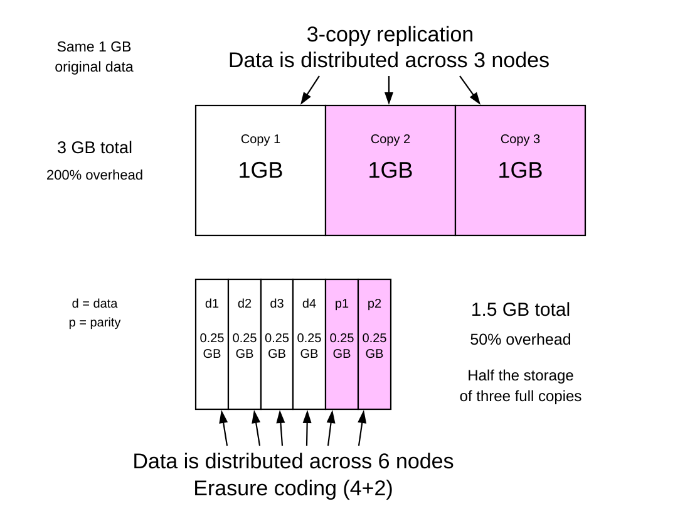
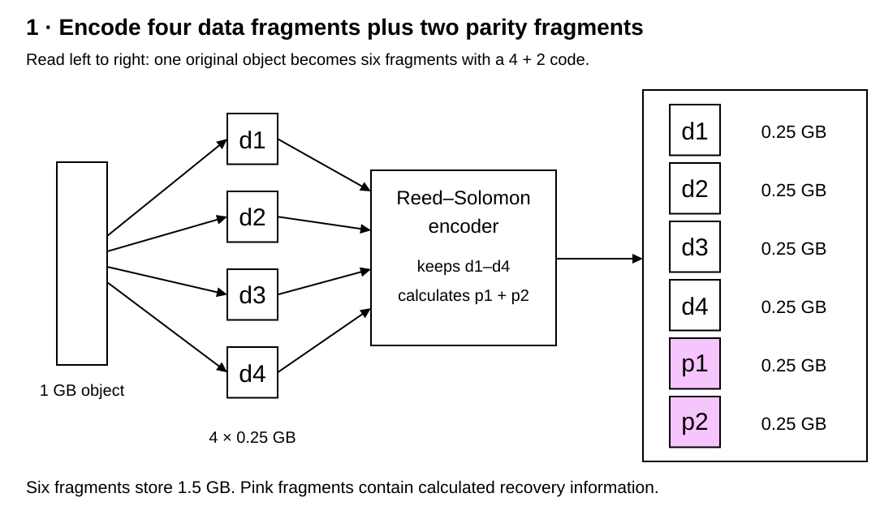
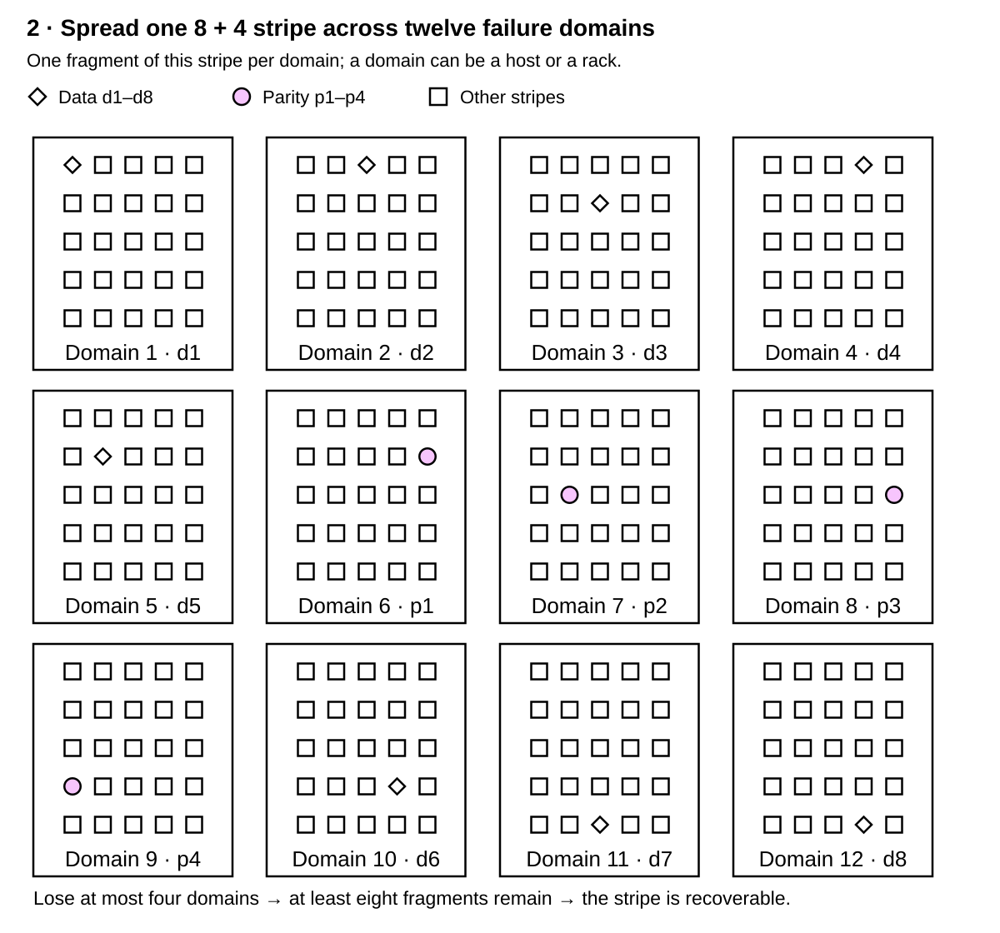
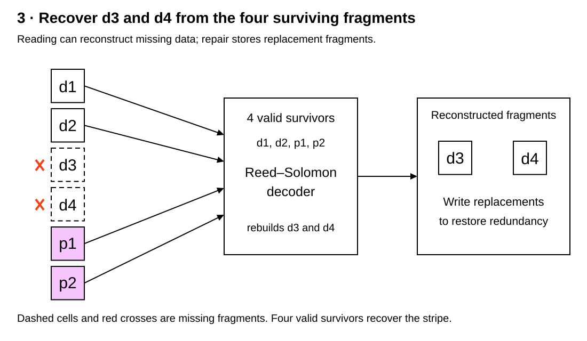

# Erasure coding

<sub>[Back to Distributed Systems](../Readme.md#content)</sub>

**Erasure coding protects data by splitting it into fragments and adding calculated recovery fragments, so missing pieces can be rebuilt without storing several complete copies.** It trades extra computation and repair traffic for lower storage overhead than replication.

This article explains the `k + m` model and storage costs, follows encoding, placement, and recovery, then examines read and write behavior, where erasure coding is used, and its limits. The diagrams adapt the SVGs from this repository's S3-like Object Storage chapter. The examples use systematic Reed–Solomon coding; not every erasure-code family has the same recovery properties.

## The core model: k data fragments plus m parity fragments

| Term | Meaning |
|---|---|
| Fragment, shard, or chunk | One piece of the encoded data, stored separately from other pieces. |
| `k` | Number of original data fragments in a coding group. |
| `m` | Number of additional **parity fragments**, calculated from the data. |
| Stripe | The data fragments and associated parity fragments protected together. Large objects can span many stripes. |
| Systematic code | A code that retains the original data fragments alongside the calculated parity fragments. |
| Erasure | A missing or unusable fragment whose position is known. |
| Failure domain | Components that can fail together, such as disks in one host or hosts sharing a rack. |

For a **maximum distance separable (MDS)** code such as Reed–Solomon, **any `k` valid fragments out of the `k + m` fragments can reconstruct the original stripe**. The survivors may be data fragments, parity fragments, or a mixture.

For example, `4 + 2` means four data fragments and two parity fragments. Any four of the six suffice, so any two can be lost. Losing three leaves too little information to reconstruct the complete stripe without another source.

The guarantee applies **per stripe**. It is not a claim that an entire cluster can lose only two disks, or that two arbitrary rack failures are always safe.

## Storage cost compared with replication

Both rows below protect the same **1 GB of original data**. The top row stores three complete copies. The bottom row stores four data fragments, `d1`–`d4`, and two parity fragments, `p1` and `p2`, each 0.25 GB. Copies 2 and 3 above and parity fragments `p1` and `p2` below provide the extra redundancy; pink also highlights them.



Ignoring padding, metadata, and other implementation overhead:

```text
Total stored bytes = original bytes × (k + m) / k
Extra redundancy  = original bytes × m / k
Usable fraction   = k / (k + m)
```

| Scheme | Storage for 1 GB | Extra storage above the original | Losses tolerated for this data |
|---|---:|---:|---|
| Three complete replicas | 3 GB | 200% | Any two copies can be lost; one remains |
| Reed–Solomon `4 + 2` | 1.5 GB | 50% | Any two of six fragments |
| Reed–Solomon `8 + 4` | 1.5 GB | 50% | Any four of twelve fragments |

Thus `4 + 2` uses **50% less total storage than three-copy replication**, while having **50% overhead relative to the original data**. Those percentages have different denominators.

The table compares coding capacity and fragment losses, not annual durability or service availability. A larger stripe also involves more storage locations and potentially more repair work.

## Step 1 — Encode the object into data and parity fragments



Start with a 1 GB object, treated as one stripe for this example. On upload, the encoder splits it into four equal data fragments, `d1` through `d4`, and computes two equal-sized parity fragments, `p1` and `p2`.

The result is six 0.25 GB fragments. The original four remain unchanged because the code is systematic. Each parity fragment combines information from the data; it is not a spare copy assigned to one particular data fragment.

Reed–Solomon uses carefully chosen arithmetic over a **finite field**, a finite set of values with defined arithmetic rules. Its independent coding relationships let the decoder solve for missing data from any four valid survivors. Arbitrary ordinary additions and multiplications do not automatically provide that guarantee.

The encoder has now created redundancy, but placing all six fragments on one machine would leave them vulnerable to the same machine failure.

### A small parity example

The idea is easier to see with **exclusive OR (XOR)**: each result bit is `1` when the two input bits differ. This toy `2 + 1` code has two data fragments and one parity fragment:

```text
d1 = 1010
d2 = 1100
p  = d1 XOR d2 = 0110

If d2 is missing:
d2 = d1 XOR p  = 1100
```

This recovers one missing fragment. If both data fragments are missing, `p` alone cannot determine both. Storing two identical copies of `p` would add no new equation; tolerating additional losses requires suitable independent redundancy.

## Step 2 — Place fragments across failure domains



The placement diagram uses the S3 chapter's larger **`8 + 4` example**. Each outlined domain contains many stored fragments, but only one belongs to the highlighted stripe. Diamonds identify its eight data fragments; pink circles identify its four parity fragments. The small squares represent other stripes.

This example assumes the placement policy can put each of the twelve fragments in a separate failure domain. If each domain represents one rack, losing any four of those racks removes exactly four fragments, leaving the eight required to reconstruct the stripe.

The domain boundary matters. Placing fragments on different disks in the same host protects against fewer shared failures than placing them on separate hosts. Different hosts in one rack can still share power or networking.

For comparison, a `4 + 2` stripe with three fragments in one rack cannot survive losing that rack: only three remain. This follows directly from the four-fragment recovery threshold, even though the failed components may be described as “one rack.”

Placement converts the mathematical fragment-loss guarantee into protection against the failures the system is designed to survive.

## Step 3 — Reconstruct missing fragments and repair redundancy



Return to `4 + 2`. Suppose the nodes holding `d3` and `d4` fail. The surviving fragments are `d1`, `d2`, `p1`, and `p2`: exactly four valid inputs.

The decoder uses their identities and coding relationships to reconstruct `d3` and `d4`. A **degraded read** uses surviving fragments to reconstruct requested data that is unavailable. **Repair** goes further: the storage system writes replacement fragments to suitable nodes so the stripe regains its redundancy.

While only four fragments remain, the stripe is recoverable but has no margin for another fragment loss. With only three usable fragments, a read of the example's complete object cannot succeed from this stripe. If the missing fragments are temporarily unreachable, access can recover when enough return. If a third fragment is permanently lost before repair, complete reconstruction requires another source, such as a backup. Prompt repair therefore matters as much as the original coding choice.

Parity fragments can fail too. If `p1` and `p2` disappear while all four data fragments survive, the original data remains available and new parity can be calculated.

### Missing data and corrupted data are different

The decoder must know which fragments are usable. Checksums help detect corruption so a bad fragment can be excluded and treated as an erasure. A fragment that silently contains incorrect bytes is not equivalent to a known missing fragment.

For a concrete mechanism, Ceph's **BlueStore** storage backend records checksums for data and metadata. **Deep scrubbing** reads stored data and checks it against those checksums to detect corruption. Detection identifies a problem; successful reconstruction still requires enough valid fragments.

The “any four” rule assumes **four valid fragments from the same encoded stripe and version**, plus the information needed to identify and decode them. It does not mean four arbitrary pieces with matching lengths are sufficient.

## Healthy reads, degraded reads, repair, and writes

| Operation | What changes compared with complete replicas |
|---|---|
| Healthy read | With a systematic layout, the original data fragments can be read directly. A range read need not read every fragment or calculate parity. |
| Degraded read | If required data is unavailable, additional surviving fragments are read and decoded. This can add network traffic and latency. |
| Repair | Surviving fragments are read, missing fragments are calculated, and replacements are written. This competes with foreground traffic. |
| Write or overwrite | Parity must remain consistent with the data. Encoding costs CPU, and partial-update support and costs depend on the implementation. |

In conventional Reed–Solomon repair, rebuilding one missing fragment can require reading `k` others. **Locally repairable codes** add local redundancy to reduce the number of fragments needed for common repairs, with their own capacity and failure-pattern tradeoffs.

The decoding threshold is also separate from a **write quorum**, the set of acknowledgments required before a storage system reports a write successful. Recovering data from `k` fragments does not imply that every implementation safely acknowledges writes after only `k` responses. For example, Ceph recommends `min_size` of at least `k + 1` available shards to prevent loss of writes and data; that operating policy is distinct from the decoding threshold.

A Ceph **placement group (PG)** groups objects for placement and recovery. During **peering**, the storage processes holding a PG agree on the state of its data and metadata.

When a PG has finished peering but lacks enough available shards to meet `min_size`, `ceph -s` can show the `peered` state: it cannot serve client I/O, although recovery may continue. With `4 + 2` and `min_size=5`, four valid survivors are enough to decode mathematically but insufficient to serve client I/O under that policy.

## Where erasure coding is used

- **Object storage.** In the S3-like design, erasure coding belongs in the data-storage layer: objects become fragments placed on data nodes, while routing and placement services locate them. The illustrated `8 + 4` layout is a design example, not a statement about Amazon S3's internal configuration.
- **Ceph storage pools.** Ceph supports erasure-coded data pools. In the documented Ceph Squid setup, block and file services can put data in such pools while keeping required metadata in replicated pools.
- **Hadoop Distributed File System (HDFS).** HDFS supports erasure-coded file layouts, including Reed–Solomon `6 + 3`, to reduce storage overhead for datasets.
- **Backblaze Vaults.** Backblaze's published architecture describes a `17 + 3` layout in which any seventeen of twenty fragments recover the file. This is a documented implementation example, not a universal parameter choice.

Large datasets with infrequent updates are a common fit when storage efficiency matters. Replication can remain attractive for small, frequently updated, or latency-sensitive data. Actual performance depends on the codec, layout, hardware, networking, and workload; erasure coding does not make every read slow.

## What the code does not guarantee

**A fragment-loss budget is not a durability percentage.** “Survives any two fragment losses” is a property of a `4 + 2` MDS code. A claim such as “11 nines of annual durability” additionally needs assumptions about failure rates, correlated failures, detection, and repair time. Backblaze's published durability model explicitly includes shard failure rate, replacement time, and an independence assumption.

**Recoverability is not continuous availability.** Data may still exist on enough devices but be unreachable during a network outage. A storage service may also stop serving operations before the mathematical limit to preserve safety.

**Redundancy does not preserve every past state.** If all fragments of an object are deleted, or replaced with a newly encoded wrong value, the code cannot recover the old object from those fragments. Backups and retained versions address a different failure scenario.

**Erasure coding and WAL solve different problems.** Erasure coding reconstructs missing fragments; a write-ahead log (WAL) records changes before their data-file writes so an engine can recover interrupted updates. Neither mechanism supplies the other's guarantee by itself.

## Self-check

Try answering before revealing the explanations.

1. Which surviving fragment sets can reconstruct a Reed–Solomon `4 + 2` stripe?
2. How can `4 + 2` have 50% storage overhead yet use 50% less storage than three-copy replication?
3. What does “systematic” tell you about the four data fragments after encoding?
4. Why would a second identical copy of the toy XOR parity not allow recovery of both missing data fragments?
5. Why can a `4 + 2` stripe with three fragments in one rack fail after losing only that rack?
6. How does a degraded read differ from repair?
7. What must happen before a corrupted fragment can be treated as a known erasure?
8. Why can a healthy range read avoid reading all fragments and calculating parity?
9. Why can Ceph stop serving client I/O with four valid survivors of a `4 + 2` stripe?
10. Where does erasure coding belong in the S3-like design, and what is one documented implementation example?
11. Why does “survives any two fragment losses” not establish a claim of “11 nines” annual durability?
12. Why can erasure coding fail to recover an object that was overwritten with the wrong value?
13. How does the failure erasure coding addresses differ from the failure WAL addresses?

<details>
<summary>Check your answers</summary>

1. Any four valid fragments from the same stripe and version, with the identifiers and coding information needed to decode them. They can be data fragments, parity fragments, or a mixture.
2. For 1 GB of original data, `4 + 2` stores 1.5 GB: 0.5 GB extra is 50% of the original. Three complete replicas store 3 GB, so 1.5 GB is 50% less than that replicated total.
3. They retain the original data unchanged. The encoder adds calculated parity fragments alongside them.
4. The duplicate supplies the same coding relationship again. One XOR equation cannot determine both unknown data fragments; another identical copy adds no independent information.
5. Losing that rack removes three fragments, leaving only three. Complete reconstruction requires four valid survivors, regardless of whether the loss is described as one rack or three fragments.
6. A degraded read reconstructs unavailable requested data to answer a read. Repair also writes replacement fragments to restore redundancy for later failures.
7. The corruption must be detected and the bad fragment identified so it can be excluded. Ceph BlueStore checksums and deep scrubbing provide a concrete detection mechanism; enough valid fragments must still remain for reconstruction.
8. A systematic code retains the original data fragments, so a healthy read can fetch the requested bytes directly from the relevant data fragments.
9. The mathematical decoding threshold is separate from the service's operating policy. With `min_size=5`, four survivors do not meet that policy; `ceph -s` can show a PG as `peered`, unable to serve client I/O while recovery may continue.
10. It belongs in the data-storage layer, with fragments placed on data nodes. Documented examples include Ceph erasure-coded data pools, HDFS Reed–Solomon `6 + 3`, and Backblaze's published `17 + 3` layout.
11. The fragment-loss budget alone says nothing about how often failures happen or how long repairs take. A durability estimate also needs assumptions about correlated failures, detection, and repair time.
12. Fragments consistently encoding the new wrong value contain no retained copy of the old value. Recovering the old object needs another source, such as a backup or retained version.
13. Erasure coding reconstructs missing fragments. WAL records changes before their data-file writes so an engine can recover interrupted updates; it does not itself provide the fragment-loss guarantee.

</details>

# Sources

Primary sources checked on 2026-09-17; Ceph references are pinned to Squid, Hadoop to 3.4.3, and PostgreSQL to version 18.

The 1 GB object, `4 + 2` and `8 + 4` layouts, and toy XOR calculation are teaching examples, not claims about a product's default configuration. Storage calculations omit padding, metadata, and other implementation overhead.

- [RFC 5510 — Reed–Solomon Forward Error Correction](https://www.rfc-editor.org/rfc/rfc5510.html)
- [Ceph Squid — Erasure code](https://docs.ceph.com/en/squid/rados/operations/erasure-code/)
- [Ceph Squid — Erasure code profiles](https://docs.ceph.com/en/squid/rados/operations/erasure-code-profile/)
- [Ceph Squid — Jerasure erasure code plugin](https://docs.ceph.com/en/squid/rados/operations/erasure-code-jerasure/)
- [Ceph Squid — Locally repairable erasure code plugin](https://docs.ceph.com/en/squid/rados/operations/erasure-code-lrc/)
- [Ceph Squid — BlueStore checksums](https://docs.ceph.com/en/squid/rados/configuration/bluestore-config-ref/#checksums)
- [Ceph Squid — Scrubbing and deep scrubbing](https://docs.ceph.com/en/squid/rados/configuration/osd-config-ref/#scrubbing)
- [Ceph Squid — Use of placement groups](https://docs.ceph.com/en/squid/rados/operations/placement-groups/#use-of-placement-groups)
- [Ceph Squid — Monitoring placement groups and peering](https://docs.ceph.com/en/squid/rados/operations/monitoring-osd-pg/#peering)
- [Ceph Squid — Placement group states](https://docs.ceph.com/en/squid/rados/operations/pg-states/)
- [Apache Hadoop 3.4.3 — HDFS Erasure Coding](https://hadoop.apache.org/docs/r3.4.3/hadoop-project-dist/hadoop-hdfs/HDFSErasureCoding.html)
- [Backblaze — Reed–Solomon erasure coding and its implementation](https://www.backblaze.com/blog/reed-solomon/)
- [Backblaze — Erasure-coding durability model and assumptions](https://github.com/Backblaze/erasure-coding-durability)
- [PostgreSQL 18 — Write-Ahead Logging](https://www.postgresql.org/docs/18/wal-intro.html)
- [Repository — S3-like Object Storage: source SVGs and design context](../../system%20design/24.%20S3-like%20Object%20Storage/Readme.md#durability)
- [Repository — Write-ahead log (WAL)](../Write-ahead%20log%20%28WAL%29/Readme.md)
