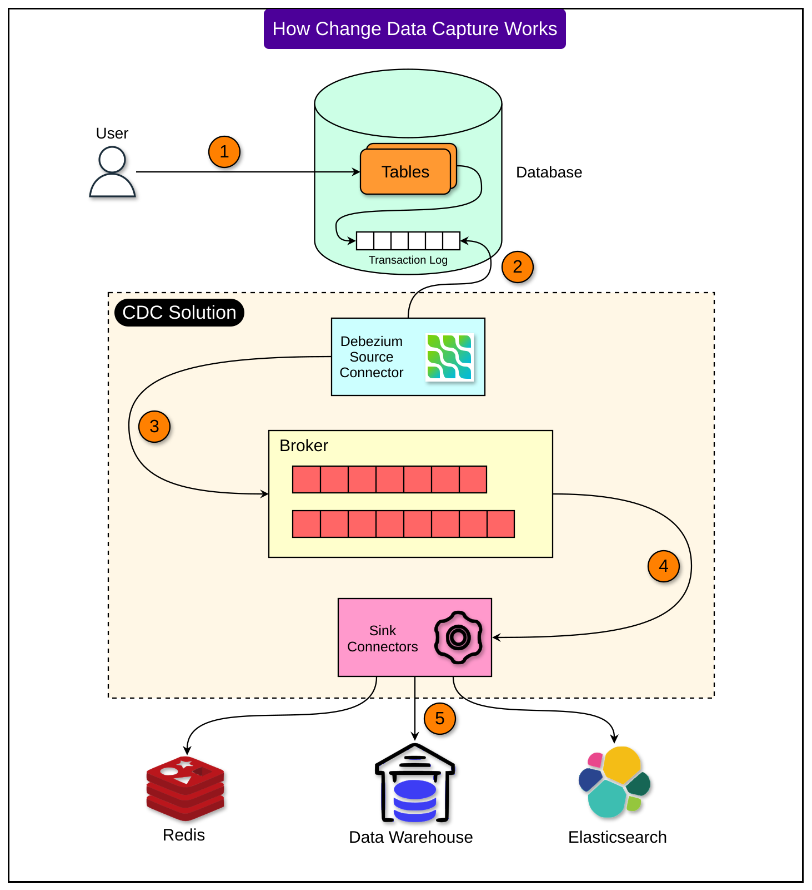
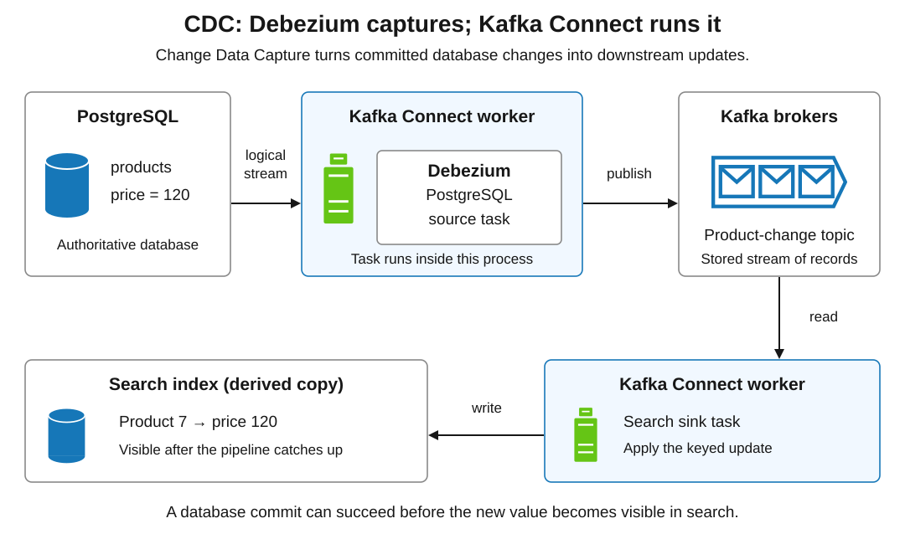
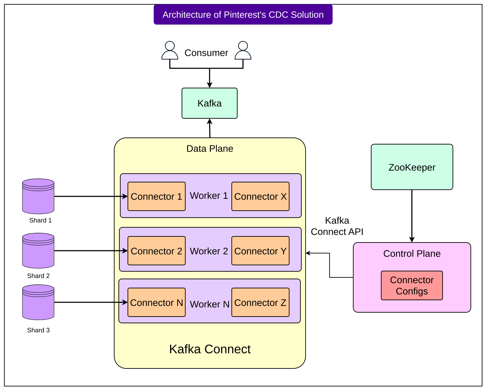
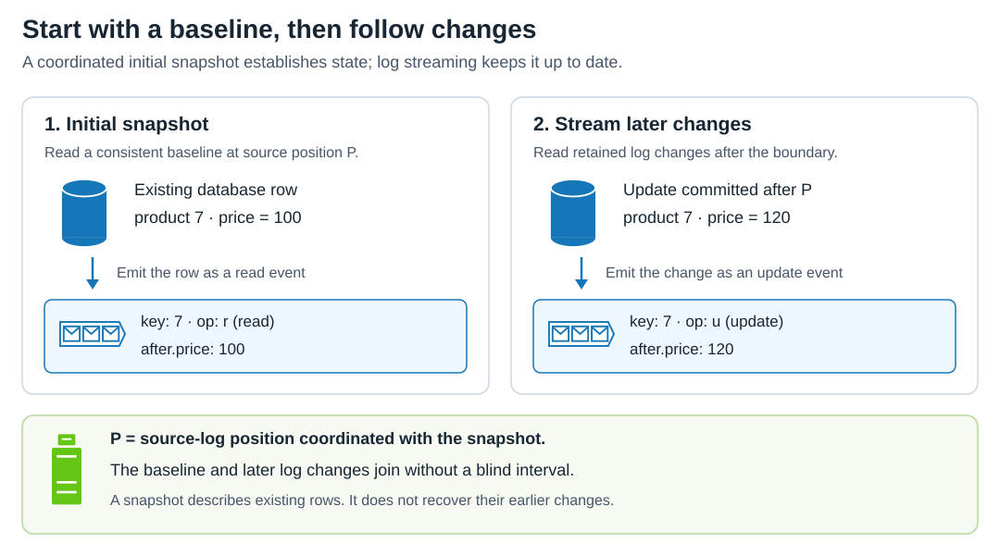
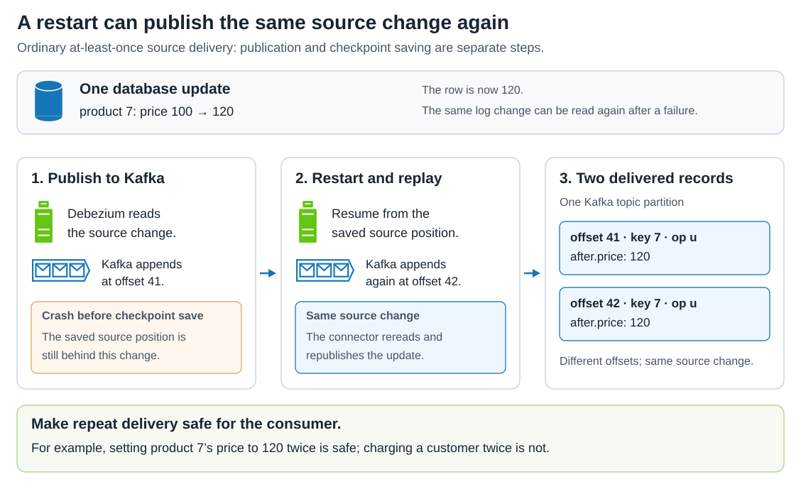

# Patterns. Change Data Capture

[Back to Distributed Systems](../Readme.md#content)

**Change Data Capture (CDC) turns database changes into events. Debezium captures those changes, Apache Kafka Connect runs its connectors, and Kafka stores the events for downstream consumers.**

This article uses ByteByteGo’s *How Pinterest Transfers Hundreds of Terabytes of Data With CDC* as its case study. We begin with the pipeline and component roles, then explain Pinterest’s architecture, snapshots and change events, recovery and idempotent updates, and the connection to Transactional Outbox.

## Why capture changes?

Imagine a shop whose product prices live in a database. Search, a cache, and analytics each need a copy of that data. Copying every row repeatedly becomes expensive as the database grows.

An alternative is to publish an event whenever the application changes a price. But two independent writes create a failure window: the database commit succeeds and event publication fails. Downstream systems never hear about the update.

With **log-based CDC**, a capture connector observes database changes through the database’s log. Our running example uses PostgreSQL: its [**write-ahead log (WAL)**](../Write-ahead%20log%20%28WAL%29/Readme.md) records changes for recovery, and **logical decoding** exposes row changes through a logical replication stream that Debezium reads. This is the database’s “Transaction Log” in the overview picture below.

The application writes its change only to PostgreSQL; CDC derives the event from the database’s own log, so a connector outage delays delivery without losing that change, provided the connector can still resume from the retained WAL.

Delivery is asynchronous. A successful commit can precede the update in search, so downstream copies are **eventually consistent**. CDC reduces repeated full-table copying; capturing and delivering changes still consumes resources.

## Read the pipeline from database to destinations

The numbered picture follows an application write through capture, a message broker, and sink connectors into downstream stores. Its connector-to-log arrow denotes the connector accessing the log; change information travels from the database into the connector.

A **source connector** brings records into Kafka. A **sink connector** reads Kafka records and writes them to another system. A consumer can also be an application that processes events directly, without a sink connector.

The picture’s “CDC Solution” outline groups several cooperating components. It does not mean they all run in one process. Nor are Redis, a warehouse, and Elasticsearch mandatory destinations: they illustrate different uses of the same captured changes.

## CDC, Debezium, Kafka Connect, and Kafka

| Component | Its responsibility | What it does not imply |
|---|---|---|
| CDC | The pattern of detecting and exposing database changes | A particular broker or product |
| Debezium | Database-specific capture connectors and change-event formats | That every deployment requires Kafka |
| Kafka Connect | A runtime that runs source and sink connectors | That every connector performs log-based CDC |
| Kafka | Stores records in named streams called **topics** | That a destination has already applied a record |

A **worker** is a Kafka Connect process. A connector defines a data integration, and its **tasks** perform the data movement. Kafka’s **brokers** are separate processes that store and serve records.

A topic is divided into **partitions**, each an ordered log whose records have numbered positions called **Kafka offsets**. Our examples use product ID `7` as the record’s **key**. With Kafka’s default key-based routing, the producer hashes that key to select a partition. The same key maps to the same partition while the partition count and routing settings remain unchanged. Records within that partition have a definite append order; their key alone does not establish the order of database changes.

Follow the top row left to right, then downward and back left. Debezium is inside the source worker; Kafka is outside it. This teaching example uses PostgreSQL as the source.

Distributed Connect workers share a group. A **rebalance** redistributes work among workers, for example after group membership changes. Saved source positions, configurations, and connector/task status records are stored in internal Kafka topics. These are separate from the application topics carrying captured rows.

Adding workers provides execution capacity and failover options, but a connector’s supported parallelism still limits how its work can be divided. `tasks.max` is an upper bound, not a promise of that many active tasks. Debezium 3.6’s PostgreSQL and MySQL connectors each use one Connect task; increasing `tasks.max` does not divide their change streams among workers. Separate connectors can capture separate shards, as in Pinterest’s design.

Debezium can also run through **Debezium Server**, a standalone application, or **Debezium Engine**, an embedded library. Pinterest uses the Kafka Connect deployment model.

## Pinterest: separate connector management from capture

A **shard** is a portion of a larger database. Pinterest reported databases with roughly 10,000 shards and built a shared CDC platform to address problems with separate team-specific setups.

Its design separates the **control plane**, which manages connectors, from the **data plane**, which moves changes. Read the recreated architecture from the database shards on the left through Connect and Kafka. The top consumer arrow represents access to Kafka; consumers receive records from Kafka.

### Control plane: reconcile the intended configuration

Every minute, Pinterest’s control plane compares the desired connectors, derived from shard topology and configuration, with the state reported by the Kafka Connect API. It creates or updates connectors and attempts recovery when needed. ZooKeeper supplies database-topology information in this design.

That ZooKeeper box is part of the published Pinterest architecture. It is not a requirement to add ZooKeeper to a new Kafka installation: Kafka 4.x uses KRaft for Kafka metadata management.

### Data plane: execute the capture work

Connect workers run across three AWS availability zones. Each can host several Debezium connectors, with a connector assigned to a database shard. Captured records go to Kafka for consumers.

The general design lesson is to automate connector lifecycle management around the connector runtime. The control plane changes *which integrations should run*; the data plane performs *the running integrations’ work*. This distinction is useful even at a much smaller scale.

## What became difficult at scale?

ByteByteGo highlights four operational problems from Pinterest’s experience. The table below connects each problem to its response and lesson.

During a rebalance, `rebalance.timeout.ms` limits how long a worker may take to rejoin. In Kafka 4.3 it defaults to **60 seconds**. Exceeding it removes the worker from the group and causes offset commit failures. It differs from heartbeat frequency and the session timeout used to detect an unresponsive worker. Pinterest used ten minutes for its workload; this is not a universal recommendation.

A **key-value (KV) store** stores values under keys. In Pinterest’s sharded store, a **shard leader** is the active server the connector must contact for that shard; when leadership changes, the connector must find the new server. A **source position** identifies progress in the database’s change stream, rather than a position in Kafka.

| Problem | Reported response | Lesson |
|---|---|---|
| Backlogs exhausted memory | Rate limiting and starting selected CDC tasks at the latest source position | Bound work, and define the required starting state |
| Rebalances failed to settle around 3,000 connectors | Increase `rebalance.timeout.ms` | Worker coordination must have time to finish |
| KV-store leader changes caused repeated connector recreation | Let workers discover and recover shard leaders | Avoid turning source failover into cluster-wide churn |
| Duplicate task instances overloaded workers and emitted duplicate data | Apply Kafka fixes and adjust rebalance timing | Check task ownership and make consumers tolerate repeats |

Pinterest reported stable task counts and CPU around 45% after its duplicate-task fixes, compared with spikes near 99%. Its original post lists **hundreds of TB per day as a future target**, rather than a demonstrated result.

## A recent starting position is not a complete database

A stream of future changes cannot populate rows that never change again. A new search index therefore usually needs both existing rows and subsequent changes.

A **snapshot** supplies an initial view. With its default `snapshot.mode=initial`, Debezium’s PostgreSQL connector snapshots on first startup without a saved source position and then streams from the snapshot boundary. Here, `P` marks that boundary: product `7` starts at `100` and later changes to `120`.

In the diagram, `op` identifies the operation: `r` is a snapshot read of an existing row, and `u` is an update. `after` contains the row’s resulting values, so `after.price` is `100` in the snapshot event and `120` in the update. A snapshot read does not mean that a new product was created.

Starting at the latest source position, as in the backlog mitigation above, omits earlier changes. Use that approach only when future changes are sufficient or another mechanism supplies a consistent baseline.

A **logical replication slot** tracks the history a reader still needs. For PostgreSQL, **`snapshot.mode=no_data` skips snapshots; it does not force a jump to “now.”** Debezium uses a saved log sequence number (**LSN**, a WAL position) to request resumption when one is available.

With no saved source position, a new slot starts at its creation point, but a reused slot may already have advanced. PostgreSQL streams from the later of the requested LSN and the slot’s `confirmed_flush_lsn`—the position its reader has acknowledged. Reusing a slot therefore does not rewind acknowledged history. It can still have unconsumed changes waiting.

### PostgreSQL: watch retained WAL and disk space

With PostgreSQL’s default `max_slot_wal_keep_size=-1`, a slot can retain unlimited WAL. A stalled connector can therefore fill the database server’s disk. Monitor capture lag, retained WAL, and free disk space.

Setting a finite `max_slot_wal_keep_size` limits that retention, but PostgreSQL may then remove required WAL and leave the slot unusable if the reader falls too far behind. Dropping or invalidating a slot can also break continuity.

In PostgreSQL 18, `idle_replication_slot_timeout` is disabled by default (`0`). If enabled, a slot left inactive beyond that duration can be invalidated at a subsequent PostgreSQL checkpoint. A stopped connector can therefore lose its slot even without exhausting the WAL retention limit.

Inspect these columns in `pg_replication_slots`:

| Column | What to look for |
|---|---|
| `wal_status` | `lost` means the slot is unusable; `unreserved` means required WAL is at risk of removal |
| `safe_wal_size` | Bytes of additional WAL that can be written before the slot risks becoming `lost`; `NULL` for a lost slot or unlimited slot retention |
| `invalidation_reason` | Why the slot was invalidated, such as `wal_removed` or `idle_timeout`; `NULL` when not invalidated |

In Debezium 3.6, `snapshot.mode=when_needed` requests a new snapshot when the saved source position is absent or the recorded log position is unavailable. Slot or connection problems can still require repair. A fresh snapshot restores current state; it cannot recreate every lost intermediate event.

## Retries and downstream correctness

Kafka Connect stores the task’s saved source position as part of its **source offset**. This is the **checkpoint** in the replay diagram below; for PostgreSQL it includes an LSN. It differs from the [Kafka offsets introduced with partitions](#cdc-debezium-kafka-connect-and-kafka): re-publishing one database change can create another Kafka offset without making it a new source change.

**At-least-once delivery** means delivering each event one or more times: retries can produce duplicates. Recovery still depends on the required source and Kafka history remaining available.

In an ordinary at-least-once source setup, Kafka Connect tries to save source offsets periodically. `offset.flush.interval.ms` defaults to **60 seconds in Kafka 4.3**; this schedules attempts, not guaranteed successful saves. A source can publish and then crash before its source offset is saved. Recovery can publish that change again: this is **replay**. With the same key and unchanged routing, the original and replayed records enter the same partition at different Kafka offsets. Pinterest’s duplicate-task incident is another route to repeated data. Follow the single update across the three panels:

An **idempotent** destination operation leaves the same result when repeated. Replacing product `7` with `price=120` can be idempotent; repeating “increase price by 20” is not. But if the price has already reached `130`, applying a late replay of `120` would regress it. Preserve ordering or reject older versions as well as handling duplicates.

Kafka orders records within a partition. It does not provide a single order across all partitions or automatically apply a database transaction atomically in every destination. Compatible Connect source connectors can use exactly-once publication into Kafka, but that guarantee does not automatically cover external effects such as sending an email.

Raw row changes also expose storage structure. For a deliberate business event such as `OrderPlaced`, the application can write an **outbox** row in the same transaction as its business data. Debezium captures that committed row, and the Outbox Event Router transforms it into the message contract.

Continue with [Apache Kafka. Connect](../Apache%20Kafka.%20Connect/Readme.md), [Apache Kafka. Delivery and transactions](../Apache%20Kafka.%20Delivery%20and%20transactions/Readme.md), and [Patterns. Transactional Outbox](../Patterns.%20Transactional%20Outbox/Readme.md).

## Self-check

Try answering each question before expanding its answer.

1. Why does a new search index need a snapshot? Does `no_data` always start at the latest change?

   

   
Answer

   Future changes cannot supply rows that never change again. A snapshot provides the baseline. `no_data` skips it but can still resume an older saved source position, subject to the slot’s confirmed position.

   

2. How can one database update appear at Kafka offsets `41` and `42`?

   

   
Answer

   The source published the update, failed before saving its source offset, and published it again after recovery. The two Kafka positions represent repeated delivery of one source change.

   

3. Why does increasing `tasks.max` not spread this PostgreSQL connector’s stream across more workers?

   

   
Answer

   The connector uses one Connect task. Additional workers can host other connectors or take over after failure; separate shard connectors provide independent work to distribute.

   

4. What separates Pinterest’s control plane from its data plane?

   

   
Answer

   The control plane reconciles desired connector configuration with running state. Connect workers in the data plane execute the connectors that capture changes.

   

5. Which repeated update is safe: “set price to 120” or “add 20”? What if the current price is already 130?

   

   
Answer

   Repeating the assignment has the same effect; repeating the increment does not. A stale assignment can still overwrite 130 with 120, so idempotence also needs ordering or version checks.

   

6. A PostgreSQL connector stops while database writes continue. What should you monitor first?

   

   
Answer

   Capture lag, retained WAL, and database disk space. A replication slot can keep old WAL indefinitely with the default retention setting. With a finite limit, also check whether the slot has lost required history. If an idle-slot timeout is enabled, check for `idle_timeout` invalidation too.

   

# Sources

- **Selected case-study article:** ByteByteGo, [How Pinterest Transfers Hundreds of Terabytes of Data With CDC](https://blog.bytebytego.com/p/how-pinterest-transfers-hundreds) (21 October 2025). The case-study framing and two recreated figures come from this article; the prose here is an original teaching explanation supplemented by the primary sources below.
- **Primary production account:** Liang Mou and Elizabeth (Vi) Nguyen, Pinterest Engineering, [Change Data Capture at Pinterest](https://medium.com/pinterest-engineering/change-data-capture-at-pinterest-7e4c357ac527) (18 November 2024). Supports the architecture, scale, incidents, and reported improvements. Its “Next Steps” distinguishes the hundreds-of-TB/day goal from the workload already reported.
- **PNG references and figure attribution:** ByteByteGo’s [CDC overview PNG](https://substack-post-media.s3.amazonaws.com/public/images/1403ba04-2813-4a82-bc37-9c7734b70899_1462x1600.png) → `images/bytebytego-cdc-overview.svg`; [Pinterest architecture PNG](https://substack-post-media.s3.amazonaws.com/public/images/9bc613f8-de3a-4d46-956e-f3d041de632a_1600x1285.png) → `images/bytebytego-pinterest-architecture.svg`. Recreated as native SVG shapes, paths, and text, preserving the original composition. Original illustrations © ByteByteGo; logos belong to their respective owners. Attribution does not imply endorsement or an open license from the original authors.
- **Additional diagram icons:** [System Design — Notification System](../../system%20design/10.%20Notification%20System/images/improved-design.svg), reused in the component, snapshot, and replay teaching diagrams.
- **Current technical reference (not Pinterest’s deployed version):** Apache Kafka 4.3: [Connect overview](https://kafka.apache.org/43/kafka-connect/overview/), [user guide: distributed workers, internal topics, REST API, and tasks](https://kafka.apache.org/43/kafka-connect/user-guide/), [worker timeout configuration](https://kafka.apache.org/43/configuration/kafka-connect-configs/), and [upgrade notes: Kafka 4.0 and later require KRaft](https://kafka.apache.org/43/getting-started/upgrade/).
- **Current technical reference (not Pinterest’s deployed version):** Debezium 3.6: [architecture and deployment alternatives](https://debezium.io/documentation/reference/3.6/architecture.html), [capture features](https://debezium.io/documentation/reference/3.6/features.html), and [PostgreSQL connector: tasks, snapshots, event fields, and recovery](https://debezium.io/documentation/reference/3.6/connectors/postgresql.html). The [MySQL connector’s `tasks.max` definition](https://debezium.io/documentation/reference/3.6/connectors/mysql.html#mysql-property-tasks-max) also confirms its single-task model.
- PostgreSQL 18: [logical decoding and replication-slot retention](https://www.postgresql.org/docs/18/logicaldecoding-explanation.html), [WAL retention limits and slot timeouts](https://www.postgresql.org/docs/18/runtime-config-replication.html), [replication-slot state and invalidation](https://www.postgresql.org/docs/18/view-pg-replication-slots.html), and [logical replication start position](https://www.postgresql.org/docs/18/protocol-replication.html#PROTOCOL-REPLICATION-START-REPLICATION).
- [Apache Kafka — topics, partitions, and ordering](https://kafka.apache.org/43/getting-started/introduction/)
- [Apache Kafka 4.3 — producer partitioning, key routing, and ordering settings](https://kafka.apache.org/43/configuration/producer-configs/)
- [Debezium — exactly-once delivery and its caveats](https://debezium.io/documentation/reference/3.6/configuration/eos.html)
- Debezium: [Outbox Event Router](https://debezium.io/documentation/reference/3.6/transformations/outbox-event-router.html) and [Reliable Microservices Data Exchange With the Outbox Pattern](https://debezium.io/blog/2019/02/19/reliable-microservices-data-exchange-with-the-outbox-pattern/) — atomic database/outbox writes and the dual-write problem.
