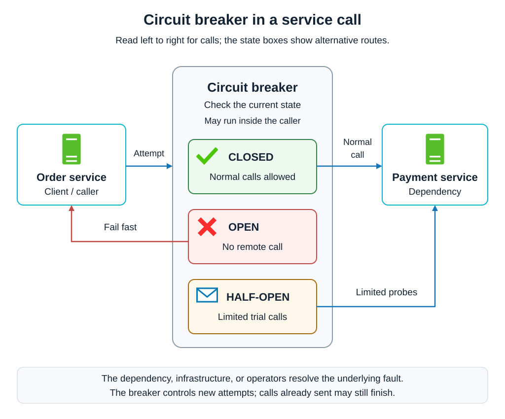
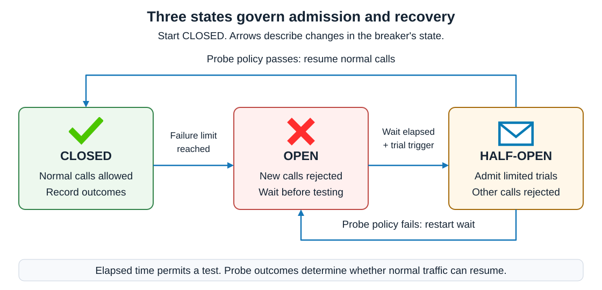
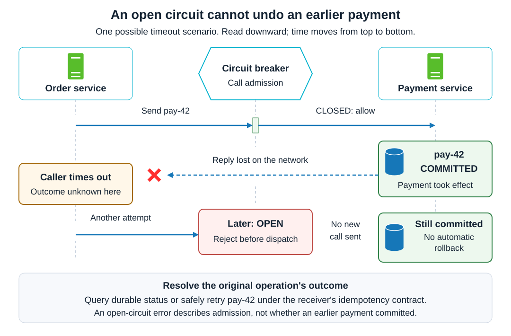

# Patterns. Circuit breaker

<sub>[Back to Distributed Systems](../Readme.md#content)</sub>

**A circuit breaker temporarily stops calls to a dependency when recent outcomes suggest that more calls are likely to fail.** It rejects new attempts quickly, then admits limited trial calls to check for recovery. This protects the caller's resources and reduces pressure on the dependency.

This article starts with cascading failures and the three breaker states, then works through failure classification and a threshold policy. It compares related reliability controls, explains retries, fallbacks, and transaction outcomes, and finishes with breaker scope, monitoring, recovery checks, and self-check questions.

## Why a failing dependency can break its caller

A **dependency** is a service or resource needed by another operation. Imagine an order service calling a payment service. If payments become slow, requests can occupy connection slots, memory, or worker threads while waiting. Enough waiting requests can exhaust the order service's resources and disrupt unrelated work. This spread of failure is a **cascading failure**.

A circuit breaker wraps the outgoing call and remembers recent outcomes. **Fail fast** means rejecting an attempt without waiting for another likely timeout. It does not mean that the payment succeeded, or that checkout can necessarily continue.

The state names come from an electrical circuit: **closed** completes the path, while **open** breaks it. An open circuit therefore blocks calls.

The diagram places the order service, acting as the client, on the left and payment on the right. Read left to right for outgoing calls; the three boxes inside the breaker show alternative routes for the current state. Closed allows normal calls, Open rejects back to the caller, and Half-open permits limited probes. Server icons identify the services; the checkmark means allow, the cross means reject, and the envelope represents a trial request. The breaker can be a library inside the caller; the center container does not require another deployed service.



## The three states

The table and state diagram describe three states of one breaker, not three services forwarding a request.

| State | What happens to an incoming attempt? | What can change the state? |
| --- | --- | --- |
| **Closed** | Allow the call and record its outcome. | A configured failure condition opens the circuit. |
| **Open** | Reject locally without invoking the dependency. | After a waiting period, allow a recovery trial. |
| **Half-open** | Admit a limited number of trial calls, also called probes. | Satisfactory results close the circuit; unsatisfactory results reopen it. |

The call-path diagram above shows what each state does. The diagram below connects those states to show when admission changes. Read the main row from left to right, then follow the return arrows for the two possible probe outcomes. The envelope again represents a trial request.



**Half-open does not mean allowing half the traffic.** It means restricted admission while checking recovery. A probe can be a real application request. Exact admission and success rules depend on the implementation.

In application code, Resilience4j signals an open-circuit rejection with `CallNotPermittedException`; it also uses that exception when half-open has exhausted its probe allowance. Polly throws `BrokenCircuitException` for an open circuit, or `IsolatedCircuitException` when an operator has manually held it open. These signals identify local admission failures rather than error responses from the dependency.

Waiting alone does not prove recovery. In Resilience4j, `automaticTransitionFromOpenToHalfOpenEnabled` defaults to `false`: a new call after `waitDurationInOpenState` triggers the transition. Setting it to `true` enables an automatic transition after that wait, without an arriving call. Moving to half-open only permits trials; it does not execute a successful probe or repair the dependency.

The dependency, its infrastructure, or its operators must resolve the underlying problem—for example, by restarting a failed component or restoring a network connection. The breaker protects resources while that external recovery happens and uses trial calls to check whether normal traffic can resume.

## What counts as evidence of failure?

Choose outcomes that indicate trouble with the protected operation. Connection errors, timeouts, and selected server errors are plausible inputs. A correctly processed “insufficient funds” response is a business rejection, not evidence that the payment service is unavailable. Do not blindly count every exception or every unsuccessful business result.

Breakers can use consecutive failures or a **sliding window**, a moving sample of recent completed calls. A count-based window covers the latest number of calls; a time-based window covers a recent duration.

For example, Resilience4j supports minimum sample sizes, failure-rate thresholds, and slow-call-rate thresholds. A slow call may still succeed. Its duration classification provides evidence for future admission decisions; a separate timeout limits how long the caller waits.

## A concrete policy to reason about

The following values define an **illustrative policy**, not production defaults or configuration for a particular library. Calls are sequential in this example, and only dependency failures count.

| Setting | Example policy |
| --- | --- |
| Observation window | Latest 10 completed calls |
| Minimum sample | 10 completed calls before evaluating the failure rate |
| Opening condition | At least 50% of the sample failed |
| Open wait | 20 seconds before trial admission becomes eligible |
| Half-open trial | One call at a time; close after two consecutive successes; reopen on one failure |
| Per-call timeout | 800 milliseconds, enforced separately |

Suppose the first ten outcomes are:

```text
S S F S F F S F S F
S = success; F = counted dependency failure
5 failures / 10 completed calls = 50% → open
```

The tenth result satisfies both the sample requirement and the failure threshold. During the open interval, further attempts are rejected locally. After 20 seconds, an arriving request can become a probe. Two successful probes close this example's circuit with a fresh observation window; a failed probe reopens it and starts a new wait.

The minimum sample prevents a single early failure from being interpreted as sufficient evidence. The tradeoff is slower detection at low traffic. Window size, threshold, wait, and probe allowance should reflect the operation's traffic and recovery behavior.

## Circuit breaker, timeout, retry, bulkhead, and rate limiter

These controls answer different questions and can be combined.

| Control | Question it answers | Example |
| --- | --- | --- |
| **Timeout** | How long will this caller wait for an attempt? | Stop waiting after 800 milliseconds. |
| **Retry** | Should a failed operation get another attempt? | Retry an eligible transient error within a fixed budget. |
| **Circuit breaker** | Should this dependency receive another attempt now? | Reject while its circuit is open. |
| **Bulkhead** | How much isolated capacity can this dependency consume? | Give payment calls a separate, bounded connection pool. |
| **Rate limiter** | How many calls may be admitted per time interval? | Allow at most 100 requests per second under the chosen policy. |

A bulkhead partitions resources so one dependency cannot consume all the capacity shared with others. It can protect the caller during the interval before enough failures have completed to trip a breaker. A breaker alone does not impose a concurrency limit: ten calls in an observation window does not mean at most ten calls can be running.

A rate limit can apply even when every request succeeds. A breaker instead reacts to observed health. Opening the breaker also does not cancel calls already admitted; their eventual effects still need handling.

## Retries and fallbacks need their own policy

Retries add work. When overload causes failures, immediate repeated attempts can make the outage worse. **Backoff** increases the delay between retries; **jitter** adds randomness so callers do not all retry together. Bound both the number of attempts and the overall time budget.

Decide what the breaker observes. Conceptually, `retry(breaker(call))` lets each retry ask the breaker for permission and records individual attempts. With `breaker(retry(call))`, it sees the whole retry operation's final outcome. These are different measurements; make the intended composition explicit. Do not immediately retry a local open-circuit rejection as though another network attempt could help.

A **fallback** is an alternative result or action when the normal operation cannot complete. Examples include showing an acceptable cached read, omitting optional recommendations, or reporting temporary unavailability. A fallback must preserve the operation's meaning: inventing a “payment successful” response is not a valid recovery strategy. Deferred work needs explicit durable storage and later processing; the breaker itself is not a queue.

## What changes in a distributed transaction?

**Opening a circuit does not roll back a remote operation or establish whether it committed.** A timeout can mean that a request never arrived, is still executing, or completed but lost its response.

For a worked transaction example, see [how a lost reply leaves the outcome unknown](../Transactions.%20Saga/Readme.md#a-timeout-means-the-outcome-is-unknown).

The diagram below shows a payment that committed before its reply was lost. Read downward: time moves from top to bottom across the order service, breaker, and payment service lanes. Database icons mark the durable payment record. Opening the breaker afterward changes the admission of later calls; the payment remains committed.



Distinguish two situations:

| Observation | What the caller can conclude |
| --- | --- |
| This attempt was rejected by the breaker before dispatch. | This attempt did not reach the protected operation. An earlier attempt may still have succeeded. |
| This attempt was sent and then timed out. | Its business outcome is unknown until resolved. |

For a mutating operation, use an **idempotency key**: a stable identifier that the receiver recognizes across retries so the same intended action does not take effect twice. The receiver needs an actual deduplication contract; attaching a header alone is insufficient. Resolve uncertainty through the service's durable status or a safe retry using the same identity.

A **[Saga](../Transactions.%20Saga/Readme.md#transactions-saga)** coordinates one business operation through independently committed local transactions. Its **compensations** are business actions that repair completed work when the operation cannot finish. A circuit breaker can protect the calls used by that workflow, but it cannot decide which actions completed or invent their compensations. Record unresolved work and let the workflow's recovery policy determine what happens next. The same caution applies to a compensation call that encounters an open circuit.

## Scope, recovery, and operational checks

Choose a breaker boundary that matches a failure boundary. Sharing one breaker across unrelated providers or shards can block healthy operations. Conversely, creating a fresh breaker for every request discards the history needed to detect repeated trouble.

In an in-process design, different application instances can have different observations and states. Resilience4j's standard registry is in memory; AWS also documents a shared-state implementation. Shared state is a design choice, not an automatic property of the pattern.

For an independent-breaker deployment, account for aggregate probes: 30 instances each admitting two probes may send 60 trial calls. This arithmetic is why a small local allowance can still overload a recovering service.

Record state changes, remote outcomes, latency, rejected calls, and fallback use. Keep local rejections distinguishable from remote failures: an open breaker can stop new remote error samples while the dependency remains unavailable.

Useful checks for a concrete implementation include sustained timeouts, ordinary business rejections, low traffic, simultaneous requests at a transition, failed probes, and successful recovery. Verify the number of calls that actually reach the dependency, not just the returned error.

Use a breaker when a dependency's sustained failures or slowness threaten the caller. It adds state and recovery behavior that require testing; AWS explicitly notes that it can delay recovery. If bounded retries and existing platform controls already contain the failure, another breaker may add little value.

## Self-check

Try answering before revealing the explanations.

1. Why does a closed circuit allow calls, and why does half-open not mean allowing half the traffic?
2. Why might Resilience4j remain open after its waiting period has elapsed, and which setting changes this behavior?
3. Under the example policy, why do five failures in nine completed calls not open the circuit, while five in ten do?
4. Which exceptions signal local circuit-breaker rejection in Resilience4j and Polly?
5. Does an observation window of ten calls limit concurrency to ten? Which control can bound the resources consumed by payment calls?
6. What can you conclude when an attempt is rejected before dispatch, compared with one that was sent and timed out? Does opening the circuit undo an earlier payment?
7. What makes retrying a payment with the same idempotency key safe? Is attaching the key enough?
8. How do `retry(breaker(call))` and `breaker(retry(call))` differ in what the breaker observes?
9. Why is returning “payment successful” an invalid fallback after an unresolved failure? What could the application do instead?
10. If 30 application instances each admit two probes, how many trial calls might reach the dependency, and why does this matter?
11. How can slow payment calls make unrelated operations in the order service fail, even if those operations do not call payment?
12. Should a correctly processed “insufficient funds” response count as evidence that the payment dependency is unavailable? Why?

<details>
<summary>Check your answers</summary>

1. A closed electrical circuit completes the path, so calls pass through. Half-open admits a limited set of trial calls to assess recovery; it does not specify a 50% traffic share.
2. With `automaticTransitionFromOpenToHalfOpenEnabled=false`, the transition needs a new call after the wait. Setting it to `true` enables the timed transition. Neither setting establishes that the dependency has recovered.
3. Nine calls do not meet the minimum sample of ten. At ten calls, five failures meet the 50% threshold, so both opening conditions are satisfied.
4. Resilience4j uses `CallNotPermittedException`. Polly uses `BrokenCircuitException`, or `IsolatedCircuitException` for a circuit held open manually. These identify attempts refused locally.
5. No. The window measures completed outcomes. A bulkhead can bound and isolate payment capacity, such as a separate connection pool; the breaker does not provide that concurrency limit.
6. A rejection before dispatch means this attempt did not reach the protected operation. A sent attempt that timed out has an unknown outcome. Earlier attempts may have committed in either case, and opening the circuit does not roll them back.
7. The receiver must recognize repeated requests as the same intended action and prevent duplicate effects under its idempotency contract. A key or header without that behavior provides no protection.
8. In the first composition, each retry passes through the breaker, which observes individual admitted attempts. In the second, the breaker observes the final outcome of the whole retry operation.
9. It claims an outcome the application has not established. Report temporary unavailability or explicitly preserve pending work for outcome resolution and recovery; defer work only with durable storage and a processing policy.
10. Up to 60 trial calls. Independent local limits add together, so recovery planning must consider aggregate traffic rather than one instance's allowance alone.
11. Waiting payment calls can occupy shared connections, memory, or worker threads until the order service exhausts resources that other operations need. This is a cascading failure. Rejecting new payment attempts quickly reduces further resource consumption while the dependency recovers.
12. No. The payment service has processed the request and returned a valid business rejection. Count outcomes that indicate dependency trouble, such as connection errors, timeouts, or selected server errors; counting ordinary business rejections can open the circuit against a healthy service.

</details>

# Sources

- [System Design — Rate Limiter architecture: server and envelope icons, with the middleware outline adapted for call admission](../../system%20design/04.%20Rate%20Limiter/images/architecture.svg)
- [System Design — Sliding-window log: admission checkmark and rejection cross icons](../../system%20design/04.%20Rate%20Limiter/images/sliding-window-log.svg)
- [System Design — Updated notification design: database cylinder icon](../../system%20design/10.%20Notification%20System/images/updated-design.svg)

- [Microsoft Azure Architecture Center — Circuit Breaker: states, recovery, failure classification, scope, and operational tradeoffs](https://learn.microsoft.com/en-us/azure/architecture/patterns/circuit-breaker)
- [Martin Fowler — Circuit Breaker: wrapper behavior, electrical analogy, trial calls, and fallback examples](https://martinfowler.com/bliki/CircuitBreaker.html)
- [AWS Prescriptive Guidance — Circuit breaker pattern: caller protection and a shared-state implementation](https://docs.aws.amazon.com/prescriptive-guidance/latest/cloud-design-patterns/circuit-breaker.html)
- [Resilience4j — CircuitBreaker: rejection exceptions, automatic half-open transition, sliding windows, thresholds, concurrency, and in-memory registry](https://resilience4j.readme.io/docs/circuitbreaker)
- [Polly — Circuit breaker resilience strategy: rejection exceptions, sampling, minimum throughput, handled outcomes, and state transitions](https://www.pollydocs.org/strategies/circuit-breaker.html)
- [Resilience4j — TimeLimiter: separate timeout and cancellation configuration](https://resilience4j.readme.io/docs/timeout)
- [Microsoft Azure Architecture Center — Bulkhead: partitioned resources and failure isolation](https://learn.microsoft.com/en-us/azure/architecture/patterns/bulkhead)
- [Resilience4j — RateLimiter: permissions per refresh period](https://resilience4j.readme.io/docs/ratelimiter)
- [AWS Builders' Library — Timeouts, retries, and backoff with jitter: load amplification, retry budgets, and circuit-breaker tradeoffs](https://aws.amazon.com/builders-library/timeouts-retries-and-backoff-with-jitter/)
- [AWS Builders' Library — Making retries safe with idempotent APIs: uncertain outcomes and stable request identity](https://aws.amazon.com/builders-library/making-retries-safe-with-idempotent-APIs/)
- [Microsoft Azure Architecture Center — Saga: local transactions and compensation](https://learn.microsoft.com/en-us/azure/architecture/patterns/saga)
- [Transactions. Saga — companion article on durable progress, compensation, and recovery](../Transactions.%20Saga/Readme.md)
