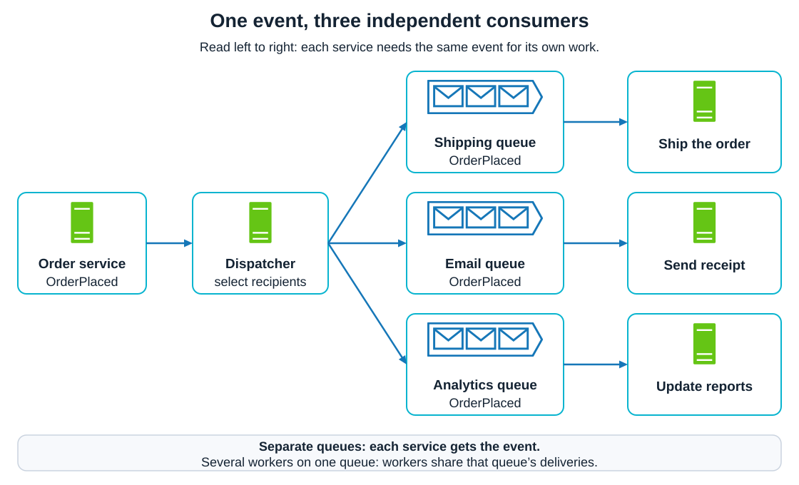
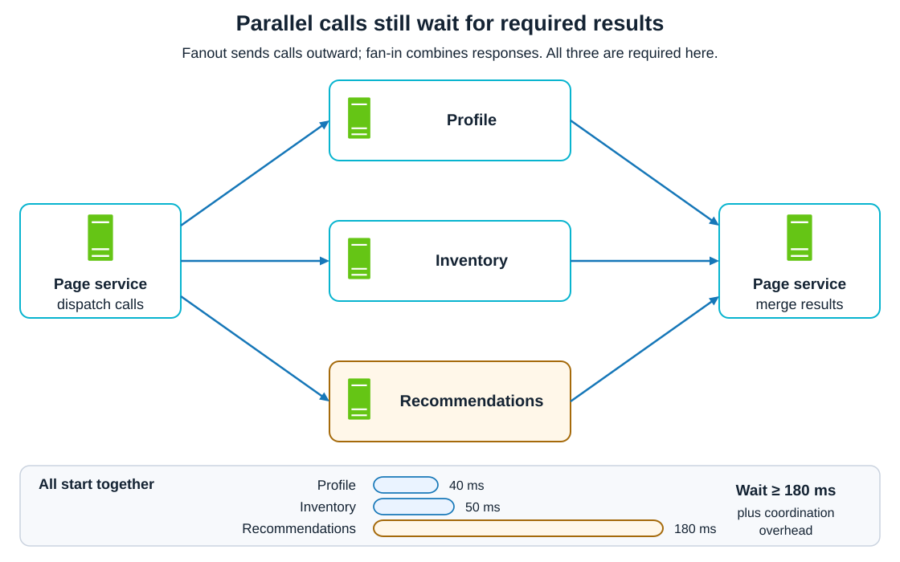
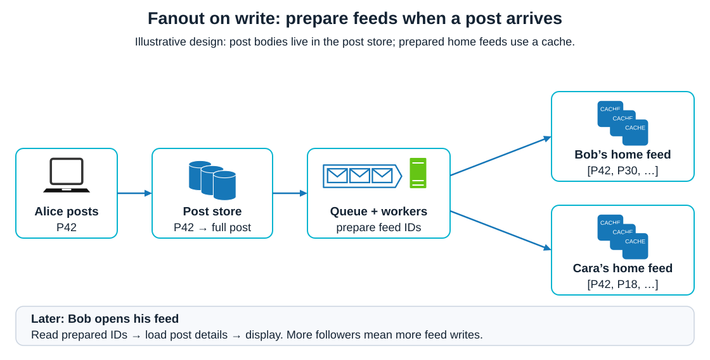
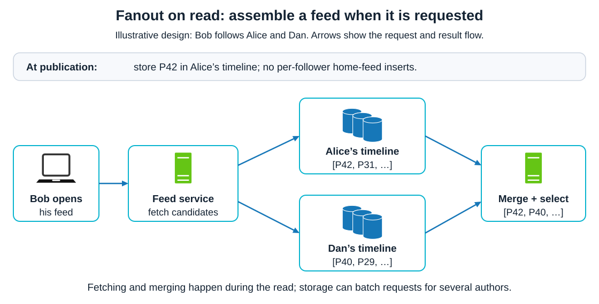
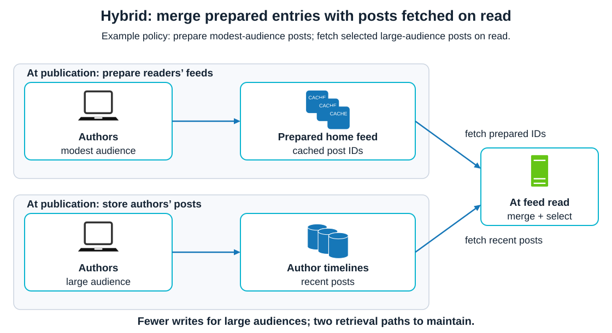

# Patterns. Fanout

<sub>[Back to Distributed Systems](../Readme.md#content)</sub>

**Fanout (fan-out) is a messaging pattern** in which one incoming event or request leads to messages or calls to multiple destinations. Concurrent dispatch can proceed without waiting for earlier responses; a subsequent **fan-in** phase may wait for the required results.

Each extra destination adds work and another opportunity for delay or failure.

This article explains message and request fanout, then compares doing feed-generation work when a post is written, when a feed is read, or at both times.

## The core model

A **producer** creates an event or request. A **dispatcher** selects destinations and sends the resulting messages or calls. A **consumer** processes a message; a **downstream service** handles a call. The dispatcher can be application code or messaging infrastructure.

In the example below, one `OrderPlaced` event goes to three separate queues. A queue holds work until a consumer can process it. Shipping, email, and analytics each need the event for a different purpose.



**Fanout and work distribution solve different problems.** With competing consumers on one queue, workers share deliveries: a delivery goes to one worker. To give each service the event, give each service its own subscription or queue. A service can then run several workers behind that queue. Redelivery after failure can still cause repeated processing.

The **fanout factor** is the number of destinations reached by one input. It describes a particular stage: three service queues here, potentially many more downstream operations inside those services. It is not necessarily the number of machines in the system.

## Message fanout: independent reactions

**Publish–subscribe (pub/sub)** separates publishers from interested subscribers. A broker—the messaging intermediary—routes events according to subscriptions. In RabbitMQ, an **exchange** is a routing component: a `fanout` exchange sends a copy to every queue connected to it by a **binding**. Other routing mechanisms can select subscribers by topic or message content.

With asynchronous fanout, the producer can finish publishing before consumers finish their work. Shipping can proceed while analytics catches up. Separate queues help isolate their backlogs and let them scale independently, although shared broker capacity remains a dependency.

**Accepted by the broker does not mean processed by every consumer.** Persistence, acknowledgements, retries, and retention determine what happens during failures. Nor does fanout alone promise ordered delivery, exactly-once effects, or simultaneous updates across services.

## Request fanout: split work and collect results

A page service might call profile, inventory, and recommendations services concurrently. The fan-in phase collects the responses into one result; this combination is often called **scatter–gather**. The calls may differ because each destination supplies different data.

The example shows three calls starting together. If all three results are required, the response must wait for the slowest branch. Times are illustrative and exclude dispatch and merge overhead.



For parallel calls that must all finish, elapsed time is approximately the **maximum branch time plus coordination overhead**. Here it is at least 180 milliseconds, compared with 270 milliseconds for the same three calls run sequentially. Parallel execution shortens the wait; it still performs all three calls.

A **tail-latency** problem occurs when occasional slow calls delay the whole response. More required branches create more opportunities to encounter one. Define a deadline and decide whether missing data causes a failed request or an explicitly partial response. Optional recommendations might be omitted; required inventory data needs a different policy.

## Feed generation: choose when to do the work

A social feed combines posts from authors a reader follows. An **author timeline** stores an author's posts. A **home feed** contains posts selected for a particular reader. A **materialized feed** is a stored result prepared before the reader asks for it.

Both strategies branch from one input to many destinations:

- **On write:** one published post produces updates to many followers' home feeds.
- **On read:** one feed request produces queries for posts from many followed authors' timelines.

In the read path, sending those queries is fanout; combining their results is fan-in.

The following designs use post identifiers (IDs) in feed entries. Each ID points to a post stored separately. Prepared home feeds are shown as caches in these diagrams. This is an illustrative design: copying a reference still requires a write, but avoids duplicating the full post body in every home feed.

## Fanout on write: prepare readers' feeds



When Alice publishes post `P42`, the system stores it and schedules updates to her followers' home feeds. Workers insert its ID into each selected feed. When Bob opens his feed later, the prepared list is already available; the system still needs to load post details and apply any remaining filtering or ranking.

This moves work to publication time and makes retrieval simpler. It costs storage and feed updates, including work for readers who never open the feed. Asynchronous updates also mean a new post may take time to appear.

**The expensive case is a very large audience.** In a simplified example, one post for 1,000 selected followers requires 1,000 feed-entry insertions. A post for 10 million selected followers requires 10 million. Batching reduces round trips, but the logical entries still need updating.

## Fanout on read: assemble the feed on demand



Publishing adds a post to its author's timeline. When Bob requests his feed, the system fetches candidate posts from authors he follows, merges them, and selects the result. Queries may be batched by **storage partition**, a portion of the dataset, so following 300 authors does not necessarily mean 300 network calls.

This avoids preparing a separate home feed for every follower, but shifts retrieval and merge work onto reads. Repeated reads may repeat work unless results are cached. The tradeoff depends on audience size, reader activity, and how much filtering or ranking happens at read time.

## Hybrid fanout: combine prepared and on-demand data



For our example, combine the two strategies. At publication, prepare home-feed entries for authors with modest audiences; for selected large-audience authors, store posts in their author timelines without preparing per-follower entries. When a reader opens the feed, fetch the prepared entries and recent posts from the selected authors' timelines. Merge both sets before displaying them. In the diagram, both left-hand lanes show publication; the arrows into the right-hand service show retrieval during a feed read.

This is a design derived from the preceding tradeoff: it limits expensive per-follower writes for large audiences while retaining prepared results for other posts. It introduces two retrieval paths and a merge. Changing an author's strategy also needs a plan for overlapping or missing entries during the transition.

There is no universal follower-count cutoff. Choose the policy using measured publishing rates, active readership, storage costs, and acceptable read latency.

| Strategy | Where the repeated work happens | Main benefit | Main cost |
|---|---|---|---|
| On write | Update selected readers' stored feeds | Prepared feed retrieval | Writes and storage grow with audience |
| On read | Fetch and combine authors' posts for each feed read | Avoid unused prepared feeds | Read-time work and latency |
| Hybrid | Prepare some entries; fetch others during reads | Balance the two costs | More retrieval and transition logic |

## Capacity: count the expanded work

For a simple model, let `R` be incoming events per second and `F` the average number of destinations per event. With one delivery per destination and no retries:

```text
downstream deliveries per second = R × F
200 events/second × 50 destinations/event = 10,000 deliveries/second
```

This counts logical deliveries, not network packets or database round trips. Payload size, batching, retries, and further fanout change the resource cost. Also inspect large individual fanouts: an average can hide a single event that creates millions of tasks.

A queue absorbs bursts but cannot make sustained excess work disappear. If arrivals keep exceeding processing capacity, the backlog and delivery delay grow. Bound concurrent work, use backpressure—slowing admission when downstream capacity is exhausted—or an explicit policy for deferring or rejecting excess work. The appropriate policy depends on whether the work may be delayed or lost.

## Failure handling: each branch needs a policy

**Retry safely.** If shipping finishes but analytics fails, track those outcomes separately. Retrying every branch wastes successful work and may repeat side effects. Limit retries and use backoff with jitter: increasing delays with randomness so retries do not all arrive together.

**Make repeated processing safe.** A consumer is **idempotent** when repeating the same operation has the same intended effect as doing it once. For the illustrative feed design, atomically enforcing uniqueness on `(reader_id, post_id)` can prevent duplicate feed entries. Other effects need their own protection.

**Preserve unfinished work.** Use durability and acknowledgement settings suited to the required failure tolerance. An acknowledgement should follow the processing that must be preserved. A **dead-letter queue** holds messages that could not be delivered or processed under the configured policy; it needs inspection and a recovery procedure.

**Observe completion, not just publication.** Monitor fanout size, per-destination failures, retries, backlog age, and end-to-end completion delay. For request fanout, trace the branches belonging to the same request. A fast publisher can coexist with consumers that are far behind.

## Self-check

Try answering before revealing the explanations.

1. Why won't three workers sharing one queue implement three independent subscriptions?
2. Why can running the same calls in parallel reduce response latency without reducing total downstream work?
3. In fanout on write and fanout on read, what is the input and what are the destinations?

<details>
<summary>Check your answers</summary>

1. Workers on one queue share its deliveries: each delivery goes to one worker. Each independent subscriber needs its own subscription or queue to receive the event.
2. The calls overlap in time, so the wait is approximately the slowest required branch plus coordination overhead. All calls still execute: three sequential calls and three parallel calls both make three downstream calls.
3. On write, one published post triggers updates to many followers' home feeds. On read, one feed request triggers queries for many followed authors' timelines; fan-in combines the returned candidates.

</details>

# Sources

- [AWS — Fan-out strategies: separate subscribers, queues, and worker scaling](https://aws.amazon.com/blogs/compute/application-integration-patterns-for-microservices-fan-out-strategies/)
- [RabbitMQ — Publish/subscribe tutorial and fanout exchanges](https://www.rabbitmq.com/tutorials/tutorial-three-python)
- [RabbitMQ — Work queues, competing consumers, and redelivery](https://www.rabbitmq.com/tutorials/tutorial-two-python)
- [AWS — Publish–subscribe: routing, consistency, ordering, duplication, and dead-letter queues](https://docs.aws.amazon.com/prescriptive-guidance/latest/cloud-design-patterns/publish-subscribe.html)
- [Microsoft — Gateway aggregation, partial results, deadlines, and tracing](https://learn.microsoft.com/en-us/azure/architecture/patterns/gateway-aggregation)
- [LinkedIn Engineering — FollowFeed: fanout on write, fanout on read, and query fanout](https://www.linkedin.com/blog/engineering/feed/followfeed-linkedin-s-feed-made-faster-and-smarter)
- [LinkedIn Engineering — FishDB: scatter–gather, tail latency, and feed retrieval](https://www.linkedin.com/blog/engineering/infrastructure/fishdb-a-generic-retrieval-engine-for-scaling-linkedins-feed)
- [AWS Builders' Library — Avoiding insurmountable queue backlogs](https://d1.awsstatic.com/builderslibrary/pdfs/avoiding-insurmountable-queue-backlogs.pdf)
- [AWS Builders' Library — Timeouts, retries, and backoff with jitter](https://d1.awsstatic.com/builderslibrary/pdfs/timeouts-retries-and-backoff-with-jitter.pdf)
- [RabbitMQ — Reliability, acknowledgements, persistence, and duplicate handling](https://www.rabbitmq.com/docs/reliability)
