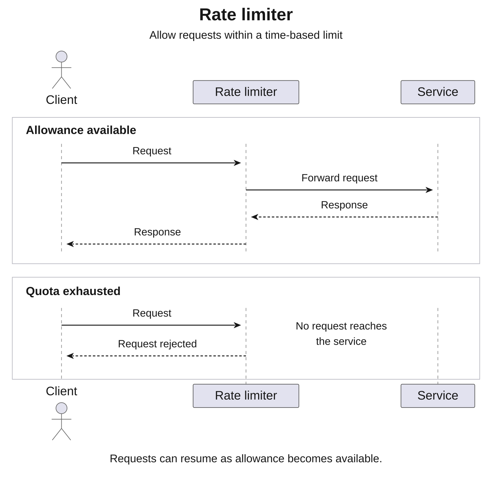
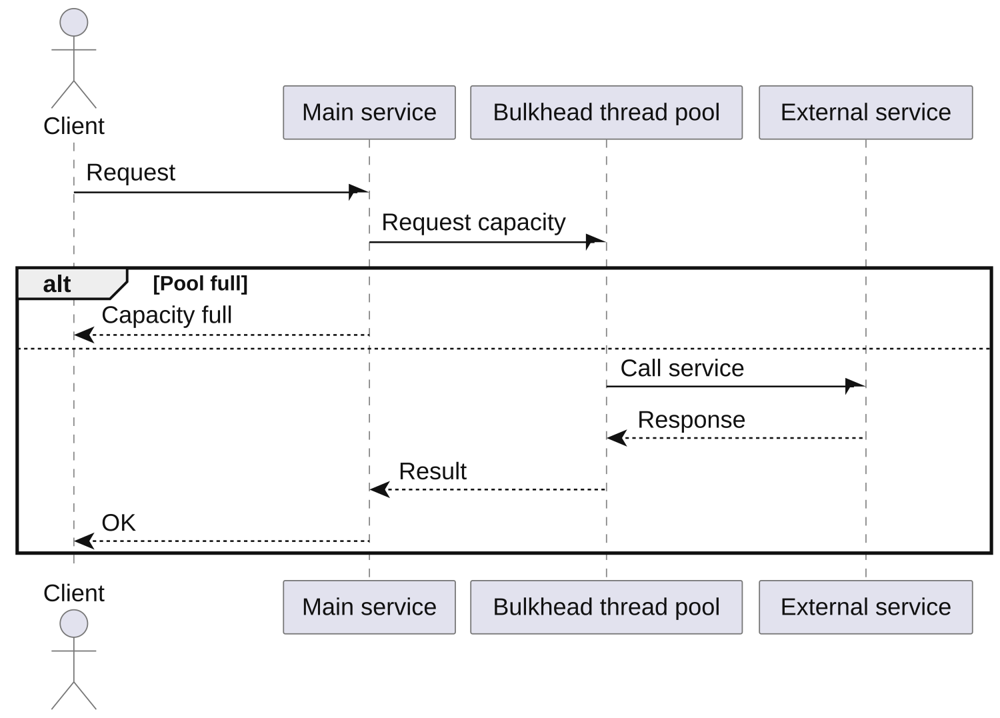
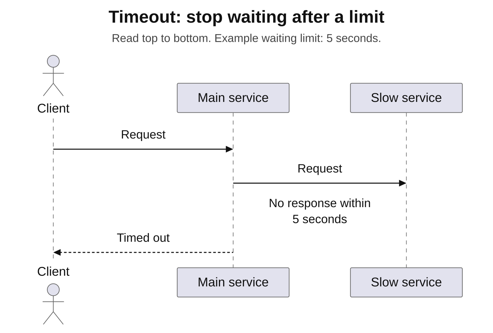
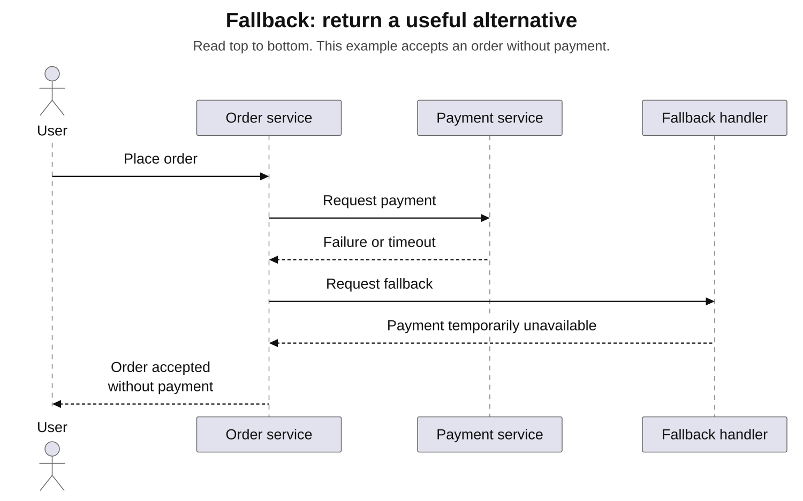
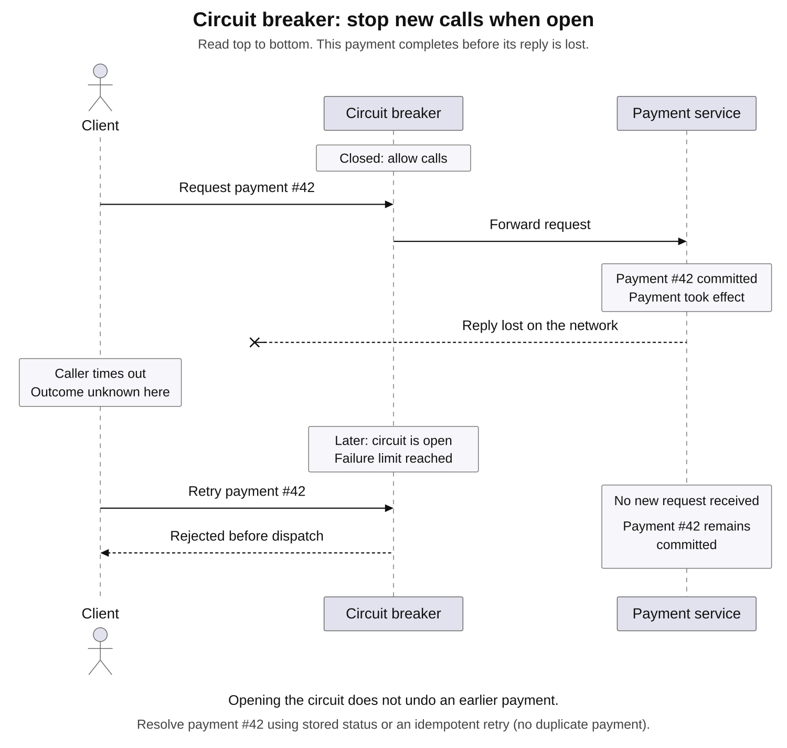

# Patterns. Protective patterns

[Back to Distributed Systems](../Readme.md#content)

1. [Introduction: why protective patterns are needed](#1-introduction-why-protective-patterns-are-needed)
2. [Rate Limiter: limiting throughput](#2-rate-limiter-limiting-throughput)
3. [Bulkhead: isolating resources](#3-bulkhead-isolating-resources)
4. [Timeout: limiting waiting time](#4-timeout-limiting-waiting-time)
5. [Fallback: providing an alternative response](#5-fallback-providing-an-alternative-response)
6. [Circuit Breaker: breaking the call chain](#6-circuit-breaker-breaking-the-call-chain)
7. [Java libraries](#7-java-libraries)

## 1. Introduction: why protective patterns are needed

In complex distributed systems built with a microservice architecture, the failure or overload of one component can cause a cascading failure throughout the system. For example, if service A depends on service B, and B starts responding very slowly or stops responding altogether, requests to A remain waiting and occupy threads until they time out.

Vinsguru describes a situation in which service D stops responding because of network delays, slowing down the services that depend on it and blocking threads all the way back to service A. Without protective mechanisms, a failure or overload in one microservice exhausts its clients' resources, such as threads and connections, and causes failures in other services. As Microsoft explains, excessive load or a service failure affects its clients: their resources can become exhausted, leaving them unable to call other services.

The main patterns are:
* Rate Limiter
* Bulkhead
* Timeout
* Fallback
* Circuit Breaker

They contain and isolate problems to protect services from cascading failures.

## 2. Rate Limiter: limiting throughput

### Why it is needed

A **Rate Limiter** protects a service from being overwhelmed by requests. A sudden flood of calls can make a service fail or slow down considerably. A rate limiter controls throughput and rejects excess requests when necessary. This prevents too many clients from hitting the same service at once and making it unavailable to everyone.

The pattern helps maintain availability: the service continues handling requests within a predefined limit, while additional requests are rejected or queued.

### What it does

A rate limiter is especially useful during traffic spikes or when dealing with aggressive clients. It protects a service by controlling **throughput**—the number of requests over a period of time.

For example, if a service can handle at most 100 requests per second, a rate limiter can enforce that rate. Additional requests receive a limit-exceeded response or wait before being processed. This helps prevent the service from failing under heavy traffic. As Vinsguru explains, limiting the number of requests that can be performed within a given time helps keep services available.

### How it works

One approach divides time into equal periods and assigns a fixed number of permissions to each period. For example, each minute may allow 100 requests. Once that allowance is exhausted, subsequent calls are rejected or wait until the next period begins.

When the limit is reached, excess requests can be rejected, queued for later processing, or handled using a combination of both approaches.

### Difference from Circuit Breaker

Rate Limiter and Circuit Breaker are sometimes confused, but they address different problems. A rate limiter protects a server from overload by controlling throughput. A circuit breaker protects a client and helps it continue operating when the target service fails or stops responding.

A rate limiter smooths peak load; a circuit breaker stops calls to a failing service.

## 3. Bulkhead: isolating resources

### Why it is needed

A **Bulkhead** isolates a failure in one component from other components. Its name comes from the watertight compartments of a ship: if the hull is damaged, only one compartment floods, allowing the ship to remain afloat.

In microservices, a bulkhead isolates resources, such as threads or connections, for different dependencies or clients. This prevents a slow or unresponsive service from occupying all of a client's threads.

For example, if client A calls services B and C in parallel and B becomes slow, most threads should remain available to handle calls to C.

The sequence diagram shows how a bulkhead limits the number of simultaneous calls to a dependent service.

### What it does

A bulkhead prevents shared resources from being exhausted. As Microsoft explains, many unsuccessful requests to one service can exhaust a client's connections or threads. The client then becomes unable to send requests to any service, including those that are still healthy.

The solution is to allocate separate resource compartments. For example, calls to each service can have their own thread pool or semaphore. If the compartment for service B is fully occupied, the resources reserved for other services remain available. This preserves part of the system's functionality during a partial failure.

### How it works

A bulkhead can use a **semaphore**, which limits the number of calls allowed to run at the same time, or a separate **fixed-size thread pool**. Both approaches limit the resources that calls to a particular component can occupy.

For example, suppose a client has 30 threads, with a bulkhead allowing only 10 of them to call service C. If C becomes very slow, only those 10 threads wait for C. The remaining 20 can continue handling requests to services A and B.

### Benefits

A bulkhead preserves part of the system's functionality when problems occur. Other services can continue responding even if one dependency becomes unresponsive. This is particularly important in systems with many interdependent services.

## 4. Timeout: limiting waiting time

### Why it is needed

A **Timeout** prevents a caller from waiting too long and helps release resources occupied by that wait. In distributed systems, any network call can become stuck because of unexpected delays or an unresponsive dependency. Without a timeout, the thread handling a request may remain blocked indefinitely, exhausting thread pools and bringing processing to a halt. As Vinsguru notes, even services operated by companies such as Google can sometimes slow down.

Consider a chain of calls: A → B → C. If C stops responding, A and B continue waiting and gradually exhaust their resources. Services need to account for slow dependencies and set time limits on network calls so that their core functionality remains responsive when a dependency is unavailable. This helps prevent critical threads from remaining blocked.

The sequence diagram shows a timeout during a call to a slow service, limiting how long the caller waits.

### What it does

A timeout places a limit on how long the caller waits for a request. When that limit is reached, the system can use a fallback or report the failure to the caller.

Without a timeout, a request to an unresponsive service can seem to last forever, blocking a thread for many seconds or minutes. A timeout helps the system respond promptly to problems instead of allowing indefinite waiting. It also bounds the waiting time involved in handling a request.

### How it works

A maximum waiting time is set for an operation. For example, if the operation has not completed within two seconds, the caller stops waiting. The timeout can then trigger a fallback or return a failure.

### Benefits

Timeouts prevent requests from holding a caller's resources indefinitely. This helps core services remain responsive when their dependencies are unavailable. During network failures and outages, a timeout allows a prompt failure response instead of leaving requests blocked without a limit.

## 5. Fallback: providing an alternative response

### Why it is needed

A **Fallback** lets a system return a meaningful result or take an alternative action when the normal operation fails. If the primary request to a service fails or is blocked by an open circuit breaker, the system can provide an alternative response—for example, by reading cached data, returning a predefined response, or calling a backup service.

Fallback improves the client's experience and the system's reliability: instead of an internal server error, the client receives a defined alternative response or an empty result.

The sequence diagram shows a failed service call followed by a fallback response.

### What it does

This pattern helps prevent an abrupt loss of functionality. It can take over after retry attempts have been exhausted or when a circuit breaker is open.

A fallback provides an alternative when a service request fails. When the circuit breaker opens, the fallback can run instead of the primary operation. It usually performs very little work and returns an alternative value.

For example, if a database is unavailable, the system can return cached data or a prepared response. The fallback itself should be highly unlikely to fail because it is being used after another part of the system has already failed.

### Characteristics

A fallback can involve another service, static data, or a response stating that the service is temporarily unavailable. It should avoid creating a substantial amount of additional work.

One option is **silent failure**: returning an empty response when the data is not essential. Another is **failing fast**: immediately returning an error when the required data is unavailable.

## 6. Circuit Breaker: breaking the call chain

### Why it is needed

A **Circuit Breaker** helps prevent cascading failures by stopping calls to a service that is failing or responding too slowly.

Imagine that service B is temporarily unavailable. If clients repeatedly try to call B, they receive errors and waste resources waiting for responses. A circuit breaker interrupts this failing connection. When it detects an increase in failures—for example, more than 50% of ten calls failing—or excessively slow responses, it opens the circuit.

While the circuit is open, new attempts fail immediately or use a fallback without sending requests to the service. This gives B time to recover and lets the client respond quickly and predictably.

### What it does

The pattern helps a system respond quickly to an unstable dependency. As Microsoft explains, a circuit breaker temporarily blocks access to a failing service after detecting failures. This prevents repeated unsuccessful attempts while the system recovers.

Instead of continually sending requests to the failing component, the circuit opens and calls fail fast. Limited trial requests later check whether the service has recovered before normal traffic resumes.

### How it works

A circuit breaker typically has three states:

- **Closed:** the circuit is complete, and calls proceed normally.
- **Open:** the circuit is broken, and new calls fail immediately.
- **Half-open:** a limited number of trial calls are allowed through to check for recovery.

Call outcomes are collected and analyzed in a **sliding window**. The window can cover the most recent number of calls or the calls made during a recent period of time.

When failures exceed the threshold, the circuit opens. Subsequent attempts are rejected immediately or handled by a fallback. After a pause, the circuit becomes half-open and admits a few new calls. If enough trial calls succeed, the circuit closes again. If failures continue, it reopens.

The sequence diagram shows an earlier payment completing before its reply is lost. Once the circuit opens, it rejects later calls without undoing that payment.

### Relationship to other patterns

Circuit Breaker can be combined with Retry and Fallback. For example, a service can be called up to three times. If all three attempts fail and the failure threshold is reached, the circuit opens and a fallback can take over.

Once the circuit is open, further attempts are stopped immediately instead of waiting for another response timeout. As Azure explains, a circuit breaker prevents repeated attempts at an operation that is likely to fail, allowing the application to continue without waiting for the underlying fault to be fixed.

## 7. Java libraries

Resilience4j and Netflix Hystrix (legacy).

# Sources

- [Proselyte — Protective patterns in microservice architecture, sections 1–6](https://proselyte.net/protective-patterns/)
- [Resilience4j — Introduction](https://resilience4j.readme.io/docs/getting-started)
- [Netflix Hystrix — Project status](https://github.com/Netflix/Hystrix#hystrix-status)
