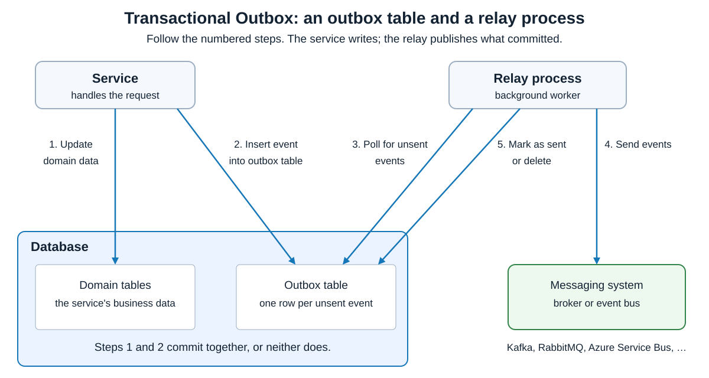
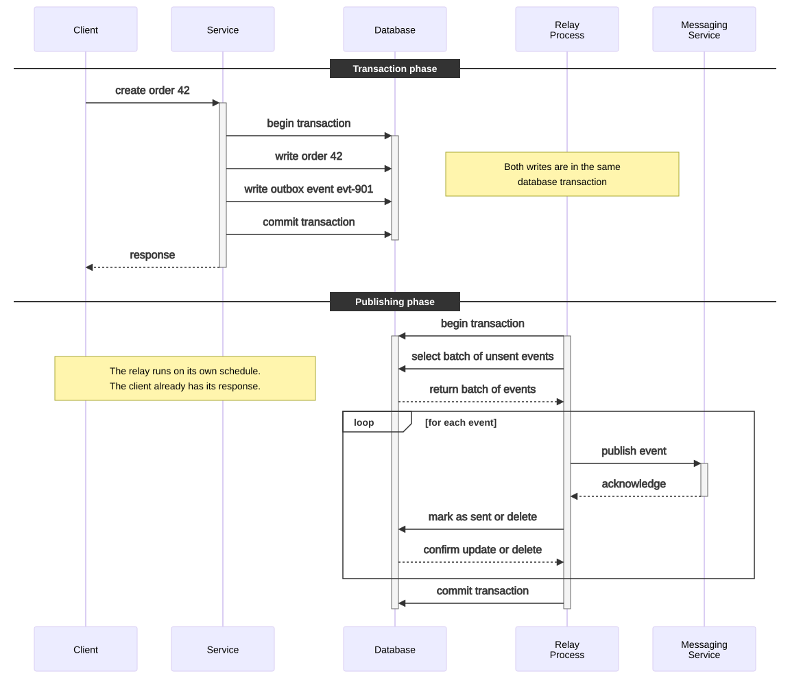
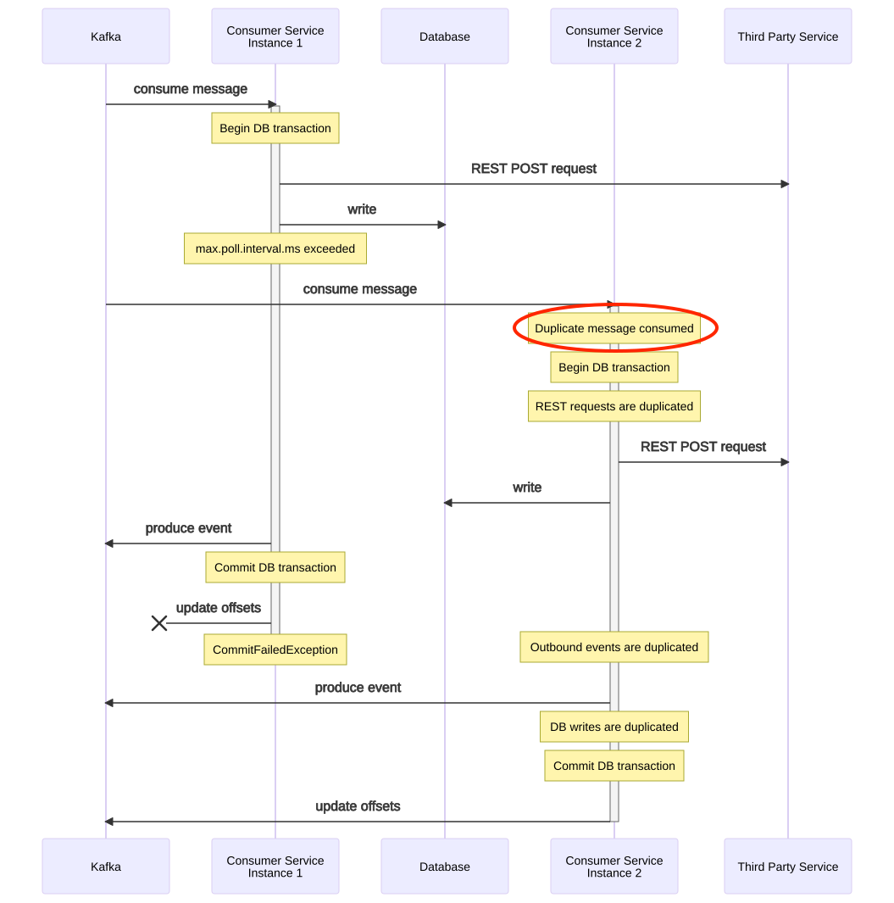
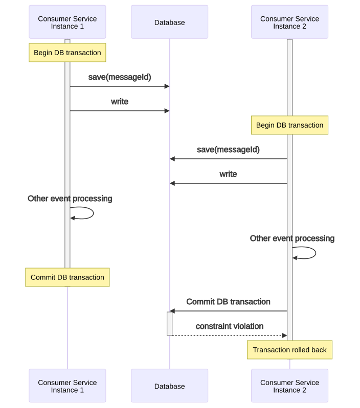
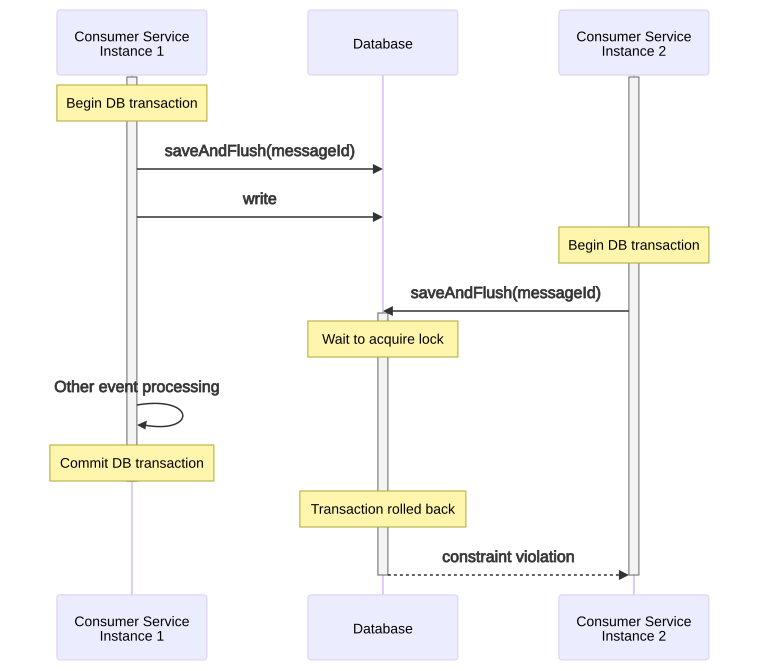
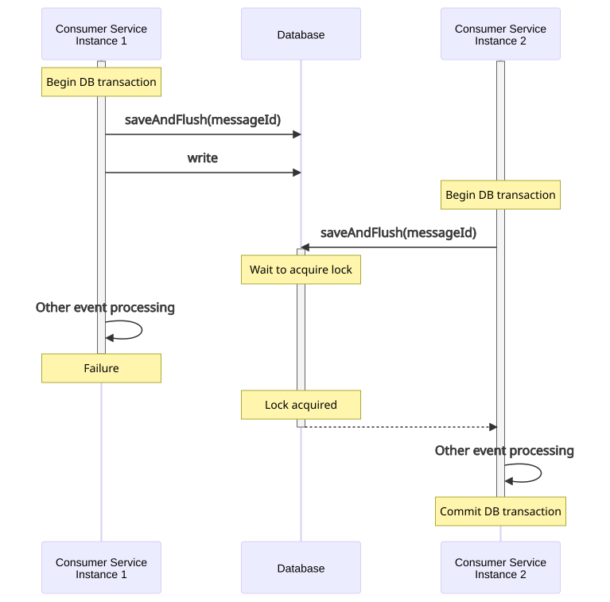
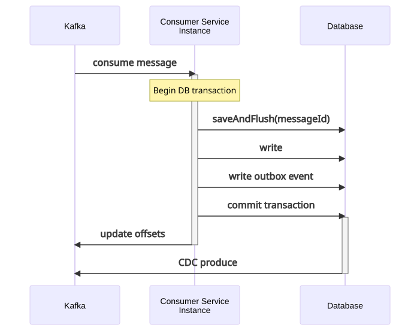
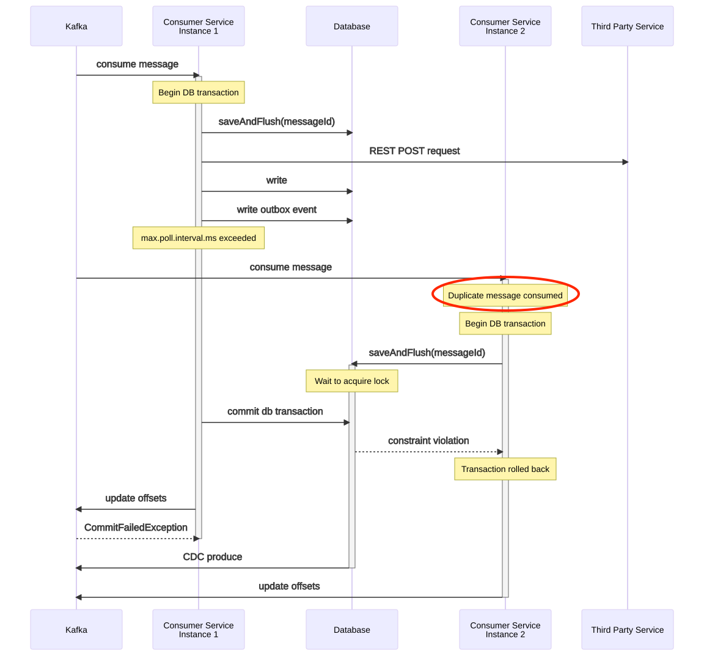

# Patterns. Transactional Outbox

<sub>[Back to Distributed Systems](../Readme.md#content)</sub>

**Transactional Outbox saves a business change and an event record in one local database transaction: both commit, or neither does.** A separate **relay** publishes committed events to a message broker such as Kafka. Publication can be retried, so consumers must still handle duplicates safely.

## How it works

Save an order, then publish `OrderCreated`: a crash between the writes leaves an order without an event. Publish first: a failed commit leaves an event without an order. Reversing the writes cannot remove this failure window.

Transactional Outbox closes that window by adding two components: an **outbox table** inside the service's own database, and a **relay process** that publishes from it.

### The outbox table holds the obligation to publish

The outbox table stores events that still need publishing. It lives in the same database as the business data, so one local transaction can write both. For example, one transaction inserts order `42` into the orders table and an outbox row with event identifier `evt-901`, order identifier `42`, type `OrderCreated`, and a **payload**—the event data. Both rows commit, or neither does, because the database applies one transaction atomically. No broker takes part in that guarantee.

The image below names the parts and numbers the five operations. Steps 1 and 2 are the service's two writes inside that single transaction; steps 3, 4, and 5 are the relay's later work. Every step arrow except step 4 crosses the `Database` panel's border, because the service and the relay both reach its tables from outside. Step 4 stays outside the panel: it carries the event from the relay to the messaging system.



No standard prescribes the outbox schema. These columns are a common starting point:

| Column | Type | Purpose |
|---|---|---|
| `id` | `INT` or `UUID` | The event's unique identifier. |
| `event_type` | string | The event's type, such as `OrderCreated`. |
| `payload` | JSON or text | The serialized event body. |
| `created_at` | timestamp | When the event was stored. |
| `sent_at` | nullable timestamp | When it was published; `NULL` marks it unsent. |

Add the columns an operation needs: `entity_id` and `entity_name` to identify the domain object, `retries`, `status`, or `error_message` for error handling, and `correlation_id` for tracing. Tooling may expect its own names — Debezium's outbox event router reads `id`, `aggregatetype`, `aggregateid`, and `payload` by default, points each at a different column on request, and carries any remaining column as a payload field or message header.

### The relay process publishes what committed

The relay process is a background worker, also called an **outbox processor** or **event dispatcher**. It reads committed outbox events and publishes them to a messaging system such as Kafka, RabbitMQ, Amazon EventBridge, or Azure Service Bus. Once the broker acknowledges an event, the relay marks its row as sent or deletes it.

The image below follows one change through the two phases its dividers name: the service's `Transaction phase`, then the relay's `Publishing phase`. Read time **from top to bottom**: the columns are participants, the vertical lines follow them through time, solid arrows are calls, dashed arrows are returns, the narrow outlined bars mark a participant that is busy, and yellow notes mark important facts. The `loop [for each event]` frame repeats for every event in the selected batch.



The two phases are separate runs, which is why the client's response does not wait for publication. The relay's transaction is not the service's transaction; it exists so that a row is marked sent only for an event the broker actually accepted.

A relay can **poll** the outbox table periodically, as the image above shows, or use **change data capture (CDC)** to read committed changes from the database log, for example with Debezium. Retries retain the **same event identifier**. A polling relay marks or removes a row only after the broker acknowledges it; a CDC relay tracks its position in the log instead.

An incoming Kafka message is not required: an ordinary request that changes database state can also create an outbox event, as the image above's `create order 42` does.

## Terminology

* A **Kafka offset** records a position in a partition, an ordered part of a topic. Updating the committed offset records how far the consumer has finished processing;
* The diagrams' `REST POST request` is a call to a third-party web service, such as a payment service. That service has its own state and transaction boundary;
* **REST** means Representational State Transfer, a web-service design style;
* **POST** is the request method used in these examples.

## Duplicate message delivery without Transactional Outbox

A consumer polls for a batch of records, processes it, and polls again. The Java Apache Kafka client bounds the gap between two polls with `max.poll.interval.ms` and caps the batch size with `max.poll.records`.

Two different mechanisms take partitions away from a consumer that stops making progress, and they act from opposite sides. The **broker** side is `session.timeout.ms`: a consumer that stops sending heartbeats for that long is considered dead, and its partitions are reassigned. The **client** side is `max.poll.interval.ms`: a consumer that still sends heartbeats but misses its poll deadline leaves the group on its own initiative, so that another consumer can take over its partitions. This section follows the second mechanism, and the difference matters later: an instance that has left the group is no longer an active member, and only active members may commit offsets.

Either way the partition moves. The first instance never recorded its offsets in the consumer offsets topic, so the replacement polls the same records again.

Read the image below from top to bottom, with the same column, arrow, and note conventions listed for the sequence diagram in [The relay process publishes what committed](#the-relay-process-publishes-what-committed). The red ellipse marks the pivotal moment: instance 2 consumes the message instance 1 is still working on. Each yellow note on instance 2's side then names an effect that now happens twice.



Without either mechanism, a consumer that really had died would keep its partitions and leave them blocked.

While the new instance processes the batch — calling other services over REST, publishing events to Kafka, writing to the database — the first instance is doing the same work. Any step that is not idempotent leaves inconsistent state across the system. The first instance cannot even record its own progress: because it left the group, its offset commit is rejected with a `CommitFailedException`, the safety mechanism that lets only active group members commit offsets. That rejection protects the offset; it does not undo the duplicated work.

## Transactional Outbox delivery guarantee

The Transactional Outbox pattern guarantees **at-least-once** delivery — not exactly-once.

This means that due to transient failures (e.g., network issues, broker timeouts, retries), consumers might receive duplicate events. If downstream processing is not prepared for this, it risks inconsistent state or triggering actions multiple times (e.g., sending duplicate emails or creating double charges).

There are two main ways to handle this:

* **Make the logic idempotent**. Design consumers so that they can safely process the same event more than once. For example, insert a record only if it is not already present.
* **Deduplicate events explicitly**. Keep a separate table (also called an inbox table) that stores the identifiers of processed events for a set retention period (an hour, six hours, or even several days, for example). Before processing an event, the consumer checks this table: if the identifier is found, the event is skipped; otherwise it is processed and the identifier is saved.

## The idempotent consumer pattern

An **idempotent consumer** may receive the same message any number of times but processes it only once. The recommended implementation is the deduplication table from the previous section, with a unique constraint on the message identifier, so that the database itself refuses a second row for the same message.

Each message carries a unique identifier assigned by the producing service, either inside the payload or as a Kafka message header. The consumer looks that identifier up before doing any work.

If the identifier is already in the table, the message is a duplicate. The consumer commits its offsets to mark the message consumed so that it is not redelivered, and does nothing else. If the identifier is absent, the consumer opens a database transaction, inserts the identifier, runs the business logic, and commits.

That lookup describes the rule, but it is not how to implement it. Two instances can both look up the same identifier, both find it absent, and both proceed. The unique constraint is what actually enforces the rule, so [Deep dive](#deep-dive) drops the separate lookup and lets the insert itself be the check.

## Deep dive

### Default flush strategy

The next diagrams use **Spring Data JPA**, a Java data-access library based on the Jakarta Persistence API, with **Hibernate**, an object-relational mapper that translates object changes into database writes. Hibernate can queue changes in memory.

A **flush** sends those pending changes to the database inside the current transaction; **commit** completes that transaction. Flushing alone does not commit it.

The flush strategy decides when the identifier insert above, and with it its uniqueness check, actually reaches the database. Spring Data's `save()` hands the change to Hibernate's persistence context, which acts as a **transactional write-behind cache**: it queues the change and flushes at the last possible moment.

That moment is usually commit, but not always. Under `AUTO`, the default flush mode, the persistence provider must make pending changes visible to a query those changes could affect, so a query issued in the same transaction can force the flush earlier. The mapping, the queries the transaction issues, and the configured flush mode together decide the timing.

Two duplicates processed in parallel can therefore both open a transaction, write the message identifier uncommitted, and run their business logic. The constraint violation surfaces only when the second one commits, and only then does its transaction roll back.

The diagram below shows that run. It drops the broker and the third-party service so that the two instances and the database stay side by side, and it assumes both instances have already consumed the same duplicated message.



This can be acceptable. The second transaction rolls back at commit and takes every other database update it contains with it, and with Transactional Outbox in place as well (below) no duplicate outgoing event is published. What rollback cannot reach is still duplicated: a REST call to an external service, or an event published outside the outbox.

Flushing at the point of save sends the row to the database immediately, though still uncommitted, and that changes the flow. The second consumer instance consumes the duplicate, starts its transaction, and attempts the same insert. It cannot acquire the row lock until the first transaction ends.

If the first transaction commits, the second one is aborted at that point. If the first rolls back, the second duplicate is free to proceed and can then succeed or roll back on its own.

**Flushing early makes the competing insert wait.**

With Spring Data JPA and Hibernate, that means calling `saveAndFlush()` instead of `save()`: it saves an entity and flushes pending changes immediately. In these diagrams, `saveAndFlush(messageId)` is shorthand for saving and flushing the processed-message record. Perform this inside the transaction that also contains the business changes.

The image below shows the ordinary immediate uniqueness-check case: the second insert waits for the first transaction's outcome. When the first commits, the waiting insert fails because that message is already recorded. Instance 2 is rejected before reaching its other business work.



This is the lookup and the insert in one step. There is no `findById` first: the insert is the check, and the constraint reports a duplicate as a `DataIntegrityViolationException`.

```java
private void deduplicate(UUID eventId) throws DuplicateEventException {
   try {
      processedEventRepository.saveAndFlush(new ProcessedEvent(eventId));
   } catch (DataIntegrityViolationException e) {
      throw new DuplicateEventException(eventId);
   }
}
```

The yellow rollback note refers to the second transaction. This is database coordination, not a separate application lock that must be acquired before every event. PostgreSQL's immediate unique-index check, for example, waits for an uncommitted conflicting insert and then checks the outcome again. A deferred constraint has different timing.

This is the **recommended** approach, because it minimizes the actions that get duplicated. Take an event that triggers a payment through a third-party bank rail service. Under the default `save()` strategy both duplicates reach the payment call and two payments go out; with `saveAndFlush()` only the first one does.

If the first consumer fails before committing its database transaction, its uncommitted row disappears. The second consumer then acquires the lock on that message identifier and processes the message itself.



Early flushing prevents both workers from passing the same uniqueness check concurrently. It does **not** make a remote payment part of the database transaction. If the first worker completes a payment and then rolls back, a retry may still repeat that payment unless the provider recognizes the same request.

### Adding the outbox table

The image below adds the outbox. The processed-message record, business update, and outgoing event record belong to one database transaction. The input offset is acknowledged after commit.

This diagram has no relay column, so the outgoing event appears to leave the `Database` itself. It does not: the `CDC produce` arrow is the relay from [How it works](#how-it-works) in its change-data-capture form, a Kafka Connect connector that reads committed changes and publishes them to the outbound topic. The database commit publishes nothing on its own.



**What is atomic is the database state and the stored publication obligation.** The input's Kafka offset and the eventual Kafka publication are outside this local transaction. If the process crashes after commit but before acknowledging the input, redelivery finds its processed-message record and skips a second business update or outbox insertion.

## Duplicate delivery with both protections

The image below revisits the timeout scenario. Instance 1 has already flushed the unique processed-message record. Instance 2 receives the repeated input and stops at its competing insert, which the `Database` lifeline marks `Wait to acquire lock`, as in the flush diagram above. After instance 1 commits, instance 2 gets the uniqueness violation and rolls back.

Only one of the two then records progress. Instance 1 exceeded `max.poll.interval.ms` and left the group, which is why the input reached instance 2 at all; the same departure means instance 1's own offset commit is now rejected with a `CommitFailedException`. Instance 2 still holds the partition, so its offset commit is the one that takes effect, and instance 1's committed outbox record supplies the outgoing event.



This sequence shows why the second worker does not perform the remote call in this particular run. It does not establish exactly-once remote effects for every crash scenario. An **idempotency key** is a stable request identifier that the remote provider uses to recognize retries; use the provider's supported contract for calls such as payments.

## Important boundaries

- **Local atomicity, eventual propagation:** downstream services catch up later. Publication needs durable storage, relay recovery, and retries. Outbox does not make a multi-service workflow one transaction; a [saga](../Transactions.%20Saga/Readme.md) coordinates its steps and recovery actions.
- **Ordering:** publish each order's events in order. Use its identifier as the Kafka key to place its events in one partition. A key cannot fix relay workers publishing out of order.
- **External effects:** [Kafka transactions](../Apache%20Kafka.%20Delivery%20and%20transactions/Readme.md#database-writes-and-service-calls) do not automatically include an external database or payment service. Each remote effect needs its own retry protection.
- **Delivery operations:** monitor unpublished work and relay failures. Retire outbox rows only when the chosen delivery mechanism can safely recover without them. Keep a recovery path for events that repeatedly fail publication or processing.

## Summary

Commit the business change and its outgoing event record together, then publish through a recoverable relay. At the receiving end, commit duplicate recognition and the business effect together. Early flushing can detect a competing database insert sooner; remote calls still need their own retry protection.

## Self-check

Try answering each question before expanding its answer.

1. Which two components does the pattern add, and why must the outbox table sit in the service's own database?

   <details>
   <summary>Answer</summary>

   An outbox table and a relay process. The table shares the database that holds the business data, so a single local transaction covers both writes and the database's own atomicity makes them commit or roll back together. A table in a separate database would reintroduce the two-system failure window the pattern removes.

   </details>

2. A polling relay opens its own transaction before selecting a batch of unsent rows. What does that transaction cover, and why is it not the service's transaction?

   <details>
   <summary>Answer</summary>

   It covers the relay's own reads and its `mark as sent or delete` updates, so a row is recorded as sent only for an event the broker acknowledged. It runs later, in a different process, after the service already answered the client, so it cannot be the transaction that wrote the event. The publication itself stays outside both transactions.

   </details>

3. Instance 1 is still processing its batch when instance 2 receives the same message. How can this happen, and which work can be duplicated?

   <details>
   <summary>Answer</summary>

   Instance 1 exceeds the permitted interval between polling calls and can lose its partition assignment. A replacement can receive unfinished input while the original worker continues application work. Without protection, both can update business data, call the third-party service, and publish an outgoing event.

   </details>

4. Under the default write-behind flush strategy, both workers call `save(messageId)`. Why can both reach other event processing before one is rejected?

   <details>
   <summary>Answer</summary>

   Saving only queues the record in Hibernate; the actual insert and its uniqueness check happen during a later flush, so both workers can pass into their other processing before either is rejected. A losing transaction's database changes roll back, but a completed remote call cannot be undone by that rollback.

   </details>

5. With `saveAndFlush()`, instance 1 has flushed its processed-message record but has not committed. What happens when instance 2 attempts the same insert and instance 1 then commits?

   <details>
   <summary>Answer</summary>

   With the immediate uniqueness check shown, instance 2 waits for instance 1's outcome. Once instance 1 commits, the conflicting record is committed and instance 2's insert fails. It rolls back and skips the duplicate before doing the other business work. A flush alone did not commit instance 1's transaction.

   </details>

6. Take that same run, but instance 1 rolls back instead of committing. Why can instance 2 proceed, and what if instance 1 had already completed a remote payment?

   <details>
   <summary>Answer</summary>

   Rollback removes instance 1's uncommitted processed-message record, so the waiting insert can succeed and instance 2 can perform the work. The remote payment is outside that database transaction. Repeating it still requires the provider's idempotency contract and the same request key.

   </details>

7. When an idempotent consumer also writes to an outbox table, which three writes commit together? What happens if the consumer crashes after that commit but before updating its Kafka offset?

   <details>
   <summary>Answer</summary>

   The processed-message record, business update, and outgoing outbox record commit in one database transaction. Redelivery recognizes the processed-message record and skips another business update or outbox insertion, then acknowledges the duplicate. The Kafka offset and the relay's eventual publication are outside the database transaction.

   </details>

8. With both protections in place, instance 2 receives the repeated input while instance 1 is still working. Why does instance 2 avoid the remote call, and what still supplies the outgoing event?

   <details>
   <summary>Answer</summary>

   Its competing insert waits until instance 1 commits, then fails the uniqueness check before reaching the remote call. Instance 1's committed outbox record supplies the outgoing event. Instance 1 cannot acknowledge the input, because it left the group at `max.poll.interval.ms` and its offset commit is rejected with a `CommitFailedException`; instance 2, still an active member, commits the offset. This particular sequence does not guarantee exactly-once remote effects under every failure.

   </details>

9. A polling relay marks or removes the row for `evt-901` only after the broker acknowledges it. What does that ordering cost, and what must the receiving consumer do about it?

   <details>
   <summary>Answer</summary>

   An event the broker already accepted can be published a second time if the relay stops before recording that acknowledgement, which is why the pattern guarantees at-least-once delivery rather than exactly-once. Retries keep the same event identifier. The consumer must record that identifier in the same transaction as its business effect, so a repeat delivery is recognized instead of applied again.

   </details>

10. The deduplication table keeps processed-event identifiers only for a set retention period. What protection does a consumer lose once an identifier ages out of that table?

   <details>
   <summary>Answer</summary>

   The check that runs before processing no longer finds the identifier, so a redelivery or a replay of that event looks like new input and the business logic runs again. Effects a rollback cannot undo, such as a payment or another REST call, are repeated with it. The stored identifier, not the message, is what carries the protection.

   </details>

11. No standard prescribes the outbox schema. Which column tells a polling relay that a row still needs publishing, and what must a table using its own column names do before Debezium's outbox event router can read it?

   <details>
   <summary>Answer</summary>

   A nullable `sent_at`, where `NULL` marks the row unsent; the relay fills it, or deletes the row, once the broker acknowledges the event. The router expects `id`, `aggregateid`, `aggregatetype`, and `payload` by default, so a table with different names must point each of those settings at its own column. Remaining columns are not lost: each can be placed in the message payload or in a message header.

   </details>

# Sources

- [NP Blog — Transactional Outbox Pattern: From Theory to Production](https://www.npiontko.pro/2025/05/19/outbox-pattern)
- [Habr (OTUS) — Russian translation of the same article](https://habr.com/ru/companies/otus/articles/967974/)
- [Lydtech — Kafka Idempotent Consumer & Transactional Outbox](https://www.lydtechconsulting.com/blog/kafka-idempotent-consumer-transactional-outbox)
- [Microservices.io — Transactional Outbox and relay failures](https://microservices.io/patterns/data/transactional-outbox.html)
- [Microservices.io — Idempotent Consumer and unique processed-message keys](https://microservices.io/patterns/communication-style/idempotent-consumer.html)
- [AWS — Transactional Outbox, polling, and saga boundaries](https://docs.aws.amazon.com/prescriptive-guidance/latest/cloud-design-patterns/transactional-outbox.html)
- [Hibernate — Flushing and delayed database writes](https://docs.hibernate.org/orm/current/userguide/html_single/#flushing)
- [Spring Data JPA — JpaRepository: flush and saveAndFlush](https://docs.spring.io/spring-data/jpa/reference/api/java/org/springframework/data/jpa/repository/JpaRepository.html)
- [PostgreSQL — Index uniqueness checks and concurrent transactions](https://www.postgresql.org/docs/18/index-unique-checks.html)
- [Debezium — Outbox Event Router: identifiers, keys, and payloads](https://debezium.io/documentation/reference/stable/transformations/outbox-event-router.html)
- [Debezium — Outbox implementation, recovery, and eventual consistency](https://debezium.io/blog/2019/02/19/reliable-microservices-data-exchange-with-the-outbox-pattern/)
- [Apache Kafka — KafkaConsumer: detecting consumer failures, poll interval, and offset commit failure](https://kafka.apache.org/43/javadoc/org/apache/kafka/clients/consumer/KafkaConsumer.html)
- [Apache Kafka — Delivery semantics and external-system boundaries](https://kafka.apache.org/43/design/design/#message-delivery-semantics)
- [Stripe — Idempotent requests](https://docs.stripe.com/api/idempotent_requests)
