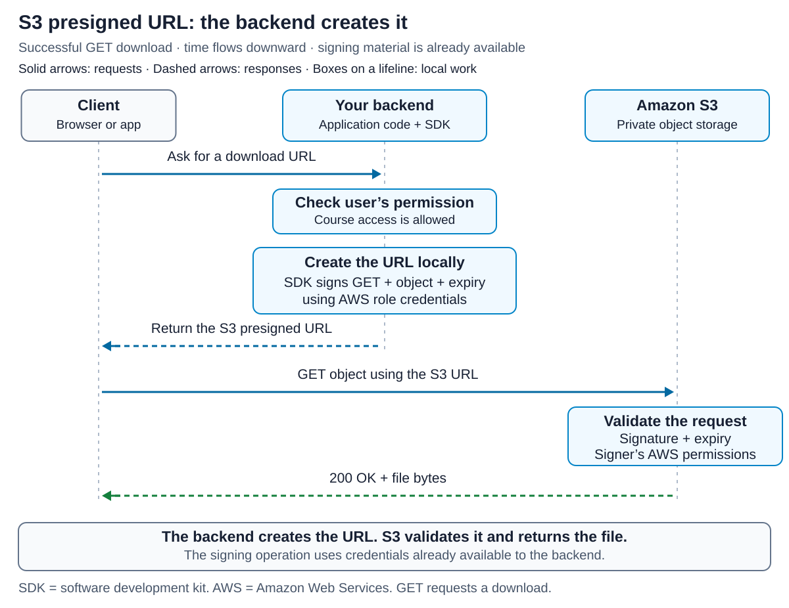
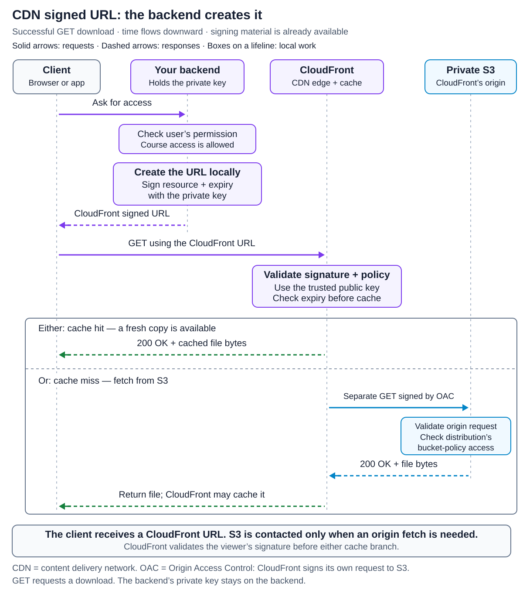
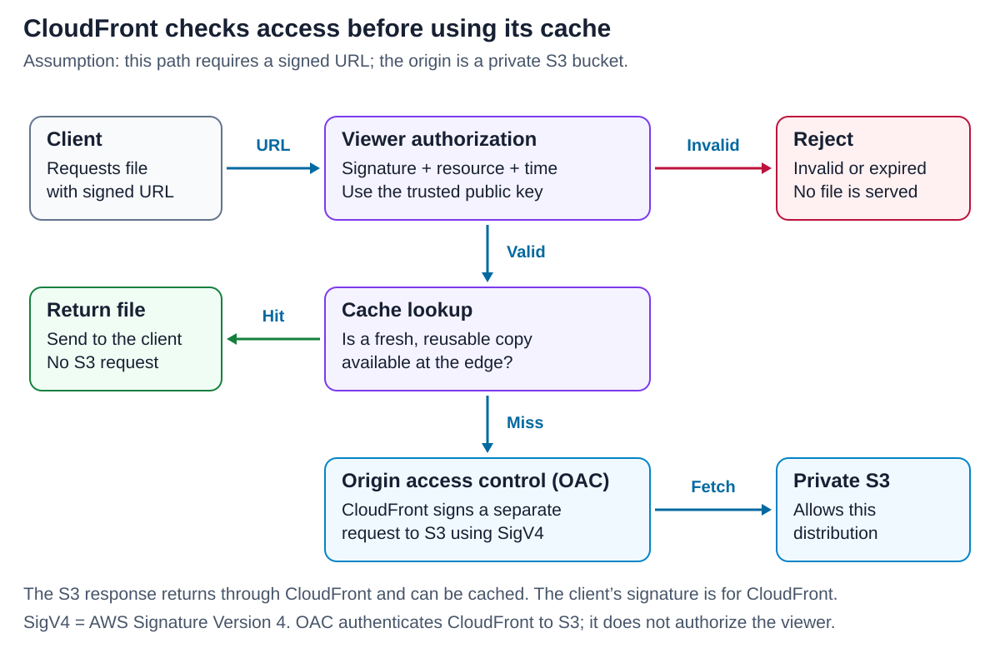
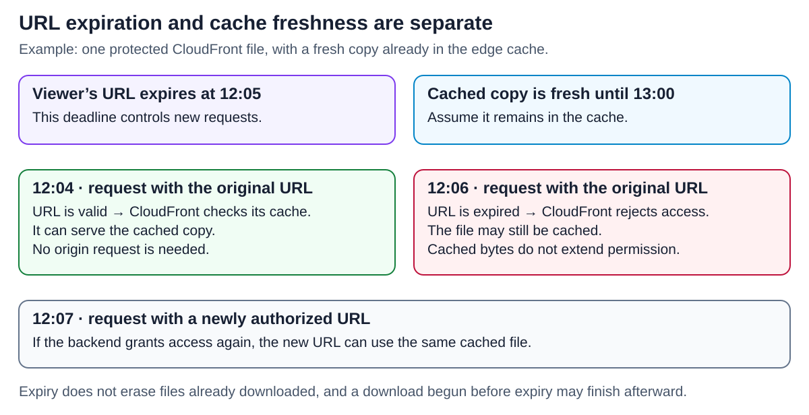

# Presigned URLs: S3 versus CDN

<sub>[Back to Distributed Systems](../Readme.md#content)</sub>

**A signed URL carries a time-limited permission to request a resource. An S3 presigned URL is validated by S3; a CDN signed URL is validated by the content delivery network before it serves the file.** Your application decides who deserves access and issues the URL. The client transfers the file through the service named in that URL, so your application need not relay the file bytes.

This article uses **Amazon CloudFront** as the concrete CDN example. Other CDNs have their own signing formats and rules. We will compare the two trust models, explain private S3 access behind CloudFront, and separate access expiration from cache freshness. Then we will examine reuse and revocation, choose upload and download designs, diagnose common failures, and test understanding with a self-check.

## The problem: private files without relaying every byte

Imagine a course website. An instructor uploads a video; a paying student watches it. The application knows who the instructor and student are, but the storage service does not understand the website's login session or purchase records. The course website, resource names, and times below are illustrative teaching examples, not a production deployment.

A signed URL bridges that gap. The backend checks the user's permission, chooses the resource and restrictions, and returns a URL that the receiving service can verify. For a video upload, that can avoid sending the entire file through an application server just to forward it to storage.

Some vocabulary makes the distinction clearer:

- **S3**, Amazon Simple Storage Service, is part of Amazon Web Services (**AWS**). It stores objects in buckets. An **object key** is the object's name within a bucket, such as `courses/42/intro.mp4`.
- A **CDN** distributes content through servers called **edge locations**. Its **origin** is the service from which it obtains content, such as S3. The **viewer** is the client requesting the file.
- A CloudFront **distribution** is the configuration connecting viewer-facing domains, caching rules, and origins.
- An AWS **principal** is the identity behind a request, such as the backend's AWS role. Its permissions determine which actions it may perform.
- **Origin Access Control (OAC)** lets CloudFront sign requests to a private origin. An S3 **bucket policy** defines access rules for that bucket. Together, they can allow CloudFront to read private files from S3.
- A **signature** lets the receiver verify signed information and its authorized signer. It does not hide the URL's contents; use HTTPS for transport encryption.
- A **bearer token** grants access to whoever presents it and meets its restrictions. A signed URL normally behaves this way: it is not inherently tied to the person to whom you sent it.

The two sequences show successful downloads. Read from top to bottom: the client asks the backend for access, the backend creates and returns a URL, and the client uses it to fetch the file. Each participant has a vertical dashed line, called a **lifeline**; boxes on that line show work performed there.

**S3 download.** The backend's software development kit (SDK) creates the URL locally using available AWS credentials. S3 validates the request when the client uses that URL and returns the file directly to the client.



**CloudFront download.** The backend creates the URL with its private key; CloudFront validates it with the trusted public key. The lower part shows alternatives: serve a fresh cached copy, or fetch from private S3 with a separate OAC-signed request and return the file through CloudFront.



## The comparison at a glance

| Question | S3 presigned URL | CloudFront signed URL |
|---|---|---|
| Where does the client send the request? | An S3 endpoint | A CloudFront distribution domain or its configured custom domain |
| Who signs it? | A signer using AWS credentials, commonly a backend role | A signer holding a private key whose public key CloudFront trusts |
| What is signed? | An S3 request: method, object path, query parameters, and signed headers | A policy describing the resource URL and access conditions |
| Who validates the client's signature? | S3 | CloudFront at the edge |
| What grants access to the S3 object? | The signing principal's effective AWS permissions | Separately configured origin access, such as OAC and an S3 bucket policy |
| Where can a download come from? | S3 directly | A reusable CDN cache entry, or an origin fetch through CloudFront |
| Typical use | Direct uploads; direct downloads of private objects | Restricted downloads and streaming through a CDN |
| What limits its lifetime? | Requested expiry, credential lifetime, and applicable policies | Signed policy time limits and continued trust in the signing key |

These mechanisms can serve different parts of the same application. An S3 upload URL and a CloudFront download URL can ultimately refer to the same stored object.

## An S3 presigned URL is bound to a request

**AWS Identity and Access Management (IAM)** defines which actions a principal, such as a backend role, may perform. A presigned `GET` requires the signing principal to have the relevant read permission; a presigned `PUT` requires write permission. Generating a URL does not create permissions that the signer lacks.

With **AWS Signature Version 4 (SigV4)**, the signer derives a signing key from its AWS secret access key. It signs a normalized representation of the request. S3 reconstructs the expected signature and evaluates the request's permissions when the URL is used.

The signed method matters. A URL made for `PUT` is not also a `GET` permission. The object key, host, query parameters other than the signature itself, and headers listed in `X-Amz-SignedHeaders` participate in that signature. For example, if `Content-Type` was included in the signed headers, the upload must send that signed value.

This schematic URL is deliberately incomplete and nonfunctional; the line breaks and placeholders are for teaching:

```text
https://course-files.s3.us-east-1.amazonaws.com/courses/42/intro.mp4
?X-Amz-Algorithm=AWS4-HMAC-SHA256
&X-Amz-Credential=<access-key-id-and-encoded-scope>
&X-Amz-Date=<signing-time>
&X-Amz-Expires=300
&X-Amz-SignedHeaders=host
&X-Amz-Security-Token=<temporary-session-token>
&X-Amz-Signature=<signature>
```

`300` requests five minutes of validity. The credential scope identifies the date, region, and service. Temporary session credentials also require the session token. The secret access key is not placed in the URL. The HTTP method is part of the signed request even though it is not shown as a separate query parameter.

**Presigning computes a signature; it does not reserve a successful operation.** With credentials already available, an SDK can construct the URL locally. Obtaining or refreshing credentials may involve network calls. The actual S3 operation happens when the client uses the URL, and can still fail because permissions, credentials, or the object are unsuitable.

### An upload URL does not validate the file for your application

A normal presigned upload can use `UNSIGNED-PAYLOAD`, meaning its signature does not commit to the exact uploaded bytes. A signed `Content-Type: video/mp4` constrains that header; it does not prove the file is a valid video. S3 supports checksums for integrity verification, but application validation remains a separate concern.

For the course example, a sensible design is to choose a fresh upload key on the backend and validate the stored upload before making it available to students. An ordinary `PUT` to an existing key replaces the current object at that key. A fresh key avoids unintentionally targeting another upload, but does **not** make the URL single-use: the same valid upload request may be repeated.

## CloudFront signs access to a resource URL

A **cache behavior** applies a CloudFront distribution's settings to matching paths. Configure the behavior for private files to require signed URLs or signed cookies and to trust a **key group** containing your public key.

The backend retains the corresponding private key and signs an access policy. CloudFront uses the public key to verify it. This key pair is separate from the AWS credentials used to sign S3 requests. A CloudFront public key identifier is not an IAM access key identifier.

CloudFront offers two policy forms:

- A **canned policy** is the compact choice for a resource URL and expiration time. CloudFront reconstructs the policy from the URL information.
- A **custom policy** travels in the URL and can add a start time, an Internet Protocol (IP) address restriction, and a wildcard resource pattern. Narrow any wildcard to the intended files. Its `IpAddress` condition supports IPv4 addresses, not IPv6. **Do not enable IPv6 on a distribution using this condition.** If other content needs IPv6 support, AWS suggests using separate distributions.

This is an incomplete canned-policy URL for the same example file:

```text
https://media.example.com/courses/42/intro.mp4
?Expires=<expiration-as-Unix-seconds>
&Signature=<signed-policy>
&Key-Pair-Id=<trusted-public-key-id>
```

`media.example.com` must be configured for the distribution. With a custom policy, an encoded `Policy` parameter carries the conditions instead of the canned form's `Expires`. Let a supported library construct the final URL and encoding.

**The policy describes resource access; it is not S3's method-bound request signature.** CloudFront can forward uploads when HTTP methods and origin permissions are configured for them. The common pairing of S3 for uploads and CloudFront for downloads is an architecture choice, not a rule that CDNs cannot upload. A download-only design should restrict allowed methods and origin permissions accordingly.

## Private S3 behind CloudFront has two authorization checks

Viewer authorization answers, “May this request use CloudFront?” Origin authorization answers, “May CloudFront read this private S3 object?” They use different signatures and protect different connections.

The CloudFront sequence above showed the cache hit and cache miss branches for a successful download; this flowchart also shows the **Reject** path for invalid or expired requests. It assumes a protected CloudFront path and OAC configured to always sign requests to a regular S3 bucket origin.



CloudFront rejects an invalid signature or policy before serving cached content. An authorized request can use a fresh, reusable cache entry. If an origin fetch is needed, OAC signs a separate request to S3 with SigV4. An S3 bucket policy grants the CloudFront service principal the required access, scoped to the intended distribution.

Keep the origin private so that an unsigned direct S3 URL does not bypass the viewer restriction. **OAC alone does not make a CloudFront path private to viewers**; the viewer-facing cache behavior also needs its access restriction. Conversely, a CloudFront signed URL does not by itself grant CloudFront permission to read S3.

In this setup, the client receives a CloudFront URL. You do not need to give it a second S3 presigned URL for the origin fetch.

### Why changing the hostname is not enough

Replacing the S3 hostname in an S3 presigned URL with a CDN hostname does not turn it into a CloudFront signed URL. The formats and trust models differ, and S3's signature includes the host.

There is also a design consequence: **forwarding an S3 token to an origin cannot substitute for authorization before a cache hit**. If a CDN serves a cached response without asking S3, S3 cannot evaluate that viewer's current request. Use CloudFront's viewer restriction for private cached delivery.

## A five-minute URL can access a file cached for an hour

**URL expiration** limits admission of new requests. **Cache freshness**, often expressed as a time to live (TTL), controls reuse of stored responses. These are independent decisions.

In this example, the original URL expires at 12:05 and the cached copy remains fresh until 13:00. Compare the requests before and after the URL deadline:



A new authorized URL can reuse the same cached representation. The URL's expiry does not require deleting that representation. CloudFront removes its signature-related query parameters before forwarding the URL to the origin; content parameters, such as a language or image size, need an appropriate cache policy when they change the response.

Cache duration depends on CloudFront settings and response headers such as `Cache-Control`. A cache entry may also be evicted early. The diagram assumes it remains present and fresh; it does not promise an hour of residence.

Both S3 and CloudFront check URL expiration when an HTTP request arrives. A download started before expiry can continue afterward. A retry, resumed download, or later range request is a new request and needs valid authorization. Expiry cannot recall bytes already downloaded or stored by the client.

### Requested lifetime can differ from usable lifetime

For S3 SigV4 presigned URLs, SDKs and the command-line interface allow a requested lifetime of up to **seven days**. Temporary signing credentials can expire sooner. If a backend session expires in twenty minutes, asking for a one-hour URL does not make that session last an hour. Policies can also reject requests sooner, for example by limiting `s3:signatureAge`.

CloudFront signed policies do not inherit that S3 seven-day limit. Their time conditions and signing-key trust apply at the viewer layer. That remains true when the file happens to be stored in S3: the origin request is separately authorized.

## Reuse, revocation, and leaked links

**Neither mechanism inherently provides one-time access.** A URL can be reused while it satisfies the relevant checks. If the application needs a single-use invitation or download entitlement, it needs additional state and an enforcement point that checks it. A one-time application link that merely reveals a reusable signed URL does not make the underlying URL single-use.

Revocation also differs from ending a website session:

- **S3:** removing the signing principal's relevant permission or invalidating the signing credentials can stop affected requests. These actions also affect other matching requests or URLs using those credentials.
- **CloudFront:** removing a public key from the relevant trust configuration invalidates signatures relying on that trust once the change is deployed. This affects other URLs signed with that key. Simply starting to sign new URLs with another key leaves old ones usable while their key remains trusted.
- **Application logout:** in the basic designs here, it does not change an already issued URL's signature, expiry, or service-side authorization. Choose a short usable lifetime and recheck entitlement before renewal when that behavior is required.

Treat URLs as temporary credentials. Use HTTPS, restrict who receives them, and redact signatures from application logs and analytics. Signing does not stop an authorized recipient from copying a working link or downloaded file. For CloudFront, origin-side permission changes also cannot be relied on to block a fresh cache hit, because that request may never reach S3.

## Choosing a design for the course website

These are design choices for the example, rather than requirements of either service:

| Need | Suitable starting point | Reason |
|---|---|---|
| Instructor uploads a video | Short-lived S3 presigned `PUT` to a backend-selected key | File bytes go directly to storage; the backend controls the target |
| Student downloads a rarely requested private export | S3 presigned `GET` | Direct access may be sufficient without configuring CDN delivery |
| Many authorized students watch the same lesson | CloudFront signed URL with private S3 behind OAC | Viewer checks can coexist with reuse of cached content |
| A player fetches many protected video segments | CloudFront signed cookies, if the client supports them | One policy can cover a set of files without adding signing parameters to every URL |

Signed cookies carry the authorization in HTTP cookies rather than URL parameters. CloudFront still validates the signature and policy before serving content. They are useful for a group of related resources; cookie delivery and browser/client support must fit the application.

For large uploads, S3 **multipart upload** divides one object into separately uploaded parts. Each `UploadPart` request identifies the upload and part number, so a delegated design can presign those requests individually. Initiation and completion remain separate operations. A single ordinary `PutObject` URL does not establish that multipart workflow.

## When a valid-looking URL fails

Use the rejecting service and its error message to guide diagnosis. The same HTTP status can have different causes; HTTP 403 from CloudFront can reflect either viewer authorization failure or denial by the S3 origin.

Two header names help explain the partial-download error below. `Range` requests part of a file. `If-Range` makes that partial response conditional on the file still matching a supplied version identifier or modification date.

| Symptom | Check |
|---|---|
| S3: `SignatureDoesNotMatch` | Compare the actual method, endpoint, object path, query string, and signed headers with the request that was signed. Also check clock drift and proxies that modify requests. |
| S3: `ExpiredToken`, even before the URL's requested expiry | The underlying signing credentials have expired. Refresh the credentials and generate a new URL; extending the old URL's requested lifetime does not repair it. |
| S3: HTTP 403 with `AccessDenied` | Check the signing principal's current permission for the object and action, plus any explicit deny in applicable policies. |
| S3: `AccessDenied` with `HeadersNotSigned: if-range` | If `Range` is signed and the client sends `If-Range`, S3 requires `If-Range` to be signed too. Generate a new URL with that header and its value included in signing. Do not merely edit `X-Amz-SignedHeaders` in an existing URL. |
| CloudFront: HTTP 403 after query parameters were appended to a signed URL | Include the intended content query parameters before signing, then generate a new signed URL. |
| CloudFront: HTTP 403 on a protected viewer request | Check the matching cache behavior, trusted public key, signature, resource match, and policy time/IP conditions. |
| CloudFront: HTTP 403 traced to S3 during an origin fetch | Check OAC configuration and the S3 origin's permissions. A valid viewer signature cannot repair origin access. |
| A browser upload fails while a command-line request works | **Cross-Origin Resource Sharing (CORS)** rules for the website's origin, method, and request headers |

CORS governs cross-origin browser access; it does not grant S3 permissions. A permissive CORS rule cannot replace authorization, and an authorized request can still encounter a browser CORS failure.

## Self-check

Answer from memory before opening the key. Explain the cause of each result, not just which service or error name applies.

1. Who creates and who validates the client's signature for an S3 presigned URL versus a CloudFront signed URL?
2. Why must the backend check the user's entitlement before issuing either kind of URL?
3. Can an S3 presigned `PUT` URL also authorize a `GET` of the same object? Why?
4. Why does replacing an S3 hostname with a CloudFront hostname fail to convert the URL?
5. What does OAC authorize, and why does enabling it alone not restrict CloudFront viewers?
6. Why can't S3's current permission checks protect a CloudFront request served entirely from a fresh edge cache entry?
7. A URL expires at 12:05, but the file remains cached and fresh until 13:00. What happens to a request with that URL at 12:06?
8. A download begins at 12:04 and the URL expires at 12:05. Can the download finish? What if it needs a new range request at 12:06?
9. A backend requests a one-hour S3 URL using credentials that expire in twenty minutes. How long can those credentials support the URL?
10. Does logging out of the course website revoke an already issued URL in the basic designs here? What remains unchanged?
11. Does assigning a fresh S3 object key make an upload URL single-use? What can a repeated `PUT` do?
12. Does a signed `Content-Type: video/mp4` prove that the uploaded bytes form a valid video?
13. Why does starting to sign new CloudFront URLs with a new key not automatically revoke old URLs?
14. When would signed cookies be more convenient than a signed URL for every file?
15. Does one ordinary S3 `PutObject` presigned URL establish a multipart upload workflow?
16. What is the difference between S3's `SignatureDoesNotMatch`, `ExpiredToken`, and `AccessDenied` with `HeadersNotSigned: if-range`?
17. CloudFront returns HTTP 403 after the application appends a query parameter to a signed URL. What must change, and why is HTTP 403 alone insufficient to diagnose every CloudFront failure?
18. Can a CloudFront custom policy using `IpAddress` be used on a distribution with IPv6 enabled?

<details>
<summary>Check your answers</summary>

1. The backend signs the S3 request with AWS credentials, and S3 validates it. For CloudFront, the backend signs a policy with a private key, and CloudFront validates it with the corresponding trusted public key.
2. The receiving service verifies delegated permission; it does not independently check the website's purchase records or login entitlement. An unchecked signing endpoint could issue access to someone who should not receive it.
3. No. The HTTP method participates in the S3 signature. Changing `PUT` to `GET` changes the request being verified.
4. The S3 presigner includes the host in the signed request, and CloudFront expects a different signature format and trust model. A hostname replacement supplies neither a valid new S3 signature nor a CloudFront policy signature.
5. OAC authenticates CloudFront's requests to the origin, where the bucket policy grants the relevant access. Viewer restrictions belong to the CloudFront cache behavior; origin access alone does not require a viewer to present a signed URL.
6. S3 receives no request on that cache hit, so it has no opportunity to evaluate the viewer's request. CloudFront must enforce viewer authorization before serving cached bytes.
7. CloudFront rejects the expired URL. The cached file's freshness does not extend the URL's permission. A newly authorized URL could still use that cached file.
8. The existing download can finish after expiry. A new range request at 12:06 needs fresh authorization because expiry is checked per HTTP request.
9. At most twenty minutes, and applicable policies or revocation can stop access sooner. The requested URL lifetime does not extend the signing credentials.
10. No. Logout alone does not change the URL's signature, expiry, or service-side authorization. A short lifetime plus entitlement checks before renewal limits continued use.
11. No. A fresh key avoids accidentally targeting another upload, but repeated valid `PUT` requests can replace the current object at that same key.
12. No. The signature constrains the header value, not the file's validity as a video. Application validation must inspect the upload separately.
13. The old public key may still be trusted. Removing its relevant trust after deployment affects the URLs relying on it; using a new key for new signatures leaves that old trust unchanged.
14. When an authorized client needs many related files, such as video segments, and can send the cookies. A policy can cover that set without adding signing parameters to each URL.
15. No. Multipart upload needs separate initiation, part-upload, and completion operations. Presigned `UploadPart` requests must identify the upload and part number.
16. `SignatureDoesNotMatch` means the signature does not match the request being checked; compare signed inputs, clocks, and request modification. `ExpiredToken` points to expired signing credentials. `HeadersNotSigned: if-range` means a present `If-Range` also needed signing because `Range` was signed; generate a new URL with the required header included.
17. Include the intended query parameter before generating the signature. HTTP 403 identifies a denial, but the cause could instead be viewer configuration, policy validity, or S3 origin access; inspect the error and failing layer.
18. No. AWS instructs you not to enable IPv6 for that distribution. The condition supports IPv4; separate distributions can accommodate other content that needs IPv6.

</details>

# Sources

Primary sources checked on 2026-09-15. The course website, `course-files` bucket, `courses/42/intro.mp4` object key, `media.example.com` domain, schematic URLs, and 12:05/13:00 timeline are illustrative teaching examples derived from the documented rules. The four local diagrams are original teaching illustrations, not AWS architecture diagrams or production measurements.

- [AWS Prescriptive Guidance — purpose, request-time authorization, and avoiding application byte relays](https://docs.aws.amazon.com/prescriptive-guidance/latest/presigned-url-best-practices/overview.html)
- [Amazon S3 — presigned URL permissions, expiration, and signature-age restrictions](https://docs.aws.amazon.com/AmazonS3/latest/userguide/using-presigned-url.html)
- [Amazon S3 — error codes and HTTP response statuses](https://docs.aws.amazon.com/AmazonS3/latest/developerguide/ErrorResponses.html)
- [Amazon S3 — SigV4 query parameters, signed headers, and unsigned payloads](https://docs.aws.amazon.com/AmazonS3/latest/developerguide/sigv4-query-string-auth.html)
- [AWS SDK for JavaScript — constructing presigned S3 URLs](https://docs.aws.amazon.com/sdk-for-javascript/v3/developer-guide/javascript_s3_code_examples.html)
- [Amazon S3 — presigned uploads and replacement of existing objects](https://docs.aws.amazon.com/AmazonS3/latest/userguide/PresignedUrlUploadObject.html)
- [Amazon CloudFront — signed URL validation, cache processing, and request-time expiry](https://docs.aws.amazon.com/AmazonCloudFront/latest/DeveloperGuide/private-content-signed-urls.html)
- [Amazon CloudFront — HTTP 403 from viewer restrictions or an S3 origin](https://docs.aws.amazon.com/AmazonCloudFront/latest/DeveloperGuide/http-403-permission-denied.html)
- [Amazon CloudFront — public/private keys, trusted key groups, cache behaviors, and rotation](https://docs.aws.amazon.com/AmazonCloudFront/latest/DeveloperGuide/private-content-trusted-signers.html)
- [Amazon CloudFront — canned policies and URL fields](https://docs.aws.amazon.com/AmazonCloudFront/latest/DeveloperGuide/private-content-creating-signed-url-canned-policy.html)
- [Amazon CloudFront — custom policy conditions, resource wildcards, and IPv4 restrictions](https://docs.aws.amazon.com/AmazonCloudFront/latest/DeveloperGuide/private-content-creating-signed-url-custom-policy.html)
- [Amazon CloudFront — OAC and policies for private S3 origins](https://docs.aws.amazon.com/AmazonCloudFront/latest/DeveloperGuide/private-content-restricting-access-to-s3.html)
- [Amazon CloudFront — HTTP methods and multipart uploads through S3 origins](https://docs.aws.amazon.com/AmazonCloudFront/latest/DeveloperGuide/RequestAndResponseBehaviorS3Origin.html)
- [Amazon CloudFront — cache expiration, response headers, and early eviction](https://docs.aws.amazon.com/AmazonCloudFront/latest/DeveloperGuide/Expiration.html)
- [Amazon CloudFront — content query parameters and removal of signing parameters](https://docs.aws.amazon.com/AmazonCloudFront/latest/DeveloperGuide/QueryStringParameters.html)
- [AWS Prescriptive Guidance — reuse, bearer access, and revocation effects](https://docs.aws.amazon.com/prescriptive-guidance/latest/presigned-url-best-practices/faq.html)
- [AWS Prescriptive Guidance — HTTPS and redacting signatures from logs](https://docs.aws.amazon.com/prescriptive-guidance/latest/presigned-url-best-practices/logging-interactions.html)
- [Amazon CloudFront — signed cookies for multiple restricted resources](https://docs.aws.amazon.com/AmazonCloudFront/latest/DeveloperGuide/private-content-signed-cookies.html)
- [Amazon S3 — multipart upload structure](https://docs.aws.amazon.com/AmazonS3/latest/userguide/mpuoverview.html)
- [Amazon S3 — UploadPart request scope](https://docs.aws.amazon.com/AmazonS3/latest/API/API_UploadPart.html)
- [Amazon S3 — browser CORS and its relationship to access policies](https://docs.aws.amazon.com/AmazonS3/latest/userguide/cors.html)
- [HTTP Semantics, RFC 9110 — If-Range and conditional partial responses](https://httpwg.org/specs/rfc9110.html#field.if-range)
