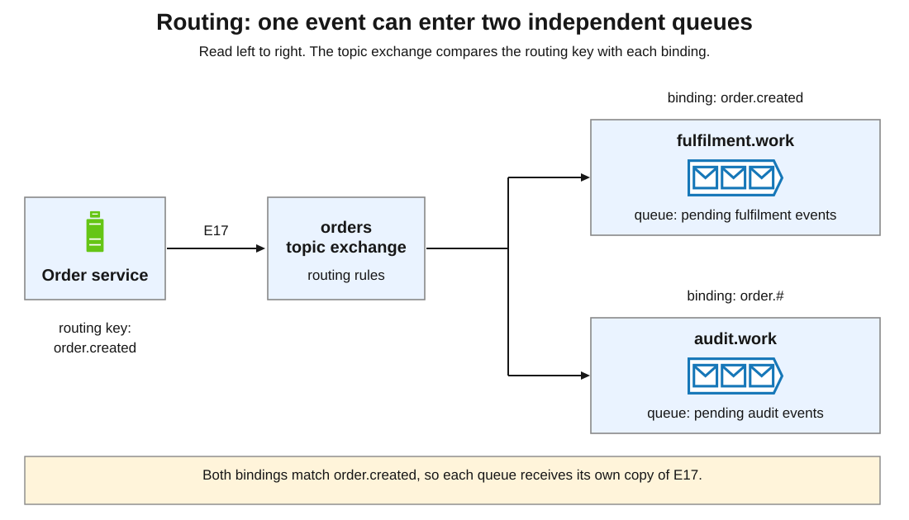
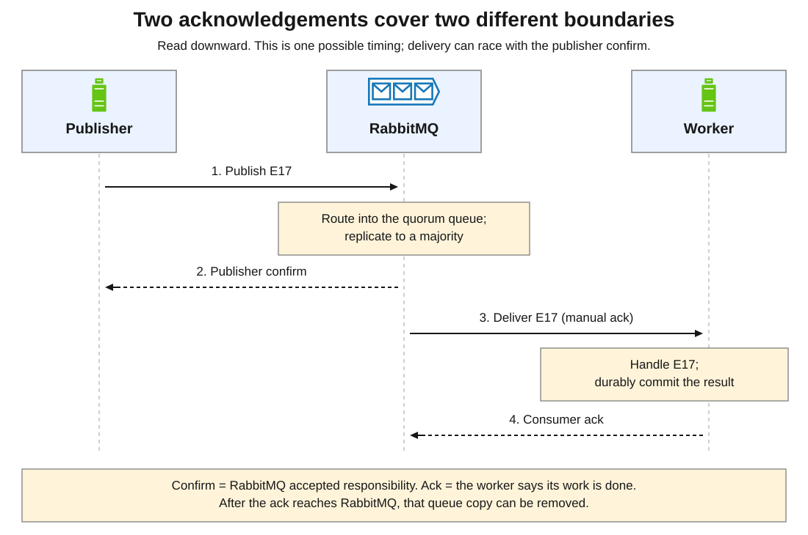
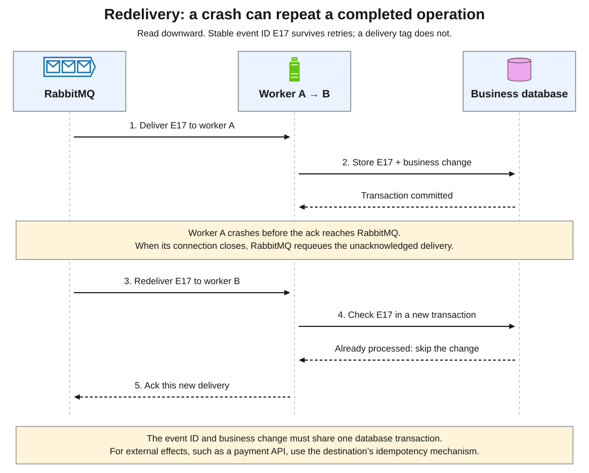
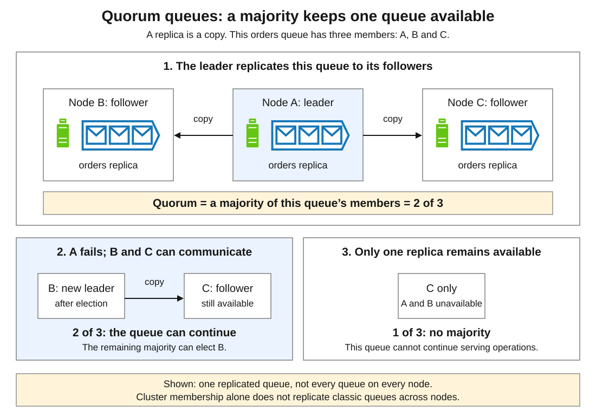
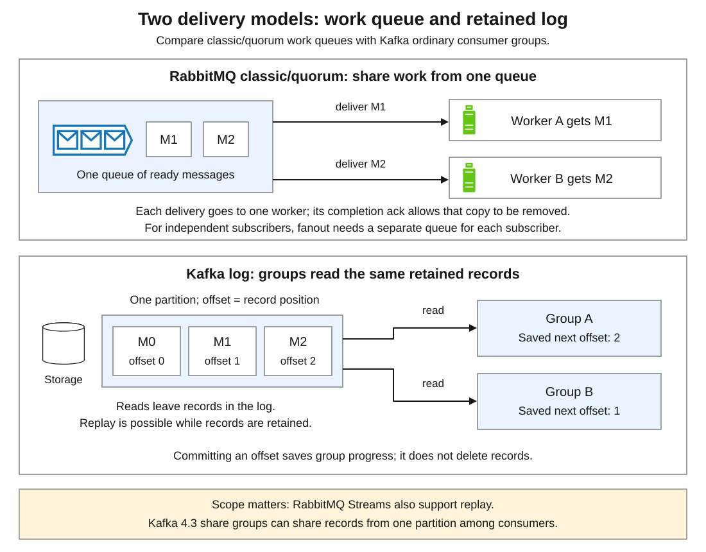

# RabbitMQ

[Back to Distributed Systems](../Readme.md#content)

**RabbitMQ is an open-source message broker that routes and holds messages for applications to process.** It separates sending work from executing it and distributes events to interested systems.

The RabbitMQ broker is developed primarily in **Erlang**; its command-line tools are written in **Elixir**.

The model is **publisher → exchange → queue → consumer**: route, hold, then process. We will follow an order event, examine failures, compare Kafka, and study production cases.

Scope: RabbitMQ **4.3**, using **AMQP 0-9-1** (Advanced Message Queuing Protocol); Kafka **4.3**. Other supported protocols have different APIs. Documentation checked on 2026-09-25; production reports are historical snapshots.

1. [Why a message broker exists](#1-why-a-message-broker-exists)
2. [The vocabulary and the model](#2-the-vocabulary-and-the-model)
3. [How exchanges route messages](#3-how-exchanges-route-messages)
4. [Publishing, delivery, and acknowledgements](#4-publishing-delivery-and-acknowledgements)
5. [Crashes, duplicates, and database transactions](#5-crashes-duplicates-and-database-transactions)
6. [Retries, load, and ordering](#6-retries-load-and-ordering)
7. [Queue types and broker failures](#7-queue-types-and-broker-failures)
8. [RabbitMQ versus Apache Kafka](#8-rabbitmq-versus-apache-kafka)
9. [Where RabbitMQ fits](#9-where-rabbitmq-fits)
10. [Real production examples](#10-real-production-examples)
11. [Check your understanding](#11-check-your-understanding)

## 1. Why a message broker exists

Checkout calling receipt, warehouse, and audit services synchronously waits for them. A slow dependency delays the customer; another reaction adds another call.

With messaging, checkout records an order and publishes `OrderCreated` for later processing. The response means **order accepted**, not fulfilment completed. The outbox (§5) keeps the database write and publication consistent.

A queue solves three related problems:

1. **Time separation:** producers and consumers need not be online simultaneously if messages are retained safely.
2. **Load buffering:** workers drain bursts at a sustainable rate.
3. **Work distribution:** workers share jobs without the producer choosing a worker machine.

Costs include delayed results, duplicates, recovery, and another service. Queues only absorb temporary overload: 500 jobs/s arriving and 300/s completing grow the backlog by 200/s.

## 2. The vocabulary and the model

| Term | Meaning in this article |
|---|---|
| **Message** | Payload and metadata: a command (`GenerateInvoice`) or fact (`OrderCreated`). |
| **Publisher / producer** | An application that sends messages to RabbitMQ. |
| **Broker / node** | A RabbitMQ server process; a cluster has cooperating nodes. |
| **Exchange** | Routes using its type and bindings; does not store the backlog. |
| **Binding** | Connects an exchange to a queue, possibly with a key or pattern. |
| **Routing key** | A publisher-supplied label such as `order.created`, used by some exchange types. |
| **Queue** | Stores pending messages; its type determines storage and recovery (§7). |
| **Quorum queue** | A queue copied across nodes. Each copy is a **replica**; a **quorum** is a majority, more than half (e.g. two of three replicas). |
| **Consumer / worker** | An application subscribed to a queue that handles deliveries. |
| **Consumer acknowledgement / ack** | The worker reports completion, allowing RabbitMQ to remove that queue’s copy. |
| **Publisher confirm** | RabbitMQ tells the publisher it accepted responsibility, independently of worker completion (§4). |

Applications keep connections open. A **channel** is a logical session within a TCP connection. Protocol operations use channels; closing a connection closes them.

Applications or tooling declare the **topology**—exchanges, queues, bindings—before publication. Queues hold messages for offline consumers, subject to retention and resource policies.

## 3. How exchanges route messages

The `orders` topic exchange receives event `E17` with routing key `order.created`. Two bindings match, so both queues get a copy.

| Type | Rule | Example |
|---|---|---|
| **Direct** | Exact key match; multiple queues can match. | `invoice` reaches queues bound with `invoice`. |
| **Fanout** | All bound queues; ignore key. | Broadcast a deployment event. |
| **Topic** | Match dot-separated words. | `order.*` matches `order.created`; `order.#` also matches `order.payment.failed`. |
| **Headers** | Match headers, not the routing key. | Match format and region. |

In topic patterns, `*` matches exactly one word and `#` matches zero or more. A RabbitMQ **topic exchange routes messages**; a Kafka **topic stores event logs**.

The **default exchange** (`""`) binds queues by name. Publishing “directly to a queue” uses it with the queue name as routing key.

**Consumers on one queue share work.** Fulfilment workers compete for its deliveries; audit needs a separate queue and binding for independent [fanout](../Patterns.%20Fanout/Readme.md).

## 4. Publishing, delivery, and acknowledgements

Two questions need answers: **“Did the broker take responsibility?”** and **“Did the worker finish?”** Time runs downward. The diagram uses a quorum queue (§7); delivery can race with the publisher confirm.

### Publisher confirms

Enable **confirm mode** on the publishing channel. For quorum queues, confirmation requires acceptance by a majority of each destination queue’s replicas. It does **not** mean a consumer processed the event.

An **unroutable message can receive a positive confirm**. With default `mandatory=false`, it is discarded unless an **alternate exchange**, a configured fallback for unroutable messages, handles it. Use `mandatory=true` and a return handler to detect no matching queue. Treat a return as failure even if confirmed. This cannot verify every intended subscriber binding.

### Consumer acknowledgements

With **manual acknowledgements**, ack only after safely recording the required result. RabbitMQ can then remove that queue’s copy; other queues’ copies are independent.

With **automatic acknowledgements**, RabbitMQ considers sending sufficient, without waiting for processing. A worker failure can lose work. Choose the mode explicitly in the client API.

A **delivery tag** identifies a delivery on one channel, not a business event. Ack on that channel: using the wrong one can raise `PRECONDITION_FAILED - unknown delivery tag` and close it.

**At-least-once delivery** means eventual delivery, possibly repeated, under the assumed recoverable failures. Use confirms, retries, durable storage, and manual acks. Expiry, rejection, retry limits, or unrecoverable loss can still remove work. Business effects are not automatically exactly once.

## 5. Crashes, duplicates, and database transactions

A worker commits a fulfilment update, then crashes before its ack reaches RabbitMQ. Those are separate operations: the broker cannot infer that the database commit succeeded.

Channel or connection closure requeues unacknowledged deliveries for another attempt. Detection takes time; an application exception alone need not close the connection or trigger retry.

An **idempotent consumer** repeats an event safely. Store a unique `(consumer_name, event_id)` with the business update in **one transaction**, preventing concurrent duplicates. Ack known duplicates without repeating the change. A separate “processed” transaction before the update risks lost work; afterward, duplicate effects.

This protects only that database. External email or payment calls need deduplication or idempotency at their destination.

Lost confirms can cause duplicate publication; reuse the event ID. **`redelivered=true`** means RabbitMQ previously delivered and requeued this message. A repeated publication is a separate broker message: its first delivery can have `redelivered=false` despite the same event ID.

### The database-to-broker gap

Saving an order before publishing risks a crash between them. Publishing first risks emitting an event for a transaction that rolls back.

The [transactional outbox](../Patterns.%20Transactional%20Outbox/Readme.md) stores order and event together. A relay publishes committed events, handles returns/confirms, and records progress. Crashes can repeat publication. Confirms alone cannot make database writes and publishes atomic.

## 6. Retries, load, and ordering

### Distinguish retryable failures from poison messages

A temporarily unavailable dependency may recover. A **poison message**, such as an invalid payload, repeatedly fails the same handler.

A **dead-letter exchange (DLX)** routes messages removed by rejection without requeue, expiry, or a delivery limit. A **dead-letter queue (DLQ)** is bound to it. Without a DLX, rejection without requeue discards work. Verify bindings too. The `x-death` header records dead-letter history; log the event ID and application error separately.

For **quorum queues in 4.3**, these returns differ:

| Return with `requeue=true` | Effect on the failed-delivery counter (`x-delivery-count`) |
|---|---|
| `basic.reject` | Increments it; counts toward `delivery-limit`. |
| `basic.nack` | Does not increment it; repeated nacks can continue indefinitely. |

The default **`delivery-limit` is 20**. Exceeding it dead-letters the message if configured; otherwise it is dropped. This counts failed deliveries, not every assignment to a consumer. Crashes and connection loss also count; consumer timeouts do not.

RabbitMQ 4.3 adds **built-in delayed retry**, recommended for avoiding rapid requeue loops. It is disabled by default. A queue policy can set `delayed-retry-type=all` and `delayed-retry-min` in milliseconds; `delayed-retry-max` optionally caps backoff. Delay slows retries but does not impose a retry budget on nacks. Classify permanent errors and bound application retries.

Default dead-letter transfer can lose messages if the target is unavailable. Source quorum queues can use `dead-letter-strategy=at-least-once` with `overflow=reject-publish`, a DLX, and the `stream_queue` feature flag enabled. Messages remain until transfer is confirmed; duplicates and resource costs remain. Assign ownership for monitoring the DLQ and republishing repaired messages.

### Limit work in progress

**Prefetch** limits unacknowledged deliveries. `basic.qos(N, global=false)` applies per new consumer: with `N=10`, delivery waits at ten unacknowledged messages. It limits in-flight work, not messages/s. Too low reduces throughput; too high can overload workers or reserve work for slow ones.

Rising `messages_ready` suggests missing consumers or arrivals outpacing processing. High `messages_unacknowledged` suggests slow/stuck handlers, missing acks, or excessive prefetch. Check completion rate, redeliveries, returns, and job age to distinguish them. Memory or disk alarms can block publishers.

### Acknowledgement timeout

In **4.3, only quorum queues** enforce this timeout: **30 minutes** by default (`consumer_timeout=1800000` ms). Checks run roughly once a minute. On timeout, AMQP 0-9-1 consumers supporting `consumer_cancel_notify` are cancelled; otherwise the channel closes with `PRECONDITION_FAILED`. Unacknowledged messages return for redelivery.

Timeout returns **do not increment the delivery counter**, so its limit cannot stop repeated timeouts. For long jobs, set a suitable queue policy `consumer-timeout` or split work into shorter durable units; do not ack unfinished work just to avoid timeout. Recover cancelled consumers or closed channels deliberately.

### Delivery order is not completion order

One channel’s publishes enter a queue in order; multiple channels interleave. Priorities and redelivery affect observed order; concurrent workers can finish later jobs first.

For sequential work per order, consistently route the order ID to one queue and process that queue serially with one active consumer. This costs parallelism and still needs careful retry handling.

## 7. Queue types and broker failures

**Durability** concerns surviving restarts; **replication** concerns keeping copies on multiple nodes. A durable classic queue does not become replicated merely because its node joins a cluster.

| Structure | Storage and consumption | Typical fit |
|---|---|---|
| **Classic queue** | One replica in 4.3; ack removes messages. Durable and temporary forms exist. | Work without replication needs, including temporary reply queues. |
| **Quorum queue** | Durable, replicated using Raft; ack removes messages. | Important work surviving a minority of replica failures. |
| **Stream** | Persistent replicated log; age/size retention removes messages, not reads. | Replay, large fanout, retained backlogs. |

For classic queues, use durable queues, persistent messages, and confirms. Quorum queues always persist messages; the persistent flag still matters if dead-lettering routes them to a classic queue. **Wait for confirms to establish acceptance.**

This diagram shows one queue with three replicas. Two are needed for a majority.

After leader failure, a majority can elect a replacement; delivery pauses meanwhile. Clients on the failed node must reconnect. One of three replicas is insufficient. Spread replicas across failure domains: three processes on one machine cannot survive its loss. See [Raft](../Raft/Readme.md).

Stream readers use **offsets**, positions in the retained log, to resume or replay. Disabling queue acknowledgements does not create a stream. **Superstreams** partition a logical stream for scale.

## 8. RabbitMQ versus Apache Kafka

Compare **RabbitMQ classic/quorum queues with Kafka ordinary consumer groups**. Kafka **partitions** are ordered logs. A **consumer group** shares partitions among its members; separate groups track independent progress. See [Apache Kafka](../Apache%20Kafka/Readme.md).

| Question | RabbitMQ classic/quorum queues | Kafka with ordinary consumer groups |
|---|---|---|
| What does completion change? | An ack allows that queue’s message copy to be removed. | An offset commit saves the group’s progress; it does not delete the record. |
| Can a new reader replay completed work? | Not acknowledged copies; keep a separate history. | Retained records, subject to retention and compaction. |
| How do workers share work? | Multiple consumers share one queue. | One member per partition at a time; surplus consumers idle. |
| How do independent applications get all events? | A queue and binding per application. | A group per application. |
| Where is routing expressed? | Exchanges and bindings select queues. | Producers choose topics/partitions, often by key. |
| How is data delivered? | Usually broker push through `basic.consume`; polling with `basic.get` also exists. | Consumers fetch records from brokers. |
| What is the ordering boundary? | Queue enqueue order, with the concurrency and redelivery limits in §6. | Partition order; no global order across partitions. |

Two other consumption models change the comparison:

1. **RabbitMQ Streams retain logs for replay**, with their own clients and retention settings.
2. **Kafka share groups acknowledge individual records and share partitions among consumers.** Queues for Kafka became production-ready in **4.2**. It suits independent records rather than strict ordering; the ordinary-group assignment row does not apply.

Neither product makes arbitrary external effects exactly once. See [Delivery and transactions](../Apache%20Kafka.%20Delivery%20and%20transactions/Readme.md#2-delivery-guarantees).

## 9. Where RabbitMQ fits

| Requirement | Why RabbitMQ can fit | What to decide explicitly |
|---|---|---|
| Generate invoices, thumbnails, or reports in the background | Workers share jobs and acknowledge completion. | Job IDs, retries, result storage, and an acknowledgement timeout suitable for job duration (§6). |
| Notify several systems about an event | Exchanges copy to independent queues. | Queue per responsibility, schema, publication consistency. |
| Route requests by service or region | Bindings replace hardcoded worker addresses. | Routing ownership and missing-binding detection. |
| Absorb spikes or downstream outages | Backlog waits for consumer recovery or scaling. | Storage limits, expiry, admission control, recovery capacity. |

For short work needing an immediate answer, a direct API may be simpler. RabbitMQ request/reply still needs deadlines and failure handling.

Amazon Simple Queue Service (**SQS**) offers a managed queue model. Amazon MQ offers managed RabbitMQ brokers when protocol compatibility matters. Their APIs and operating models differ.

## 10. Real production examples

These dated reports illustrate problems solved, not current architectures or sizing guarantees. SQS illustrates the same task-queue use case in another MQ service, not RabbitMQ behavior.

### LAIKA: account provisioning and IT automation — 2019 report

LAIKA used RabbitMQ to integrate systems as staff joined and left productions. A new-user event triggered phone-extension provisioning. Further listeners automated other tasks; messaging also supported virtual-machine operations.

**Problem solved:** one event triggered independent integrations without direct calls to each. The §3 model uses separate queues for such reactions.

### Bloomberg: routing financial-data requests — RabbitMQ Summit 2019

Bloomberg engineers described their managed RabbitMQ platform and derivatives market-data service. Applications put a service identifier in the routing key; topic exchanges routed requests across many deployments.

**Problem solved:** applications addressed logical services while bindings handled changing destinations. The engineers’ talk demonstrates routing beyond job buffering.

### McGraw-Hill: report jobs with Amazon SQS — 2021 report

A report pipeline’s Postgres polling and repeated Spark cluster startup limited throughput. McGraw-Hill and AWS used SQS to carry job IDs to consumers inside Spark clusters.

In testing, 142 of 2,030 reports missed a four-hour deadline. After redesign, all finished within four hours using at most five Spark clusters: a whole-system result, not a broker benchmark.

**Problem solved:** distributing report jobs with less database contention. The team considered Kafka but chose SQS because completed tasks could be removed, whereas consuming Kafka records did not remove them. That 2021 comparison predates Kafka share groups. The report also identified a database/queue dual-write gap (§5).

## 11. Check your understanding

Try answering each question before expanding its answer.

1. Two services need every `OrderCreated` event but share a queue. What is wrong?

   

   
Answer

   Give independent services separate queues and bindings; replicas of one service share its queue.

   

2. Does a publisher confirm prove processing completed or a queue matched?

   

   
Answer

   Neither. Confirms cover acceptance, even if unroutable. Handle mandatory returns; verify all required subscriber bindings.

   

3. A worker commits an update, then crashes before acking. How do you protect the effect?

   

   
Answer

   Expect redelivery. Store a unique consumer/event ID with the update in one transaction, then ack. Protect external effects at their destination.

   

4. Does a durable classic queue in a cluster survive permanent loss of its hosting disk?

   

   
Answer

   No. Durability is not replication. Use a replicated type, such as quorum queues, and appropriate replica placement for that failure.

   

5. Quorum-queue workers in 4.3 repeatedly nack a malformed message with requeue. Will the default limit stop them? What changes with reject?

   

   
Answer

   Nacks do not advance the limit; rejects do. Exceeding the default failed-delivery limit of 20 dead-letters or, without a DLX, drops the message. Enable delayed retry to slow loops, but also bound retries and route permanent failures to a monitored DLQ.

   

6. A manual-ack consumer with prefetch 10 stops acknowledging. What happens immediately, and later on a quorum queue?

   

   
Answer

   Delivery waits at ten unacknowledged messages. A quorum queue’s timeout defaults to 30 minutes: the consumer is cancelled or its channel closes, and messages return. Timeouts do not advance the delivery limit. Classic queues have no such timeout in 4.3.

   

7. Analytics needs last week’s processed events. Which models fit?

   

   
Answer

   Kafka or RabbitMQ Streams with enough retained history. Acknowledged ordinary queue copies are gone.

   

8. Checkout crashes after saving an order but before publishing. Do confirms fix it?

   

   
Answer

   No publish occurred. Commit an outbox event with the order, then relay it. Relay retries still require consumer idempotence.

   

9. Which of `order`, `order.created`, and `order.payment.failed` match `order.*` and `order.#`?

   

   
Answer

   `order.*` matches only `order.created`: `*` replaces exactly one word. `order.#` matches all three: `#` replaces zero or more words.

   

# Sources

- [RabbitMQ: Erlang server and Elixir CLI build requirements](https://www.rabbitmq.com/docs/build-server)
- [RabbitMQ: AMQP 0-9-1 model explained](https://www.rabbitmq.com/tutorials/amqp-concepts)
- [RabbitMQ: work queues tutorial](https://www.rabbitmq.com/tutorials/tutorial-two-python)
- [RabbitMQ: publish/subscribe tutorial](https://www.rabbitmq.com/tutorials/tutorial-three-python)
- [RabbitMQ: topic routing tutorial](https://www.rabbitmq.com/tutorials/tutorial-five-python)
- [RabbitMQ 4.3: exchanges](https://www.rabbitmq.com/docs/exchanges)
- [RabbitMQ 4.3: alternate exchanges](https://www.rabbitmq.com/docs/ae)
- [RabbitMQ 4.3: channels](https://www.rabbitmq.com/docs/channels)
- [RabbitMQ 4.3: publishers and unroutable messages](https://www.rabbitmq.com/docs/publishers)
- [RabbitMQ 4.3: consumer acknowledgements and publisher confirms](https://www.rabbitmq.com/docs/confirms)
- [RabbitMQ 4.3: reliability and recovery](https://www.rabbitmq.com/docs/reliability)
- [RabbitMQ 4.3: queues, durability, and ordering](https://www.rabbitmq.com/docs/queues)
- [RabbitMQ 4.3: consumers](https://www.rabbitmq.com/docs/consumers)
- [RabbitMQ 4.3: consumer prefetch](https://www.rabbitmq.com/docs/consumer-prefetch)
- [RabbitMQ 4.3: dead-letter exchanges and transfer safety](https://www.rabbitmq.com/docs/dlx)
- [RabbitMQ 4.3: quorum queues](https://www.rabbitmq.com/docs/quorum-queues)
- [RabbitMQ 4.3 release: delayed retry and consumer timeouts](https://www.rabbitmq.com/blog/2026/04/23/rabbitmq-4.3-release)
- [RabbitMQ 4.3: clustering and replica placement](https://www.rabbitmq.com/docs/clustering)
- [RabbitMQ 4.3: streams and superstreams](https://www.rabbitmq.com/docs/streams)
- [RabbitMQ 4.3: monitoring](https://www.rabbitmq.com/docs/monitoring)
- [RabbitMQ 4.3: memory and disk alarms](https://www.rabbitmq.com/docs/alarms)
- [Chris Richardson: idempotent consumer pattern](https://microservices.io/patterns/communication-style/idempotent-consumer.html)
- [Chris Richardson: transactional outbox pattern](https://microservices.io/patterns/data/transactional-outbox.html)
- [Apache Kafka 4.3: introduction, topics, and partitions](https://kafka.apache.org/43/getting-started/introduction/)
- [Apache Kafka 4.3: design, consumption, and delivery semantics](https://kafka.apache.org/43/design/design/)
- [Apache Kafka 4.3: topic retention and compaction configuration](https://kafka.apache.org/43/configuration/topic-configs/)
- [Apache Kafka: production-ready share groups in the 4.2 upgrade notes](https://kafka.apache.org/43/getting-started/upgrade/#notable-changes-in-420)
- [Apache Kafka 4.3: KafkaShareConsumer API](https://kafka.apache.org/43/javadoc/org/apache/kafka/clients/consumer/KafkaShareConsumer.html)
- [RabbitMQ: LAIKA’s IT integration case study, 16 December 2019](https://www.rabbitmq.com/blog/2019/12/16/laika-gets-creative-with-rabbitmq-as-the-animation-companys-it-nervous-system)
- [Bloomberg engineers: Growing a Farm of Rabbits, 2019 talk transcript](https://www.cloudamqp.com/blog/growing-a-farm-of-rabbits.html)
- [AWS and McGraw-Hill: increasing application throughput with Amazon SQS, 22 December 2021](https://aws.amazon.com/blogs/architecture/increasing-mcgraw-hills-application-throughput-with-amazon-sqs/)
- [AWS: Amazon MQ and managed message brokers](https://docs.aws.amazon.com/amazon-mq/latest/developer-guide/welcome.html)
