# Raft

<sub>[Back to Distributed Systems](../Readme.md#content)</sub>

**Raft** is a consensus algorithm for managing a replicated log: a rule set that lets a group of servers agree on one ordered sequence of commands, and keep agreeing while some of them crash, stall, or get cut off from the network.

It was designed as an easier-to-learn alternative to `Paxos`, the older family of consensus protocols: Raft "produces a result equivalent to (multi-)Paxos, and it is as efficient as Paxos, but its structure is different from Paxos".

The article builds the replicated log and its vocabulary first, then Raft's two mechanisms — leader election and log replication — and the safety rule joining them. Then come membership changes, log compaction, never-stale reads, and Raft's limits in production.

1. [What consensus is for](#1-what-consensus-is-for)
2. [The vocabulary and the three states](#2-the-vocabulary-and-the-three-states)
3. [Leader election](#3-leader-election)
4. [Log replication](#4-log-replication)
5. [Safety: why the new leader has everything](#5-safety-why-the-new-leader-has-everything)
6. [Changing members and compacting the log](#6-changing-members-and-compacting-the-log)
7. [Clients and reads](#7-clients-and-reads)
8. [Limits and where Raft runs](#8-limits-and-where-raft-runs)
9. [Check your understanding](#9-check-your-understanding)

The baseline is the extended paper *In Search of an Understandable Consensus Algorithm* (2014); Diego Ongaro's dissertation *Consensus: Bridging Theory and Practice* (2014) supersedes it in places, marked where it does. Examples use three servers for small pictures and five where majority arithmetic matters.

## 1. What consensus is for

Run three copies of a service so a machine failure does not take it down, and the copies must now be told the same things in the same order or they will drift apart. The standard solution is a **replicated state machine**: each server keeps an identical log of commands and executes it from the beginning. The state machine is deterministic, so identical input produces identical output.

Follow the circled numbers below. The command enters once, at the leader, which copies it to each follower. Once a majority stores it, the leader applies it and answers the client; the followers apply the same entries in the same order shortly after.

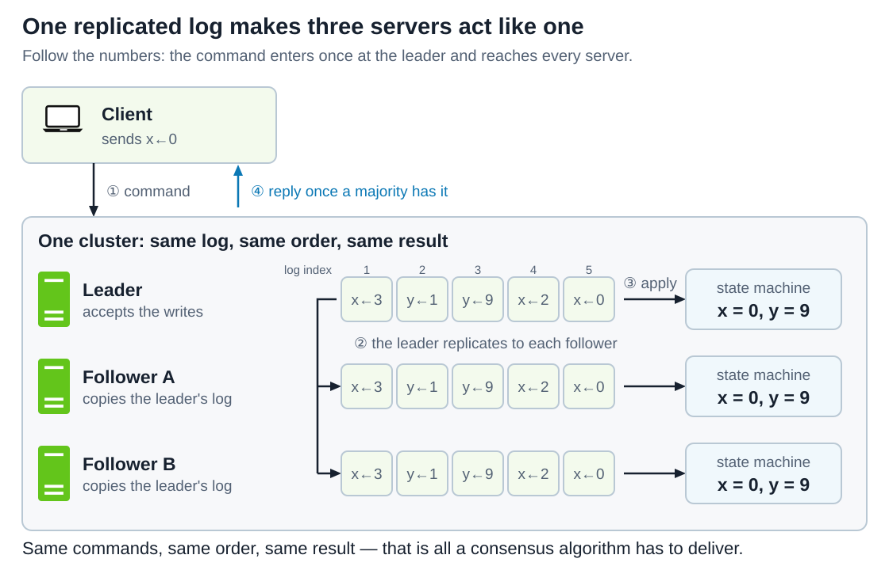

Two details are load-bearing:
1. Entries flow **from the leader to each follower** — never between followers, and never back into the leader.
2. The reply waits for a majority, so a successful return means the command is already safe.

Raft's guarantees come in two halves:
1. **Safety is unconditional**: Raft never returns an incorrect result "under all non-Byzantine conditions, including network delays, partitions, and packet loss, duplication, and reordering". Non-Byzantine means servers may stop, but never lie.
2. **Availability is conditional**: the cluster works "as long as any majority of the servers are operational and can communicate with each other and with clients".

Timing never decides correctness — "faulty clocks and extreme message delays can, at worst, cause availability problems" — so every timer below protects progress, not safety.

## 2. The vocabulary and the three states

* A **log entry** is one command plus the **term** it was created in. Entries are numbered consecutively; that number is the **log index**;
* A **term** is a numbered stretch of time that begins with an election. Every message carries the sender's term, so terms act as a **logical clock**: a server that sees a higher number knows its own information is stale;
* An entry is **committed** once the leader that created it has stored it on a **majority** of servers; from then on it is durable. It is **applied** when a server's state machine executes it — committed first, applied after;
* The whole set of servers is the **configuration**. "Majority" always means a majority of *that*, not of the servers currently reachable.

Majority arithmetic is why cluster sizes are conventionally odd:

| Servers | Quorum | Failures tolerated |
| --- | --- | --- |
| 3 | 2 | 1 |
| 4 | 3 | 1 |
| 5 | 3 | 2 |

Four servers need three votes and still tolerate only one failure, so the fourth machine buys nothing. HashiCorp recommends "either 3 or 5 servers for production deployments" for exactly this reason.

Basic Raft uses two RPC types:
* **`RequestVote`** is sent by a candidate to collect votes, carrying the index and term of its last log entry.
* **`AppendEntries`** is sent by the leader to replicate entries; with no entries in it, it is a **heartbeat**.

Before replying to either RPC, a server must durably store any changes to its current term, its recorded vote, or its log. This follows the `write-before-acknowledge` principle: after a crash, the server must remember votes it granted and log entries it acknowledged. For an entry from the leader’s current term, the leader can commit it once it is durably stored on a majority of servers, including itself.

Every server is a **leader**, a **follower**, or a **candidate**. Followers are passive: they only respond to requests. Read the diagram as a state machine; each arrow label is the event that causes the change.

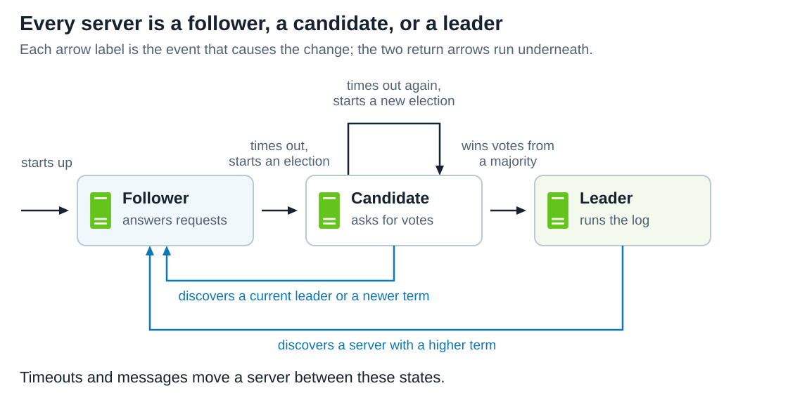

The two return arrows are the ones people forget. A candidate steps down when it learns a legitimate leader exists, and a **leader steps down the moment it sees a higher term**, in any message. Nobody tells a leader it has been replaced; it works it out from a number. The rule is uniform: a higher term makes any server adopt it and become a follower, and a request carrying a lower term is rejected.

## 3. Leader election

A follower's **election timeout** restarts whenever it hears from the current leader or grants a vote. If it elapses first, the follower increments its term, becomes a candidate, votes for itself, and sends `RequestVote` to everyone in parallel.

Read the chart below downward: solid arrows are requests, dashed ones are replies, and a loop is a server's own step.

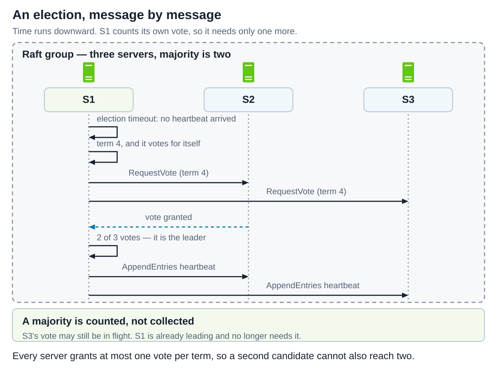

The candidate counts its own vote, so on three servers one granted reply is enough. It becomes leader and starts heartbeating the moment it holds a majority, even while S3's answer is still in flight.

A candidate wins with votes from a majority of the **full cluster** for the same term. Each server grants at most one vote per term, first come first served, so two leaders in one term are impossible: two majorities of the same set share a server, and that server cannot vote twice. The same rule can also leave nobody with a majority. Read each panel below down to its tally.

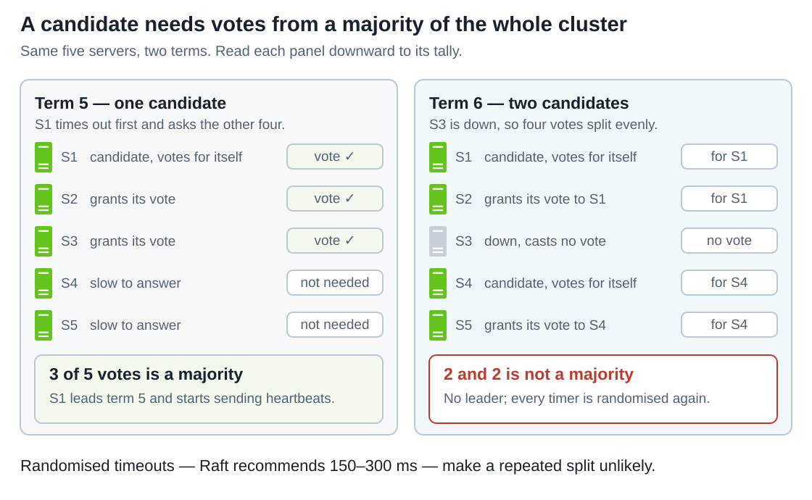

A split vote is not a failure — the term simply ends with no leader. Randomness resolves it: election timeouts "are chosen randomly from a fixed interval (e.g., 150–300ms)", so one server usually times out alone and wins before anyone else starts. Without randomness, "leader election consistently took longer than 10 seconds in our tests due to many split votes"; 5 ms of randomness brought the median downtime to 287 ms.

Shortening the timeout to recover faster works until it breaks the timing requirement:

```text
broadcastTime  <<  electionTimeout  <<  MTBF
```

`broadcastTime` is one parallel round of RPCs, typically 0.5–20 ms because each recipient persists to disk first; `MTBF` is a single server's mean time between failures, typically months. Squeeze `electionTimeout` toward `broadcastTime` and heartbeats stop outrunning followers' timers, so healthy leaders get deposed. **The symptom is a cluster that keeps changing leaders under load**, stalling writes each time — usually a timeout too aggressive for the network, not a bug.

## 4. Log replication

The leader appends each client command to its own log and sends `AppendEntries` to every follower in parallel. Once a majority stores the entry, the leader applies it and answers the client. The client stays outside the dashed Raft group and talks only to the leader.

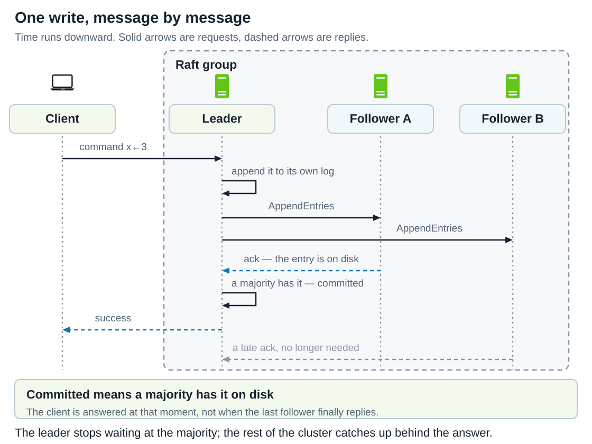

The answer leaves *before* follower B replies: two of three already hold the entry, and two is a majority.

That count is what commits an entry. Read the diagram below column by column; the tally under each column decides the verdict beneath it.

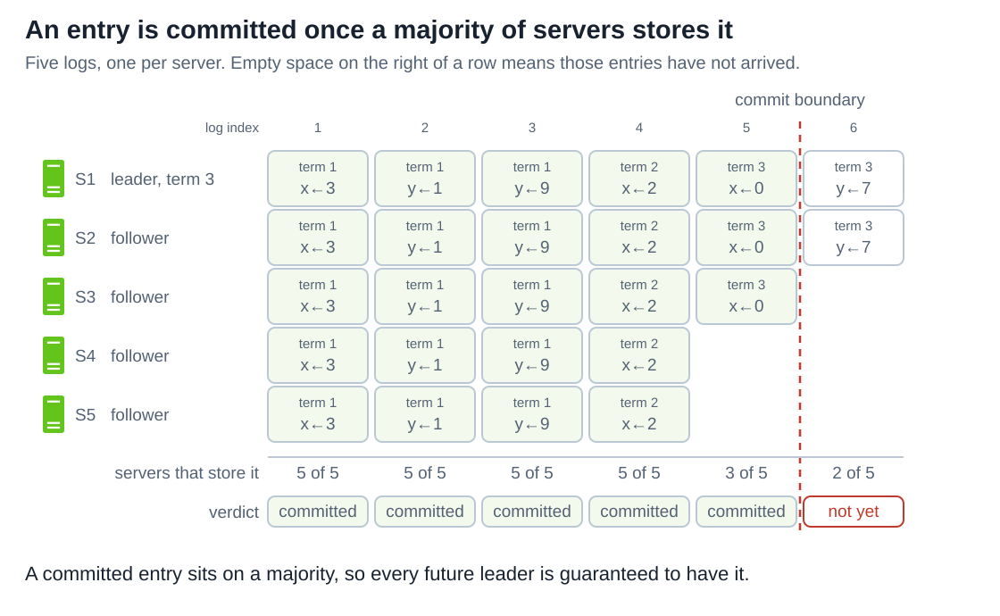

Committing an index also commits everything before it, "including entries created by previous leaders". The leader sends its highest committed index in later `AppendEntries`, so followers learn about commitment slightly late and then apply in log order. Lagging servers get no special handling: the leader retries "indefinitely (even after it has responded to the client) until all followers eventually store all log entries."

### The consistency check

Every `AppendEntries` names the index and term of the entry **immediately preceding** the new ones, and the follower refuses if it has no matching entry. By induction, a successful `AppendEntries` proves the follower's log matches the leader's up through the new entries. That is the **Log Matching Property**: if two logs hold an entry with the same index and term, they are identical up through that index.

### Repairing a follower that disagrees

Leader crashes leave logs inconsistent: a follower may miss entries, hold extra ones, or both. Raft repairs in one direction only — **the leader forces followers' logs to duplicate its own**. Compare index 4 and 5 across the panels below; the leader's row never changes, because a leader only appends to its own log.

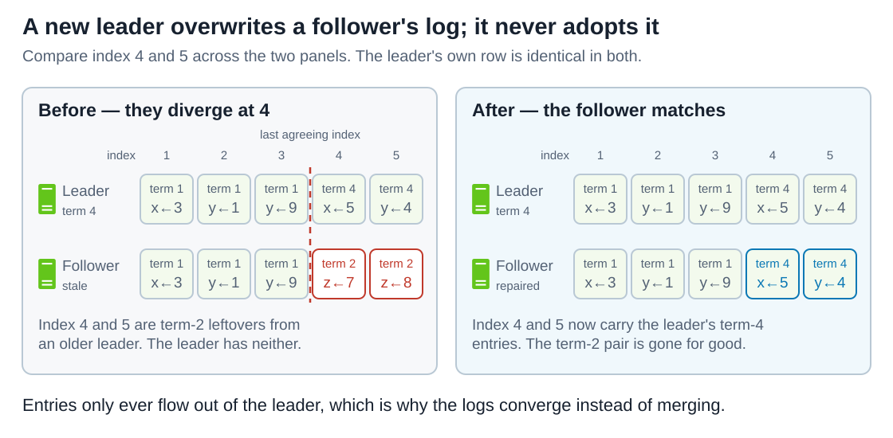

The leader never asks what a follower holds. It keeps a `nextIndex` per follower, initialised to its own last index plus one; each rejection means the check failed, so it steps `nextIndex` back by one and retries. Read the chart below downward: the two conflicting entries cost two rejections before the logs match at index 3.

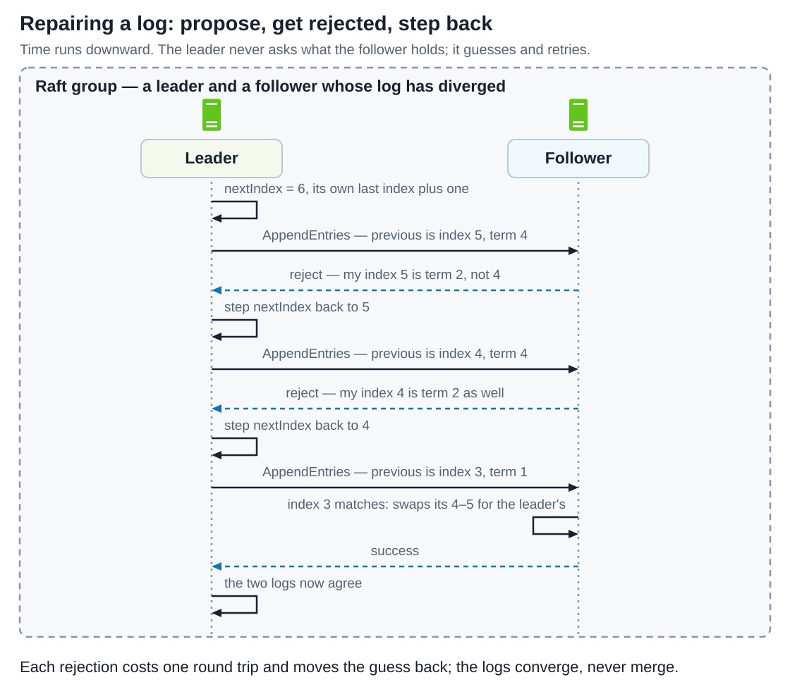

## 5. Safety: why the new leader has everything

Nothing so far prevents a disaster. A follower that was unavailable while entries were committed could come back, win an election, and overwrite them everywhere. Raft rules this out by restricting **who may win**: `RequestVote` carries the candidate's last index and term, and a voter refuses if its own log is more up to date.

Read the table below against the voter's log at the top — one voter, four candidates.

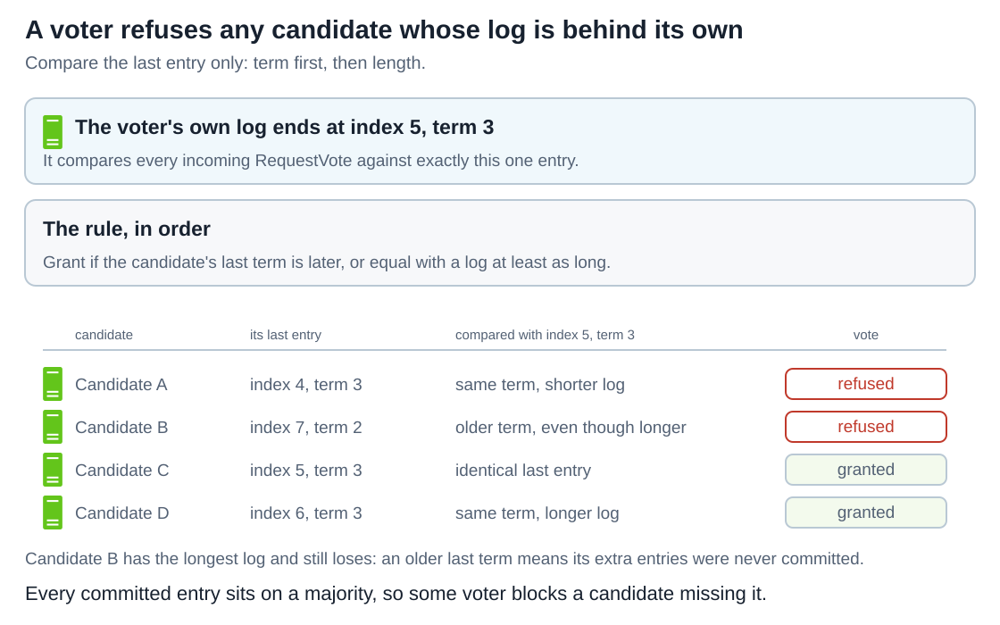

"Up to date" compares **last** entries: a later last term wins; on equal terms, the longer log wins. Candidate B is the case to remember: it has the longest log and still loses, because an older last term means its extra entries were never committed.

Now combine the definitions. A committed entry is on a majority; a winner needs votes from a majority; two majorities always intersect. So **some voter holds every committed entry** and refuses any candidate missing it. That is the **Leader Completeness Property**, and it is why in Raft "log entries only flow in one direction, from leaders to followers."

### The commitment rule that is easy to get wrong

§2 defined commitment by the leader *that created* the entry, and the qualifier matters. A leader may **not** treat an entry from an earlier term as committed just because a majority holds it now: voters compare only *last* entries, so a candidate whose last entry has a newer term can still win and overwrite it. The paper's Figure 8 shows how; the diagram below simplifies it into two possible futures.

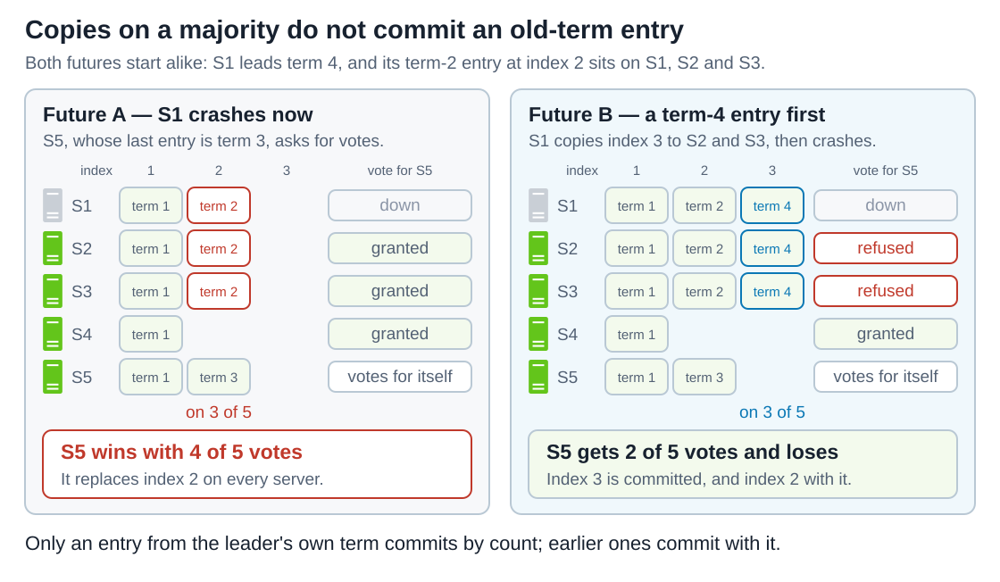

So Raft counts replicas only for entries of the leader's **current** term; everything before such an entry commits with it, through the Log Matching Property.

The consequence shows up at the start of every term. A new leader holds all committed entries but does not know **which** they are. The standard fix, in both the paper and the dissertation, is to commit a blank **no-op** entry first; once it commits, the leader's commit index is at least as large as any other server's. That no-op is also a precondition for the reads in [§7](#7-clients-and-reads).

## 6. Changing members and compacting the log

Servers cannot all switch configurations at the same instant, so a careless change opens a window where the old and new configurations each have a majority with no server in common — two leaders, same term. Compare the two majority rows in each panel.

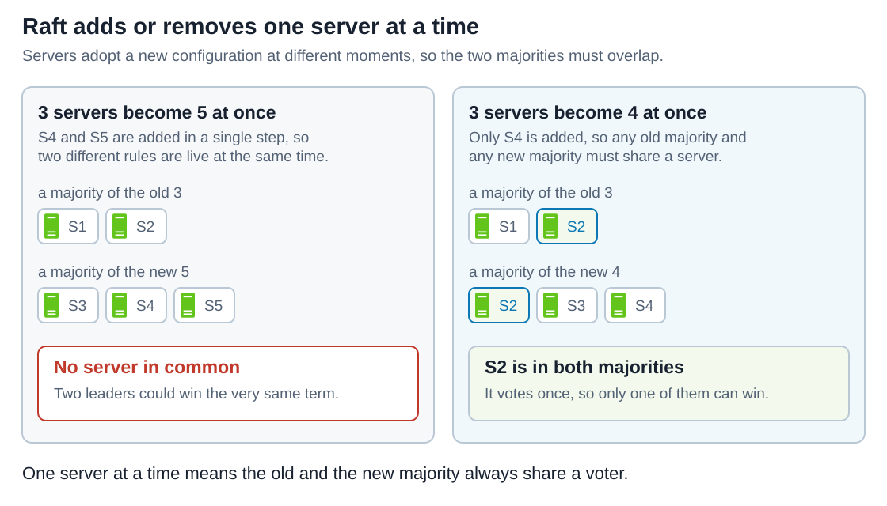

The paper's answer was **joint consensus**, a transitional configuration that needs majorities of both. The dissertation recommends something simpler: **add or remove one server at a time**, composing bigger changes from single steps, so disjoint majorities are arithmetically impossible. Configurations travel as log entries, with one counter-intuitive rule: **a server uses a new configuration as soon as the entry is in its log, committed or not.** Its commit is what allows the *next* change to begin.

A brand-new server has an empty log, so it first joins as a **non-voting member** that receives entries but is not counted. etcd calls it a **learner**, added with `member add --learner` and made a voter with `member promote` once its log has caught up. A learner does not change the quorum size, so a botched add cannot cost the cluster its majority; etcd's design note proposes learner as the default for new members, so that "misconfiguration will always be reversible without losing the quorum".

A *removed* server stops getting heartbeats, times out, and disrupts the cluster with higher terms. Raft's fix: **a server ignores a `RequestVote` that arrives within the minimum election timeout of hearing from a current leader**. The dissertation's **Pre-Vote** phase covers a related case, a partitioned server rejoining: a candidate first asks whether others *would* vote for it, and increments its term only if they would.

### Compacting the log with a snapshot

The log also has to stop growing. **Snapshotting** saves the state produced by committed, applied entries to durable storage; the server can then discard those entries. Read the two rows below as the same log before and after; entries 6 and 7 do not move.

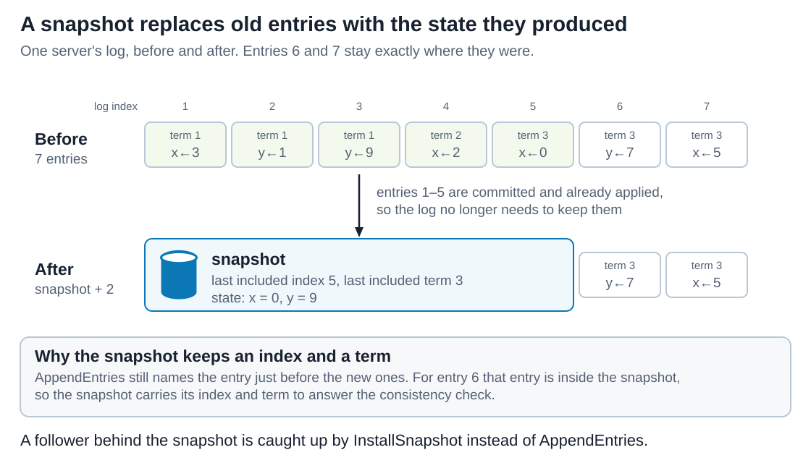

The snapshot records the **last included index** and **term** because the consistency check for the next entry needs a previous index and term, and that entry is no longer in the log. It also stores the latest configuration as of that index. Each server snapshots **independently** because consensus on those entries is already settled.

### Catching up with `InstallSnapshot`

**`InstallSnapshot` is a third RPC, added for snapshot-based log compaction.** The leader uses it when a follower needs entries that the leader has already discarded. While the missing entries are still available, ordinary `AppendEntries` is enough.

Using the diagram above, suppose a follower has only entries **1–2**, while the leader has replaced entries **1–5** with a snapshot. The follower needs entries 3–5, but the leader can no longer send them.

The leader sends `InstallSnapshot` with the saved state (`x = 0`, `y = 9`), the snapshot boundary (index **5**, term **3**), and the configuration at that boundary. The follower durably saves the snapshot and restores its state machine from it. It now has the result of applying entries 1–5 without replaying those commands.

The leader then resumes `AppendEntries` from entry **6** onward. The snapshot's index and term let the follower check that these entries follow the restored state correctly. Entries after the snapshot are applied when committed, just as in normal replication.

## 7. Clients and reads

A client connects to a random server; a non-leader rejects the request and names the leader. Two problems remain.

**A command can execute twice.** If the leader commits an entry and crashes before replying, the client retries and the command runs again. The fix is outside the consensus core: clients tag each command with a **unique serial number**, and the state machine remembers the latest one processed per client with its response, answering a repeat from that record. Deduplication lives in the state machine — the division of labour the [transactional outbox](../Patterns.%20Transactional%20Outbox/Readme.md) article describes for consumers.

**A read can return a stale value.** A read is **linearizable** when it returns the most recent committed write — the cluster behaves as if it were a single copy answering one request at a time. Answering from the leader's memory is tempting, but **nothing reaches a partitioned leader to tell it a newer term exists**, so it keeps believing it leads. The top panel below shows two simultaneous truths; compare the three columns under it.

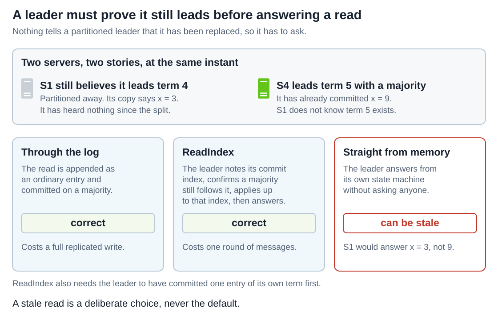

The ReadIndex procedure from the dissertation:
1. The leader must already have committed an entry of its own term — the no-op from §5.
2. It records its commit index as `readIndex`.
3. It sends a round of heartbeats and waits for a majority to acknowledge, proving no newer leader existed when they were sent.
4. It waits until its state machine has applied up to `readIndex`, then answers.

Every arrow below exists only to justify a value the leader could already read from memory.

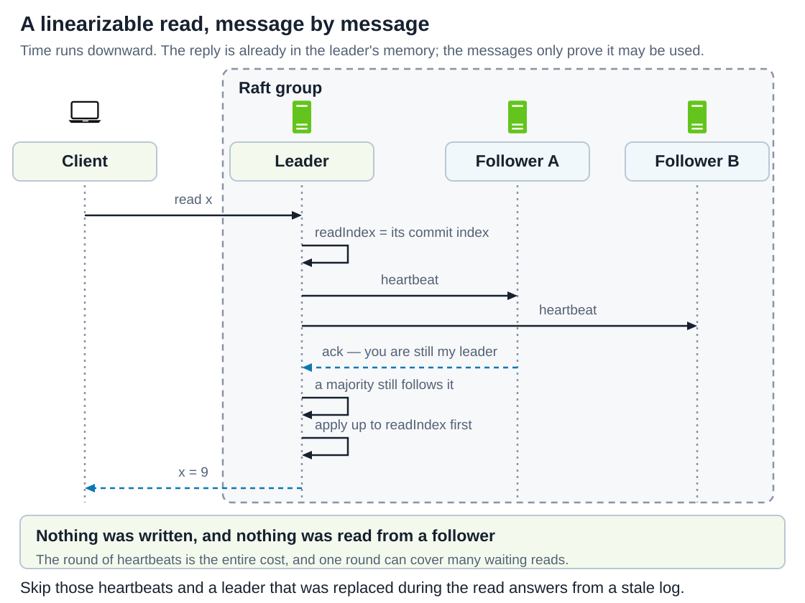

One round of heartbeats can serve any number of queued reads. A **lease** variant skips even that, answering with no messages for about an election timeout, which the dissertation does not recommend "unless necessary to meet performance requirements": it "assumes a bound on clock drift across servers", which garbage-collection pauses and virtual-machine migrations can break, and "If the assumptions are violated, the system could return arbitrarily stale information." A clock becomes load-bearing for safety, which the rest of Raft never allows.

Answering from a follower's own state trades freshness for load, so real systems make it opt-in: etcd "ensures linearizability for all other operations by default" and offers a `serializable` mode that "may access stale data with respect to quorum, but removes the performance penalty".

## 8. Limits and where Raft runs

* **It does not survive a lost majority.** Three of five down means no leader, no commits, no linearizable reads. Raft stops rather than diverge;
* **It does not tolerate lying servers.** Corrupted storage or a malicious peer is outside the model;
* **It is not a database.** Every committed byte is written to disk on a majority of machines, so Raft holds the small critical state everything else agrees on — the role the [Apache ZooKeeper](../Apache%20ZooKeeper/Readme.md) article describes for coordination data;
* **More servers do not mean more throughput.** Every commit still passes through one leader and needs more copies; the paper calls five "a typical number";
* **A leader change is not free.** Writes stall for the length of the election — on a dashboard, a short write outage with no errors attached.

Each row below comes from that project's own documentation.

| System | How it uses Raft |
| --- | --- |
| **etcd** | Linearizable by default, `serializable` per request, learners for safe membership changes. |
| **Consul** | Only server agents join the Raft peer set; client agents stay outside, so a few servers support thousands of nodes. |
| **TiKV** | One Raft group per **Region** of the key space — "multiple Raft consensus groups on one node". A Region that outgrows its limit splits. |
| **CockroachDB** | One group per range of keys. Strongly consistent reads "bypass Raft" at the leaseholder, whose writes already achieved consensus. |
| **ClickHouse Keeper** | A ZooKeeper replacement that "uses the RAFT algorithm" via eBay's NuRaft; ZooKeeper clients work, mixed clusters do not. |
| **Kafka (KRaft)** | Not quite Raft: KIP-595 calls it "a sort of Raft dialect", and "it is pull-based unlike Raft which is push-based". |

etcd, Consul, ClickHouse Keeper and KRaft each run **one cluster-wide group**, affordable because the state they hold is small. TiKV and CockroachDB hold a whole database and **never ask one group to carry it**, because a group's throughput ceiling is its leader. Read each row of the panels below across: the servers are the same; only the number of groups changes.

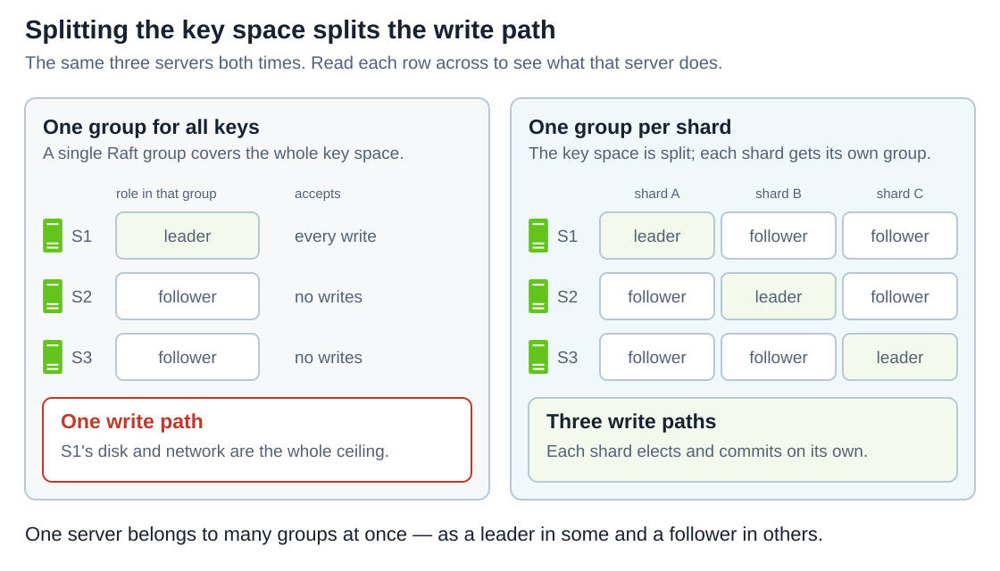

The algorithm does not change — each group runs its own elections, commit rule and repair. What changes is that one server leads some groups while following others, so the write path is no longer one machine. The [Digital Wallet](../../system%20design/27.%20Digital%20Wallet/Readme.md) design uses exactly this: one group per account partition, behind a Saga coordinator.

## 9. Check your understanding

1. Three of the five servers in a cluster are down. What can it still do?

   <details>
   <summary>Answer</summary>

   Nothing that needs agreement. Two cannot form a majority of five, so no candidate wins, nothing commits, and no linearizable read is answered. The survivors keep their data and refuse to decide anything.

   </details>

2. Your cluster keeps electing new leaders under load, and writes stall each time. What is the usual cause?

   <details>
   <summary>Answer</summary>

   An `electionTimeout` squeezed too close to `broadcastTime`. Heartbeats no longer outrun followers' timers, so healthy leaders lose elections they should win. The requirement is `broadcastTime << electionTimeout << MTBF`.

   </details>

3. A candidate has the longest log in the cluster and still loses. How?

   <details>
   <summary>Answer</summary>

   "Up to date" compares the last entry's **term** first and only then the length. A candidate whose last entry is from term 2 loses to a voter whose last entry is from term 3, whatever its length. Its extra entries came from a leader that never committed them.

   </details>

4. An entry created in term 2 sits on four of five servers, and the leader is in term 4. Is it committed?

   <details>
   <summary>Answer</summary>

   The leader may not conclude so: counting replicas commits only entries of its **own** term, because a candidate whose last entry is from term 3 could still win and overwrite it. The entry commits the moment a term-4 entry after it commits.

   </details>

5. A follower holds two entries the leader has never seen. What happens to them?

   <details>
   <summary>Answer</summary>

   They are deleted. The consistency check fails, the leader steps `nextIndex` back until the logs match, and from there the follower drops its own entries and takes the leader's. Entries only flow out of the leader.

   </details>

6. Why does a new leader commit a blank no-op entry first?

   <details>
   <summary>Answer</summary>

   It holds every committed entry but does not know **which** they are, because replica counting only commits its own term's entries. Committing one raises its commit index to at least every other server's.

   </details>

7. A leader answers a read straight from memory, sending no messages. What can go wrong?

   <details>
   <summary>Answer</summary>

   It may have been replaced without noticing — nothing reaches a partitioned leader to tell it a newer term exists. It can return a value a newer leader has already overwritten.

   </details>

8. Why does Raft add servers one at a time?

   <details>
   <summary>Answer</summary>

   Servers adopt a configuration at different moments. Going from three to five in one step allows an old majority and a new majority that share no server, so two leaders could win the same term. A one-server step makes that impossible.

   </details>

9. A snapshot discards the entries it covers. Why does it still record an index and a term?

   <details>
   <summary>Answer</summary>

   The consistency check for the next entry names the index and term of the one immediately before it, and that entry is now inside the snapshot. The **last included index** and **term** answer that check.

   </details>

# Sources

Primary sources checked on 2026-09-22; the paper and dissertation were read as text. The dissertation supersedes the paper on membership changes, read-only queries and Pre-Vote. The command sequence `x←3, y←1, y←9, x←2, x←0` follows the paper's Figure 6 and the old-term commit diagram simplifies its Figure 8; server names, terms and log contents are teaching examples.

The snapshot-transfer explanation in §6 was checked against §7 and Figure 13 of the paper on 2026-09-26.

- [In Search of an Understandable Consensus Algorithm (Extended Version) — Diego Ongaro and John Ousterhout](https://raft.github.io/raft.pdf)
- [Consensus: Bridging Theory and Practice — Diego Ongaro's PhD dissertation](https://github.com/ongardie/dissertation)
- [The Raft Consensus Algorithm — project site](https://raft.github.io/)
- [etcd: API guarantees](https://etcd.io/docs/v3.6/learning/api_guarantees/)
- [etcd: Raft learner design](https://etcd.io/docs/v3.6/learning/design-learner/)
- [Consul: Consensus protocol](https://developer.hashicorp.com/consul/docs/architecture/consensus)
- [TiKV deep dive: Multi-raft](https://tikv.org/deep-dive/scalability/multi-raft/)
- [CockroachDB architecture: Replication layer](https://docs.cockroachlabs.com/docs/stable/architecture/replication-layer)
- [ClickHouse Keeper documentation](https://clickhouse.com/docs/guides/sre/keeper/clickhouse-keeper)
- [KIP-595: A Raft Protocol for the Metadata Quorum](https://cwiki.apache.org/confluence/display/KAFKA/KIP-595%3A+A+Raft+Protocol+for+the+Metadata+Quorum)
