# Redis

<sub>[Back to Distributed Systems](../Readme.md#content)</sub>

**Redis (“REmote DIctionary Server”) is a network-accessible data structure store that keeps its working data in memory and lets applications read and change it with commands.** It provides shared caches, sessions, counters, rankings, messaging, and short-lived coordination across application servers.

Start with the data model and a shared-counter example, then separate memory and recovery guarantees, choose a topology, and establish data ownership before applying the patterns.

1. [Models and internals](#1-models-and-internals)
2. [Atomicity and transactions](#2-atomicity-and-transactions)
3. [Memory and durability](#3-memory-and-durability)
4. [Deployment topologies](#4-deployment-topologies)
5. [Placement: Redis, CDN, durable](#5-placement-redis-cdn-durable)
6. [Patterns](#6-patterns)
7. [Recall](#7-recall)

The examples describe core Redis Open Source behavior; managed products can offer additional architectures. Version requirements are stated beside newer commands. Example lifetimes and keys are design choices, not Redis defaults.

## 1. Models and internals

A web application may run several server instances. They can all use the same Redis keys, so a request can reach any instance and still find shared product data or a counter. Start with the keys and their values, then follow a command into the server.

The name describes this model: **remote** means clients can access Redis over a network; **dictionary** means keys identify stored values; **server** means commands execute where the shared data lives.

### Keys, types, and lifetimes

A **key** names one value, for example `product:42`. A **value** has a Redis type, which determines the available commands. A **time to live (TTL)** limits how long a key remains valid. A **cache hit** finds a usable cached value; a **cache miss** requires another source.

A **backend** is the server-side application. It exposes an **application programming interface (API)** to clients and may read a **database (DB)**. **JavaScript Object Notation (JSON)** is a text format for structured data, such as an object containing a product's name and price.

| Redis type | What one key contains | Typical purpose and commands |
|---|---|---|
| String | Bytes, such as serialized JSON, or a number represented as a string | Cached record: `GET`, `SET`; counter: `INCR` |
| Hash | Field/value pairs | Session or small entity: `HSET`, `HGET` |
| List | Ordered sequence of strings | Push/pop work lists: `LPUSH`, `RPOP`; reliable processing needs additional handling |
| Set | Unique, unordered members | Membership and deduplication: `SADD`, `SISMEMBER` |
| Sorted set | Unique members with numeric scores | Rankings: `ZADD`, `ZRANGE` |
| Stream | Ordered entries with IDs and field/value payloads | Retained events and consumer groups: `XADD`, `XREADGROUP` |

Redis stores and manipulates these structures on the server. For example, `INCR views:42` counts views of page `42` without fetching the counter into the application first. A JSON document stored through ordinary `SET` is a string; it does not automatically become a hash or a native JSON value.

### A concrete key/value example

These commands can be entered into an interactive Redis client:

```text
SET product:42 '{"name":"Mug"}' EX 60
GET product:42
TTL product:42
```

`SET` stores the JSON text and gives the key a 60-second lifetime in one command. Before expiry, `GET` returns that text and `TTL` reports the remaining seconds. `TTL` returns `-1` for a key without expiry and `-2` for an absent key. The prefix `product:` is an application naming convention; it does not create a relational table or enforce relationships between records.

### Inside one Redis instance

Read left to right: backend connections reach the event loop, which dispatches commands that access typed values in memory.

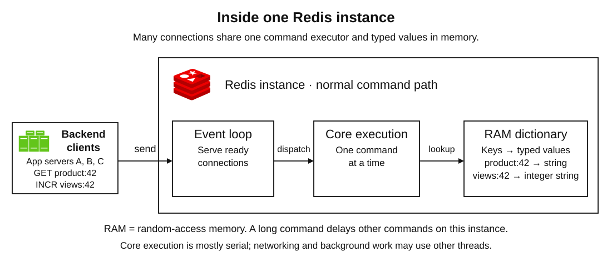

**Connections and command execution.** A backend client sends commands over a connection using the Redis serialization protocol (RESP). Redis uses an event loop to handle ready network connections without dedicating a command-execution thread to every client. Core commands are normally executed serially on the main thread of an instance. Network input/output and background work can use other threads or processes; “Redis is single-threaded” is only a shorthand for the core execution model.

**Memory and lookup.** Internally, dictionaries map keys to typed values. Looking up a known key avoids scanning the whole database. Redis chooses representations suited to the value's size and type: small aggregates can use compact encodings such as listpacks, while larger hashes use hash tables. A listpack stores small entries close together to reduce memory overhead. Exact encodings and thresholds are implementation details that can change across releases.

### Why it is fast

The active dataset is in random-access memory (RAM), many commands do a small amount of work, and the server can update a structure without sending the entire value to the client. Persistence can still add disk work. Network round trips, value size, command complexity, and load determine the latency an application actually sees.

`GET` has constant-time key lookup, but transferring a large value still costs time. A sorted-set insertion with `ZADD` costs logarithmic work per member as the set grows. Commands that traverse large collections and long-running scripts can delay other clients on that instance. **In-memory does not mean every operation is constant time.**

**Pipelining** sends several commands without waiting for each reply before sending the next. It reduces round trips; it does not make the commands one atomic transaction.

## 2. Atomicity and transactions

Suppose several application instances serve page `42`. Each page view should increase the shared counter `views:42` by one, regardless of which instance handles the request. The application sends this Redis command for each view:

```text
INCR views:42
```

If the counter is `10`, two successful increments return `11` and `12` in some order, leaving `12`. If the key is absent, `INCR` starts from zero. Redis performs the read, addition, and write as one **atomic operation**: competing clients cannot interleave their commands inside it.

By contrast, if both applications read `10`, add one locally, and write `11`, one view is lost. Sharing the key is useful, but a sequence of individually atomic commands can still race.

### Choose where the decision runs

A **Lua script** is custom code Redis executes next to its data. A **Redis Function** is reusable code loaded into Redis and called by name. Both can combine conditional logic and Redis commands without a client round trip between them. Keep the work bounded; the invocation cannot include a transaction in an external database or a call to a payment service.

| Mechanism | Use it for | Important boundary |
|---|---|---|
| One command, such as `INCR` or `SET ... NX` | A change Redis already supports; `NX` sets only an absent key | Atomic execution does not guarantee survival after failure |
| Short Lua script or Redis Function | Read Redis values, make a decision, and update them within one server-side invocation | Other clients cannot interleave commands; long execution delays them |
| `MULTI` / `EXEC` | Queue a known set of commands, then execute them together | It does not protect reads made before the transaction |
| `WATCH` plus `MULTI` / `EXEC` | Let application code decide from previously read values | Changes to watched keys abort execution; the application must retry |

### Why an earlier read needs protection

The diagram compares a stale replacement, a watched transaction, and the direct increment already introduced above.

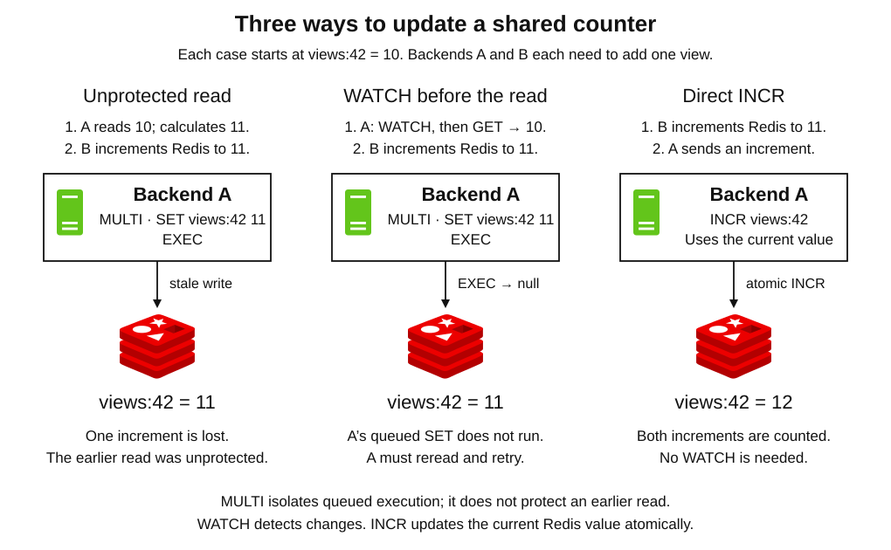

Suppose A reads `views:42 = 10` and calculates `11`. B then increments it to `11`. If A now queues `SET views:42 11` inside `MULTI` and calls `EXEC`, the result stays `11`. Redis isolates the queued commands during execution, but A's earlier read was outside that execution.

`WATCH` registers keys to check before `EXEC`. This illustrative trace uses two connections; A keeps the same connection throughout:

```text
Client A: WATCH views:42   -> OK
Client A: GET views:42     -> "10"
Client B: INCR views:42    -> 11
Client A: MULTI            -> OK
Client A: SET views:42 11  -> QUEUED
Client A: EXEC             -> null (transaction aborted)
```

No queued command from A runs, so the counter remains `11`. A must watch again, reread, and retry its decision. Watching does not lock the key: B can still write. Expiration and eviction can also invalidate a watch in current Redis. `EXEC` clears the watches after either success or abort.

For this plain counter, `INCR` already expresses the whole operation. Use `WATCH` when a decision needs application logic, or a short script when the decision can run entirely in Redis. A command rejected while queuing can abort the transaction; an error during execution does not roll back successful commands or prevent the other queued commands from running.

### Conditional string changes: `IFEQ` and `DELEX`

**The `SET ... IFEQ` option and the `DELEX` command were introduced in Redis Open Source 8.4.0.** They provide simple compare-and-change operations without writing a script.

```text
SET views:42 11 IFEQ 10
```

This replaces the string only if its current value is `10`. Without the `GET` option, success returns `OK`; a missing key or a mismatched value returns null and changes nothing. It compares the current value, so it cannot detect a change away from `10` and back again. Use `INCR` for an increment; value comparison is useful when a particular expected value should permit a replacement.

For conditional deletion, suppose `lock:report` contains a unique token identifying the worker that owns it:

```text
DELEX lock:report IFEQ <unique-token>
```

Replace the placeholder with that worker's token. Redis deletes the key only when its string value matches, returning `1`; a missing or mismatched key returns `0`. On older versions, perform the token comparison and deletion in one Lua invocation. A separate `GET` followed by `DEL` allows another owner to acquire the key between the check and deletion. Conditional `DELEX` rejects a non-string value.

### Atomicity has a location

**Redis Cluster** spreads keys across servers using **hash slots**, numbered partitions of the keyspace. Ordinary multi-key commands, transactions, and scripts must keep their keys in the **same slot**. A **hash tag** places related keys together: `cart:{u42}` and `cart-version:{u42}` hash the shared `u42` part, so a transaction can access both.

This does not create an atomic transaction across arbitrary slots or external systems. A successful Redis operation also says nothing by itself about disk persistence or whether another server received a copy. A client timeout is also ambiguous: the command may have executed even though its reply was lost. Blindly retrying `INCR` can increment twice. Design retries according to the operation's meaning; the next section addresses what survives failure.

## 3. Memory and durability

Separate **how long a key remains available in memory** from **what data survives a failure**. Expiration and eviction govern live keys. Persistence records recovery data on disk; replication keeps another live copy. Neither alone determines what a replacement server will contain.

A **primary** accepts writes for its data. A **replica** copies a primary's dataset. These roles let us distinguish the server handling a write from the server that might later replace it.

### Memory: expiration and eviction

**Expiration** follows a key's time to live (TTL). Redis checks expiration when a key is accessed and also performs periodic active cleanup. Expired memory need not be reclaimed at the exact deadline, but an expired key is no longer valid for ordinary primary reads. A normal `SET` replacement removes an existing TTL unless expiry or `KEEPTTL` is supplied.

**Eviction** removes keys under memory pressure. With `maxmemory` configured, a cache policy might prefer approximately least recently used (LRU) or least frequently used (LFU) keys. An unexpired key can therefore disappear. `noeviction` instead rejects memory-growing writes when the limit is reached; it does not disable TTL expiration.

For a disposable product cache, a missing key can trigger a reload. For a session or queued job, losing the key may lose state the application still needs. Use separate Redis deployments when disposable-cache eviction and required-state retention need incompatible policies.

### Durability: persistence, replicas, and failover

**Failover** replaces an unavailable primary, typically by promoting a replica. First ask what reached disk, then what reached the server that will take over.

**Persistence records data on disk.**

| Choice | Mechanism | Main trade-off |
|---|---|---|
| Redis Database (RDB) snapshots | Save a point-in-time dataset | Recovery can lose changes made after the last successful snapshot |
| Append-only file (AOF) | Record writes for reconstruction on restart | More disk work; durability depends on the synchronization policy |
| AOF with `appendfsync everysec` | Normally synchronize approximately once per second | A crash can lose roughly the latest second of writes; this is not an end-to-end failover guarantee |
| AOF with `appendfsync always` | Synchronize writes before replying, with possible batching | Stronger local disk durability at higher write cost |
| Persistence disabled | Keep the dataset in memory only | A restart requires repopulation or recovery from another copy |

**Replication copies data to another server.** A primary sends its replication stream asynchronously. Replicas can lag, so reading from one can return an older value. On reconnect, a replica can use a replication ID and offset to request missing history from the primary's backlog. If that history is unavailable, Redis performs a full resynchronization.

**An acknowledged write can still be lost during failover.** Suppose the primary replies successfully, fails before copying the update, and a replica without that update is promoted. Even a write persisted on the old primary is not automatically present on the promoted replica. Local disk durability and the contents of the replacement server are separate questions.

Waiting for replica acknowledgments with `WAIT` reduces some loss risks but does not make Redis a strongly consistent store or prove disk persistence. Automatic failover also requires a controller and reachable participants; the next section compares Sentinel and Cluster. Backups on independent storage protect recovery history in ways live replicas do not.

### Capacity and operational checks

Background snapshotting and AOF rewriting can use a child process and **copy-on-write**: unchanged memory pages are shared, but changed pages need extra copies. Budget memory for these copies and for buffers, not just application payloads.

Monitor memory, evictions, latency, slow commands, replication lag, and persistence health. Decide in advance what the application does when Redis is slow, full, or unavailable: use timeouts, bounded retries, and a fallback appropriate to the data.

## 4. Deployment topologies

Replication adds copies; sharding spreads different keys across servers. A **shard** owns a distinct portion of the keyspace. **High availability (HA)** means recovering service from component failures with limited interruption; it is separate from capacity and durability.

The four diagrams compare the node arrangements. Persistence settings and the write-loss risks from the preceding section apply independently of the arrangement.

### Single Redis instance

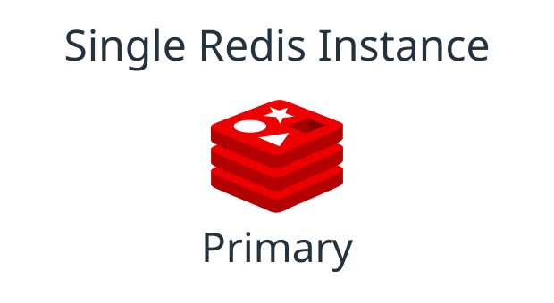

One server holds the data and handles reads and writes. Use it for development or workloads that can tolerate an interruption. Its failure stops access until it recovers or is replaced. Disk persistence can help restore the data, but it does not provide another live server.

### Primary with a replica

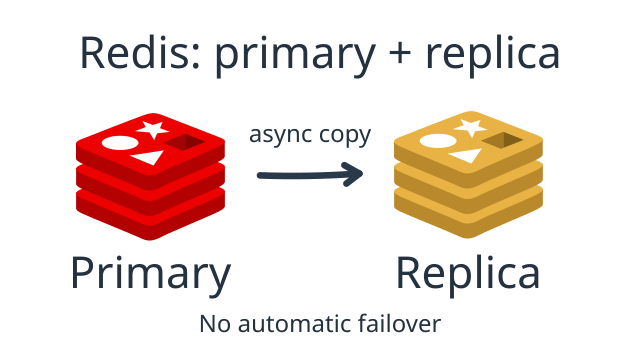

The replica adds another copy and can serve reads when lag is acceptable. Both nodes hold the same logical dataset; this topology adds no new shard. Replication alone does not provide automatic failover: use Sentinel, a managed controller, or manual intervention to promote a replacement and reconnect clients.

### Redis Sentinel

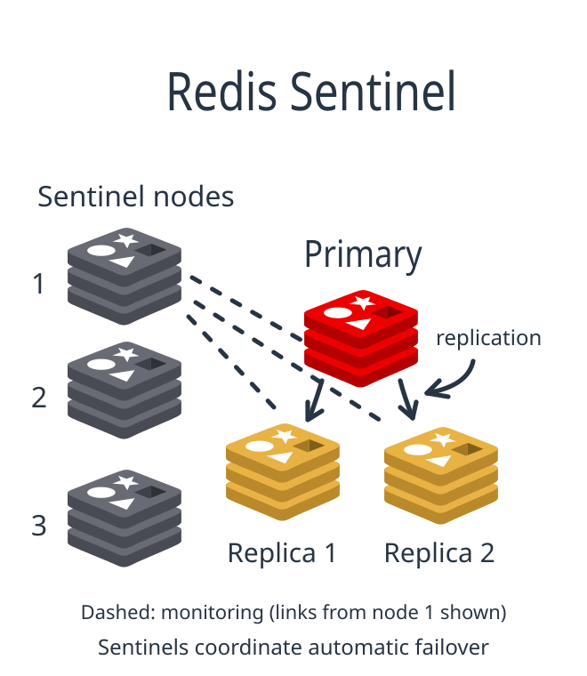

Sentinel processes monitor the primary and replicas, agree on failure, and coordinate promotion. A configured **quorum** is the number of Sentinels needed to declare the primary unavailable; authorizing failover also requires a majority of Sentinels. A production design commonly uses at least three Sentinels in independent failure locations.

The dark Sentinel nodes do not store application keys or sit in the ordinary command path. A Sentinel-aware client discovers the current primary, then connects to that Redis data server. Use this model when the dataset fits one primary and you need automatic failover without sharding.

### Redis Cluster

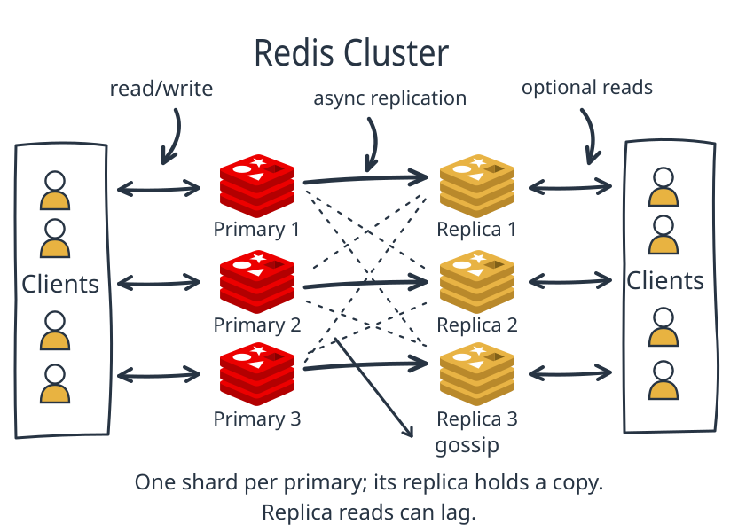

Each primary owns different **hash slots**, the numbered key buckets introduced under atomicity. Redis Cluster distributes 16,384 slots among primaries; the usual mapping is `CRC16(key) mod 16384`. A cluster-aware client routes commands to the owning primary and handles redirects as ownership changes. Each replica copies its own primary's slots.

The **gossip** connections exchange membership and failure information. Cluster provides its own failure detection and replica election, so it does not require Sentinel. Failover takes time and requires sufficient reachable primaries and suitable replicas. Optional replica reads can be stale.

Use Cluster when different keys need more memory or command capacity than one primary can provide. Keep multi-key atomic operations in one slot. Too many keys sharing one hash tag can overload a shard; one huge or hot key also remains on one shard. Adding shards does not split the work inside that key.

| Main requirement | Deployment to consider | What it does not add by itself |
|---|---|---|
| Simple setup; an interruption is acceptable | Single instance | Live redundancy |
| Another copy; possibly stale read capacity | Primary plus replica | Automatic failover |
| Automated failover for one dataset | Primary, replicas, and Sentinel | Sharding |
| More capacity across different keys | Redis Cluster, with replicas for failover | Atomic transactions across arbitrary slots |

## 5. Placement: Redis, CDN, durable

Choose the owner before choosing the cache. A **source of truth** is the authoritative record from which copies can be reconstructed. The distinction between these layers is the work each performs. Redis helps the backend find or update application state. A **content delivery network (CDN)** caches reusable **Hypertext Transfer Protocol (HTTP)** responses near users. A durable database or object store owns records and files that must remain recoverable.

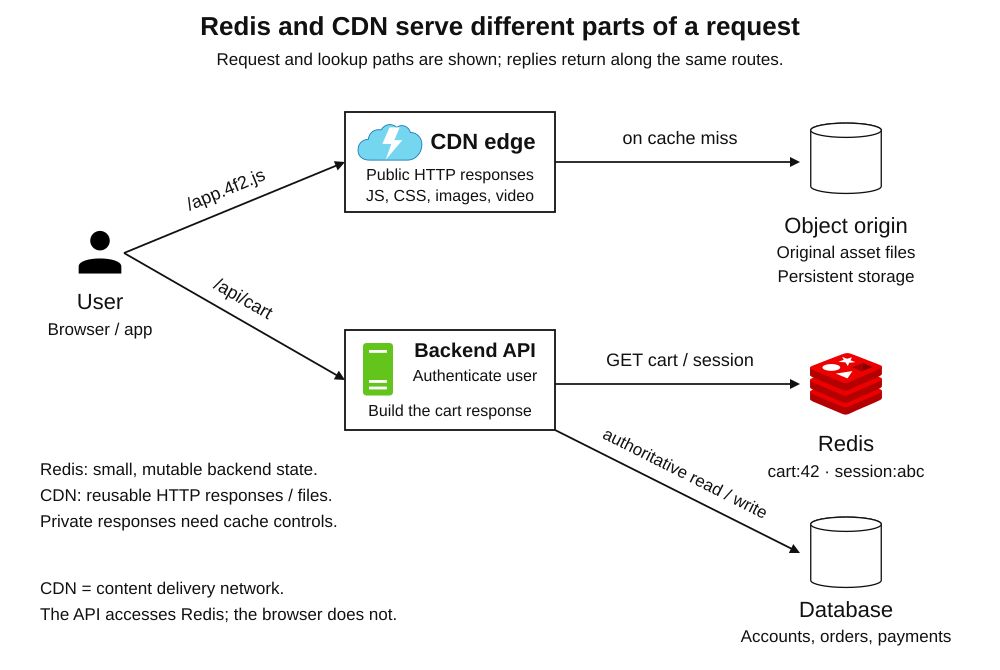

| Question | Redis | CDN | Durable database / object storage |
|---|---|---|---|
| Who normally accesses it? | Trusted backends, gateways, and workers | Browsers and other HTTP clients | Application services; authorized file clients where appropriate |
| What is addressed? | Application key and typed value | HTTP response selected by a cache key, usually involving a URL | Record, document, event, or object |
| What does it optimize? | Low-latency reads and mutations of shared state | Delivery latency and repeated origin traffic | Recovery, authoritative data, and durable files |
| Good examples | Hot product fields, sessions, counters, scores, small jobs | Images, CSS, JavaScript, fonts, video segments, cacheable public pages or API results | Accounts, orders, inventory, payment records, originals, report files |
| What happens when data changes? | The application updates or invalidates keys; TTL may expire them | Freshness rules, revalidation, versioned URLs, or explicit invalidation | The authoritative write is committed |
| What if a copy disappears? | A cache can be rebuilt; a session, job, or lease has workload-specific consequences | Fetch a new copy from the origin | Restore or recover according to the storage design |

### Backend state in Redis

**Choose Redis for small, frequently accessed state that needs backend operations.** Prefer bounded collections and a defined lifetime or retention policy. Memory also pays for key names, objects, indexes, replicas, and buffers. Keep Redis on trusted network paths and use appropriate authentication, access control, and transport encryption. Storing a large image in Redis is technically possible, but usually a poor fit when the goal is file delivery.

### Response and file delivery through a CDN

**Choose the CDN for reusable responses and file bytes.** The **origin** is the server or object store from which the CDN obtains a response on a miss. The CDN holds copies; it is not the only home for an uploaded original. Public HTML and API responses can be cached too—“CDN” does not mean “images only.”

### Cache keys, access, and freshness

**Treat cache keys as a correctness decision.** If a public product response varies by language or currency, configure the CDN key to distinguish those variants. Two requests with the same cache key must be allowed to receive the same cached response. Do not accidentally reuse a response across users or tenants.

For a deliberately public response that may be reused by shared caches for 30 seconds, an illustrative header is:

```http
Cache-Control: public, max-age=0, s-maxage=30
```

Here `s-maxage` controls shared caches; `max-age=0` makes the browser's cached response immediately stale. `private` forbids shared-cache storage while permitting private browser caching; `no-store` instructs caches not to store the response. `no-cache` permits storage but requires validation before reuse. Align the CDN configuration with the headers, particularly for authenticated endpoints.

**Private files can still use a CDN.** The backend can authorize a download and issue a signed URL or signed cookie, while restricting direct access to the origin. This is different from publicly caching a personalized API response. The Redis session and the file authorization decision remain backend concerns.

**Layered caches need coordinated freshness.** Suppose Redis holds a product value for 60 seconds and the CDN caches the resulting response for 30 seconds. A response generated near the end of Redis's lifetime can extend the user's stale view toward 90 seconds. Invalidating Redis does not invalidate an already cached CDN response. Choose a freshness budget for the complete path.

## 6. Patterns

Group the examples by the job Redis performs and the consequence of losing its state: **disposable copies**, **state held for a while**, **messaging**, and **coordination**. Apply the placement rule from the previous section to each design: identify the authority, then decide what Redis holds and what the CDN may deliver.

In every diagram the user reaches an API or gateway; the trusted backend issues Redis commands. Database and Redis updates are separate operations unless an explicit mechanism coordinates them.

### Disposable copies

A missing copy can be rebuilt from its authority. Freshness and the load created by rebuilding are the main concerns.

**Cache-aside: accelerate repeated reads**

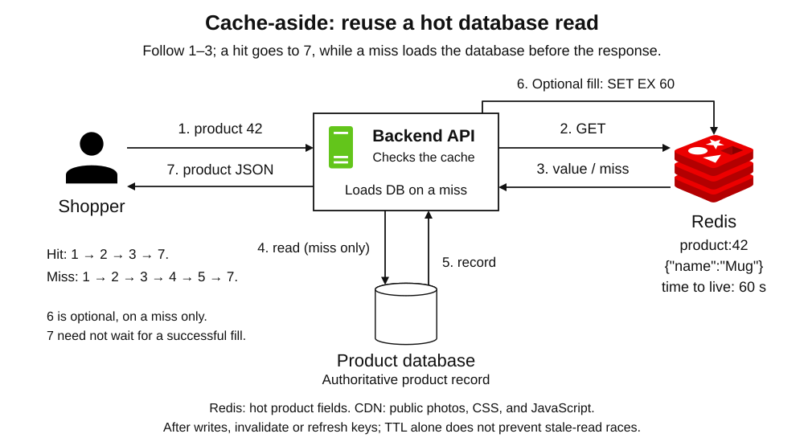

**User interaction.** A shopper opens product `42`. The API checks `product:42` in Redis. On a hit it returns the cached fields. On a miss it reads the product database, stores a copy with a TTL, and returns the result. Repeated reads avoid repeating the database work.

**Redis data.** Store a compact, frequently requested record such as `{"name":"Mug","price":12,"imageUrl":"/mug-v3.webp"}`, with an illustrative TTL of 60 seconds. Include tenant, language, or other relevant dimensions in the key when the result varies by them.

**Placement.** The database owns catalog records and checkout prices; Redis holds a replaceable copy and image URL. Image bytes stay in object storage and reach users through the CDN. A public product response can also use the CDN when its freshness and variation rules permit.

**Main trap.** After a database write, invalidate or refresh the cached copy. TTL alone allows stale values until expiry. Even “commit, then delete” can race with an older read that fills the cache afterward. Use version-aware fills or coordinated invalidation when stronger freshness is required; validate correctness-sensitive data at its authority.

A **cache stampede** occurs when many requests miss the same popular key together. Coalesce equivalent loads and consider TTL jitter or early refresh. Cache unavailability should trigger a bounded fallback, since sending every request directly to the database can overload it.

### State Redis holds for a while

Sessions and quotas are active operational state; a leaderboard is a derived view maintained over a season. Their useful lifetime is bounded by the application, but they are not equally disposable: losing a session may log someone out, losing a quota counter may admit extra requests, and a ranking needs source events to be rebuilt.

**Shared sessions: any application instance can recognize the user**

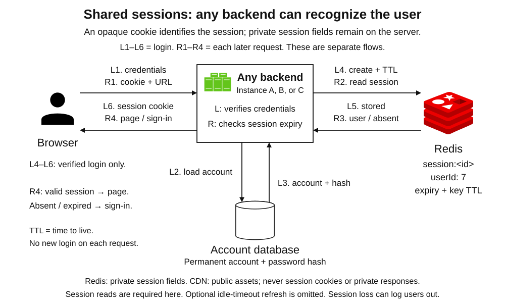

**User interaction.** After login, the browser sends an opaque session ID in a cookie. Whichever backend handles the next request looks up that ID in Redis and uses the session to identify the user. The user does not need to return to the server that handled login.

**Redis data.** A key such as `session:s8` can hold `userId=u42`, creation time, expiry, and small session-specific state. Apply an explicit lifetime; if activity extends an idle timeout, also define any absolute lifetime. Delete the session on logout. Passwords do not belong in the session payload.

**Placement.** Accounts, password hashes, orders, and durable preferences stay in the database. Login-page assets can use the CDN; personalized responses and session cookies must not become publicly reusable cache entries.

**Main trap.** A session is not always a rebuildable cache entry. Losing it may log a user out; losing a logout deletion during failover can undermine revocation. Choose persistence and failover behavior to match that consequence, and verify security-sensitive authority when needed. Concurrent session updates also need atomic field changes or concurrency control.

**Rate limiting: share a quota across gateways**

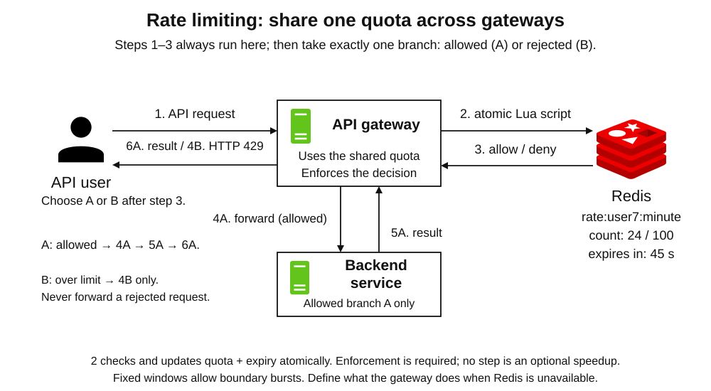

**User interaction.** A user calls an API. The gateway checks and updates Redis quota state before forwarding an allowed request. If the quota is exhausted, the gateway returns HTTP `429 Too Many Requests`. All gateway instances consult shared state, so each instance does not accidentally grant a separate full quota.

**Redis data.** A simple fixed-window design stores a count under a key such as `rate:u42:minute-123`, with an expiry. An alternative token bucket stores remaining tokens and the last refill time. The limit-check and state change must form one atomic Redis operation, such as a short script. Separate `INCR` and `EXPIRE` calls can leave a counter without expiry if the client fails between them.

**Placement.** The database owns subscription plans and contractual quotas; Redis holds active enforcement state. A CDN's edge rate limiter is a separate enforcement mechanism from its HTTP response cache.

**Main trap.** Fixed windows allow bursts around a window boundary. Also decide what happens when Redis is unavailable: fail open to preserve access, fail closed to enforce the restriction, or use a conservative local fallback. Lost counter updates during failover can loosen enforcement, so a Redis quota alone is not a billing ledger.

**Leaderboards and counters: maintain a fast derived view**

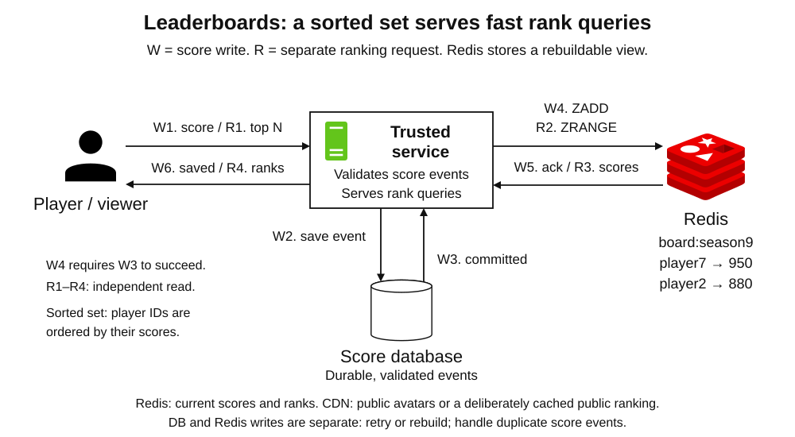

**User interaction.** A game service validates a player's result, records the durable event, and updates a Redis sorted set. Another user asks for the top players; the service queries Redis and returns the ranking.

**Redis data.** `board:season9` maps each player ID to a score. For example, these are Redis command examples for a client or an interactive Redis command-line interface (CLI), not shell commands:

```text
ZADD board:season9 950 player7
ZRANGE board:season9 0 9 REV WITHSCORES
```

The second command returns up to ten members from highest score to lowest, including their scores. For a simple count, use a string counter and `INCR`; a sorted set is useful when ordering or ranks matter.

**Placement.** Match results and scoring evidence stay in a database or durable event log so the ranking can be rebuilt. The CDN serves avatars, game assets, and optionally a briefly cached public ranking snapshot.

**Main trap.** A database commit and a Redis update are not atomic together. A **transactional outbox** can store a pending update event in the same database transaction, then let a worker apply it to Redis. Handle retries and out-of-order events; replaying an increment twice inflates a score. One enormous leaderboard is still one Redis key on one shard.

### Messaging

Choose whether a message is only a live notification or retained work that consumers must recover and acknowledge.

**Pub/Sub: deliver live notifications to connected subscribers**

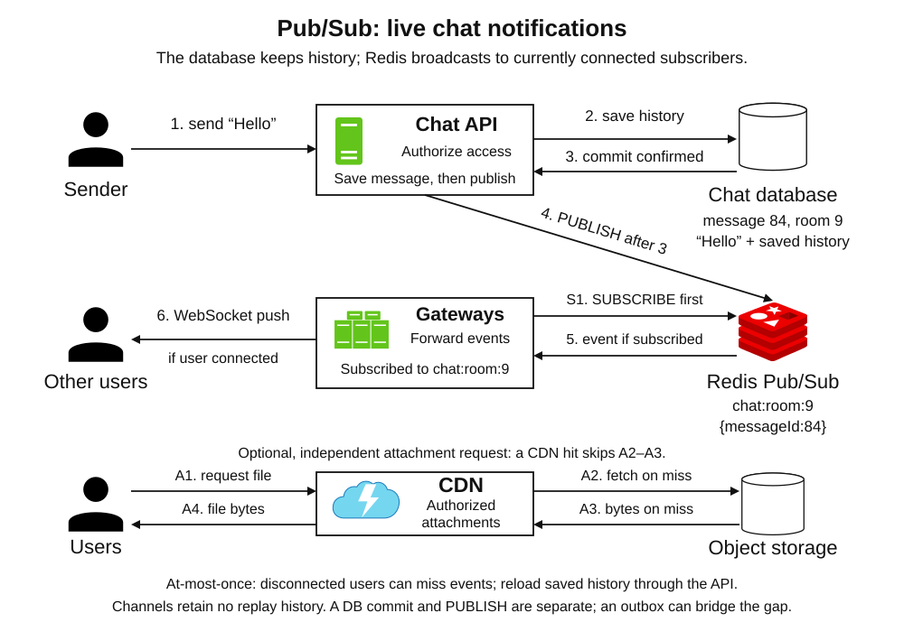

**User interaction.** A user sends a chat message. The backend stores the message for history and publishes a notification on `chat:room:9`. Redis forwards it to currently subscribed gateway connections, and the gateways push it to users over WebSocket connections.

**Redis data.** The channel carries a small message or a message ID and room ID. A Pub/Sub channel is not a retained key containing a durable message history. Redis Pub/Sub provides **at-most-once delivery**: a disconnected or failing subscriber can miss the message permanently.

**Placement.** The database owns chat history; object storage owns attachments delivered through the CDN with appropriate access controls. Returning users fetch missed history from the backend.

**Main trap.** Pub/Sub is suitable for live hints when clients can recover current state; it is not a reliable job queue. Persisting history and publishing are separate operations, so use an outbox if reliable eventual publication matters. A successful `PUBLISH` does not mean a user's device received or displayed the message. In Redis Cluster, ordinary `PUBLISH` propagates each message to every node over the cluster bus, so adding shards does not limit that broadcast cost. **Sharded Pub/Sub**, introduced in **Redis 7.0**, uses `SSUBSCRIBE` and `SPUBLISH` with channels mapped to hash slots, restricting propagation to the owning shard's primary and replicas while retaining Pub/Sub's at-most-once delivery.

**Streams and consumer groups: process background work**

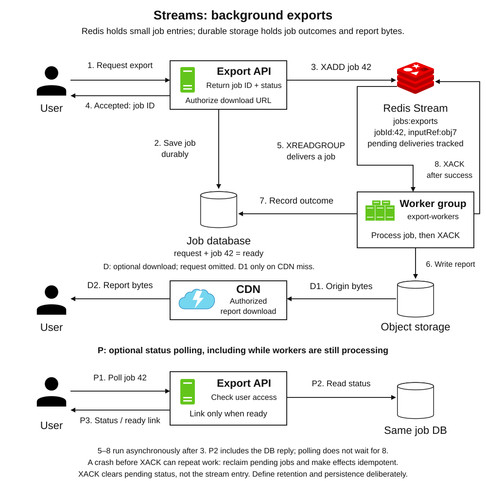

**User interaction.** A user requests a report export. The API appends a job with `XADD` and returns a job ID. Workers use `XREADGROUP` to share work in a consumer group. A worker creates the report, records its successful result, then acknowledges the entry with `XACK`. The user later asks the API for status and a download link.

**Redis data.** `jobs:exports` contains entries with `jobId`, `userId`, report parameters, or an input-object reference. A stream retains entries and IDs. The group's **pending entries list (PEL)** tracks deliveries that have not yet been acknowledged. Different groups can consume the same stream independently.

**Placement.** Large inputs and reports stay in object storage. Keep job requests and business outcomes in the database when work must be recoverable after Redis data loss. A private export can use an authorized, short-lived CDN download URL.

**Main trap.** If a worker dies after producing a result but before acknowledging it, another worker may repeat the job. Reclaim abandoned pending work with a mechanism such as `XAUTOCLAIM`, and make processing **idempotent**: repeated execution must not produce additional business effects. Retained entries, acknowledgments, and retries can support at-least-once processing; they do not guarantee exactly-once external effects.

`XACK` removes pending-delivery bookkeeping, not the stream entry itself. Define trimming, retention, retry limits, and failed-job handling. Persistence, replication, and eviction choices still determine whether the stream survives failures. Avoid evicting queues that contain required work.

### Coordination

Use shared state to recognize retries or reduce overlapping work. Decide where the business effect is made authoritative; a Redis claim alone cannot commit an external operation.

**Idempotency: make repeated API requests safe**

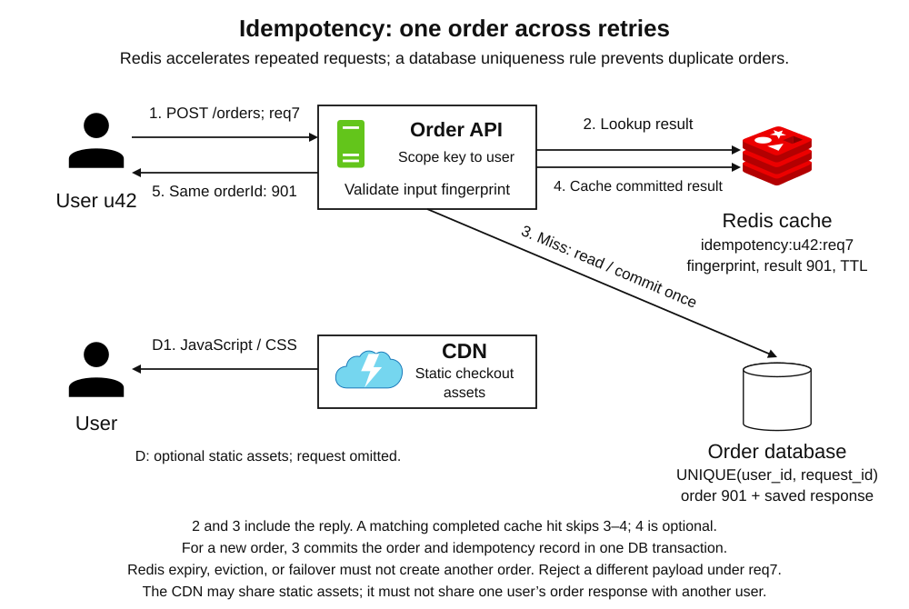

**User interaction.** A user retries `POST /orders` after a timeout, reusing request ID `req7`. The API recognizes the same logical operation and returns the existing order outcome rather than creating another order.

**Redis data.** Cache an in-progress hint or completed response under a scoped key such as `idempotency:u42:req7`, including a request fingerprint, result ID, and expiry. A **request fingerprint** summarizes the original input so reusing the same ID for a different order can be rejected. Redis makes repeat lookups fast and can reduce concurrent duplicate work.

**Placement.** The database enforces uniqueness for `(user_id, request_id)` and commits that record with the order in one transaction. If Redis loses its copy, the API consults this authority. Checkout assets can use the CDN; one user's order response cannot be shared with others.

**Main trap.** `SET ... NX EX ...` in Redis followed by an unrelated database write leaves crash windows. The Redis key can expire or disappear after the order succeeds. Use Redis as an accelerator; make the durable uniqueness rule the authority. Define how long retries are recognized. External payments need their own idempotency contract because the database transaction cannot atomically include the payment provider.

**Short-lived locks: reduce duplicate recomputation**

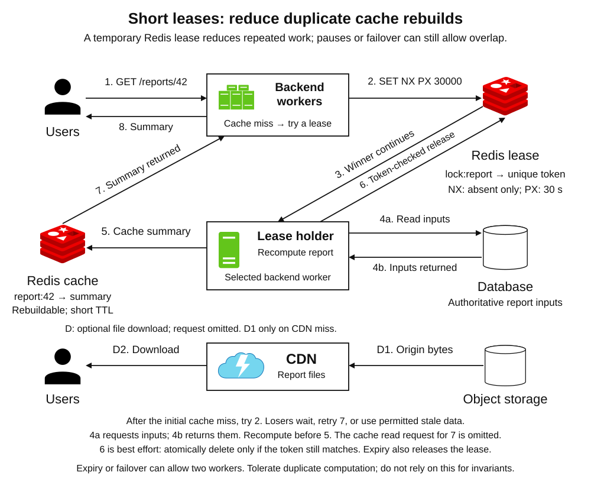

**User interaction.** Several requests miss an expensive cached report. Backend workers compete for a short lease; the winner recomputes from the database and populates Redis, while others wait briefly, retry the cache, or use an allowed stale result.

**Redis data.** Acquire `lock:report` with `SET lock:report <unique-token> NX PX 30000`. `NX` means only if the key does not exist; `PX 30000` sets a 30-second lifetime. The token identifies that acquisition. On Redis 8.4 or later, release it with `DELEX lock:report IFEQ <unique-token>`; older versions can use a short Lua script that atomically compares the token and deletes only a match. An unconditional `DEL` could delete a newer owner's lock.

**Placement.** The database owns report inputs. Redis holds the lease and cached result or result reference. Large generated files stay in object storage and can use the CDN.

**Main trap.** A **lease** grants ownership only for a limited time. A paused worker can resume after expiry while another worker is working. Asynchronous failover can also lose a lock and allow overlap. This example tolerates duplicate computation; it does not protect a financial invariant. Correctness-sensitive updates need an authoritative transaction or a suitable coordination protocol with **fencing**, where the protected resource rejects stale owners. A random lock token alone is not a fencing token.

## 7. Recall

**§1:** Redis keeps shared typed values in RAM and executes commands beside them. **§2:** Atomic changes need a suitable command, script, or protected transaction; sharing keys alone does not prevent races. **§3:** TTL and eviction govern live keys; persistence and replication address different recovery risks. **§4:** Replicas add copies, Sentinel automates failover, and Cluster shards keys. **§5:** Redis serves backend state, a CDN delivers reusable HTTP responses, and durable stores own recoverable records and files. **§6:** Choose patterns by state ownership, lifetime, and the consequences of staleness, loss, or repeated work.

# Sources

Primary documentation checked on 2026-09-08. The application topologies, example keys, TTLs, and placement recommendations are design examples derived from these mechanisms.

- [Redis FAQ: the name means REmote DIctionary Server](https://redis.io/docs/latest/develop/get-started/faq/#where-does-the-name-redis-come-from)
- [Redis keys and values: naming conventions and expiration](https://redis.io/docs/latest/develop/using-commands/keyspace/)
- [Redis TTL: remaining lifetime and special return values](https://redis.io/docs/latest/commands/ttl/)
- [Redis data types: strings, hashes, lists, sets, sorted sets, and streams](https://redis.io/docs/latest/develop/data-types/)
- [Redis strings](https://redis.io/docs/latest/develop/data-types/strings/) — values, counters, and command costs.
- [Redis memory optimization](https://redis.io/docs/latest/operate/oss_and_stack/management/optimization/memory-optimization/) — compact encodings and hash representations.
- [Redis event library](https://redis.io/docs/latest/operate/oss_and_stack/reference/internals/internals-rediseventlib/) — event-loop rationale; historical implementation details are not a current source-code contract.
- [Redis serialization protocol](https://redis.io/docs/latest/develop/reference/protocol-spec/) — client commands and server responses.
- [Redis benchmarking](https://redis.io/docs/latest/operate/oss_and_stack/management/optimization/benchmarks/) — execution model, network cost, and workload-dependent performance.
- [Redis pipelining](https://redis.io/docs/latest/develop/using-commands/pipelining/) — reducing round trips.
- [Redis transactions](https://redis.io/docs/latest/develop/using-commands/transactions/) — isolation, `WATCH`, and lack of rollback.
- [Redis Functions: loaded libraries, named functions, and atomic execution](https://redis.io/docs/latest/develop/programmability/functions-intro/)
- [Redis Lua scripting](https://redis.io/docs/latest/develop/programmability/eval-intro/) — atomic execution and blocking semantics.
- [Redis EXPIRE](https://redis.io/docs/latest/commands/expire/) and [SET](https://redis.io/docs/latest/commands/set/) — expiration, TTL replacement, conditional writes, and the Redis 8.4.0 introduction of `IFEQ`.
- [Redis DELEX: conditional deletion introduced in Redis Open Source 8.4.0](https://redis.io/docs/latest/commands/delex/)
- [Redis key eviction](https://redis.io/docs/latest/develop/reference/eviction/) — memory limits, policies, and operational metrics.
- [Redis persistence](https://redis.io/docs/latest/operate/oss_and_stack/management/persistence/) — RDB, AOF, synchronization, copy-on-write, and backups.
- [Redis replication](https://redis.io/docs/latest/operate/oss_and_stack/management/replication/) — asynchronous copies, resynchronization, and `WAIT` limitations.
- [Redis Sentinel](https://redis.io/docs/latest/operate/oss_and_stack/management/sentinel/) — monitoring, quorum, and failover.
- [Redis Cluster specification](https://redis.io/docs/latest/operate/oss_and_stack/reference/cluster-spec/) — slots, hash tags, routing, failover, and write-loss windows.
- [Scaling with Redis Cluster](https://redis.io/docs/latest/operate/oss_and_stack/management/scaling/) — partitioning, client routing, and replica topology.
- [Redis cache-aside](https://redis.io/docs/latest/develop/use-cases/cache-aside/) — shared cache reads and invalidation.
- [Redis cache consistency](https://redis.io/blog/cache-consistency-strategies/) — stale values, fill races, and update ordering.
- [Redis session store: shared user state, expiry, and durability](https://redis.io/docs/latest/develop/use-cases/session-store/)
- [Redis INCR](https://redis.io/docs/latest/commands/incr/) — counters and rate-limiter atomicity.
- [Redis ZADD](https://redis.io/docs/latest/commands/zadd/) and [ZRANGE](https://redis.io/docs/latest/commands/zrange/) — score updates and ranked reads.
- [Redis Pub/Sub](https://redis.io/docs/latest/develop/pubsub/) — channels, subscriber delivery, and message-loss semantics.
- [Redis Sharded Pub/Sub](https://redis.io/docs/latest/develop/pubsub/#sharded-pubsub), [SPUBLISH](https://redis.io/docs/latest/commands/spublish/), and [SSUBSCRIBE](https://redis.io/docs/latest/commands/ssubscribe/) — Redis 7.0 introduction, channel slots, and propagation within one shard.
- [Redis XREADGROUP](https://redis.io/docs/latest/commands/xreadgroup/), [XACK](https://redis.io/docs/latest/commands/xack/), and [XAUTOCLAIM](https://redis.io/docs/latest/commands/xautoclaim/) — consumer groups, pending work, acknowledgments, and recovery.
- [Redis distributed locks](https://redis.io/docs/latest/develop/clients/patterns/distributed-locks/) — lease acquisition, token-checked release, failover hazards, and fencing guidance.
- [AWS: Making retries safe with idempotent APIs](https://aws.amazon.com/builders-library/making-retries-safe-with-idempotent-APIs/) — request identifiers, atomic recording, and retry semantics.
- [PostgreSQL unique constraints](https://www.postgresql.org/docs/current/ddl-constraints.html#DDL-CONSTRAINTS-UNIQUE-CONSTRAINTS) — durable uniqueness enforcement.
- [AWS transactional outbox pattern](https://docs.aws.amazon.com/prescriptive-guidance/latest/cloud-design-patterns/transactional-outbox.html) — coordinating database changes with event publication.
- [HTTP caching, RFC 9111](https://httpwg.org/specs/rfc9111.html) — shared/private caches, cache keys, freshness, and response directives.
- [MDN HTTP caching](https://developer.mozilla.org/en-US/docs/Web/HTTP/Guides/Caching) — practical caching, versioned resources, and managed-cache behavior.
- [Amazon CloudFront cache keys](https://docs.aws.amazon.com/AmazonCloudFront/latest/DeveloperGuide/controlling-the-cache-key.html) — response variants and edge-cache reuse.
- [Amazon CloudFront origins](https://docs.aws.amazon.com/AmazonCloudFront/latest/DeveloperGuide/DownloadDistS3AndCustomOrigins.html) — object-store and HTTP origins.
- [Amazon CloudFront private content](https://docs.aws.amazon.com/AmazonCloudFront/latest/DeveloperGuide/PrivateContent.html) — authorized file delivery with signed URLs or cookies.
- [Redis security](https://redis.io/docs/latest/operate/oss_and_stack/management/security/) — trusted clients, network access, authentication, and encryption.
- [Ignas Pangonis: Redis — Introduction, Caching and Transactions (2022)](https://levelup.gitconnected.com/redis-introduction-caching-and-transactions-aa32d385aa2b)
- [Redis Deployment Strategies — supplied image, credited to @arpit20adlakha](https://media.licdn.com/dms/image/v2/D5622AQFyvl8Ijkk31w/feedshare-shrink_800/feedshare-shrink_800/0/1719894721371?e=1790208000&v=beta&t=bEyc_iMG4mr7Ez82dfgmb7-ogkESvHVCGKJl_6-K7AY)
