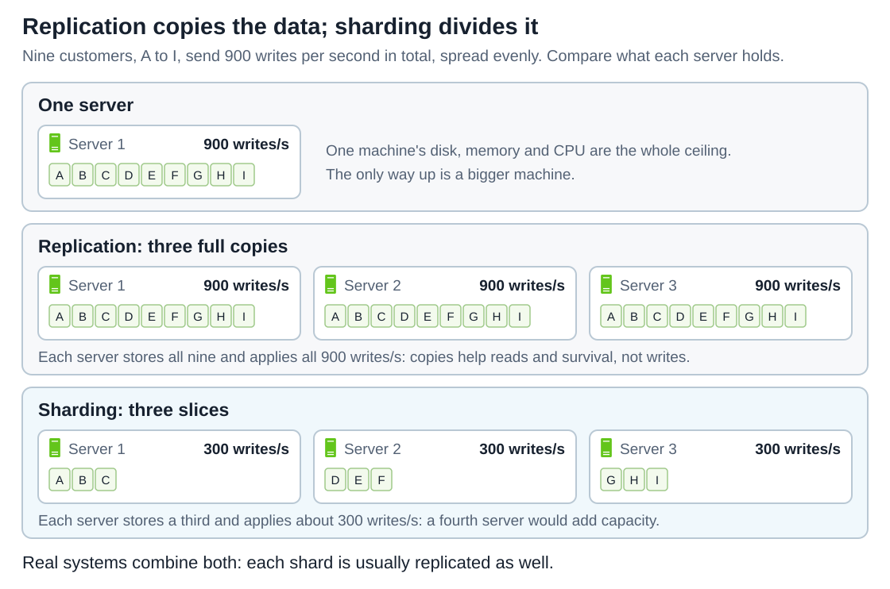
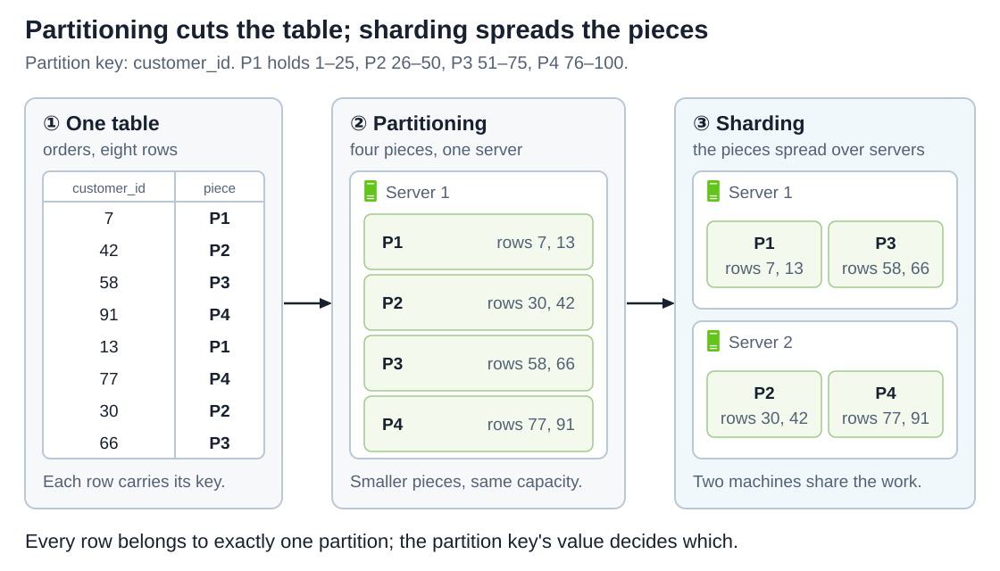
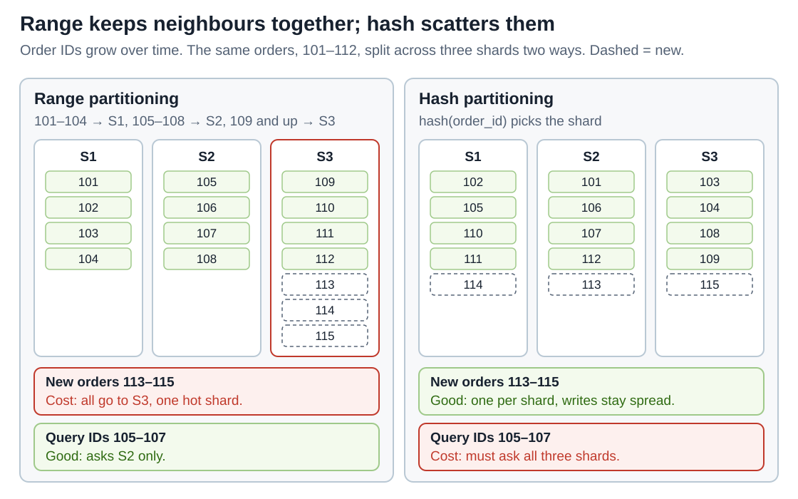
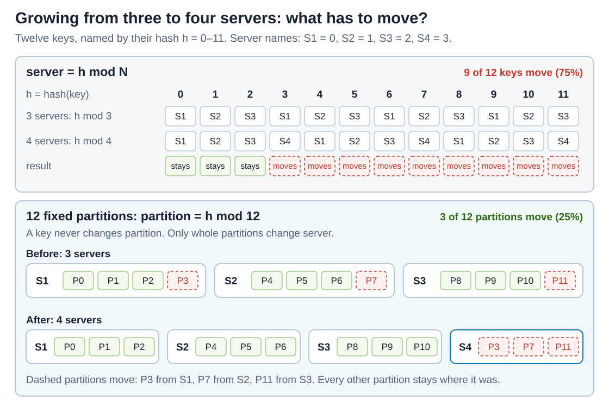
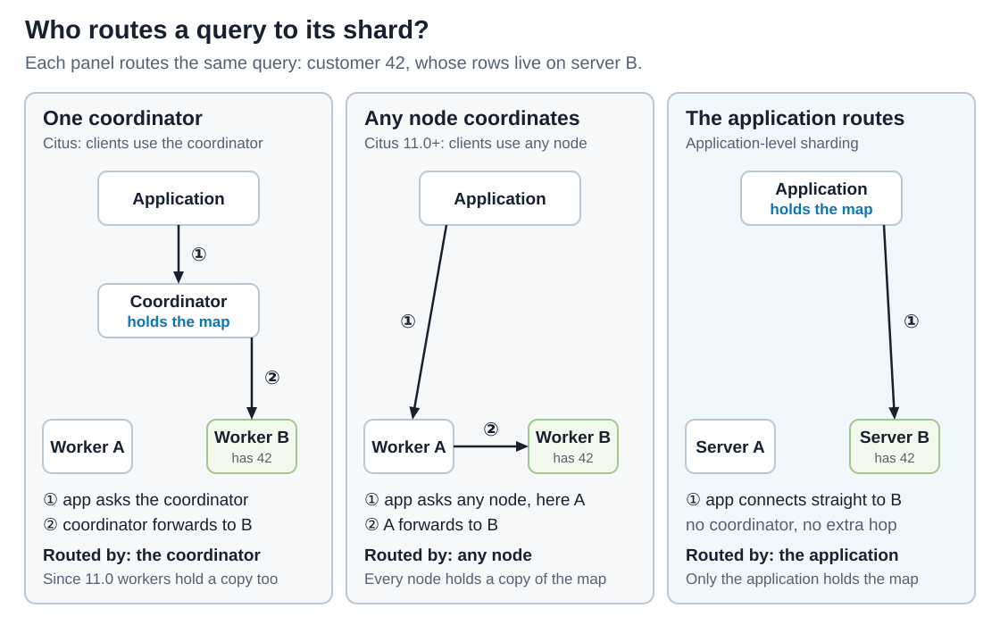
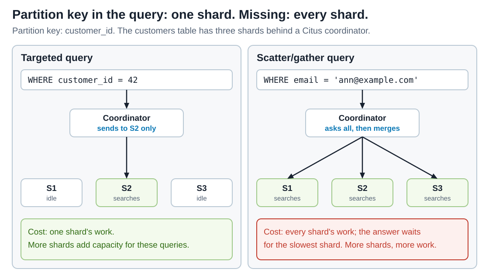
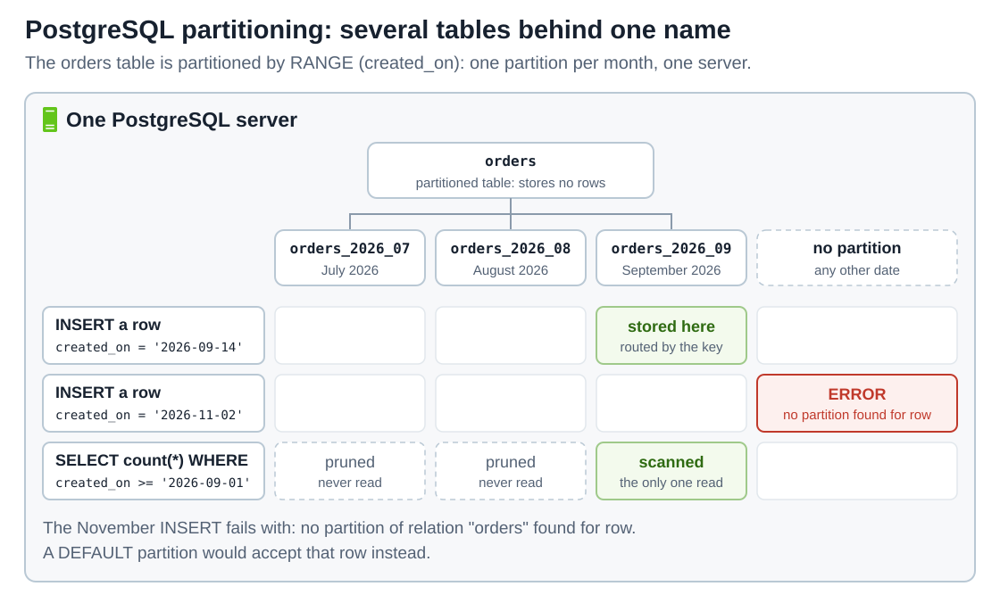
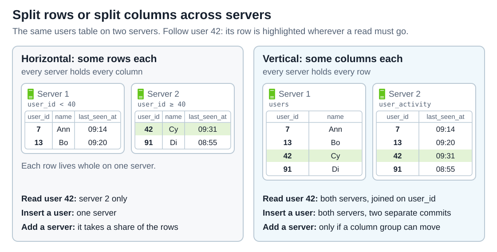
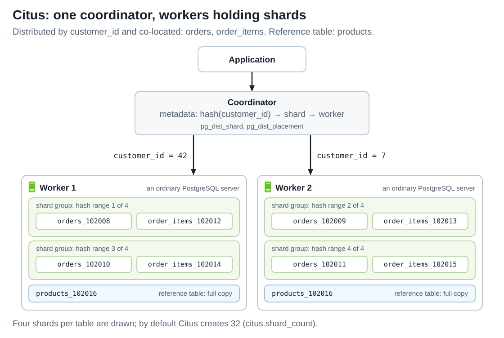

# Sharding

<sub>[Back to Distributed Systems](../Readme.md#content)</sub>

**Sharding** splits one dataset into disjoint pieces and stores different pieces on different servers, so that each server holds — and does the work for — only part of the data. It is how a database outgrows one machine: adding servers adds storage and write capacity, which copying the same data to more servers cannot do.

The article first shows why one server runs out and what the words *partition* and *shard* mean. It then covers the three decisions every sharded system makes — how to split the keys, how to move pieces when servers change, and how a request finds its piece — and what sharding costs. Two PostgreSQL sections then apply all of it: partitioning inside one server, then splitting rows or columns across servers and three ways to shard a database. A short quiz closes the article.

1. [Why one server stops being enough](#1-why-one-server-stops-being-enough)
2. [Partitions and shards](#2-partitions-and-shards)
3. [Choosing how to split](#3-choosing-how-to-split)
4. [Adding servers: rebalancing](#4-adding-servers-rebalancing)
5. [Finding the right shard: routing](#5-finding-the-right-shard-routing)
6. [What sharding costs](#6-what-sharding-costs)
7. [PostgreSQL: partitioning on one server](#7-postgresql-partitioning-on-one-server)
8. [PostgreSQL: sharding across servers](#8-postgresql-sharding-across-servers)
9. [Check your understanding](#9-check-your-understanding)

Every example uses PostgreSQL, in four setups that §7 and §8 cover in depth: its built-in **declarative partitioning**, which splits a table on one server; the **`postgres_fdw`** extension, which lets one PostgreSQL server use tables stored on another; the **Citus** extension, which spreads tables over a group of PostgreSQL servers; and **application-level sharding**, where the application itself picks the server, as Notion did. PostgreSQL behaviour follows version 18, the current release when this was written in September 2026; version 19 was then in beta. Citus follows release 14. Customer IDs, order IDs, shard IDs and hash placements in the diagrams are teaching examples.

## 1. Why one server stops being enough

A single database server has three ceilings: how much it can **store**, how many **writes** its CPU and disk can apply, and how much of the frequently used data — the **working set** — fits in memory. Notion's single PostgreSQL server showed what reaching them looks like in 2020. Engineers "often woke up to database CPU spikes", and **VACUUM**, PostgreSQL's cleanup of dead row versions, "began to stall consistently, preventing the database from reclaiming disk space from dead tuples". Worse was the prospect of **transaction ID wraparound**, "a safety mechanism in which Postgres would stop processing all writes to avoid clobbering existing data."

There are two ways out.
* **Vertical scaling** buys a bigger machine, which works until the largest available machine is not big enough.
* **Horizontal scaling** divides the data and the load over several machines.

Horizontal scaling comes in two forms that are easy to confuse:
* **Replication** keeps a full copy of the data on several servers.
* **Sharding** gives each server a different part of it. Read the three bands below from top to bottom and compare the write load printed on each server.



Replication cannot lower the write load per server: every copy must apply every write, or it stops being a copy. PostgreSQL's **streaming replication** shows this directly. Every change is first recorded in the **WAL**, the write-ahead log that the [Write-ahead log (WAL)](../Write-ahead%20log%20%28WAL%29/Readme.md) article follows through PostgreSQL 18, and the primary "streams WAL records to the standby as they're generated"; each standby replays all of them. What replication buys is read capacity, because a **hot standby** can "run read-only queries", and survival of a failed machine, because a standby can take over from a failed primary. Sharding divides the write load itself, because each write goes only to the server that owns that customer.

The two are combined, not chosen between: shard the data, then replicate each shard. Citus keeps each of its data servers, called **workers**, available this way: it "replicates entire worker nodes by continuously streaming their WAL records to a standby."

## 2. Partitions and shards

* A **partition** is one piece of a dataset split by rows. Every row belongs to exactly one partition, so the partitions do not overlap and together they hold everything. This is **horizontal** partitioning; splitting a table's *columns* into separate tables is **vertical** partitioning. [§8](#horizontal-or-vertical-splitting-across-servers) shows how each works when the pieces sit on different servers;
* The **partition key** is the column, or set of columns, whose value decides a row's partition. Citus calls it the **distribution column**;
* **Sharding** is partitioning whose pieces are spread over several servers, called **nodes**. A **shard** is a piece stored on a node; what counts as one piece differs between setups, as the table below shows.

The diagram separates the two steps. Follow one row, customer 42, from left to right: its key decides its piece, P2, and the placement of P2 decides its server.



Step ② on its own is what PostgreSQL calls partitioning: "splitting what is logically one large table into smaller physical pieces", all on one server. It makes a large table easier to manage and query, but the server's capacity does not change. Step ③ is sharding. Wikipedia puts the boundary the same way: horizontal partitioning splits tables "usually within a single instance of a schema and a database server", while sharding distributes the pieces across servers.

Two naming traps follow from this.

**Each PostgreSQL setup names the pieces differently.** The table separates the piece — the unit that moves when data is rebalanced — from the thing that holds it. Citus's pieces are cut from a hash of the key, which [§3](#3-choosing-how-to-split) explains.

| Setup | The piece | What holds the pieces |
| --- | --- | --- |
| Declarative partitioning | partition, an ordinary table such as `orders_2026_09` | the same one server |
| `postgres_fdw` | foreign partition, a partition whose table lives on another server | that remote PostgreSQL server |
| Citus | shard, an ordinary table holding one range of hash values, such as `orders_102008` | worker, a PostgreSQL server |
| Application-level sharding at Notion | logical shard, a PostgreSQL schema holding one copy of every sharded table | physical database, 15 logical shards each |

The word *shard* is the trap: Notion's logical shard is a whole schema holding one copy of every sharded table, while a Citus shard is one table, and each distributed table has its own 32 by default. Check which meaning a setup uses before comparing its shard count with another's.

**A network partition is unrelated.** It is a fault that cuts nodes off from one another — the "P" of the CAP theorem in the [Key-Value Store](../../system%20design/06.%20Key-Value%20Store/Readme.md#cap-theorem) chapter — not a piece of data.

## 3. Choosing how to split

Splitting takes two decisions: which column is the partition key, and which method maps its values to partitions.

### Choosing the partition key

Everything else depends on the partition key. Citus's guidance for choosing a distribution column names three properties to check:

* **Cardinality** — how many distinct values the key has. Rows with the same value cannot be separated, so the number of values caps the number of useful pieces. Citus's example of a poor choice is an order `status` with the values "new," "paid," and "shipped": "The number of distinct values limits the number of shards that can hold the data, and the number of nodes that can process it.";
* **Even distribution** — how often each value occurs. On a key "skewed to certain common values", data "will tend to accumulate in certain shards", and "The nodes holding those shards will end up doing more work than other nodes.";
* **Monotonic change** — whether new values always increase, like timestamps and ever-growing order IDs. Whether this hurts depends on the mapping method, covered next.

The key should also appear in the most common queries. When a query names it, Citus "routes the query to a single worker node for processing"; a query that does not must ask every shard, the cost [§6](#6-what-sharding-costs) returns to.

### Mapping keys to partitions

With a key chosen, there are three ways to map its values to partitions: **range**, **hash** and **directory**. The diagram compares range and hash on the same twelve orders and the same three shards; read it row by row, and note one good result and one cost on each side. Directory partitioning follows, and the last part shows how Citus combines range and hash.



#### **Range partitioning**

Each partition holds a contiguous interval of key values, so neighbouring keys land together. PostgreSQL's `RANGE` partitioning works this way, and `postgres_fdw` can put each range on a different server.

* **Good: range reads stay on one shard.** In the left panel, orders 105–107 all sit on S2, so a query for them asks S2 only;
* **Cost: a growing key creates a hot spot.** A **hot spot** is one shard receiving a disproportionate share of the load. Order IDs only grow, so every new order falls into the last range, "109 and up", and the server holding it takes every insert. On a single PostgreSQL server this changes nothing, because that server takes every write anyway; once `postgres_fdw` places the ranges on different servers, one server does all the writing while the others sit idle.

#### **Hash partitioning**

The key first goes through a hash function, which turns it into a well-mixed number, and ranges or remainders of that number then pick the partition, so neighbouring keys land apart. A PostgreSQL `HASH` partition holds "the rows for which the hash value of the partition key divided by the specified modulus will produce the specified remainder", and each Citus shard holds one range of hash values.

* **Good: writes stay spread.** In the right panel, new orders 113–115 land one per shard;
* **Cost: range reads ask every shard.** After hashing, neighbouring keys land on unrelated shards. The router can pick shards only from equality conditions, whose values it hashes; it does not list the values inside a range, so a query for orders 105–107 asks all three shards — even S3, which in the right panel holds none of them. An equality lookup such as `order_id = 106` still goes to one shard, because hashing that single value names its shard. Citus warns about this cost for time columns: "A hash distribution based on time will distribute times seemingly at random into different shards rather than keeping ranges of time together in shards", while time queries usually ask for a range, such as the most recent data.

#### **Directory partitioning**

An explicit lookup table maps each key, or group of keys, to its partition, and every read and write consults it. PostgreSQL's `LIST` partitioning is the static form: each partition names the key values it holds.

* **Good: flexibility.** Any key can be assigned to any partition, which makes a directory the most flexible of the three methods;
* **Cost: one more piece of state.** The lookup table must always be available and correct, because no read or write can find its partition without it.

#### **Combining hash and range**

Citus answers its own warning about time columns by using both methods: hash-distribute by a tenant or entity ID, and "Use PostgreSQL table partitioning for time instead". A **tenant** is one customer of an application that serves many customers from the same tables, such as a company account or a Notion workspace. Most rows belong to exactly one tenant, and the `customer_id` in this article's examples is a tenant ID.

Hashing by tenant spreads the writes, and the time partitions keep each range of time in its own tables; a partitioned table can itself be distributed, and then each time partition gets its own set of shards.

## 4. Adding servers: rebalancing

Data grows, servers are added and removed, and some pieces get hotter than others. **Rebalancing** moves data between nodes to even out the load. The aim is to move as little as possible, because every moved byte crosses the network while the system keeps serving traffic. This section first shows why the obvious rule, `hash(key) mod N`, misses that aim. It then covers the two strategies PostgreSQL sharding setups use instead, **fixed partitions** and **dynamic splitting**, and finally how a piece moves while it still receives writes. A third well-known strategy, **consistent hashing**, places nodes and keys on a ring of hash values; none of this article's setups use it, and the [Consistent Hashing](../../system%20design/05.%20Consistent%20Hashing/Readme.md) chapter builds it step by step.

### Why `hash(key) mod N` fails

The obvious hash rule, `server = hash(key) mod N`, moves far too much. Change `N` and almost every remainder changes, so almost every key must move. It is the same rule PostgreSQL's `HASH` partitioning applies to partitions on one server, which is why [§7](#choosing-the-key-and-the-number-of-partitions) grows such a table one partition at a time instead of changing every modulus. The top panel below grows a cluster from three servers to four; compare the two middle rows cell by cell.



### Fixed partitions

The diagram's bottom panel shows this strategy: **create many more partitions than servers, never change the key-to-partition rule, and move whole partitions.** No key is ever rehashed; only the small partition-to-server map changes. The new server takes one partition from each old server — a quarter of the data, the least any scheme can move to give four servers equal shares.

PostgreSQL sharding setups use large fixed counts:

* **Citus** creates 32 shards per distributed table by default and moves whole shards when rebalancing, as [§8](#8-postgresql-sharding-across-servers) shows. For multi-tenant applications it suggests 32 shards below about 100 GB and 64 or 128 for larger workloads, which "means that you have the leeway to scale from 32 to 128 worker machines";
* **Notion** split its PostgreSQL database into 480 logical shards on 32 physical databases. It chose 480 because it "is divisible by a lot of numbers", which lets the fleet grow "from 32 to 40 to 48 hosts" while every host keeps an equal number of shards.

The fixed count is also a ceiling — with 480 pieces, a 481st server has nothing to hold. Pick it for the largest cluster you expect, but not much larger, because every piece has a cost. In its advice for analytics queries, which span every shard, Citus warns that each such query opens "one database connection per shard, and these connections are limited".

### Dynamic splitting

Dynamic splitting avoids choosing the count up front: when one piece grows too large or too busy, cut it in two. Citus does this around a single tenant with `isolate_tenant_to_new_shard`, which moves that tenant's rows into a new shard of their own and splits the rest of the old shard into two, one on each side of the tenant's hash value. On one server, PostgreSQL 19 adds `SPLIT PARTITION` ([§7](#choosing-the-key-and-the-number-of-partitions)).

### Moving a piece while it takes writes

Moving a piece that is still receiving writes is a copy-then-catch-up procedure. Citus uses PostgreSQL **logical replication**, which streams row changes from one server to another: it "allows application reads and writes to continue uninterrupted while copying shard data", and Citus takes "a brief write-lock on a shard only during the time it takes to update metadata". What you observe during a rebalance is therefore extra network, disk and CPU load rather than an outage. The rebalance runs as a background job: `citus_rebalance_status()` reports its progress, and `citus_rebalance_stop()` "cancels a rebalance in progress".

## 5. Finding the right shard: routing

Every request has to reach the node that holds its key. That takes a map in two layers: key to partition, which is the partitioning rule, and partition to node, which changes whenever data is rebalanced. The design question is **who routes with the map**: one dedicated server, any server, or the application itself. Each panel below routes the same request; follow the circled numbers, then read each panel's last two lines for who routes and who holds a copy of the map.



* **One coordinator.** Applications connect to a single Citus server, the **coordinator**, which keeps the map in its metadata tables and forwards each query to the worker holding the shard ([§8](#8-postgresql-sharding-across-servers)). The cost is an extra network hop and one server that every query passes through. The coordinator stores no rows itself, so Citus judges it "not very likely that the coordinator becomes a bottleneck for read performance"; write-heavy workloads are the exception;
* **Any node coordinates.** Since Citus 11.0 the metadata is copied to every node by default, and "each node can act as the coordinator, capable of doing the distributed query processing." The first two panels are therefore the same cluster used two ways: they differ only in which node the client connects to. A client may connect to any node, which forwards the query to the worker holding the shard. The cost is connections: "In a single coordinator world, only the coordinator establishes connections per node. Now, each node connects to each other." Schema changes to tables distributed by a column, such as `ALTER TABLE`, still go through the original coordinator;
* **The application routes.** With application-level sharding there is no coordinator at all. The application holds the map, works out which database owns the key, and connects to it directly, as Notion's application maps a workspace ID to a logical shard and a logical shard to its physical database. No hop is added, but PostgreSQL itself never redirects a query sent to the wrong server, so after a shard moves, every application server must learn its new location before it can find that data.

The map itself is small, critical state that every router must agree on; its partition-to-node layer is a directory in [§3](#directory-partitioning)'s sense, with the same cost. Citus keeps it in metadata tables such as `pg_dist_shard` and `pg_dist_placement`, the names in §8's diagram, and protects the coordinator the same way as a worker: with streaming replication, "to create a hot standby of the coordinator". When every node holds a copy, Citus updates all the copies in one [two-phase commit](../Transactions.%20Two-phase%20commit/Readme.md), a protocol that commits a change on every node or on none, so "all the nodes in the cluster always have the same metadata".

## 6. What sharding costs

Sharding keeps an operation on *one* key as cheap as it is on a single, smaller database. Every operation that spans *many* keys gets harder, and these costs are what separate a good partition key from a bad one.

### Queries without the partition key

The Citus coordinator can send a query to one shard only if the query names the partition key. Otherwise it must send the query to every shard and merge the answers — a **scatter/gather** query. Compare the two panels below: the shards are the same, only the `WHERE` clause differs.



A scatter/gather query costs every shard's work, waits for the slowest shard, and opens a connection per shard ([§4](#fixed-partitions)), so adding shards makes each such query more expensive, not cheaper. Citus's guidance covers both kinds of workload. Analytics queries are meant to fan out: Citus "sends these queries to each shard for partial results and assembles the final answer on the coordinator node", and they "run fastest when as many nodes contribute as possible". An application serving many small requests wants the opposite, so Citus's advice for multi-tenant applications is that each query "should request information for one tenant at a time". On a single server, [§7](#7-postgresql-partitioning-on-one-server)'s partition pruning plays the same part: a query without the partition key reads every partition.

### Secondary indexes

An index on a non-key column such as `email` can be laid out in two ways:

* A **local index** lives inside each shard and covers only that shard's rows. PostgreSQL and Citus both work this way. An index on a partitioned table is "virtual": "the actual data is in child indexes on the individual partition tables". Citus passes `CREATE INDEX` on to the shards, so that "modifying a distributed table on the coordinator node will update shards on the workers too". A write touches one shard, but a lookup by `email` still asks every shard — the right-hand panel above;
* A **global index** is itself partitioned by the indexed value, so a lookup asks one index partition. Neither PostgreSQL nor Citus maintains one, so applications build it as a table: a lookup table from `email` to `user_id`, distributed by `email`. One user's write now touches two shards, and both changes belong in one transaction — in Citus, a two-phase commit, described below — so that a crash can never leave a user without a lookup row. The transaction does not make both rows appear at the same instant, though: a login in that brief window can still miss the new user, because each shard commits at its own moment.

Uniqueness has the same shape. Each shard can enforce a unique constraint only over its own rows, so a constraint is cheap to enforce only when it includes the partition key — equal values then always land on the same shard. PostgreSQL applies exactly this rule even on one server ([§7](#the-unique-key-rule)). Citus states that it "will not cross-reference uniqueness constraints or referential integrity between worker nodes", and requires the distribution column "in primary keys, foreign keys". IDs that must be unique across all shards therefore come from a generator that needs no cross-shard check; the [Unique ID Generator](../../system%20design/07.%20Unique-Id%20Generator/Readme.md) chapter compares the options.

### Joins and transactions across shards

A join or transaction that touches two shards turns a local operation into a network protocol. The main defence is **co-location**: shard related tables by the same key, so that rows joined together are stored together.

* Citus co-locates tables "distributed by columns of the same type with the same shard count";
* Notion sharded every table "reachable from the block table via some kind of foreign key relationship" by the same workspace ID, and "Since users typically query data within a single workspace at a time, we avoid most cross-shard joins."

Small tables that everything joins against can instead be copied in full to every node; Citus calls these **reference tables**.

A transaction that must still write to two shards needs an atomic commit protocol, usually two-phase commit, the protocol that keeps [§5](#5-finding-the-right-shard-routing)'s metadata copies in step. Atomic is not the same as simultaneous, and the gap surprises people. **Distributed snapshot isolation** would let every reader see all nodes as of one moment; Citus's multi-node transactions "do not provide distributed snapshot isolation guarantees", because each node commits its part at a slightly different moment. The symptom is a concurrent query that sees half of a transaction that did, in the end, commit completely.

### Hot keys and changing your mind

* **One hot key stays one hot key.** Sharding spreads *different* keys; every row of one very large or very busy tenant still shares one shard, because rows with the same distribution-column value are never separated. Citus notes that with many tenants there are usually "a few very large tenants, and many smaller ones". Its remedy is [§4](#dynamic-splitting)'s `isolate_tenant_to_new_shard` followed by moving that shard to a node of its own. The tenant then has a whole server, but never more than one. The [Scaling](../../system%20design/01.%20Scaling/Readme.md#horizontal-scaling-sharding) chapter calls this the celebrity problem;
* **Changing the partition key moves nearly everything.** Citus's `alter_distributed_table` can switch a table to a new distribution column, but each row's shard then follows the new column, so nearly every row changes shard. PostgreSQL's documentation warns that "re-partitioning large quantities of data can be painfully slow". Notion's first lesson was "Shard earlier": it waited until the old database was so strained that the migration itself had to avoid adding load.

## 7. PostgreSQL: partitioning on one server

PostgreSQL has built-in **declarative partitioning**. With ordinary partitions, which this section uses, all of it happens on one server; [§8](#foreign-partitions-with-postgres_fdw) shows how one partition can live on another server. Its point is to let that server skip work on a very large table — read only the partitions a query needs, drop a month of old data at once — not to add capacity: every partition still shares one server's disk, memory and CPU, so declarative partitioning is §2's step ②, not step ③. Spreading data over servers is [§8](#8-postgresql-sharding-across-servers)'s subject. Declarative partitioning arrived in PostgreSQL 10 with range and list partitioning; PostgreSQL 11 added hash partitioning, a default partition, and primary keys and indexes on partitioned tables.

A **partitioned table** is declared with `PARTITION BY` and "is a "virtual" table having no storage of its own." Its **partitions** are "otherwise-ordinary tables", and inserted rows are "routed to the appropriate one of the partitions based on the values of the partition key column(s)." The diagram below uses this table:

```sql
CREATE TABLE orders (
    order_id    bigint NOT NULL,
    customer_id bigint NOT NULL,
    created_on  date   NOT NULL,
    total       numeric(12, 2),
    PRIMARY KEY (order_id, created_on)
) PARTITION BY RANGE (created_on);

CREATE TABLE orders_2026_07 PARTITION OF orders
    FOR VALUES FROM ('2026-07-01') TO ('2026-08-01');
CREATE TABLE orders_2026_08 PARTITION OF orders
    FOR VALUES FROM ('2026-08-01') TO ('2026-09-01');
CREATE TABLE orders_2026_09 PARTITION OF orders
    FOR VALUES FROM ('2026-09-01') TO ('2026-10-01');
```

A range's lower bound is inclusive and its upper bound exclusive, so neighbouring partitions can share the bound `'2026-08-01'` without overlapping. Read the diagram's grid one statement per row; each column is a partition, except the last, which stands for dates no partition accepts.



* **Routing.** The September row goes to `orders_2026_09`. The November row matches no partition and fails with `no partition of relation "orders" found for row`. A default partition, `CREATE TABLE orders_default PARTITION OF orders DEFAULT;`, would accept it instead, at two costs. First, adding a partition later scans the default partition for rows that belong to the newcomer, unless a `CHECK` constraint on it rules them out, and fails if it finds any: once the November row sits in `orders_default`, creating `orders_2026_11` fails with `updated partition constraint for default partition "orders_default" would be violated by some row` until that row is moved out. Second, `DETACH PARTITION ... CONCURRENTLY` "is not allowed if the partitioned table contains a default partition";
* **Pruning.** For `WHERE created_on >= '2026-09-01'` the planner proves that the July and August partitions "could not contain any rows meeting the query's WHERE clause" and leaves them out of the plan; `EXPLAIN` lists only the partitions that remain. The `enable_partition_pruning` setting controls it and is on by default, and pruning also happens during execution for values unknown at planning time, such as prepared-statement parameters;
* **Cheap deletion.** Removing a month is `DROP TABLE orders_2026_07` or `ALTER TABLE orders DETACH PARTITION orders_2026_07 CONCURRENTLY` — "far faster than a bulk operation", and free of the `VACUUM` work a large `DELETE` leaves behind. The `CONCURRENTLY` form arrived in PostgreSQL 14 and locks the parent only with `SHARE UPDATE EXCLUSIVE`, so it does not block other sessions using the table.

### The unique-key rule

Declare `PRIMARY KEY (order_id)` instead, and PostgreSQL refuses with `unique constraint on partitioned table must include all partitioning columns`. It is §6's local-index problem on one machine: "the individual indexes making up the constraint can only directly enforce uniqueness within their own partitions". Including `created_on` lets the partition structure guarantee that two equal keys can never sit in different partitions. The price is that the database now checks `(order_id, created_on)`, not `order_id` alone; if order IDs must be unique on their own, the ID generator has to guarantee it.

### Choosing the key and the number of partitions

The documentation's advice matches [§3](#choosing-the-partition-key): partition by "the column or set of columns which most commonly appear in WHERE clauses". The planner handles "up to a few thousand partitions fairly well", provided typical queries prune all but a few. And partitioning pays off only for very large tables — "a rule of thumb is that the size of the table should exceed the physical memory of the database server."

Hash partitioning gives each partition a modulus and a remainder:

```sql
CREATE TABLE events (
    customer_id bigint NOT NULL,
    payload     jsonb
) PARTITION BY HASH (customer_id);

CREATE TABLE events_p0 PARTITION OF events FOR VALUES WITH (MODULUS 4, REMAINDER 0);
CREATE TABLE events_p1 PARTITION OF events FOR VALUES WITH (MODULUS 4, REMAINDER 1);
CREATE TABLE events_p2 PARTITION OF events FOR VALUES WITH (MODULUS 4, REMAINDER 2);
CREATE TABLE events_p3 PARTITION OF events FOR VALUES WITH (MODULUS 4, REMAINDER 3);
```

Growing it resembles [§4](#dynamic-splitting)'s dynamic splitting: one piece at a time is cut in two, instead of changing `N` for every key. The moduli need not all match, provided each "is a factor of the next larger modulus". So `events_p0` (modulus 4, remainder 0) can be detached and replaced by two partitions with modulus 8, remainders 0 and 4. A hash that leaves remainder 0 when divided by 4 leaves 0 or 4 when divided by 8, so only `events_p0`'s rows are reinserted, and the other three partitions are untouched. That still moves data, but it is "better than having to create a whole new table and move all the data at once."

PostgreSQL 19, in beta as of September 2026, adds `ALTER TABLE ... SPLIT PARTITION` and `ALTER TABLE ... MERGE PARTITIONS` for range and list partitioning, not hash. Both take an `ACCESS EXCLUSIVE` lock on the parent table and keep it while they copy rows into the new partitions. It is the one lock mode that blocks even a plain `SELECT`, so every query on the table waits until the command finishes. The documentation warns that the copy "can take a long time" and advises against using `SPLIT PARTITION` to cut a small fraction of rows out of a very big partition.

## 8. PostgreSQL: sharding across servers

PostgreSQL has no built-in sharding, so every way to spread one database over servers is built on top of it. This section first settles how to cut a table once its pieces sit on different servers: by rows or by columns. It then builds the three ways to shard by rows — foreign partitions with `postgres_fdw`, the Citus extension, and application-level sharding — and ends with a table comparing them with §7's single-server partitioning.

### Horizontal or vertical: splitting across servers

§2 separated two ways to cut a table: by rows, which is **horizontal** partitioning, and by columns, which is **vertical** partitioning. Once the pieces sit on different servers, the cut decides what each server holds, and so which servers every read and write has to reach. The diagram splits the same four users both ways; follow user 42 through each panel.



* **Horizontal: each server holds some rows, with every column.** The partition key picks the server, so reading or writing one user reaches one server, and a new server takes a share of the rows ([§4](#4-adding-servers-rebalancing)). This is sharding, and all three setups in the rest of this section work this way;
* **Vertical: each server holds every row, but only some columns.** Wikipedia describes it as "storing infrequently used or very wide columns, taking up a significant amount of memory, on a different machine", and names a common form: "to split static data from dynamic data". In the diagram a user's name stays on server 1 and the constantly changing `last_seen_at` moves to server 2. Despite the name, this has nothing to do with §1's vertical scaling: no machine gets bigger.

In PostgreSQL a vertical split across servers is two ordinary tables that share the primary key — `users` on server 1 and `user_activity` on server 2 — connected by the `postgres_fdw` extension. It makes a table on another PostgreSQL server appear on the local one as a **foreign table**, so server 1 can query `user_activity` as if it were local. Between the servers, each operation then works like this:

* **Updating the busy columns** touches only server 2, and a query over `last_seen_at` for every user reads only server 2. This is the payoff: the constantly changing half no longer shares a server with the rest;
* **Reading a whole user** is a join across servers. `postgres_fdw` keeps it small by "sending query WHERE clauses to the remote server for execution, and by not retrieving table columns that are not needed for the current query", so server 2 returns only user 42's row. But it can hand a whole join to the other side only "between foreign tables on the same foreign server", and a vertical split puts the halves on different servers by design, so every whole-row read pays at least one extra network round trip;
* **Creating a user** writes a row on each server, and the two must commit together. `postgres_fdw` commits the remote part without two-phase commit — the first limit in [the next subsection](#foreign-partitions-with-postgres_fdw) — so a crash between the two commits leaves a user with only half a row.

That last cost is why Notion kept related data together. With "a block stored in one database, with related comments in another database", deleting the block "could succeed while the comment update fails", because "transactionality guarantees only apply within each datastore". Notion sharded every table related to blocks by the same workspace ID, so all of a workspace's related rows share a server, and it left the other tables in its main database.

So a vertical split rarely carries a PostgreSQL database past one server on its own. It moves load only as far as the column groups go — two groups, two servers — and every server still holds every row, so a growing number of rows fills all of them. The tables that keep growing need their rows split across servers, which the rest of this section builds.

### Foreign partitions with postgres_fdw

The smallest horizontal step reuses §7. A foreign table can also be a partition — "Partitions can also be foreign tables" — so putting different partitions on different servers makes one partitioned table span several machines. Here the `events` table from §7 gets a remote partition:

```sql
CREATE EXTENSION postgres_fdw;

CREATE SERVER shard_2 FOREIGN DATA WRAPPER postgres_fdw
    OPTIONS (host 'shard-2.internal', dbname 'shop', async_capable 'true');
CREATE USER MAPPING FOR app_user SERVER shard_2
    OPTIONS (user 'app_user', password 'change-me');

-- Take the local events_p2 from §7 out of the table; its rows stay in a standalone table.
ALTER TABLE events DETACH PARTITION events_p2;

CREATE FOREIGN TABLE events_p2_remote PARTITION OF events
    FOR VALUES WITH (MODULUS 4, REMAINDER 2)
    SERVER shard_2 OPTIONS (table_name 'events_p2');
```

The server `shard-2.internal` must already have a table `events_p2` with the same columns, and the detached rows must be copied there. The local planner still prunes partitions, `postgres_fdw` sends `WHERE` clauses to the remote server so fewer rows cross the network, and with `async_capable`, added in PostgreSQL 14, partitions on different servers are scanned concurrently instead of one after another.

The limits are what make this *sharding by hand*:

* **No atomic commit.** Each remote transaction "is committed or aborted when the local transaction commits or aborts" — by default one server after another — and "it is currently not supported by postgres_fdw to prepare the remote transaction for two-phase commit." A crash between two of those commits can leave one shard committed and the other not: the gap the [two-phase commit](../Transactions.%20Two-phase%20commit/Readme.md#why-two-independent-commits-are-insufficient) article opens with;
* **You enforce the partition rule.** It is "the user's responsibility that the contents of the foreign table satisfy the partitioning rule"; the documentation recommends a matching constraint on the remote server;
* **No unique keys, no rebalancing.** A foreign table cannot become a partition "if there are UNIQUE indexes on the parent table" — that is why `events` has no primary key. Moving data between servers is a manual job.

### Citus

Citus, the extension behind most examples so far, is open source and turns a group of PostgreSQL servers into one distributed database. One node is the coordinator and the others are workers, the roles [§5](#5-finding-the-right-shard-routing) introduced. Applications connect to the coordinator, which keeps metadata about where every shard lives and, for each query, "either routes it to a single worker node, or parallelizes it across several". The shards themselves "are actually just regular PostgreSQL tables on the worker nodes". Read the diagram from the top: the application, the coordinator with its metadata, then the tables each worker actually holds.



The setup for the diagram's three tables, run on the coordinator after each worker has been added with `citus_add_node`. These are new tables, not §7's partitioned `orders`:

```sql
CREATE TABLE orders (
    customer_id bigint NOT NULL,
    order_id    bigint NOT NULL,
    created_on  date   NOT NULL,
    PRIMARY KEY (customer_id, order_id)
);
CREATE TABLE order_items (
    customer_id bigint NOT NULL,
    order_id    bigint NOT NULL,
    line_no     int    NOT NULL,
    product_id  bigint NOT NULL,
    PRIMARY KEY (customer_id, order_id, line_no)
);
CREATE TABLE products (
    product_id bigint PRIMARY KEY,
    name       text   NOT NULL
);

SELECT create_distributed_table('orders', 'customer_id');
SELECT create_distributed_table('order_items', 'customer_id', colocate_with => 'orders');
SELECT create_reference_table('products');
```

* Both distributed tables' primary keys start with `customer_id`. Citus, like PostgreSQL's own partitioning, can enforce uniqueness only when the key includes the distribution column. Declare `PRIMARY KEY (order_id)` instead, and `create_distributed_table` fails with `cannot create constraint on "orders"`, because "Distributed relations cannot have UNIQUE, EXCLUDE, or PRIMARY KEY constraints that do not include the partition column";
* `create_distributed_table` hash-distributes a table on the given column into `citus.shard_count` shards, 32 by default, and copies any existing rows to the workers. The originals stay on the coordinator — its notice reads "The local data in the table is no longer visible, but is still on disk" — until `truncate_local_data_after_distributing_table` removes them;
* `colocate_with` places each `order_items` shard on the same worker as the `orders` shard for the same hash range, so a join on `customer_id` for one customer runs inside one worker. Tables are co-located by default when "distributed by columns of the same type with the same shard count"; naming the table makes the intent explicit;
* `create_reference_table` makes "a distributed table with just one shard, replicated to every worker node", so every worker can join against `products` locally.

Each cost from §6 has a concrete Citus answer:

* **Routing.** A statement filtered on `customer_id` goes to one worker; one without it is split into a fragment per shard, and the coordinator merges the results;
* **Transactions.** "For transactions that only involve a single worker node, Citus delegates responsibility to the worker node", which "provides the same guarantees as a single PostgreSQL server." A transaction that writes on several nodes uses PostgreSQL's two-phase commit, with a commit record on the coordinator for recovery — atomic, but without distributed snapshot isolation;
* **Adding a worker.** `citus_add_node` alone moves nothing: "Existing shards will stay where they are unless redistributed". Even a new table usually skips the new worker: when it is co-located with an existing table, its shards are placed on the same workers as that table's shards. Only a table that starts a new co-location group is spread over every worker, the new one included. `citus_rebalance_start()` then moves shards in a background job over logical replication, so reads and writes continue; the community edition has rebalanced without blocking since Citus 11.0;
* **Availability.** Each node is kept available the ordinary PostgreSQL way, with streaming replication to a standby server you run for it ([§1](#1-why-one-server-stops-being-enough)); the older option of copying each shard to several workers is deprecated.

Since Citus 12.0 there is a second model, **schema-based sharding**: each tenant gets its own PostgreSQL schema, which becomes the unit of distribution. It needs no distribution column and no query changes, at the cost of fewer tenants per node. Since Citus 14.1 its tables can also be created, altered and dropped from any node; schema changes to tables distributed by a column still go through the coordinator ([§5](#5-finding-the-right-shard-routing)).

### Application-level sharding

The third option keeps every database an ordinary PostgreSQL server and moves the routing into the application, which computes the shard from the key and connects to the right database. Notion did this in 2021 — it had considered Citus but "wanted control over the distribution of our data":

* the partition key is the workspace ID;
* 480 logical shards, each a PostgreSQL schema with its own set of the sharded tables (`schema001.block`, `schema002.block`, …), spread 15 per database over 32 physical databases;
* the application maps a workspace ID to a logical shard and a logical shard to its physical database.

It is [§4](#fixed-partitions)'s fixed-partition scheme built by hand. The price is that the application owns everything Citus would otherwise do: routing, cross-shard queries, rebalancing, and running every schema migration on every shard.

### Choosing among them

| Approach | Where the pieces live | Who routes | A transaction across servers |
| --- | --- | --- | --- |
| Declarative partitioning | one server | the planner | not applicable |
| `postgres_fdw` foreign partitions | several servers | the planner on the local server | independent commits, no two-phase commit |
| Citus | worker nodes | the coordinator, or since 11.0 any node, from the metadata | two-phase commit, no distributed snapshot |
| Application-level sharding | independent servers | application code | whatever the application builds |

Start at the top row when the problem is one very large table: pruning and cheap partition removal help on a single machine. Move down only when one server's storage or write capacity is the real limit.

## 9. Check your understanding

1. Two hot standbys were added to a PostgreSQL primary, yet writes still saturate the primary. Why, and what would help?

   <details>
   <summary>Answer</summary>

   Every standby replays every WAL record the primary writes, so replication copies the write load instead of dividing it; the standbys help only with reads and failover. Sharding divides it: each write goes only to the shard that owns its key.

   </details>

2. `orders` is range-partitioned by `created_on`, one partition per month, and `postgres_fdw` puts each month's partition on a different server. The server holding the current month is at full CPU while the others are idle. What is happening?

   <details>
   <summary>Answer</summary>

   Dates only grow, so every insert lands in the newest range, and that range's server takes all the writes — a hot spot. Citus's advice keeps time partitioning without the hot spot: hash-distribute by another key, such as `customer_id`, which spreads the inserts over all workers, and partition by time inside the distributed table.

   </details>

3. A Citus `orders` table is distributed by `status`, which has three values: `new`, `paid` and `shipped`. Why does a fourth worker add nothing?

   <details>
   <summary>Answer</summary>

   Cardinality. Rows with the same distribution-column value always share one shard, so three values fill at most three shards, and three shards can occupy at most three workers. Skew makes it worse: if most orders are `shipped`, one of those three shards does most of the work.

   </details>

4. A cluster places keys with `hash(key) mod N` and grows from three servers to four. Roughly how much data moves, and what do fixed partitions change?

   <details>
   <summary>Answer</summary>

   About three quarters: a key stays only if its hash leaves the same remainder mod 3 and mod 4. With many fixed partitions the key-to-partition rule never changes, so only whole partitions move — a quarter, the minimum for four equal shares.

   </details>

5. A Citus `users` table is distributed by `user_id`, and the login page looks users up by `email`. What does each lookup cost, and what is the usual fix?

   <details>
   <summary>Answer</summary>

   Without the distribution column the coordinator must send the query to every shard and wait for the slowest. Citus's indexes are per shard, so the usual fix is a lookup table from `email` to `user_id`, distributed by `email`, which the application updates in the same transaction and consults first.

   </details>

6. In a write-heavy Citus cluster, every query passes through the one coordinator, and it has become the bottleneck. What can change, and what still needs the original coordinator?

   <details>
   <summary>Answer</summary>

   Since Citus 11.0 every node already holds a copy of the metadata and can act as the coordinator, so client connections can be spread over several nodes; the cost is more connections between nodes. Schema changes for tables distributed by a column, from `create_distributed_table` itself to a later `ALTER TABLE`, must still go through the original coordinator.

   </details>

7. A partitioned table is declared `PRIMARY KEY (order_id)` with `PARTITION BY RANGE (created_on)`, and the statement fails. Why?

   <details>
   <summary>Answer</summary>

   Each partition's index enforces uniqueness only inside that partition, so PostgreSQL requires a unique constraint to include every partition-key column: `unique constraint on partitioned table must include all partitioning columns`. `PRIMARY KEY (order_id, created_on)` is accepted, but it no longer guarantees that `order_id` alone is unique.

   </details>

8. Is PostgreSQL's declarative partitioning sharding?

   <details>
   <summary>Answer</summary>

   Not on its own. With ordinary partitions every partition lives on the same server, so partitioning helps manage and query large tables but adds no storage or write capacity. It becomes sharding only when partitions are foreign tables on other servers, through `postgres_fdw`; Citus and routing in the application are the other ways to spread data across servers.

   </details>

9. `users` is split vertically: server 1 holds `users (user_id, name)` and server 2 holds `user_activity (user_id, last_seen_at)`, connected through `postgres_fdw`. What does reading one whole user cost, and what can go wrong when a user is created?

   <details>
   <summary>Answer</summary>

   Reading one user is a join across servers: `postgres_fdw` sends the `WHERE` clause to server 2 and fetches only that user's row, but every whole-row read pays an extra network round trip. Creating a user writes a row on each server, and `postgres_fdw` commits them one after the other without two-phase commit, so a crash between the commits leaves a user with only half a row.

   </details>

10. A Citus transaction moves money between two customers whose shards are on different workers, and it commits. Can a concurrent query see the debit without the credit?

    <details>
    <summary>Answer</summary>

    Yes, briefly. Two-phase commit makes the transaction atomic — both parts commit or neither does — but each worker commits at a slightly different moment, and Citus provides no distributed snapshot isolation.

    </details>

11. A fourth worker was added to a Citus cluster with `citus_add_node`, but it sits idle. Why?

    <details>
    <summary>Answer</summary>

    Adding a node does not move existing shards. A new table co-located with an existing one, which is the default for the same column type and shard count, also keeps its shards on the old workers; only a table that starts a new co-location group would use the new worker. `citus_rebalance_start()` moves shards onto it in the background while reads and writes continue.

    </details>

# Sources

Primary sources checked on 2026-09-23. PostgreSQL behaviour was read in the version 18 documentation, and its three quoted error messages and its rule for pruning hash partitions in the `REL_18_6` source; `SPLIT PARTITION` and `MERGE PARTITIONS` were read in the version 19 beta documentation. Citus facts come from its documentation and the v14.2.0 source; its distribution-column guidance was read in both the published page and the documentation's source file, `sharding/data_modeling.rst` in the `citus_docs` repository. Its default shard count, the placement of co-located shards, the pruning rule for hash-distributed tables, the notice left after copying local rows, and the error for a primary key without the distribution column were confirmed in the v14.2.0 source. The SQL examples follow the documented syntax but were not executed for this article.

- [PostgreSQL 18: Table Partitioning](https://www.postgresql.org/docs/18/ddl-partitioning.html)
- [PostgreSQL 18: CREATE TABLE — hash partition moduli](https://www.postgresql.org/docs/18/sql-createtable.html)
- [PostgreSQL 18: ALTER TABLE — default-partition scan on ATTACH PARTITION, DETACH PARTITION CONCURRENTLY](https://www.postgresql.org/docs/18/sql-altertable.html)
- [PostgreSQL 18: CREATE FOREIGN TABLE — foreign tables as partitions](https://www.postgresql.org/docs/18/sql-createforeigntable.html)
- [PostgreSQL 18: postgres_fdw — async execution, transaction management, remote query optimization](https://www.postgresql.org/docs/18/postgres-fdw.html)
- [PostgreSQL 18: Explicit Locking — ACCESS EXCLUSIVE blocks even SELECT](https://www.postgresql.org/docs/18/explicit-locking.html)
- [PostgreSQL 18: Log-Shipping Standby Servers — streaming replication](https://www.postgresql.org/docs/18/warm-standby.html)
- [PostgreSQL 18: Hot Standby — read-only queries on a standby](https://www.postgresql.org/docs/18/hot-standby.html)
- [PostgreSQL 19 (beta): ALTER TABLE — SPLIT PARTITION and MERGE PARTITIONS](https://www.postgresql.org/docs/19/sql-altertable.html)
- [PostgreSQL 10 release notes — declarative partitioning](https://www.postgresql.org/docs/release/10.0/)
- [PostgreSQL 11 release notes — hash partitioning, default partitions, keys and indexes](https://www.postgresql.org/docs/release/11.0/)
- [PostgreSQL 14 release notes — DETACH PARTITION CONCURRENTLY and async foreign scans](https://www.postgresql.org/docs/release/14.0/)
- [PostgreSQL source, REL_18_6: execPartition.c — "no partition of relation … found for row"](https://github.com/postgres/postgres/blob/REL_18_6/src/backend/executor/execPartition.c#L328-L335)
- [PostgreSQL source, REL_18_6: indexcmds.c — "unique constraint on partitioned table must include all partitioning columns"](https://github.com/postgres/postgres/blob/REL_18_6/src/backend/commands/indexcmds.c#L1107-L1112)
- [PostgreSQL source, REL_18_6: partbounds.c — "updated partition constraint for default partition … would be violated by some row"](https://github.com/postgres/postgres/blob/REL_18_6/src/backend/partitioning/partbounds.c#L3385-L3389)
- [PostgreSQL source, REL_18_6: tablecmds.c — CREATE TABLE … PARTITION OF checks the default partition's rows](https://github.com/postgres/postgres/blob/REL_18_6/src/backend/commands/tablecmds.c#L1199-L1201)
- [PostgreSQL source, REL_18_6: partprune.c — hash partitions are pruned only from equality clauses](https://github.com/postgres/postgres/blob/REL_18_6/src/backend/partitioning/partprune.c#L2722-L2726)
- [Citus: Concepts — coordinator, workers, table types, co-location](https://docs.citusdata.com/en/stable/get_started/concepts.html)
- [Citus: Choosing Distribution Column — cardinality, even distribution, timestamps, multi-tenant and real-time queries](https://docs.citusdata.com/en/stable/sharding/data_modeling.html)
- [Citus: Creating and Modifying Distributed Objects (DDL) — propagated DDL, indexes, constraints](https://docs.citusdata.com/en/stable/develop/reference_ddl.html)
- [Citus: Citus Utility Functions — create_distributed_table, create_reference_table, alter_distributed_table, citus_rebalance_start, status and stop](https://docs.citusdata.com/en/stable/develop/api_udf.html)
- [Citus: Cluster Management — shard count, adding nodes and coordinators, rebalancing, node failures, tenant isolation](https://docs.citusdata.com/en/stable/admin_guide/cluster_management.html)
- [Citus: Query Processing](https://docs.citusdata.com/en/stable/develop/reference_processing.html)
- [Citus technical documentation, v14.2.0 — transactions and two-phase commit](https://github.com/citusdata/citus/blob/v14.2.0/src/backend/distributed/README.md#transactions-2pc)
- [Citus technical documentation, v14.2.0 — query from any node](https://github.com/citusdata/citus/blob/v14.2.0/src/backend/distributed/README.md#query-from-any-node)
- [Citus source, v14.2.0: shared_library_init.c — citus.shard_count default](https://github.com/citusdata/citus/blob/v14.2.0/src/backend/distributed/shared_library_init.c#L2547-L2556)
- [Citus source, v14.2.0: create_distributed_table.c — co-located tables versus round-robin placement](https://github.com/citusdata/citus/blob/v14.2.0/src/backend/distributed/commands/create_distributed_table.c#L1976-L2000)
- [Citus source, v14.2.0: create_shards.c — co-located shards reuse the source table's placements](https://github.com/citusdata/citus/blob/v14.2.0/src/backend/distributed/operations/create_shards.c#L214-L299)
- [Citus source, v14.2.0: create_distributed_table.c — "no longer visible, but is still on disk"](https://github.com/citusdata/citus/blob/v14.2.0/src/backend/distributed/commands/create_distributed_table.c#L2723-L2739)
- [Citus source, v14.2.0: table.c — "cannot create constraint on …"](https://github.com/citusdata/citus/blob/v14.2.0/src/backend/distributed/commands/table.c#L3430-L3437)
- [Citus source, v14.2.0: shard_pruning.c — a hash-distributed table without an equality condition returns all shards](https://github.com/citusdata/citus/blob/v14.2.0/src/backend/distributed/planner/shard_pruning.c#L424-L432)
- [Citus README — shards as regular PostgreSQL tables, schema-based sharding](https://github.com/citusdata/citus/blob/v14.2.0/README.md)
- [Citus CHANGELOG — v11.0.2 turns metadata syncing on by default; v14.0.0 adds PostgreSQL 18 support; v14.1.0 runs schema-based sharding DDL from any node](https://github.com/citusdata/citus/blob/v14.2.0/CHANGELOG.md)
- [Herding elephants: Lessons learned from sharding Postgres at Notion (2021)](https://www.notion.com/blog/sharding-postgres-at-notion)
- [Wikipedia: Shard (database architecture)](https://en.wikipedia.org/wiki/Shard_%28database_architecture%29)
- [Wikipedia: Partition (database) — vertical partitioning](https://en.wikipedia.org/wiki/Partition_%28database%29)
