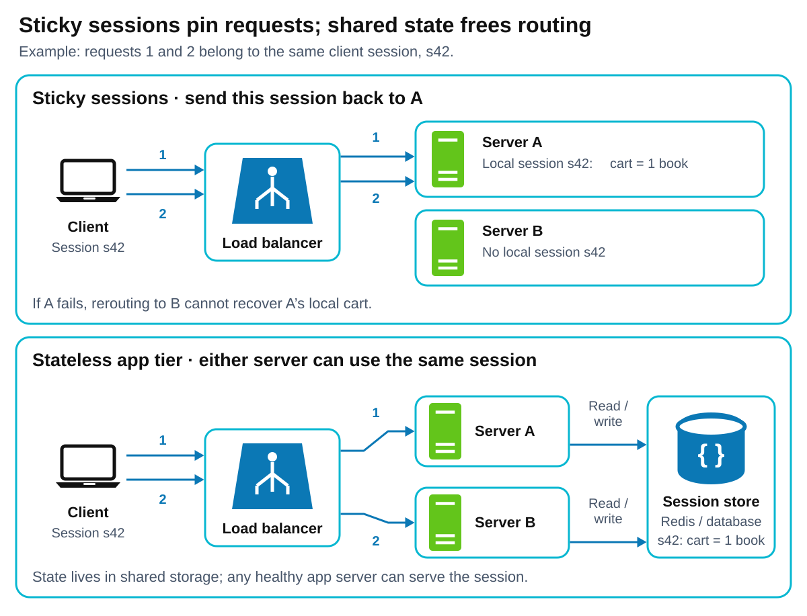

# Sticky Sessions

[Back to Distributed Systems](../Readme.md#content)

# Front

Why use sticky sessions, how do three common pinning mechanisms work and fail, what are the four costs, and what is the stateless alternative?

# Back

**Sticky sessions (session affinity)** make a load balancer route a client's related requests to the **same application server**, while the affinity remains valid and that server is available. This keeps requests near session state: data remembered between requests, such as a login or shopping cart.

## Why pin a client?

If server A alone holds your cart in memory, server B cannot continue that session. Pinning keeps you on A and avoids fetching shared session data on each request. It can also improve reuse of local cached data.

Compare the two designs: the upper flow returns to A; the lower flow lets A or B use the same shared session record.

## Three common pinning mechanisms

| Mechanism | How it pins | Weakness |
|---|---|---|
| **Balancer cookie** | The balancer sets a routing cookie; the client returns it with later web requests. | Requires cookie support. A blocked, deleted, or expired cookie breaks affinity. |
| **Source-IP hash** | A repeatable calculation (hash) maps the client's Internet Protocol (IP) address to a server. | Network address translation (NAT) or proxies can make many users share one IP and overload one server; changing IP can move a user. |
| **Application session identifier (ID)** | The balancer reads a stable ID from a request header, web address, or app cookie, then hashes it or looks up its server. | Every request must carry the key. Hashing can remap sessions when servers change; lookup tables need storage and, across balancers, synchronization. |

These mechanisms select a server; **they do not copy session data**.

## Four costs

1. **Uneven load:** a busy client stays on one server even when others have spare capacity.
2. **Fragile failover:** after failure or restart, requests may reach a healthy server that lacks the old local session, losing the cart or requiring login again.
3. **Weaker elasticity:** adding servers does not automatically spread existing pinned sessions across them. Hash-based reassignment can move clients away from their state.
4. **Harder deployments and removal:** replacing a server with local sessions means waiting for those sessions to finish, transferring their state, or accepting resets. Draining in-flight requests alone does not preserve whole sessions.

## Stateless alternative

Keep application servers **stateless between requests**: put session data in a shared Redis or database store. The client sends a session ID, often in a cookie; any healthy application server uses it to fetch the same state. The cookie identifies the session without pinning it to a server.

State still exists in the shared store, which needs its own availability and durability design. Application servers become easier to balance, replace, and scale.

# Sources

- [NGINX — IP and key hashing, cookies, and learned session mappings](https://docs.nginx.com/nginx/admin-guide/load-balancer/http-load-balancer/)
- [NGINX — shared and changing IP limitations](https://docs.nginx.com/nginx-gateway-fabric/traffic-management/session-persistence/)
- [HAProxy — application keys, persistence, and table replication](https://www.haproxy.com/documentation/haproxy-configuration-manual/new/latest/intro/#3.3.6)
- [AWS — sticky cookies, failover, rebalancing, and request draining](https://docs.aws.amazon.com/elasticloadbalancing/latest/application/edit-target-group-attributes.html#sticky-sessions)
- [Microsoft — affinity limits on load distribution and scaling](https://learn.microsoft.com/en-us/azure/architecture/guide/design-principles/scale-out)
- [Microsoft — local session storage, deployment costs, and shared stores](https://learn.microsoft.com/en-us/aspnet/core/fundamentals/app-state?view=aspnetcore-10.0#session-state)
- [Redis — shared session storage and durability](https://redis.io/docs/latest/develop/use-cases/session-store/)
