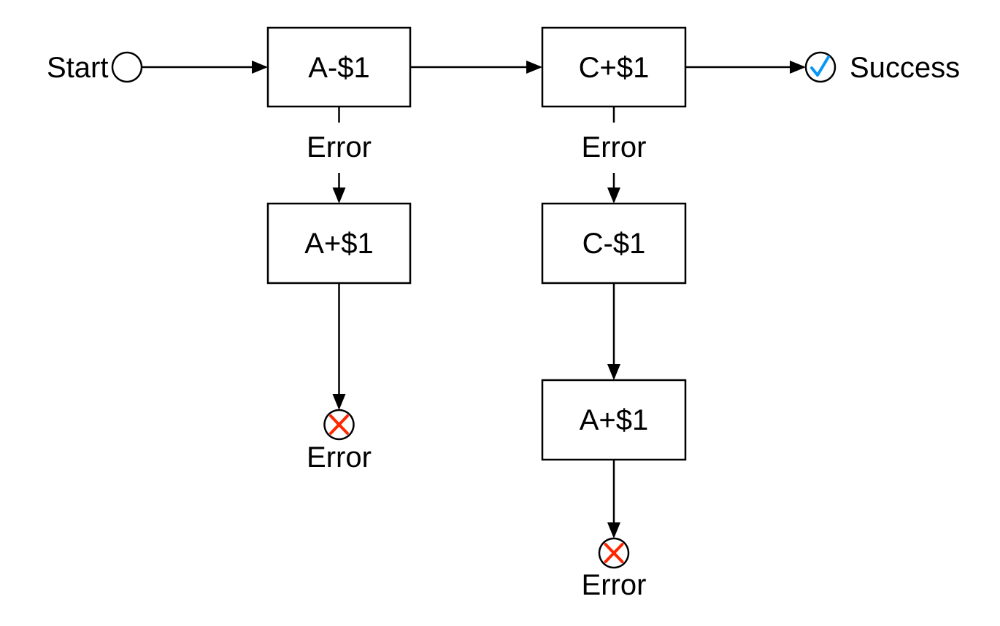
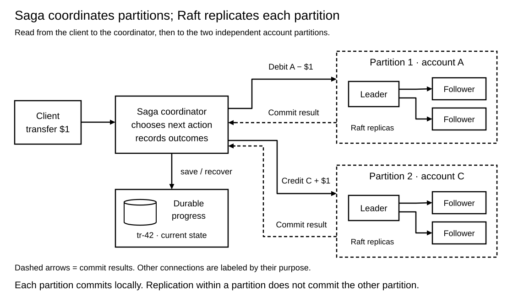
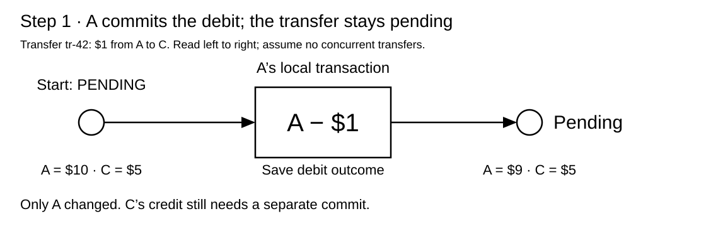
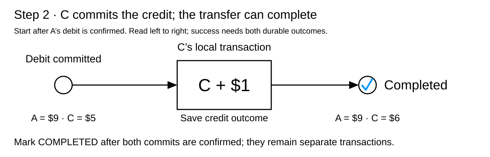
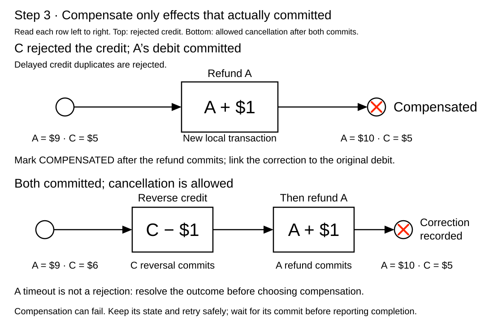
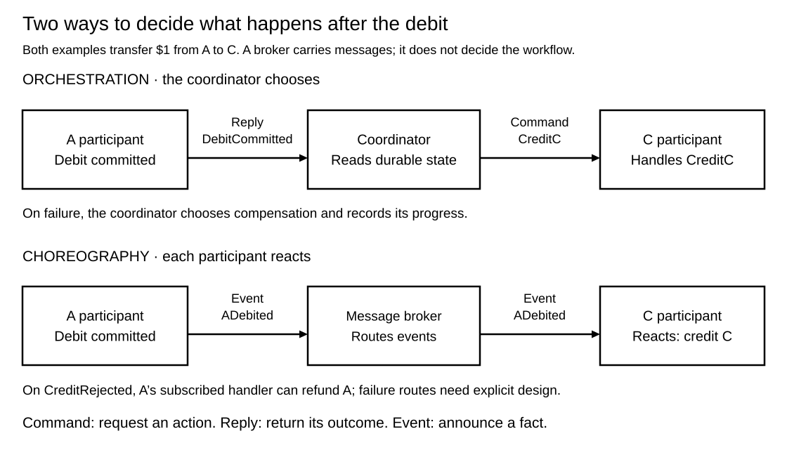
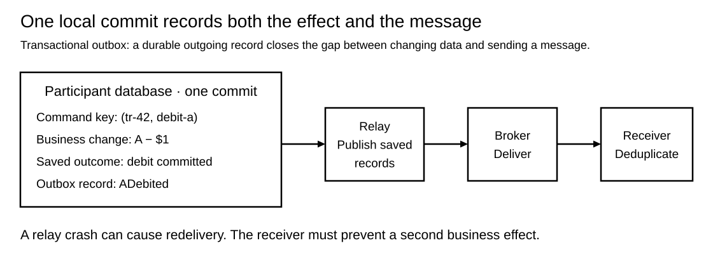

# Transactions. Saga

[Back to Distributed Systems](../Readme.md#content)

**A Saga coordinates a business operation as a sequence of independently committed local transactions.** If the operation cannot finish, it runs compensating transactions to repair the effects of completed work. Other operations can observe intermediate results, so a Saga does not provide the isolation or single atomic commit of one database transaction.

This article uses the repository's Digital Wallet design: transfer **$1 from account A to account C**, held in different partitions. It explains the architecture, successful and failed transfers, coordination styles, recovery mechanisms, and how Saga differs from Try-Confirm/Cancel (TCC).

## Why it is called Saga

**Saga is a name; the original paper gives no acronym expansion for SAGA.** Hector Garcia-Molina and Kenneth Salem introduced the term in their 1987 paper *Sagas*. Its acknowledgments credit **Bruce Lindsay** with suggesting the name.

In ordinary English, a *saga* is a long story or a complicated series of connected events. That gives us a useful memory aid: **the business operation is the story, and its local transactions are the chapters**. The paper does not explain Lindsay's reason for choosing the word, so this story analogy explains why the name fits rather than claiming a documented naming rationale.

## The problem: one operation, separate commit boundaries

A **local transaction** commits changes within one participant's transactional boundary. A **participant** is the service or partition responsible for that data. A **commit** makes the transaction's changes durable according to that participant's guarantees.

Suppose A has $10 and C has $5. The business request wants A to have $9 and C to have $6. If these accounts belong to independent databases, committing A's debit does not commit C's credit. A crash between the two leaves unfinished work.

A Saga makes that unfinished work explicit. Its **compensation** is another local transaction with a business-defined corrective effect: for example, refunding A after C definitively rejects the credit. **Eventual consistency** here means the workflow seeks a valid completed or compensated outcome through recovery; it does not promise an immediate result or a fixed completion time.

## Where Saga appears in the System Design material

The **Digital Wallet** chapter uses Saga both for a debit/credit flow and for coordination across account partitions. The diagrams below adapt its `saga.svg` and `sharded-raft-groups.svg`, retaining the A-to-C example while separating commit outcomes from communication failures. The original paths are listed under Sources.

The architecture below simplifies the chapter's full design. A **coordinator**, also called an **orchestrator**, records progress and directs participants. A **Raft group** uses consensus to replicate a partition's state across nodes; the leader coordinates replication to followers. Those replicas belong to the same partition. They do not make the two partitions commit together.

The durable progress store corresponds to the chapter's **Phase Status Table**. It records which actions are pending, completed, or being compensated. Saga does not require a table with that particular name or schema; the implementation needs durable information sufficient to recover its workflow. The full wallet diagram's separate read path and proxy routing are omitted here to keep the transaction boundaries visible. Raft and event sourcing—recording state changes as events—are choices in that wallet architecture, not requirements of Saga.

The **Hotel Reservation System** chapter also discusses Saga under data consistency across services. Its chosen design keeps dependent reservation and inventory updates in one relational database. An **invariant** is a rule that valid data must satisfy. That gives us a useful starting question: **can the invariant stay inside one local transaction?**

## Step 1 — Commit the debit in A's partition

Before this step, A has $10, C has $5, and transfer `tr-42` is pending. The request to transfer $1 triggers a debit command. A's participant validates the request and commits `A − $1` together with a durable record of that command's outcome.

After the coordinator learns that the debit committed, the balances are A = $9 and C = $5, and the transfer remains pending. C has not received the money yet. This is an intermediate state that the application must represent and recover from.

For this example, a definitively rejected debit ends the request without refunding anything. If the debit rolled back locally, there is no committed debit to compensate. A missing reply requires outcome resolution, described below.

## Step 2 — Commit the credit in C's partition

The confirmed debit triggers `C + $1`. C's participant commits the credit and its command result in its own local transaction. Once the coordinator has durable confirmation of both outcomes, it marks `tr-42` completed.

Now A = $9 and C = $6. These are two commits followed by a workflow decision. The coordinator's final status does not retroactively combine them into one database commit.

A client can receive a transfer identifier while the operation is pending and query its status later. An accepted request must be distinguishable from a completed transfer; otherwise the interface hides precisely the failure window the Saga must manage.

## Step 3 — Compensate after a confirmed failure

This is the alternative to successful completion. Assume A's debit committed, but C durably rejected the credit and will reject delayed duplicates of that command. The coordinator records a compensating state and requests `A + $1` as the correction for the original debit.

After that correction commits, A = $10 and C = $5, assuming no other transfers occurred. The transfer is **compensated**, not completed successfully. If the correction fails temporarily, the workflow stays unresolved and retries it; it must not claim compensation is finished.

The original wallet diagram also has a branch that reverses C's credit before refunding A. That branch makes sense only when C's credit actually committed and an allowed cancellation requires reversal. If C rejected the credit atomically, executing `C − $1` would create a new error.

## Compensation repairs an effect, not a snapshot

Suppose A receives an unrelated $20 deposit after the debit. A now has $29. Compensating the $1 debit should leave A with $30, rather than restore the old $10 balance and erase the deposit. Record a correction linked to the original transfer.

Compensation is domain-specific. Canceling a reservation may release capacity; refunding a payment may leave fees or an audit history. It can itself fail and require recorded progress, retries, and operator intervention.

The wallet example reverses dependent actions in reverse order. That is a useful default for a sequential flow, not a universal rule for all workflows. The original Saga paper also allows parallel work when dependencies permit it; compensation must respect those dependencies. The wallet chapter's linear example should not be read as a prohibition on parallel Sagas.

## Orchestration and choreography

A **command** asks a participant to do something, such as `CreditC`. A **reply** returns the outcome of a particular command to its requester: `DebitCommitted` tells the coordinator that A's requested debit committed. The earlier architecture diagram labels these replies generically as **Commit result**.

An **event** announces a fact to interested subscribers: `ADebited` announces that A's debit committed. Here, the reply and event describe the same fact but serve different roles: the reply answers the coordinator's request; the published event lets subscribers react. In the failure path, a `CreditRejected` event announces C's rejection and lets A's handler start the refund. These message names are illustrative. Both coordination styles still need durable state and recovery rules.

The diagram compares how the same debit triggers the credit. A message broker transports events in the choreography example; the participants decide their next actions.

| Question | Orchestration | Choreography |
| --- | --- | --- |
| Who chooses the next action? | A coordinator interprets results and sends commands. | Each participant reacts to subscribed events. |
| Where is the workflow logic? | Explicitly represented in the coordinator. | Distributed across participant handlers. |
| How is compensation started? | The coordinator sends corrective commands. | Failure events trigger corrective handlers. |
| Main design cost | The coordinator needs durable recovery and availability. | Dependencies, timeouts, and end-to-end progress become harder to follow as the flow grows. |

Orchestration is a natural fit for the wallet chapter because transfer progress is explicit. The coordinator is a logical role: a reliable implementation can recover on another worker from durable state. Choreography removes that central decision-maker but retains dependencies on participants and messaging infrastructure.

## A timeout means the outcome is unknown

If C commits the credit and its reply is lost, the coordinator sees a timeout even though C has $6. Immediately refunding A would leave A = $10 and C = $6: the example has created an extra dollar.

Use a stable **idempotency key**, an identifier that makes repeated requests represent the same intended action. For example, use `(tr-42, credit-c)` for the credit and `(tr-42, refund-a)` for its separate corrective action. A retry uses the original action's key and parameters.

The participant must atomically record the key, business mutation, and result. A duplicate returns the recorded outcome without applying the effect again. Merely placing an identifier in a message does not provide idempotency.

Resolve ambiguous outcomes by querying durable status or retrying the same idempotent action. A status check alone cannot stop a delayed original request: cancellation rules must also prevent a canceled action from executing later. Keep sufficient command history for the supported retry and late-delivery window.

## Make state changes and messages recover together

A second failure window exists after a participant commits its state but before it sends the next message. The **transactional outbox** addresses this: write the business change and an outgoing message record in the same local database transaction. A **relay**, a delivery worker, later publishes committed records.

If the service crashes after committing, the outbox record survives. If the relay publishes and crashes before recording delivery, it may publish again. Receivers therefore still need idempotent handling. The outbox closes the database/message gap; it does not create a global transaction or guarantee exactly-once execution of arbitrary external effects.

Apply the same principle to an orchestrator's progress update and next command. Otherwise it can record “credit requested” without durably arranging delivery, or send a command and forget that it sent it.

## Isolation, irreversible actions, and operational recovery

**Saga does not isolate the whole business operation.** Local transactions can commit correctly while concurrent workflows still interfere. In the wallet example, allowing C to spend a provisional credit can make a later reversal impossible. Restoring consistency requires rules for spendable balances and pending transfers, not just inverse arithmetic.

Possible countermeasures include reservations, application-level pending states that block conflicting actions, and version checks that reject stale updates. These rules must be enforced by the participant that owns the data. A `PENDING` label alone protects nothing.

A **pivot** is the workflow's point of no return. Before that point, the design may compensate; after it, the remaining actions must be designed for completion through safe retries. Put irreversible actions after necessary validation and reservations. A workflow cannot promise to undo a delivered physical item merely because it can reverse a database row.

Persist enough information to resume both forward work and compensation after crashes. Useful operational records include the transfer identifier, current state, participant results, command identifiers, attempts, and last failure. Track aged pending transfers and failed compensations, and provide a reconciliation process that compares intended outcomes with participant records. Eventual consistency needs a functioning recovery process.

## Saga and TCC

**Saga can coordinate completed business actions and their compensations; TCC requires an explicit reservation contract.** In Try-Confirm/Cancel, **Try** checks prerequisites and reserves the resources needed to finish. The second phase either **Confirms** those reservations or **Cancels** them. Confirm and Cancel are alternatives, not consecutive steps. Both patterns use local commits before the overall operation finishes, so local commits alone do not distinguish them.

The distinction is the business state recorded by the wallet writes. In the Saga above, A's committed $1 debit is a completed action: A has $9, and a later definitive rejection from C triggers a separate refund.

For the TCC comparison, **available balance** means the money A can still spend, excluding funds reserved for pending transfers. Starting from $10, Try commits a state of **$9 available and $1 reserved for this transfer**. The reserved dollar is a tracked hold awaiting a decision. Confirm finalizes the debit using that hold; Cancel releases it, returning A to $10 available if no other operations occurred.

C's Try must also secure its ability to accept the credit, even if receiving money requires no funds reservation. TCC moves completion's prerequisites into Try; a Saga can discover a later business rejection after earlier actions have completed.

A booking example makes the difference more visible. We now want both a flight seat and a hotel room. Holding the seat corresponds to reserving A's dollar; buying it corresponds to the Saga's completed debit.

Two side-by-side panels compare TCC on the left with Saga on the right. Read each panel downward: a flight seat is held or purchased, then the hotel accepts or definitively rejects the request. The lower branches are alternative outcomes. Compare releasing the TCC flight hold with canceling the Saga's purchased flight under its refund policy.

The takeaway rows at the bottom of the panels name what recovery acts on: “Undo a committed reservation” in TCC and “Compensate a completed purchase” in this Saga example. The summary band beneath both panels identifies their shared requirements and limits, including how Saga can also use reservations.

**A missing reservation API does not automatically rule out TCC.** If you control the resource, you can implement durable holds and make competing operations respect them. If an external hotel offers only immediate purchases, however, recording `PENDING` in your own database does not reserve its rooms. Checking availability during Try and buying during Confirm leaves time for another customer to buy the last room. That participant cannot safely join TCC unless it can secure completion and honor Confirm or Cancel. A Saga may instead purchase immediately if later cancellation is an acceptable compensation; fees and irreversible effects still matter.

Apache Seata's Saga implementation, for example, can coordinate progress and retries. The participating services still supply the business actions and compensations: Seata cannot invent a refund policy. Likewise, a TCC coordinator cannot make an external service honor a reservation that the service does not support. An ordinary database balance update does not create either complete workflow automatically.

## Choosing the transaction boundary

| Approach | Commit and recovery model | Main consideration |
| --- | --- | --- |
| One local transaction | Related writes commit or roll back within one transactional boundary. | Prefer this when the required invariant can stay together, as in the hotel design. |
| Two-phase commit (2PC) | Participants prepare; a transaction manager coordinates a global commit or rollback decision. | Requires participant support and recovery machinery. Prepared PostgreSQL transactions retain locks until resolved. |
| TCC | Participants commit reservations, then confirm or cancel them. | Requires participants to secure completion during Try and preserve the reservation contract. |
| Saga | Participants commit independently; recovery continues forward or compensates committed effects. | Requires acceptable intermediate states and meaningful business recovery. |

Two-phase commit concerns atomic commitment; it is not, by itself, a guarantee of every isolation property. Saga avoids holding one database transaction open for the entire business workflow, but shifts substantial correctness work into application logic.

Use Saga when the operation genuinely spans independent transactional boundaries and the business can tolerate pending work and compensation. If a rule must hold atomically across all affected data, changing the boundary or using a suitable atomic transaction mechanism may be the better design.

## Self-check

Try answering before revealing the explanations.

1. How do `CreditC`, `DebitCommitted`, and `ADebited` differ in the coordination diagram?
2. Why is immediately refunding A unsafe when C's credit request times out?
3. Why does a transactional outbox still need idempotent receivers?
4. How does the ordinary meaning of *saga* help you remember the pattern?
5. What distinguishes TCC from a Saga that also uses reservations?
6. Why can't a local `PENDING` record make an external purchase-only hotel service support TCC?

Check your answers

1. `CreditC` is a command requesting a credit. `DebitCommitted` is a reply telling the coordinator the outcome of its debit command; the architecture calls this a **Commit result**. `ADebited` is a published event announcing the committed debit to subscribers, whose handlers choose their next actions.
2. C may have committed the credit and lost the reply. Refunding A would then leave A = $10 and C = $6, creating an extra dollar in the example. Resolve the outcome by querying durable status or retrying the same idempotent command. Refund A only when the recovery rules justify it, including preventing a delayed credit from executing after cancellation.
3. The relay can publish a message and crash before recording delivery, then publish it again after restarting. The outbox preserves the outgoing message alongside the local change; the receiver's idempotent handling prevents repeated delivery from producing another business effect.
4. Think of one business operation as a story unfolding through smaller chapters: its independently committed local transactions. This is a memory aid; the original paper supplies no acronym expansion or explanation of the name's choice.
5. TCC requires the explicit Try/Confirm/Cancel contract: secure completion's prerequisites, then finalize or release the reservation. A Saga can use reservations as business actions without requiring that contract for every participant.
6. The record does not hold the hotel's inventory or prevent another customer from buying the last room. Try has not secured completion. A Saga can use an immediate purchase when its compensation and other recovery rules are acceptable.

# Sources

Primary sources checked on 2026-09-14. The message names, wallet balances, and flight/hotel comparison are illustrative; diagram provenance is identified below.

- [System Design — Digital Wallet: Saga flow, coordination, and sharded account example](../../system%20design/27.%20Digital%20Wallet/Readme.md). Diagram provenance: [original saga.svg](../../system%20design/27.%20Digital%20Wallet/images/saga.svg) and [original sharded-raft-groups.svg](../../system%20design/27.%20Digital%20Wallet/images/sharded-raft-groups.svg). The local wallet diagrams are adaptations, with explicit commit outcomes and simplified architecture.
- [System Design — Hotel Reservation System: data consistency among services](../../system%20design/22.%20Hotel%20Reservation%20System/Readme.md).
- [Transactions. Try-Confirm/Cancel — companion article](../Transactions.%20Try-Confirm-Cancel/Readme.md). The local `tcc-versus-saga.svg` is reused from its [comparison diagram](../Transactions.%20Try-Confirm-Cancel/images/tcc-versus-saga.svg), with the accessible title aligned to the visible headline; the booking example applies the reservation and compensation rules in the sources below.
- [Apache Seata — Saga mode: orchestration, retries, and application-defined compensation](https://seata.apache.org/docs/user/mode/saga/)
- [Apache Seata — TCC mode: service-level operations and application-defined handlers](https://seata.apache.org/docs/user/mode/tcc/)
- [Oracle MicroTx — Try-Confirm/Cancel: reservations and prerequisites for confirmation](https://docs.oracle.com/en/database/oracle/transaction-manager-for-microservices/24.2/tmmdg/tcc-transaction-model.html)
- [Garcia-Molina and Salem — Sagas, original research paper](https://www.cs.princeton.edu/techreports/1987/070.pdf)
- [Princeton — Sagas publication record: authors and 1987 date](https://www.cs.princeton.edu/research/techreps/598)
- [Merriam-Webster — saga: ordinary meaning and word history](https://www.merriam-webster.com/dictionary/saga)
- [Chris Richardson — Saga pattern](https://microservices.io/patterns/data/saga.html)
- [Microsoft Azure Architecture Center — Saga pattern](https://learn.microsoft.com/en-us/azure/architecture/patterns/saga)
- [Microsoft Azure Architecture Center — Compensating Transaction pattern](https://learn.microsoft.com/en-us/azure/architecture/patterns/compensating-transaction)
- [AWS Prescriptive Guidance — Saga orchestration](https://docs.aws.amazon.com/prescriptive-guidance/latest/cloud-design-patterns/saga-orchestration.html)
- [AWS Prescriptive Guidance — Saga choreography](https://docs.aws.amazon.com/prescriptive-guidance/latest/cloud-design-patterns/saga-choreography.html)
- [AWS Builders' Library — Making retries safe with idempotent APIs](https://aws.amazon.com/builders-library/making-retries-safe-with-idempotent-APIs/)
- [Chris Richardson — Transactional outbox](https://microservices.io/patterns/data/transactional-outbox.html)
- [PostgreSQL documentation — PREPARE TRANSACTION](https://www.postgresql.org/docs/current/sql-prepare-transaction.html)
- [Raft — consensus and replicated state machines](https://raft.github.io/)
