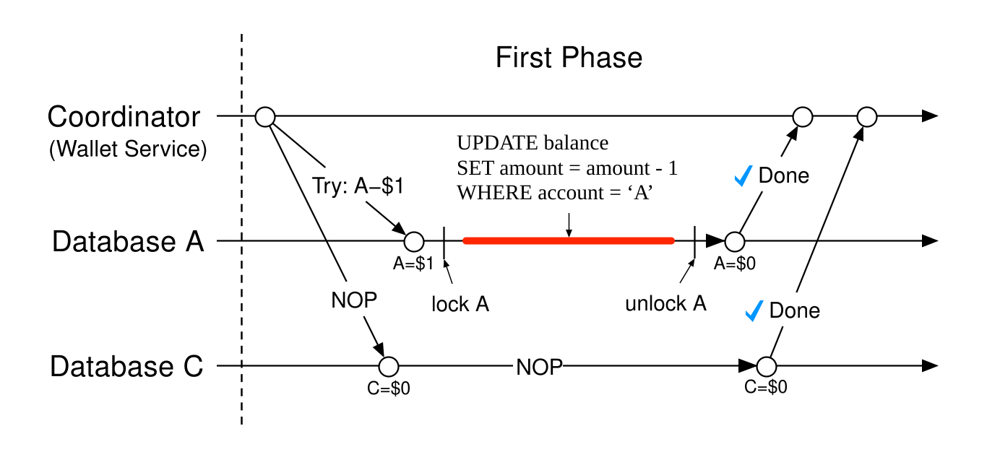
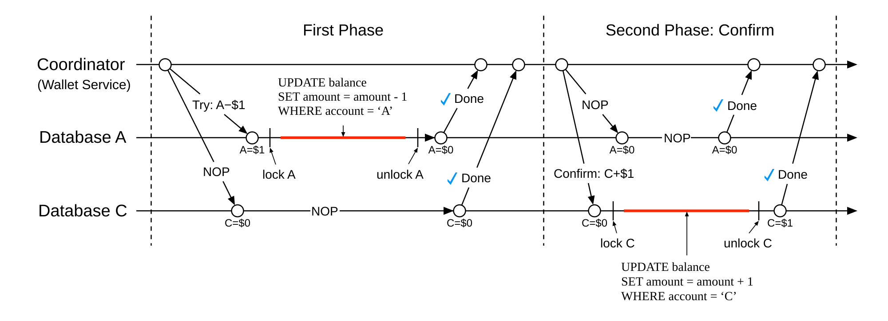
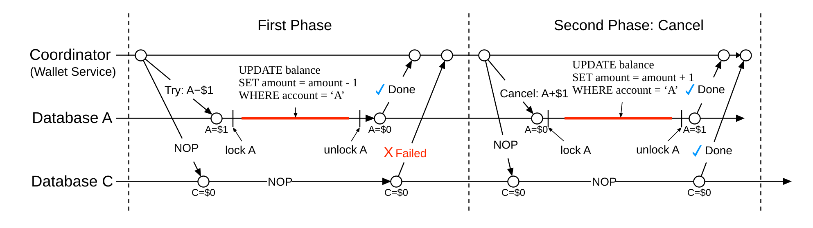
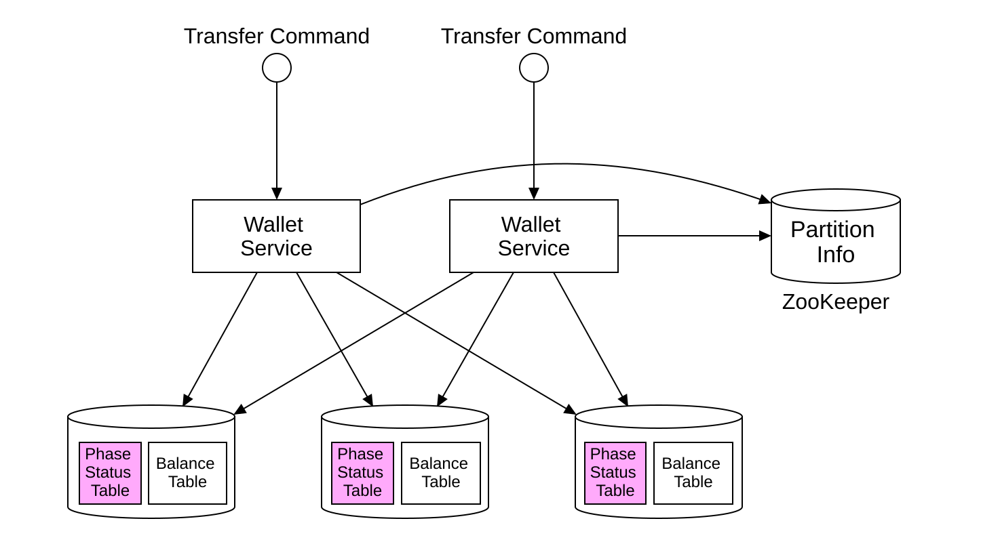
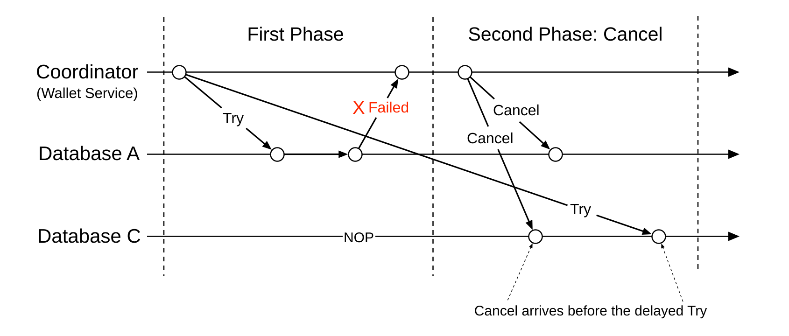
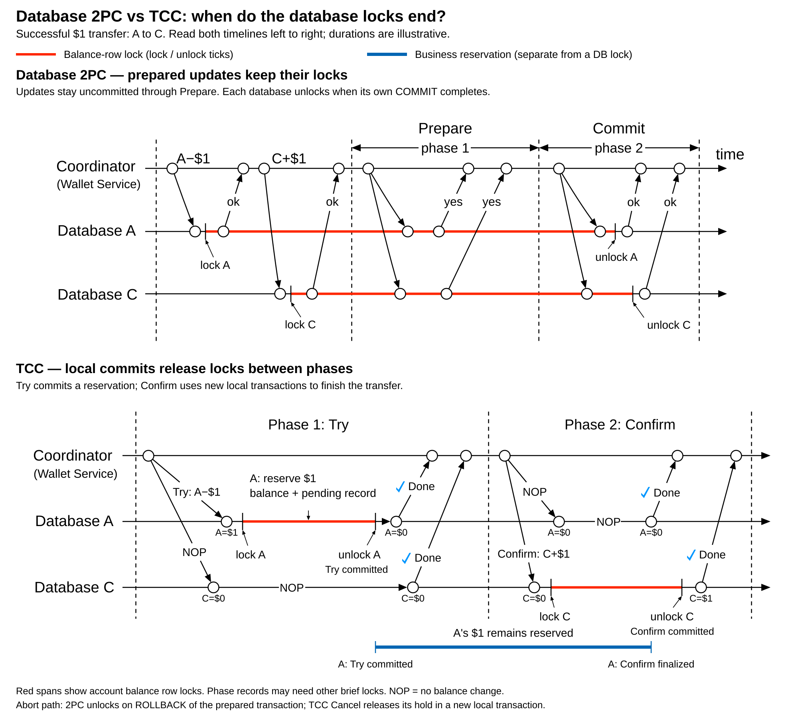
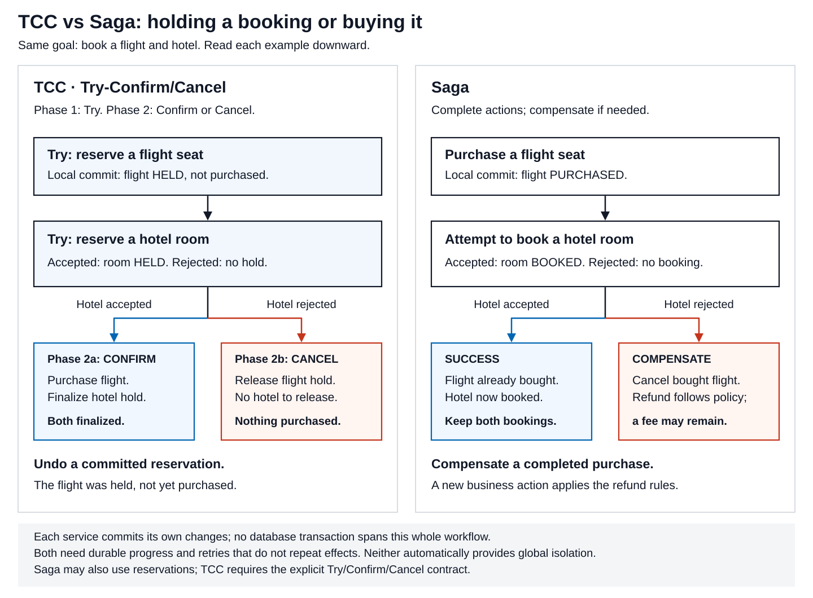

# Transactions. Try-Confirm/Cancel

[Back to Distributed Systems](../Readme.md#content)

**Try-Confirm/Cancel (TCC) coordinates a distributed business operation by first reserving resources, then confirming all reservations or canceling them.** Each participant implements these operations in application code. In a database-backed implementation, each operation commits its own local transaction; the database transaction does not stay open while the coordinator waits for other services.

There are **two phases**: **Try**, followed by **Confirm or Cancel**. The three operation names do not mean three sequential phases. After successful confirmation, a later customer refund is a separate business operation.

This article follows chapter 27's Digital Wallet example: move **$1 from account A to account C**, stored in separate database partitions. The chapter's SVGs explain the phases, durable progress, and message reordering. We will connect their simplified balance updates to the reservation and recovery rules needed for a reliable implementation.

## The model: reserve now, decide later

A **participant** owns one part of the operation, such as an account and its transfer records. A **local transaction** groups related operations in one database so they can commit or roll back together. A **coordinator** tracks the participants and drives the overall outcome. A **reservation** sets aside a resource for one operation so competing operations cannot consume it.

**Atomicity** means all or nothing within a specified boundary. For a local transaction, the debit and its reservation record must commit together or neither must commit. For the distributed business operation, the intended final outcome is that all participants confirm or all cancel. Successful local commits do not, by themselves, guarantee the distributed outcome. Readers can still observe a transfer between its local commits.

| Operation | Participant's responsibility | Result |
| --- | --- | --- |
| Try | Validate the request and reserve what completion needs. | A durable pending reservation. |
| Confirm | Finalize the work using that reservation. | The reserved resource is consumed or the pending action becomes final. |
| Cancel | Release the reservation or reverse its provisional effect. | The resource becomes available again. |

The reservation is a business rule, not necessarily a database lock. A reserved seat can remain unavailable after the local database transaction has committed. Funds can similarly move out of an account's available balance while the transfer is pending.

This is often called a **semantic lock**: application state restricts business operations. The reservation has observable effects even before Confirm; another customer can find fewer seats available. Hiding an unfinished booking from one screen does not give all services a common snapshot.

Try must do more than check availability. If A has $1 and two transfers each merely read that balance, both might promise to spend it. In our wallet implementation, the funds check and reservation belong in one local transaction, with concurrent access controlled so both transfers cannot reserve the same dollar. Local atomicity keeps the debit and reservation record together; controlling concurrent access prevents double-spending.

## Transaction types and coordination protocols

**Local and distributed describe transaction scope. Compensating describes purpose, and autonomous describes independence from a calling transaction.** These categories can overlap.

| Transaction term | What it means | Example |
| --- | --- | --- |
| Local transaction | Related operations share one database commit-or-rollback boundary. | A's balance reduction and its reservation record commit together. |
| Distributed transaction, often called a global transaction | One coordinated transaction spans independent transactional resources, such as two databases. | A transfer involves a debit in A's database and a credit in C's database. |
| Compensating transaction | New work counteracts the effects of earlier committed work according to business rules. | Refund a committed debit after a later action fails. |
| Autonomous transaction | A transaction commits or rolls back independently of the transaction that called it. | An Oracle routine commits a diagnostic record that survives the calling transaction's rollback. |

Local refers to the transaction boundary, not the database's physical location. A database on another server can still execute a local transaction, and that transaction can update several tables. In the first row, the application commits only after both required writes succeed; otherwise, it rolls back the local transaction. That commit does not include C's separate database.

**A distributed transaction is the work being coordinated; two-phase commit (2PC) is one protocol for deciding its outcome.** Using 2PC for the transfer means A's and C's databases first prepare their uncommitted changes, then apply the coordinator's commit-or-rollback decision. The word *distributed* identifies the scope; it does not name the coordination protocol.

TCC coordinates distributed business operations through reservations; Saga coordinates committed business actions and their compensations. In this article's TCC design, each Try, Confirm, or Cancel runs in its own local transaction. A Saga's compensating action can also be a local transaction: *local* describes its scope, while *compensating* describes its purpose. Their local commits do not provide the same guarantees as a single atomic database commit across all participants; the later comparison explains the differences.

## Reading the wallet diagrams

The three phase diagrams start with **A = $1 and C = $0**. In these timelines, time moves left to right and slanted arrows carry requests and responses. Spans between ticks labeled `lock A` / `unlock A` or `lock C` / `unlock C` show database locks held during individual balance updates; these spans are also colored red. **NOP** means *no operation*: here, no balance change. Protocol bookkeeping may still be necessary.

The chapter reserves the dollar by debiting A during Try. For this article, interpret the displayed balance as **available money**, and pair that debit with a durable pending-transfer record. This makes the reservation explicit even though the original diagrams show only balance arithmetic.

| Point in the example | A available | C available | Pending transfer |
| --- | --- | --- | --- |
| Before Try | $1 | $0 | None |
| After successful Try | $0 | $0 | $1 reserved for this transfer |
| After Confirm completes | $0 | $1 | Completed |
| After Cancel completes instead | $1 | $0 | Canceled |

The pending amount explains why adding only the two displayed balances temporarily gives $0. It is an illustrative accounting model, not a complete ledger schema. The system must retain enough information to explain where the dollar is while the operation remains unfinished.

## Phase 1 — Try: reserve A's dollar

Before this phase, A can spend $1 and C has $0. A transfer request, identified here as `tr-42`, triggers Try on both participants.

A's participant validates the debit, reduces A's available balance by $1, and records the reservation for `tr-42` in the same local transaction. After it commits, A's database lock is released. The dollar remains reserved through the application state. C's balance stays unchanged.

When every required Try succeeds, the coordinator can choose Confirm. If a required Try is rejected, it chooses Cancel. The successful Try state is **A = $0, C = $0, transfer pending**. The transfer has not yet delivered money to C.

As a design inference from this rule, an application could overlap flight and hotel Try calls if they are independent and its coordinator supports concurrent calls. The coordinator must still collect every required successful Try before choosing Confirm. This scheduling choice depends on the implementation.

### What C's NOP leaves out

The diagram treats C's Try as having no balance effect. A real participant must still establish that it can honor Confirm. If C can reject an incoming transfer because an account is closed or a limit is exceeded, handle that condition during Try and preserve the accepted transfer's right to complete.

Likewise, the SQL shown in the figure illustrates subtraction only. It omits sufficient-funds checks, request deduplication, and the reservation record. Running that statement alone does not implement TCC.

## Phase 2a — Confirm: finish an accepted transfer

This is the success path after all required Try operations have succeeded. The coordinator durably chooses Confirm and requests confirmation from the participants.

A does not subtract the dollar again: it finalizes its existing reservation. C adds $1 and records that its confirmation completed, together in a local transaction. The coordinator marks the transfer completed after it has established that every required confirmation succeeded.

The final example balances are **A = $0 and C = $1**. A's Try commit and C's Confirm commit are separate database commits. The coordinator's result does not turn them into one simultaneous database write.

Design Confirm so a successful Try has already secured its business prerequisites. Temporary failures, such as a database outage, can still prevent execution. Keep confirmation pending and retry safely after recovery. A lost Confirm response does not justify changing the decision to Cancel: C might already have received the dollar.

## Phase 2b — Cancel: release an unsuccessful transfer

This is the **alternative to Phase 2a**. In the diagram, A's Try commits, but C's Try reports failure. Before cancellation, A has $0, C has $0, and A's dollar is reserved.

The coordinator chooses Cancel. A releases its recorded reservation, adding $1 back to its available balance in a new local transaction. C receives no balance adjustment. Once cancellation completes, **A = $1 and C = $0**.

The refund is conditional on A having a reservation to release. If A's Try never committed, blindly executing `A + $1` would create money. A repeated Cancel must also leave the balance unchanged after the first successful release.

Cancel reverses this transfer's effect, not the entire account history. For example, if A receives an unrelated $5 deposit while `tr-42` is pending, releasing the reserved $1 should leave A with $6. Restoring a saved balance of $1 would erase the deposit.

## Durable progress makes coordinator recovery possible

Chapter 27 places a **Phase Status Table** beside each partition's balance table. The diagram's wallet services coordinate transfers. The cylinder labeled `Partition Info`, with the caption `ZooKeeper` beneath it, is the partition directory that tells them where data lives. That routing choice is part of the chapter's architecture, not a requirement of TCC.

For this wallet, a **branch** is one participant's part of `tr-42`. Two kinds of durable information serve different purposes:

| Record | What it needs to establish |
| --- | --- |
| Coordinator progress | Transfer ID and contents, participants, Try results, the chosen second phase, and which participants still need completion. |
| Participant progress | This branch's reservation, whether it was confirmed or canceled, and the result needed to recognize repeated requests. |

Persist each branch's state change together with its balance mutation. Otherwise a crash could leave a debit without the reservation needed to release it, or a confirmation record without the credit it claims to represent.

The coordinator must recover its chosen outcome and unfinished work after a crash. Record the decision before sending second-phase requests. If it sends first and crashes before recording, participants may already have acted while the replacement worker has no durable decision to recover. Recording first lets the replacement worker resume the chosen decision; it must not independently choose the opposite outcome. Sending a request and receiving its successful result are separate progress states.

Persisting tables alone does not perform recovery. The application needs workers that revisit unfinished transfers and surface cases they cannot resolve.

## Duplicate requests and uncertain responses

An **idempotent** operation has the same business effect when the same request is repeated. TCC needs this because a participant can commit and lose its response.

For example, C credits `tr-42`, then its reply disappears. Retrying an unguarded `C + $1` credits twice. Instead, identify the branch and operation with stable keys, such as `(tr-42, credit-c, Confirm)`. A retry carries the same parameters and returns the recorded outcome without another credit. Reject reuse of the same key for a different amount or recipient.

Apply the same protection to Try and Cancel. Combine request recognition, the business mutation, and the durable result within one participant's local transaction. A key in a message alone provides no protection. Keep history for the supported retry and delayed-delivery window.

Before a final decision, a Try timeout may cause the coordinator to cancel the operation. That is a decision to abandon the transfer, not evidence that Try did nothing. Cancel must safely handle both an existing reservation and one that never existed.

## Cancel can arrive before Try

In this chapter diagram, A reports a Try failure while the request to C is delayed. The coordinator sends Cancel, which reaches C before its original Try. Follow the two arrowheads on C's timeline to see the reversed arrival order.

An **empty rollback** is Cancel with no successful Try to undo. It must not refund or release a resource that was never reserved. But simply returning success and forgetting the request is insufficient: the delayed Try could subsequently reserve resources for an operation that has already ended.

Record cancellation for the branch even when no reservation exists. A later Try checks that durable state and refuses to create the reservation. This prevents the stranded reservation that Seata calls **suspension** or **hanging**.

The diagram shows reversed arrivals at C, whose Try has no balance effect. To make the reservation effects concrete, the table below applies the same ordering rule to **A's branch**, whose Try reserves the dollar when it succeeds. A **terminal state** is a completed outcome, here `CONFIRMED` or `CANCELED`. These state names are illustrative.

| Stored state | Incoming operation | Business effect |
| --- | --- | --- |
| No record | Try | Validate, reserve $1, and record `TRIED`. |
| `TRIED` | Duplicate Try | Return the prior outcome; reserve nothing more. |
| `TRIED` | Confirm | Finalize the reservation and record `CONFIRMED`. |
| `TRIED` | Cancel | Release the reservation once and record `CANCELED`. |
| No record | Cancel | Record `CANCELED`; change no balance. |
| `CANCELED` | Late Try | Reject it; change no balance. |
| Terminal state | Repeated matching completion | Return the recorded outcome; change no balance. |

Opposite completion requests must not reverse a terminal state. Concurrent handlers must serialize the state check and mutation; an unlocked check followed by a separate write leaves a race.

## Reservations protect resources, but do not provide global isolation

**Isolation** concerns what concurrent operations can observe and how they interfere. TCC does not automatically make every cross-service read observe one instantaneous transfer. In the example, a read between debit and credit sees A = $0 and C = $0.

Reservations let the application protect a specific business rule, such as preventing A from spending the same dollar twice. Every spending path must respect the available balance and reservation rules. Keeping local database locks short does not make reserved funds available to other transfers.

Expiry also needs an explicit contract. Some TCC implementations let reservations expire automatically. If one participant expires its reservation while another has already confirmed, the operation can reach a **heuristic outcome**, specifically a **heuristic mixed outcome**: some participants confirmed while others canceled. This violates atomicity at the distributed business level, even if every participant's local writes were atomic. In Jakarta Transactions, `HeuristicMixedException` reports the analogous split between committed and rolled-back updates. Retrying cannot recreate a resource that has since been allocated elsewhere. Coordinate deadlines with the chosen protocol and provide reconciliation for unresolved outcomes.

Thus, TCC aims for all-confirmed or all-canceled completion through reservations and recovery. That goal depends on participant behavior, durable records, and eventual ability to finish the chosen action; it is not an unconditional promise that every failure will repair itself.

### Request timeouts, reservation expiry, and recovery deadlines

These clocks serve different purposes. A **request timeout** stops a caller waiting, without proving whether the participant acted. A reservation's **time to live (TTL)** defines its lifetime under the reservation contract. A **recovery deadline** triggers investigation or escalation for work that remains unfinished.

Use a background recovery process to find overdue reservations and incomplete Confirm or Cancel operations. It must apply the protocol's recorded outcome and expiry rules, retain the cancellation records that prevent **suspension** from late Try requests, and surface unresolved conflicts. Blindly deleting every old reservation can race with confirmation and recreate the mixed outcome described above. Exhausting automatic retries does not change a recorded Confirm into Cancel.

## How TCC differs from database 2PC and Saga

The table and subsections below compare TCC with database 2PC and Saga, explain balance reservation support in Oracle Database and PostgreSQL, and identify when TCC fits. For full walkthroughs of the other protocols, see [Transactions. Two-phase commit](../Transactions.%20Two-phase%20commit/Readme.md) and [Transactions. Saga](../Transactions.%20Saga/Readme.md).

| Approach | What exists before the final outcome? | How completion works |
| --- | --- | --- |
| Database 2PC | Prepared database transactions awaiting resolution. | Commit or roll back those prepared transactions. |
| TCC | Business reservations committed by local operations. | Run application-defined Confirm or Cancel operations. |
| Saga | Independently committed business actions. | Continue the workflow or run compensating actions for completed work. |

### TCC and database 2PC

**Database 2PC keeps database transactions prepared but uncommitted; TCC commits its reservations before the final decision.** This changes both what remains pending and how cancellation works.

Two stacked panels reuse chapter 27's wallet timelines: database 2PC above and TCC below. Each panel has Coordinator, Database A, and Database C rows, with time moving left to right. Both show a successful $1 transfer. Follow the spans between the labeled lock and unlock ticks to track account balance row locks; the span labeled **A's $1 remains reserved** (shown in blue) separately tracks A's committed business reservation. Other short locks needed for phase records are omitted.

With database 2PC, A's database prepares the debit and C's database prepares the credit. Each database stores enough durable state to commit or roll back its prepared transaction later. In PostgreSQL, those changes remain invisible to ordinary reads while prepared, and the transactions retain their acquired locks. A coordinator decision alone does not release them: each database must commit or roll back its own prepared transaction. If the coordinator decides to abort, the databases roll back those original transactions. The application does not need to issue a separate refund to reverse a committed debit, because the debit never committed.

With TCC, A's Try has already committed the reduction in available funds and its reservation record. The local database transaction is finished, and its locks are released. If the coordinator later chooses Cancel, A's service must execute a **new local transaction** that releases this recorded reservation and adds the dollar back. A failure at C cannot make A's database automatically roll back that earlier commit.

The waiting resource therefore differs: database 2PC can retain database locks while awaiting resolution; TCC retains a business reservation across that wait. Other TCC operations may access the account, but they still cannot spend its reserved dollar. TCC moves reservation and cancellation rules into application code. Both approaches need a durable decision and recovery when the coordinator or participants fail.

### TCC and Saga

**Both TCC and Saga commit local transactions before the overall operation finishes.** TCC requires each participant to support a reservation that can be confirmed or canceled. A general Saga coordinates business actions that may already be complete, with compensating actions to repair their effects if the workflow cannot finish.

The wallet arithmetic can look identical: debit A, later credit C, and refund A if necessary. The distinction is the contract around those writes. Under TCC, A's debit creates a tracked reservation. C need not reserve money to receive money, but its Try must establish and preserve its ability to accept confirmation, as explained in the earlier discussion of C's NOP. Under Saga, the debit can be a completed business action; if the later credit is definitively rejected, a separate compensating action refunds that debit. TCC moves the checks and reservations needed for completion into Try; a Saga may discover a later business rejection after earlier actions have completed.

A seat example makes the difference more visible. A TCC service can hold a seat during Try, sell it on Confirm, or release the hold on Cancel. A Saga might purchase the seat immediately, then cancel that completed booking if a subsequent hotel booking fails. That compensation follows the booking's cancellation rules, which could include a fee. Releasing a hold and canceling a completed purchase are different business operations, even if both eventually make the seat available again.

Two side-by-side panels compare TCC on the left with Saga on the right. Read each panel downward from a successful flight operation to the hotel's acceptance or definitive rejection. The lower branches are alternative outcomes.

The summary band beneath both panels explains their shared requirements, limits, and possible overlap. Dependencies determine which actions can run in parallel; Saga is not inherently restricted to sequential execution.

**A missing reservation API does not automatically rule out TCC.** If you control the participant and its resources, you can implement durable holds and make competing operations respect them. What matters is securing completion's prerequisites during Try and preserving the ability to Confirm or Cancel. A participant that cannot honor that contract cannot safely join the TCC operation.

For example, suppose the external hotel service offers only immediate purchases and cannot hold a room. Recording `PENDING` in your own database does not reserve its inventory. Checking availability during Try and purchasing during Confirm leaves time for someone else to buy the last room. A Saga may fit if purchasing immediately has an acceptable compensation, such as canceling the booking under the hotel's refund policy. A TCC coordinator cannot create reservation support inside an external service merely by wrapping its API.

### Balance reservations in Oracle Database and PostgreSQL

**Both Oracle Database and PostgreSQL support the local transactions needed to implement balance reservations.** If the entire transfer can run inside one local database transaction, the debit, credit, and transfer record can commit together; that transfer does not need TCC or Saga.

For a transfer across independently committing services, the wallet design in this article can use either database. Your Try handler checks available funds, reduces the available balance, and records the transfer's amount and pending state in one local transaction, with concurrency control. Database locks protect those writes until commit; afterward, the committed business state keeps the money reserved. Your Confirm and Cancel handlers resolve that state in later local transactions. Ordinary balance updates do not automatically invoke those handlers. PostgreSQL's `PREPARE TRANSACTION` instead belongs to the database 2PC approach described above.

**Oracle Database 23ai introduced Lock-Free Reservation for numeric `RESERVABLE` columns**, such as `balance NUMBER RESERVABLE` with a minimum-balance constraint. A qualifying increment or decrement records the intended amount in a reservation journal; the actual balance update and row locking happen at the database transaction's commit. A rollback discards the pending reservation. This native reservation lasts within that transaction, so declaring the column alone does not implement the article's TCC hold that survives Try's local commit.

Oracle AI Database 26ai also provides a database Saga framework, including the `DBMS_SAGA` interface. When used with that framework, reservable-column journals can survive local commits and support automatic compensation of those updates if the Saga is canceled. This support covers eligible database changes; external purchases still require their own compensation logic.

For TCC coordination, **Oracle MicroTx** is a separate product. In its documented flow, the **transaction initiator** — the service that starts the transfer, not MicroTx — calls participants' `POST` endpoints to create reservations. Participants return reservation URIs (Uniform Resource Identifiers), which MicroTx client libraries propagate in headers up the call stack. After the initiator requests confirmation or cancellation from MicroTx, MicroTx calls `PUT` to confirm or `DELETE` to cancel on the reservation URIs the participants returned. The participating services implement the business behavior of all three operations. Distinguish this coordinator from Oracle Database's local transactions, reservable columns, and Saga support.

### When TCC fits

TCC fits operations with meaningful reservations, such as funds, seats, or inventory, when participating services can implement all three operations. Its cost is business logic for reservations, state transitions, retries, and recovery. A delivery that has already reached a customer cannot be turned into a releasable reservation merely by naming a method `Cancel`.

## Self-check

1. Why are there two phases despite three operation names?
2. What prevents a duplicate Try from reserving A's dollar twice?
3. Why must an empty Cancel leave a durable record?
4. Why is Cancel unsafe after a Confirm response is lost?
5. Does reserving A's dollar give a concurrent cross-service read a single snapshot of the transfer?
6. What does phase one leave behind in database 2PC versus TCC?
7. What distinguishes TCC from a general Saga?
8. What is the failure called when one participant confirms but another expires its reservation and cancels?
9. Why is checking hotel availability during Try insufficient when the hotel cannot hold a room?
10. How does the term distributed transaction differ from two-phase commit?
11. Why must the coordinator record its chosen second phase before sending Confirm or Cancel requests?
12. Why does an Oracle `RESERVABLE` column alone not implement the TCC hold used in this wallet?
13. Why does a reservation remain visible even after its database lock is released?
14. Does reaching a recovery deadline authorize Cancel after Confirm was chosen?

Check your answers

1. Try is phase one. Confirm and Cancel are alternative outcomes of phase two.
2. A stable branch identity and a local transaction that checks recorded state and applies any balance/reservation update while preventing concurrent duplicates.
3. A delayed Try must discover that the branch was canceled and refuse to reserve anything.
4. The participant might already have confirmed. Recover the outcome and continue the recorded decision instead of creating conflicting effects.
5. No. Between debit and credit, a read can see A = $0 and C = $0. The reservation prevents competing spending of that dollar when spending paths enforce it; it does not provide a global snapshot.
6. Database 2PC leaves prepared database transactions awaiting resolution; TCC leaves committed business reservations.
7. TCC requires reserve/finalize/release operations, while a Saga can coordinate broader committed actions and their compensations.
8. A heuristic mixed outcome: part confirmed, part canceled, violating the intended all-or-nothing outcome across participants. Jakarta Transactions uses `HeuristicMixedException` for the analogous committed/rolled-back split.
9. Another customer can buy the last room before Confirm. A local pending record does not reserve the external hotel's inventory, so Try has not secured completion.
10. Distributed transaction describes work spanning independent transactional resources; 2PC is one protocol for coordinating their commit-or-rollback outcome.
11. Sending first and crashing before recording leaves the replacement worker without a durable decision, even though participants may already have acted. Recording first ensures the worker knows which second phase to finish after a crash.
12. In an ordinary database transaction, the native reservation becomes a balance update at commit or is discarded at rollback. The wallet's TCC hold must survive Try's local commit as durable business state, with later Confirm and Cancel handlers; that application design can use either Oracle Database or PostgreSQL.
13. The committed reservation reduces what competing operations can use. Short database lock duration does not make the held resource available or provide global isolation.
14. No. Recover the chosen outcome and escalate unresolved work. A monitoring deadline is not permission to reverse a confirmation that may already have executed elsewhere.

# Sources

Primary sources checked on 2026-09-14. Transfer `tr-42`, the state table, the explicit pending-dollar interpretation, and the seat/hotel comparison are teaching examples derived from the reservation and recovery rules below.

Coverage review also used [Timofei Ivankov — Distributed transactions in microservices: from Saga to Two-Phase Commit (Habr, Russian)](https://habr.com/ru/articles/906484/). The visibility and expiry discussion retains the qualifications required by the primary protocol sources.

- [System Design — chapter 27, Digital Wallet](../../system%20design/27.%20Digital%20Wallet/Readme.md). Diagram provenance: [Try](../../system%20design/27.%20Digital%20Wallet/images/tcc-try-phase.svg), [Confirm](../../system%20design/27.%20Digital%20Wallet/images/tcc-confirm-phase.svg), [Cancel](../../system%20design/27.%20Digital%20Wallet/images/tcc-cancel-phase.svg), [phase-status tables](../../system%20design/27.%20Digital%20Wallet/images/phase-status-tables.svg), and [out-of-order execution](../../system%20design/27.%20Digital%20Wallet/images/out-of-order-execution.svg). Local copies preserve the chapter's flows and simplify the ordering caption. They also fix two errors: Confirm's `unlock A` label belongs to C and must read `unlock C`; Cancel's `lock C` label belongs to A and must read `lock A`. The phase-status diagram also corrects the caption from `Zookeeper` to `ZooKeeper`. The linked chapter originals still contain these errors.
- [Chapter 27 — two-phase commit timeline](../../system%20design/27.%20Digital%20Wallet/images/2pc-protocol.svg). The new lock comparison adapts this timeline and the chapter's Confirm timeline, places each 2PC unlock before its commit acknowledgement, and adds a separate TCC reservation span.
- [Apache Seata — TCC mode: service-level operations and reservation semantics](https://seata.apache.org/docs/user/mode/tcc/)
- [Apache Seata — Saga mode: local commits and compensating actions](https://seata.apache.org/docs/user/mode/saga/)
- [Apache Seata — TCC developer guide: custom branch prepare, commit, and rollback](https://seata.apache.org/docs/dev/mode/tcc-mode/)
- [Oracle MicroTx — Try-Confirm/Cancel: reservations, prerequisites, and available quantities](https://docs.oracle.com/en/database/oracle/transaction-manager-for-microservices/24.2/tmmdg/tcc-transaction-model.html)
- [Apache Seata — TCC analysis: empty rollback, idempotence, and suspension](https://seata.apache.org/blog/seata-tcc/)
- [Apache Seata — TCC fence: branch state and business updates in one local transaction](https://seata.apache.org/blog/seata-tcc-fence/)
- [AWS Builders' Library — Making retries safe with idempotent APIs](https://aws.amazon.com/builders-library/making-retries-safe-with-idempotent-APIs/)
- [Microsoft — Compensating Transaction pattern: business rules and recovery of completed actions](https://learn.microsoft.com/en-us/azure/architecture/patterns/compensating-transaction)
- [Pardon and Pautasso — Atomic Distributed Transactions: a RESTful Design](https://design.inf.usi.ch/sites/default/files/biblio/wsrest2014-pardon-pautasso-rest-tcc-8.pdf)
- [Oracle — Making Try-Confirm/Cancel Easy with MicroTx: lock duration and heuristic outcomes](https://blogs.oracle.com/database/making-try-confirmcancel-easy-with-microtx)
- [Jakarta Transactions — HeuristicMixedException](https://jakarta.ee/specifications/transactions/2.0/apidocs/jakarta/transaction/heuristicmixedexception)
- [PostgreSQL — PREPARE TRANSACTION](https://www.postgresql.org/docs/current/sql-prepare-transaction.html)
- [PostgreSQL — Transactions: local all-or-nothing updates](https://www.postgresql.org/docs/current/tutorial-transactions.html)
- [PostgreSQL — Explicit locking: row locks and transaction lifetime](https://www.postgresql.org/docs/current/explicit-locking.html)
- [PostgreSQL — Transaction isolation: concurrent operations and their guarantees](https://www.postgresql.org/docs/current/transaction-iso.html)
- [Oracle Database — Transactions: account debits, credits, commit, and rollback](https://docs.oracle.com/en/database/oracle/oracle-database/26/cncpt/transactions.html)
- [Oracle PL/SQL — Autonomous transactions: commits independent of the calling transaction](https://docs.oracle.com/en/database/oracle/oracle-database/19/lnpls/autonomous-transactions.html)
- [Oracle — Lock-Free Reservation introduced with Oracle Database 23ai](https://blogs.oracle.com/dbstorage/new-lockfree-reservation-capability-with-oracle-database-23ai)
- [Oracle AI Database 26ai — Using Lock-Free Reservation: numeric columns, journals, and Saga compensation](https://docs.oracle.com/en/database/oracle/oracle-database/26/adfns/using-lock-free-reservation.html)
- [Oracle AI Database 26ai — DBMS_SAGA: database Saga interfaces](https://docs.oracle.com/en/database/oracle/oracle-database/26/arpls/dbms_saga.html)
- [Garcia-Molina and Salem — Sagas: local transactions, compensation, and Section 8 on parallel Sagas](https://www.cs.cornell.edu/andru/cs711/2002fa/reading/sagas.pdf)
- [Apache Seata — AT, TCC, and Saga: business-defined Try orchestration and second-phase recovery](https://seata.apache.org/blog/seata-at-tcc-saga/)
- [Microsoft Azure — Retry pattern: retry scheduling and limits](https://learn.microsoft.com/en-us/azure/architecture/patterns/retry)
