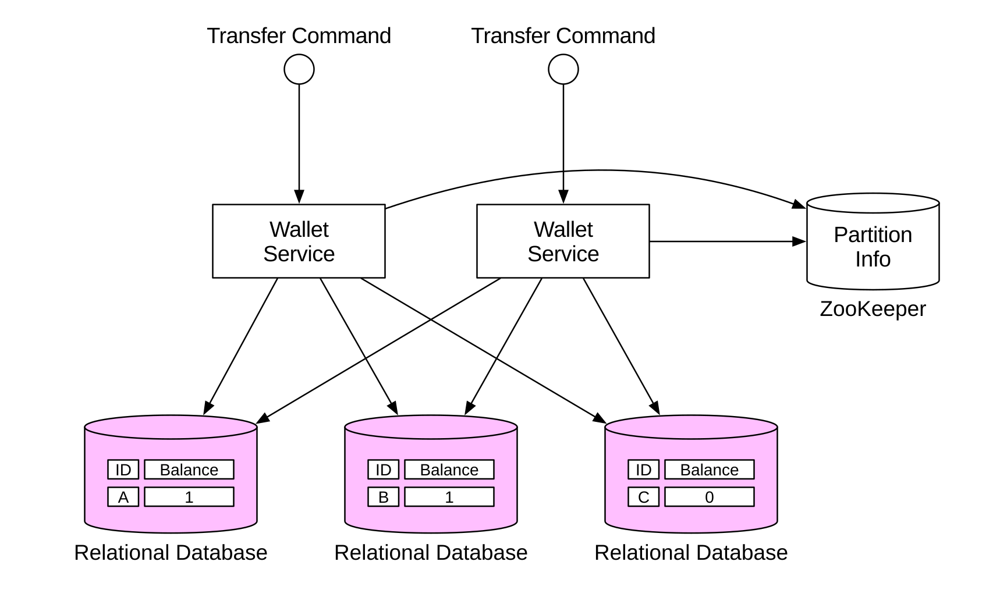
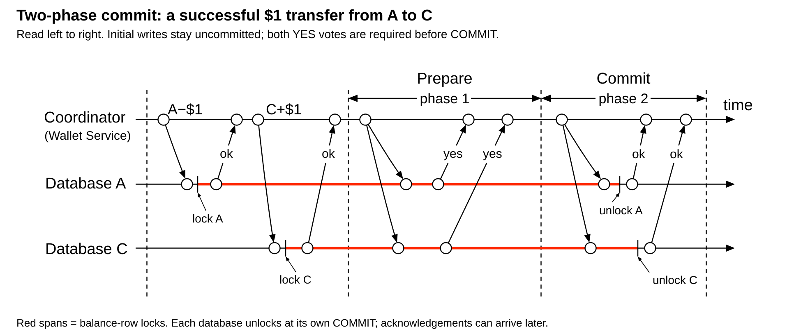
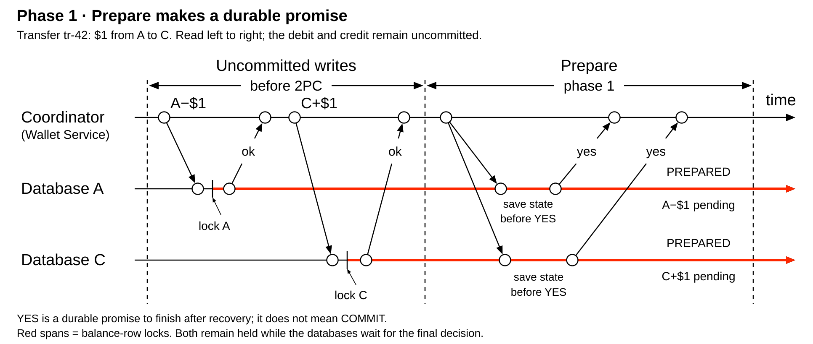
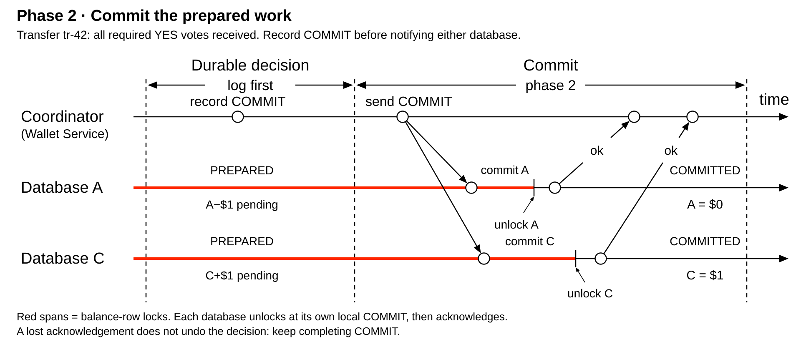
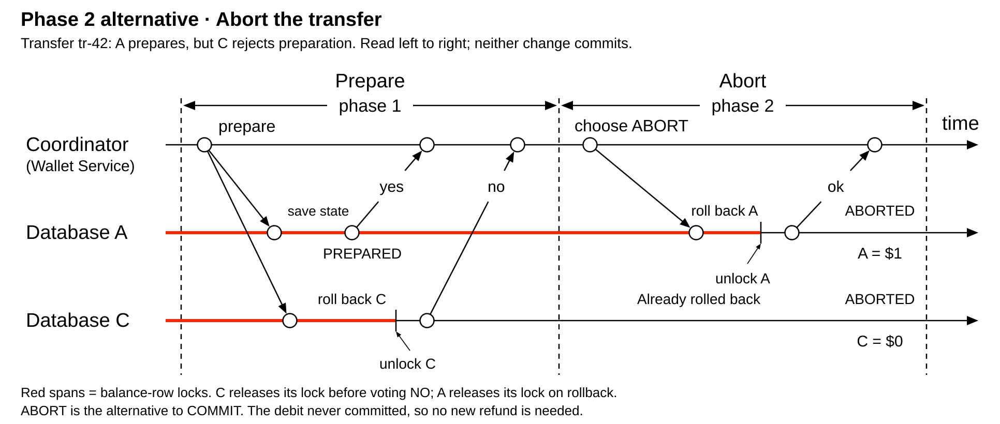
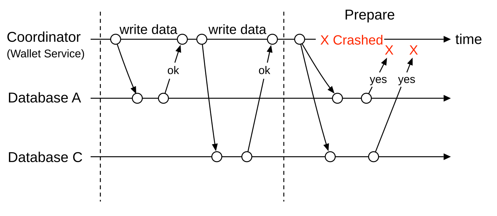

# Transactions. Two-phase commit

<sub>[Back to Distributed Systems](../Readme.md#content)</sub>

**Two-phase commit (2PC) coordinates one outcome across multiple transactional resources: all commit, or all roll back.** First, the coordinator gathers participants' votes; participants with changes must prepare their work and promise that they can finish later. Then it tells the prepared participants to commit or abort. A participant that has promised “yes” cannot safely change its mind just because a response is late.

This article follows chapter 27's wallet example: transfer **$1 from account A to account C**, stored in different databases. Using the chapter's diagrams and the other Transactions articles' visual language, we will follow preparation, completion, and crash recovery. Then we will separate atomic commit from isolation, examine PostgreSQL's participant commands and the XA interface, compare 2PC with Try-Confirm/Cancel (TCC) and Saga, and consider when its costs are justified.

## Why two independent commits are insufficient

Start with **A = $1 and C = $0**. A successful transfer should end with **A = $0 and C = $1**. If the transfer is rejected, the balances should remain **A = $1 and C = $0**. Assume no other transfers in these examples.

Suppose an application commits A's debit, then crashes before committing C's credit. Each database may have executed its own transaction correctly, but the transfer has only half completed. Wrapping each database call in a separate local transaction does not give the pair one atomic outcome.

2PC addresses this by keeping both local transactions uncommitted until they can follow a shared decision. It requires transaction-aware participants; two ordinary HTTP endpoints that independently save changes do not acquire this behavior merely because a caller labels its requests “prepare” and “commit.”

## The participants and their responsibilities

| Term | Meaning in this transfer |
| --- | --- |
| Local transaction | Work that one database can commit or roll back together. |
| Distributed transaction | The coordinated debit and credit spanning both databases. |
| Coordinator, or transaction manager | Tracks the transaction's participants, gathers votes, records the outcome, and drives completion. |
| Participant, or resource manager | A transactional resource that can prepare and later resolve its work; here, Database A or Database C. |
| Branch | One participant's portion of the distributed transaction. |
| Prepared | The branch has durable recovery state and can honor the later decision, but has not committed. |

The architecture below adapts System Design chapter 27's diagram: C's displayed balance changes from $1 to $0 to match this transfer. Wallet-service workers route work to database partitions. The ZooKeeper box supplies partition information in that example; it is not a required component of 2PC. A transfer between A and C involves those two databases, even though the system also has partition B.



The diagram locates coordination in the wallet service. In an implementation, a transaction manager can provide that machinery. The important requirement is recoverable coordination state, not a particular service name or deployment shape.

## Reading the complete timeline

Time runs left to right. Each horizontal row belongs to the coordinator or a database; slanted arrows are requests and replies. The initial `A−$1` and `C+$1` operations execute inside uncommitted branches. Their `ok` replies acknowledge execution, not a committed transfer.



The **red spans between lock and unlock ticks** show account-row locks. They continue across Prepare and end when each database completes its own commit. This version reuses chapter 27's timeline with the lock endpoints clarified in the TCC article. Durations are illustrative, and the drawing omits durable-log writes.

There are two protocol phases after the transaction's ordinary work: **Prepare**, then **Commit or Abort**. Abort is an alternative outcome of the second phase, not a third phase after Commit. Oracle's documentation additionally names a later **Forget phase** for cleaning up completed transaction records; it does not introduce another commit-or-abort decision.

## Step 1 — Prepare the uncommitted branches



Before preparation, A's branch contains the pending debit and C's contains the pending credit. When the application requests commit, the coordinator asks both participants to prepare.

A participant with changes checks whether it can finish its branch, saves enough durable information to recover it after a crash, and retains the resources required for completion. In a database using row locks for these updates, those locks remain held. Only then can it return **YES**, also called a prepared vote. If preparation fails, it votes **NO** and rolls back its local work.

After both YES votes, both branches are prepared, but neither balance change has committed. YES is stronger than “the database is reachable” or “the UPDATE ran”: it is a durable promise to follow the outcome. Business validation, such as checking sufficient funds, must already be part of the transactional work; 2PC cannot invent those rules.

Read-only participants can have a special positive vote and skip second-phase completion. Our example updates both databases, so both must prepare their changes.

## Step 2 — Record COMMIT and complete both branches



On the success path, every required participant has voted YES. The coordinator **durably records COMMIT before sending commit requests**. This ordering lets recovery continue the same decision even if the coordinator stops immediately after notifying only one database.

Each participant commits its prepared branch, releases its transaction's locks, and acknowledges completion. It finishes the work already prepared; it does not execute a new debit or credit. After both finish, the balances are **A = $0 and C = $1**.

The commit decision and its delivery are separate events. A can finish while C is still waiting for the message. Once COMMIT is durable, a lost request, a missing acknowledgement, or a participant outage requires completion of that decision after recovery. It does not permit switching the transfer to ABORT.

Acknowledgements tell the coordinator which participants have finished. Recovery metadata must remain available until the protocol's completion rules allow it to be forgotten. In Oracle's **Forget phase**, transaction-status information is erased after all participants have reported that they committed. This cleanup follows completion; it does not undo the committed data.

## Alternative to Step 2 — Abort the transaction



Suppose A prepares successfully, but C cannot prepare and votes NO. The coordinator chooses ABORT and tells the unresolved participants to roll back. While still collecting votes, it can also choose ABORT when a required response does not arrive, provided it has not durably recorded COMMIT.

A rolls back its original, uncommitted debit and releases its lock. C's rejected branch has already rolled back. After resolution, **A = $1 and C = $0**.

There is no refund transaction here: A's debit never committed. A refund or other compensating action would be new work that counteracts an earlier committed action, as in a Saga.

## Durable records let recovery continue the same transaction

Give the transfer a stable identity, such as `tr-42`, and identify its branches. The exact record format depends on the transaction manager and database, but their responsibilities differ:

| Durable information | Why recovery needs it |
| --- | --- |
| Coordinator transaction identity and participant set | Locate every branch that needs resolution. |
| Coordinator outcome | Recover the decision already made, especially after only some participants received it. |
| Participant prepared state | Finish the original branch after restarting, without rerunning its business operations. |
| Completion progress | Find participants still needing the outcome and know when recovery records can be retired. |

**Save the promise before voting YES; save COMMIT before announcing it.** An in-memory flag cannot preserve either across a process crash. The protocol assumes recovery records survive the failures it is designed to handle; permanent loss of those records is a different problem.

## Why a prepared transaction can block

An **in-doubt participant** has prepared but does not know the final outcome. In the chapter's failure diagram, the coordinator crashes during Prepare and the YES replies fail to reach it. The participants have no decision to apply.



To understand the danger of a timeout, consider A's perspective in two possible histories:

- The coordinator disappeared before deciding anything.
- The coordinator recorded COMMIT, delivered it to C, and disappeared before A received it.

A sees silence in both cases. If it rolls back on its own in the second case, C has committed while A has aborted. If it commits just because it voted YES, another participant might have voted NO. Waiting protects the shared outcome when the evidence is insufficient.

This is what **blocking** means here: surviving participants can be unable to finish the transaction until they recover authoritative outcome information. It does not mean every operation in every database necessarily stops.

| Failure point | Safe response |
| --- | --- |
| Participant has not promised YES | It may reject its branch and roll it back. |
| Coordinator is still waiting for votes and has made no commit decision | It may choose ABORT and arrange rollback of unresolved branches. |
| Participant prepared, but cannot learn the decision | Recover or query the outcome; do not guess from a timeout. |
| Coordinator restarts with a durable COMMIT record | Continue delivering COMMIT to unfinished participants. |
| Participant restarts with prepared state | Rejoin recovery and resolve the existing branch. |
| Completion reply is lost | Establish that branch's outcome; do not repeat the business transfer as new work. |

Participants may sometimes learn an outcome through recovery communication, so not every coordinator crash causes indefinite waiting. But classic 2PC cannot guarantee progress when all available evidence leaves participants in doubt.

A forced local decision outside normal coordination is called a **heuristic decision**. If it conflicts with another participant's outcome, atomicity is broken and reconciliation is needed. This is why “just roll back old prepared transactions” is not a safe general recovery rule.

## Atomic commit and isolation answer different questions

**Atomic commit** determines whether all branches commit or all abort. **Isolation** determines how concurrent transactions interact and what their reads can observe. Serializable isolation means their combined effect is equivalent to some one-at-a-time execution order.

2PC alone does not establish a common snapshot across independent database reads. For example, after A applies COMMIT but before C applies it, independent PostgreSQL reads could observe A's new value and C's old committed value. That observation does not mean C is allowed to abort: C is still required to finish the existing commit decision.

A database system can combine atomic commit with additional concurrency control and snapshot coordination to provide stronger read guarantees. Do not infer those guarantees from the name “2PC” alone. Likewise, a prepared row lock can block conflicting writes while ordinary PostgreSQL reads use an older committed version; a lock does not imply that every read blocks.

## What the participant interface looks like in PostgreSQL

PostgreSQL 18 exposes prepared-transaction commands intended for use by an **external transaction manager**. These commands implement a participant's part of the protocol; they do not discover other databases or decide the global outcome.

| Command or setting | Role |
| --- | --- |
| `PREPARE TRANSACTION 'tr-42-a'` | Prepare the current transaction under a branch identifier and detach it from the session. |
| `COMMIT PREPARED 'tr-42-a'` | Commit that prepared branch after the coordinator's commit decision. |
| `ROLLBACK PREPARED 'tr-42-a'` | Roll back that branch after the abort decision. |
| `pg_prepared_xacts` | List currently prepared transactions, including their identifiers and preparation times. |
| `max_prepared_transactions` | Limit concurrent prepared transactions; its default of `0` disables the feature. |

With the default setting, attempting `PREPARE TRANSACTION` in PostgreSQL 18 produces:

```text
ERROR: prepared transactions are disabled
HINT: Set "max_prepared_transactions" to a nonzero value.
```

Enabling the feature requires a nonzero `max_prepared_transactions` value at server start, so changing it requires a restart. An external transaction manager must track and resolve prepared work; enabling the setting alone does not supply that coordination.

The two completion commands can run from a different session and must run outside a transaction block. They are alternatives for one branch, not commands to execute consecutively. A prepared transaction remains recoverable even after its original session goes away.

For illustration, this read-only query lists pending branches in a PostgreSQL cluster:

```sql
SELECT gid, prepared, owner, database
FROM pg_prepared_xacts
ORDER BY prepared;
```

An absent row does not establish whether a branch committed or rolled back: either resolution removes it. Recovery must use the transaction manager's outcome information. Long-lived prepared transactions also retain locks and can interfere with storage reclamation by `VACUUM`, so tracking and resolving them is part of operating the system.

**XA** is a standard interface between transaction managers and resource managers, not another name for all distributed transactions. In Java, `XAResource` exposes operations such as `prepare`, `commit`, `rollback`, and `recover`; the manager coordinates resources enlisted in the same global transaction. An arbitrary external side effect, such as sending an email, is not automatically covered by that transaction.

The same interface also has `forget(Xid)`, where `Xid` identifies the branch. This method specifically tells the resource manager to discard its record of a **heuristically completed branch**. It is not the normal completion call for every prepared transaction, and it cannot replace `commit` or `rollback`. Oracle's general Forget-phase cleanup and this XA method therefore have different scopes.

## A database and a message broker can have different transaction boundaries

An XA-capable database and broker can join the same transaction manager's decision. For example, Apache Artemis supports XA messaging and integration with database work through Jakarta Transactions. With both resources properly enlisted, saving an order and publishing its message can share an atomic outcome. Calling two independent `commit()` methods does not provide that outcome.

“Supports transactions” does not necessarily mean “can join an XA transaction”:

| Broker interface | What its transaction covers |
| --- | --- |
| Artemis XA messaging | Enlisted messaging work can participate in the transaction manager's distributed decision. |
| Kafka producer transactions | Kafka output records and included consumer offsets; an external database update is not automatically included. |
| RabbitMQ AMQP 0-9-1 transactions | Broker publishing and acknowledgement operations, with documented limits; they do not enlist an external database. |

When database and broker cannot share the required commit protocol, a **transactional outbox** stores the business change and outgoing message together in the database. A relay publishes later. This solves the local database/message handoff, while a Saga can coordinate the wider business workflow. The [Saga article](../Transactions.%20Saga/Readme.md) explains outbox delivery and consumer deduplication.

## How 2PC differs from TCC and Saga

The comparison below reuses the TCC chapter's SVG. Both panels show a $1 wallet transfer and run left to right. Red spans between lock and unlock ticks show balance-row locks. The lower panel's span labeled **A's $1 remains reserved**, running from **A: Try committed** to **A: Confirm finalized**, shows the business reservation in blue.


| Approach | What remains pending? | How failure is handled |
| --- | --- | --- |
| Database 2PC | Prepared, uncommitted database branches. | Resolve those branches using one commit-or-abort decision. |
| TCC | Application-defined reservations, typically committed by local Try transactions. | Confirm the reservations or release them through Cancel operations. |
| Saga | A workflow with independently committed business actions. | Continue the workflow or compensate completed actions according to business rules. |

In database 2PC, A's debit stays uncommitted through preparation. In this TCC wallet design, Try commits a reduction in available money plus a reservation record, then releases its database lock. The money remains reserved even while the lock is gone. In a Saga, an earlier debit can already be committed when a later action fails, so compensation is another transaction rather than rollback of the original one.

TCC and Saga require application-level rules for their intermediate states. They do not automatically provide one globally isolated database transaction. Shorter local transactions also do not remove the need for durable progress, retries, and recovery.

## When the cost is justified

2PC fits when work spans compatible transactional resources and needs an atomic commit outcome. The tradeoff includes coordination messages, durable writes, and retained transaction resources while participants wait. Delays can extend lock lifetimes and reduce concurrency for conflicting work; the impact depends on the workload and implementation.

The cost exists on successful runs too: even when Prepare requests run in parallel, the slowest required vote delays the decision. Durable recording and second-phase delivery add work beyond the ordinary updates. “Two phases” is a protocol structure, not an exact latency formula for every implementation.

**CAP** names Consistency, Availability, and Partition tolerance; it concerns the consistency/availability tradeoff during a network partition. Its consistency property concerns a single-copy view of operations, not simply database constraint validity. **PACELC** adds the normal-operation question: if a Partition occurs, trade Availability against Consistency; Else, consider Latency against Consistency. This is useful context for coordination costs, not proof that 2PC alone provides a particular read-isolation level.

Dependencies also affect timely completion. In a simplified model where five required participants are independently available with probability `0.99`, the probability that all are available is `0.99^5 ≈ 95.1%`. This calculation excludes the coordinator and network, assumes independence, and is not a measured transaction success rate. Correlated outages, retries, and deadlines change the result. Accepting a Saga for later execution can decouple request acceptance from a temporarily unavailable participant; successful completion still needs its work or an acceptable recovery path.

If the required data can share one local transaction boundary, that avoids this distributed commit problem. Long-running workflows and services that cannot prepare transactions often need the application-level approaches described in the other Transactions chapters.

A recoverable or replicated coordinator can reduce dependence on one machine. Consensus-based designs can improve fault tolerance, but they must preserve one decision across failover. A majority of coordinator replicas agreeing is different from the requirement that every required transaction participant be willing to commit. Adding replicas does not make an unavailable prepared branch finish instantly.

### 2PC inside a distributed database

Google's Spanner paper gives a concrete example: transactions spanning multiple **Paxos groups** use 2PC between their leaders, while Paxos replicates each transaction manager's state. One mechanism replicates state within a group; the other coordinates the outcome across groups. This reduces dependence on one coordinator machine, but progress still depends on the required groups being able to communicate and recover.

Keeping the invariant inside such a database lets the database supply commit coordination and its documented isolation guarantees. That internal protocol does not automatically extend to a separate HTTP service or broker.

### Why adding a third phase is not a general fix

**Three-phase commit (3PC)** introduces an extra pre-commit stage to reduce uncertainty before final commitment. Skeen's nonblocking model assumes working communication between surviving sites and reliable failure detection; an arbitrary network partition violates those assumptions. An extra exchange alone cannot make competing replacement coordinators safe during arbitrary communication failures. Gray and Lamport discuss this weakness in traditional 3PC designs and instead derive **Paxos Commit**, whose progress requires an available majority of its coordinators. Distinguish safe agreement under failure from guaranteed progress under every failure; replication does not remove that distinction.

## Self-check

Try answering before revealing the explanations.

1. What failure can leave the transfer half complete when A's and C's databases commit independently?
2. What work belongs to A's branch in the example transfer?
3. What does an initial write's `ok` reply establish?
4. What must a participant make durable before it votes YES?
5. After COMMIT is durably recorded, how should the coordinator handle a lost completion reply from C?
6. Why does aborting A's prepared debit require no new refund transaction?
7. Why must the coordinator save COMMIT before announcing it?
8. Which two histories can look like the same timeout to a prepared participant?
9. What does atomic commit leave unspecified about concurrent cross-database reads?
10. Which PostgreSQL command completes `tr-42-a` after the coordinator chooses COMMIT?
11. What causes PostgreSQL's `prepared transactions are disabled` error?
12. What is being removed during Oracle's Forget phase?
13. What is `XAResource.forget(Xid)` used for?
14. What remains pending before completion in database 2PC, TCC, and Saga?
15. When is the coordination cost of 2PC worth paying?
16. Does a Kafka transaction automatically commit an external database update?
17. What assumptions are hidden in the five-participant availability calculation?
18. What different jobs do Paxos and 2PC perform in the Spanner example?

<details>
<summary>Check your answers</summary>

1. The application can commit A's debit and crash before committing C's credit. Separate successful local transactions do not give the transfer one atomic outcome.
2. A's local transaction containing its part of the transfer: the $1 debit. C's credit belongs to a different branch.
3. The write executed inside its local transaction. The reply does not establish that the branch is prepared or committed.
4. Enough prepared state to recover and finish its branch after a crash. It also retains the resources required for completion, such as the update's row lock. The work remains uncommitted.
5. Establish whether C finished and continue delivering the same COMMIT decision if needed. A lost reply does not justify switching to ABORT or starting a new transfer.
6. That debit never committed. Rolling back the original branch discards its pending change; compensation would instead counteract already committed work.
7. A crash might occur after one participant has received COMMIT. The durable record lets recovery continue that decision instead of forgetting it and allowing a conflicting outcome elsewhere.
8. The coordinator might have stopped before deciding, or it might have recorded COMMIT and delivered it to another participant. Silence cannot distinguish those histories, so the prepared participant must obtain outcome evidence rather than guess.
9. Whether those reads share a consistent snapshot and how they interact with concurrent work. Those guarantees require suitable isolation and read coordination in addition to atomic commit.
10. `COMMIT PREPARED 'tr-42-a';`, issued outside a transaction block. It resolves that prepared branch; it does not rerun the debit.
11. `max_prepared_transactions` is `0`, its default. Enabling prepared transactions requires a nonzero value at server start and a transaction manager that tracks and resolves them.
12. Transaction-status records that are no longer needed after all participants report successful commit. The committed business data stays in place.
13. It lets the resource manager forget a heuristically completed branch's record. It is not a command to commit or roll back an unresolved prepared branch.
14. 2PC has prepared, uncommitted database branches; TCC has business reservations committed by local Try operations; Saga has unfinished workflow work after independently committed actions, which may later need compensation.
15. When work must have an atomic outcome across compatible transactional resources and the system can accept the messaging, durable-write, lock-retention, and recovery costs. Work that fits one local transaction avoids the distributed coordination requirement.
16. No. Its native transaction covers Kafka records and included consumer offsets. Coordinating an external database needs another design, such as an outbox for outgoing messages.
17. Every participant is required, their availability events are independent, and the coordinator and network are excluded. The result is an illustrative all-available probability, not a production availability guarantee.
18. Paxos replicates transaction-manager state within each group; 2PC coordinates an atomic outcome across the participating groups.

</details>

# Sources

Primary sources checked on 2026-09-14. Transfer `tr-42`, its branch identifiers, the example balances, and the timeline durations are teaching examples used to illustrate the sourced protocol rules. Diagram provenance and adaptations are identified below.

Coverage review also used [Timofei Ivankov — Distributed transactions in microservices: from Saga to Two-Phase Commit (Habr, Russian)](https://habr.com/ru/articles/906484/). Integration and availability examples were checked against the primary sources below; atomic commit remains distinct from isolation.

- [System Design chapter 27: Digital Wallet](../../system%20design/27.%20Digital%20Wallet/Readme.md) — wallet example, database architecture, protocol timeline, and coordinator-crash SVG. The local `distributed-transactions-relational-dbs.svg` adapts the [chapter's architecture diagram](../../system%20design/27.%20Digital%20Wallet/images/distributed-transactions-relational-dbs.svg): C's starting balance changes from $1 to $0, and the partition-directory label is corrected from `Zookeeper` to `ZooKeeper`. The local SVG's accessible description and comments use the same corrected spelling.
- [Transactions. Try-Confirm/Cancel](../Transactions.%20Try-Confirm-Cancel/Readme.md) and [Transactions. Saga](../Transactions.%20Saga/Readme.md) — reused comparison SVG, clarified lock endpoints, and step-diagram visual conventions.
- [Microsoft Open Specifications: Two-Phase Commit Protocol](https://learn.microsoft.com/en-us/openspecs/windows_protocols/ms-tpsod/e34079f0-22de-4c03-9cb8-84c2448a4613)
- [Oracle Database: Distributed Transactions Concepts](https://docs.oracle.com/en/database/oracle/oracle-database/18/admin/distributed-transactions-concepts.html)
- [Microsoft: How Distributed Transactions Work](https://learn.microsoft.com/en-us/previous-versions/windows/desktop/ms685033(v=vs.85))
- [Jim Gray and Leslie Lamport: Consensus on Transaction Commit](https://www.microsoft.com/en-us/research/wp-content/uploads/2016/02/tr-2003-96.pdf)
- [PostgreSQL 18: PREPARE TRANSACTION](https://www.postgresql.org/docs/18/sql-prepare-transaction.html)
- [PostgreSQL 18: COMMIT PREPARED](https://www.postgresql.org/docs/18/sql-commit-prepared.html) and [ROLLBACK PREPARED](https://www.postgresql.org/docs/18/sql-rollback-prepared.html)
- [PostgreSQL 18: pg_prepared_xacts](https://www.postgresql.org/docs/18/view-pg-prepared-xacts.html) and [max_prepared_transactions](https://www.postgresql.org/docs/18/runtime-config-resource.html#GUC-MAX-PREPARED-TRANSACTIONS)
- [PostgreSQL REL_18_STABLE: MarkAsPreparing and the disabled-prepared-transactions error](https://github.com/postgres/postgres/blob/REL_18_STABLE/src/backend/access/transam/twophase.c)
- [PostgreSQL 18: Transaction Isolation](https://www.postgresql.org/docs/18/transaction-iso.html)
- [PostgreSQL 18: MVCC introduction — snapshots and ordinary read/write locking](https://www.postgresql.org/docs/18/mvcc-intro.html)
- [Jakarta Transactions 2.0 specification](https://jakarta.ee/specifications/transactions/2.0/jakarta-transactions-spec-2.0.html)
- [Java SE 21: XAResource — prepare, recovery, and forgetting heuristically completed branches](https://docs.oracle.com/en/java/javase/21/docs/api/java.transaction.xa/javax/transaction/xa/XAResource.html)
- [Oracle MicroTx: Try-Confirm/Cancel Transaction Protocol](https://docs.oracle.com/en/database/oracle/transaction-manager-for-microservices/24.2/tmmdg/tcc-transaction-model.html)
- [Apache Seata: Saga Mode](https://seata.apache.org/docs/user/mode/saga/)
- [Apache Artemis: resource adapter and XA coordination of messaging and database operations](https://artemis.apache.org/components/artemis/documentation/latest/resource-adapter.html)
- [Apache Kafka 4.0: message delivery semantics and external-system coordination](https://kafka.apache.org/40/design/design/#message-delivery-semantics)
- [RabbitMQ: AMQP transaction scope and limitations](https://www.rabbitmq.com/docs/semantics)
- [Chris Richardson: Transactional outbox](https://microservices.io/patterns/data/transactional-outbox.html)
- [Daniel Abadi: Consistency Tradeoffs in Modern Distributed Database System Design — PACELC](https://www.cs.umd.edu/~abadi/papers/abadi-pacelc.pdf)
- [AWS: Availability with dependencies — limits of multiplicative estimates](https://docs.aws.amazon.com/whitepapers/latest/availability-and-beyond-improving-resilience/availability-with-dependencies.html)
- [Google: Spanner — 2PC across Paxos groups and replicated transaction-manager state, Sections 2.1 and 4.2.1](https://research.google.com/pubs/archive/39966.pdf)
- [Dale Skeen: Nonblocking Commit Protocols — communication assumptions and the extra pre-commit state](https://www.cs.cornell.edu/courses/cs614/2004sp/papers/Ske81.pdf)
