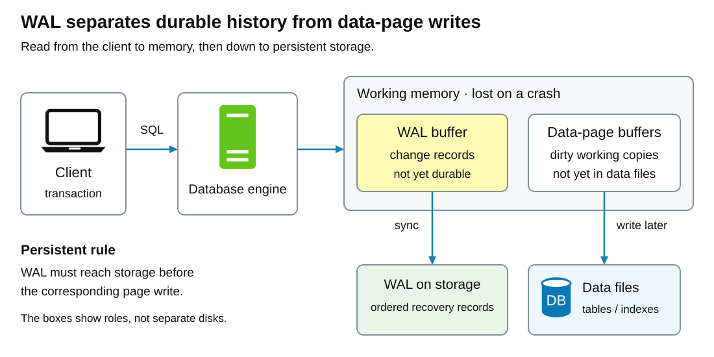
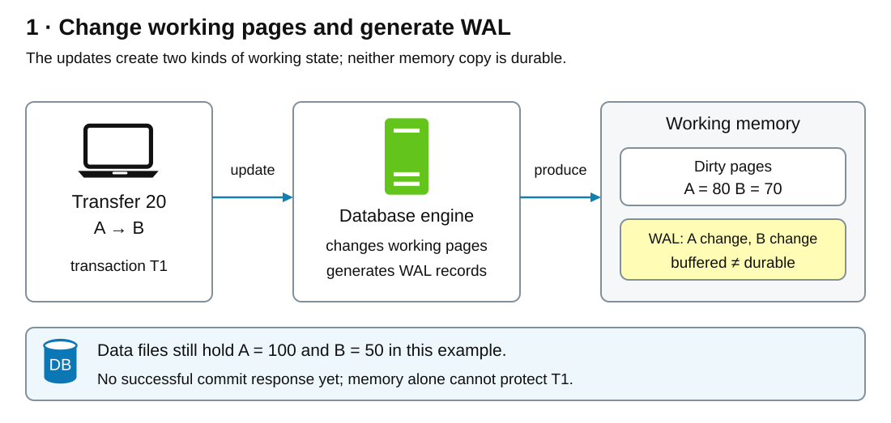
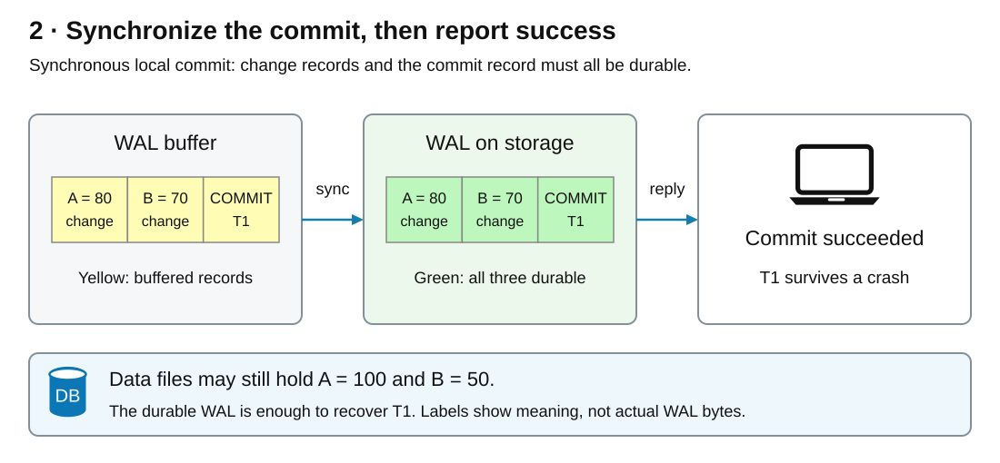
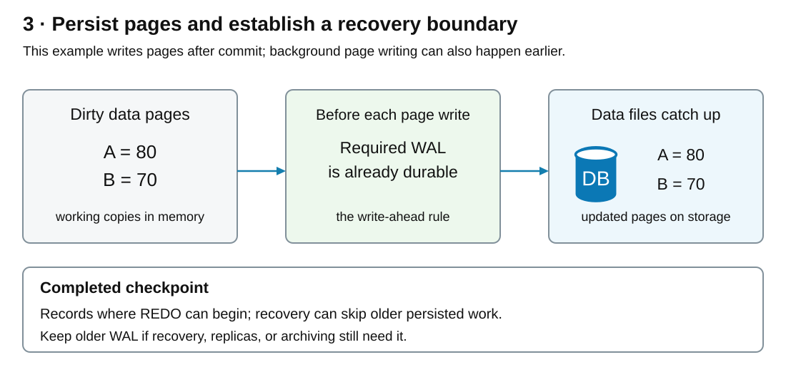
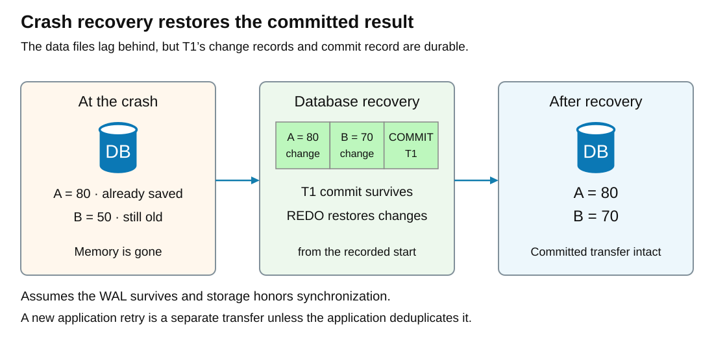

# Write-ahead log (WAL)

<sub>[Back to Distributed Systems](../Readme.md#content)</sub>

**A write-ahead log (WAL) records changes durably before the database writes those changes into its main data files.** If a crash interrupts the data-file writes, the database can reconstruct missing changes from the log. A transaction can therefore become durable without immediately saving every page it changed.

Start with the memory and storage layout, follow a transaction through commit and checkpointing, then examine crash recovery and the limits of the guarantee. The main example uses PostgreSQL 18 with synchronous local commit and reliable storage; other engines share the idea but implement it differently.

## The pieces you need to know

| Term | Meaning |
|---|---|
| Transaction | A group of operations that commits as one unit or is rolled back. |
| Data page | A fixed-size block in a database file, containing table or index data. |
| Buffer pool | Memory holding copies of data pages. A **dirty page** has changes that have not yet been written back to its data file. |
| WAL record | Information the engine uses to recover a change. It is not necessarily the original SQL statement. |
| Log sequence number (LSN) | A position in the log. In PostgreSQL it is a byte offset, useful for comparing recovery and replication progress. |
| Durable | Stored so it survives the failures covered by the storage guarantee, including power loss when synchronization works correctly. |
| REDO | Reapplying recorded changes during recovery. |
| Checkpoint | A recovery boundary established by persisting data and recording where recovery can safely begin. |

## Two representations of the same changes

Read the diagram from the client through the database engine to memory, then down to persistent storage. Memory holds working pages and buffered log records. Follow the downward arrows to compare **WAL on storage** with **Data files**. The two storage boxes describe different roles; they do not require different physical disks.



The WAL describes changes in log order. Data files organize the database for access, such as table and index lookups. A recently committed change can already be recoverable from WAL while its data page on disk still contains an older state.

**“Write ahead” constrains persistent writes, not every change in memory.** Updating an in-memory page does not require a separate disk synchronization first. Before that dirty page is written to its data file, however, all WAL records needed to recover its changes must be durable.

## The two ordering rules

| Rule | Required ordering | Why it matters |
|---|---|---|
| Write-ahead rule | Make a page's WAL records durable **before** writing the changed data page. | Recovery has the information needed if the page write is interrupted. |
| Durable commit rule | Make the transaction's WAL durable **through its commit record before** reporting successful synchronous commit. | Acknowledged work can survive a crash even if the data files lag behind. |

Appending bytes to a memory buffer or handing them to the operating system is not necessarily enough. A synchronization operation, such as `fsync` or an equivalent supported mechanism, must establish persistence. PostgreSQL's `wal_sync_method` selects how WAL is synchronized; available methods depend on the platform. The operating system, controller, and drive must honor that request.

## A transaction to follow

Suppose accounts A and B contain `100` and `50`. Transaction `T1` transfers `20`, producing `A = 80` and `B = 70`. Assume the two rows occupy different pages and there are no competing updates in this example.

The following SQL illustrates the transaction boundary; it assumes an existing `accounts` table and both account rows:

```sql
BEGIN;
UPDATE accounts SET balance = balance - 20 WHERE id = 'A';
UPDATE accounts SET balance = balance + 20 WHERE id = 'B';
COMMIT;
```

The next three sections follow one possible execution. Background page writes can overlap transaction execution; they do not universally wait for commit.

## Step 1 — Change memory and generate log records



Initially, the persisted balances are `100` and `50`. The updates change the working pages in the buffer pool to `80` and `70`, making them dirty, and generate WAL records describing the changes. Records may initially be buffered in memory.

At this stage, the transaction has not received a successful commit response. The changed pages alone cannot provide durability because memory disappears on a crash. PostgreSQL's transaction visibility rules also prevent another transaction from treating these unfinished changes as committed.

The diagram deliberately separates log generation from log persistence: a record's existence in memory is not proof that recovery will find it.

## Step 2 — Persist the commit before acknowledging success



When the client requests `COMMIT`, the engine records the commit and synchronizes the WAL through that record. This also covers the transaction's preceding change records. Only after successful synchronization does synchronous local commit return success.

PostgreSQL's `synchronous_commit` selects what commit waits for. This example assumes `synchronous_commit=on`, `fsync=on`, and no configured synchronous replica. With synchronous replicas configured, `on` also waits for their durable WAL; `local` waits only for the local WAL.

With that synchronization done, `T1` is durable even if neither changed page has reached its data file. There is no requirement to checkpoint this transaction before acknowledging it.

**Group commit** lets one WAL synchronization cover several transactions whose commit records are included in the flushed range. It reduces synchronization work per transaction while each caller still waits for its own required WAL position to become durable.

## Step 3 — Persist pages and advance the recovery boundary



Background writing and checkpointing move dirty pages into the main data files. Every page write still obeys the write-ahead rule. In our execution, the balances on disk eventually become `80` and `70`.

A completed PostgreSQL checkpoint records a safe **redo starting position**, expressed as an LSN. Recovery can start there instead of replaying the database's entire history. The checkpoint record stores this REDO location, which can point earlier in WAL than the checkpoint record itself because writes continue while checkpointing runs.

Old WAL becomes eligible for recycling only when no longer required. Crash recovery is not the only consumer: replication and archival requirements can retain older segments. A checkpoint therefore does not mean “delete the whole log.”

In PostgreSQL, `wal_keep_size` reserves a minimum amount of recent WAL for replicas. **Replication slots** track consumers' progress and can retain WAL they still need, subject to configured retention limits. When archiving is enabled, completed segments must be archived before they can be recycled. These requirements can keep WAL after local crash recovery no longer needs it.

This step is not a universal commit prerequisite. In PostgreSQL, a dirty page may even reach storage before its transaction commits, provided its WAL is already durable; transaction status determines whether those changes become visible.

## What happens after a crash?

Consider a crash after `T1` has a durable commit but before B's page is saved. Disk contains the new A page and the old B page. Recovery uses the checkpoint's redo starting position and the surviving WAL to restore the database to a consistent state.



The outcome depends on what survived, not just on what was in memory:

| State at failure | Outcome for the example |
|---|---|
| `T1` is unfinished, with no recoverable commit | Transaction-status rules prevent its incomplete changes from being exposed as committed data; physical page recovery is a separate concern. |
| `T1`'s changes and commit are durable; some data pages still have old contents | Recovery restores the committed result: `A = 80`, `B = 70`. Torn writes additionally require the protection described below. |
| The commit is durable, but the success response never reaches the client | The transfer can survive even though the client cannot tell whether it succeeded. |
| A checkpoint has already persisted the required state | Recovery needs only the remaining WAL from its recorded starting position. |

**Recovery is engine work, not an application rerunning the SQL transfer.** Blindly executing another debit could move money twice. The lost-response case therefore needs application-level handling, such as a unique transfer ID and a stored result that a retry can check.

WAL does not prescribe one universal undo algorithm. Physical recovery and transaction visibility are separate concerns: restoring recorded page changes is not permission to expose an unfinished transaction. PostgreSQL uses multiversion concurrency control (MVCC), which gives readers an appropriate snapshot of row versions, together with transaction status and locking.

### Interrupted page writes

A power failure can leave a **torn page**: part of a page reflects the new write while another part remains old. Incremental changes alone may not repair that damaged starting state. With `full_page_writes` enabled, PostgreSQL logs a full page image on its first modification after a checkpoint so recovery can reconstruct it. Reliable storage synchronization remains necessary.

## Why WAL helps performance

Committing several scattered data-page changes immediately would require synchronizing those pages. WAL concentrates the commit-critical work into an append-oriented log, while the engine can combine and spread out later page writes. Group commit shares synchronization cost across concurrent transactions.

The work does not disappear: the system writes log information, later writes data pages, and may log full page images. More frequent checkpoints can reduce recovery work but increase write pressure and full-page WAL traffic. Less frequent checkpoints leave more work for recovery. Actual latency depends on the storage, workload, and durability settings.

PostgreSQL starts automatic checkpoints based on elapsed time (`checkpoint_timeout`) or WAL growth (`max_wal_size`), whichever triggers first; idle periods with no new WAL can skip checkpoints. Lowering either setting can make checkpoints more frequent. `max_wal_size` is a soft limit, not a hard cap on retained WAL.

## How implementations differ

| Engine | What WAL protects | Important distinction |
|---|---|---|
| PostgreSQL | Changes needed to recover database pages and transaction state. | Data pages can be written separately from commit. WAL also supports physical replication and archived recovery. |
| SQLite in WAL mode | Changed pages appended to a separate WAL file. | Readers can obtain pages from both the database and WAL. Checkpointing transfers WAL content to the main database; there is one writer at a time. |
| RocksDB | Updates also held in an in-memory **memtable**. | Recovery rebuilds lost memtable contents from WAL. Once the data is flushed into sorted on-disk table files, the corresponding WAL can eventually be reclaimed. |

Do not transfer durability defaults between engines. For example, SQLite's `synchronous=FULL` synchronizes WAL at each commit; `NORMAL` can lose recent transactions after power loss. RocksDB's default WAL behavior provides process-crash consistency, which is not the same promise as surviving a machine failure with all recent writes.

## Guarantees and boundaries

- **Asynchronous commit changes the acknowledgment promise.** With `synchronous_commit=off`, PostgreSQL can return success before WAL is durable, so a crash can lose recent acknowledged transactions. Recovery can still remain consistent. Disabling `fsync` is different and can permit corruption.
- **Local WAL does not create a remote copy.** Replication sends changes to another server. An asynchronous replica can lag behind an acknowledged local commit; failover may lose work it never received. Compare LSNs from the same WAL history to locate the gap: in PostgreSQL's `pg_stat_replication`, a replica's `flush_lsn` reports how far its WAL is durable, while `replay_lsn` reports how far changes have been applied. A replay gap alone does not mean the WAL is missing; the replica may already have it durably stored.
- **WAL is not a complete backup by itself.** PostgreSQL point-in-time recovery needs a suitable base backup and an unbroken sequence of archived WAL. It can stop replay at a chosen recovery target.
- **The storage must survive.** If the only data files and WAL are destroyed together, local crash recovery cannot reconstruct the database from nothing.
- **Isolation still needs concurrency control.** WAL's persistence ordering does not by itself decide which concurrent changes a reader may observe.

The key distinction to remember is **commit versus checkpoint**: commit establishes the transaction's durability promise; a checkpoint establishes a later recovery boundary by persisting accumulated state.

## Self-check

Try answering before revealing the explanations.

1. Can a page change in memory before its WAL is durable? What must happen before that page is written to its data file?
2. `T1` has a durable commit, but B's data page still contains `50` when the server crashes. What balances should recovery produce, and did commit need to wait for a checkpoint?
3. Which PostgreSQL setting allows success before local WAL durability? Why is that different from disabling `fsync`?
4. Why can a completed checkpoint leave older WAL on storage? Name two retention mechanisms.
5. Which two settings control automatic checkpoint timing, and what is the tradeoff in making checkpoints more frequent?
6. A replica's `flush_lsn` has reached the end of `T1`'s commit record, but its `replay_lsn` has not. What has the replica done, and what remains unfinished?
7. The client times out after sending `COMMIT`. Why is blindly repeating the transfer unsafe, and what should a retry check?
8. Why might ordinary incremental WAL records fail to repair a torn page? Which PostgreSQL setting supplies the missing protection?
9. Why can one WAL synchronization safely acknowledge several transactions?
10. Why is “WAL is enabled” insufficient to claim power-loss durability? Use SQLite's `FULL`/`NORMAL` modes and RocksDB's default as examples.

<details>
<summary>Check your answers</summary>

1. Yes. The write-ahead rule constrains persistent page writes: the WAL needed to recover a page's changes must be durable before the changed page is written to its data file.
2. Recovery restores `A = 80` and `B = 70` under the example's storage assumptions. Commit needed durable WAL through its commit record, not a checkpoint or immediate writes of both data pages.
3. `synchronous_commit=off` permits asynchronous commit. A crash can lose recent acknowledged transactions while recovery remains consistent. Turning `fsync` off can also permit corruption.
4. Other consumers may still need that WAL. `wal_keep_size` retains recent WAL for replicas, replication slots can retain WAL needed by their consumers, and enabled archiving must finish before segments can be recycled.
5. `checkpoint_timeout` and `max_wal_size`. More frequent checkpoints can shorten recovery but increase page-write pressure and full-page WAL traffic; `max_wal_size` is not a hard storage cap.
6. The replica has durably stored WAL through the commit but has not finished replaying it. This is an apply delay, not evidence that those WAL records are absent.
7. The first attempt may already have committed, so another debit could transfer money twice. Use a stable transfer ID and check the stored outcome so a retry cannot duplicate the effect.
8. A torn page mixes old and new contents, leaving an unreliable starting point for incremental changes. `full_page_writes` logs a full page image on the first modification after a checkpoint; reliable synchronization is still required.
9. Group commit makes a range of WAL durable together. Each transaction can return once that durable range includes its own commit record and preceding changes.
10. In SQLite WAL mode, `synchronous=FULL` synchronizes WAL at each commit, while `NORMAL` can lose recent transactions after power loss. RocksDB's default provides process-crash consistency, not a promise that every recent write survives machine failure. Check each engine's durability settings and failure model.

</details>

# Sources

Primary sources checked on 2026-09-17; PostgreSQL references are pinned to version 18.

Accounts A and B, their balances, transaction `T1`, and the illustrated write/crash timing are teaching examples. The SQL illustrates the transaction boundary and was not executed against a live database.

- [PostgreSQL 18 — Write-Ahead Logging](https://www.postgresql.org/docs/18/wal-intro.html)
- [PostgreSQL 18 — Transactions](https://www.postgresql.org/docs/18/tutorial-transactions.html)
- [PostgreSQL 18 — WAL Internals](https://www.postgresql.org/docs/18/wal-internals.html)
- [PostgreSQL 18 — Reliability](https://www.postgresql.org/docs/18/wal-reliability.html)
- [PostgreSQL 18 — WAL Configuration](https://www.postgresql.org/docs/18/wal-configuration.html)
- PostgreSQL 18.0 source (`REL_18_0`) — [`SyncOneBuffer`](https://github.com/postgres/postgres/blob/REL_18_0/src/backend/storage/buffer/bufmgr.c#L3918-L3981) and [`FlushBuffer`](https://github.com/postgres/postgres/blob/REL_18_0/src/backend/storage/buffer/bufmgr.c#L4264-L4374): the pre-commit page-write claim follows from this implementation. Buffer selection checks validity, dirtiness, and usage without a transaction-commit check; for permanent buffers, `FlushBuffer` calls `XLogFlush` through the page's LSN before `smgrwrite`. The write initially hands data to the kernel, so it permits pre-commit persistence without guaranteeing immediate disk persistence.
- [PostgreSQL 18 — WAL Settings: `synchronous_commit`, `wal_sync_method`, and checkpoint controls](https://www.postgresql.org/docs/18/runtime-config-wal.html)
- [PostgreSQL 18 — Replication Settings: WAL retention](https://www.postgresql.org/docs/18/runtime-config-replication.html)
- [PostgreSQL 18 — `pg_stat_replication`: flush and replay LSNs](https://www.postgresql.org/docs/18/monitoring-stats.html#MONITORING-PG-STAT-REPLICATION-VIEW)
- [PostgreSQL 18 — Asynchronous Commit](https://www.postgresql.org/docs/18/wal-async-commit.html)
- [PostgreSQL 18 — Concurrency Control: Introduction](https://www.postgresql.org/docs/18/mvcc-intro.html)
- [PostgreSQL 18 — Log-Shipping Standby Servers](https://www.postgresql.org/docs/18/warm-standby.html)
- [PostgreSQL 18 — Continuous Archiving and Point-in-Time Recovery](https://www.postgresql.org/docs/18/continuous-archiving.html)
- [SQLite — Write-Ahead Logging](https://sqlite.org/wal.html)
- [RocksDB — Write Ahead Log](https://github.com/facebook/rocksdb/wiki/Write-Ahead-Log-%28WAL%29)
- [Amazon Builders' Library — Making retries safe with idempotent APIs](https://aws.amazon.com/builders-library/making-retries-safe-with-idempotent-APIs/)
- Local diagram provenance: [System Design — database](../../system%20design/01.%20Scaling/images/database.svg) supplies the laptop, server, and database geometry reused as editable vectors. [Distributed Message Queue — adding a partition](../../system%20design/19.%20Distributed%20Message%20Queue/images/partition-example.svg) supplies the yellow new-message and green persisted-message palette, adapted here for buffered and durable WAL records.
