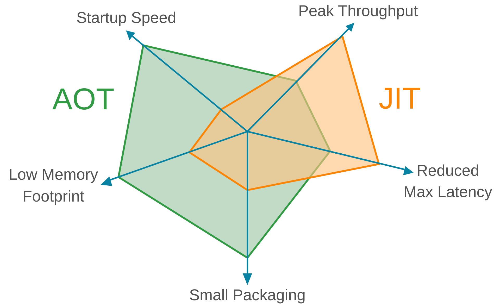
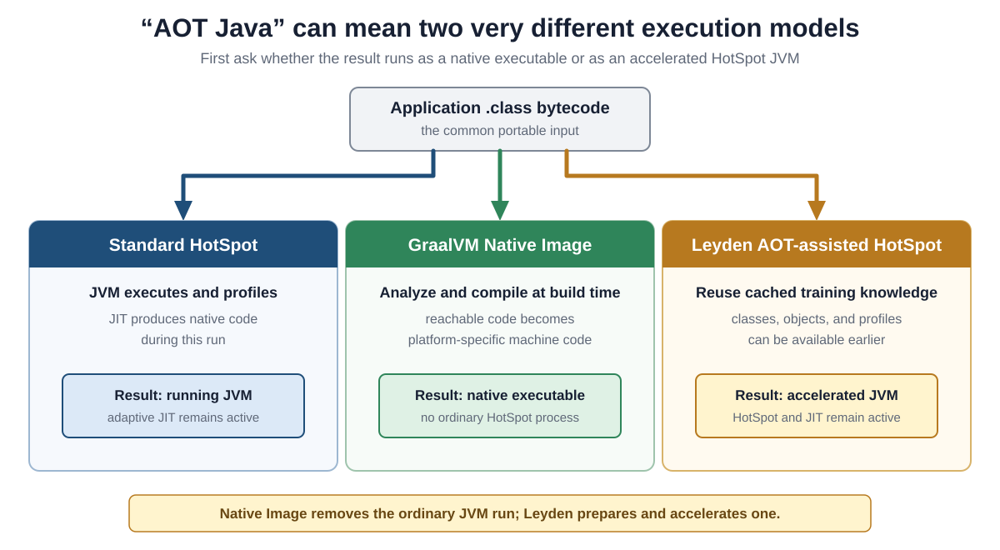
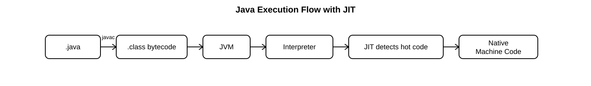
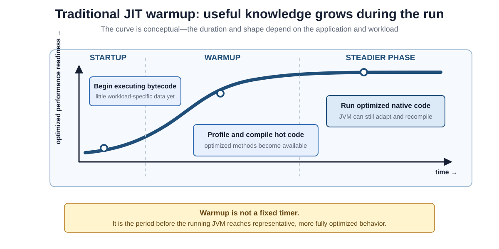
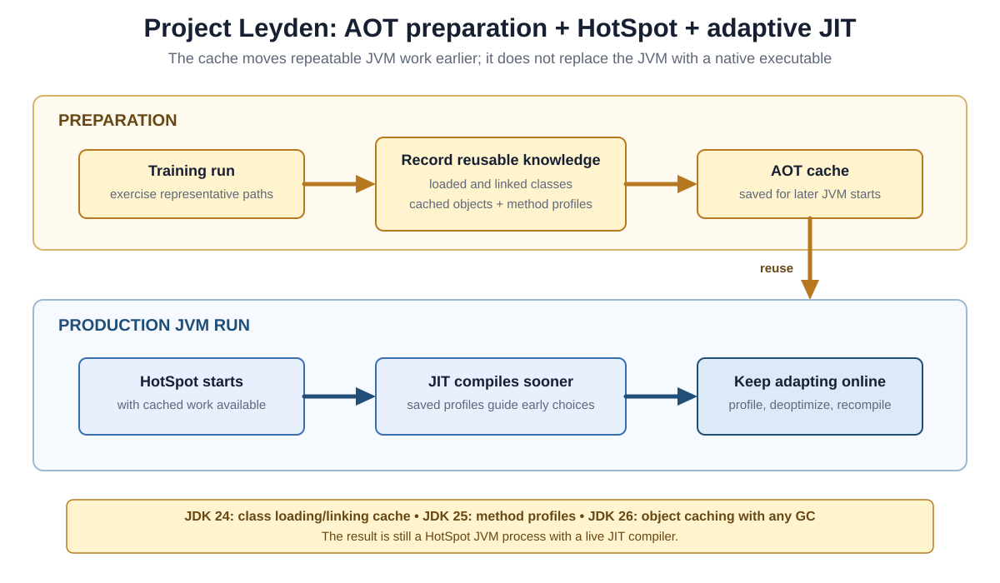

# AOT vs. JIT in Modern Java

## Front

How do **Just-in-Time (JIT)** compilation, **GraalVM Native Image AOT**, and **Project Leyden's AOT-assisted HotSpot** differ?

Explain when machine code is produced, why profiling matters, what runs in production, and what JDK 24–26 added.

## Back

**JIT and AOT describe when compilation or preparation happens; they are not two mutually exclusive ways that every Java program must choose between.** Standard HotSpot compiles hot code during a JVM run, GraalVM Native Image creates a native executable before deployment, and Project Leyden moves repeatable work ahead of time while retaining HotSpot and its adaptive JIT.

This card first compares the models, then explains HotSpot warmup, full native AOT, profile-guided optimization, and Leyden's hybrid approach.



## Core vocabulary

- **Bytecode** is the portable instruction format stored in `.class` files.
- **Native code** is machine code for a particular processor and operating system.
- **Just-in-Time (JIT) compilation** produces native code while the application is running.
- **Ahead-of-Time (AOT) work** happens before the production run. That work might produce a complete native executable, or it might only prepare information that a later JVM run can reuse.
- A **profile** is observed execution data, such as which methods run often, which branches are common, and which concrete types appear at a call site.
- **Hot code** means code that the runtime considers worth compiling or optimizing based on observed execution—not merely code present in the application.

## Three execution models

The phrase “AOT Java” is ambiguous. The decisive question is: **does production run a native executable, or does it still run on HotSpot?**



| Model | What happens before production | Where native code is produced | What runs in production |
|---|---|---|---|
| Standard HotSpot | Normal Java build creates bytecode | JIT compilers produce it during the JVM run | HotSpot JVM with adaptive JIT |
| GraalVM Native Image | Static analysis and AOT compilation create a platform-specific executable | Native Image produces it at build time | Native executable; no ordinary HotSpot process |
| Leyden AOT-assisted HotSpot | A training workflow prepares an AOT cache | HotSpot's JIT still produces optimized native code during production | HotSpot JVM with cached knowledge and adaptive JIT |

## How HotSpot JIT works

HotSpot normally uses **tiered compilation**. The interpreter and lower compiler tiers start execution and gather profiles. More optimizing tiers can then compile frequently executed methods using what the JVM has observed. Generated machine code is stored in the JVM's **code cache**.



The JVM remains involved after compilation. Optimizing compilers may make speculative assumptions, such as “this call site usually sees one implementation.” If reality changes, HotSpot can **deoptimize** that machine code, return execution to a less optimized form, and later compile again with newer information.

This adaptiveness is valuable for long-running applications whose real workload becomes clear only at runtime.

### Minimal hot-loop example

This complete program repeatedly calls the same method, giving a JVM an opportunity to observe and compile it. It demonstrates the shape of a hot workload; it does **not** guarantee a particular compilation tier or compilation moment.

```java
public final class HotLoopDemo {
    private static long sumOfSquares(int limit) {
        long sum = 0;
        for (int value = 1; value <= limit; value++) {
            sum += (long) value * value;
        }
        return sum;
    }

    public static void main(String[] args) {
        long result = 0;
        for (int repetition = 0; repetition < 20_000; repetition++) {
            result = sumOfSquares(1_000);
        }
        System.out.println(result);
    }
}
```

For trustworthy performance measurements, use a proper benchmarking harness and a representative workload; a single wall-clock timing of this program would mix startup, warmup, and steady execution.

## Why JIT warmup exists

At the start of a traditional run, HotSpot has little application-specific evidence. It must execute code, collect profiles, identify hot behavior, and compile optimized versions. **Warmup** is the period before the running application reaches representative, more fully optimized behavior; it is not a fixed number of seconds.



The exact curve depends on the code, inputs, traffic, JVM settings, and what metric is observed. “Warm” also does not mean “finished forever”: HotSpot can continue learning and adapting.

## GraalVM Native Image: full native AOT

GraalVM Native Image analyzes an application's reachable code and creates a platform-specific native executable. The image contains the application, required libraries, and necessary runtime pieces such as memory management and thread scheduling, but it does not launch as an ordinary HotSpot JVM process.


Native Image uses a **closed-world assumption**: at build time, it must determine which program elements may be reachable. Only reachable elements are included. Dynamic behavior that static analysis cannot discover—commonly reflection, dynamic proxies, resources, serialization, or Java Native Interface use—may require reachability metadata.

This model commonly favors fast process startup and a compact runtime footprint. Its trade-offs include a more involved build, a platform-specific artifact, and less opportunity to adapt continuously to a changing production workload than a live JIT has.

### Profile-guided optimization for Native Image

**Profile-guided optimization (PGO)** supplies observed behavior to a later AOT build:

1. Build an instrumented native executable.
2. Run a workload that represents production behavior.
3. Save the resulting profile.
4. Build the optimized native executable using that profile.

PGO helps the AOT compiler make decisions using evidence instead of static structure alone. However, the final executable is still compiled before deployment; it does not become a continuously adapting HotSpot JIT. A misleading training workload can also produce a profile that is unhelpful for real traffic.

## Project Leyden: AOT-assisted HotSpot

Project Leyden takes a different path. A training workflow records reusable information in an **AOT cache**. A later production launch uses that cache to avoid repeating some startup work, but the application still runs on HotSpot and the JIT remains active.



The recent milestones build on one another:

- **JDK 24 — JEP 483, Ahead-of-Time Class Loading & Linking:** HotSpot can cache classes in loaded and linked form after a training run, making them available earlier in later runs.
- **JDK 25 — JEP 515, Ahead-of-Time Method Profiling:** method-execution profiles from a training run can be available when HotSpot starts, so the JIT can generate optimized native code sooner.
- **JDK 26 — JEP 516, Ahead-of-Time Object Caching with Any GC:** AOT object caching works with all HotSpot garbage collectors, including ZGC, by supporting a garbage-collector-agnostic cached representation.

The cache is therefore **neither a standalone executable nor proof that all application methods were precompiled into native code**. It is prepared knowledge for a later JVM run.

## Why cached profiles shorten warmup

Without a saved profile, a new JVM must first observe enough current-run behavior. With JDK 25's AOT method profiles, the JIT receives useful training evidence at startup and can begin optimized compilation earlier.


The production run still gathers fresh profiles. If its workload differs from training, HotSpot can update its decisions, deoptimize outdated assumptions, and recompile. Leyden therefore aims to combine **earlier readiness** with **runtime adaptation**.

## Choosing the mental model

| Question | HotSpot JIT | Native Image AOT | Leyden AOT-assisted HotSpot |
|---|---|---|---|
| Is a JVM required in production? | Yes | No ordinary HotSpot process | Yes |
| Does production JIT compilation remain active? | Yes | No HotSpot JIT | Yes |
| Can optimization use current-run behavior? | Yes | Not through a live HotSpot JIT | Yes |
| Can earlier training data help? | Not in the basic path | Yes, through optional PGO | Yes, through the AOT cache |
| Main idea | Learn and optimize during this run | Compile a complete native artifact before the run | Reuse earlier work, then keep learning during the run |

## Common misconceptions

- **“AOT always means a native executable.”** No. Leyden's AOT cache accelerates a later JVM run.
- **“JIT means interpreting forever.”** No. HotSpot compiles hot bytecode into native code and can replace earlier compiled versions with better ones.
- **“Native Image has no runtime.”** It contains necessary runtime components; it simply does not run as an ordinary HotSpot JVM process.
- **“A saved profile freezes HotSpot's decisions.”** No. JDK 25 supplies starting evidence, while online profiling and adaptation continue.
- **“One model is universally fastest.”** No. Startup, peak throughput, memory, build complexity, application dynamism, and workload representativeness all affect the result.

## Summary

**HotSpot JIT learns now; Native Image AOT commits before deployment; Leyden remembers earlier work and then keeps learning.** That distinction explains why modern Java can use AOT techniques without giving up the JVM or JIT compilation.

## Sources

- [Oracle Java 26 documentation — Java HotSpot Virtual Machine Performance Enhancements](https://docs.oracle.com/en/java/javase/26/vm/java-hotspot-virtual-machine-performance-enhancements.html)
- [GraalVM Native Image — Build a Native Executable](https://www.graalvm.org/latest/reference-manual/native-image/basics/)
- [GraalVM Native Image — Profile-Guided Optimization](https://www.graalvm.org/latest/reference-manual/native-image/optimizations-and-performance/PGO/)
- [JEP 483: Ahead-of-Time Class Loading & Linking — JDK 24](https://openjdk.org/jeps/483)
- [JEP 515: Ahead-of-Time Method Profiling — JDK 25](https://openjdk.org/jeps/515)
- [JEP 516: Ahead-of-Time Object Caching with Any GC — JDK 26](https://openjdk.org/jeps/516)
