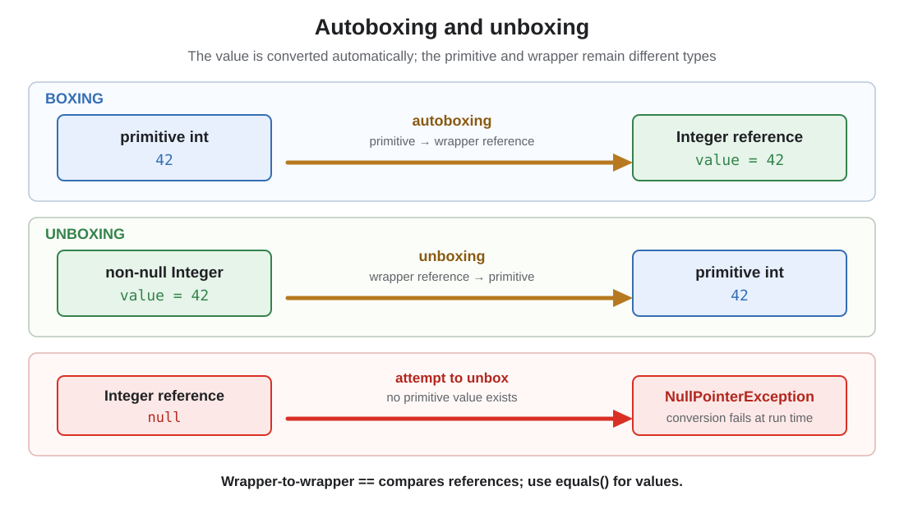

# Autoboxing and Unboxing

## Front

What do autoboxing and unboxing do, and which `null` and equality mistakes can they cause?

## Back

**Autoboxing and unboxing were introduced in J2SE 5.0 through JSR 201.**

**Autoboxing** converts a primitive value to its corresponding wrapper reference; **unboxing** converts a wrapper reference back to its primitive value.



Common pairs include `int` ↔ `Integer`, `long` ↔ `Long`, `double` ↔ `Double`, and `boolean` ↔ `Boolean`. Every primitive type has a wrapper.

### What the compiler converts

Inside a method, these statements are valid:

```java
Integer boxed = 42;       // autoboxing: int → Integer
int primitive = boxed;    // unboxing: Integer → int

List<Integer> values = List.of(10, 20);
int sum = values.get(0) + values.get(1); // both Integers unbox
```

Conceptually, the first two conversions resemble `Integer.valueOf(42)` and `boxed.intValue()`. Boxing appears when an object type is required, especially with generics; `List<int>` is illegal.

### Main danger: unboxing `null`

```java
Integer missing = null;
int value = missing; // NullPointerException
```

Unboxing needs a primitive value, but a null reference has none. The same failure can occur in arithmetic, comparisons with a primitive, method arguments, returns, or `if` with a nullable `Boolean`.

### Wrapper equality

```java
Integer first = 1_000;
Integer second = 1_000;

boolean sameObject = first == second;      // identity: do not use for values
boolean sameValue = first.equals(second);  // true: compares Integer values
```

Some boxed constants are required to share identities, and implementations may share more, so `==` can appear to work accidentally. Use `Objects.equals(first, second)` when either reference may be null. Comparing a wrapper with a primitive unboxes the wrapper; a null wrapper then throws.

### Which representation to choose

- Prefer a primitive for arithmetic, counters, and two-state booleans.
- Use a wrapper when generics, an object-based API, or intentional nullability requires a reference.
- Remember that repeated boxing may create objects, and `Integer count++` performs unbox → add → box; it is not an atomic increment.

## Sources

- [JSR 201: Enumerations, Autoboxing, Enhanced `for`, and Static Import](https://jcp.org/en/jsr/detail?id=201)
- [JLS 26 §5.1.7: Boxing Conversion](https://docs.oracle.com/javase/specs/jls/se26/html/jls-5.html#jls-5.1.7)
- [JLS 26 §5.1.8: Unboxing Conversion](https://docs.oracle.com/javase/specs/jls/se26/html/jls-5.html#jls-5.1.8)
