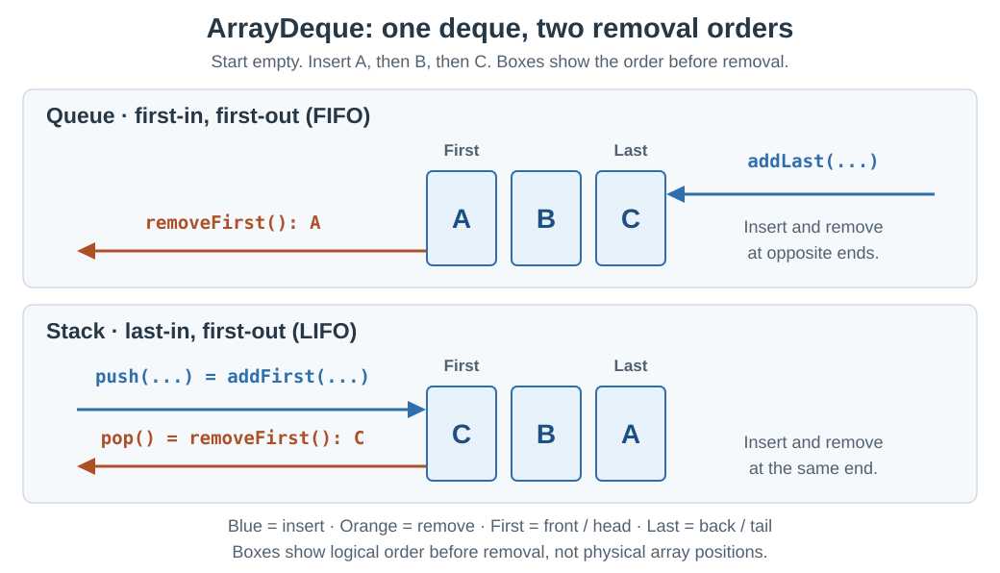

# Collections. ArrayDeque

<sub>[Back to Java](../Readme.md#content)</sub>

# Front

How can Java's `ArrayDeque` act as either a queue or a stack?

# Back

**`ArrayDeque` was introduced in Java 6 as a resizable-array implementation of `Deque`.**

A **deque** is a double-ended queue: you can insert, inspect, or remove elements at either end. `ArrayDeque` grows as needed. The ends you choose determine whether it behaves as a queue or a stack.

For stack use, `ArrayDeque` is likely faster than legacy `Stack`; for queue use, it is likely faster than `LinkedList`.

## Choose the ends

**First** means front/head; **Last** means back/tail. Each example starts empty and inserts A, then B, then C. The boxes show the logical first-to-last order before removal; arrows show the ends used.



| Use | Insert | Remove and return | Order |
| --- | --- | --- | --- |
| Queue | `add(e)` = `addLast(e)` | `remove()` = `removeFirst()` | First-in, first-out (FIFO): oldest first |
| Stack | `push(e)` = `addFirst(e)` | `pop()` = `removeFirst()` | Last-in, first-out (LIFO): newest first |

Queue aliases: `offer(e)` = `offerLast(e)`, `poll()` = `pollFirst()`. Despite its array storage, `ArrayDeque` has no indexed access such as `get(0)`.

The `addFirst`/`addLast`, `getFirst`/`getLast`, and `removeFirst`/`removeLast` operations also belong to [`SequencedCollection`](../Collections.%20SequencedCollection/Readme.md), which `Deque` has extended since Java 21.

## Example

```java
import java.util.ArrayDeque;
import java.util.Deque;

public class ArrayDequeExample {
    public static void main(String[] args) {
        Deque<String> queue = new ArrayDeque<>();
        queue.addLast("A");
        queue.addLast("B");
        queue.addLast("C");
        System.out.println(queue.removeFirst()); // A

        Deque<String> stack = new ArrayDeque<>();
        stack.push("A");
        stack.push("B");
        stack.push("C");
        System.out.println(stack.pop());         // C
    }
}
```

## Empty deque and practical limits

- `pollFirst()` / `pollLast()` remove and return an element, or return `null` if empty. `peekFirst()` / `peekLast()` inspect without removing, also returning `null` if empty.
- `removeFirst()` / `removeLast()`, `getFirst()` / `getLast()`, and `pop()` throw `NoSuchElementException` if empty.
- **No `null` elements:** insertion throws `NullPointerException`, so a returned `null` unambiguously means empty.
- **Not thread-safe:** concurrent access needs external synchronization or a suitable concurrent collection such as [`ConcurrentLinkedDeque`](../Concurrency.%20ConcurrentLinkedDeque/Readme.md).
- End insertion/removal is **amortized O(1)**: constant cost per operation averaged over a sequence, though an individual insertion can trigger array growth. `contains(x)` and `remove(x)` by value are **O(n)**: work can grow with the number of elements.

# Sources

- [Java SE 25 — ArrayDeque: introduction, storage, performance, and restrictions](https://docs.oracle.com/en/java/javase/25/docs/api/java.base/java/util/ArrayDeque.html)
- [Java SE 25 — Deque: queue/stack methods, aliases, and empty behavior](https://docs.oracle.com/en/java/javase/25/docs/api/java.base/java/util/Deque.html)
- [Java SE 21 — SequencedCollection: endpoint operations and Deque as a subinterface](https://docs.oracle.com/en/java/javase/21/docs/api/java.base/java/util/SequencedCollection.html)
- [Java SE 25 — ConcurrentLinkedDeque: safe concurrent access](https://docs.oracle.com/en/java/javase/25/docs/api/java.base/java/util/concurrent/ConcurrentLinkedDeque.html)
