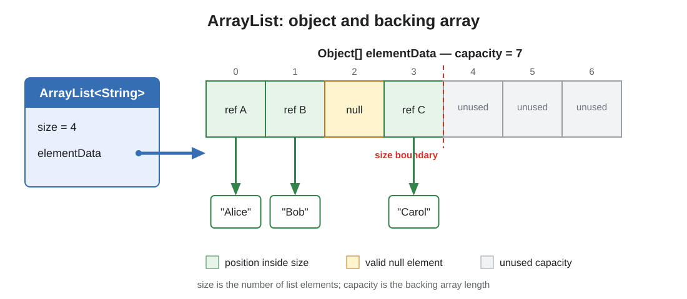
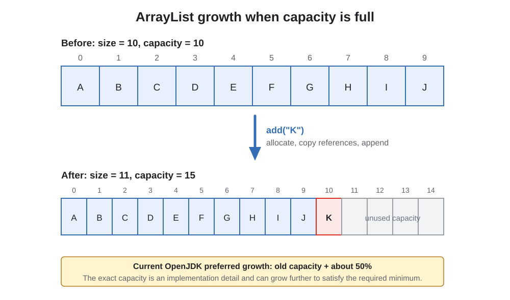
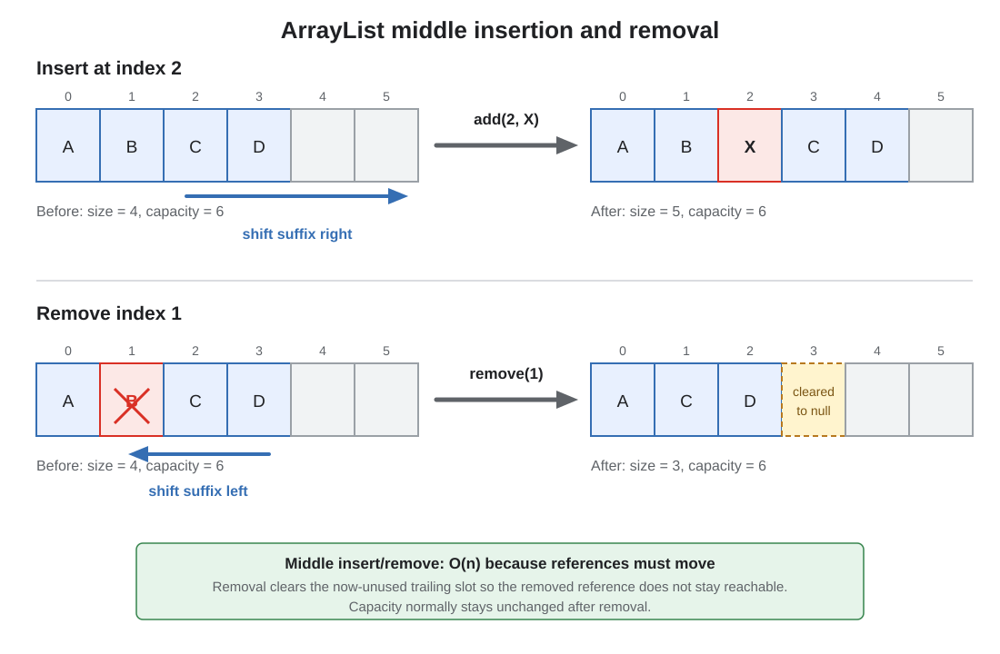

# ArrayList in Modern Java

## Front

How does `ArrayList` work internally in modern Java?

Explain its storage model, capacity growth, operation complexity, iteration and concurrency behavior, modern `List` methods, common pitfalls, and when to use it.

## Back

`ArrayList<E>` is a **mutable, resizable-array implementation** of the `List<E>` interface.

It provides:

- Ordered, zero-based elements.
- Fast indexed access.
- Duplicate elements.
- `null` elements.
- Automatic capacity growth.
- Fail-fast iterators on a best-effort basis.

It is **not synchronized** and is therefore not automatically safe for concurrent mutation.

```java
List<String> names = new ArrayList<>();

names.add("Alice");
names.add("Bob");
names.add("Alice"); // duplicates are allowed
names.add(null);    // null is allowed

String first = names.get(0);
names.set(1, "Carol");
```

`ArrayList` implements `List`, `RandomAccess`, `SequencedCollection`, `Cloneable`, and `Serializable`.

## Internal storage model



Conceptually, an `ArrayList` contains:

```java
Object[] elementData; // backing array
int size;             // number of logical elements
```

This is an explanatory model of the current OpenJDK implementation, not its public API.

### Size versus capacity

```text
size     = number of elements in the list
capacity = length of the backing array
```

For example:

```text
elementData = [A, B, C, null, null, null]
               └─ size = 3 ─┘
               └──── capacity = 6 ─────┘
```

Only positions `0` through `size - 1` belong to the list. Positions from `size` through `capacity - 1` are unused storage.

Because `ArrayList` permits `null`, a `null` inside the logical size is a real element:

```java
List<String> values = new ArrayList<>();
values.add("A");
values.add(null);

System.out.println(values.size()); // 2
System.out.println(values.get(1)); // null
```

The backing array stores **references**, not the objects themselves. Copying an `ArrayList` therefore normally creates a shallow copy of the references.

### Generics and primitive values

Because Java generics do not directly store primitive types, primitive values are boxed:

```java
List<Integer> numbers = new ArrayList<>();
numbers.add(42); // int is boxed to Integer
```

For very large primitive collections, boxing can add significant allocation and memory overhead.

## Construction

### Default construction

```java
List<String> names = new ArrayList<>();
```

The current OpenJDK implementation initially shares an empty array and lazily allocates element storage on the first insertion. The first ordinary insertion into a default-constructed list normally establishes capacity 10.

The lazy allocation and exact capacity are implementation details. Application correctness must not depend on them.

### Known initial capacity

```java
List<Event> events = new ArrayList<>(10_000);
```

Use an initial capacity when the approximate final size is known. It can prevent repeated allocation and copying while the list is built.

Initial capacity is not initial size:

```java
List<String> names = new ArrayList<>(100);

System.out.println(names.size()); // 0
names.get(0);                     // IndexOutOfBoundsException
```

The constructor reserves room; it does not add elements.

### Copy from another collection

```java
List<String> mutableCopy = new ArrayList<>(source);
```

The new list has its own backing storage, but it contains the same element references. Mutating a referenced object is visible through both lists.

## Capacity growth



When an insertion would exceed capacity, `ArrayList` conceptually:

1. Calculates a larger capacity.
2. Allocates a new `Object[]`.
3. Copies existing references into it.
4. Stores the new element.
5. Replaces its backing-array reference.

The current OpenJDK implementation has a **preferred growth of approximately 50%**:

```text
preferred new capacity ≈ old capacity + old capacity / 2

10 → 15 → 22 → 33 → ...
```

The actual capacity can be larger when needed to satisfy a bulk insertion. The growth factor and exact capacities are implementation details, not `ArrayList` API guarantees.

### Why appending is amortized O(1)

Most calls to `add(element)` write into an already available slot and cost O(1). An occasional growth costs O(n) because all references must be copied.

Across many appends, those occasional copies are distributed over the cheap operations. Therefore, append has **amortized O(1)** complexity, not guaranteed O(1) for every individual call.

### Capacity controls

```java
ArrayList<String> names = new ArrayList<>();

names.ensureCapacity(10_000);
// Add many elements...
names.trimToSize();
```

- `ensureCapacity(n)` requests room for at least `n` elements.
- `trimToSize()` reduces capacity to the current size.

Both can allocate and copy the backing array. `trimToSize()` should not be repeatedly called while a list is still growing.

Removing elements does **not normally shrink capacity automatically**.

## Operation complexity

| Operation | Typical complexity | Reason |
|---|---:|---|
| `size()` | O(1) | Reads the size field |
| `get(index)` | O(1) | Direct array access |
| `set(index, value)` | O(1) | Replaces one array reference |
| `add(value)` | Amortized O(1) | Usually writes at the end; occasionally grows |
| `add(index, value)` | O(n) | Shifts the suffix right |
| `addFirst(value)` | O(n) | Equivalent to insertion at index 0 |
| `addLast(value)` | Amortized O(1) | Equivalent to appending |
| `remove(index)` | O(n) | Shifts the suffix left |
| `removeFirst()` | O(n) | Shifts nearly every remaining reference |
| `removeLast()` | O(1) | No suffix must move |
| `contains(value)` | O(n) | Linear search using `equals()` |
| `indexOf(value)` | O(n) | Linear search from the beginning |
| Iteration | O(n) | Visits each element once |
| `clear()` | O(n) | Clears used references |

`ArrayList` is a good fit when random indexed access and end-appending dominate. It is not a good queue when elements are repeatedly removed from the front.

## Middle insertion and removal



### Insertion

```java
List<String> letters = new ArrayList<>(
        List.of("A", "B", "C", "D")
);

letters.add(2, "X");

// [A, B, X, C, D]
```

Before writing `X`, the suffix `[C, D]` moves one position to the right.

### Removal

```java
letters.remove(1);

// [A, X, C, D]
```

The suffix moves one position left. The implementation clears the former trailing slot so that an obsolete reference does not keep an object reachable from the backing array.

The list does not own its elements. An object becomes eligible for garbage collection only when no reachable references to it remain anywhere in the application.

## Modern sequenced methods: Java 21+

Since Java 21, `List` is a `SequencedCollection` and provides first/last and reverse-view operations:

```java
ArrayList<String> names = new ArrayList<>(
        List.of("Alice", "Bob", "Carol")
);

String first = names.getFirst(); // Alice
String last  = names.getLast();  // Carol

names.addFirst("Zoe");
names.addLast("Dave");

String removedFirst = names.removeFirst();
String removedLast  = names.removeLast();
```

These methods do not change the underlying data structure:

- `getFirst()` and `getLast()` are O(1).
- `addFirst()` and `removeFirst()` are O(n) on `ArrayList`.
- `addLast()` is amortized O(1).
- `removeLast()` is O(1).

On an empty list, `getFirst()`, `getLast()`, `removeFirst()`, and `removeLast()` throw `NoSuchElementException`.

### `reversed()` returns a view

```java
List<String> original = new ArrayList<>(
        List.of("A", "B", "C")
);

List<String> reversed = original.reversed();

System.out.println(reversed); // [C, B, A]

reversed.set(0, "X");

System.out.println(original); // [A, B, X]
```

`reversed()` does not make an independent copy. It returns a reverse-ordered **view**, and supported modifications write through to the underlying list.

Use this for an independent mutable reversed copy:

```java
List<String> reversedCopy = new ArrayList<>(original.reversed());
```

## Iterators and structural modification

```java
List<String> names = new ArrayList<>(
        List.of("Alice", "Bob", "Carol")
);

for (String name : names) {
    System.out.println(name);
}
```

An `ArrayList` iterator is normally **fail-fast**. If the list is structurally modified outside the iterator after the iterator is created, the iterator may throw `ConcurrentModificationException`:

```java
for (String name : names) {
    if (name.startsWith("B")) {
        names.remove(name); // unsafe during enhanced-for iteration
    }
}
```

A structural modification changes the list's size or otherwise disturbs iteration. Replacing an existing element with `set()` is not generally structural.

Fail-fast behavior is a **best-effort bug detector**, not a synchronization or correctness guarantee. Code must not depend on the exception always being thrown.

### Safe removal during iteration

Use the iterator's own method:

```java
Iterator<String> iterator = names.iterator();

while (iterator.hasNext()) {
    String name = iterator.next();

    if (name.startsWith("B")) {
        iterator.remove();
    }
}
```

Or express the bulk operation directly:

```java
names.removeIf(name -> name.startsWith("B"));
```

`ListIterator` additionally supports bidirectional traversal, replacement, and insertion at the iterator position.

## `subList()` is a view, not a copy

```java
List<String> original = new ArrayList<>(
        List.of("A", "B", "C", "D")
);

List<String> middle = original.subList(1, 3);

System.out.println(middle); // [B, C]

middle.set(0, "X");
System.out.println(original); // [A, X, C, D]
```

Changes made through the view write through to the original list.

Structural changes to the original list outside the view make later use of the view undefined by the `List` contract and commonly cause `ConcurrentModificationException`:

```java
List<String> view = original.subList(1, 3);
original.add("E");
view.size(); // commonly ConcurrentModificationException
```

Create an independent list when a view is not desired:

```java
List<String> copy = new ArrayList<>(
        original.subList(1, 3)
);
```

## The overloaded `remove()` trap

`List` has two different removal methods:

```java
E remove(int index);
boolean remove(Object value);
```

This is particularly easy to misuse with `Integer`:

```java
List<Integer> numbers = new ArrayList<>(
        List.of(10, 20, 30)
);

numbers.remove(1);                  // removes index 1: value 20
numbers.remove(Integer.valueOf(1)); // removes the value 1, if present
```

An `int` argument selects `remove(int index)`. Use `Integer.valueOf(value)` when removing an `Integer` value explicitly.

## Equality, searching, and mutable elements

List equality is order-sensitive and content-based:

```java
List<String> first = new ArrayList<>(List.of("A", "B"));
List<String> second = List.of("A", "B");
List<String> third = List.of("B", "A");

first.equals(second); // true
first.equals(third);  // false
```

Methods such as `contains`, `indexOf`, `remove(Object)`, and list equality use element equality, including null-safe handling of `null`.

Mutable elements remain mutable:

```java
List<User> users = new ArrayList<>();
User user = new User("Alice");
users.add(user);

user.rename("Carol");
// The list still points to the same changed User object.
```

An unmodifiable list prevents structural list changes; it does not make contained objects immutable.

## Thread safety

`ArrayList` does not synchronize access. Concurrent reads are safe only when the list is safely published and no thread mutates it at the same time.

This is unsafe:

```java
List<String> shared = new ArrayList<>();

// Several threads concurrently call add(), get(), or iterate.
```

Possible alternatives depend on the workload.

### External synchronization

```java
List<String> shared = Collections.synchronizedList(
        new ArrayList<>()
);
```

Compound operations still need explicit coordination. Iteration must be protected with the same list monitor:

```java
synchronized (shared) {
    for (String value : shared) {
        consume(value);
    }
}
```

### Other concurrent designs

- Use `CopyOnWriteArrayList` for small, read-heavy lists with rare writes and snapshot traversal.
- Use a concurrent queue or deque for producer-consumer and queue workloads.
- Use immutable snapshots such as `List.copyOf(...)` when readers do not need mutation.
- Use an application lock when several operations must preserve one invariant.

The synchronized `Vector` class is usually not the first choice for new code. Per-method synchronization alone does not make multi-step logic atomic.

## `ArrayList` versus common alternatives

| Construction/type | Size changes? | Element replacement? | Allows `null`? | Important behavior |
|---|---:|---:|---:|---|
| `new ArrayList<>()` | Yes | Yes | Yes | Mutable resizable array |
| `List.of(...)` | No | No | No | Compact unmodifiable list |
| `List.copyOf(source)` | No | No | No | Unmodifiable snapshot; shallow elements |
| `Arrays.asList(array)` | No | Yes | Yes | Fixed-size list backed by the array |
| `Collections.unmodifiableList(list)` | Only through backing list | Only through backing list | Depends on backing list | Unmodifiable view, not an independent copy |
| `CopyOnWriteArrayList` | Yes | Yes | Yes | Thread-safe; expensive writes; snapshot iterators |

### Mutable copy of fixed data

```java
List<String> names = new ArrayList<>(
        List.of("Alice", "Bob")
);
```

### Unmodifiable snapshot

```java
List<String> snapshot = List.copyOf(names);
```

Later structural changes to `names` are not reflected in `snapshot`. The element objects themselves are not deep-copied.

### `Arrays.asList()` surprise

```java
String[] array = {"A", "B"};
List<String> view = Arrays.asList(array);

view.set(0, "X"); // allowed; array[0] also becomes "X"
view.add("C");    // UnsupportedOperationException
```

Wrap it when a resizable list is needed:

```java
List<String> mutable = new ArrayList<>(
        Arrays.asList(array)
);
```

## Streams and bulk operations

`ArrayList` can be split efficiently by index, so its spliterator is suitable for stream traversal. It reports ordered and sized behavior.

```java
List<String> upper = names.stream()
        .map(String::toUpperCase)
        .toList();
```

Do not assume that `Stream.toList()` returns an `ArrayList`; its result is unmodifiable, and the concrete implementation is unspecified.

Useful bulk methods include:

```java
names.addAll(otherNames);
names.removeIf(String::isBlank);
names.replaceAll(String::trim);
names.sort(Comparator.naturalOrder());
```

Bulk methods can express intent more clearly and may avoid repeated public-method overhead, but their complexity still depends on the number of elements processed.

## Memory and performance guidance

- Pre-size a large list when a reliable size estimate is available.
- Avoid repeated insertion or removal near the beginning.
- Prefer bulk additions to many avoidable resize cycles.
- Remember that unused capacity consumes space for reference slots.
- `clear()` releases element references but normally retains capacity for reuse.
- Use `trimToSize()` only when reclaiming excess backing-array space is worth an O(n) copy.
- Avoid unnecessary boxing when millions of primitive values are involved.
- Do not choose `LinkedList` merely because middle insertion is theoretically O(1); finding the position is O(n), and its node allocation and locality are often worse. Measure the real workload.

## When to use `ArrayList`

Use it when:

- Indexed access is frequent.
- Most additions occur at the end.
- Iteration speed and memory locality matter.
- The collection is mutable.
- One thread owns it, it is immutable after safe publication, or synchronization is handled separately.

Choose something else when:

- You need frequent queue/deque operations at both ends: consider `ArrayDeque`.
- You need uniqueness: consider a `Set`.
- You need key-value lookup: consider a `Map`.
- You need sorted lookup: consider an ordered or sorted structure.
- You need frequent concurrent mutation: choose a concurrency-specific structure or locking design.
- You need fixed unmodifiable data: prefer `List.of(...)` or `List.copyOf(...)`.

## Common misconceptions

### “Capacity is the same as size”

No. Capacity is storage available in the backing array; size is the number of logical list elements.

### “`new ArrayList<>(100)` creates 100 null elements”

No. It creates an empty list with capacity for 100 elements.

### “Every `add()` is O(1)”

No. End-appending is amortized O(1); an insertion that grows the backing array costs O(n).

### “Removing an element automatically shrinks the backing array”

No. References shift and the trailing used slot is cleared, but capacity normally remains unchanged.

### “A fail-fast iterator makes concurrent access safe”

No. `ConcurrentModificationException` is only a best-effort diagnostic.

### “`subList()` and `reversed()` create copies”

No. Both return views whose supported changes write through to the underlying list.

### “`List<String>` stores strings inside one contiguous block”

No. The backing array stores object references. The referenced objects live separately.

## Interview summary

> `ArrayList` is an unsynchronized, resizable-array implementation of `List`. It stores element references in an `Object[]` and tracks logical `size` separately from array `capacity`. Indexed reads and writes are O(1), end-appending is amortized O(1), and middle or front insertion/removal is O(n) because references shift. Current OpenJDK prefers roughly 1.5× capacity growth, but that is an implementation detail. Iterators are fail-fast on a best-effort basis; `subList()` and Java 21's `reversed()` are views. Use `ArrayList` for mutable, ordered data with frequent traversal, random access, and end-appending; use another structure or synchronization strategy for queues, uniqueness, unmodifiable data, or concurrent mutation.

## Official references

- [Java SE 26 `ArrayList` API](https://docs.oracle.com/en/java/javase/26/docs/api/java.base/java/util/ArrayList.html)
- [Java SE 26 `List` API](https://docs.oracle.com/en/java/javase/26/docs/api/java.base/java/util/List.html)
- [Java SE 26 `SequencedCollection` API](https://docs.oracle.com/en/java/javase/26/docs/api/java.base/java/util/SequencedCollection.html)
- [OpenJDK `ArrayList` source](https://github.com/openjdk/jdk/blob/master/src/java.base/share/classes/java/util/ArrayList.java)
- [Java SE 26 — Creating Unmodifiable Lists, Sets, and Maps](https://docs.oracle.com/en/java/javase/26/core/creating-immutable-lists-sets-and-maps.html)
