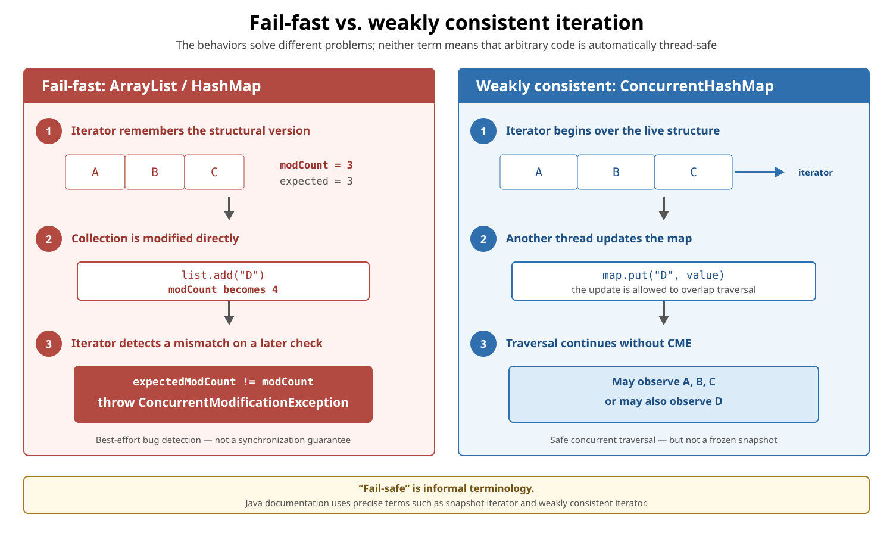
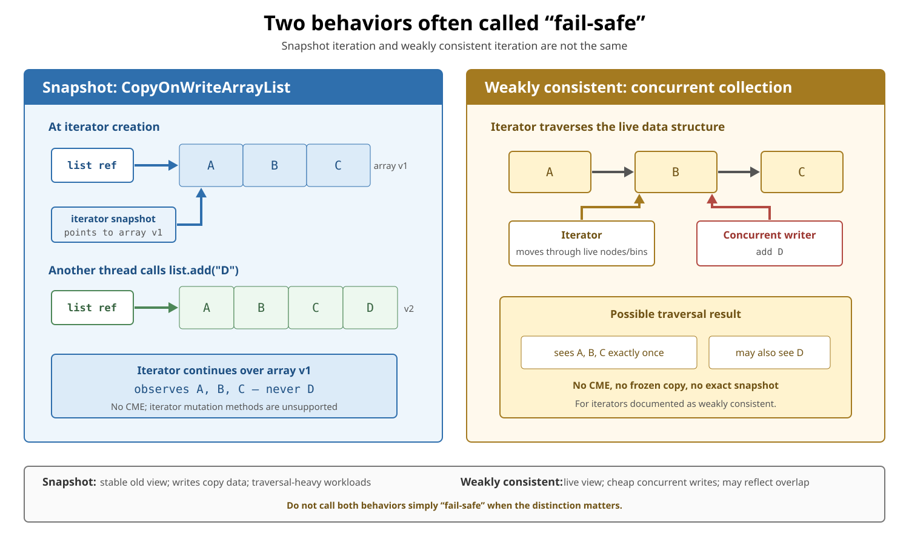

# Collections. Fail-Fast vs. “Fail-Safe” Iteration

## Front

What is the difference between **fail-fast**, **snapshot**, and **weakly consistent** iteration in Java? How can a collection be modified safely during traversal?

## Back

A **fail-fast** iterator reports unexpected structural interference with `ConcurrentModificationException` on a best-effort basis;

A **fail-safe** iterator is informal terminology, so use the documented behavior instead: snapshot or weakly consistent.

This card first compares the three behaviors, then explains safe modification and how to choose a collection.

## The three behaviors

| Behavior | Typical examples | What the iterator observes | Concurrent modification |
|---|---|---|---|
| **Fail-fast** | `ArrayList`, `HashMap`, `HashSet` | The ordinary live collection | Unexpected structural interference is normally detected with `ConcurrentModificationException` (**CME**) |
| **Snapshot** | `CopyOnWriteArrayList` | A fixed array version captured when the iterator was created | Later changes are never visible to that iterator; they do not cause CME |
| **Weakly consistent** | `ConcurrentHashMap`, `ConcurrentLinkedQueue` | A live concurrent structure | Traversal continues without CME and may reflect later changes |

```text
fail-fast          = best-effort interference detection
snapshot           = stable old view
weakly consistent  = changing concurrent view
```

“Fail-safe” hides the important distinction between the last two behaviors and is not a category defined by the Java Collections API.

## Fail-fast: expose incorrect interference



An ordinary collection iterator expects the collection's traversal structure to remain compatible with it. Implementations such as `ArrayList` maintain a structural-modification count, commonly named `modCount`. The iterator remembers the expected value:

```text
iterator created:  expectedModCount = modCount
collection changes directly:        modCount increases
later iterator check: expectedModCount != modCount → CME
```

This is an explanatory implementation model, not a synchronization protocol or a public API that application code should access.

### A controlled fail-fast example

```java
import java.util.ArrayList;
import java.util.ConcurrentModificationException;
import java.util.Iterator;
import java.util.List;

public final class FailFastDemo {
    public static void main(String[] args) {
        List<String> names = new ArrayList<>(
                List.of("Alice", "Bob", "Carol")
        );

        Iterator<String> iterator = names.iterator();
        names.add("Dana"); // structural change outside the iterator

        try {
            iterator.next();
        } catch (ConcurrentModificationException exception) {
            System.out.println("Unexpected interference detected");
        }
    }
}
```

`ArrayList`'s iterator normally detects this misuse on `next()`. The example catches CME only to demonstrate it—production correctness must not depend on the exception.

The bug is entirely possible in **one thread**. The word “concurrent” in the exception name does not prove that several threads were involved.

> Avoid examples that remove an element directly inside an enhanced `for` loop and claim that they must throw. Some iteration positions can let the loop finish before another check occurs, which is exactly why fail-fast behavior is documented as best-effort.

## Modify through the iterator—or outside traversal

When an iterator supports removal, call its own `remove()` after `next()`:

```java
import java.util.ArrayList;
import java.util.Iterator;
import java.util.List;

public final class SafeRemovalDemo {
    public static void main(String[] args) {
        List<String> names = new ArrayList<>(
                List.of("Alice", "Bob", "Carol")
        );

        Iterator<String> iterator = names.iterator();

        while (iterator.hasNext()) {
            String name = iterator.next();
            if (name.startsWith("B")) {
                iterator.remove();
            }
        }

        System.out.println(names); // [Alice, Carol]
    }
}
```

The iterator performs the change and updates its own expected state. `Iterator.remove()` is optional, however; unsupported iterators throw `UnsupportedOperationException`.

For a simple filter on an ordinary list, a collection operation is clearer:

```java
names.removeIf(name -> name.startsWith("B"));
```

Another safe same-thread pattern is to collect the requested changes and apply them after iteration. These patterns do **not** make a non-concurrent collection safe for unsynchronized access by multiple threads.

### What counts as structural?

For `ArrayList`, a structural modification adds or deletes elements, or explicitly resizes the backing array. Replacing an existing element with `set(index, value)` is not structural.

The definition is collection-specific: think about whether the operation changes the collection's size or the structure/order traversed by an iterator, then check that collection's API contract.

## CME is a bug signal, not a safety guarantee

Fail-fast checking cannot be guaranteed under unsynchronized concurrent modification, so it happens on a **best-effort basis**.

```text
CME  = useful evidence of invalid interference
CME ≠ lock, memory-visibility guarantee, or recovery strategy
```

This is incorrect:

```java
try {
    iterate(sharedList);
} catch (ConcurrentModificationException ignored) {
    // Incorrect: absence or presence of CME cannot establish correctness.
}
```

If several threads access a collection and at least one thread modifies it, use the collection's documented synchronization policy, explicit coordination, or an appropriate concurrent collection.

## Snapshot: a stable old version



`CopyOnWriteArrayList` creates a fresh array for every mutation. An iterator retains the array version that existed when it was created:

```java
import java.util.Iterator;
import java.util.List;
import java.util.concurrent.CopyOnWriteArrayList;

public final class SnapshotDemo {
    public static void main(String[] args) {
        CopyOnWriteArrayList<String> names =
                new CopyOnWriteArrayList<>(List.of("A", "B", "C"));

        Iterator<String> snapshot = names.iterator();
        names.add("D");

        snapshot.forEachRemaining(System.out::println); // A, B, C
        System.out.println(names);                       // [A, B, C, D]
    }
}
```

For this iterator:

- later additions, removals, and replacements are never visible;
- later writes do not cause CME;
- iterator mutation methods are unsupported;
- reads are cheap, but every write copies the underlying array.

Choose copy-on-write collections when traversals greatly outnumber mutations and a stable view is useful—not for write-heavy workloads.

## Weakly consistent: safe traversal of live data

Most concurrent collection iterators are documented as **weakly consistent**. Their package-level contract says that they:

- can proceed concurrently with other operations;
- never throw CME because of concurrent modification;
- traverse elements that existed when the iterator was created exactly once;
- may, but need not, reflect modifications made after creation.

```java
import java.util.Iterator;
import java.util.Map;
import java.util.concurrent.ConcurrentHashMap;

public final class WeaklyConsistentDemo {
    public static void main(String[] args) {
        ConcurrentHashMap<String, Integer> scores =
                new ConcurrentHashMap<>(Map.of("Alice", 10, "Bob", 20));

        Iterator<String> iterator = scores.keySet().iterator();
        scores.put("Carol", 30); // legal while traversal is in progress

        iterator.forEachRemaining(System.out::println);
        // Alice and Bob are traversed; Carol may or may not be observed.
    }
}
```

This is **not a frozen snapshot** and does not give one atomic view of several related values. If the application requires an exact cross-entry snapshot or a compound invariant, add explicit coordination or build a snapshot using the collection's documented facilities.

Even when the collection supports concurrent operations, use a particular iterator object from one thread at a time unless its documentation explicitly promises otherwise.

## Snapshot vs. weakly consistent

| Question | Snapshot | Weakly consistent |
|---|---|---|
| Is the iterator's view frozen? | Yes | No |
| Can it observe later writes? | Never | Possibly |
| Does traversal throw CME because of later writes? | No | No |
| Typical write cost | Copies the array | No full-copy requirement |
| Best fit | Many traversals, few writes | Frequent concurrent access and updates |

## Synchronized wrappers require external locking during traversal

`Collections.synchronizedList(...)` serializes individual operations, but its iterator is neither snapshot nor weakly consistent. Synchronize on the returned wrapper for the **entire traversal**:

```java
List<String> names = Collections.synchronizedList(new ArrayList<>());

synchronized (names) {
    for (String name : names) {
        process(name);
    }
}
```

All access to the backing collection must go through the wrapper. For a synchronized map, synchronize on the map wrapper—not one of its collection views—while traversing keys, values, or entries.

## Choosing the right behavior

| Need | Typical choice |
|---|---|
| Detect accidental same-thread interference during ordinary iteration | Fail-fast ordinary collection |
| Remove the current element while iterating | Supported `Iterator.remove()` |
| Filter an ordinary collection | `removeIf(...)` or update after traversal |
| Stable traversal while rare writes continue | `CopyOnWriteArrayList` |
| Frequent concurrent map updates and traversal | `ConcurrentHashMap` |
| Frequent concurrent FIFO updates and traversal | `ConcurrentLinkedQueue` |
| One exact snapshot or compound invariant | Explicit coordination or an application-specific snapshot |

## Common traps

- **“CME means two threads raced.”** No; one thread can cause it.
- **“Fail-fast means thread-safe.”** No; it is best-effort bug detection.
- **“Fail-safe sees all new elements.”** No; snapshot sees none, while weakly consistent iteration may see later changes.
- **“A concurrent collection gives an atomic snapshot.”** Usually no; safe traversal and a frozen view are different guarantees.
- **“`iterator.remove()` always works.”** No; it is an optional operation and snapshot iterators do not support it.

## Summary

Use **fail-fast** to describe best-effort detection by ordinary collection iterators, **snapshot** for a fixed old version, and **weakly consistent** for concurrent traversal of live data. Do not use CME as control flow, and do not use “fail-safe” when the actual visibility guarantee matters.

## Sources

- [Java SE 26 API: `ConcurrentModificationException`](https://docs.oracle.com/en/java/javase/26/docs/api/java.base/java/util/ConcurrentModificationException.html)
- [Java SE 26 API: `ArrayList`](https://docs.oracle.com/en/java/javase/26/docs/api/java.base/java/util/ArrayList.html)
- [Java SE 26 API: `Iterator`](https://docs.oracle.com/en/java/javase/26/docs/api/java.base/java/util/Iterator.html)
- [Java SE 26 API: `CopyOnWriteArrayList`](https://docs.oracle.com/en/java/javase/26/docs/api/java.base/java/util/concurrent/CopyOnWriteArrayList.html)
- [Java SE 26 API: `ConcurrentHashMap`](https://docs.oracle.com/en/java/javase/26/docs/api/java.base/java/util/concurrent/ConcurrentHashMap.html)
- [Java SE 26 API: `java.util.concurrent` package summary](https://docs.oracle.com/en/java/javase/26/docs/api/java.base/java/util/concurrent/package-summary.html)
- [Java SE 26 API: `Collections` synchronized wrappers](https://docs.oracle.com/en/java/javase/26/docs/api/java.base/java/util/Collections.html)
