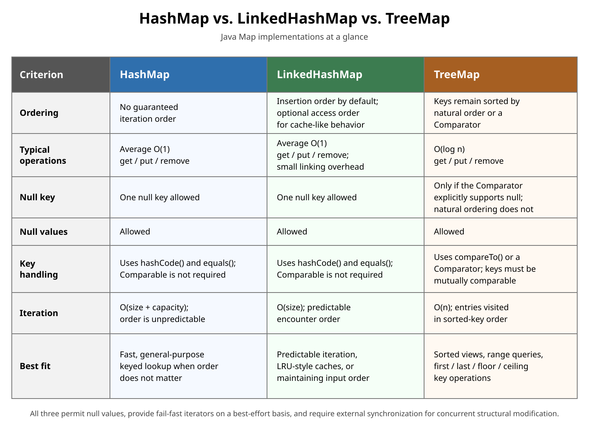

# Collections: HashMap vs. LinkedHashMap vs. TreeMap

<sub>[Back to Java](../Readme.md#content)</sub>

# Front

When should you choose `HashMap`, `LinkedHashMap`, or `TreeMap`?

# Back

**Use `HashMap` when order does not matter, `LinkedHashMap` to preserve insertion order, and `TreeMap` to keep keys sorted.** All three associate each unique key with one value. **Encounter order** means the order in which iteration visits entries.

## The choice and its cost

Read the diagram's ordering row first, then compare operation costs and key rules. Here, `n` and size mean the number of entries; capacity means the number of hash-table buckets, or slots used to group entries by hash.



- **`HashMap`:** hashes keys into buckets and checks `equals()` to find a matching key. `get` and `put` take O(1) on average with well-distributed hashes. Iteration order is unspecified, even if one run looks sorted.
- **`LinkedHashMap`:** adds links between entries to maintain order, while keeping average O(1) lookup and insertion. Ordinary `put` on an existing key changes its value without moving it in insertion order.
- **`TreeMap`:** uses a balanced search tree. `get`, `put`, and `remove` take O(log n); it supports sorted traversal, key ranges, and nearest-key searches. Natural order comes from a key's `compareTo()`; a supplied `Comparator` defines an alternative order.

O(1) means roughly constant work as entry count grows; O(log n) means work grows slowly with that count.

## Same entries, different order

```java
import java.util.LinkedHashMap;
import java.util.TreeMap;

class MapOrder {
    public static void main(String[] args) {
        LinkedHashMap<Integer, String> inserted = new LinkedHashMap<>();
        inserted.put(30, "thirty");
        inserted.put(10, "ten");
        inserted.put(20, "twenty");

        System.out.println(inserted.keySet()); // [30, 10, 20]
        System.out.println(new TreeMap<>(inserted).keySet()); // [10, 20, 30]
    }
}
```

## Two traps

- An access-ordered `LinkedHashMap` can track entries from least to most recently used. This supports an **LRU (least recently used)** cache, but bounded caching still needs an eviction policy.
- `TreeMap` treats two keys as the same key when their comparison returns `0`. Keep that ordering consistent with `equals()` to obey the general `Map` contract.

# Sources

- [Java SE 26 API — HashMap](https://docs.oracle.com/en/java/javase/26/docs/api/java.base/java/util/HashMap.html)
- [Java SE 26 API — LinkedHashMap](https://docs.oracle.com/en/java/javase/26/docs/api/java.base/java/util/LinkedHashMap.html)
- [Java SE 26 API — TreeMap](https://docs.oracle.com/en/java/javase/26/docs/api/java.base/java/util/TreeMap.html)
