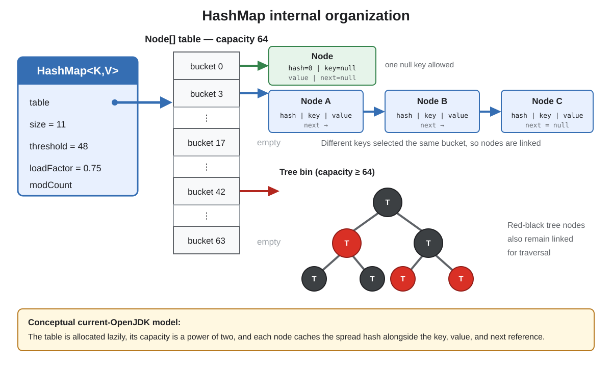
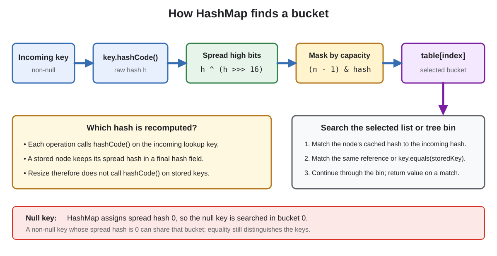
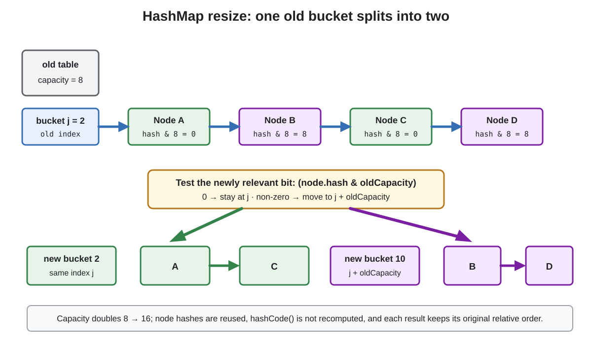

# Collections: `HashMap`

## Front

How does Java's `HashMap` store, find, update, and resize mappings, and which key, complexity, iteration, and concurrency rules matter in practice?

## Back

**`HashMap` was introduced in Java 1.2 as a mutable, unordered, unsynchronized hash-table implementation of `Map`.**

It uses a key's hash to narrow a search to one **bucket**, then uses key equality to find the mapping inside that bucket. This card first establishes the public contract, then explains the current OpenJDK 26u structure, lookup, collisions, and resize algorithm, followed by safe usage rules.

### Public contract at a glance

| Property | `HashMap` behavior |
|---|---|
| Ordering | No guaranteed encounter or iteration order |
| Keys | At most one mapping for each equal key |
| Nulls | One `null` key and any number of `null` values are allowed |
| Thread safety | Not synchronized; no concurrent-use guarantees |
| Basic performance | Expected constant-time `get` and `put` when hashes disperse keys well |
| Iterators | Fail-fast on a best-effort basis |

`put(key, value)` returns the previous value. If an equal key already exists, it replaces that mapping's value without increasing `size`.

```java
import java.util.HashMap;
import java.util.Map;

public final class HashMapBasics {
    record UserId(long value) {}

    public static void main(String[] args) {
        Map<UserId, String> users = new HashMap<>();

        users.put(new UserId(7), "Nikita");
        users.put(new UserId(7), "updated"); // equal key: replace
        users.put(null, "system");
        users.put(new UserId(8), null);

        System.out.println(users.get(new UserId(7))); // updated
        System.out.println(users.size());              // 3
    }
}
```

The exact arrays, hash spreading, power-of-two capacities, tree thresholds, and one-bit resize split below are **OpenJDK 26u implementation details**, not promises made by the `HashMap` API.

### Structure and vocabulary

The image shows the static model: a map object points to an array, and each array position leads to zero or more entry nodes.



- **Mapping:** one key-value association.
- **Size:** number of mappings.
- **Bucket/bin:** one slot in the internal table.
- **Capacity:** number of buckets (`table.length`) after allocation.
- **Collision:** unequal keys select the same bucket.
- **Load factor:** controls the space/time tradeoff and resize threshold.
- **Threshold:** mapping count beyond which an insertion triggers growth.

A normal OpenJDK node stores the spread hash, key reference, value reference, and `next` reference. Collided nodes can therefore form a linked list.

The default constructor reports initial capacity 16 and load factor `0.75`. In current OpenJDK, the table itself is allocated lazily on first insertion and its length is a power of two. With capacity 16, the threshold is 12; inserting a **13th distinct mapping** makes `size > threshold` and triggers resize. Replacing an existing mapping does not.

### From a key to one bucket

Read the lookup diagram from left to right: hash the incoming key, spread its high bits, select one bucket, then search only that bucket.



The current index calculation is conceptually:

```text
rawHash = key == null ? 0 : key.hashCode()
hash    = rawHash ^ (rawHash >>> 16)
index   = (capacity - 1) & hash
```

The mask works because capacity is a power of two. Spreading mixes high bits into low bits, which are the bits used by a small table. It cannot rescue a `hashCode()` that returns the same or poorly distributed values for most keys.

Inside the selected bucket, a node matches only when both conditions hold:

- its cached spread hash equals the incoming spread hash; and
- the keys are the same reference, or the incoming key is equal to the stored key.

If neither matches, lookup continues through the list or tree. Equal hash codes do **not** prove that keys are equal; they only place keys in a possible search area.

The `null` key has spread hash `0`, so current OpenJDK searches for it in bucket `0`. A non-null key with spread hash `0` can share that bucket.

### Key correctness: `equals()` and `hashCode()` work together

The required contract is:

```text
a.equals(b) == true  ⇒  a.hashCode() == b.hashCode()
```

Unequal objects may share a hash code; that is a normal collision. Equal objects returning different hash codes are broken as hash keys because lookup may search a different bucket before equality is ever tested.

Do not mutate state used by `equals()` or `hashCode()` while an object is a key. The `Map` contract calls the behavior unspecified, and current `HashMap` also caches the key's spread hash in its node. Prefer immutable value keys such as records whose components are themselves stable.

Arrays are a common trap: Java arrays inherit identity-based `equals()` and `hashCode()`. Two separate `byte[]` objects with identical bytes are different keys unless wrapped in a stable type that implements content equality.

### Null-value ambiguity

Because null values are legal, `map.get(key) == null` has two meanings:

- no mapping exists; or
- the key exists and maps to `null`.

Use `containsKey(key)` when the distinction matters. `getOrDefault(key, fallback)` returns `null`, not the fallback, when an existing key maps to `null`.

### Collisions and tree bins

Collisions do not overwrite unequal keys. OpenJDK starts a crowded bucket as a linked list. Its current constants include `TREEIFY_THRESHOLD = 8` and `MIN_TREEIFY_CAPACITY = 64`: when a bin becomes sufficiently crowded, a table below capacity 64 is resized instead; at sufficient capacity the bin can become a red-black tree.

Tree bins reduce the harm of severe collisions and may use `Comparable` ordering to break ties. They do not change the public requirement for well-dispersed hashes, and application code must not depend on the exact internal thresholds or tree shape.

### Resizing and the one-bit split

When a new mapping makes `size > threshold`, current OpenJDK normally doubles the table. The diagram follows one list bin from capacity 8 to 16.



After doubling, a node formerly in bucket `j` can only:

- remain at `j` when `(node.hash & oldCapacity) == 0`; or
- move to `j + oldCapacity` otherwise.

Only one newly relevant hash bit is tested. Stored nodes already cache their spread hashes, so resize does not call `hashCode()` again on stored keys. Current OpenJDK preserves the relative order within each resulting low/high list. Tree bins are split by the same old-capacity bit and may become lists again when a side is small.

Resize is an occasional O(size) operation. It is one reason an individual `put` is not guaranteed to be constant time even though basic operations are expected O(1) overall with good hashes.

### Initial sizing

The argument to `new HashMap<>(capacity)` requests an initial **bucket capacity**, not a mapping count. Current OpenJDK rounds it to a power of two; with the default load factor, `new HashMap<>(100)` first allocates 128 buckets and has threshold 96.

Since Java 19, use the intent-revealing factory when the expected number of mappings is known:

```java
// Conceptual fragment: sized for about 100 mappings without an early resize.
HashMap<String, Integer> counts = HashMap.newHashMap(100);
```

Do not grossly oversize. Iteration costs time proportional to **capacity + size**, because it examines the table as well as the mappings.

### Useful compound methods

| Method | Important null behavior |
|---|---|
| `putIfAbsent(k, v)` | Writes when absent or currently mapped to `null` |
| `computeIfAbsent(k, f)` | Runs `f` when absent or mapped to `null`; stores only a non-null result |
| `compute(k, f)` | Runs for present or absent key; a null result removes/leaves absent |
| `merge(k, nonNullV, f)` | Installs the supplied value when absent/null; otherwise combines; null result removes |

Frequency counting is a common `merge` use:

```java
// Conceptual fragment: counts is a Map<String, Integer>.
counts.merge(word, 1, Integer::sum);
```

These methods are convenient on `HashMap`, but they are not made thread-safe or atomic for concurrent callers. A remapping function should also not structurally modify the same map; `HashMap` may detect that and throw `ConcurrentModificationException`.

### Backed views and iteration

`keySet()`, `values()`, and `entrySet()` return **live views**, not snapshots. Removing through a supported view operation removes the mapping; later map changes appear in the view. Copy explicitly when a snapshot is needed.

```java
// Conceptual fragment.
var snapshot = new HashMap<>(map);
```

This copies the mapping structure shallowly; the key and value objects are still shared.

An iterator can safely remove its current element through `iterator.remove()`. Structural modification through the map while iterating can produce `ConcurrentModificationException`, but this detection is best effort. It is a bug detector, not a synchronization mechanism or correctness guarantee.

Iteration order is unspecified and may change after a resize or other updates. Use `LinkedHashMap` for insertion/access order or `TreeMap` for sorted keys.

### Complexity summary

Let `m` be the number of mappings in the selected bucket and `c` the capacity.

| Operation | Expected/current cost | Qualification |
|---|---:|---|
| `get`, `put`, `remove` | Expected O(1) | Requires good hash dispersion; `put` may resize |
| Search a list bin | O(m) | Scans collided nodes |
| `containsValue` | O(c + size) | Searches across the table |
| Iterate views | O(c + size) | Empty buckets are examined |
| Resize | O(size) | Rebuilds bucket placement occasionally |
| `size`, `isEmpty` | O(1) | Reads maintained counters |

User code also matters: expensive `hashCode()`, `equals()`, or remapping functions add their own cost.

### Concurrency

`HashMap` is not thread-safe. Its compound methods, views, and fail-fast iterators do not add a safe concurrency contract. If a shared map is mutated, coordinate access externally or choose a concurrent implementation.

```java
// Conceptual fragment: Map and HashMap are imported.
Map<String, Integer> synchronizedMap =
        java.util.Collections.synchronizedMap(new HashMap<>());
```

Iteration over that wrapper still requires synchronization on the returned map for the entire traversal. For concurrent retrievals and updates, normally use `ConcurrentHashMap`; it is thread-safe and disallows null keys and values.

### Common mistakes

- Assuming the current iteration order is stable.
- Treating `get(key) == null` as proof that the key is absent.
- Changing equality/hash state while a key is stored.
- Believing equal hashes mean equal keys.
- Treating constructor capacity as the number of mappings that fit before resize.
- Assuming fail-fast iterators or `compute*` make `HashMap` thread-safe.
- Relying on OpenJDK's thresholds as API guarantees.

### Interview summary

> `HashMap` hashes the incoming key, spreads the hash, and masks it into one bucket. It then matches cached hashes and key equality inside that bucket. Current OpenJDK stores collisions as lists and may treeify a crowded bin; growth normally doubles the power-of-two table and splits each old bucket using one additional hash bit. Good immutable keys preserve the `equals`/`hashCode` contract. Basic operations are expected O(1), iteration is O(capacity + size), null keys and values are supported, order is unspecified, and the class is not thread-safe.

## Sources

- [Java SE 26 `HashMap` API](https://docs.oracle.com/en/java/javase/26/docs/api/java.base/java/util/HashMap.html)
- [Java SE 26 `Map` API](https://docs.oracle.com/en/java/javase/26/docs/api/java.base/java/util/Map.html)
- [Java SE 26 `Object.equals` and `hashCode` contracts](https://docs.oracle.com/en/java/javase/26/docs/api/java.base/java/lang/Object.html)
- [OpenJDK 26u `HashMap` source](https://github.com/openjdk/jdk26u/blob/master/src/java.base/share/classes/java/util/HashMap.java)
- [Java SE 26 `Collections.synchronizedMap` API](https://docs.oracle.com/en/java/javase/26/docs/api/java.base/java/util/Collections.html#synchronizedMap(java.util.Map))
- [Java SE 26 `ConcurrentHashMap` API](https://docs.oracle.com/en/java/javase/26/docs/api/java.base/java/util/concurrent/ConcurrentHashMap.html)
