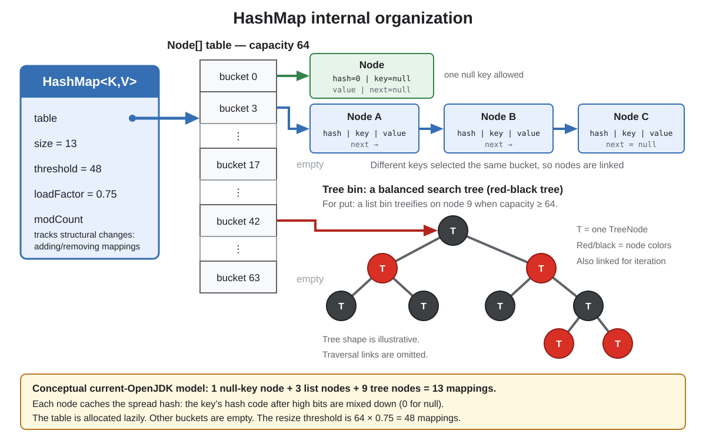
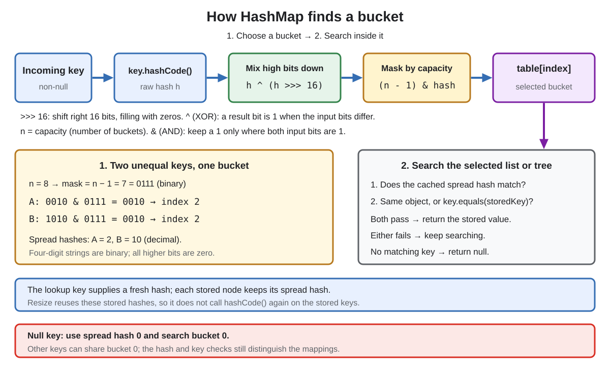
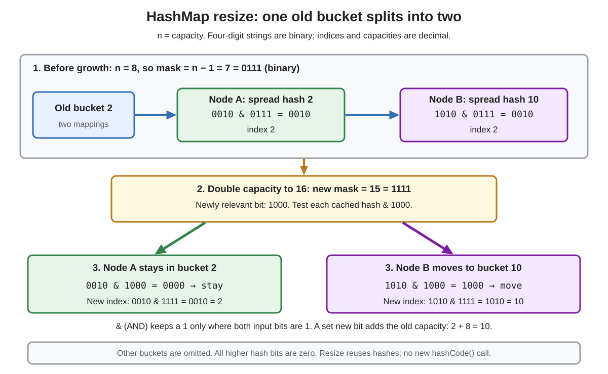

# Collections: `HashMap`

<sub>[Back to Java](../Readme.md#content)</sub>

**`HashMap` was introduced in Java 1.2 as a mutable, unordered, unsynchronized hash-table implementation of `Map`.**

It uses a key's hash to narrow a search to one **bucket**, then uses key equality to find the mapping inside that bucket. This article first establishes the public contract, then explains the current OpenJDK 26u structure, lookup, collisions, and resize algorithm, followed by safe usage rules.

## Public contract at a glance

| Property | `HashMap` behavior |
|---|---|
| Ordering | No guaranteed encounter or iteration order |
| Keys | At most one mapping for each equal key |
| Nulls | One `null` key and any number of `null` values are allowed |
| Thread safety | Not synchronized; no concurrent-use guarantees |
| Basic performance | Expected constant-time `get` and `put` when hashes disperse keys well |
| Iterators | Fail-fast on a best-effort basis |

`put(key, value)` returns the previous value, or `null` if there was no mapping. A previous null value also produces a null return. If an equal key already exists, `put` replaces that mapping's value without increasing `size`.

The example uses a **record**, for which Java generates `equals()` and `hashCode()` from its components. Separate `UserId(7)` objects therefore compare equal and have the same hash code: the second `put` replaces the first value. An ordinary class that inherits `Object.equals()` compares object identity instead; it needs appropriate overrides to act as a value key.

```java
import java.util.HashMap;
import java.util.Map;

public final class HashMapBasics {
    record UserId(long value) {}

    public static void main(String[] args) {
        Map<UserId, String> users = new HashMap<>();

        System.out.println(users.put(new UserId(7), "Nikita"));  // null: no previous mapping
        System.out.println(users.put(new UserId(7), "updated")); // Nikita: previous value
        users.put(null, "system");
        users.put(new UserId(8), null);

        System.out.println(users.get(new UserId(7))); // updated
        System.out.println(users.size());              // 3
    }
}
```

The exact arrays, hash spreading, power-of-two capacities, tree thresholds, and one-bit resize split below are **OpenJDK 26u implementation details**, not promises made by the `HashMap` API.

## Structure and vocabulary

- **Mapping:** one key-value association.
- **Size:** number of mappings.
- **Bucket/bin:** one slot in the internal table.
- **Capacity:** number of buckets (`table.length`) after allocation.
- **Collision:** unequal keys select the same bucket.
- **Spread hash:** the key's hash code after high bits are mixed down into low bits; each node caches this result.
- **Current load:** the ratio `size / capacity` after allocation: the average number of mappings per bucket.
- **Load factor:** the chosen load limit used to calculate the resize threshold; the default is `0.75`.
- **Threshold:** the mapping-count limit used to decide when to grow the table.
- **Structural modification:** adding or removing mappings; replacing an existing key's value is not structural.
- **`modCount`:** OpenJDK's internal modification counter, used by iterators to detect structural changes.

The image shows the static model: a map object points to an array, and each array position leads to zero or more entry nodes. This example uses capacity 64 so it can show a tree bin. Its 13 mappings consist of one null-key node, three list nodes, and nine tree nodes.



A normal OpenJDK node stores the spread hash, key reference, value reference, and `next` reference. Collided nodes can therefore form a linked list.

The default constructor uses initial capacity 16 and load factor `0.75`. In current OpenJDK, the table itself is allocated lazily on first insertion and its length is a power of two.

At capacity 16, the default threshold is `16 × 0.75 = 12`. All mappings count, including those sharing a bucket: this does **not** mean that 75% of buckets must be occupied. Assuming collisions have not already caused growth, adding a **13th distinct mapping with `put`** makes `size > threshold` and triggers resize. A `put` that only replaces an existing value does not.

## From a key to one bucket

A hash code is a 32-bit integer. The calculation below uses three operators on its binary bits:

- `>>> 16` shifts bits right by 16 positions, filling the left side with zeros.
- `^` is bitwise exclusive OR (XOR): a result bit is `1` when the two input bits differ.
- `&` is bitwise AND: a result bit is `1` only when both input bits are `1`. A **mask** uses this to keep selected bit positions.

For the lookup and resize examples, we use capacity 8 to keep the binary arithmetic short. This is a smaller illustrative table, separate from the default capacity 16 and the structure diagram's capacity 64. Read the lookup diagram from left to right: hash the incoming key, spread its high bits, select one bucket, then search only that bucket.



The current index calculation is conceptually:

```text
rawHash = key == null ? 0 : key.hashCode()
hash    = rawHash ^ (rawHash >>> 16)
index   = (capacity - 1) & hash
```

The mask works because capacity is a power of two. Spreading mixes high bits into low bits, which are the bits used by a small table. It cannot rescue a `hashCode()` that returns the same or poorly distributed values for most keys.

For a worked example, suppose unequal keys A and B return hash codes 2 and 10. Their high 16 bits are zero, so spreading leaves these small hashes unchanged. Only four low bits are shown below; all higher bits are zero.

```text
capacity = 8; mask = 8 - 1 = 7 = 0111 in binary

A: hash  2 = 0010; 0010 & 0111 = 0010 -> bucket 2
B: hash 10 = 1010; 1010 & 0111 = 0010 -> bucket 2
```

Both keys select bucket 2 even though their full hashes differ. The mask keeps only the lowest three bits, which are `010` for both keys.

Inside the selected bucket, a node matches only when both conditions hold:

- its cached spread hash equals the incoming spread hash; and
- the keys are the same reference, or the incoming key is equal to the stored key.

If either condition fails, lookup continues through the list or tree. Equal hash codes do **not** prove that keys are equal; they only place keys in a possible search area. If no node matches, `get` returns `null`.

The `null` key has spread hash `0`, so current OpenJDK searches for it in bucket `0`. A non-null key with spread hash `0` can share that bucket.

## Key correctness: `equals()` and `hashCode()` work together

The required contract is:

```text
a.equals(b) == true  ⇒  a.hashCode() == b.hashCode()
```

Unequal objects may share a hash code; that is a normal collision. Equal objects returning different hash codes are broken as hash keys for two reasons: lookup may select a different bucket, and even if it selects the same bucket, the cached spread hash differs. The node fails that first check before key equality can establish a match.

Do not mutate state used by `equals()` or `hashCode()` while an object is a key. If mutation affects key equality, the `Map` contract leaves subsequent behavior unspecified. In current OpenJDK, a changed hash can make `get` return `null` and `containsKey` return `false` while the entry still counts toward `size` and appears during iteration.

This intentionally broken example demonstrates that symptom in OpenJDK. Hashes 1 and 17 both select bucket 1 at capacity 16, so it also shows why finding the right bucket is not enough:

```java
import java.util.HashMap;
import java.util.Map;

public final class MutableKeyExample {
    static final class Key {
        int id;

        Key(int id) { this.id = id; }

        @Override
        public int hashCode() { return id; }

        @Override
        public boolean equals(Object other) {
            return other instanceof Key key && id == key.id;
        }
    }

    public static void main(String[] args) {
        Key key = new Key(1);
        Map<Key, String> map = new HashMap<>(16);
        map.put(key, "stored");

        key.id = 17; // breaks the stored key's hash/equality stability

        System.out.println(map.get(key));         // null
        System.out.println(map.containsKey(key)); // false
        System.out.println(map.size());           // 1
        for (var entry : map.entrySet()) {
            System.out.println(entry.getValue()); // stored: iteration still finds it
        }
    }
}
```

The node still holds cached hash 1, but lookup now computes 17. Even the same key object fails the hash check. Iteration walks stored nodes without looking up their keys, so it still finds the value. Prefer immutable value keys such as records whose components are themselves stable.

Arrays are a common trap: Java arrays inherit identity-based `equals()` and `hashCode()`. Two separate `byte[]` objects with identical bytes are different keys unless wrapped in a stable type that implements content equality.

## Null-value ambiguity

Because null values are legal, `map.get(key) == null` has two meanings:

- no mapping exists; or
- the key exists and maps to `null`.

Use `containsKey(key)` when the distinction matters. `getOrDefault(key, fallback)` returns `null`, not the fallback, when an existing key maps to `null`.

## Collisions and tree bins

Collisions do not overwrite unequal keys. OpenJDK initially stores collided nodes as a linked list. A crowded bin can become a **red-black tree**, a balanced search tree whose height grows logarithmically with its number of nodes.

The current constants include `TREEIFY_THRESHOLD = 8` and `MIN_TREEIFY_CAPACITY = 64`. For the current **`put` insertion path**, a list bin at capacity 64 or above becomes a tree when the **ninth node** is added, not the eighth. Below capacity 64, a conversion attempt grows the table instead. Other insertion methods can check at a different count; the constant alone is not a universal trigger. The structure diagram therefore shows nine tree nodes.

For a bin with `m` mappings, search takes O(log m) when distinct hashes, or usable `Comparable` ordering between equal-hash keys, determine which branch to follow. Here, `Comparable` lets keys supply an order through `compareTo`. For same-class comparable keys, that order must distinguish unequal keys to resolve a hash tie.

Equal-hash keys without usable ordering can force lookup to search both branches, taking O(m) in the worst case even though the tree is balanced. Thus tree bins improve many collision-heavy cases but do not guarantee logarithmic lookup for every key type. Application code must not depend on exact internal thresholds or tree shape.

## Resizing and the one-bit split

When `put` adds a new mapping that makes `size > threshold`, current OpenJDK normally doubles the table. This describes the growth check used by `put`; compound methods such as `computeIfAbsent` check at a different point. The diagram follows keys A and B in one list bin as capacity grows from 8 to 16; other buckets are omitted.



The new mask keeps four low bits instead of three:

```text
capacity = 16; mask = 16 - 1 = 15 = 1111 in binary

A: 0010 & 1111 = 0010 -> bucket 2
B: 1010 & 1111 = 1010 -> bucket 10
```

The extra bit has value 8 (`1000` in binary), exactly the old capacity. A has `0` in that position and stays in bucket 2. B has `1` there and moves to bucket `2 + 8 = 10`.

After doubling, a node formerly in bucket `j` can only:

- remain at `j` when `(node.hash & oldCapacity) == 0`; or
- move to `j + oldCapacity` otherwise.

Only one newly relevant hash bit is tested. Stored nodes already cache their spread hashes, so resize does not call `hashCode()` again on stored keys. Current OpenJDK preserves the relative order within each resulting low/high list. Tree bins are split by the same old-capacity bit and may become lists again when a side is small.

Ordinary list-bin resizing allocates a larger array, scans the old buckets, and redistributes their nodes: O(capacity + size) work. For normal growth at a fixed load factor, capacity is proportional to size, so this simplifies to O(size). Rebuilding tree bins can add work; O(size) is not an unconditional bound for every internal case.

Resize is one reason an individual `put` is not guaranteed to be constant time. With good hashes, `put` has expected **amortized O(1)** cost: occasional growth is spread over the many insertions that fill the table.

## Initial sizing

The argument to `new HashMap<>(capacity)` requests an initial **bucket capacity**, not a mapping count. Current OpenJDK rounds it to a power of two; with the default load factor, `new HashMap<>(100)` first allocates 128 buckets and has threshold 96.

Since Java 19, use the intent-revealing factory when the expected number of mappings is known:

```java
// Conceptual fragment: sized for about 100 mappings without an early resize.
HashMap<String, Integer> counts = HashMap.newHashMap(100);
```

Do not grossly oversize. Iteration costs time proportional to **capacity + size**, because it examines the table as well as the mappings.

## Useful compound methods

| Method | Important null behavior |
|---|---|
| `putIfAbsent(k, v)` | Writes when absent or currently mapped to `null` |
| `computeIfAbsent(k, f)` | Runs `f` when absent or mapped to `null`; stores only a non-null result |
| `compute(k, f)` | Runs for present or absent key; a null result removes/leaves absent |
| `merge(k, nonNullV, f)` | Installs the supplied value when absent/null; otherwise combines; null result removes |

Frequency counting is a common `merge` use:

```java
// Conceptual fragment: counts is a Map<String, Integer>.
counts.merge(word, 1, Integer::sum);
```

These methods are convenient on `HashMap`, but they are not made thread-safe or atomic for concurrent callers. A mapping or remapping function should not modify the same map during its computation, including replacing an existing value. Return the desired value and let the method update the mapping. `HashMap` detects some violations and may throw `ConcurrentModificationException`; the absence of that exception does not make a modification valid.

## Backed views and iteration

`keySet()`, `values()`, and `entrySet()` return **live views**, not snapshots. Removing through a supported view operation removes the mapping; later map changes appear in the view. Copy explicitly when a snapshot is needed.

```java
// Conceptual fragment.
var snapshot = new HashMap<>(map);
```

This copies the mapping structure shallowly; the key and value objects are still shared.

A **structural modification** adds or removes mappings. A `put` that replaces an existing key's value is not structural; removing one key and adding another is structural even if the final `size` is unchanged. OpenJDK tracks structural changes with the diagram's `modCount`; an iterator remembers the counter and checks for unexpected changes.

An iterator can safely remove its current element through `iterator.remove()`. Structural modification through the map while iterating can produce `ConcurrentModificationException`, but this detection is best effort. It is a bug detector, not a synchronization mechanism or correctness guarantee.

Iteration order is unspecified and may change after a resize or other updates. Use `LinkedHashMap` for insertion/access order or `TreeMap` for sorted keys.

## Complexity summary

Let `m` be the number of mappings in the selected bucket and `c` the capacity.

| Operation | Expected/current cost | Qualification |
|---|---:|---|
| `get`, `put`, `remove` | Expected O(1) | Requires good hash dispersion; for `put`, this is amortized across insertions |
| Search a list bin | O(m) | Scans collided nodes |
| Search a tree bin with usable ordering | O(log m) | Hashes or comparison ordering select a single branch |
| Search a tree bin without usable ordering | O(m) worst case | Equal-hash ties can require searching both branches |
| `containsValue` | O(c + size) | Searches across the table |
| Iterate views | O(c + size) | Empty buckets are examined |
| Resize with list bins | O(c + size) | O(size) for normal growth at a fixed load factor; tree-bin rebuilding can add work |
| `size`, `isEmpty` | O(1) | Reads maintained counters |

**Worst-case `get` is O(size)** in current OpenJDK: all mappings can occupy one bin whose equal-hash keys lack usable ordering. The tree's balanced shape alone does not prevent a linear search. These bounds assume constant-cost key methods; expensive `hashCode()`, `equals()`, `compareTo()`, or remapping functions add their own cost.

## Concurrency

`HashMap` is not thread-safe. Its compound methods, views, and fail-fast iterators do not add a safe concurrency contract. If a shared map is mutated, coordinate access externally or choose a concurrent implementation.

```java
// Conceptual fragment: Map and HashMap are imported.
Map<String, Integer> synchronizedMap =
        java.util.Collections.synchronizedMap(new HashMap<>());
```

Iteration over that wrapper still requires synchronization on the returned map for the entire traversal. For concurrent retrievals and updates, normally use `ConcurrentHashMap`; it is thread-safe and disallows null keys and values.

## Common mistakes

- Assuming the current iteration order is stable.
- Treating `get(key) == null` as proof that the key is absent.
- Changing equality/hash state while a key is stored.
- Believing equal hashes mean equal keys.
- Treating constructor capacity as the number of mappings that fit before resize.
- Assuming fail-fast iterators or `compute*` make `HashMap` thread-safe.
- Relying on OpenJDK's thresholds as API guarantees.

## Interview summary

> `HashMap` hashes the incoming key, spreads the hash, and masks it into one bucket. It then matches cached hashes and key equality inside that bucket. Current OpenJDK stores collisions as lists and may treeify a crowded bin; growth normally doubles the power-of-two table and splits each old bucket using one additional hash bit. Good immutable keys preserve the `equals`/`hashCode` contract. Basic operations are expected O(1), with amortization for `put`; tree-bin search is logarithmic with usable ordering, but worst-case `get` remains linear. Iteration is O(capacity + size), null keys and values are supported, order is unspecified, and the class is not thread-safe.

# Sources

- [Java SE 26 `HashMap` API](https://docs.oracle.com/en/java/javase/26/docs/api/java.base/java/util/HashMap.html)
- [Java SE 26 `Map` API](https://docs.oracle.com/en/java/javase/26/docs/api/java.base/java/util/Map.html)
- [Java SE 26 `Object.equals` and `hashCode` contracts](https://docs.oracle.com/en/java/javase/26/docs/api/java.base/java/lang/Object.html)
- [Java SE 26 record equality and hashing](https://docs.oracle.com/en/java/javase/26/docs/api/java.base/java/lang/Record.html)
- [Java SE 26 `Comparable` and `compareTo` ordering](https://docs.oracle.com/en/java/javase/26/docs/api/java.base/java/lang/Comparable.html)
- [Java Language Specification 26: shift operators](https://docs.oracle.com/javase/specs/jls/se26/html/jls-15.html#jls-15.19)
- [Java Language Specification 26: integer bitwise operators](https://docs.oracle.com/javase/specs/jls/se26/html/jls-15.html#jls-15.22.1)
- [OpenJDK 26u `HashMap` source](https://github.com/openjdk/jdk26u/blob/master/src/java.base/share/classes/java/util/HashMap.java)
- [Java SE 26 `Collections.synchronizedMap` API](https://docs.oracle.com/en/java/javase/26/docs/api/java.base/java/util/Collections.html#synchronizedMap(java.util.Map))
- [Java SE 26 `ConcurrentHashMap` API](https://docs.oracle.com/en/java/javase/26/docs/api/java.base/java/util/concurrent/ConcurrentHashMap.html)
