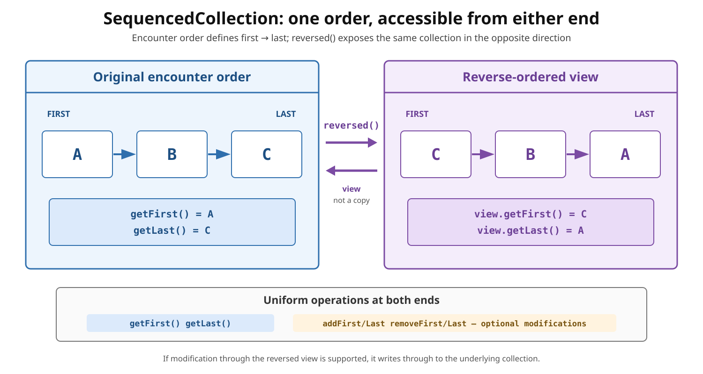

# Collections: `SequencedCollection`

## Front

What does `SequencedCollection` add to Java collections, and what does `reversed()` return?

## Back

**Sequenced Collections** were introduced in **JDK 21** by JEP 431;

`SequencedCollection<E>` represents a collection with a defined first-to-last encounter order and uniform operations at both ends.

**Encounter order** is the order used by iteration and other order-sensitive operations. It may be index order (`ArrayList`), insertion order (`LinkedHashSet`), or sorted order (`TreeSet`); it is not always insertion order.

The diagram shows how the same elements are seen from the original and reversed directions.



### Core operations

- Read: `getFirst()`, `getLast()`
- Add: `addFirst(e)`, `addLast(e)`
- Remove: `removeFirst()`, `removeLast()`
- Reverse encounter order: `reversed()`

End modifications are **optional**: an implementation may throw `UnsupportedOperationException`. Reading or removing an end from an empty collection throws `NoSuchElementException`.

### `reversed()` is a view

It does not copy or sort the elements. It inverts first/last and successor/predecessor for order-sensitive operations. If modification through the view is supported, it writes through to the underlying collection.

```java
import java.util.ArrayList;
import java.util.List;
import java.util.SequencedCollection;

public final class SequencedCollectionDemo {
    public static void main(String[] args) {
        SequencedCollection<String> tasks =
                new ArrayList<>(List.of("clean", "compile", "test"));

        SequencedCollection<String> reverse = tasks.reversed();

        System.out.println(tasks.getFirst());   // clean
        System.out.println(reverse.getFirst()); // test

        reverse.removeFirst();
        System.out.println(tasks); // [clean, compile]
    }
}
```

`List`, `Deque`, and `SequencedSet` are subinterfaces. An unordered type such as `HashSet` is not a `SequencedCollection`.

## Sources

- [JEP 431 — Sequenced Collections](https://openjdk.org/jeps/431)
- [Java SE 26 `SequencedCollection` API](https://docs.oracle.com/en/java/javase/26/docs/api/java.base/java/util/SequencedCollection.html)
- [Oracle guide — Creating Sequenced Collections, Sets, and Maps](https://docs.oracle.com/en/java/javase/21/core/creating-sequenced-collections-sets-and-maps.html)
