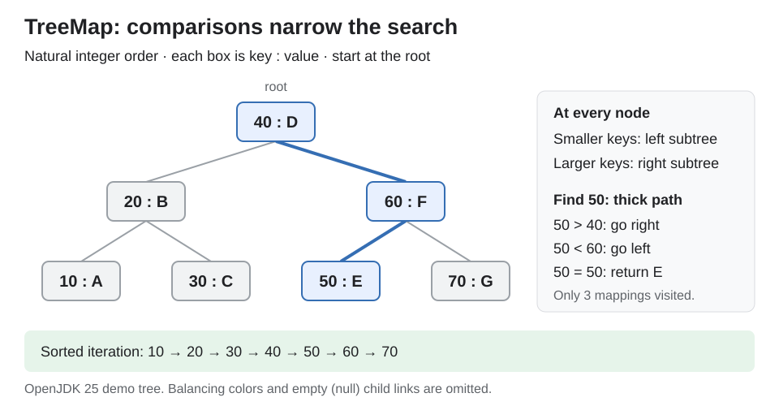
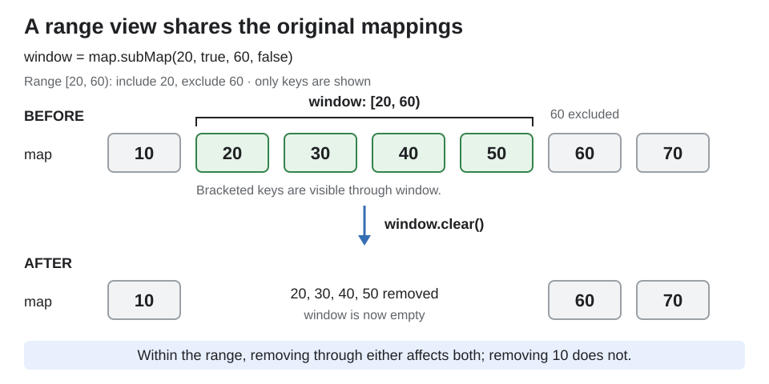

# Collections. TreeMap

<sub>[Back to Java](../Readme.md#content)</sub>

**`TreeMap` was introduced in Java 1.2 as a map that keeps its keys sorted.**

Use `TreeMap<K, V>` for ordered iteration, nearest-key queries, and key ranges. This JDK 25 article covers its tree, comparison methods, navigation/views, nulls, iteration, concurrency, and map selection.

## What it provides

A **mapping** pairs a key (`K`) with a value (`V`). Keys are unique under comparison; values may repeat. Order depends only on keys.

TreeMap implements `NavigableMap`: a `SortedMap` with neighbor queries.

## How the tree works

A **node** holds one mapping, with smaller keys in its left subtree and larger keys in its right.

**Height** counts links on the longest root-to-leaf path. TreeMap's **red-black tree** keeps height logarithmic in node count: this makes it balanced. Node colors (red or black) and link rearrangements (**rotations**) maintain the bound. See [HashMap tree bins](../Collections.%20HashMap/Readme.md#collisions-and-tree-bins).

Compare the requested key with the current node's key: negative goes left, positive goes right, zero matches. Start at the root and repeat until a match or an empty child link.

Each box shows `key : value`. The thick path finds `50` via `40` and `60`, as the panel explains. Visiting the left subtree, then the node, then the right subtree produces the sorted iteration strip.



The range example below builds this OpenJDK 25 tree without rotations. Shape is an implementation detail.

Inserting `n` distinct sorted keys without rebalancing builds a chain: worst-case lookup is **O(n)**.

TreeMap's bounded height supports guaranteed **O(log n)** `get`, `containsKey`, `put`, and `remove`, assuming constant-time comparisons.

Storage is **O(n)**: OpenJDK 25 nodes hold key/value references, parent/child links, and color. Traversal and `containsValue` take **O(n)** worst-case time.

### Which methods TreeMap calls on keys

For `get`, `containsKey`, `put`, and `remove`, TreeMap calls the ordering method:

- **Comparator supplied to the constructor:** `comparator.compare(key, storedKey)`.
- **Otherwise:** `key.compareTo(storedKey)`; keys must implement `Comparable` for natural order.

The supplied comparator replaces TreeMap's direct `compareTo` calls. TreeMap itself does not call `hashCode` or `equals` to find a key.

With natural ordering, a non-`Comparable` key throws `ClassCastException` even on the first `put`: OpenJDK 25 compares the key with itself before inserting it.

### Comparison determines key identity

**Zero comparison means the same key to this map**, even when `equals()` is `false`. A second `put` replaces the value; OpenJDK 25 retains the original key object.

All Java snippets are method bodies; import `java.util.Comparator`, `java.util.NavigableMap`, and `java.util.TreeMap`.

```java
var byLength = new TreeMap<String, Integer>(
        Comparator.comparingInt(String::length));
byLength.put("cat", 1);
byLength.put("dog", 2); // Same length: retain "cat", replace its value.
System.out.println(byLength.get("cat")); // 2
System.out.println(byLength.containsKey("dog")); // true
System.out.println(byLength.keySet()); // [cat]
```

This runs normally: `"dog"` matches `"cat"` by comparison. To obey the `Map` contract, ordering must be **consistent with `equals`**: zero exactly when keys are equal. Otherwise behavior is defined but violates that contract.

Natural ordering can differ from `equals`, too: `new BigDecimal("4.0")` and `new BigDecimal("4.00")` compare as zero but are not equal, so a natural-order TreeMap treats them as one key.

For the string example, append `.thenComparing(Comparator.naturalOrder())` to retain both strings. It compares lengths first, then text only when the lengths compare as zero.

Changing a key's comparison fields can invalidate its position and lookup. Remove it before mutation, then reinsert it. Prefer immutable keys and stable comparators.

## Find neighboring keys

For keys `10, 20, 30, 40, 50, 60, 70`, with natural ordering:

| Call | Meaning | Result |
| --- | --- | --- |
| `lowerKey(40)` | Greatest key strictly below 40 | `30` |
| `floorKey(40)` | Greatest key at or below 40 | `40` |
| `ceilingKey(40)` | Smallest key at or above 40 | `40` |
| `higherKey(40)` | Smallest key strictly above 40 | `50` |

For a missing `45`, `floorKey(45)` is `40` and `ceilingKey(45)` is `50`. No qualifying key means `null`.

The four table methods have `...Entry` counterparts returning key and value.

- `firstEntry()`/`lastEntry()` return endpoint entries; `pollFirstEntry()`/`pollLastEntry()` also remove them. All four return `null` on an empty map.
- `firstKey()`/`lastKey()` return endpoint keys; on an empty map they throw `NoSuchElementException`.

Since Java 21, `SortedMap` extends `SequencedMap`. TreeMap's `putFirst`/`putLast` throw `UnsupportedOperationException`: comparison fixes position. See [SequencedCollection](../Collections.%20SequencedCollection/Readme.md) for optional end operations.

Every entry returned by the `...Entry` neighbor and endpoint methods is a snapshot. Its `setValue` throws `UnsupportedOperationException`; update via `put`. Mutable keys/values are not deep-copied.

These searches and endpoint removals take **O(log n)** worst-case time for `n` mappings in OpenJDK 25, assuming constant-time comparisons; polling may also rebalance.

“Lower” and “first” follow the map's ordering, natural or comparator-defined. With natural ordering, `comparator()` returns `null`.

## Range views share the original map

- `subMap(20, true, 60, false)` selects **[20, 60)**: include `20`, exclude `60`. The short form `subMap(from, to)` means `subMap(from, true, to, false)`.
- `headMap(bound, inclusive)` selects the lower side. `headMap(to)` means `headMap(to, false)`.
- `tailMap(bound, inclusive)` selects the upper side. `tailMap(from)` means `tailMap(from, true)`.

Forms with boolean flags return `NavigableMap`; the short forms return `SortedMap`, which cannot be assigned directly to `NavigableMap`.

A **backed (live) view** shares mappings within its range. Clearing this view removes four original mappings; removing `10` from the map leaves the view unchanged.



This example reproduces the diagram's `subMap`/`clear()` sequence and copies the mappings:

```java
NavigableMap<Integer, String> map = new TreeMap<>();
map.put(40, "D");
map.put(20, "B");
map.put(60, "F");
map.put(10, "A");
map.put(30, "C");
map.put(50, "E");
map.put(70, "G");

NavigableMap<Integer, String> window = map.subMap(20, true, 60, false);
var copy = new TreeMap<>(window);
System.out.println(window.keySet()); // [20, 30, 40, 50]
window.clear();
System.out.println(map.keySet()); // [10, 60, 70]
System.out.println(copy.keySet()); // [20, 30, 40, 50]
```

Inserting an out-of-range key through `window` throws `IllegalArgumentException`; inserting an in-range key into `map` makes it visible through `window`.

`new TreeMap<>(window)` uses the `SortedMap` constructor, preserving ordering. Key/value objects remain shared: a **shallow copy**.

`descendingMap()` gives a backed view in reverse order. TreeMap inherits `NavigableMap.reversed()`, which calls `descendingMap()` by default.

**Cost in OpenJDK 25:** creating a range view, `descendingMap()`, or `reversed()` copies nothing: **O(1)**. With `n` mappings in the backing map and `k` in the range, lookups and single-key updates cost **O(log n)**; iterating or copying the range costs **O(log n + k)**, assuming constant-time comparisons.

The range's `clear()` deletes entries one by one, and its `size()` counts the range, recounting after any key is added to or removed from the backing map.

## Nulls, iteration, and concurrency

- **Null values are allowed.** `get(key) == null` means absence or a stored null; `containsKey` distinguishes them.
- **Natural ordering rejects null keys.** Both `put(null, value)` and `get(null)` throw `NullPointerException`. A comparator can permit null keys.

With null keys allowed, `floorKey` returns `null` for both no match and a matching null key; `floorEntry` distinguishes them:

```java
var nullable = new TreeMap<Integer, String>(
        Comparator.nullsFirst(Comparator.naturalOrder()));
nullable.put(null, "n");
nullable.put(5, "five");
System.out.println(nullable.floorKey(3));   // null: ambiguous
System.out.println(nullable.floorEntry(3)); // null=n: an entry exists
```

- **TreeMap is unsynchronized.** Use locking or `Collections.synchronizedNavigableMap` for shared mutable access. Use only the wrapper; lock it during iteration, including over its views.
- **Iterators are fail-fast, best-effort.** Adding/removing mappings during iteration can throw `ConcurrentModificationException`, even in one thread. Remove via the iterator's `remove`.

Replacing a value is not structural, but still needs coordination across threads.

Concurrent sorted access: [ConcurrentSkipListMap](../Concurrency.%20ConcurrentSkipListMap/Readme.md).

## When to use TreeMap

1. **Sorted keys:** keep keys sorted without extra sorting code.
2. **Ranges:** select an ID interval with `subMap`.
3. **Neighbors:** use `floorEntry` to find the entry with the greatest timestamp at or before the query.

See [HashMap vs LinkedHashMap vs TreeMap](../Collections.%20HashMap%20vs%20LinkedHashMap%20vs%20TreeMap/Readme.md) for map selection.

# Sources

- [TreeMap — JDK 25 API](https://docs.oracle.com/en/java/javase/25/docs/api/java.base/java/util/TreeMap.html)
- [Map — mutable-key warning](https://docs.oracle.com/en/java/javase/25/docs/api/java.base/java/util/Map.html)
- [NavigableMap](https://docs.oracle.com/en/java/javase/25/docs/api/java.base/java/util/NavigableMap.html)
- [SequencedMap](https://docs.oracle.com/en/java/javase/25/docs/api/java.base/java/util/SequencedMap.html)
- [Java 21 hierarchy](https://docs.oracle.com/en/java/javase/21/core/creating-sequenced-collections-sets-and-maps.html)
- [Comparator](https://docs.oracle.com/en/java/javase/25/docs/api/java.base/java/util/Comparator.html)
- [BigDecimal comparison and equality](https://docs.oracle.com/en/java/javase/25/docs/api/java.base/java/math/BigDecimal.html)
- [Synchronized maps](https://docs.oracle.com/en/java/javase/25/docs/api/java.base/java/util/Collections.html#synchronizedNavigableMap(java.util.NavigableMap))
- [OpenJDK 25 TreeMap source](https://github.com/openjdk/jdk/blob/jdk-25%2B36/src/java.base/share/classes/java/util/TreeMap.java)
- [Inherited map clearing](https://docs.oracle.com/en/java/javase/25/docs/api/java.base/java/util/AbstractMap.html#clear()) and [iterator-based clearing](https://docs.oracle.com/en/java/javase/25/docs/api/java.base/java/util/AbstractCollection.html#clear())
- [Search trees](https://algs4.cs.princeton.edu/32bst/) and [balancing](https://algs4.cs.princeton.edu/33balanced/)
