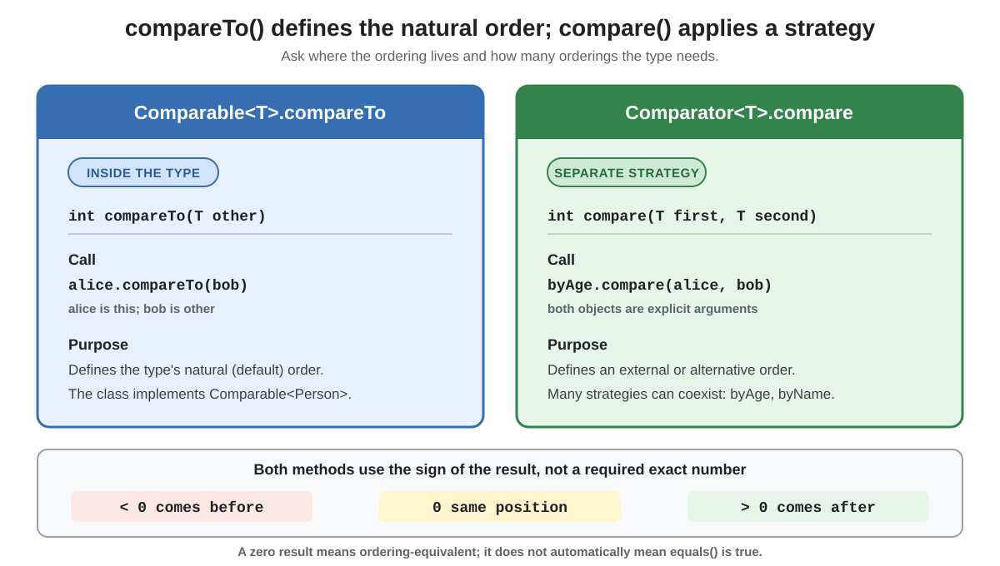

# `compare` vs. `compareTo`

## Front

What is the difference between `Comparator.compare` and `Comparable.compareTo`, and when should each be used?

## Back

**`compareTo` defines a type's natural ordering; `compare` applies a separate ordering strategy.**



| Method | Owner and call | Use |
|---|---|---|
| `int compareTo(T other)` | The compared class implements `Comparable<T>`; call `a.compareTo(b)`. | One natural/default order, such as people by name. |
| `int compare(T a, T b)` | A separate `Comparator<T>` object receives both values; call `byAge.compare(a, b)`. | Alternative orders or a type you cannot modify. Many comparators can coexist. |

### Java example

```java
import java.util.Comparator;

record Person(String name, int age)
        implements Comparable<Person> {

    @Override
    public int compareTo(Person other) {
        return name.compareTo(other.name);
    }

    static final Comparator<Person> BY_AGE =
            Comparator.comparingInt(Person::age);
}
```

- `alice.compareTo(bob)` uses `Person`'s natural order: **name**.
- `Person.BY_AGE.compare(alice, bob)` uses an external order: **age**.
- Sorting APIs use the natural order when no comparator is supplied; supplying a comparator selects that strategy.

### Return contract

Both methods return:

- a **negative** integer when the first value comes before the second;
- **zero** when they occupy the same ordering position;
- a **positive** integer when the first value comes after the second.

Only the sign matters—do not assume the result is exactly `-1`, `0`, or `1`. Also, a zero comparison does not automatically mean `equals` is `true`; consistency with `equals` is recommended because sorted sets and maps use comparison equality to identify equivalent positions.

> **Memory aid:** the object uses `compareTo`; a comparator uses `compare`.

## Sources

- [Java SE 25 API: `Comparable`](https://docs.oracle.com/en/java/javase/25/docs/api/java.base/java/lang/Comparable.html)
- [Java SE 25 API: `Comparator`](https://docs.oracle.com/en/java/javase/25/docs/api/java.base/java/util/Comparator.html)
