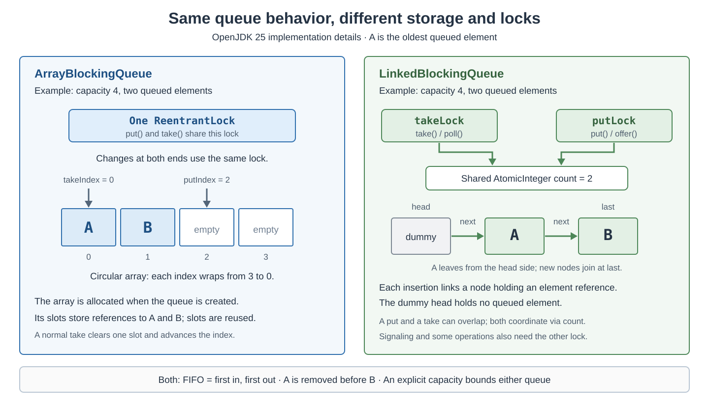
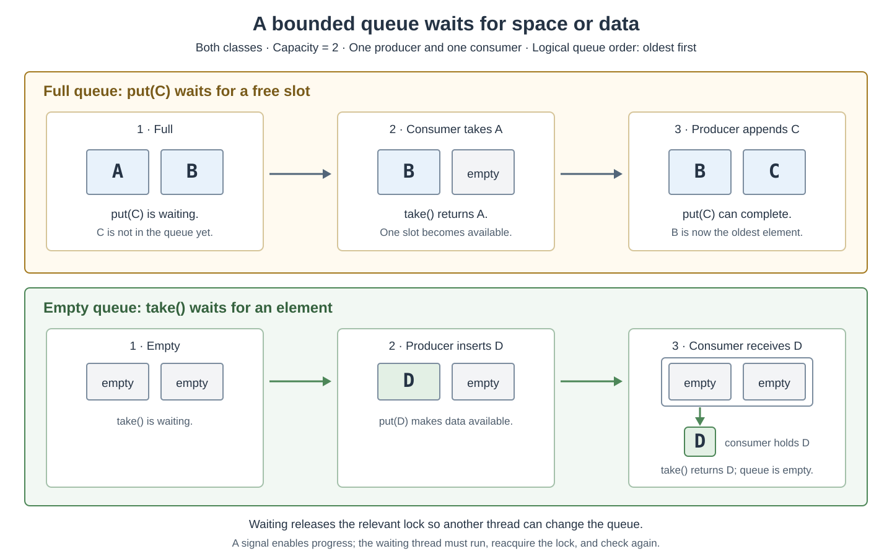

# Concurrency. ArrayBlockingQueue vs LinkedBlockingQueue

<sub>[Back to Java](../Readme.md#content)</sub>

**Both are first-in, first-out (FIFO) blocking queues from Java 5; in OpenJDK 25, `ArrayBlockingQueue` reuses a fixed array behind one lock, while `LinkedBlockingQueue` allocates a node per element and locks its two ends separately.**

Both are thread-safe and let producers wait for space and consumers wait for work.

The practical choice balances capacity, allocation, and contention. This article explains their shared behavior, shows their internal organization, and runs the same examples with both. API guarantees below use Java SE 25; internal fields and algorithms refer specifically to OpenJDK 25.

## The shared mental model

A **producer** creates work and inserts it into a queue. A **consumer** removes that work and processes it. The queue is a buffer between them: producing and processing do not have to happen at the same speed at every instant.

Both classes implement `BlockingQueue<E>`, where `E` is the element type. Both use **first-in, first-out (FIFO)** order: insert at the tail and retrieve from the head. If `A` is inserted before `B`, head removals retrieve `A` first. Concurrent insertions are ordered by the queue; which method call started first does not alone establish that order.

Neither accepts `null`. Both support multiple producers and consumers without an external lock around individual queue operations.

| Question | `ArrayBlockingQueue` | `LinkedBlockingQueue` |
| --- | --- | --- |
| Storage | Fixed array of element references | Linked nodes containing element references |
| Must you specify capacity? | Yes | No; the default is `Integer.MAX_VALUE` |
| Can an instance change its capacity? | No | No |
| Can `put()` wait when full? | Yes | Yes, including with an explicit small bound |
| Can `take()` wait when empty? | Yes | Yes |
| Optional fair access for waiting threads? | Yes, through a constructor flag | No public fairness option |

## Choose the operation's waiting policy

“Blocking queue” describes available operations. It does not mean every call waits until it succeeds.

| Policy | Insert at tail | Remove head |
| --- | --- | --- |
| Throw when full or empty | `add(e)` → `IllegalStateException` | `remove()` → `NoSuchElementException` |
| Return a failure value | `offer(e)` → `false` when full | `poll()` → `null` when empty |
| Wait until possible | `put(e)` | `take()` |
| Wait with a timeout | `offer(e, time, unit)` → `false` on timeout | `poll(time, unit)` → `null` on timeout |
| Remove an available batch | — | `drainTo(batch, maxElements)` → transfers up to the limit; returns the number transferred |

`peek()` reads the head without removing it and returns `null` when empty. `remove()` in this table takes no argument; `remove(value)` instead searches for a matching element.

`drainTo()` does not wait for more elements to arrive. Use a consumer-owned destination collection, then process the batch after the call returns.

`put()`, `take()`, and the timed variants are interruptible and declare `InterruptedException`. Untimed `offer()` and `poll()` avoid waiting for space or data, but can still wait for an internal lock. **Neither implementation is lock-free.** A timed operation is also not a hard deadline for the entire method call: lock acquisition and thread scheduling can add delay.

## Storage and locks explain the tradeoff

A **reference** points to an object; the queue does not copy the object's contents. A **lock** allows one thread at a time into the code region it protects. **Contention** occurs when threads compete for that lock. Read the diagram as two implementations of the same logical FIFO buffer.



### `ArrayBlockingQueue`: reuse array slots

OpenJDK 25 allocates an `Object[]` with the chosen capacity. `putIndex` identifies the next insertion slot, `takeIndex` identifies the next removal slot, and `count` records occupancy.

The indices wrap around at the array's end, forming a **circular buffer**. Normal head removal clears one slot and advances an index; it does not shift every remaining element. Logical FIFO order can therefore cross the array boundary.

One `ReentrantLock` protects these updates. A producer and consumer cannot simultaneously execute their protected queue updates. After `take()` returns, however, the consumer processes the item outside the queue's lock; it does not lock out producers for the duration of that processing.

Reusing slots avoids allocating a queue node per insertion. This does not mean the application allocates nothing: payload objects and other runtime machinery still consume memory.

### `LinkedBlockingQueue`: coordinate two ends

OpenJDK 25 uses a singly linked chain. Each node holds an item reference and a reference to its successor. A dummy head precedes the first queued item; its empty item field is internal bookkeeping, not a user-supplied `null` element.

`putLock` protects insertion at the tail; `takeLock` protects removal at the head. A shared `AtomicInteger count`, a counter with indivisible updates, coordinates occupancy and visibility across the two sides. Producer and consumer updates can overlap, although producers still contend with producers, and consumers with consumers.

These locks do not make every operation independent. Signalling the opposite side can acquire its lock, and operations such as `remove(value)` and `clear()` acquire both locks.

Node allocation adds work. In this version, `put()` can even allocate its node before waiting for capacity. The capacity constrains queued elements, not every allocation retained by waiting producers.

**Throughput** means completed queue operations per unit of time; **latency** means how long an individual operation takes.

The `LinkedBlockingQueue` API describes linked queues as typically having higher throughput than array-based queues, but less predictable performance in most concurrent applications. Overlapping producer and consumer updates helps explain that tendency; node allocation adds work and can contribute to variability. This is a typical tradeoff, not a guarantee for every workload.

## What happens when the queue is full or empty?

**Backpressure** means making the producer respond when consumers cannot keep up. A bounded queue combined with `put()` supplies it by making the producer wait. The following capacity-two example shows one possible execution with one producer and one consumer; a signal makes progress possible, but does not promise immediate scheduling.



Both implementations use two **conditions**, which are waiting mechanisms associated with locks:

- `notFull`: producers wait here when no slot is available.
- `notEmpty`: consumers wait here when no item is available.

Waiting on a condition releases its associated lock. This matters: a producer waiting on a full array queue does not retain the lock that a consumer needs to remove an item. Before proceeding, the waiting thread reacquires the lock and checks the condition again.

A signal is a reason to recheck, not a reservation. Another thread may consume the opportunity first, and a thread may also wake without a signal, called a **spurious wakeup**. The implementation handles these cases with condition-checking loops; application code can call `put()` and `take()` directly.

## Capacity is an application decision

These constructor fragments both create a queue that holds at most 100 elements:

```java
// Constructor examples; requires java.util.concurrent imports.
BlockingQueue<String> arrayQueue = new ArrayBlockingQueue<>(100);
BlockingQueue<String> linkedQueue = new LinkedBlockingQueue<>(100);
```

The array reserves its reference slots immediately. The linked queue grows its node chain with occupancy, up to the fixed bound. The latter is sometimes useful for a large permitted backlog that is usually sparse; it also pays node overhead as the queue fills. Neither constructor creates 100 payload objects.

Omitting the linked queue's bound gives a capacity of `Integer.MAX_VALUE`, or 2,147,483,647 elements. It is often called **effectively unbounded**. It neither preallocates that many nodes nor guarantees memory for them.

As a concrete workload model, suppose producers submit 120 jobs per second and consumers complete 100. Ignoring variation, backlog grows by 20 jobs per second; an initially empty capacity-100 queue fills in about five seconds. A larger queue delays saturation and can absorb a temporary burst. It cannot repair a sustained processing deficit.

Choose a bound using acceptable backlog, payload size, and waiting time. Then choose what saturation means: wait with `put()`, wait briefly with timed `offer()`, or handle a failed `offer()`. **A capacity bound alone does not slow producers unless the calling code responds to it.** It also excludes jobs already being processed and objects held outside the queue.

## Run the same operations with both queues

Save this complete Java 8+ example as `QueueMethodsDemo.java`. It deliberately uses one thread so every output is predictable.

```java
import java.util.concurrent.ArrayBlockingQueue;
import java.util.concurrent.BlockingQueue;
import java.util.concurrent.LinkedBlockingQueue;
import java.util.concurrent.TimeUnit;

public final class QueueMethodsDemo {
    public static void main(String[] args) throws InterruptedException {
        demonstrate(new ArrayBlockingQueue<>(2));
        demonstrate(new LinkedBlockingQueue<>(2));
    }

    private static void demonstrate(BlockingQueue<String> queue)
            throws InterruptedException {
        System.out.println(queue.getClass().getSimpleName());
        queue.put("A");
        queue.put("B");

        System.out.println(queue.offer("C")); // false: full
        System.out.println(queue.offer("C", 20, TimeUnit.MILLISECONDS));
        // false: no consumer can free a slot during this wait

        System.out.println(queue.take());    // A: frees a slot
        System.out.println(queue.offer("C")); // true: now fits
        System.out.println(queue.peek());    // B: stays queued
        System.out.println(queue.take());    // B
        System.out.println(queue.take());    // C
        System.out.println(queue.poll());    // null: empty
    }
}
```

Run it with:

```bash
javac QueueMethodsDemo.java
java QueueMethodsDemo
```

Each class name is followed by the same values:

```text
false
false
A
true
B
B
C
null
```

Replacing the first failed `offer("C")` with `put("C")` would leave this single thread waiting: it cannot reach its own later `take()` while that insertion is waiting for space.

## A producer, a consumer, and an explicit stop message

This complete Java 8+ example uses the main thread as producer and one worker as consumer. Save it as `QueueWorkerDemo.java`. The reserved string `"<STOP>"` is a control message and must never be a real job name.

```java
import java.util.concurrent.ArrayBlockingQueue;
import java.util.concurrent.BlockingQueue;
import java.util.concurrent.LinkedBlockingQueue;

public final class QueueWorkerDemo {
    private static final String STOP = "<STOP>";

    public static void main(String[] args) throws InterruptedException {
        boolean useLinked = args.length > 0 && args[0].equals("linked");
        BlockingQueue<String> queue = useLinked
                ? new LinkedBlockingQueue<>(2)
                : new ArrayBlockingQueue<>(2);

        Thread consumer = new Thread(() -> {
            try {
                while (true) {
                    String job = queue.take();
                    if (STOP.equals(job)) {
                        return;
                    }
                    System.out.println("Processed " + job);
                }
            } catch (InterruptedException e) {
                Thread.currentThread().interrupt();
            }
        }, "consumer");

        consumer.start();
        try {
            queue.put("report-A");
            queue.put("report-B");
            queue.put("report-C");
            queue.put(STOP);
            consumer.join();
        } finally {
            consumer.interrupt(); // cancel the worker if main exits early
            consumer.join();
        }
    }
}
```

Run both choices:

```bash
javac QueueWorkerDemo.java
java QueueWorkerDemo
java QueueWorkerDemo linked
```

Each prints `Processed report-A`, `Processed report-B`, and `Processed report-C`, then exits. Whether an individual insertion has to wait depends on scheduling; the item order does not.

`join()` waits for the worker to terminate. The interruption handler restores the interrupted status and exits the worker instead of silently resuming its loop. A helper method such as `demonstrate()` in the previous example can propagate `InterruptedException` so its caller decides how to handle cancellation. In this standalone program, letting it escape `main` ends the main thread after the `finally` cleanup; the default uncaught-exception handler prints a stack trace.

The queue has no built-in `close()`. This example's stop message, often called a **poison pill**, supplies an application protocol. With several consumers that each exit after taking one stop message, send one per consumer after all producers finish. Also design worker-failure handling: a failed consumer can leave a producer stuck on a full queue.

## FIFO, fairness, and processing order are different

FIFO describes queued **elements**. Fairness describes access for **waiting threads**. Enable the latter with this constructor fragment:

```java
// Constructor example; requires java.util.concurrent imports.
BlockingQueue<String> fairQueue = new ArrayBlockingQueue<>(100, true);
```

The default array queue is nonfair, yet still FIFO. Fair access reduces starvation and variability in waiting, usually at a throughput cost. It does not guarantee fair operating-system scheduling or a fixed response time. `LinkedBlockingQueue` exposes no equivalent flag.

FIFO also does not guarantee completion order with several consumers. One consumer can remove `A` and process it slowly while another removes `B` and finishes first. If results must be emitted in input order, the application needs additional coordination.

## Safe publication and compound-operation traps

Both queues provide a **happens-before** guarantee: producer actions before placing an object into the queue are visible to another thread after it accesses or removes that element. Initialize a job, enqueue it, then let the consumer use it.

This handoff does not make later unsynchronized mutations of the same object safe. Prefer immutable messages or a clear transfer of ownership; otherwise, coordinate subsequent changes separately.

Similarly, individually safe calls do not turn a sequence into one atomic operation:

```java
// Unsafe check-then-act fragment; queue and job already exist.
if (queue.remainingCapacity() > 0) {
    queue.add(job); // another producer can fill the last slot first
}
```

Use one `offer(job)` and handle its boolean result. The same problem applies to checking `isEmpty()` before `take()`: another consumer can remove the last item between the calls.

Both iterators are **weakly consistent**: traversal can coexist with updates and may reflect changes. An iterator is not a frozen snapshot or a way to claim work; remove work with a queue operation.

## A thread-pool detail that changes the outcome

`ThreadPoolExecutor.execute()` attempts to enqueue tasks with `offer()`. Passing it a bounded queue therefore does not make submission wait for a slot as `put()` would.

Normally, the executor creates workers up to `corePoolSize`, then queues work. If the queue cannot accept more, it can grow toward `maximumPoolSize`; if that also fails, it invokes its rejection handler. An effectively unbounded queue usually keeps accepting work, so the pool normally does not grow beyond the core size.

Consequently, compare queue choices with the executor's admission and rejection policy in mind. A bounded `LinkedBlockingQueue` can impose the same queued-task limit as an equally sized `ArrayBlockingQueue`.

## How to choose in practice

Use a bounded `ArrayBlockingQueue` as a reasonable starting point when the maximum backlog is known and avoiding per-item queue-node allocation matters. Consider a bounded `LinkedBlockingQueue` when producer/consumer overlap or allocating storage with occupancy may help your workload. Choose the array queue's fair mode when its waiting-thread policy is a requirement.

Compare both with the **same capacity** and realistic producer/consumer counts, payload sizes, queue occupancy, and processing work. Measure allocation and garbage collection as well as throughput and slow-operation latency. A default linked queue accumulating work and a bounded array queue applying backpressure are operating under different limits.

## Check your understanding

- **Can a linked queue of capacity two block on a third insertion?** Yes, with `put()` when both slots are occupied.
- **Does an unfair array queue reorder its elements?** No; it changes waiting-thread access policy.
- **Does the array queue hold its lock while a consumer processes a returned job?** No.
- **Do two linked-queue locks guarantee that producers never wait for consumers?** No; capacity, signalling, and operations needing both locks still coordinate them.
- **Which choice prevents overload automatically?** Neither. Capacity and the application's saturation response must work together.

# Sources

- [Java SE 25 — `BlockingQueue`](https://docs.oracle.com/en/java/javase/25/docs/api/java.base/java/util/concurrent/BlockingQueue.html)

  operation families, batch removal with `drainTo()`, null prohibition, atomic queue operations, interruption, and shutdown protocols.

- [Java SE 25 — `ArrayBlockingQueue`](https://docs.oracle.com/en/java/javase/25/docs/api/java.base/java/util/concurrent/ArrayBlockingQueue.html)

  introduction, FIFO order, fixed capacity, fairness, and iterator behavior.

- [Java SE 25 — `LinkedBlockingQueue`](https://docs.oracle.com/en/java/javase/25/docs/api/java.base/java/util/concurrent/LinkedBlockingQueue.html)

  constructors, default capacity, linked storage, iterator behavior, and qualified performance comparison.

- [OpenJDK 25 GA — `ArrayBlockingQueue.java`](https://github.com/openjdk/jdk/blob/jdk-25-ga/src/java.base/share/classes/java/util/concurrent/ArrayBlockingQueue.java)

  array allocation, wraparound indices, slot clearing, lock, conditions, and timed-operation implementation.

- [OpenJDK 25 GA — `LinkedBlockingQueue.java`](https://github.com/openjdk/jdk/blob/jdk-25-ga/src/java.base/share/classes/java/util/concurrent/LinkedBlockingQueue.java)

  nodes, dummy head, two locks, atomic count, allocation timing, and signalling across locks.

- [Java SE 25 — `Condition`](https://docs.oracle.com/en/java/javase/25/docs/api/java.base/java/util/concurrent/locks/Condition.html)

  releasing and reacquiring the associated lock, signalling, spurious wakeups, and interruptible waits.

- [Java SE 25 — `ReentrantLock`](https://docs.oracle.com/en/java/javase/25/docs/api/java.base/java/util/concurrent/locks/ReentrantLock.html)

  contention, fair access versus scheduling, and interruptible acquisition.

- [Java SE 25 — `java.util.concurrent` package](https://docs.oracle.com/en/java/javase/25/docs/api/java.base/java/util/concurrent/package-summary.html)

  safe publication through concurrent collections and weakly consistent traversal.

- [Java SE 25 — `Thread`](https://docs.oracle.com/en/java/javase/25/docs/api/java.base/java/lang/Thread.html)

  starting workers, joining, and interruption.

- [Java SE 25 — `ThreadGroup.uncaughtException()`](https://docs.oracle.com/en/java/javase/25/docs/api/java.base/java/lang/ThreadGroup.html#uncaughtException(java.lang.Thread,java.lang.Throwable))

  default handling of an uncaught exception, including printing its stack trace when no custom handler is installed.

- [Java SE 25 — `ThreadPoolExecutor`](https://docs.oracle.com/en/java/javase/25/docs/api/java.base/java/util/concurrent/ThreadPoolExecutor.html)

  worker growth, bounded versus unbounded work queues, and rejection behavior.

- [OpenJDK 25 GA — `ThreadPoolExecutor.java`](https://github.com/openjdk/jdk/blob/jdk-25-ga/src/java.base/share/classes/java/util/concurrent/ThreadPoolExecutor.java)

  `execute()` attempts admission with `workQueue.offer(command)`.
