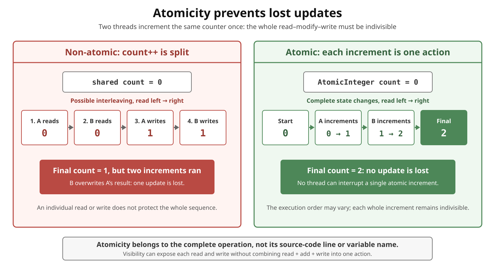

# Atomicity in Java

## Front

What does **atomicity** mean in Java concurrency, and why is `count++` unsafe when threads share a counter?

## Back

**Atomicity means a shared-state operation appears to happen as one indivisible action: another thread can observe the state before or after it, but cannot interleave with a partial update.**

The diagram follows two threads that each increment the same counter once.



### Why `count++` can lose an update

```java
// Conceptual fragment: count is shared by multiple threads.
count++;
```

One statement is not necessarily one atomic operation. `count++` reads the old value, adds `1`, then writes the result. Two threads can both read `0` and both write `1`; the final value is `1` instead of `2`. This is a **lost update**.

Declaring the counter `volatile` improves visibility and ordering, but still leaves this read–modify–write sequence non-atomic.

### Make the whole operation atomic

Use an atomic API for a single value:

```java
import java.util.concurrent.atomic.AtomicInteger;

public final class AtomicCounter {
    private final AtomicInteger count = new AtomicInteger();

    public int increment() {
        return count.incrementAndGet();
    }
}
```

`incrementAndGet()` performs the increment atomically. Alternatively, protect every access participating in the operation with the same lock:

```java
// Conceptual fragment inside a class.
private int count;

synchronized (lock) {
    count++;
}
```

Atomicity applies to a chosen operation boundary. Several atomic calls are not automatically one transaction; a check followed by an update may still need a compare-and-set loop or a lock.

> **Remember:** atomicity protects a state transition; visibility determines when another thread can see writes. They solve different problems.

## Sources

- [JLS §15.14.2 — postfix increment](https://docs.oracle.com/javase/specs/jls/se26/html/jls-15.html#jls-15.14.2)
- [JLS §17.4 — Java Memory Model](https://docs.oracle.com/javase/specs/jls/se26/html/jls-17.html#jls-17.4)
- [Java SE 26 `AtomicInteger` API](https://docs.oracle.com/en/java/javase/26/docs/api/java.base/java/util/concurrent/atomic/AtomicInteger.html)
