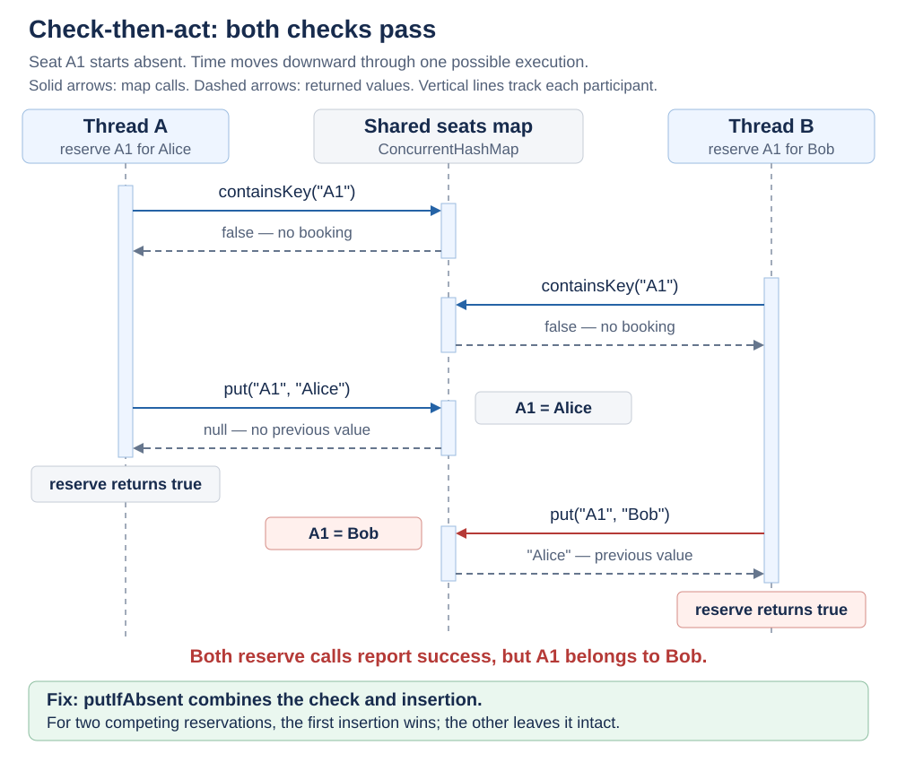

# Check-Then-Act in Java

<sub>[Back to Java](../Readme.md#content)</sub>

# Front

Why can **check-then-act** fail when Java threads share state, and how do you make it safe?

# Back

**Check-then-act means checking a condition and then acting on the result.** Another thread can change the shared state between those steps, making the decision stale. This is a **race condition**: correctness depends on how the threads' operations overlap. Make the check and action **atomic**—one indivisible operation relative to competing operations.

## Example: reserve a seat only if it is free

Two threads share one `SeatBooking` instance. Each tries to reserve seat `"A1"`, one for `"Alice"` and one for `"Bob"`.

```java
import java.util.concurrent.ConcurrentHashMap;

public final class SeatBooking {
    private final ConcurrentHashMap<String, String> seats =
            new ConcurrentHashMap<>();

    // Unsafe: the check and write are separate operations.
    public boolean reserve(String seat, String name) {
        if (!seats.containsKey(seat)) { // check
            seats.put(seat, name);     // act
            return true;
        }
        return false;
    }
}
```

Read the diagram from top to bottom. Both checks can see an empty seat before either write happens. Bob then overwrites Alice, yet both calls report success. The green band at the foot names the fix, which the next section explains.



`ConcurrentHashMap` makes its individual operations thread-safe; it does **not** combine `containsKey()` and `put()` into one atomic operation.

## Fix: combine the check and insertion

Replace `reserve` above with this method:

```java
public boolean reserve(String seat, String name) {
    return seats.putIfAbsent(seat, name) == null;
}
```

`putIfAbsent()` atomically inserts only when the key is absent and returns the previous value. Because `ConcurrentHashMap` never stores a null value, **a `null` return means this call inserted**. Passing a null key or value throws `NullPointerException`.

On maps that allow null values, a `null` return can also mean the key previously mapped to null. Do not use `== null` alone as proof that the key was absent.

With two competing calls and no other changes to the map, one reservation succeeds; the other returns `false` without overwriting it.

For a condition involving several fields, put the **whole check and action inside one `synchronized` block**, and use the same lock for every access to that protected state. Locking only the write leaves the check exposed.

# Sources

- [Java SE 26 `ConcurrentHashMap` — atomic `putIfAbsent` and return values](https://docs.oracle.com/en/java/javase/26/docs/api/java.base/java/util/concurrent/ConcurrentHashMap.html#putIfAbsent(K,V))
- [Java SE 26 `ConcurrentMap` — separate check/put versus an atomic operation](https://docs.oracle.com/en/java/javase/26/docs/api/java.base/java/util/concurrent/ConcurrentMap.html#putIfAbsent(K,V))
- [JLS §17.1 — synchronization and shared locks](https://docs.oracle.com/javase/specs/jls/se26/html/jls-17.html#jls-17.1)
