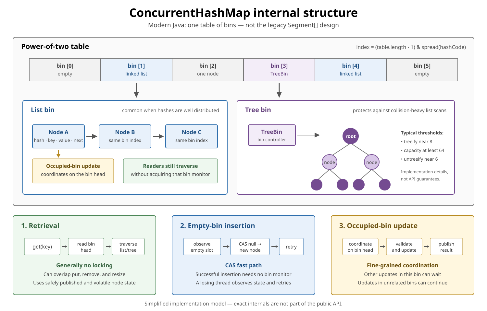
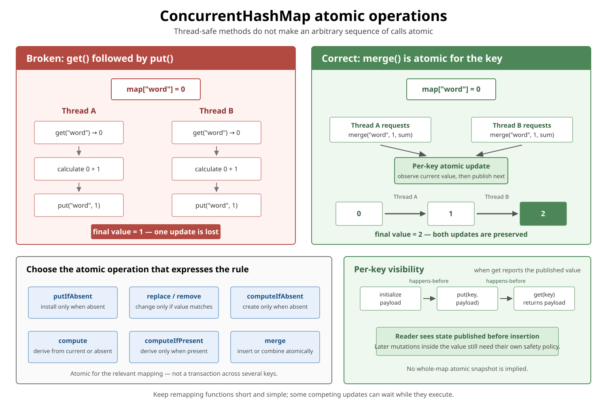
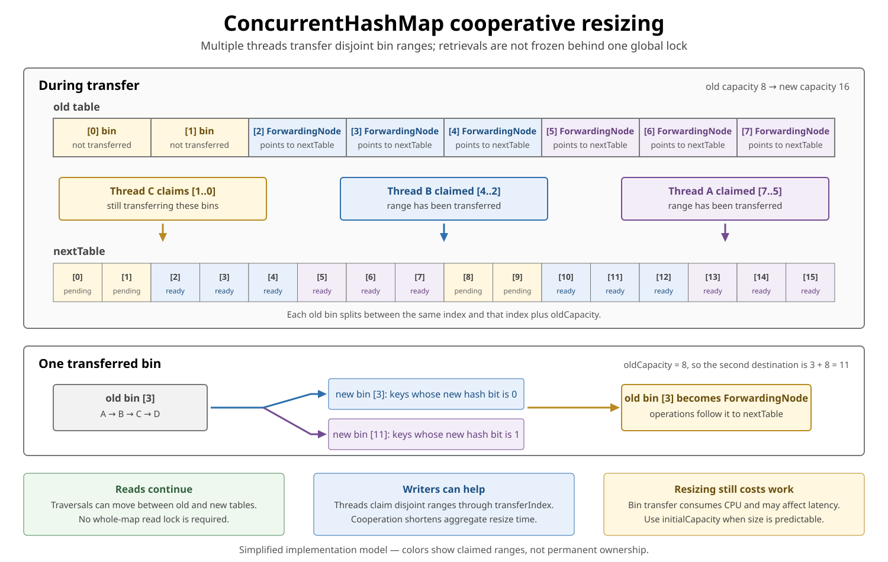

# ConcurrentHashMap in Modern Java

## Front

How does `ConcurrentHashMap` work in modern Java, which operations are atomic, what visibility and iteration guarantees does it provide, and when should it be used?

## Back

`ConcurrentHashMap<K,V>` is a thread-safe hash table that supports:

- Full concurrency for retrievals such as `get()`.
- High expected concurrency for updates.
- Atomic conditional and per-key compound operations.
- Traversal while other threads update the map.

It is normally the default map for shared, concurrently accessed key-value state when sorted ordering is not required.

```java
ConcurrentHashMap<String, User> users =
        new ConcurrentHashMap<>();

users.put("alice", new User("Alice"));

User user = users.get("alice");
```

Important properties:

| Property | Guarantee |
|---|---|
| Thread-safe methods | Yes |
| `null` keys | Not allowed |
| `null` values | Not allowed |
| Ordering | No guaranteed encounter order |
| Retrieval locking | `get()` generally does not lock |
| Iterators | Weakly consistent; no `ConcurrentModificationException` |
| Atomic compound methods | `putIfAbsent`, conditional `remove`/`replace`, `compute*`, `merge` |
| Whole-map snapshot | Not provided |

## Internal organization



Modern `ConcurrentHashMap` does **not** use the fixed `Segment[]` design from Java 7 and earlier.

Conceptually, it contains a power-of-two array of bins:

```text
table[0] → empty
table[1] → Node → Node → Node
table[2] → Node
table[3] → TreeBin containing tree nodes
...
```

A mapping is stored in a node containing approximately:

```java
final int hash;
final K key;
volatile V value;
volatile Node<K,V> next;
```

This is an explanatory representation of the current OpenJDK implementation, not public API.

### Finding a bin

The map spreads the key's hash and uses the table length to select a bin:

```text
spread(key.hashCode())
        ↓
index = (table.length - 1) & hash
```

The table length is a power of two, allowing the index calculation to use a bit mask rather than division.

Keys used in any hash map should have stable `equals()` and `hashCode()` behavior while stored in the map. Mutating fields involved in either method can make an entry effectively unreachable.

## How `get()` works

Retrieval operations generally do not acquire a bin lock:

```text
Read current table
        ↓
Read bin head
        ↓
Compare hash and key
        ↓
Traverse list or tree
        ↓
Return current value or null
```

The implementation uses volatile/acquire reads and safely published nodes. A reader can overlap writers and resizing activity.

`get()` is therefore **non-blocking in the ordinary map-locking sense**, but that statement does not make it formally lock-free under every JVM or application condition. For example, user-defined `hashCode()` or `equals()` can execute arbitrary code.

## How updates work

The modern implementation combines CAS and fine-grained bin coordination.

### Empty bin

When the target bin is empty, insertion normally uses CAS:

```text
table[index] == null
        ↓
CAS(null, newNode)
        ↓
success or retry
```

No bin monitor is needed for the successful empty-bin insertion.

### Occupied bin

When the bin already contains nodes, updates coordinate on that bin—normally by synchronizing on its current first node and validating that it is still the bin head.

```text
bin 3 update ──coordinates with── other bin 3 updates

bin 3 update ──can proceed with── bin 9 update
```

This is often called **per-bin locking**. It is not:

- One global map lock.
- One permanent lock object per key.
- The old `Segment[]` architecture.

Different keys can still contend when their hashes place them in the same bin. A slow `equals()`, `hashCode()`, or remapping function can therefore delay other updates associated with that bin.

### What `concurrencyLevel` means now

This constructor still exists for compatibility:

```java
new ConcurrentHashMap<>(
        initialCapacity,
        loadFactor,
        concurrencyLevel
);
```

In modern Java, `concurrencyLevel` is only an **initial sizing hint**. It does not create that number of segments or locks.

## Collision handling and tree bins

A bin normally starts as a linked list. With many collisions, it may become a balanced tree:

```text
short bin:
Node → Node → Node

collision-heavy bin:
          TreeNode
         /        \
    TreeNode    TreeNode
```

Current OpenJDK implementation thresholds are:

- Treeify around 8 nodes in one bin.
- Treeification requires a table capacity of at least 64.
- Otherwise, the map prefers resizing the table.
- A tree may become a list again around 6 nodes during a resize split.

These are implementation details, not API promises. They should explain performance, not become application logic.

Tree bins reduce the damage caused by severe hash collisions. Good `hashCode()` distribution is still important.

## Atomic operations



Thread safety of individual methods does not make an arbitrary sequence of calls atomic.

### Broken check-then-act

```java
if (!map.containsKey(key)) {
    map.put(key, createValue());
}
```

Two threads can both observe that the key is absent, create two values, and overwrite one another.

Use:

```java
Value existing = map.putIfAbsent(key, candidate);
```

If value creation should happen only when the key is absent:

```java
Value value = map.computeIfAbsent(
        key,
        ignored -> createValue()
);
```

### Lost update with `get()` followed by `put()`

Broken counter:

```java
Integer current = counts.get(word);
counts.put(word, current + 1);
```

Two threads can read the same value and both publish the same incremented value.

Atomic alternative:

```java
counts.merge(word, 1, Integer::sum);
```

or:

```java
counts.compute(word, (key, current) ->
        current == null ? 1 : current + 1
);
```

### Atomic method summary

| Method | Atomic behavior for the relevant key |
|---|---|
| `putIfAbsent(k, v)` | Insert only when absent |
| `remove(k, v)` | Remove only when currently mapped to `v` |
| `replace(k, old, next)` | Replace only when currently mapped to `old` |
| `computeIfAbsent(k, f)` | Compute and install only when absent |
| `computeIfPresent(k, f)` | Recompute only when present |
| `compute(k, f)` | Recompute from the current value or absence |
| `merge(k, v, f)` | Insert `v` when absent; otherwise combine atomically |

Returning `null` from `compute`, `computeIfPresent`, or the `merge` remapping function removes the mapping. Returning `null` from `computeIfAbsent` leaves the key absent.

### Atomic per key does not mean one transaction across keys

```java
map.compute("debit",  (k, v) -> v - 100);
map.compute("credit", (k, v) -> v + 100);
```

Each call is atomic for its relevant mapping, but another thread can observe the state between them.

Use a lock, immutable aggregate state, database transaction, or another coordination mechanism when an invariant spans several mappings.

## Remapping functions must be short and simple

Methods such as `computeIfAbsent`, `compute`, and `merge` may prevent some competing updates from completing while the function runs.

Good:

```java
cache.computeIfAbsent(key, this::loadQuickly);
```

Potentially dangerous:

```java
cache.computeIfAbsent(key, ignored -> {
    callSlowRemoteService();
    waitForAnotherThread();
    updateSeveralOtherMappings();
    return value;
});
```

The API requires mapping functions not to modify the map during the computation. Detectable recursive updates that would never complete can produce `IllegalStateException`.

A function passed to `computeIfAbsent` is invoked at most once **for that method invocation** when the key is absent. If it throws or returns `null`, a later invocation may execute it again.

Do not place non-idempotent external side effects inside a remapping function unless the surrounding design explicitly tolerates retries, failures, and contention.

## Scalable frequency map

For a highly contended histogram, store `LongAdder` values:

```java
ConcurrentHashMap<String, LongAdder> frequencies =
        new ConcurrentHashMap<>();

frequencies
        .computeIfAbsent(word, ignored -> new LongAdder())
        .increment();
```

Why not repeatedly replace an `Integer`?

```text
ConcurrentHashMap<String, Integer>
        ↓
all updates for one key replace the same mapping

ConcurrentHashMap<String, LongAdder>
        ↓
map installs one counter atomically
        ↓
LongAdder spreads contended increments internally
```

The value object still has its own concurrency semantics. `ConcurrentHashMap` makes access to the mapping thread-safe; it does not automatically make arbitrary mutable values thread-safe.

## Memory consistency and safe publication

For a particular key, an update happens-before a subsequent non-null retrieval that reports the updated value.

```java
Payload payload = new Payload();
payload.initialize();

map.put("job", payload);
```

Another thread:

```java
Payload payload = map.get("job");

if (payload != null) {
    payload.consumeInitializedState();
}
```

If `get("job")` returns the published payload, the reader sees the actions that preceded its publication through the map.

Conceptually:

```text
initialize payload
        happens-before
put(key, payload)
        happens-before
successful get(key) returning payload
        happens-before
consume initialized state
```

This safely publishes the state that existed before insertion. It does not make later unsynchronized mutations of `Payload` safe:

```java
map.get("job").mutableField++;
```

The mutable object needs its own synchronization, immutability, atomic fields, or confinement policy.

## Iteration is weakly consistent

```java
for (Map.Entry<String, User> entry : users.entrySet()) {
    process(entry);
}
```

An iterator may run while other threads insert, update, or remove entries.

It:

- Does not throw `ConcurrentModificationException` because of concurrent updates.
- Never requires a single global map lock.
- May observe some updates and miss others.
- Does not provide a point-in-time snapshot.
- Is intended to be used by one thread at a time.

Example:

```text
Iterator created when map contains A and B

Concurrent thread removes A and adds C

Iterator may observe:
A, B
B, C
A, B, C
or another state permitted by concurrent timing
```

The precise result should not be used as a transactional view of the map.

If a stable snapshot is required, copy the map using an application-level synchronization protocol that prevents relevant updates during the copy. Calling `new HashMap<>(concurrentMap)` alone does not stop concurrent changes.

## `size()` and aggregate state

During concurrent updates, methods such as:

```java
map.size();
map.isEmpty();
map.containsValue(value);
map.mappingCount();
```

may reflect transient state. They are useful for monitoring and estimation but should not normally control a correctness-critical decision.

Broken assumption:

```java
if (map.size() < limit) {
    map.put(key, value);
}
```

Another thread can insert between the check and update. The map does not make the capacity rule atomic.

`mappingCount()` returns a `long` and is preferable when the map might theoretically contain more than `Integer.MAX_VALUE` mappings, but its value is still an estimate during concurrent mutation.

## Parallel bulk operations

`ConcurrentHashMap` supplies concurrent-friendly bulk operations:

- `forEach`
- `search`
- `reduce`

Example:

```java
long total = counts.reduceValuesToLong(
        10_000,
        LongAdder::sum,
        0L,
        Long::sum
);
```

The first argument is `parallelismThreshold`:

- `Long.MAX_VALUE` forces sequential execution.
- `1` requests maximum partitioning.
- Parallel tasks use `ForkJoinPool.commonPool()`.

Bulk operations are safe during concurrent updates, but the result is not necessarily an atomic whole-map snapshot. Reduction functions should be associative and commutative, and should not depend on encounter order.

For small maps or cheap functions, parallel overhead may be greater than the saved work. Measure before choosing a threshold.

## Cooperative resizing



The table is normally resized when its occupancy crosses an internal threshold corresponding roughly to a 0.75 load factor.

Modern resizing is cooperative:

1. A replacement table, normally twice as large, is allocated.
2. Threads claim ranges of old-bin indexes.
3. Each claimed bin is split and transferred.
4. The old slot is replaced with a `ForwardingNode`.
5. Operations encountering that node follow it to the new table.
6. Other threads may join and help complete the transfer.

```text
old table bin i
        ↓ split using one additional hash bit
new table bin i
or
new table bin i + oldCapacity
```

Resizing does not require freezing all retrievals behind one global table lock. It is nevertheless real work and may affect latency and throughput.

When a reliable size estimate is available, provide `initialCapacity`:

```java
ConcurrentHashMap<String, User> users =
        new ConcurrentHashMap<>(expectedUsers);
```

The constructor interprets this as the expected number of mappings to accommodate, not necessarily the exact backing-array length.

## Why `null` is forbidden

```java
map.put(null, value); // NullPointerException
map.put(key, null);   // NullPointerException
```

With concurrent access, `get(key) == null` must unambiguously mean that no mapping was observed:

```java
Value value = map.get(key);

if (value == null) {
    // no mapping observed
}
```

Allowing stored null values would make absence indistinguishable from a present mapping to null. The API also uses null as a control result in search, reduce, and remapping operations.

Use `Optional`, a sentinel object, or a domain-specific representation when “present but empty” is meaningful.

## Key-set views

Create a concurrent set backed by a `ConcurrentHashMap`:

```java
Set<String> onlineUsers =
        ConcurrentHashMap.newKeySet();

onlineUsers.add("alice");
onlineUsers.remove("bob");
```

You can also obtain a key-set view whose additions map every key to a common value:

```java
ConcurrentHashMap<String, Boolean> map =
        new ConcurrentHashMap<>();

Set<String> keys = map.keySet(Boolean.TRUE);
keys.add("alice");
```

## When to use it

- Shared caches and registries.
- Concurrent lookup tables.
- Per-key state machines.
- Frequency maps with `LongAdder` values.
- Deduplication or membership sets through `newKeySet()`.
- Workloads with frequent reads and concurrent updates.
- Situations where weakly consistent traversal is acceptable.

## When another structure may be better

- Use an immutable map or ordinary `HashMap` for thread-confined state.
- Use `Collections.synchronizedMap(...)` when one coarse lock and externally synchronized compound traversal are intentional.
- Use `ConcurrentSkipListMap` when sorted keys, range queries, or navigation are required.
- Use a bounded cache library when eviction, expiration, loading, statistics, or size limits are required.
- Use an explicit lock or transactional design when invariants span several keys.

## Comparison

| Map | Concurrent access | Nulls | Ordering | Iteration during updates | Main coordination |
|---|---|---|---|---|---|
| `HashMap` | No | Yes | None | Fail-fast best effort | External if shared |
| `Hashtable` | Yes | No | None | Coarse synchronized methods | One object monitor |
| `Collections.synchronizedMap` | Yes with its protocol | Depends on delegate | Depends on delegate | Traversal requires external synchronization | One wrapper monitor |
| `ConcurrentHashMap` | Yes | No | None | Weakly consistent | CAS plus per-bin coordination |
| `ConcurrentSkipListMap` | Yes | No | Sorted | Weakly consistent | Concurrent skip-list algorithm |

## Common misconceptions

### “Every operation is lock-free”

False. Retrievals generally avoid locking, but contended updates can coordinate through a bin monitor or tree-bin mechanism.

### “It has one lock per key”

False. Update coordination is based on bins. Different keys in one bin can contend.

### “It still uses segments”

False for modern Java. The old segment design was replaced in Java 8. The `concurrencyLevel` constructor parameter remains only as a sizing hint.

### “Thread-safe methods make this sequence atomic”

False:

```java
if (map.get(key) == null) {
    map.put(key, value);
}
```

Use the appropriate atomic map operation.

### “Its iterator is a snapshot”

False. It is weakly consistent and may incorporate concurrent changes.

### “Values stored in it become thread-safe”

False. The map safely coordinates and publishes mappings; mutable values require their own safety strategy.

## Interview summary

> Modern `ConcurrentHashMap` is a power-of-two table of bins, not a segmented map. Reads generally use volatile/acquire access and do not lock. An insertion into an empty bin usually uses CAS; updates to an occupied bin coordinate at bin granularity, allowing unrelated bins to update concurrently. Collision-heavy bins can become balanced trees. Atomic methods such as `putIfAbsent`, `compute`, and `merge` prevent per-key check-then-act races, but they do not create transactions across keys. Iterators are weakly consistent, aggregate counts may be transient during mutation, and successful per-key publication establishes the required visibility for a retrieval that observes the value. Resizing is cooperative: threads transfer bin ranges and leave forwarding nodes that redirect operations to the new table.

## Official references

- [Java 26 API: ConcurrentHashMap](https://docs.oracle.com/en/java/javase/26/docs/api/java.base/java/util/concurrent/ConcurrentHashMap.html)
- [Java 26 API: ConcurrentMap](https://docs.oracle.com/en/java/javase/26/docs/api/java.base/java/util/concurrent/ConcurrentMap.html)
- [Current OpenJDK ConcurrentHashMap source](https://github.com/openjdk/jdk/blob/master/src/java.base/share/classes/java/util/concurrent/ConcurrentHashMap.java)
