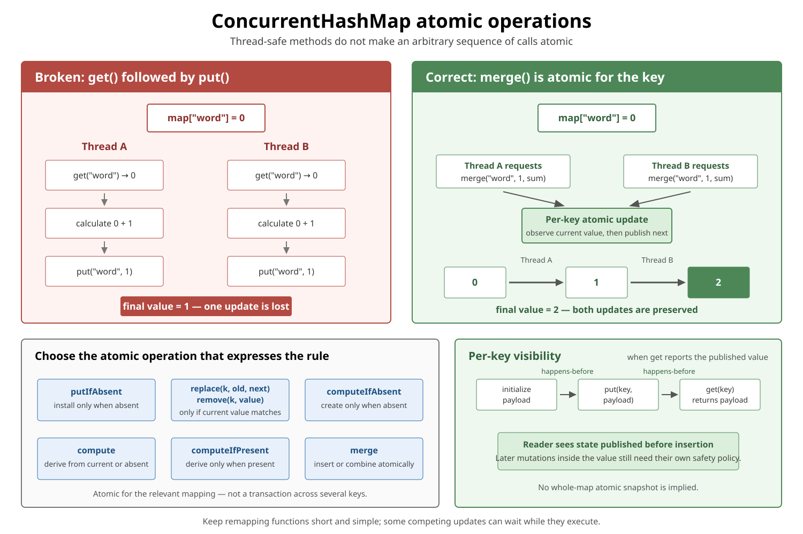
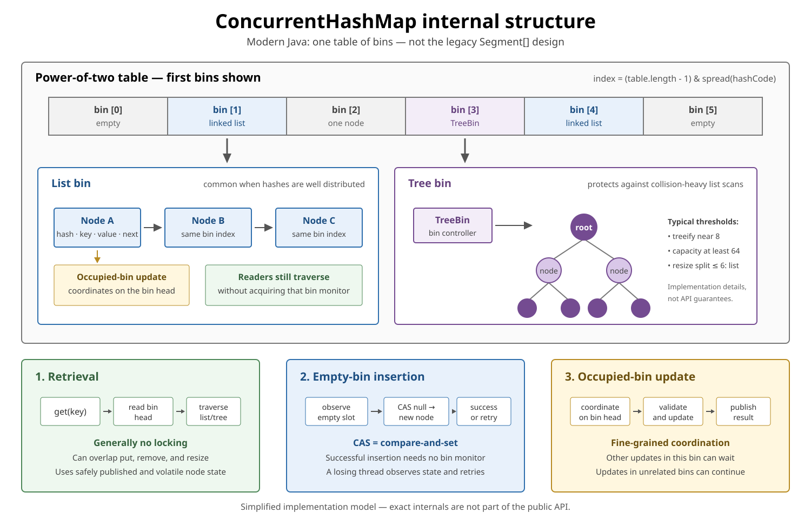
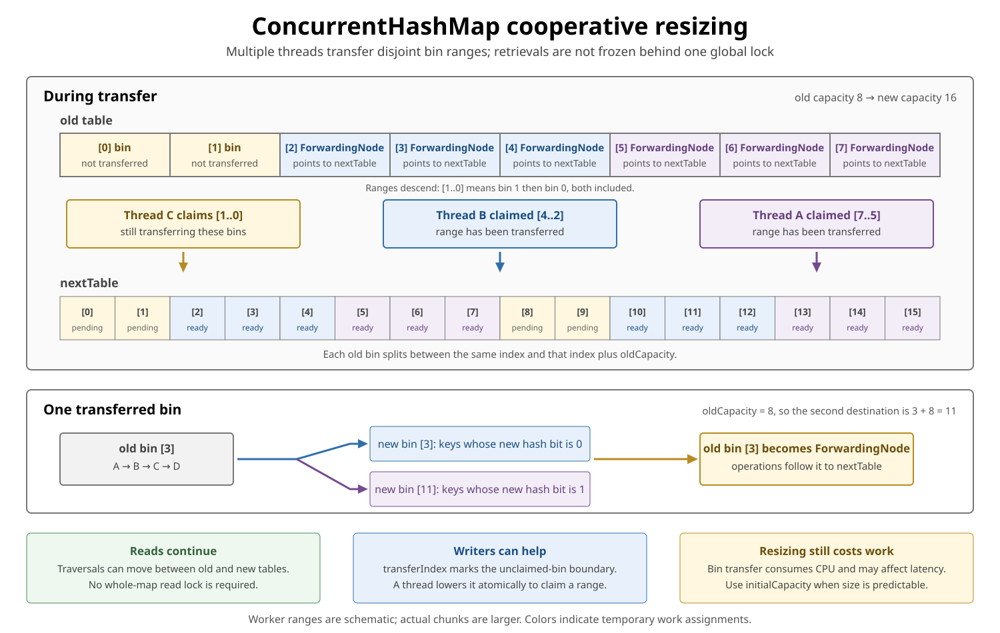

# ConcurrentHashMap

<sub>[Back to Java](../Readme.md#content)</sub>

**`ConcurrentHashMap` was introduced in Java 5 (JDK 1.5) as a thread-safe hash table for concurrent retrievals and updates.**

`ConcurrentHashMap<K,V>` lets multiple threads safely look up and update shared key-value pairs. **Its atomic methods protect one mapping operation; several calls do not automatically become one atomic action.** For example, reading a count and then writing an incremented count can still lose another thread's increment.

Start with atomic updates, then learn what the map guarantees about visibility and iteration. The later implementation sections explain bins, locking, and resizing using OpenJDK 26. You can use the public API correctly without memorizing those internals.

## Core vocabulary and first example

- A **mapping** is one association, such as `"apple" → 1`. `K` is the key type and `V` is the value type.
- **Thread-safe** means the map supports concurrent calls without requiring the caller to protect its internal structure with a lock.
- An **atomic mapping operation** takes effect as one indivisible change for that key. A competing update cannot slip between its check and its change.
- A **snapshot** represents the entire map at one instant. Concurrent traversal does not promise such a view.

This complete example shows the basic API; the frequency-map example below adds multiple threads.

```java
import java.util.concurrent.ConcurrentHashMap;

public final class ConcurrentHashMapBasics {
    public static void main(String[] args) {
        ConcurrentHashMap<String, Integer> counts =
                new ConcurrentHashMap<>();

        counts.put("apple", 1);
        counts.merge("apple", 1, Integer::sum);

        System.out.println(counts.get("apple")); // 2
        System.out.println(counts.get("pear"));  // null
    }
}
```

`merge("apple", 1, Integer::sum)` inserts `1` if the key is absent. Otherwise it adds `1` to the existing value atomically. `Integer::sum` is a method reference equivalent here to `(oldValue, addedValue) -> oldValue + addedValue`.

Important properties:

| Property | Guarantee |
|---|---|
| Thread-safe methods | Yes |
| `null` keys | Not allowed |
| `null` values | Not allowed |
| Ordering | No guaranteed encounter order |
| Retrieval locking | `get()` generally does not lock |
| Iterators | May reflect some concurrent changes; no `ConcurrentModificationException` |
| Atomic compound methods | `putIfAbsent`, conditional `remove`/`replace`, `compute*`, `merge` |
| Whole-map snapshot | Not provided |

## Atomic operations

The diagram has four panels. Across the top, the count starts at `0`: separate `get` and `put` calls on the left produce `1` after two increments; two atomic `merge` calls on the right correctly produce `2`.

The lower-left chooser matches each rule to an atomic method: insert if absent, replace or remove an expected value, compute a value, or combine values. The examples below explain those choices.

The lower-right panel explains **visibility**: which writes another thread is guaranteed to see. **Happens-before** is Java's relationship guaranteeing that earlier actions are visible to, and ordered before, the related later actions. Follow its arrows from initializing a payload (the value object), through `put`, to a `get` that returns that payload: the reader sees the state initialized before insertion. Later changes inside that object need their own synchronization.



Thread safety of individual methods does not make an arbitrary sequence of calls atomic.

### Broken check-then-act

```java
// Conceptual fragment: Value and createValue() are application code.
if (!map.containsKey(key)) {
    map.put(key, createValue());
}
```

Two threads can both observe that the key is absent, create two values, and overwrite one another.

Use:

```java
// Conceptual fragment.
Value existing = map.putIfAbsent(key, candidate);
```

The returned value is the previous value, or `null` if this call inserted `candidate`. The candidate already exists before the call, so competing callers may still construct unused candidates.

To create the value inside the atomic absence check, use `computeIfAbsent`:

```java
// Conceptual fragment.
Value value = map.computeIfAbsent(
        key,
        ignored -> createValue()
);
```

### Lost update with `get()` followed by `put()`

Broken counter, assuming the key is already mapped to `0` and no thread removes it:

```java
// Conceptual fragment.
Integer current = counts.get(word);
counts.put(word, current + 1);
```

Two threads can both read `0` and both write `1`; the correct count after two increments is `2`. If the key were absent, `current + 1` would instead throw `NullPointerException` when Java tried to unbox `null`.

Atomic alternative:

```java
// Conceptual fragment.
counts.merge(word, 1, Integer::sum);
```

This also handles the first occurrence of a word by inserting `1`. An equivalent counter update uses `compute`:

```java
// Conceptual fragment.
counts.compute(word, (key, current) ->
        current == null ? 1 : current + 1
);
```

### Atomic method summary

| Method | Atomic behavior for the relevant key |
|---|---|
| `putIfAbsent(k, v)` | Insert only when absent |
| `remove(k, v)` | Remove only when currently mapped to `v` |
| `replace(k, old, next)` | Replace only when currently mapped to `old` |
| `computeIfAbsent(k, f)` | Compute and install only when absent |
| `computeIfPresent(k, f)` | Recompute only when present |
| `compute(k, f)` | Recompute from the current value or absence |
| `merge(k, v, f)` | Insert `v` when absent; otherwise combine atomically |

Returning `null` from `compute`, `computeIfPresent`, or the `merge` remapping function removes the mapping. Returning `null` from `computeIfAbsent` leaves the key absent.

### Atomic per key does not mean one transaction across keys

```java
// Conceptual fragment: both keys exist and are not removed.
map.compute("debit",  (k, v) -> v - 100);
map.compute("credit", (k, v) -> v + 100);
```

Each call is atomic for its relevant mapping, but another thread can observe the state between them.

An **invariant** is a rule that must always hold, such as keeping the total balance unchanged during a transfer. If it spans several mappings, use a shared application lock that every relevant reader and writer follows, or store the related fields in one immutable value and replace that value atomically. Simply wrapping these calls in `synchronized (map)` does not make ordinary `get` or `put` calls elsewhere acquire that lock.

## Remapping functions must be short and simple

The function supplied to a `compute*` or `merge` method is a callback: the map calls your code to produce a value. A remapping function computes a replacement from the current value.

Methods such as `computeIfAbsent`, `compute`, and `merge` may prevent some competing updates from completing while the function runs.

Good:

```java
// Conceptual fragment.
counts.compute(word, (key, current) -> current == null ? 1 : current + 1);
```

Potentially dangerous:

```java
// Conceptual fragment: do not block or update other mappings here.
cache.computeIfAbsent(key, ignored -> {
    callSlowRemoteService();
    waitForAnotherThread();
    updateSeveralOtherMappings();
    return value;
});
```

Keep these callbacks short, and do not call methods that modify this map from inside them. Return the new value and let the map install it. A detectable recursive update that would never complete can throw `IllegalStateException`; this exception is not a general detector for every unsafe callback.

`ConcurrentHashMap.computeIfAbsent` calls its function once if the key is absent for that invocation, and not at all if a value is already present. This does not mean once for the lifetime of the key: a later call may compute again after removal, a `null` result, or an exception. If the function throws, this call establishes no mapping and propagates the exception.

Keep external side effects out of these callbacks unless the design can safely handle repeated calls and exceptions. Installing one mapping atomically does not guarantee that an external action happens exactly once.

## Scalable frequency map

For a histogram (a count per item) updated by many threads, `LongAdder` can reduce **contention**: threads competing to change the same state. It distributes increments across internal counters and combines them when you call `sum()`.

This complete example follows the pattern recommended by the API. Its counters remain in the map for the lifetime of the example.

```java
import java.util.concurrent.ConcurrentHashMap;
import java.util.concurrent.atomic.LongAdder;

public final class FrequencyCounter {
    private final ConcurrentHashMap<String, LongAdder> frequencies =
            new ConcurrentHashMap<>();

    public void record(String word) {
        frequencies
                .computeIfAbsent(word, ignored -> new LongAdder())
                .increment();
    }

    public long count(String word) {
        LongAdder counter = frequencies.get(word);
        return counter == null ? 0L : counter.sum();
    }

    public static void main(String[] args) throws InterruptedException {
        FrequencyCounter counter = new FrequencyCounter();
        Runnable recordBatch = () -> {
            for (int i = 0; i < 10_000; i++) {
                counter.record("java");
            }
        };

        Thread first = new Thread(recordBatch);
        Thread second = new Thread(recordBatch);
        first.start();
        second.start();
        first.join();
        second.join();

        System.out.println(counter.count("java")); // 20000
    }
}
```

Why not repeatedly replace an `Integer`?

```text
ConcurrentHashMap<String, Integer>
        ↓
all updates for one key replace the same mapping

ConcurrentHashMap<String, LongAdder>
        ↓
map installs one counter atomically
        ↓
LongAdder spreads contended increments internally
```

`join()` waits for each worker to finish. With no increments still running, `sum()` returns the accurate total. **During concurrent increments, `sum()` is not an atomic snapshot**, so use it for statistics rather than an exact admission limit.

The map's atomic operation ends before `.increment()`. If another thread removes or replaces the counter between those calls, the increment may affect a counter that is no longer stored in the map. The pattern therefore needs stable counter mappings while recording, or additional coordination for removal and replacement.

`LongAdder` supplies its own thread safety. `ConcurrentHashMap` does not automatically make arbitrary mutable values thread-safe.

## Memory consistency and safe publication

**Safe publication** means another thread can see an object's initialized state when it obtains the reference. The first diagram's happens-before arrows explain why publication through this map is safe.

For a particular key, an update happens-before a subsequent non-null retrieval that reports the updated value.

```java
// Conceptual producer fragment.
Payload payload = new Payload();
payload.initialize();

map.put("job", payload);
```

Another thread:

```java
// Conceptual consumer fragment.
Payload payload = map.get("job");

if (payload != null) {
    payload.consumeInitializedState();
}
```

If `get("job")` returns the published payload, the reader sees the actions that preceded its publication through the map.

Conceptually:

```text
initialize payload
        happens-before
put(key, payload)
        happens-before
successful get(key) returning payload
        happens-before
consume initialized state
```

This safely publishes the state that existed before insertion. It does not make later unsynchronized mutations of `Payload` safe:

```java
// Conceptual fragment: the value object needs its own safety policy.
map.get("job").mutableField++;
```

The mutable object needs its own synchronization, immutability, atomic fields, or confinement policy.

## Iteration is weakly consistent

**Weakly consistent** means an iterator can run alongside updates and may reflect some of them, without assembling one snapshot of the whole map.

```java
// Conceptual fragment: concurrent updates may overlap this loop.
for (Map.Entry<String, User> entry : users.entrySet()) {
    process(entry);
}
```

An iterator may run while other threads insert, update, or remove entries.

It:

- Does not throw `ConcurrentModificationException` because of concurrent updates.
- Never requires a single global map lock.
- May observe some updates and miss others.
- Does not provide a point-in-time snapshot.
- Is intended to be used by one thread at a time.

Example:

```text
Iterator created when map contains A and B

Concurrent thread removes A and adds C

Iterator may observe:
A, B
B, C
A, B, C
or another state permitted by concurrent timing
```

The precise result should not be used as a transactional view of the map.

If a stable snapshot of the mappings is required, prevent relevant updates during the copy through an application-level synchronization protocol that all those writers follow. Calling `new HashMap<>(concurrentMap)` alone does not stop concurrent changes. Such a copy still shares the original value objects; mutable values need their own snapshot policy.

## `size()` and aggregate state

During concurrent updates, methods such as:

```java
// Conceptual examples of transient aggregate observations.
map.size();
map.isEmpty();
map.containsValue(value);
map.mappingCount();
```

may reflect transient state. They are useful for monitoring and estimation but should not normally control a correctness-critical decision.

Broken assumption:

```java
// Conceptual fragment: another thread can insert after size().
if (map.size() < limit) {
    map.put(key, value);
}
```

Another thread can insert between the check and update. The map does not make the capacity rule atomic.

`mappingCount()` returns a `long` and is preferable when the map might theoretically contain more than `Integer.MAX_VALUE` mappings, but its value is still an estimate during concurrent mutation.

## Parallel bulk operations

`ConcurrentHashMap` supplies concurrent-friendly bulk operations:

- `forEach`
- `search`
- `reduce`

Example:

```java
// Conceptual fragment using the frequency map above.
long total = frequencies.reduceValuesToLong(
        10_000,
        LongAdder::sum,
        0L,
        Long::sum
);
```

The arguments mean: consider parallel execution when the estimated number of mappings reaches `10_000`; read each counter with `LongAdder::sum`; use `0L` as the empty sum; combine partial totals with `Long::sum`. Below the size threshold, the operation stays sequential. The threshold counts map entries, not recorded events or threads.

The first argument is called `parallelismThreshold`:

- `Long.MAX_VALUE` forces sequential execution.
- `1` requests maximum partitioning.
- Parallel tasks use `ForkJoinPool.commonPool()`.

Bulk operations are safe during concurrent updates, but the result is not necessarily an atomic whole-map snapshot. A reduction function must tolerate regrouping (**associativity**) and reordering (**commutativity**) of its inputs. Addition with an identity of `0` works; subtraction does not.

For small maps or cheap functions, parallel overhead may be greater than the saved work. Measure before choosing a threshold.

## Why `null` is forbidden

```java
// Conceptual examples; both calls throw NullPointerException.
map.put(null, value); // NullPointerException
map.put(key, null);   // NullPointerException
```

With concurrent access, `get(key) == null` must unambiguously mean that no mapping was observed:

```java
// Conceptual fragment.
Value value = map.get(key);

if (value == null) {
    // no mapping observed
}
```

Allowing stored null values would make absence indistinguishable from a present mapping to null. The API also uses null as a control result in search, reduce, and remapping operations.

Use a non-null placeholder when “present but empty” is meaningful, for example storing `Optional.empty()` as a value of type `Optional<Result>`.

## Key-set views

Create a concurrent set backed by a `ConcurrentHashMap`:

```java
// Conceptual key-set example.
Set<String> onlineUsers =
        ConcurrentHashMap.newKeySet();

onlineUsers.add("alice");
onlineUsers.remove("bob");
```

You can also obtain a key-set view whose additions map every key to a common value:

```java
// Conceptual key-set view example.
ConcurrentHashMap<String, Boolean> map =
        new ConcurrentHashMap<>();

Set<String> keys = map.keySet(Boolean.TRUE);
keys.add("alice");
```

This adds `"alice" → true` to the backing map. Removing a key through either view removes its mapping. The ordinary `map.keySet()` view supports removal but does not support `add`.

## Internal organization

The remaining mechanism sections describe **OpenJDK 26 implementation details**. A **bin** (also called a bucket) is one table slot and the nodes reached through it. A **node** holds a mapping. Different keys selecting the same bin cause a **collision**.

“Bucket” and “bin” mean the same thing in Java’s HashMap and ConcurrentHashMap: a position in the internal table that groups entries mapped to the same index. Both implementations use both terms—in fact, their source code describes them as a “binned (bucketed) hash table.” Entries in a bucket or bin can be organized as a linked list or a tree. The wording is simply a terminology preference; “bin” does not imply thread safety. ConcurrentHashMap gets its thread safety from atomic operations and synchronization, not from a different concept of a bucket.

Read the diagram from the table slots into their lists or tree. Updates to the same bin may compete for a **monitor**, the lock used by `synchronized`. **Compare-and-set (CAS)** atomically changes a slot only if it still contains the expected value; it can install the first node in an empty bin.



The JDK 7 implementation used a fixed `Segment[]` array. Since Java 8, OpenJDK uses one table of bins instead; the old segment-shaped serialized fields remain only for compatibility.

Conceptually, it contains a power-of-two array of bins:

```text
table[0] → empty
table[1] → Node → Node → Node
table[2] → Node
table[3] → TreeBin containing tree nodes
...
```

A mapping is stored in a node containing approximately:

```java
// Field fragment from OpenJDK 26's internal Node class.
final int hash;
final K key;
volatile V val;
volatile Node<K,V> next;
```

`final` fixes these field assignments after construction; it does not make the referenced key object immutable. The `volatile` value and next-node references help readers observe updates without acquiring the writer's monitor. These fields are not public API.

### Finding a bin

The map first spreads the key's hash: it mixes the upper 16 bits into the lower 16 bits so differences in the upper half can influence the low bits used for bin selection. This reduces collisions caused by ignoring those upper bits; it cannot eliminate all collisions. The map then uses the table length to select a bin:

```text
spread(key.hashCode())
        ↓
index = (table.length - 1) & hash
```

The table length is a power of two, allowing the index calculation to use bitwise AND (`&`) rather than division. For a table of length `16`, `length - 1` is `15`; this mask selects the hash's lowest four bits, producing an index from `0` to `15`.

Keys used in any hash map should have stable `equals()` and `hashCode()` behavior while stored in the map. Mutating fields involved in either method can make an entry effectively unreachable.

## How `get()` works

Retrieval operations generally do not acquire a bin lock:

```text
Read current table
        ↓
Read bin head
        ↓
Compare hash and key
        ↓
Traverse list or tree
        ↓
Return current value or null
```

The implementation uses volatile reads of node fields and **acquire reads** of table slots. An acquire read keeps later memory reads and writes in that thread from being reordered before it. Here, together with the map's publication writes, it lets a reader observe a node reference and then safely read the node's initialized state. The word "acquire" describes memory ordering; it does not mean acquiring a bin lock. A reader can overlap writers and resizing activity.

`get(key)` reflects the latest update for that key completed before retrieval began, or a later update that overlaps the retrieval. When retrieval and update overlap, it may observe the mapping before or after that overlapping update. A concurrent `get` does not have to wait for a `computeIfAbsent` callback to finish; it can still report absence while the value is being computed.

`get()` is therefore **non-blocking in the ordinary map-locking sense**, but that statement does not make it formally lock-free under every JVM or application condition. For example, user-defined `hashCode()` or `equals()` can execute arbitrary code.

## How updates work

The modern implementation combines CAS and fine-grained bin coordination.

### Empty bin

For `put` into an empty target bin, insertion normally uses CAS:

```text
table[index] == null
        ↓
CAS(null, newNode)
        ↓
success or retry
```

No bin monitor is needed for this successful insertion. This is not the complete path for every method: `computeIfAbsent`, for example, can reserve an empty bin and run its callback under a monitor.

### Occupied bin

When the bin already contains nodes, updates coordinate on that bin—normally by synchronizing on its current first node and validating that it is still the bin head.

```text
bin 3 update ──coordinates with── other bin 3 updates

bin 3 update ──can proceed with── bin 9 update
```

This is often called **per-bin locking**. It is not:

- One global map lock.
- One permanent lock object per key.
- The old `Segment[]` architecture.

Different keys can still contend when their hashes place them in the same bin. A slow `equals()` or remapping function executed under that bin's lock can delay its other writers. A slow `hashCode()` delays the caller too, but the key's hash is normally computed before the bin lock is acquired.

### What `concurrencyLevel` means now

This constructor still exists for compatibility:

```java
// Constructor shape; concurrencyLevel is not a segment count.
new ConcurrentHashMap<>(
        initialCapacity,
        loadFactor,
        concurrencyLevel
);
```

In modern Java, `concurrencyLevel` is only an **initial sizing hint**. It does not create that number of segments or locks.

## Collision handling and tree bins

A bin normally starts as a linked list. With many collisions, it may become a balanced tree:

```text
short bin:
Node → Node → Node

collision-heavy bin:
          TreeNode
         /        \
    TreeNode    TreeNode
```

OpenJDK 26 uses these implementation thresholds:

- `TREEIFY_THRESHOLD = 8` guides conversion from a list to a tree; the exact insertion that triggers it depends on the update path.
- Treeification requires a table capacity of at least 64.
- Otherwise, the map prefers resizing the table.
- During a resize split, a resulting group of at most 6 nodes becomes a list.

These are implementation details, not API promises. They should explain performance, not become application logic.

Tree bins reduce the damage caused by severe hash collisions. Good `hashCode()` distribution is still important.

## Cooperative resizing

During a resize, updater threads can share the work of transferring bins into a larger table. The diagram uses small, schematic worker ranges; its forwarding markers tell operations where transferred mappings can now be found.

Ranges descend: `[1..0]` means bin `1` followed by bin `0`, both included. The shared `transferIndex` marks the upper boundary of bins not yet claimed; a thread lowers it atomically to claim a range for transfer. Each worker then walks its range toward lower indices.



The **load factor** relates the number of mappings to the number of table slots. The table normally grows near an internal threshold of `0.75 × table length`; severe collisions can also trigger growth.

Modern resizing is cooperative. A replacement table, normally twice as large, is allocated. Threads claim disjoint ranges of old bins, split and transfer them, and replace transferred old slots with `ForwardingNode` markers. An operation that encounters one continues in the new table, and additional updater threads can help finish the transfer.

```text
old table bin i
        ↓ split using one additional hash bit
new table bin i
or
new table bin i + oldCapacity
```

Resizing does not require freezing all retrievals behind one global table lock. It is nevertheless real work and may affect latency and throughput.

When a reliable size estimate is available, provide `initialCapacity`:

```java
// Conceptual sizing example.
ConcurrentHashMap<String, User> users =
        new ConcurrentHashMap<>(expectedUsers);
```

The constructor interprets this as the expected number of mappings to accommodate, not necessarily the exact backing-array length.

## When to use it

- Shared caches and registries.
- Concurrent lookup tables.
- Per-key state machines.
- Frequency maps with `LongAdder` values.
- Deduplication or membership sets through `newKeySet()`.
- Workloads with frequent reads and concurrent updates.
- Situations where weakly consistent traversal is acceptable.

## When another structure may be better

- Use an immutable map or ordinary `HashMap` for thread-confined state.
- Use `Collections.synchronizedMap(...)` when one coarse lock and externally synchronized compound traversal are intentional.
- Use `ConcurrentSkipListMap` when sorted keys, range queries, or navigation are required.
- Use a bounded cache library when eviction, expiration, loading, statistics, or size limits are required.
- Use an explicit lock or transactional design when invariants span several keys.

## Comparison

| Map | Shared mutation | Nulls | Ordering | Traversal during updates |
|---|---|---|---|---|
| `HashMap` | Requires external coordination | Yes | None | Do not traverse while unsafely mutating |
| `Collections.synchronizedMap` | Yes, using the wrapper's protocol | Depends on delegate | Depends on delegate | Manually synchronize on the wrapper while traversing |
| `ConcurrentHashMap` | Yes | No | None | Weakly consistent |
| `ConcurrentSkipListMap` | Yes | No | Sorted | Weakly consistent |

## Check your understanding

Try answering before reading the answer key:

1. A word's count is `0`. Why can two `get`-then-`put` increments leave it at `1`? Which operation fixes this?
2. Can two atomic `compute` calls implement a transfer that every reader sees as one action?
3. Does `computeIfAbsent` run its callback only once over the lifetime of a key?
4. Why does storing an ordinary mutable list in this map not make concurrent list updates safe?
5. Is copying a concurrently updated map enough to capture one instant? Is `LongAdder.sum()` a snapshot during increments?
6. Can updates to two different keys block one another in OpenJDK 26?

### Answer key

1. Both threads can read `0` before either writes `1`. Use `merge(word, 1, Integer::sum)` for an atomic increment.
2. No. Another thread can read between the two calls. Coordinate all relevant access or keep the related state in one atomically replaced immutable value.
3. No. Removal, a `null` result, or an exception can allow a later call to compute again.
4. The map protects and publishes the reference; the list still needs its own concurrency policy.
5. Neither promises a snapshot while updates continue.
6. Yes. Different keys may occupy the same bin and share update coordination.

## Interview summary

`ConcurrentHashMap` supports concurrent access and atomic updates for individual mappings. Use `putIfAbsent`, `compute`, or `merge` for compound changes. Mutable values and rules spanning multiple keys need additional design. Traversal and aggregate counts are not whole-map snapshots during mutation.

In OpenJDK 26, the implementation uses a table of bins, CAS for empty-bin `put`, bin-level coordination for occupied-bin updates, tree bins for heavy collisions, and cooperative resizing. Retrievals generally avoid locking.

# Sources

- [Java SE 26 `ConcurrentHashMap` API](https://docs.oracle.com/en/java/javase/26/docs/api/java.base/java/util/concurrent/ConcurrentHashMap.html)
- [Java SE 26 `ConcurrentMap` API](https://docs.oracle.com/en/java/javase/26/docs/api/java.base/java/util/concurrent/ConcurrentMap.html)
- [Java SE 26 `Map` — mappings and mutable-key contract](https://docs.oracle.com/en/java/javase/26/docs/api/java.base/java/util/Map.html)
- [Java SE 26 `java.util.concurrent` package summary — memory consistency](https://docs.oracle.com/en/java/javase/26/docs/api/java.base/java/util/concurrent/package-summary.html#MemoryVisibility)
- [Java SE 26 `VarHandle.getAcquire` — acquire-read ordering](https://docs.oracle.com/en/java/javase/26/docs/api/java.base/java/lang/invoke/VarHandle.html#getAcquire(java.lang.Object...))
- [OpenJDK 26 GA `ConcurrentHashMap.java` — version-pinned implementation](https://github.com/openjdk/jdk/blob/jdk-26-ga/src/java.base/share/classes/java/util/concurrent/ConcurrentHashMap.java)
- [OpenJDK 7 `ConcurrentHashMap.java` — legacy segmented implementation](https://github.com/openjdk/jdk7u/blob/master/jdk/src/share/classes/java/util/concurrent/ConcurrentHashMap.java)
- [OpenJDK 8 `ConcurrentHashMap.java` — bin-based redesign](https://github.com/openjdk/jdk8u/blob/master/jdk/src/share/classes/java/util/concurrent/ConcurrentHashMap.java)
- [Java SE 26 `LongAdder` — contention tradeoffs and non-snapshot `sum()`](https://docs.oracle.com/en/java/javase/26/docs/api/java.base/java/util/concurrent/atomic/LongAdder.html)
- [Java SE 26 `HashMap` — synchronization, nulls, and ordering](https://docs.oracle.com/en/java/javase/26/docs/api/java.base/java/util/HashMap.html)
- [Java SE 26 `Collections.synchronizedMap` — wrapper and traversal protocol](https://docs.oracle.com/en/java/javase/26/docs/api/java.base/java/util/Collections.html#synchronizedMap(java.util.Map))
- [Java SE 26 `ConcurrentSkipListMap` — sorted concurrent alternative](https://docs.oracle.com/en/java/javase/26/docs/api/java.base/java/util/concurrent/ConcurrentSkipListMap.html)
