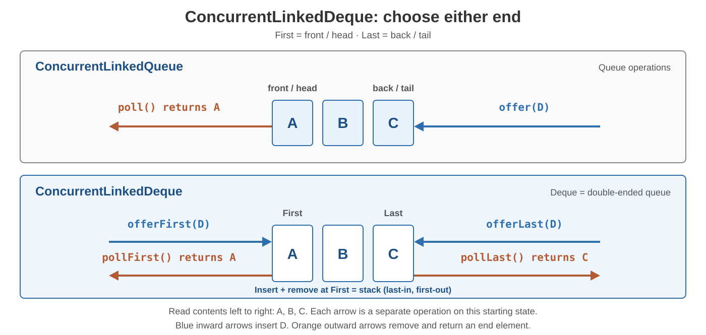

# Concurrency. ConcurrentLinkedDeque

<sub>[Back to Java](../Readme.md#content)</sub>

# Front

When would you choose Java's `ConcurrentLinkedDeque` over `ConcurrentLinkedQueue`, and how do the ends you use determine removal order?

# Back

**`ConcurrentLinkedDeque` was introduced in Java 7 as a thread-safe double-ended queue (deque).**

Compared with [`ConcurrentLinkedQueue`](../Concurrency.%20ConcurrentLinkedQueue/Readme.md), it adds insertion, inspection, and removal at **either end**. Choose it for front insertion, back removal, or a shared stack. For first-in, first-out (FIFO) work, prefer the queue's narrower API: it offers no front-insertion or back-removal methods, making the intended order harder to misuse.

## Choose the end

**First** means front/head; **Last** means back/tail. The arrows show where insertion and removal happen; A, B, C show the current order from front to back.



- **FIFO:** insert with `offerLast`, remove with `pollFirst` — oldest first.
- **Stack:** insert with `offerFirst`, remove with `pollFirst` — last-in, first-out (LIFO), newest first.

**Both remove from the front; only the insertion end changes.** These orders assume you consistently use the stated pair.

## Two method families

Choose a failure policy, then append `First` or `Last` to each method stem below: for example, `offerLast(e)` or `getFirst()`.

| Family | Insert | Remove and return | Inspect without removing |
| --- | --- | --- | --- |
| Return a failure value | `offer` → `false` if full | `poll` → `null` if empty | `peek` → `null` if empty |
| Throw when full/empty | `add` | `remove` | `get` |

Here the deque is **unbounded**: `offer` never returns `false`, and `add` never throws for capacity. Empty removal/inspection in the throwing family raises `NoSuchElementException`. Both insertion families reject `null` with `NullPointerException`.

Stack aliases belong to the throwing family: `push(e)` = `addFirst(e)`, `pop()` = `removeFirst()`. Queue aliases: `offer(e)` = `offerLast(e)`, `poll()` = `pollFirst()`, `peek()` = `peekFirst()`.

## Example: urgent work at the front

This complete example runs sequentially:

```java
import java.util.concurrent.ConcurrentLinkedDeque;

public class DequeExample {
    public static void main(String[] args) {
        var work = new ConcurrentLinkedDeque<String>();
        work.offerLast("A");
        work.offerLast("B");
        work.offerFirst("urgent"); // [urgent, A, B]

        System.out.println(work.pollFirst()); // urgent
        System.out.println(work.pollLast());  // B
        System.out.println(work.poll());      // A
        System.out.println(work.pollFirst()); // null
    }
}
```

Neither method family waits for work or space. See the linked queue card for the shared concurrency caveats.

# Sources

- [Java SE 25 — `ConcurrentLinkedDeque`: introduction, concurrency contract, and methods](https://docs.oracle.com/en/java/javase/25/docs/api/java.base/java/util/concurrent/ConcurrentLinkedDeque.html)
- [Java SE 25 — `Deque`: FIFO, stack order, and method aliases](https://docs.oracle.com/en/java/javase/25/docs/api/java.base/java/util/Deque.html)
- [Java SE 25 — `ConcurrentLinkedQueue`: FIFO and shared properties](https://docs.oracle.com/en/java/javase/25/docs/api/java.base/java/util/concurrent/ConcurrentLinkedQueue.html)
