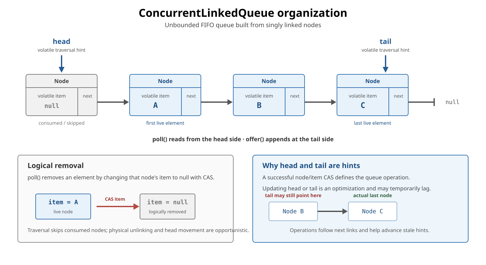
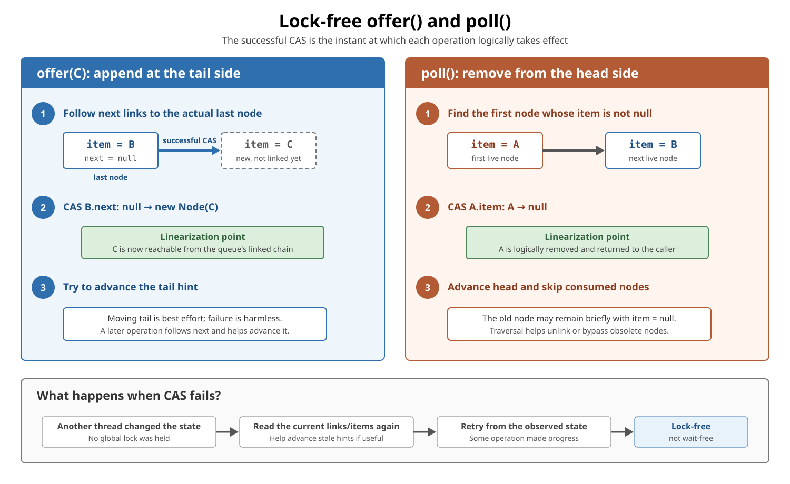

# ConcurrentLinkedQueue

## Front

How does `ConcurrentLinkedQueue` work, what guarantees does it provide, and when should it be used?

## Back

**ConcurrentLinkedQueue** was introduced in **Java 5 (JDK 1.5)** as an unbounded, thread-safe, non-blocking FIFO queue.

Use it when many threads must add and remove elements concurrently and an empty consumer should return immediately. It does **not** wait for elements, enforce a capacity, or provide backpressure. The first diagram explains its linked-node model; the second shows where `offer()` and `poll()` logically take effect.

## Mental model

`ConcurrentLinkedQueue<E>` is a shared line:

- `offer(e)` appends `e` at the **tail**.
- `poll()` removes and returns the **head**, or returns `null` when empty.
- `peek()` returns the head without removing it, or returns `null` when empty.
- Producers and consumers coordinate without one lock around the whole queue.

| Property | Meaning |
|---|---|
| Order | FIFO: the longest-waiting element is removed first |
| Capacity | Unbounded; producers can outrun consumers |
| Empty retrieval | `poll()` returns `null` immediately |
| `null` elements | Forbidden, so `null` unambiguously means “empty” |
| Progress | Non-blocking/lock-free algorithm; not wait-free |
| Iterator | Weakly consistent, not a frozen snapshot |
| `size()` | O(n) traversal and possibly inaccurate during changes |

This complete example uses the basic API:

```java
import java.util.concurrent.ConcurrentLinkedQueue;

public final class ConcurrentLinkedQueueBasics {
    public static void main(String[] args) {
        ConcurrentLinkedQueue<String> queue =
                new ConcurrentLinkedQueue<>();

        queue.offer("A");
        queue.offer("B");

        System.out.println(queue.peek()); // A; A remains queued
        System.out.println(queue.poll()); // A
        System.out.println(queue.poll()); // B
        System.out.println(queue.poll()); // null; no waiting
    }
}
```

Because the queue is unbounded, `offer(e)` returns `true`; `offer(null)` throws `NullPointerException`.

## Linked-node organization



Conceptually, live elements occupy a singly linked chain:

```text
head side → A → B → C → null ← tail side
             poll()      offer()
```

In the current OpenJDK implementation, a node is approximately:

```java
// Conceptual fragment based on the OpenJDK implementation.
final class Node<E> {
    volatile E item;
    volatile Node<E> next;
}
```

The queue also has volatile `head` and `tail` references. These references are **traversal hints**:

- `head` may point to a node whose element has already been removed.
- `tail` may lag behind the actual final node.
- Operations follow `next` links and can help advance stale hints.
- A live element remains reachable even while hints are being updated.

Allowing a hint to lag avoids an extra contested update on every operation. These details explain the current OpenJDK implementation; they are not public fields or application-level API promises.

## Compare-and-set (CAS)

CAS is one atomic conditional update:

```text
if current value == expected value:
    replace it with the new value and succeed
else:
    leave it unchanged and fail
```

A failed CAS means the observed state changed before this thread could update it. The operation rereads the structure and retries. It does not mean that the queue is corrupted.

## How `offer()` and `poll()` take effect



In the current OpenJDK implementation, `offer(element)`:

1. Rejects `null` and creates a node.
2. Follows links from the `tail` hint to the actual last node.
3. CASes that node's `next` from `null` to the new node.
4. May then try to move the `tail` hint.

The successful `next` CAS is the **linearization point**: the single logical instant when the element joins the queue. A later failure to move `tail` does not undo the insertion.

`poll()`:

1. Starts near `head` and skips nodes whose `item` is already `null`.
2. Finds the first live item.
3. CASes that `item` from the element to `null`.
4. Returns the removed element and may advance `head` or bypass obsolete nodes.

The successful `item` CAS is the removal's linearization point. Setting `item` to `null` is **logical removal**; physical cleanup may happen later. If no live item exists, `poll()` returns `null` immediately.

## FIFO during concurrent offers

FIFO applies to the queue's established insertion order, not to which method call happened to start first.

```text
Producer A starts offer(A)
Producer B starts offer(B)

If B successfully links first, the queue order is B, then A.
poll() still removes them in that established FIFO order.
```

Concurrent operations appear to take effect at their linearization points. Overlapping calls may be ordered either way when both results are legal.

## What “lock-free” does—and does not—mean

`ConcurrentLinkedQueue` is based on the Michael–Scott non-blocking queue algorithm. Under contention, one thread can lose a CAS because another operation changed the state. The loser retries, while the successful change demonstrates system-wide progress.

Lock-free does **not** mean:

- every individual thread finishes within a fixed number of steps;
- retries or starvation are impossible;
- allocation, scheduling, or garbage collection cannot pause a thread;
- `poll()` waits until an element appears.

It is lock-free, but not wait-free. “Non-blocking algorithm” is a progress property, not a promise that every call has zero latency.

## Empty means “nothing available now”

This check-then-act code is racy:

```java
// Conceptual fragment: another consumer can win after isEmpty().
if (!queue.isEmpty()) {
    return queue.poll(); // can still return null
}
```

Use the atomic queue operation directly and handle its result:

```java
// Conceptual fragment.
var task = queue.poll();
if (task != null) {
    process(task);
}
```

The same rule applies to `peek()` followed by `poll()`: another consumer can remove the observed head between the calls.

## Weakly consistent iteration

An iterator can run while the queue changes. It:

- does not throw `ConcurrentModificationException` merely because of concurrent modification;
- returns elements in queue order among the elements it observes;
- returns exactly once each element that remained in the queue from iterator creation onward;
- may also reflect some later insertions or removals;
- is not a frozen snapshot of one instant.

```java
// Conceptual fragment: concurrent offer/poll calls may overlap this loop.
for (String value : queue) {
    process(value);
}
```

Use separate synchronization or copy to a stable representation when a precise point-in-time view is required.

## `size()` is not coordination

`size()` traverses the linked nodes, so it is O(n). If the queue changes during traversal, the result can be inaccurate and can become stale immediately.

Do not use it to implement a capacity limit:

```java
// Wrong: several producers can all observe the same old size.
if (queue.size() < limit) {
    queue.offer(task);
}
```

Use a bounded `BlockingQueue` or another explicit admission-control mechanism when capacity matters. Even `isEmpty()` is only an observation; use `poll()` for “try to remove now.”

## Safe handoff and memory visibility

The concurrent-collection memory guarantee is:

```text
producer actions before queue.offer(message)
                    happen-before
consumer actions after accessing/removing that message
```

Therefore, fields initialized before publication through the queue are visible to a consumer that receives that same element.

The queue safely transfers the **reference**. It does not make later unsynchronized mutation of the referenced object safe. Prefer immutable messages or synchronize later shared changes separately.

## Bulk and search operations

`addAll`, `removeIf`, `forEach`, and similar multi-element operations are not guaranteed to be one atomic transaction. A concurrent traversal can observe only part of a bulk change.

Operations such as `contains`, `remove(Object)`, and `size` traverse nodes. They are useful occasionally, but frequent arbitrary search/removal is not the queue's strength; its core use is tail insertion plus head removal.

## When to choose it

Choose `ConcurrentLinkedQueue` when:

- many threads share a FIFO queue;
- producers and consumers should not wait inside the queue;
- `poll()` returning `null` is a useful “nothing available now” result;
- unbounded growth is acceptable and controlled elsewhere.

Choose something else when:

| Requirement | Better fit |
|---|---|
| Consumer should wait for work | `BlockingQueue`, using `take()` or timed `poll()` |
| Bounded capacity/backpressure | `ArrayBlockingQueue` or bounded `LinkedBlockingQueue` |
| Non-blocking access at both ends | `ConcurrentLinkedDeque` |
| Frozen traversal view | Make and coordinate an explicit snapshot |

An unbounded thread-safe queue can still exhaust memory if producers continually outpace consumers. Thread safety is not backpressure.

## Quick recall

> `ConcurrentLinkedQueue` is an unbounded concurrent FIFO queue. `offer()` links at the tail; `poll()` removes from the head or immediately returns `null`. Current OpenJDK uses linked nodes and retrying CAS, with `head` and `tail` allowed to lag as hints. Iteration is weakly consistent, `size()` is O(n) and unsuitable for coordination, and publication through the queue provides a happens-before handoff. Use a `BlockingQueue` instead when consumers must wait or capacity must be bounded.

## Sources

- [Java SE 26 `ConcurrentLinkedQueue` API](https://docs.oracle.com/en/java/javase/26/docs/api/java.base/java/util/concurrent/ConcurrentLinkedQueue.html)
- [OpenJDK `ConcurrentLinkedQueue.java` source](https://github.com/openjdk/jdk/blob/master/src/java.base/share/classes/java/util/concurrent/ConcurrentLinkedQueue.java)
- [Java SE 26 `java.util.concurrent` package summary — memory consistency](https://docs.oracle.com/en/java/javase/26/docs/api/java.base/java/util/concurrent/package-summary.html#MemoryVisibility)
- [Java SE 26 `BlockingQueue` API](https://docs.oracle.com/en/java/javase/26/docs/api/java.base/java/util/concurrent/BlockingQueue.html)
- [Michael and Scott — non-blocking concurrent queue algorithm](https://www.cs.rochester.edu/research/synchronization/pseudocode/queues.html)
