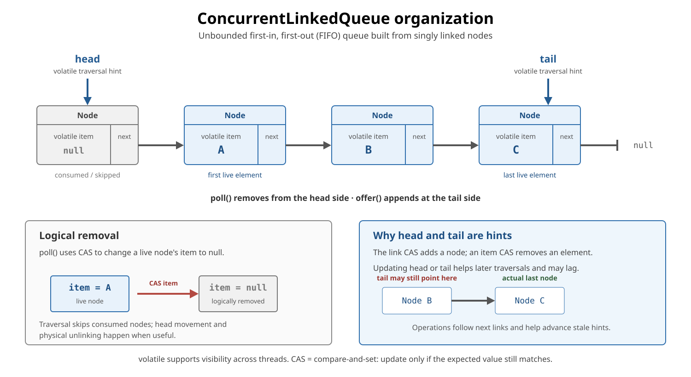
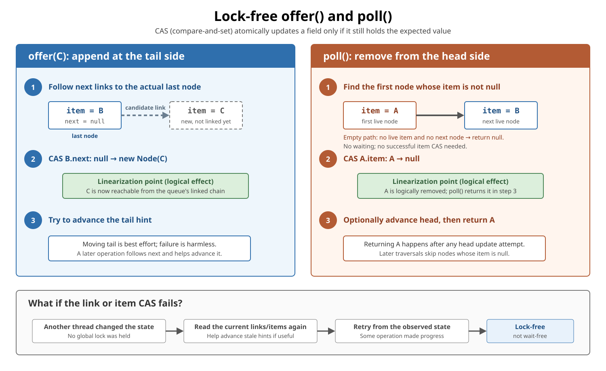

# ConcurrentLinkedQueue

<sub>[Back to Java](../Readme.md#content)</sub>

**`ConcurrentLinkedQueue` was introduced in Java 5 (JDK 1.5) as an unbounded, thread-safe, non-blocking first-in, first-out (FIFO) queue.**

Use it when many threads must add and remove elements concurrently, and retrieval should return without waiting for more work. It does **not** enforce a capacity or provide **backpressure**: a way to slow or reject incoming work when consumers cannot keep up. The first diagram explains its linked-node model; the second shows where `offer()` and `poll()` logically take effect.

## Mental model

`ConcurrentLinkedQueue<E>` is a shared line. **Producers** add elements; **consumers** retrieve them:

- `offer(e)` appends `e` at the **tail**.
- `poll()` removes and returns the **head**, or returns `null` when empty.
- `peek()` returns the head without removing it, or returns `null` when empty.
- Producers and consumers coordinate without one lock around the whole queue.

| Property | Meaning |
|---|---|
| Order | FIFO: the longest-waiting element is removed first |
| Capacity | Unbounded; producers can outrun consumers |
| Empty retrieval | `poll()` returns `null` immediately |
| `null` elements | Forbidden, so `null` unambiguously means “empty” |
| Progress | Non-blocking/lock-free algorithm; not wait-free |
| Iterator | Weakly consistent, not a frozen snapshot |
| `size()` | Traverses the queue; possibly inaccurate during changes |

This complete example uses the basic API:

```java
import java.util.concurrent.ConcurrentLinkedQueue;

public final class ConcurrentLinkedQueueBasics {
    public static void main(String[] args) {
        ConcurrentLinkedQueue<String> queue =
                new ConcurrentLinkedQueue<>();

        queue.offer("A");
        queue.offer("B");

        System.out.println(queue.peek()); // A; A remains queued
        System.out.println(queue.poll()); // A
        System.out.println(queue.poll()); // B
        System.out.println(queue.poll()); // null; no waiting
    }
}
```

Because the queue is unbounded, `offer(e)` returns `true`; `offer(null)` throws `NullPointerException`.

## Linked-node organization

Each **node** holds an element reference in `item` and a link to another node in `next`. A **live** node still contains an element. In the OpenJDK implementation, these fields are `volatile`: writes provide visibility to subsequent reads in other threads. This does not make a sequence such as “check, then update” atomic.

Updates use **compare-and-set (CAS)**, an atomic “replace only if the expected value is still present” operation, explained below. In the diagram, follow `next` from left to right. The gray node has no live element, so retrieval skips it; the blue nodes contain A, B, and C.



Conceptually, live elements occupy a singly linked chain. The tail side is at C; the final `null` means there is no next node:

```text
head side → A → B → C → null
           ↑       ↑
         poll()  offer() appends after C
```

In the current OpenJDK implementation, a node is approximately:

```java
// Conceptual fragment based on the OpenJDK implementation.
final class Node<E> {
    volatile E item;
    volatile Node<E> next;
}
```

The queue also has volatile `head` and `tail` references. These references are **traversal hints**:

- `head` may point to a node whose element has already been removed.
- `tail` may lag behind the actual final node.
- Operations follow `next` links and can help advance stale hints.
- A live element remains reachable even while hints are being updated.

Allowing a hint to lag avoids an extra contested update on every operation. These details explain the current OpenJDK implementation; they are not public fields or application-level API promises.

## Why compare-and-set is needed

CAS performs the comparison and update as one indivisible operation. For these object references, the comparison checks reference identity, not `equals()`:

```text
if current value == expected value:
    replace it with the new value and succeed
else:
    leave it unchanged and fail
```

A failed CAS on a link or item means the expected value is no longer present. The operation rereads the structure and retries; the queue is not corrupted. Best-effort updates of the `head` and `tail` hints are separate: their failure does not undo an already completed insertion or logical removal.

## How `offer()` and `poll()` take effect

A **linearization point** is the single logical instant when an operation takes effect within its method call. Read each diagram panel from top to bottom: a node is found, its link or item is changed atomically, and a hint may be advanced before the method returns.



In the current OpenJDK implementation, `offer(element)`:

1. Rejects `null` and creates a node.
2. Follows links from the `tail` hint to the actual last node.
3. CASes that node's `next` from `null` to the new node.
4. May then try to move the `tail` hint.

The successful `next` CAS is the insertion's linearization point. A later failure to move `tail` does not undo the insertion.

`poll()`:

1. Starts near `head` and skips nodes whose `item` is already `null`.
2. Finds the first live item.
3. CASes that `item` from the element to `null`.
4. May advance `head` past obsolete nodes, then returns the removed element.

The successful `item` CAS is the removal's linearization point. Setting `item` to `null` is **logical removal**; physical cleanup may happen later. Logical removal happens before the caller receives the return value. Another consumer can already move on to the next element during that gap.

If traversal finds no live item before reaching the end, `poll()` returns `null` without waiting for a producer. This empty result does not require a successful item CAS.

## FIFO during concurrent offers

FIFO applies to the queue's established insertion order, not to which method call happened to start first.

```text
Producer A starts offer(A)
Producer B starts offer(B)

If B successfully links first, the queue order is B, then A.
poll() still removes them in that established FIFO order.
```

Concurrent operations appear to take effect at their linearization points. Overlapping calls may be ordered either way when both results are legal.

## What “lock-free” does—and does not—mean

`ConcurrentLinkedQueue` is based on the Michael–Scott non-blocking queue algorithm. Under contention, one thread can lose a CAS because another operation changed the state. The loser retries, while the successful change demonstrates system-wide progress.

Lock-free does **not** mean:

- every individual thread finishes within a fixed number of steps;
- retries or starvation are impossible;
- allocation, scheduling, or garbage collection cannot pause a thread;
- `poll()` waits until an element appears.

It is lock-free, but not wait-free. “Non-blocking algorithm” is a progress property, not a promise that every call has zero latency.

## Empty means “nothing available now”

This check-then-act code is racy:

```java
// Conceptual fragment: another consumer can win after isEmpty().
if (!queue.isEmpty()) {
    return queue.poll(); // can still return null
}
```

For example, with only A queued, these calls can interleave:

| Order | Consumer 1 | Consumer 2 | Queue afterward |
|---|---|---|---|
| 1 | `isEmpty()` returns `false` | — | A |
| 2 | — | `poll()` returns A | Empty |
| 3 | `poll()` returns `null` | — | Empty |

The first observation never reserved A for Consumer 1.

Use the atomic queue operation directly and handle its result:

```java
// Conceptual fragment.
var task = queue.poll();
if (task != null) {
    process(task);
}
```

The same rule applies to `peek()` followed by `poll()`: another consumer can remove the observed head between the calls.

A `null` result also does not mean that producers have finished. A producer may enqueue work immediately afterward.

## Weakly consistent iteration

An iterator can run while the queue changes. It:

- does not throw `ConcurrentModificationException` merely because of concurrent modification;
- returns elements in queue order among the elements it observes;
- returns exactly once each element that remained in the queue from iterator creation onward;
- may also reflect some later insertions or removals;
- is not a frozen snapshot of one instant.

```java
// Conceptual fragment: concurrent offer/poll calls may overlap this loop.
for (String value : queue) {
    System.out.println(value); // inspect; do not claim work
}
```

This loop **does not remove or reserve elements**. Processing work this way can duplicate a consumer's work: a consumer may also obtain the same element through `poll()`. Use `poll()` to claim an element for consumption.

Copying with `toArray()` gives a separate array, but its elements may have been observed at different times during the copy. That is not a guaranteed snapshot of one instant.

For an exact snapshot of queue membership and order, coordinate **all queue mutations** while copying, for example through an external lock shared by every mutator and the snapshot operation. Locking only the copying thread does not stop ordinary queue operations. The copy also retains references to the same objects; it does not freeze their fields.

## `size()` is not coordination

`size()` traverses the linked nodes, so it is O(n): its work grows with the queue's length instead of reading a maintained count. If the queue changes during traversal, the result can be inaccurate and can become stale immediately.

Do not use it to implement a capacity limit:

```java
// Wrong: several producers can all observe the same old size.
if (queue.size() < limit) {
    queue.offer(task);
}
```

Use a bounded `BlockingQueue` or another explicit admission-control mechanism when capacity matters. Even `isEmpty()` is only an observation; use `poll()` for “try to remove now.”

## Safe handoff and memory visibility

**Publication** here means making an object available to another thread through the queue. The **happens-before** guarantee ensures that a consumer accessing or removing that element can see the producer's earlier writes:

```text
producer actions before queue.offer(message)
                    happen-before
consumer actions after accessing/removing that message
```

This complete example uses an ordinary, non-`volatile` field. The consumer makes one retrieval attempt:

```java
import java.util.concurrent.ConcurrentLinkedQueue;

public final class ConcurrentLinkedQueueHandoff {
    static final class Message {
        int answer;
    }

    public static void main(String[] args) throws InterruptedException {
        ConcurrentLinkedQueue<Message> queue = new ConcurrentLinkedQueue<>();

        Thread producer = new Thread(() -> {
            Message message = new Message();
            message.answer = 42;
            queue.offer(message);
        });

        Thread consumer = new Thread(() -> {
            Message message = queue.poll();
            if (message == null) {
                System.out.println("Nothing available yet");
            } else {
                System.out.println(message.answer); // 42, never the default 0
            }
        });

        producer.start();
        consumer.start();
        producer.join();
        consumer.join();
    }
}
```

The output is either `Nothing available yet` or `42`, depending on when the consumer polls. Starting the producer first does not ensure it has already offered the message. If the consumer retrieves it, the queue handoff guarantees visibility of `answer = 42`. The `join()` calls let `main` wait for both threads; the consumer does not wait for the producer. If the consumer runs too early, this one-attempt example leaves the later message queued.

The queue safely transfers the **reference**, but it does not protect later shared changes to the object. If the producer adds `message.answer = 43` after `queue.offer(message)`, that later write is outside the handoff guarantee and can race with the consumer's read. Do not rely on the consumer seeing `43`. Prefer immutable messages, or coordinate later shared changes separately.

## Bulk and search operations

`addAll`, `removeIf`, `forEach`, and similar multi-element operations are not guaranteed to be one atomic transaction. A concurrent traversal can observe only part of a bulk change.

Operations such as `contains`, `remove(Object)`, and `size` traverse nodes. They are useful occasionally, but frequent arbitrary search/removal is not the queue's strength; its core use is tail insertion plus head removal.

## When to choose it

Choose `ConcurrentLinkedQueue` when:

- many threads share a FIFO queue;
- producers and consumers should not wait inside the queue;
- `poll()` returning `null` is a useful “nothing available now” result;
- unbounded growth is acceptable and controlled elsewhere.

Choose something else when:

| Requirement | Better fit |
|---|---|
| Consumer should wait for work | `BlockingQueue`, using `take()` or timed `poll()` |
| Bounded capacity/backpressure | `ArrayBlockingQueue` or bounded `LinkedBlockingQueue` |
| Non-blocking access at both ends | `ConcurrentLinkedDeque` |
| Exact snapshot of queue membership | Coordinate all mutations while copying |

An unbounded thread-safe queue can still exhaust memory if producers continually outpace consumers. Thread safety is not backpressure.

## Quick recall

Predict each result before revealing the answers:

1. Only A is queued. Consumer 1 sees `isEmpty() == false`; Consumer 2 then polls A. What does Consumer 1's `poll()` return?
2. Two producers overlap. Producer A starts first, but Producer B links its node first. Which element is ahead?
3. Does a `for` loop over the queue remove or reserve the elements it visits?
4. Why can't `if (queue.size() < limit) queue.offer(task)` enforce a capacity limit?
5. Does lock-free guarantee that each individual thread finishes within a bounded number of steps?
6. In the handoff example, can a consumer that retrieves the message print `0`? Is an added write of `43` after `offer()` covered by the same guarantee?
7. Does copying a queue while it changes guarantee a snapshot of one instant?

<details>
<summary>Show answers</summary>

1. `null`, assuming no new insertion. The earlier check did not reserve A.
2. B. FIFO follows the established insertion order of overlapping offers.
3. Neither. Iteration observes elements; `poll()` removes an element for consumption.
4. The size observation and insertion are separate operations. Several producers can pass the check, and the count can already be stale.
5. No. Lock-free guarantees system-wide progress; wait-free would guarantee bounded completion for each operation. A particular thread can keep losing retries here.
6. It must print `42` in the original example. The prior write is visible through the handoff; a later unsynchronized write of `43` is outside that guarantee.
7. No. A copy can combine observations made at different times; an exact membership snapshot requires coordinated mutations.

</details>

# Sources

- [Java SE 26 `ConcurrentLinkedQueue` API](https://docs.oracle.com/en/java/javase/26/docs/api/java.base/java/util/concurrent/ConcurrentLinkedQueue.html)
- [OpenJDK `ConcurrentLinkedQueue.java` source](https://github.com/openjdk/jdk/blob/master/src/java.base/share/classes/java/util/concurrent/ConcurrentLinkedQueue.java)
- [Java SE 26 `java.util.concurrent` package summary — memory consistency](https://docs.oracle.com/en/java/javase/26/docs/api/java.base/java/util/concurrent/package-summary.html#MemoryVisibility)
- [Java SE 26 `BlockingQueue` API](https://docs.oracle.com/en/java/javase/26/docs/api/java.base/java/util/concurrent/BlockingQueue.html)
- [Michael and Scott — non-blocking concurrent queue algorithm](https://www.cs.rochester.edu/research/synchronization/pseudocode/queues.html)
