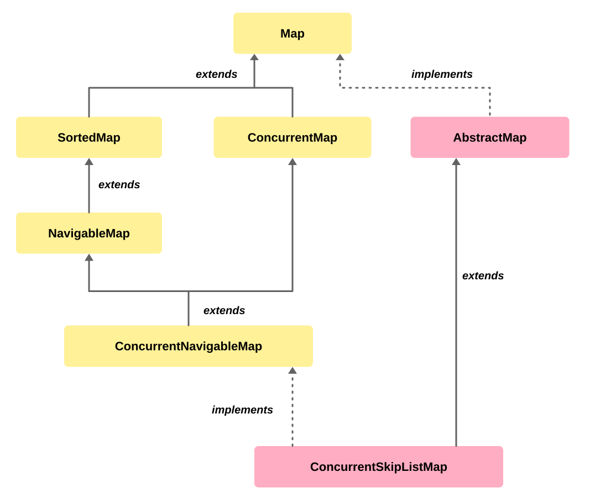
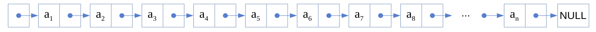
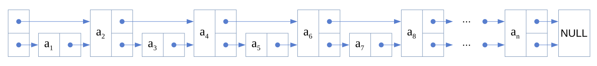
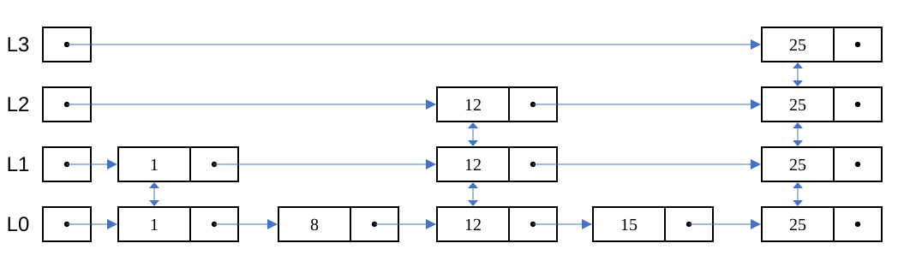

# ConcurrentSkipListMap

<sub>[Back to Java](../Readme.md#content)</sub>

**`ConcurrentSkipListMap` was introduced in Java 6 (JDK 1.6).**

`ConcurrentSkipListMap<K, V>` is a thread-safe map that keeps its **keys sorted** and supports finding nearby keys and ranges. Choose it when several threads share an ordered index: for example, events indexed by time, where readers need both a particular event and all events within an interval.

Its core model is a sorted linked list with shortcut layers above it. The article starts with the class hierarchy and skip-list search, then covers ordering, navigation, live range views, concurrency guarantees, and choosing a map. API details and implementation notes use **JDK 25** as a fixed reference; the complete programs below also run on JDK 25.

## 1. What the interfaces mean

A **mapping** associates one key with one value. `K` names the key type and `V` the value type. Sorting applies to keys, regardless of insertion order or the order of the values.

| Interface | Capability it contributes |
| --- | --- |
| `Map` | Associate keys with values using operations such as `get` and `put` |
| `SortedMap` | Keep keys ordered using natural order or a comparator |
| `NavigableMap` | Find neighboring keys and select bounded ranges |
| `ConcurrentMap` | Provide thread-safe access and atomic conditional updates |
| `ConcurrentNavigableMap` | Combine concurrency with navigation, including concurrent range views |

Read the hierarchy upward: solid arrows mean `extends`, and dotted arrows mean `implements`. The two classes are `AbstractMap`, an abstract class, and `ConcurrentSkipListMap`, a concrete class; all other named boxes are interfaces. Interfaces are yellow and classes are pink. `ConcurrentSkipListMap` inherits from `AbstractMap` and implements `ConcurrentNavigableMap`.



This is the source article's simplified hierarchy. In JDK 25, `SortedMap` extends `SequencedMap`, which extends `Map`; the diagram omits that intermediate interface. It also omits the class's `Cloneable` and `Serializable` marker interfaces.

## 2. Why a skip list has several levels

### A linked list visits one node at a time

A **node** stores data and a link to another node. In this first diagram, `a₁` through `aₙ` represent sorted keys. Each dot is the origin of a pointer, and the arrow leads to the next node. The leftmost box is a starting node; `NULL` means there is no next node. The ellipsis hides additional nodes.



Searching a plain linked list may require visiting every node. With `n` nodes, that is O(n) work in the worst case.

### Shortcuts bypass intermediate nodes

An extra layer can connect selected nodes directly. The lower links still reach every key, but the upper links in this illustration jump over alternate keys.



Jumping over alternate keys reduces a search across the list to about n/2 visits: roughly half the work, but n/2 still grows linearly with n. The larger improvement comes from having multiple, increasingly sparse shortcut layers.

### Upper levels guide the search toward the target

Here `L0` is the base layer containing every key. `L1`, `L2`, and `L3` contain progressively fewer **index nodes**: extra nodes that provide shortcuts to positions in the sorted base list. Horizontal arrows move toward larger keys; vertical arrows associate copies of a key across levels.



To locate `15`, begin at the upper-left head at `L3`. The jump to `25` would overshoot, so descend to the head at `L2`. Advance to `12`; its next key is `25`, so descend **from `12` to `12` at `L1`**. At `L1`, the next key is still `25`, so descend from `12` again, this time to `L0`. Now follow the next link to `15`. At every level, compare before moving right; descend when the next jump would overshoot. There is no need to inspect `1` or `8` along the base list.

This is a conceptual drawing, not an exact layout of OpenJDK objects. OpenJDK 25 separates data nodes from index nodes, whose links point right and down. The picture's two-headed vertical arrows do not imply that the implementation stores upward links.

Real skip lists choose index heights probabilistically. They do not require every second or fourth key to appear at a particular level. Increasingly sparse levels usually let a search cover large distances with few jumps, then refine its position at lower levels. Random selection does not guarantee equally useful shortcuts in every layout. The API promises **expected average O(log n)** work for `containsKey`, `get`, `put`, `remove`, and their variants. It does not promise worst-case logarithmic latency for every call.

## 3. Creating a map and choosing its order

**Natural order** comes from a key's `Comparable` implementation, such as ascending order for integers. A **comparator** supplies another comparison rule, such as descending integer order.

There are four constructors:

| Constructor argument | Resulting order |
| --- | --- |
| No argument | Natural key order |
| `Comparator<? super K>` | The supplied comparator; `null` selects natural order |
| `Map<? extends K, ? extends V>` | Natural key order, even if the source object happens to be sorted |
| `SortedMap<K, ? extends V>` | The source sorted map's order |

The following complete program shows that key order overrides insertion order: keys inserted as `30`, `10`, `20` are printed as `10`, `20`, `30`. It also demonstrates reverse order and the important difference between the two copy constructors:

```java
import java.util.Comparator;
import java.util.Map;
import java.util.SortedMap;
import java.util.TreeMap;
import java.util.concurrent.ConcurrentSkipListMap;

public class SkipListOrdering {
    public static void main(String[] args) {
        var natural = new ConcurrentSkipListMap<Integer, String>();
        natural.put(30, "thirty");
        natural.put(10, "ten");
        natural.put(20, "twenty");
        System.out.println(natural.keySet()); // [10, 20, 30]

        var reverse = new ConcurrentSkipListMap<Integer, String>(
                Comparator.reverseOrder());
        reverse.putAll(natural);
        System.out.println(reverse.keySet()); // [30, 20, 10]

        SortedMap<Integer, String> sorted =
                new TreeMap<>(Comparator.reverseOrder());
        sorted.putAll(natural);
        Map<Integer, String> asMap = sorted;

        var preserveOrder = new ConcurrentSkipListMap<>(sorted);
        var useNaturalOrder = new ConcurrentSkipListMap<>(asMap);
        System.out.println(preserveOrder.keySet());  // [30, 20, 10]
        System.out.println(useNaturalOrder.keySet()); // [10, 20, 30]
    }
}
```

The variables `sorted` and `asMap` refer to the same source object. Their **declared types** select different constructor overloads at compile time, producing two separate maps with different key orders.

All keys must be comparable under the selected ordering. The map treats keys that compare as `0` as the same key. For example, a comparator based only on a person's age would merge different people of the same age into one map key. Include an appropriate tie-breaker when those people must remain distinct, and keep the comparison consistent with `equals` to satisfy the ordinary `Map` contract.

Neither keys nor stored values may be `null`; attempts to insert them throw `NullPointerException`. A missing mapping can therefore be represented unambiguously by `get(key) == null`.

## 4. Finding neighboring keys

The four neighbor methods differ in whether equality is allowed. For a naturally ordered map with keys `10`, `20`, and `40`:

| Method | Which neighbor? | Query `20` | Query `30` |
| --- | --- | --- | --- |
| `lowerKey(k)` | Greatest key strictly below `k` | `10` | `20` |
| `floorKey(k)` | Greatest key at or below `k` | `20` | `20` |
| `ceilingKey(k)` | Least key at or above `k` | `20` | `40` |
| `higherKey(k)` | Least key strictly above `k` | `40` | `40` |

If the query is absent, `lowerKey` agrees with `floorKey`, and `ceilingKey` agrees with `higherKey`. If no qualifying key exists, the result is `null`. The corresponding `lowerEntry`, `floorEntry`, `ceilingEntry`, and `higherEntry` methods return a key-value pair instead of just its key.

All these comparisons follow the **map's comparator**. `firstKey()` returns the first key in that order. For integer keys `10`, `20`, and `40` in a reverse-ordered map, `firstKey()` returns `40`, and `higherKey(20)` returns `10`: “higher” means later in the map's order, which here is numerically smaller.

This complete program also shows the distinction between observing and removing an entry:

```java
import java.util.concurrent.ConcurrentSkipListMap;

public class SkipListNavigation {
    public static void main(String[] args) {
        var events = new ConcurrentSkipListMap<Integer, String>();
        events.put(10, "start");
        events.put(20, "checkpoint");
        events.put(40, "finish");

        System.out.println(events.floorEntry(30));   // 20=checkpoint
        System.out.println(events.ceilingEntry(30)); // 40=finish
        System.out.println(events.lowerKey(10));     // null
        System.out.println(events.firstKey());       // 10
        System.out.println(events.lastKey());        // 40

        System.out.println(events.pollFirstEntry()); // 10=start; removed
        System.out.println(events.pollLastEntry());  // 40=finish; removed
        System.out.println(events);                  // {20=checkpoint}
    }
}
```

On an empty map, `firstKey()` and `lastKey()` throw `NoSuchElementException`. `firstEntry()`, `lastEntry()`, `pollFirstEntry()`, and `pollLastEntry()` instead return `null`.

Use `pollFirstEntry()` to remove and obtain the first mapping in one operation. Reading `firstEntry()` and later calling `remove()` leaves a gap in which another thread can change that mapping.

## 5. Range views remain connected to the map

A **backed view** is another way to access the same underlying mappings. Creating it does not copy those mappings.

| Expression | Included keys in natural order |
| --- | --- |
| `headMap(20)` | `key < 20` |
| `headMap(20, true)` | `key <= 20` |
| `tailMap(20)` | `key >= 20` |
| `tailMap(20, false)` | `key > 20` |
| `subMap(10, 40)` | `10 <= key < 40` |
| `subMap(10, false, 40, true)` | `10 < key <= 40` |

Changes through a range view change the original map. Changes to the original map appear in the view when their keys fall within its bounds. Inserting an out-of-range key through the view throws `IllegalArgumentException`.

By contrast, an individual `Map.Entry` returned by this map records the mapping as observed when that entry was produced. It does not track later replacement of the value. This program demonstrates both behaviors:

```java
import java.util.Map;
import java.util.concurrent.ConcurrentNavigableMap;
import java.util.concurrent.ConcurrentSkipListMap;

public class SkipListViews {
    public static void main(String[] args) {
        var events = new ConcurrentSkipListMap<Integer, String>();
        events.put(10, "start");
        events.put(20, "checkpoint");
        events.put(40, "finish");

        ConcurrentNavigableMap<Integer, String> window =
                events.subMap(10, true, 40, false);
        Map.Entry<Integer, String> observed = events.floorEntry(20);

        events.put(20, "updated");
        System.out.println(window.get(20));     // updated: live view
        System.out.println(observed.getValue()); // checkpoint: old entry

        window.remove(10);
        System.out.println(events.containsKey(10)); // false

        events.put(30, "extra");
        System.out.println(window); // {20=updated, 30=extra}
        System.out.println(events.descendingKeySet()); // [40, 30, 20]
    }
}
```

Calling `observed.setValue(...)` throws `UnsupportedOperationException`; use map methods such as `put` or `replace` to update a mapping. The snapshot entry still contains object references, not deep copies: it does not freeze the fields of a mutable value object.

`keySet`, `values`, `entrySet`, and `descendingMap` are also backed views. In particular, **a live `entrySet` can produce snapshot entries**. These are different levels of behavior, not a contradiction.

## 6. Thread safety and atomic updates

An **atomic operation** takes effect as one indivisible map update. Thread safety does not combine several method calls into one transaction.

For example, this conceptual fragment contains a check-then-act race:

```java
// Wrong when several threads can insert the same key.
if (!map.containsKey(key)) {
    map.put(key, value);
}
```

Two threads can both observe an absent key and then overwrite each other. Use the operation that expresses the whole condition:

| Operation | Atomic condition and action |
| --- | --- |
| `putIfAbsent(k, v)` | Insert only if `k` is absent; return the existing value, or `null` if inserted |
| `remove(k, expected)` | Remove only if the current value equals `expected`; return success |
| `replace(k, expected, next)` | Replace only if the current value equals `expected`; return success |
| `replace(k, next)` | Replace only an existing mapping; return its previous value, or `null` |

The `compute` family and `merge` can update a mapping based on its current value. Their callbacks must tolerate concurrency: **do not rely on exactly-once callback execution**. For example, two callers of `computeIfAbsent` can both calculate candidates, and retrying a `merge` can reapply its function. Keep callbacks free of external side effects such as sending an email or charging a payment.

This complete example uses `merge` to count updates without losing increments:

```java
import java.util.concurrent.ConcurrentSkipListMap;

public class SkipListConcurrentCounts {
    public static void main(String[] args) throws InterruptedException {
        var counts = new ConcurrentSkipListMap<String, Integer>();

        Runnable increment = () -> {
            for (int i = 0; i < 1_000; i++) {
                counts.merge("requests", 1, Integer::sum);
            }
        };

        Thread first = new Thread(increment);
        Thread second = new Thread(increment);
        first.start();
        second.start();
        first.join();
        second.join();

        System.out.println(counts.get("requests")); // 2000
    }
}
```

If the key is absent, `merge` inserts `1`; otherwise, it combines the current count with `1`. `Integer::sum` only calculates a result, so retrying it has no external effect. The `join()` calls ensure the final read occurs after both threads finish.

Replacing the `merge` call with `counts.put("requests", counts.get("requests") + 1)` first fails because the key is absent: `get` returns `null`, and converting it to an `int` for addition throws `NullPointerException`. Even after initializing the count to `0` before starting the threads, the separate read and write can lose updates. Both threads can read `0` and each write `1`, recording only one of two increments. Likewise, moving a value between two keys requires an application-level protocol if the whole move must be atomic.

### How OpenJDK coordinates changes

OpenJDK 25 uses **compare-and-set (CAS)**: update a field only if it still contains the expected value. A conflicting change can cause an operation to retry. Data and index links can be maintained without a single monitor locking the entire map.

This is an implementation explanation, not a promise that every call completes within a fixed time. An application's `synchronized (map)` block does not make ordinary calls from other threads acquire that monitor. Any external locking protocol must be followed by every participant it needs to coordinate.

## 7. Iteration is weakly consistent

An iterator can run while other threads update the map without throwing `ConcurrentModificationException`. A full traversal visits each mapping that was present when the iterator was created and remains present and unchanged throughout the traversal **exactly once**, in key order. Unchanged mappings are not arbitrarily skipped or repeated.

Concurrent changes may or may not appear in the traversal. For example, a mapping removed before the iterator reaches it may be skipped; a later insertion may be seen or missed. The iterator is **not a frozen picture of the whole map at one instant**.

Consequently, printing the map, iterating a range, or copying mappings while writers continue is not a guaranteed transactionally consistent report. An exact report requires coordinating the relevant writers and readers. Snapshot `Map.Entry` objects do not turn a traversal into a whole-map snapshot.

Bulk operations such as `putAll` and `clear` are not guaranteed to be atomic as a group. A concurrent reader can observe an intermediate state. Similarly, a `size()` or `isEmpty()` result cannot reserve a slot or guarantee what a later operation will see.

The concurrent map also does not automatically protect later mutations inside stored objects. Prefer immutable values, atomic replacement of values, or separate coordination for their mutable state.

## 8. Choosing between map implementations

| Property | `ConcurrentSkipListMap` | `ConcurrentHashMap` | `TreeMap` |
| --- | --- | --- | --- |
| Main structure | Concurrent skip list | Concurrent hash table | Red-black tree |
| Key order | Natural order or comparator | No sorted-key order | Natural order or comparator |
| Concurrent updates supported directly | Yes | Yes | No |
| Neighbor and range operations | Yes | No | Yes |
| Basic key-operation cost | Expected average O(log n) | Hash-based; no general Big-O bound stated in its API | Guaranteed O(log n) |
| Iteration during changes | Weakly consistent | Weakly consistent | Fail-fast, on a best-effort basis |

Use `ConcurrentSkipListMap` when **both concurrent access and sorted navigation matter**. A time-indexed event store needing `floorEntry(timestamp)` or `subMap(from, to)` is a natural example. If several events may share a timestamp, use a key with a tie-breaker or an appropriately coordinated collection of events as the value; a map holds only one mapping per key.

Use `ConcurrentHashMap` as the starting point for shared exact-key lookup when ordering is unnecessary. Use `TreeMap` for ordered data accessed by one thread, or when all access already participates in a broader application locking protocol. For sorted data shared by many threads, the JDK describes `ConcurrentSkipListMap` as “normally preferable to a synchronized `TreeMap`.” Wrapping a `TreeMap` with synchronization is therefore not the default recommendation for that case.

A performance choice should be measured with the application's key comparisons, contention, and read/write mix; no map is universally faster.

The logarithmic bound is about key-based operations. `containsValue` scans mappings and takes O(n) time. Visiting every entry in a range also requires work proportional to the number visited. The JDK documentation notes that ascending views and iteration are faster than descending ones.

## 9. Check your understanding

1. Why do several increasingly sparse shortcut levels help, and why is the O(log n) bound expected rather than guaranteed for every search?

   <details>
   <summary>Answer</summary>

   Upper levels cover large distances in a few jumps; lower levels refine the search near the target. One layer that skips alternate keys only reduces the work to about n/2, which is still linear. Index heights are chosen probabilistically, so some layouts provide less useful shortcuts than others; logarithmic work is an expected average.

   </details>

2. Does sorting follow insertion order, values, or keys?

   <details>
   <summary>Answer</summary>

   Keys, according to natural order or a comparator.

   </details>

3. A reverse-ordered `TreeMap` is referenced by both `SortedMap<Integer, String> sorted` and `Map<Integer, String> asMap`. Will `new ConcurrentSkipListMap<>(sorted)` and `new ConcurrentSkipListMap<>(asMap)` keep the same order?

   <details>
   <summary>Answer</summary>

   No. The `SortedMap` overload preserves the source comparator, so the first copy stays in reverse order. The `Map` overload uses natural order, so the second copy sorts integers in ascending order. The reference's declared type selects the constructor overload, even though both references point to the same source object.

   </details>

4. With keys `10`, `20`, `40`, how do `floorKey(20)` and `lowerKey(20)` differ?

   <details>
   <summary>Answer</summary>

   `floorKey(20)` returns `20`; `lowerKey(20)` returns `10`.

   </details>

5. Does removing a mapping through `headMap` change the original map?

   <details>
   <summary>Answer</summary>

   Yes. Range views are backed by the map.

   </details>

6. Is a returned entry updated when its mapping is replaced?

   <details>
   <summary>Answer</summary>

   No. The entry retains the references it captured when produced.

   </details>

7. Does `containsKey` followed by `put` become atomic because the map is concurrent?

   <details>
   <summary>Answer</summary>

   No. Use `putIfAbsent` for that condition and update.

   </details>

8. Can a `merge` callback safely assume it runs only once?

   <details>
   <summary>Answer</summary>

   No. A retry can invoke it again; use a calculation without external side effects.

   </details>

9. Does iterating the whole map give an exact snapshot during concurrent writes? What happens to mappings that remain unchanged throughout the traversal?

   <details>
   <summary>Answer</summary>

   No. A full traversal visits mappings present at iterator creation that remain present and unchanged exactly once, but may observe some concurrent changes and miss others. Coordinate writers when an exact snapshot is required.

   </details>

10. Which map would you start with for a shared time index needing range queries, a shared cache needing only exact-key lookup, and an ordered map used by one thread?

    <details>
    <summary>Answer</summary>

    `ConcurrentSkipListMap` for concurrent range queries, `ConcurrentHashMap` for concurrent exact-key lookup without ordering, and `TreeMap` for the single-threaded ordered map. For many threads sharing sorted data, the JDK generally prefers `ConcurrentSkipListMap` over a synchronized `TreeMap`.

    </details>

# Sources

- [HowToDoInJava — Java ConcurrentSkipListMap](https://howtodoinjava.com/java/collections/concurrentskiplistmap/) — requested starting article and diagram provenance; explanations above correct its claims about range views, complexity, and concurrency.
- Original diagrams recreated as SVG: [class hierarchy](https://howtodoinjava.com/wp-content/uploads/2023/04/img-e1681419842511.png), [linked list](https://howtodoinjava.com/wp-content/uploads/2023/04/image-4.png), [shortcut layer](https://howtodoinjava.com/wp-content/uploads/2023/04/image-5.png), [skip-list levels](https://howtodoinjava.com/wp-content/uploads/2022/09/skiplist3-e1681474361934.png). The source's duplicate hierarchy thumbnail is represented by the same SVG; vertical arrowheads in the levels diagram stop at node borders for clarity.
- [Java SE 25 `ConcurrentSkipListMap` API](https://docs.oracle.com/en/java/javase/25/docs/api/java.base/java/util/concurrent/ConcurrentSkipListMap.html)
- [Java SE 25 `NavigableMap` API](https://docs.oracle.com/en/java/javase/25/docs/api/java.base/java/util/NavigableMap.html) — neighboring keys, range bounds, and endpoint operations.
- [Java SE 25 `SortedMap` API](https://docs.oracle.com/en/java/javase/25/docs/api/java.base/java/util/SortedMap.html) — ordering, comparison equality, and the `SequencedMap` hierarchy.
- [Java SE 25 `ConcurrentMap` API](https://docs.oracle.com/en/java/javase/25/docs/api/java.base/java/util/concurrent/ConcurrentMap.html) — atomic conditional updates and callback requirements.
- [Java SE 25 `java.util.concurrent` package](https://docs.oracle.com/en/java/javase/25/docs/api/java.base/java/util/concurrent/package-summary.html) — concurrent collections and weakly consistent traversal.
- [Java SE 25 `ConcurrentHashMap` API](https://docs.oracle.com/en/java/javase/25/docs/api/java.base/java/util/concurrent/ConcurrentHashMap.html) — hash-based concurrent access and iteration.
- [Java SE 25 `TreeMap` API](https://docs.oracle.com/en/java/javase/25/docs/api/java.base/java/util/TreeMap.html) — red-black tree, complexity, synchronization, and fail-fast iteration.
- [OpenJDK 25 `ConcurrentSkipListMap.java`, tag `jdk-25+36`](https://github.com/openjdk/jdk/blob/jdk-25%2B36/src/java.base/share/classes/java/util/concurrent/ConcurrentSkipListMap.java) — base/index nodes, probabilistic indexing, CAS, and retry behavior.
