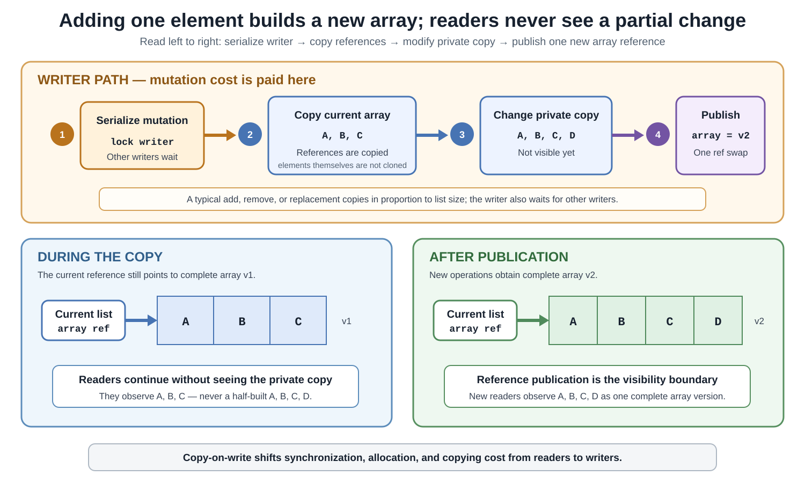

# Concurrency. CopyOnWriteArrayList

## Front

How does `CopyOnWriteArrayList` work?

Explain its copy-on-write storage, snapshot iterators, read/write costs, memory guarantees, compound-operation traps, and the workloads for which it is appropriate.

## Back

**CopyOnWriteArrayList** was introduced in **Java 5** as a thread-safe list in `java.util.concurrent`.

`CopyOnWriteArrayList<E>` is designed for **read-mostly** workloads: reads and traversals are cheap because they use a stable backing array, while a mutation normally allocates, copies, changes, and publishes a replacement array.

The trade-off is deliberate:

- Readers avoid the mutation lock and never observe a partially changed backing array.
- Writers pay for serialization, allocation, and copying.
- Iterators keep the array version that existed when they were created, so they can be stale.

The first diagram explains a write. A later diagram contrasts a frozen snapshot iterator with a weakly consistent iterator.



## Core mental model

Imagine the list as one reference to one immutable-for-readers array version:

```text
current list → array v1 [A, B, C]
```

A writer does not insert `D` into `v1`. It builds `v2` separately and then publishes the new reference:

```text
array v1 [A, B, C]       remains readable
array v2 [A, B, C, D]    built privately
current list → v2         published when complete
```

The arrays hold **references** to elements. Copying the backing array does not clone `A`, `B`, `C`, or their mutable state.

## Public guarantees versus implementation details

The Java API guarantees a thread-safe `List` whose mutative operations use copy-on-write storage. It also specifies snapshot iterators, encounter order, support for duplicate values and `null`, and the concurrent-collection memory-consistency guarantee.

The current OpenJDK implementation realizes that model with:

- A private array reference declared `volatile`.
- A stable internal object used to serialize mutations.
- Reads that obtain the current array without taking the mutation lock.
- Mutations that publish a complete replacement array.

Those field and lock choices are implementation details, not members that application code can access.

This simplified class shows the mechanism. It is an explanatory approximation, not a replacement for the JDK class:

```java
import java.util.Arrays;

final class SimplifiedCopyOnWriteList<E> {
    private final Object lock = new Object();
    private volatile Object[] array = new Object[0];

    @SuppressWarnings("unchecked")
    E get(int index) {
        Object[] snapshot = array;
        return (E) snapshot[index];
    }

    void add(E element) {
        synchronized (lock) {
            Object[] oldArray = array;
            Object[] newArray = Arrays.copyOf(
                    oldArray,
                    oldArray.length + 1
            );

            newArray[oldArray.length] = element;
            array = newArray;
        }
    }
}
```

The writer lock prevents two writers from losing one another's updates. Publishing the complete array reference allows readers to switch from one complete version to another.

## Read and write costs

Typical costs for a list of `n` elements are:

| Operation | Typical cost | Reason |
|---|---:|---|
| `get(index)` | O(1) | Array lookup in the current version |
| `size()` | O(1) | Length of the current array |
| `contains(value)` | O(n) | Linear equality search |
| Full iteration | O(n) | Traverse one fixed array |
| `add(value)` | O(n) | Allocate and copy, then append |
| `set(index, value)` | Usually O(n) | Publish an array version containing the replacement |
| `remove(...)` | O(n) | Search when needed and copy retained references |
| `addIfAbsent(value)` | O(n) | Search; copy only if an element is added |

The exact implementation may optimize special cases, so the table is a workload model rather than a public timing guarantee.

Every copied array temporarily adds allocation pressure. An old array can remain reachable while an iterator, spliterator, or other internal snapshot still refers to it. Therefore, list size, mutation frequency, and snapshot lifetime all matter.

## Snapshot iterator semantics

`iterator()` captures the list's state **when the iterator is created**. Later list changes do not alter that iterator's view.


The left panel is `CopyOnWriteArrayList`: its iterator stays on the old array. The right panel represents a different family of concurrent iterators that traverse a live structure and may observe some overlapping changes. “Snapshot” and “weakly consistent” are not synonyms.

This complete example prints the old snapshot and then the current list:

```java
import java.util.Arrays;
import java.util.Iterator;
import java.util.concurrent.CopyOnWriteArrayList;

public final class SnapshotDemo {
    public static void main(String[] args) {
        CopyOnWriteArrayList<String> names =
                new CopyOnWriteArrayList<>(
                        Arrays.asList("A", "B")
                );

        Iterator<String> snapshot = names.iterator();

        names.remove("A");
        names.add("C");

        snapshot.forEachRemaining(System.out::println);
        System.out.println(names);
    }
}
```

Output:

```text
A
B
[B, C]
```

The iterator still sees removed `A` and does not see added `C`. It does not throw `ConcurrentModificationException` because later list mutations cannot change its captured array.

Iterator and list-iterator mutation methods are unsupported:

- `Iterator.remove()`
- `ListIterator.remove()`
- `ListIterator.set(...)`
- `ListIterator.add(...)`

They throw `UnsupportedOperationException`. The spliterator is also snapshot-based and reports `IMMUTABLE`, `ORDERED`, `SIZED`, and `SUBSIZED`.

## Snapshot does not mean “latest”

Snapshot traversal provides **consistency within one traversal**, not freshness.

For a listener registry:

- A listener added during a publication is absent from the current iterator and participates in a later publication.
- A listener removed during a publication can still receive the current event because the iterator retains the old reference.

That behavior is often desirable: concurrent registration changes do not disturb an event already being delivered.

## Good use case: listener registry

```java
import java.util.concurrent.CopyOnWriteArrayList;

interface EventListener {
    void onEvent(String event);
}

final class EventBus {
    private final CopyOnWriteArrayList<EventListener> listeners =
            new CopyOnWriteArrayList<>();

    void register(EventListener listener) {
        listeners.addIfAbsent(listener);
    }

    void unregister(EventListener listener) {
        listeners.remove(listener);
    }

    void publish(String event) {
        for (EventListener listener : listeners) {
            listener.onEvent(event);
        }
    }
}
```

This fits when `publish` is frequent, registration changes are rare, and each publication should traverse one stable listener snapshot.

The callbacks themselves are outside the collection's protection. A slow callback delays the publishing thread, and a callback must provide its own thread safety when invoked concurrently.

## Atomic method versus compound sequence

Thread safety of individual calls does not make an arbitrary sequence atomic.

Inside a registry, this conceptual check-then-act fragment can add a duplicate:

```java
if (!listeners.contains(listener)) {
    listeners.add(listener);
}
```

Two threads can both observe absence before either call to `add`. Use the operation that expresses one atomic intent:

```java
listeners.addIfAbsent(listener);
```

For several candidates, `addAllAbsent(collection)` adds only values not already represented. These methods still use equality checks and can be expensive on a large list.

Do not assume that two individually thread-safe calls form one transaction. If an invariant spans multiple operations, use a higher-level lock or redesign the state transition as one operation.

## Memory-consistency guarantee

Like other concurrent collections, `CopyOnWriteArrayList` provides a happens-before handoff:

```text
producer actions before placing element in list
        ↓ concurrent-collection handoff
consumer actions after accessing or removing that element
```

Conceptual two-thread fragments:

```java
// Producer thread
message.prepare();
messages.add(message);
```

```java
// Consumer thread, after it obtains the placed element
Message received = messages.get(0);
received.consume();
```

The consumer can observe state established before the producer placed that element in the list.

This does not protect mutations performed **after** placement. The list safely stores and publishes element references; it does not recursively make the referenced objects immutable, volatile, or atomic.

## Thread-safe list, possibly unsafe elements

```java
final class MutableCounter {
    private int value;

    void increment() {
        value++; // not made atomic by being stored in the list
    }
}
```

Usage fragment:

```java
CopyOnWriteArrayList<MutableCounter> counters =
        new CopyOnWriteArrayList<>();

counters.add(new MutableCounter());
counters.get(0).increment();
```

The preceding usage fragment stores and retrieves the counter safely, but concurrent calls to `MutableCounter.increment()` are not safe. Use immutable elements or give each mutable element its own synchronization policy.

## Common traps

### Repeated writes

This method-body fragment repeatedly copies a growing array:

```java
CopyOnWriteArrayList<Integer> values =
        new CopyOnWriteArrayList<>();

for (int i = 0; i < 100_000; i++) {
    values.add(i);
}
```

When possible, build ordinary private data first and construct the concurrent list once:

```java
import java.util.ArrayList;
import java.util.List;
import java.util.concurrent.CopyOnWriteArrayList;

final class BulkInitializationDemo {
    static CopyOnWriteArrayList<Integer> createValues() {
        List<Integer> initial = new ArrayList<>();

        for (int i = 0; i < 100_000; i++) {
            initial.add(i);
        }

        return new CopyOnWriteArrayList<>(initial);
    }
}
```

Bulk mutations such as `addAll` or `removeIf` can also avoid a long series of separately published array versions.

### Indexed multi-call traversal

Each method call is safe, but separate calls may use different array versions. Conceptual anti-pattern:

```java
for (int i = 0; i < list.size(); i++) {
    use(list.get(i));
}
```

A concurrent removal can occur after `size()` but before `get(i)`, so `get` can use a shorter array and reject the index. Conceptual preferred traversal:

```java
for (Element element : list) {
    use(element);
}
```

### Long-lived snapshots

An iterator can retain an old array and references to elements already removed from the current list. Do not keep iterators or spliterators longer than the traversal requires when retained objects are large or sensitive.

### Backed views

`subList(from, to)` is a backed view, not a detached snapshot. Its API semantics become undefined if the backing list is modified by any route other than that view.

If a detached range is required, first make an ordinary copy. Conceptual range-copy fragment:

```java
List<Element> detached = new ArrayList<>(
        list.subList(from, to)
);
```

Coordinate the range selection with concurrent parent changes when an exact parent version matters.

## When to choose it

Good signals:

- Traversals vastly outnumber mutations.
- The list is small or moderate enough that full copying is acceptable.
- Stable-but-possibly-stale traversal is correct.
- Readers should not coordinate with a traversal lock.
- Registration, routing, policy, or configuration entries change rarely.

Poor signals:

- Frequent appends, removals, replacements, sorting, or filtering.
- A large list whose repeated full copies would be expensive.
- Queue semantics such as producer-consumer handoff.
- Iterators that must reflect the newest concurrent changes.
- Many long-lived iterators retaining old element references.

## Comparison with alternatives

| Requirement | Better starting point |
|---|---|
| Read-mostly ordered list with frozen traversals | `CopyOnWriteArrayList` |
| One lock around mixed list operations | `Collections.synchronizedList(...)` |
| Frequent concurrent queue insertion/removal | `ConcurrentLinkedQueue` |
| Keyed shared state with concurrent updates | `ConcurrentHashMap` |
| Data never changes after construction | Immutable `List` |
| Whole configuration replaced occasionally | Immutable list published through a safe shared reference |

A synchronized-list wrapper requires callers to synchronize on the returned list while traversing it. A `ConcurrentLinkedQueue` iterator is weakly consistent rather than a frozen snapshot. Those are different semantics, not interchangeable implementations of the same behavior.

## Review rule

```text
many reads + rare writes + acceptable stale snapshots
                         → CopyOnWriteArrayList may fit

frequent writes or large arrays
                         → copying usually dominates
```

The name describes the bargain: **copy on every content-changing write so readers can traverse stable array versions without a mutation lock.**

## Sources

- [Java SE 26 `CopyOnWriteArrayList` API](https://docs.oracle.com/en/java/javase/26/docs/api/java.base/java/util/concurrent/CopyOnWriteArrayList.html)

- [OpenJDK `CopyOnWriteArrayList` source](https://github.com/openjdk/jdk/blob/master/src/java.base/share/classes/java/util/concurrent/CopyOnWriteArrayList.java)

- [Java SE 26 `java.util.concurrent` memory-consistency properties](https://docs.oracle.com/en/java/javase/26/docs/api/java.base/java/util/concurrent/package-summary.html#MemoryVisibility)

- [Java SE 26 `Collections.synchronizedList` API](https://docs.oracle.com/en/java/javase/26/docs/api/java.base/java/util/Collections.html#synchronizedList(java.util.List))

- [Java SE 26 `ConcurrentLinkedQueue` API](https://docs.oracle.com/en/java/javase/26/docs/api/java.base/java/util/concurrent/ConcurrentLinkedQueue.html)
