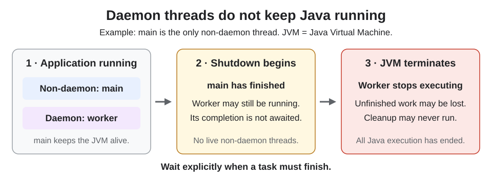

# Concurrency. Daemon thread

<sub>[Back to Java](../Readme.md#content)</sub>

# Front

What is a **daemon thread** in Java, and how does it affect application shutdown?

# Back

A **daemon thread does not keep the Java Virtual Machine (JVM) alive**. When the last live **non-daemon thread** finishes, JVM shutdown begins even if daemon threads still have work to do.

## How it works

In a normal Java application, the `main` thread is non-daemon. In this example, it is the only non-daemon thread: once it ends, the daemon worker cannot keep the application running.



## Creating a daemon

`new Thread(...)` creates a **platform thread** (typically backed by an operating-system thread). It inherits its creator's daemon status. Set that status **before `start()`**; changing it while the thread is alive throws `IllegalThreadStateException`.

```java
public class DaemonDemo {
    public static void main(String[] args) {
        Thread worker = new Thread(() ->
            System.out.println("Daemon ran"));

        worker.setDaemon(true);
        worker.start();
        System.out.println("Main finished");
    }
}
```

`Main finished` is printed, but **`Daemon ran` may or may not appear**. Starting a thread schedules its work; it does not wait for completion. If both messages appear, their order can vary.

## Why it matters

Use daemon threads for background work that may be abandoned, such as periodic monitoring. **Do not rely on a daemon to finish saving important data.** At JVM termination, remaining threads stop executing; their pending `finally` blocks and resource cleanup are not guaranteed to run.

When completion matters, arrange an explicit wait: for example, the non-daemon `main` thread can call `worker.join()` before returning, handling or declaring `InterruptedException`.

**Virtual threads are always daemon threads** and cannot be made non-daemon. They also need a caller that waits when their results matter.

# Sources

- [Java SE 25 `Thread`: platform threads, inheritance, virtual threads, `start()`, and `join()`](https://docs.oracle.com/en/java/javase/25/docs/api/java.base/java/lang/Thread.html)
- [Java SE 25 `Thread.setDaemon(boolean)`](https://docs.oracle.com/en/java/javase/25/docs/api/java.base/java/lang/Thread.html#setDaemon(boolean))
- [Java SE 25 `Runtime`: shutdown and termination](https://docs.oracle.com/en/java/javase/25/docs/api/java.base/java/lang/Runtime.html#shutdown)
- [JLS 12.8: Program Exit](https://docs.oracle.com/javase/specs/jls/se25/html/jls-12.html#jls-12.8)
