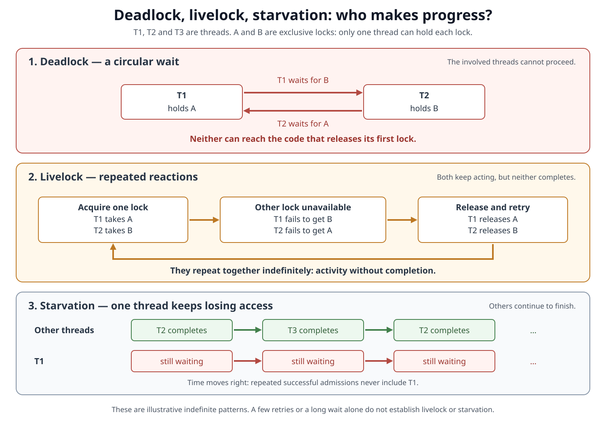
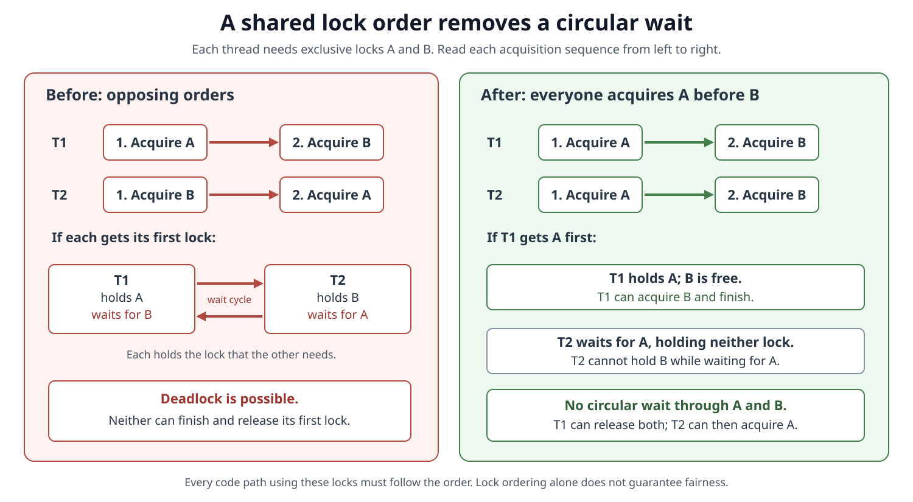
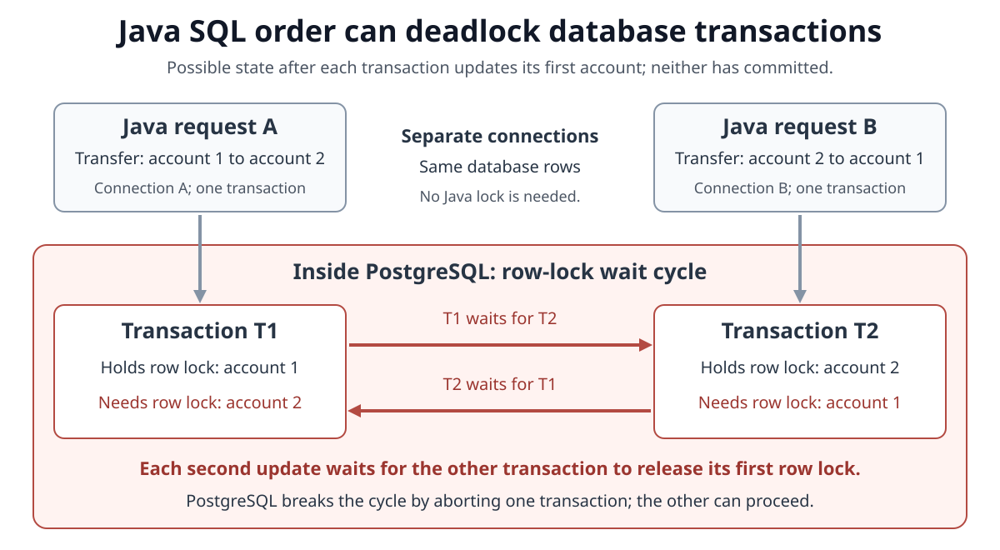

# Concurrency. Deadlock vs. Livelock vs. Starvation

<sub>[Back to Java](../Readme.md#content)</sub>

**Deadlock** means participants wait on one another in a cycle they cannot resolve themselves.

**Livelock** means they keep reacting without completing useful work.

**Starvation** means a particular participant keeps being denied the opportunity or resource it needs to progress.

The distinction is about **why work does not finish**. We will compare the three failure patterns, examine Java locks and database transactions, and connect each problem to prevention and diagnosis.

## The vocabulary of progress

An **operation** is a unit of useful work, such as updating an account or processing a request. An attempt, retry, or log message is activity; completing the operation is progress.

A **lock** controls access to a shared resource. With an exclusive lock, one thread owns it at a time. A **critical section** is the code executed while holding that lock. **Contention** occurs when multiple threads want the same resource.

Java provides intrinsic locks, also called **monitors**, through `synchronized`, and explicit locks such as `ReentrantLock`. A **reentrant** lock lets its owner acquire the same lock again. Reentrancy does not let a thread acquire a different lock owned by someone else.

**Liveness** concerns whether work can eventually progress. Two threads can correctly protect shared data with locks yet wait forever.

## Compare the failure patterns

| Problem | What prevents completion? | What are the affected participants doing? | Can other work finish? |
| --- | --- | --- | --- |
| **Deadlock** | A dependency cycle that none of the participants can resolve | Waiting for something another participant in the cycle must do | Unrelated work can continue |
| **Livelock** | Repeated reactions undo or prevent useful progress | Retrying, backing off, or changing state over and over | Unrelated work can continue |
| **Starvation** | A participant keeps missing the resource or execution opportunity it needs | Waiting, or repeatedly trying and losing | Other participants typically keep completing work |

Read each panel as an execution pattern that could continue indefinitely. The important observations are a waiting cycle, retries without completion, and completion that repeatedly excludes one caller.



A slow operation is not automatically starved, and a waiting thread is not automatically deadlocked. A finite observation can reveal a dependency cycle or a suspicious pattern; it cannot demonstrate that an unlucky caller will literally wait forever. These terms describe failure mechanisms, and their effects can overlap.

## Deadlock: nobody in the cycle can release what the next needs

Suppose two threads use the **same** `LockOrderRisk` instance. Each operation needs both monitors, but they acquire them in opposite orders. The comments mark where application work would go; this class is a compilable locking example.

```java
final class LockOrderRisk {
    private final Object a = new Object();
    private final Object b = new Object();

    void firstOperation() {
        synchronized (a) {
            synchronized (b) {
                // Work requiring both A and B.
            }
        }
    }

    void secondOperation() {
        synchronized (b) {
            synchronized (a) {
                // Work requiring both A and B.
            }
        }
    }
}
```

One permitted interleaving is:

```text
T1 enters firstOperation():  acquires A
T2 enters secondOperation(): acquires B
T1 tries to acquire B:      waits for T2
T2 tries to acquire A:      waits for T1
```

Neither thread can leave its outer `synchronized` block, so neither can release its first monitor. The code **can** deadlock; a particular run might finish if one thread acquires both monitors before the other starts. Adding `sleep()` to encourage this interleaving is unnecessary for the bug to exist.

Java releases a monitor when execution exits its `synchronized` block, including by an exception. That does not help when execution cannot reach the exit. Similarly, an explicit lock's `finally` block cannot run while its owner is indefinitely stuck acquiring another lock inside the corresponding `try`.

### The four conditions behind a resource deadlock

For the classical exclusive-resource model, deadlock requires all four **Coffman conditions**:

| Condition | Meaning in the example |
| --- | --- |
| **Mutual exclusion** | Only one thread can own A or B at a time |
| **Hold and wait** (the paper’s “wait for” condition) | Each thread retains one monitor while requesting the other |
| **No preemption** | Another thread cannot forcibly take away an owned monitor |
| **Circular wait** | T1 waits for T2, which waits for T1 |

Breaking a necessary condition prevents this kind of deadlock. Code that permits all four is at risk; it need not deadlock on every execution.

### Prevent the cycle with a consistent lock order

Require **every code path** that needs both locks to acquire A before B. In the corrected execution below, T2 waits for A while holding neither lock, leaving T1 free to acquire B and finish.



Replace `secondOperation()` in the previous class with:

```java
void secondOperation() {
    synchronized (a) {
        synchronized (b) {
            // Work requiring both A and B.
        }
    }
}
```

The reasoning generalizes: if each newly acquired distinct lock must come later in one shared ordering, a chain of waits cannot circle back to an earlier lock. All participating code must follow the order, including nested calls.

For dynamically chosen resources, use a stable, unique ordering key, such as an immutable account ID. “Lock the source, then the destination” is insufficient: transfers in opposite directions reverse that order. Another design option is one lock covering the whole operation, if the reduced concurrency is acceptable.

This prevents cycles involving the ordered locks. It does not prove that the protected work terminates or that every waiting caller gets a turn.

## Database deadlocks: Java requests can create the same cycle

A **database transaction** groups database operations into one unit that commits or rolls back. A database deadlock occurs when transactions hold locks and wait for one another in a cycle. Java can cause this through the order of its SQL statements, even without `synchronized` or `ReentrantLock`.

Use **PostgreSQL 18** as a concrete example. An `UPDATE` locks the row it changes; a competing update to that row must wait. In the transaction below, the lock remains held until commit or rollback, even after the statement finishes. `SELECT ... FOR UPDATE` can also lock rows before changing them; explicit locking is not required for a deadlock.

### Java example: transfers in opposite directions

**JDBC (Java Database Connectivity)** lets Java execute SQL through a database connection. This compilable class demonstrates the locking mechanism; business validation is omitted. Assume an `accounts` table with `id BIGINT PRIMARY KEY` and `balance_cents BIGINT NOT NULL`, two existing distinct account IDs, and a positive amount. Each call obtains its own connection from a configured `DataSource`.

```java
import java.sql.Connection;
import java.sql.PreparedStatement;
import java.sql.SQLException;
import javax.sql.DataSource;

final class DatabaseTransferRisk {
    static void transfer(DataSource dataSource, long fromId, long toId,
                         long cents) throws SQLException {
        try (Connection c = dataSource.getConnection()) {
            c.setAutoCommit(false);
            try {
                changeBalance(c, fromId, -cents); // Locks the source row.
                changeBalance(c, toId, cents);   // May wait for another transaction.
                c.commit();
            } catch (SQLException e) {
                try {
                    c.rollback();
                } catch (SQLException rollbackFailure) {
                    e.addSuppressed(rollbackFailure);
                }
                throw e;
            }
        }
    }

    private static void changeBalance(Connection c, long id, long delta)
            throws SQLException {
        try (PreparedStatement statement = c.prepareStatement(
                "UPDATE accounts SET balance_cents = balance_cents + ? WHERE id = ?")) {
            statement.setLong(1, delta);
            statement.setLong(2, id);
            if (statement.executeUpdate() != 1) {
                throw new SQLException("Account not found: " + id);
            }
        }
    }
}
```

`setAutoCommit(false)` makes both updates part of one transaction. Closing the `PreparedStatement` releases statement resources; it does not commit the transaction. Committing each update separately would destroy the transfer's all-or-nothing behavior.

Suppose two request threads concurrently call `transfer(dataSource, 1, 2, 100)` and `transfer(dataSource, 2, 1, 100)`. Their transactions, T1 and T2, can interleave as follows:

```text
T1 updates account 1: holds its row lock.
T2 updates account 2: holds its row lock.
T1 tries to update account 2: waits for T2.
T2 tries to update account 1: waits for T1. The cycle is complete.
```

Read downward from each Java request to its transaction. The red arrows point to the transaction holding the needed row lock. This is a possible schedule; another run may finish without a conflict.



The two requests could run in different Java virtual machines: they only need to reach the same database rows. Adding a Java monitor in one application instance therefore cannot coordinate every database client.

### Prevent the cycle and recover from an aborted transaction

Apply the earlier ordering rule to database access. For this example, replace the two `changeBalance` calls with the following fragment. Both directions update the smaller account ID first, while each amount still belongs to its original source or destination:

```java
long firstId = Math.min(fromId, toId);
long secondId = Math.max(fromId, toId);
changeBalance(c, firstId, firstId == fromId ? -cents : cents);
changeBalance(c, secondId, secondId == fromId ? -cents : cents);
```

Every participating path must follow that order. This removes the illustrated cycle; additional tables or locks require a consistent order too. Keep transactions short so conflicting work spends less time waiting.

PostgreSQL detects a deadlock and aborts one participant to break the cycle. The victim is not predictable. It is still a deadlock even though the database intervenes rather than letting the wait last forever.

For PostgreSQL, SQLSTATE **`40P01`** means `deadlock_detected`; JDBC exposes SQLSTATE through `SQLException.getSQLState()`. After rollback, a caller can retry the **entire transfer in a new transaction**, including any reads and decisions that belong to it. Retrying only the second update would lose the first update that was rolled back.

Put retries outside the failed transaction, limit attempts, and use randomized backoff as discussed below. Surface failure when the limit is reached. Restrict retries to recognized retryable errors. Also account for effects outside the database: rollback cannot undo an email already sent, so blindly repeating such an action can duplicate it.

## Livelock: the recovery behavior keeps recreating the conflict

Imagine two people repeatedly moving to the same side of a corridor to let each other pass. They can move, and they keep responding, but neither gets past the other.

In Java, a similar pattern can arise when callers repeatedly release locks and retry after a conflict. `tryLock()` returns immediately: `true` means the caller acquired the lock, and `false` means it did not.

This compilable example intentionally has an unbounded retry policy. Assume distinct locks and that callers hold neither on entry. One thread calls `finish(a, b)` while another calls `finish(b, a)`.

```java
import java.util.concurrent.locks.ReentrantLock;

final class RetryRisk {
    static void finish(ReentrantLock first, ReentrantLock second) {
        for (;;) {
            if (!first.tryLock()) {
                continue;
            }
            try {
                if (second.tryLock()) {
                    try {
                        // Both locks acquired: perform the operation here.
                        return;
                    } finally {
                        second.unlock();
                    }
                }
            } finally {
                first.unlock();
            }
        }
    }
}
```

Consider this possible repeating schedule. Both failed second-lock attempts occur **before either first lock is released**:

```text
T1 acquires A.                 T2 acquires B.
T1 tries B and fails.          T2 tries A and fails.
T1 releases A.                 T2 releases B.
Both retry; the same pattern repeats.
```

The threads are not indefinitely parked on each other's second lock. They repeatedly acquire, fail, and release, yet neither reaches the operation. Other schedules succeed, so this example demonstrates **a possible livelock**, not a guaranteed outcome whenever it runs.

### Improve the retry policy

Prefer removing the conflict structurally, for example with consistent ordering and blocking acquisition. When retries are appropriate, **randomized backoff** means waiting for a randomly chosen interval before another attempt. Applied after releasing held locks, it can reduce repeated collisions. Identical fixed delays can allow participants to stay in step.

Randomness alone does not give a deterministic completion guarantee. Add a retry limit or an overall deadline, then return failure or use another strategy. This bounds the application's retry policy; it does not guarantee a successful result.

A timed `tryLock(timeout, unit)` bounds one acquisition wait. Repeating timed attempts forever still permits an endless operation. With `ReentrantLock`, `lockInterruptibly()` and timed `tryLock` also allow interruption to end acquisition; cancellation must propagate or be handled, and acquired locks must be released. Ordinary entry into `synchronized` is not an interruptible lock acquisition.

## Starvation: other callers get through, but one keeps losing

Consider one shared lock that is released after each operation. T1 keeps requesting it, but the successful admissions are:

```text
T2 completes → T3 completes → T2 completes → T3 completes → ...
T1 remains pending throughout.
```

There is no need for a lock cycle or a group that repeatedly abandons its work. The service is doing useful work, but its admission policy or scheduling can keep excluding T1.

For `ReentrantLock`, the default nonfair policy does not promise an acquisition order. This permits starvation; it does **not** mean every contended nonfair lock inevitably starves a thread. Long critical sections can also deprive other callers of timely access. Inspect individual wait times alongside total throughput.

### What a fair Java lock promises

Constructing `new ReentrantLock(true)` selects a fair lock. Under contention, its policy favors the longest-waiting thread. For example:

```java
import java.util.concurrent.locks.ReentrantLock;

final class FairCounter {
    private final ReentrantLock lock = new ReentrantLock(true);
    private int value;

    int increment() {
        lock.lock();
        try {
            return ++value;
        } finally {
            lock.unlock();
        }
    }
}
```

The API documents lack of starvation for fair acquisition, but the conditions matter: holders must eventually release, and threads must get opportunities to run. Lock fairness cannot force operating-system scheduling or impose a wall-clock completion deadline. Fair locks can also reduce throughput.

**Untimed `tryLock()` ignores the fairness setting.** It may acquire an available fair lock ahead of queued callers; this is called **barging**. The timed form honors fairness, including `tryLock(0, TimeUnit.SECONDS)`, which also checks interruption. A loop around untimed `tryLock()` therefore does not become fair just because the lock was constructed with `true`.

Fairness on individual locks also cannot resolve a deadlock involving multiple locks.

## A related trap: tasks waiting for the workers they occupy

A resource need not be a monitor. Consider an executor created with `Executors.newSingleThreadExecutor()`: it runs only one task at a time and queues additional tasks.

Suppose its running parent task submits a child to that **same executor**, then calls the child's untimed `Future.get()`. With no cancellation or other intervention, the dependencies are:

```text
Parent occupies the only worker → waits for the child to finish
Child is queued                → needs that worker to become free
```

`Future.get()` waits for completion, so the parent cannot finish and free the worker for its child. This is **thread starvation deadlock**. Here the blocked group cannot progress, unlike ordinary starvation where other participants keep finishing.

The same reasoning applies to a fixed pool when all its workers wait for child tasks queued behind them. Design the dependency so a task does not occupy all execution capacity needed by its prerequisites. Increasing the pool size can postpone this failure without removing the dependency problem.

## Diagnose dependencies and completed work

A **thread dump** records thread stacks and related state. For a platform-thread investigation, replace `12345` with the Java process ID and capture:

```bash
jcmd 12345 Thread.print -l
```

The `-l` option includes information about `java.util.concurrent` locks. Compare dumps taken over time with operation completions, retry counts, and per-request waiting times.

| Evidence | What to investigate |
| --- | --- |
| A waits for B's lock while B waits for A's lock | A lock deadlock; follow ownership and acquisition dependencies |
| A request stalls in JDBC or fails with a database deadlock error | Inspect database lock dependencies and the SQL order within each transaction |
| Attempts keep increasing but the affected operations never complete | Livelock or another retry failure; inspect why each attempt restarts |
| Overall completions increase while one request keeps waiting | Starvation or severe unfairness; inspect admission and resource access |

`Thread.State.BLOCKED` specifically means waiting to acquire a monitor. A thread parked while waiting for a `ReentrantLock` can instead appear as `WAITING`; there is no `DEADLOCKED` thread state. A livelocking retry loop can appear as `RUNNABLE`, but that state does not prove it is making useful progress. Backoff can also put a livelocking participant temporarily to sleep.

### Programmatic detection has a defined scope

This complete diagnostic class uses the Java management API. Run it **inside the application being diagnosed**; running it as a separate program only examines that separate Java virtual machine.

```java
import java.lang.management.ManagementFactory;
import java.lang.management.ThreadMXBean;
import java.util.Arrays;

final class DeadlockProbe {
    static void report() {
        ThreadMXBean bean = ManagementFactory.getThreadMXBean();
        long[] ids = bean.isSynchronizerUsageSupported()
                ? bean.findDeadlockedThreads()
                : bean.findMonitorDeadlockedThreads();

        System.out.println(ids == null
                ? "No supported lock cycle detected"
                : "Deadlocked platform thread IDs: " + Arrays.toString(ids));
    }
}
```

In **JDK 25**, `findDeadlockedThreads()` detects cycles involving platform threads acquiring monitors or ownable synchronizers, such as the synchronization mechanism used by `ReentrantLock`. The fallback checks monitor cycles only.

Cycles involving virtual threads are excluded. These methods also do not diagnose database lock cycles, livelock, starvation, or arbitrary task dependencies such as the executor example. Consequently, a `null` result is not proof of application liveness.

For the database example, inspect the database's deadlock error details and correlate them with application requests and transaction boundaries. PostgreSQL's `pg_locks` view helps investigate current lock contention. Once the database aborts a victim, the original cycle is gone, so a later snapshot may no longer show it.

## Choose the remedy that addresses the cause

| Cause | Design response | Remaining limit |
| --- | --- | --- |
| Circular lock dependencies | Establish and follow a consistent lock order, or use one lock | Protected work still needs to finish |
| Database transactions acquire conflicting locks in opposite orders | Use consistent row/table access order and short transactions; retry an aborted transaction with a bounded policy | Ordering must cover all participating paths; retries must handle external effects safely |
| Recurring conflicts during retries | Remove the conflict; otherwise use backoff and a bounded retry policy | Timing changes alone do not prove successful completion |
| Repeatedly bypassed callers | Use an appropriate fair admission policy and shorten critical sections | Fairness does not control scheduling or fix multi-lock cycles |
| Tasks consume the execution capacity their dependencies need | Restructure the task dependency and execution arrangement | More workers alone do not establish a progress guarantee |

For the formal distinction between progress for some caller and progress for every caller, continue with [Concurrency. Progress Guarantees](../Concurrency.%20Progress%20Guarantees/Readme.md).

# Sources

- [Oracle Java Tutorials — Liveness](https://docs.oracle.com/javase/tutorial/essential/concurrency/liveness.html)

  Progress terminology; the tutorial targets JDK 8.

- [Oracle Java Tutorials — Deadlock](https://docs.oracle.com/javase/tutorial/essential/concurrency/deadlock.html)

  Mutually dependent waits and Java monitor examples.

- [Oracle Java Tutorials — Starvation and Livelock](https://docs.oracle.com/javase/tutorial/essential/concurrency/starvelive.html)

  Denied resource access and repeated reactions without progress.

- [Coffman, Elphick, and Shoshani — System Deadlocks (1971), pp. 70–73](https://uobdv.github.io/Design-Verification/Supplementary/System_Deadlocks-Four_necessary_and_sufficient_conditions_for_deadlock.pdf)

  The four necessary conditions and prevention through resource ordering.

- [Oracle Multithreaded Programming Guide — Avoiding Deadlock](https://docs.oracle.com/cd/E37838_01/html/E61057/guide-35930.html)

  Lock hierarchy and consistent acquisition order; its examples use POSIX threads.

- [PostgreSQL 18 — Explicit Locking](https://www.postgresql.org/docs/18/explicit-locking.html#LOCKING-DEADLOCKS)

  Row locks, implicit locking by updates, transaction deadlocks, and victim selection.

- [PostgreSQL 18 — Serialization Failure Handling](https://www.postgresql.org/docs/18/mvcc-serialization-failure-handling.html)

  Deadlock SQLSTATE `40P01` and retrying the complete transaction, including its decision logic.

- [MySQL 8.4 Reference Manual — How to Minimize and Handle Deadlocks](https://dev.mysql.com/doc/refman/8.4/en/innodb-deadlocks-handling.html)

  Consistent row/table access order and short transactions as general prevention techniques.

- [Java SE 25 API — Connection](https://docs.oracle.com/en/java/javase/25/docs/api/java.sql/java/sql/Connection.html)

  JDBC transaction boundaries, auto-commit, commit, and rollback.

- [Java SE 25 API — PreparedStatement](https://docs.oracle.com/en/java/javase/25/docs/api/java.sql/java/sql/PreparedStatement.html)

  Parameter binding and executing the example's updates.

- [Java SE 25 API — Statement.close()](https://docs.oracle.com/en/java/javase/25/docs/api/java.sql/java/sql/Statement.html#close())

  Statement resource cleanup, distinct from the connection's transaction boundary.

- [Java SE 25 API — SQLException](https://docs.oracle.com/en/java/javase/25/docs/api/java.sql/java/sql/SQLException.html)

  Accessing the SQLSTATE reported by the database.

- [PostgreSQL 18 — Viewing Locks](https://www.postgresql.org/docs/18/monitoring-locks.html)

  Investigating current contention using `pg_locks`.

- [Charles E. Leiserson — A Simple Deterministic Algorithm for Guaranteeing the Forward Progress of Transactions (2015)](https://transact2015.cse.lehigh.edu/leiserson-transact-2015.pdf)

  Probabilistic retry backoff contrasted with a deterministic bounded-retry algorithm.

- [Java Language Specification, Java SE 25, Chapter 17 — Threads and Locks](https://docs.oracle.com/javase/specs/jls/se25/html/jls-17.html)

  Monitor ownership, reentrancy, release, interruption, and sleep semantics.

- [Java SE 25 API — Lock](https://docs.oracle.com/en/java/javase/25/docs/api/java.base/java/util/concurrent/locks/Lock.html)

  Acquisition modes and explicit release discipline.

- [Java SE 25 API — ReentrantLock](https://docs.oracle.com/en/java/javase/25/docs/api/java.base/java/util/concurrent/locks/ReentrantLock.html)

  Fairness, barging, timed acquisition, interruption, and throughput tradeoffs.

- [Java SE 25 API — Executors](https://docs.oracle.com/en/java/javase/25/docs/api/java.base/java/util/concurrent/Executors.html)

- [Java SE 25 API — Future](https://docs.oracle.com/en/java/javase/25/docs/api/java.base/java/util/concurrent/Future.html)

  The worker-capacity example follows from queued execution and blocking completion waits.

- [Java SE 25 API — ThreadPoolExecutor](https://docs.oracle.com/en/java/javase/25/docs/api/java.base/java/util/concurrent/ThreadPoolExecutor.html)

  Queuing, pool capacity, and lockups from internal task dependencies.

- [Goetz et al. — Java Concurrency in Practice, publisher sample and index](https://ptgmedia.pearsoncmg.com/images/9780321349606/samplepages/9780321349606.pdf#page=82)

  The index uses “thread starvation deadlock” and points to the discussion on book pages 168–169.

- [Java SE 25 API — Thread.State](https://docs.oracle.com/en/java/javase/25/docs/api/java.base/java/lang/Thread.State.html)

  Meanings of Java thread states.

- [Java SE 25 API — ThreadMXBean](https://docs.oracle.com/en/java/javase/25/docs/api/java.management/java/lang/management/ThreadMXBean.html)

  Supported deadlock detection and exclusion of virtual threads.

- [JDK 25 Tool Specifications — jcmd](https://docs.oracle.com/en/java/javase/25/docs/specs/man/jcmd.html)

  `Thread.print` and lock information.
