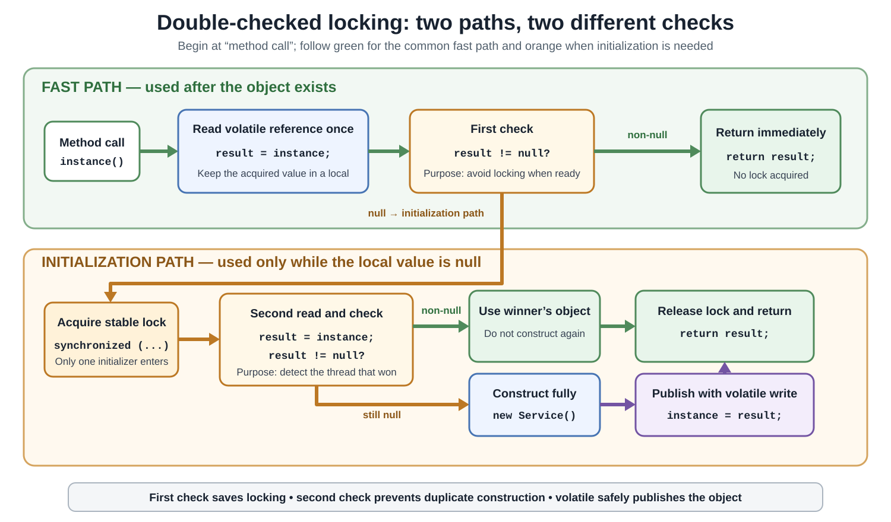
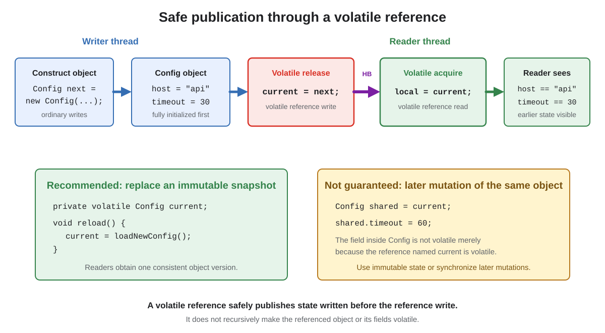

# Concurrency. Double-checked locking

## Front

What is **double-checked locking** in Java?

Explain why it needs two null checks, why the shared reference must be `volatile`, what each synchronization mechanism guarantees, and which simpler alternatives are usually preferable.

## Back

**Double-checked locking (DCL) is a lazy-initialization pattern that avoids acquiring a lock after a shared object has been initialized.**

A correct Java implementation needs all of these parts:

```text
shared reference declared VOLATILE
        +
stable shared lock
        +
check before locking
        +
check again while holding the lock
        +
construct completely before publishing
```

The first diagram shows the control flow. The second visual later explains why the `volatile` publication makes the constructed state visible to other threads.



## Correct implementation

This is a complete, compilable static-lazy example:

```java
final class Service {
    private final String endpoint;

    Service(String endpoint) {
        this.endpoint = endpoint;
    }

    String endpoint() {
        return endpoint;
    }
}

final class ServiceProvider {
    private static volatile Service instance;

    private ServiceProvider() {
    }

    static Service instance() {
        Service result = instance;       // volatile read

        if (result == null) {            // first check: fast path
            synchronized (ServiceProvider.class) {
                result = instance;       // second volatile read

                if (result == null) {    // second check: one initializer
                    result = new Service("https://api.example");
                    instance = result;   // volatile write: publish
                }
            }
        }

        return result;
    }
}
```

The field is initially `null`. The intended lifecycle is one-way:

```text
uninitialized: instance == null
              ↓ one successful initialization
initialized:   instance refers to one safely published Service
```

## Vocabulary

- **Lazy initialization** creates a value only when code first asks for it.
- **Publication** makes a reference available to another thread.
- **Safe publication** also guarantees that the receiving thread can observe the state written before publication.
- The **fast path** is the common path after initialization: read the reference and return it without locking.
- A Java `synchronized` block acquires and later releases a monitor. Only one thread at a time can hold that monitor.

## What the two execution paths do

On the initialized fast path, the method performs a volatile read into `result`. When that local value is non-null, the method returns immediately and never enters the `synchronized` block.

When the first read produces `null`, the caller acquires the class monitor. It then reads `instance` again because another thread may have initialized it while this caller waited for the lock. Only a thread that still observes `null` constructs and publishes the service.

## Why the first check exists

```java
Service result = instance;

if (result == null) {
    synchronized (ServiceProvider.class) {
        // uncommon initialization path
    }
}
```

The outer check is the optimization. Once initialization has finished, callers pay for a volatile read but do not acquire the initialization monitor.

Removing the outer check can still produce correct lazy initialization:

```java
static Service instance() {
    synchronized (ServiceProvider.class) {
        if (instance == null) {
            instance = new Service("https://api.example");
        }
        return instance;
    }
}
```

However, that is an **always-synchronized accessor**, not double-checked locking. Every call acquires the monitor.

## Why the second check exists

Several callers may pass the first check before any one of them acquires the lock:

```text
Thread A                         Thread B
reads null                      reads null
acquires lock                   waits
constructs and publishes
releases lock
                                acquires lock
                                reads again → now non-null
```

The lock prevents concurrent construction, but waiting for a lock does not erase Thread B's earlier observation. Thread B must check the field again after acquiring the lock.

Without the inner check, every thread that previously observed `null` could construct another service after it eventually enters the monitor. The second check is therefore the **exactly-one-initializer check**.

## Why non-volatile DCL is broken

This version has a data race:

```java
final class BrokenProvider {
    private static Service instance; // not volatile

    static Service instance() {
        if (instance == null) {      // unsynchronized read
            synchronized (BrokenProvider.class) {
                if (instance == null) {
                    instance = new Service("https://api.example");
                }
            }
        }
        return instance;
    }
}
```

The initializing thread writes `instance`, while a fast-path thread reads it without using either a volatile access or the same monitor. Those conflicting accesses are not ordered by a **happens-before** relationship, so they form a data race.

It is tempting to say only that “assignment may be reordered before construction.” That is useful intuition, but the precise problem is broader: the Java Memory Model gives the unsynchronized reader no safe-publication guarantee. A reader may observe a non-null reference without being guaranteed to observe all ordinary writes that established the object's state.

The writer's monitor release does not help a fast-path reader that skips the monitor. Monitor ordering connects an unlock only to a later lock of the **same** monitor.

## Why `volatile` fixes publication

```java
private static volatile Service instance;
```

The Java Memory Model states that a write to a volatile field happens-before every subsequent read of that same field. In DCL, that rule joins the constructor's ordinary writes to the reader's later use:

```text
constructor writes Service fields
        ↓ program order
release write: instance = result
        ↓ synchronizes-with
subsequent acquire read: result = instance
        ↓ program order
reader uses the Service
```

Happens-before is transitive. Therefore, a thread that obtains the published reference through the volatile read is guaranteed to observe state written before the volatile publication.



Read the visual from left to right. Construction finishes before the release write. A subsequent acquire read of the same volatile reference receives the earlier state.

This does **not** mean every read must return the latest value by wall-clock time. The guarantee applies when the volatile read observes the volatile publication being discussed, or a later write in the volatile synchronization order.

## What each mechanism contributes

| Mechanism | Job in DCL | What it does not provide alone |
|---|---|---|
| First check | Avoids locking on the initialized fast path | Does not stop two callers from observing `null` |
| Stable monitor | Allows only one initialization attempt inside the critical section at a time | Does not publish to a reader that skips the monitor |
| Second check | Detects that a waiting thread lost the initialization race | Does not safely publish to the lock-free fast path |
| `volatile` reference | Connects construction writes to subsequent fast-path reads | Does not make check-then-act an atomic operation |
| Local variable | Keeps one acquired reference and avoids repeated volatile reads | Is not a synchronization mechanism by itself |

The lock and `volatile` solve different problems:

- The lock provides **mutual exclusion** during initialization.
- The volatile write/read pair provides **safe publication** to callers that do not lock.

## Why `volatile` alone is insufficient

```java
private static volatile Service instance;

static Service instance() {
    if (instance == null) {
        instance = new Service("https://api.example");
    }
    return instance;
}
```

This publishes each assigned reference safely, but the compound action “check null, then create, then assign” is not atomic:

```text
Thread A reads null
Thread B reads null
Thread A constructs Service A
Thread B constructs Service B
Thread A publishes A
Thread B publishes B
```

The synchronized block is required when construction must occur at most once successfully. Visibility is not the same as atomicity.

## Why use a local variable?

```java
Service result = instance;
```

The local variable has three practical benefits:

- It performs one volatile read on the initialized path.
- It returns the exact reference acquired by that read.
- It makes the publication/acquisition point visible in the code.

A shorter two-check form is also correct when `instance` is volatile:

```java
static Service instance() {
    if (instance == null) {
        synchronized (ServiceProvider.class) {
            if (instance == null) {
                instance = new Service("https://api.example");
            }
        }
    }
    return instance;
}
```

The local-variable form simply avoids repeated volatile reads and is easier to reason about if future edits add another field access.

## Construction and later mutation are separate problems

The volatile assignment must occur only after construction completes:

```java
Service created = new Service("https://api.example");
instance = created; // publish only after the constructor returned
```

Do not let `this` escape from the constructor through a callback, registry, started thread, or other shared location. A later volatile assignment cannot repair a separate premature publication that already exposed the object.

DCL safely publishes the object's **initial state**. It does not automatically make later mutations thread-safe:

```java
final class Service {
    private int requestCount;

    void recordRequest() {
        requestCount++; // still a non-atomic shared update
    }
}
```

The returned object still needs its own policy: immutability, synchronization, atomic fields, thread confinement, or suitable concurrent data structures.

## Initialization failure and reset

If `new Service(...)` throws before `instance = result`, the field remains `null`. A later call can try again. That may repeat constructor side effects, so failed construction needs an explicit cleanup and retry policy.

DCL is easiest to reason about as a one-way transition from `null` to one non-null value. Adding `instance = null` as a reset creates a lifecycle race: existing callers may still use the old object while another caller constructs or closes a replacement. Use an explicit lifecycle abstraction when replacement is required.

## Prefer simpler initialization when it fits

For a static lazy value, the initialization-on-demand holder idiom is usually clearer:

```java
final class HolderBasedProvider {
    private HolderBasedProvider() {
    }

    private static final class Holder {
        private static final Service INSTANCE =
                new Service("https://api.example");
    }

    static Service instance() {
        return Holder.INSTANCE;
    }
}
```

`Holder` is initialized on its first active use. Java's class-initialization procedure coordinates concurrent callers and preserves the required happens-before orderings. No handwritten DCL is needed.

Its failure behavior differs from DCL: if class initialization fails, the class is marked erroneous rather than treating the value as an ordinary `null` field that later calls retry.

Other choices:

| Need | Usually simplest choice |
|---|---|
| Laziness is unnecessary | `private static final Service INSTANCE = ...;` |
| Static lazy initialization | Initialization-on-demand holder |
| Lazy initialization where locking cost is acceptable | Synchronized accessor |
| Lifecycle, configuration, and test substitution | Dependency-injection container |
| Specialized, frequently called lazy field with measured need | Correct DCL |

Choose DCL for its exact requirement—lazy publication with a lock-free initialized path—not merely because it is a well-known pattern.

## Common misconceptions

- **“The first check makes it thread-safe.”** No. It only selects the fast path.
- **“The lock makes non-volatile DCL safe.”** No. Fast-path readers do not acquire that lock.
- **“Volatile means only one object is constructed.”** No. The inner locked check provides that property.
- **“The second check is redundant.”** No. A thread can wait after already observing `null`.
- **“A safely published singleton is automatically thread-safe.”** No. Later mutable state needs separate synchronization.
- **“A missing outer check is broken.”** No. It becomes ordinary synchronized lazy initialization.

## Review rule

```text
first check  → performance: skip the lock after initialization
lock         → mutual exclusion: one initializer at a time
second check → correctness: do not repeat a winner's initialization
publication  → safe visibility: constructor state reaches fast-path readers
```

If any one of those meanings is unclear in a code review, prefer a holder, a static field, a synchronized accessor, or a managed dependency instead.

## Sources

- [Java Language Specification §17.4.4 — Synchronization Order](https://docs.oracle.com/javase/specs/jls/se26/html/jls-17.html#jls-17.4.4)

- [Java Language Specification §17.4.5 — Happens-before Order](https://docs.oracle.com/javase/specs/jls/se26/html/jls-17.html#jls-17.4.5)

- [Java Language Specification §8.3.1.4 — `volatile` Fields](https://docs.oracle.com/javase/specs/jls/se26/html/jls-8.html#jls-8.3.1.4)

- [Java Language Specification §12.4.1 — When Class Initialization Occurs](https://docs.oracle.com/javase/specs/jls/se26/html/jls-12.html#jls-12.4.1)

- [Java Language Specification §12.4.2 — Detailed Class Initialization Procedure](https://docs.oracle.com/javase/specs/jls/se26/html/jls-12.html#jls-12.4.2)
