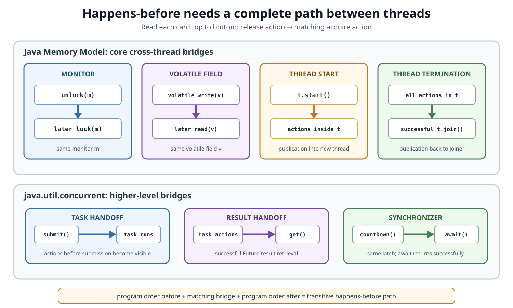

# Concurrency. Happens-before

## Front

What does *happens-before* mean in the Java Memory Model, how is a cross-thread path created, and why does it guarantee visibility without automatically guaranteeing atomicity?

## Back

**Happens-before is a partial order between actions: if A happens-before B, A's effects are visible to and ordered before B.**

To reason about code, build a complete path from the writer's action to the reader's action using program order, a matching cross-thread synchronization edge, and transitivity. Then separately ask whether the overall operation must also be atomic.

Happens-before is not wall-clock time and not one global order shared by every thread.

## Vocabulary

- An **action** is an operation relevant to the memory model, such as reading or writing a shared field, locking, unlocking, or accessing a volatile field.
- **Program order** orders actions within one thread according to that thread's single-threaded semantics.
- **Synchronization actions** include monitor locks/unlocks, volatile accesses, and thread lifecycle actions.
- A **synchronizes-with** edge is a specified bridge from a synchronization action in one thread to a matching action in another.
- The source of such an edge is a **release**; the destination is an **acquire**.
- **Transitivity** means that if A happens-before B and B happens-before C, then A happens-before C.

The core construction is:

```text
program order + synchronizes-with edges + transitivity
                         ↓
                 happens-before path
```

The diagram maps the most common language-level and library-level bridges:



## Core Java Memory Model rules

| Release or earlier action | Acquire or later action |
|---|---|
| An action in a thread | Every later action in that thread's program order |
| Unlock monitor `m` | Every subsequent lock of the same monitor `m` |
| Write volatile field `v` | Every subsequent read of the same volatile field `v` |
| Action that starts thread `t` | The first action in `t`; therefore `start()` happens-before all actions in `t` |
| Final action in thread `t` | An action in another thread that detects `t`'s termination; a successful `join()` is the usual case |
| `t.interrupt()` | Another thread detecting that `t` was interrupted |
| Default write of `0`, `false`, or `null` | The first action of every thread |

The same identity matters. Unlocking one monitor does not publish to a lock on another monitor, and writing one volatile field does not create the volatile edge through a different field.

## Worked example: volatile publication

Here the volatile `ready` flag publishes an earlier ordinary write to `answer`:


```java
final class PublishedData {
    private int answer;
    private volatile boolean ready;

    void publish() {            // Thread A
        answer = 42;            // 1. ordinary write
        ready = true;           // 2. volatile write (release)
    }

    int readIfReady() {         // Thread B
        if (!ready) {           // 3. volatile read (acquire)
            return -1;
        }
        return answer;          // 4. guaranteed to observe 42
    }
}
```

The path is:

1. `answer = 42` happens-before `ready = true` by Thread A's program order.
2. The volatile write to `ready` happens-before a subsequent volatile read of the same field.
3. The volatile read happens-before the read of `answer` by Thread B's program order.
4. By transitivity, the write of `answer` happens-before its read.

The implementation may optimize or physically reorder instructions if every observable result still respects this relation. Happens-before constrains legal observations; it is not a demand for literal hardware execution order.

### Without the volatile edge

If `ready` is an ordinary field, the conflicting accesses are not connected across threads. The reader is not guaranteed to observe the writes as intended: it may still see `ready == false`, or may see `ready == true` without the required publication of `answer`.

Running the writer “first,” sleeping, or observing log timestamps does not create a memory-model edge.

## Monitor locking

Exiting a `synchronized` block unlocks its monitor. That unlock happens-before a subsequent lock of the **same monitor**:

```java
final class LockedBox {
    private final Object monitor = new Object();
    private int value;

    void set(int newValue) {
        synchronized (monitor) {
            value = newValue;
        } // release monitor
    }

    int get() {
        synchronized (monitor) { // acquire same monitor
            return value;
        }
    }
}
```

The monitor provides both a visibility/order edge and **mutual exclusion**: only one thread at a time executes a region guarded by that monitor.

Synchronizing only the writer, only the reader, or using different monitor objects does not form the required pair.

## Thread lifecycle edges

`Thread.start()` publishes state into a new thread. All actions before the call happen-before actions that the started thread performs.

`Thread.join()` publishes results back. All actions in a worker happen-before another thread successfully returns from `join()` on that worker.

```java
final class JoinExample {
    static int calculate() throws InterruptedException {
        int[] result = {0};

        Thread worker = new Thread(() -> result[0] = 42);
        worker.start();
        worker.join();

        return result[0]; // guaranteed to be 42
    }
}
```

The array itself is not thread-safe. This particular handoff is safe because the worker writes before termination and the caller reads only after `join()` returns successfully.

`start()` is one-directional into the worker; it does not publish the worker's later results back. `join()` provides the reverse handoff.

## Higher-level `java.util.concurrent` edges

Library contracts build happens-before relationships into common handoffs:

| Actions before… | Happen-before actions after… |
|---|---|
| Placing an object into a concurrent collection | Another thread accesses or removes that element |
| Submitting a `Runnable` or `Callable` | The task begins execution |
| An asynchronous computation represented by `Future` | Another thread retrieves its result with `Future.get()` |
| `Lock.unlock()` | A successful later `Lock.lock()` on the same lock |
| `Semaphore.release()` | A successful later `Semaphore.acquire()` on the same semaphore |
| `CountDownLatch.countDown()` | A successful corresponding return from `await()` after the count reaches zero |
| One thread's successful `Exchanger.exchange()` | Actions after the matching exchange in the other thread |
| Arrival at `CyclicBarrier` or `Phaser` | Actions after successful passage through the corresponding phase, via the documented barrier chain |

These are API guarantees, not accidental properties of a particular implementation. The pairing and successful acquire matter: for example, a timed `await()` that returns because of timeout does not claim the successful latch handoff.

### Executor and Future form two handoffs

```java
int[] state = {0};
state[0] = 42;

Future<Integer> future = executor.submit(() -> state[0]);
int result = future.get();
```

Conceptually:

- actions before `submit()` happen-before the task begins;
- task actions happen-before actions after successful `get()`.

The snippet assumes a declared `ExecutorService executor` and the usual checked-exception handling.

## What does not publish data

These operations do not create a happens-before handoff by themselves:

- `Thread.sleep()` or `Thread.yield()`;
- waiting for an amount of wall-clock time;
- logging, printing, or observing that one message appeared first;
- reading and writing an ordinary shared flag;
- locking a different monitor or `Lock` object;
- a failed `tryLock()` or an acquire operation that did not succeed.

`notify()` is also not the whole publication mechanism. A notifying thread must eventually unlock the object's monitor, and a waiting thread reacquires that same monitor before `wait()` returns. The unlock/lock pair carries visibility. The condition must still be tested in a loop because wakeups may be spurious.

## Happens-before and data races

Two accesses **conflict** when they access the same variable and at least one is a write. If conflicting accesses are not ordered by happens-before, the program has a **data race**.

```text
same variable + at least one write + no happens-before ordering
                              ↓
                           data race
```

A program is **correctly synchronized** when its sequentially consistent executions contain no data races. The Java Memory Model then guarantees that all its executions appear sequentially consistent: as if actions from all threads were interleaved in one order that respects each thread's program order.

This data-race-free guarantee makes properly synchronized programs understandable without modeling every compiler and CPU reordering.

It does not remove higher-level logic errors. A program can have no low-level data race yet still have the wrong check-then-act behavior.

## Visibility, ordering, and atomicity are different

| Property | Question it answers |
|---|---|
| **Visibility** | Are earlier effects guaranteed to be observable here? |
| **Ordering** | Which observations must be treated as occurring before others? |
| **Atomicity** | Can another thread observe or intervene inside this operation? |
| **Mutual exclusion** | Can more than one thread enter this protected region? |

A volatile write/read pair gives ordering and visibility, not mutual exclusion. Therefore:

```java
volatile int count;
count++; // read + add + write: not one atomic operation
```

Likewise, two individually thread-safe calls do not automatically form one atomic transaction:

```java
if (!map.containsKey(key)) {
    map.put(key, value); // another thread can act between the calls
}
```

Use a compound API such as `putIfAbsent()` or `computeIfAbsent()` when its semantics match the invariant, or guard the whole operation with a lock.

## Important limits

- Happens-before is a **partial** order; unrelated actions may have no edge.
- A path to Thread B does not automatically order observations in Thread C.
- The relation makes earlier effects visible, but an intervening later write can affect which value a read returns.
- A volatile edge requires the same field; a monitor or explicit-lock edge requires the same synchronization object.
- Publication makes an object's earlier state visible; it does not make later unsynchronized mutation safe.
- `final` fields have additional initialization-safety rules, but those rules do not make the entire object immutable or all later writes safe.

## One-sentence mental model

> To publish a write from Thread A to Thread B, trace an unbroken path: writer program order → matching release/acquire bridge → reader program order; then use transitivity to prove the write happens-before the read.

## Sources

- [Java Language Specification §17.4 — Memory Model](https://docs.oracle.com/javase/specs/jls/se26/html/jls-17.html#jls-17.4)

  Defines actions, program order, synchronization order, legal executions, conflicting accesses, and the data-race-free guarantee.

- [Java Language Specification §17.4.5 — Happens-before Order](https://docs.oracle.com/javase/specs/jls/se26/html/jls-17.html#jls-17.4.5)

  Defines happens-before, transitivity, and the derived monitor, volatile, `start()`, and `join()` rules.

- [Java SE 26 `java.util.concurrent` memory-consistency properties](https://docs.oracle.com/en/java/javase/26/docs/api/java.base/java/util/concurrent/package-summary.html#MemoryVisibility)

  Specifies handoffs for concurrent collections, executors, futures, synchronizers, exchangers, barriers, and phasers.

- [Java SE 26 `Lock` API — memory synchronization](https://docs.oracle.com/en/java/javase/26/docs/api/java.base/java/util/concurrent/locks/Lock.html#MemorySync)

  Specifies monitor-equivalent memory effects for successful explicit lock and unlock operations.

- [Java SE 26 `CountDownLatch` API](https://docs.oracle.com/en/java/javase/26/docs/api/java.base/java/util/concurrent/CountDownLatch.html)

  Specifies the `countDown()` to successful `await()` memory-consistency effect.
